# UE5_Lyra学习指南_106_击杀记录

本文章仅为小刚-B站课堂-虚幻引擎视频课程Lyra-精讲的演讲手稿.  
本套课程链接:[[UE5]虚幻引擎游戏案例Lyra精讲](https://www.bilibili.com/cheese/play/ss112001159)  
前置课程链接:[[UE5]虚幻引擎UEC++从基础到进阶](https://www.bilibili.com/cheese/play/ss28043)  

文章内容由小刚撰写,采用了以下多种方式:  
1.口述转文字  
2.AI重构  
3.参考引擎源码  
4.Lyra工程源码  
5.结合社区论坛各位大佬的解析  

- [UE5\_Lyra学习指南\_106\_击杀记录](#ue5_lyra学习指南_106_击杀记录)
	- [概述](#概述)
	- [歼灭标准信息的传递](#歼灭标准信息的传递)
	- [消息组件父类](#消息组件父类)
	- [助攻处理](#助攻处理)
	- [瞬杀处理](#瞬杀处理)
	- [连杀处理](#连杀处理)
	- [顶部荣誉信息播报](#顶部荣誉信息播报)
	- [击杀通知](#击杀通知)
			- [构建信息Obejct](#构建信息obejct)
			- [设置样式](#设置样式)
			- [定时隐退](#定时隐退)
	- [助攻和歼灭得分](#助攻和歼灭得分)
	- [总结](#总结)


## 概述
本节主要讲解击杀信息是如何从生命值组件传递出来,并在各个地方接收响应的.
注意,我们不在这里强调死亡流程,死亡技能,死亡特效等!前面已经详细介绍过了.
主要介绍的是死亡传递的标准信息,用于显示左下角的击杀记录,瞬杀或连杀的荣誉,击杀死亡助攻的得分处理内容!
## 歼灭标准信息的传递
生成***Lyra.Elimination.Message***
``` cpp
UE_DEFINE_GAMEPLAY_TAG_STATIC(TAG_Lyra_Elimination_Message, "Lyra.Elimination.Message");
```
``` cpp
void ULyraHealthComponent::HandleOutOfHealth(AActor* DamageInstigator, AActor* DamageCauser, const FGameplayEffectSpec* DamageEffectSpec, float DamageMagnitude, float OldValue, float NewValue)
{
	//只在服务器上处理!
#if WITH_SERVER_CODE
	if (AbilitySystemComponent && DamageEffectSpec)
	{
		// Send the "GameplayEvent.Death" gameplay event through the owner's ability system.  This can be used to trigger a death gameplay ability.
		// 通过对象的能力系统发送“GameplayEvent.Death”这一游戏事件。此操作可用于触发死亡类游戏能力。
		{
			FGameplayEventData Payload;
			Payload.EventTag = LyraGameplayTags::GameplayEvent_Death;
			Payload.Instigator = DamageInstigator;
			Payload.Target = AbilitySystemComponent->GetAvatarActor();
			Payload.OptionalObject = DamageEffectSpec->Def;
			Payload.ContextHandle = DamageEffectSpec->GetEffectContext();
			Payload.InstigatorTags = *DamageEffectSpec->CapturedSourceTags.GetAggregatedTags();
			Payload.TargetTags = *DamageEffectSpec->CapturedTargetTags.GetAggregatedTags();
			Payload.EventMagnitude = DamageMagnitude;

			FScopedPredictionWindow NewScopedWindow(AbilitySystemComponent, true);
			AbilitySystemComponent->HandleGameplayEvent(Payload.EventTag, &Payload);
		}

		// Send a standardized verb message that other systems can observe
		// 发送一条标准化的动词信息，以便其他系统能够进行观察
		{
			FLyraVerbMessage Message;
			Message.Verb = TAG_Lyra_Elimination_Message;
			Message.Instigator = DamageInstigator;
			Message.InstigatorTags = *DamageEffectSpec->CapturedSourceTags.GetAggregatedTags();
			Message.Target = ULyraVerbMessageHelpers::GetPlayerStateFromObject(AbilitySystemComponent->GetAvatarActor());
			Message.TargetTags = *DamageEffectSpec->CapturedTargetTags.GetAggregatedTags();
			//@TODO: Fill out context tags, and any non-ability-system source/instigator tags
			//@TODO: Determine if it's an opposing team kill, self-own, team kill, etc...

			//@待办事项：填写情境标签，以及任何非能力系统来源/发起者标签
			//@待办事项：确定这是对方队伍击杀、自身失误击杀还是团队击杀等情况。
			UGameplayMessageSubsystem& MessageSystem = UGameplayMessageSubsystem::Get(GetWorld());
			MessageSystem.BroadcastMessage(Message.Verb, Message);
		}

		//@TODO: assist messages (could compute from damage dealt elsewhere)?
		//@待办事项：辅助信息提示（是否可以从其他地方计算得出造成的伤害值？）
	}

#endif // #if WITH_SERVER_CODE
}

```

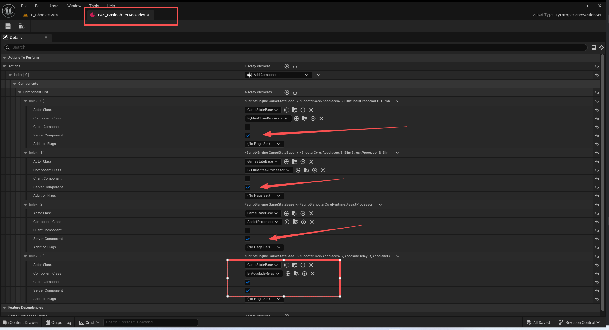

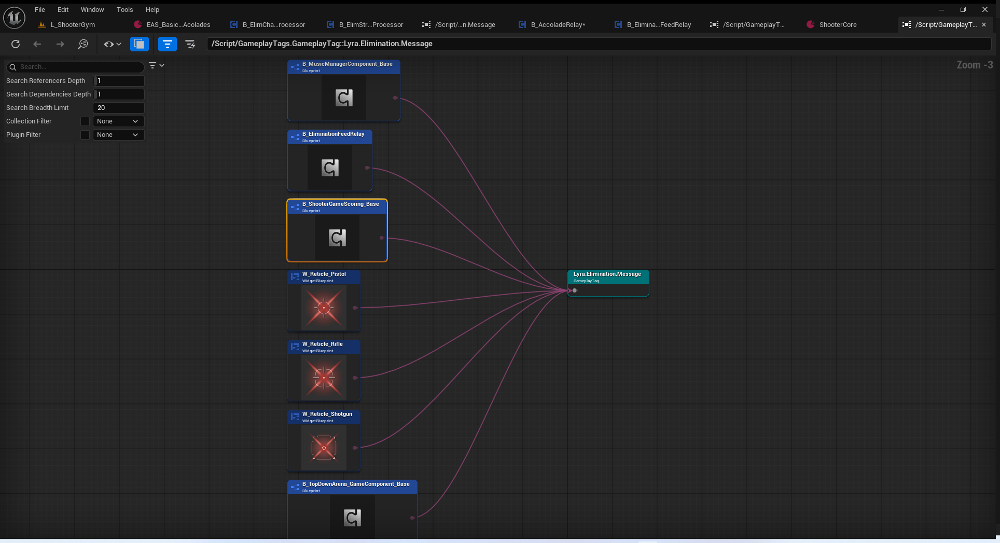

## 消息组件父类
``` cpp
/**
 * UGameplayMessageProcessor
 * 
 * Base class for any message processor which observes other gameplay messages
 * and potentially re-emits updates (e.g., when a chain or combo is detected)
 * 
 * Note that these processors are spawned on the server once (not per player)
 * and should do their own internal filtering if only relevant for some players.
 */
UCLASS(MinimalAPI, BlueprintType, Blueprintable, meta=(BlueprintSpawnableComponent))
class UGameplayMessageProcessor : public UActorComponent
{
	GENERATED_BODY()

public:
	//~UActorComponent interface
	UE_API virtual void BeginPlay() override;
	UE_API virtual void EndPlay(const EEndPlayReason::Type EndPlayReason) override;
	//~End of UActorComponent interface

	UE_API virtual void StartListening();
	UE_API virtual void StopListening();

protected:
	UE_API void AddListenerHandle(FGameplayMessageListenerHandle&& Handle);
	UE_API double GetServerTime() const;

private:
	TArray<FGameplayMessageListenerHandle> ListenerHandles;
};
```

## 助攻处理
监听的是伤害信息和歼灭信息,传递出去的是助攻信息,在B_ShooterGameScoring_Base添加助攻得分.
仅服务器需要该组件
***Lyra.Elimination.Message->Lyra.Assist.Message***
***Lyra.Damage.Message->Lyra.Assist.Message***
``` cpp
// Tracks the damage done to a player by other players
// 跟踪玩家受到其他玩家造成的伤害
USTRUCT()
struct FPlayerAssistDamageTracking
{
	GENERATED_BODY()

	// Map of damager to damage dealt
	// 伤害者与造成伤害值的映射表
	UPROPERTY(Transient)
	TMap<TObjectPtr<APlayerState>, float> AccumulatedDamageByPlayer;
};

// Tracks assists (dealing damage to another player without finishing them)
// 跟踪助攻（对另一名玩家造成伤害但未将其击倒）
UCLASS()
class UAssistProcessor : public UGameplayMessageProcessor
{
	GENERATED_BODY()

public:
	virtual void StartListening() override;

private:
	// 接收到伤害信息
	void OnDamageMessage(FGameplayTag Channel, const FLyraVerbMessage& Payload);
	// 接收到歼灭信息
	void OnEliminationMessage(FGameplayTag Channel, const FLyraVerbMessage& Payload);

private:
	// Map of player to damage dealt to them
	// 每个玩家对应其所受到的伤害的映射表
	UPROPERTY(Transient)
	TMap<TObjectPtr<APlayerState>, FPlayerAssistDamageTracking> DamageHistory;
};


```
``` cpp
UE_DEFINE_GAMEPLAY_TAG_STATIC(TAG_Lyra_Elimination_Message, "Lyra.Elimination.Message");
UE_DEFINE_GAMEPLAY_TAG_STATIC(TAG_Lyra_Damage_Message, "Lyra.Damage.Message");
UE_DEFINE_GAMEPLAY_TAG_STATIC(TAG_Lyra_Assist_Message, "Lyra.Assist.Message");

void UAssistProcessor::StartListening()
{
	UGameplayMessageSubsystem& MessageSubsystem = UGameplayMessageSubsystem::Get(this);
	AddListenerHandle(MessageSubsystem.RegisterListener(TAG_Lyra_Elimination_Message, this, &ThisClass::OnEliminationMessage));
	AddListenerHandle(MessageSubsystem.RegisterListener(TAG_Lyra_Damage_Message, this, &ThisClass::OnDamageMessage));
}

void UAssistProcessor::OnDamageMessage(FGameplayTag Channel, const FLyraVerbMessage& Payload)
{
	if (Payload.Instigator != Payload.Target)
	{
		if (APlayerState* InstigatorPS = ULyraVerbMessageHelpers::GetPlayerStateFromObject(Payload.Instigator))
		{
			if (APlayerState* TargetPS = ULyraVerbMessageHelpers::GetPlayerStateFromObject(Payload.Target))
			{
				FPlayerAssistDamageTracking& Damage = DamageHistory.FindOrAdd(TargetPS);
				float& DamageTotalFromTarget = Damage.AccumulatedDamageByPlayer.FindOrAdd(InstigatorPS);
				DamageTotalFromTarget += Payload.Magnitude;
			}
		} 
	}
}


void UAssistProcessor::OnEliminationMessage(FGameplayTag Channel, const FLyraVerbMessage& Payload)
{
	if (APlayerState* TargetPS = Cast<APlayerState>(Payload.Target))
	{
		// Grant an assist to each player who damaged the target but wasn't the instigator
		// 对于那些虽对目标造成了损害但并非发起者的所有玩家，给予一定的协助补偿。
		if (FPlayerAssistDamageTracking* DamageOnTarget = DamageHistory.Find(TargetPS))
		{
			for (const auto& KVP : DamageOnTarget->AccumulatedDamageByPlayer)
			{
				if (APlayerState* AssistPS = KVP.Key)
				{
					if (AssistPS != Payload.Instigator)
					{
						FLyraVerbMessage AssistMessage;
						AssistMessage.Verb = TAG_Lyra_Assist_Message;
						AssistMessage.Instigator = AssistPS;
						//@TODO: Get default tags from a player state or save off most recent tags during assist damage?
						//AssistMessage.InstigatorTags = ;
						//@待办事项：从玩家状态中获取默认标签，或者在协助造成伤害时保存最新标签？
						//协助消息的发起者标签 = ；
						AssistMessage.Target = TargetPS;
						AssistMessage.TargetTags = Payload.TargetTags;
						AssistMessage.ContextTags = Payload.ContextTags;
						AssistMessage.Magnitude = KVP.Value;

						UGameplayMessageSubsystem& MessageSubsystem = UGameplayMessageSubsystem::Get(this);
						MessageSubsystem.BroadcastMessage(AssistMessage.Verb, AssistMessage);
					}
				}
			}

			// Clear the damage log for the eliminated player
			// 清除已被淘汰玩家的损伤记录
			DamageHistory.Remove(TargetPS);
		}
	}
}
```
## 瞬杀处理
监听的是歼灭信息,传递出去的是荣誉信息!!!接收的组件是B_EliminationFeedRelay,用于服务器和客户端播报荣誉
仅服务器需要该组件
***Lyra.Elimination.Message->Lyra.ShooterGame.Accolade.EliminationChain.2x***
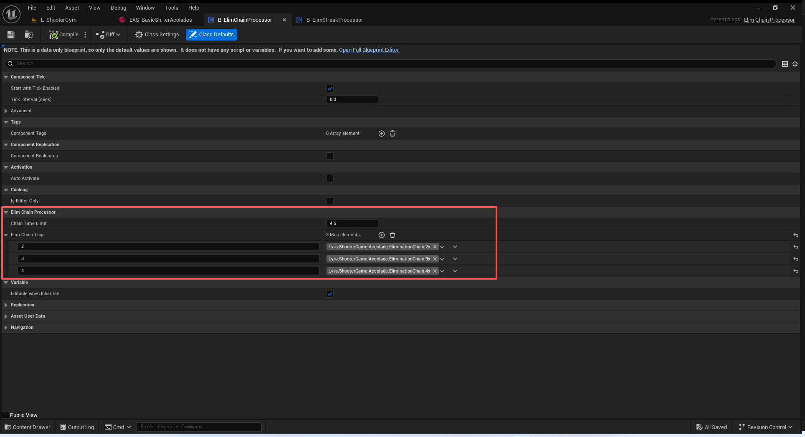

``` cpp
// 歼灭信息
USTRUCT()
struct FPlayerElimChainInfo
{
	GENERATED_BODY()
	// 上次歼灭时间
	double LastEliminationTime = 0.0;
	// 歼灭数量
	int32 ChainCounter = 1;
};

// Tracks a chain of eliminations (X eliminations without more than Y seconds passing between each one)
// 跟踪一系列的淘汰过程（每次淘汰操作之间间隔不超过 Y 秒，共进行 X 次淘汰）
UCLASS(Abstract)
class UElimChainProcessor : public UGameplayMessageProcessor
{
	GENERATED_BODY()

public:
	virtual void StartListening() override;

protected:
	UPROPERTY(EditDefaultsOnly)
	float ChainTimeLimit = 4.5f;

	// The event to rebroadcast when a user gets a chain of a certain length
	// 当用户获取到一定长度的链时重新播放的事件
	UPROPERTY(EditDefaultsOnly)
	TMap<int32, FGameplayTag> ElimChainTags;

private:
	void OnEliminationMessage(FGameplayTag Channel, const FLyraVerbMessage& Payload);

private:
	UPROPERTY(Transient)
	TMap<TObjectPtr<APlayerState>, FPlayerElimChainInfo> PlayerChainHistory;
};

```
``` cpp
namespace ElimChain
{
	UE_DEFINE_GAMEPLAY_TAG_STATIC(TAG_Lyra_Elimination_Message, "Lyra.Elimination.Message");
}

void UElimChainProcessor::StartListening()
{
	UGameplayMessageSubsystem& MessageSubsystem = UGameplayMessageSubsystem::Get(this);
	AddListenerHandle(MessageSubsystem.RegisterListener(ElimChain::TAG_Lyra_Elimination_Message, this, &ThisClass::OnEliminationMessage));
}

void UElimChainProcessor::OnEliminationMessage(FGameplayTag Channel, const FLyraVerbMessage& Payload)
{
	// Track elimination chains for the attacker (except for self-eliminations)
	// 对攻击者的追踪终止链（不包括自我终止的情况）
	if (Payload.Instigator != Payload.Target)
	{
		if (APlayerState* InstigatorPS = Cast<APlayerState>(Payload.Instigator))
		{
			// 获取时间
			const double CurrentTime = GetServerTime();

			// 找到历史
			FPlayerElimChainInfo& History = PlayerChainHistory.FindOrAdd(InstigatorPS);
			// 是否需要重置
			const bool bStreakReset = (History.LastEliminationTime == 0.0) || (History.LastEliminationTime + ChainTimeLimit < CurrentTime);

			History.LastEliminationTime = CurrentTime;
			if (bStreakReset)
			{
				History.ChainCounter = 1;
			}
			else
			{
				++History.ChainCounter;

				if (FGameplayTag* pTag = ElimChainTags.Find(History.ChainCounter))
				{
					FLyraVerbMessage ElimChainMessage;
					ElimChainMessage.Verb = *pTag;
					ElimChainMessage.Instigator = InstigatorPS;
					ElimChainMessage.InstigatorTags = Payload.InstigatorTags;
					ElimChainMessage.ContextTags = Payload.ContextTags;
					ElimChainMessage.Magnitude = History.ChainCounter;
					// 触发瞬杀消息传递
					UGameplayMessageSubsystem& MessageSubsystem = UGameplayMessageSubsystem::Get(this);
					MessageSubsystem.BroadcastMessage(ElimChainMessage.Verb, ElimChainMessage);
				}
			}
		}
	}
}


```
## 连杀处理
监听的是歼灭信息,传递出去的是荣誉信息!!!接收的组件是B_EliminationFeedRelay,用于服务器和客户端播报荣誉
仅服务器需要该组件
***Lyra.Elimination.Message->Lyra.ShooterGame.Accolade.EliminationStreak.20***
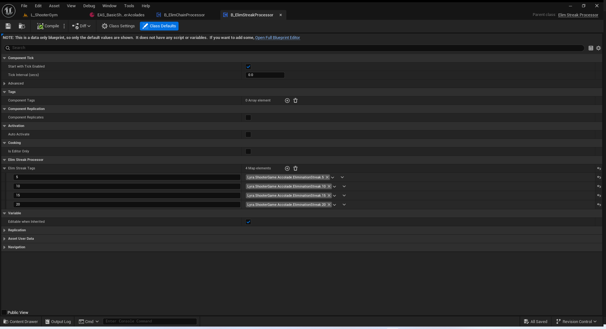
``` cpp
// Tracks a streak of eliminations (X eliminations without being eliminated)
// 跟踪连续淘汰的次数（即未被淘汰但自身已进行过 X 次淘汰操作的情况）
UCLASS(Abstract)
class UElimStreakProcessor : public UGameplayMessageProcessor
{
	GENERATED_BODY()

public:
	virtual void StartListening() override;

protected:
	// The event to rebroadcast when a user gets a streak of a certain length
	// 当用户连续达成一定长度的连胜时，所要重新播放的事件内容
	UPROPERTY(EditDefaultsOnly)
	TMap<int32, FGameplayTag> ElimStreakTags;

private:
	void OnEliminationMessage(FGameplayTag Channel, const FLyraVerbMessage& Payload);

private:
	UPROPERTY(Transient)
	TMap<TObjectPtr<APlayerState>, int32> PlayerStreakHistory;
};


```
``` cpp
namespace ElimStreak
{
	UE_DEFINE_GAMEPLAY_TAG_STATIC(TAG_Lyra_Elimination_Message, "Lyra.Elimination.Message");
}

void UElimStreakProcessor::StartListening()
{
	UGameplayMessageSubsystem& MessageSubsystem = UGameplayMessageSubsystem::Get(this);
	AddListenerHandle(MessageSubsystem.RegisterListener(ElimStreak::TAG_Lyra_Elimination_Message, this, &ThisClass::OnEliminationMessage));
}

void UElimStreakProcessor::OnEliminationMessage(FGameplayTag Channel, const FLyraVerbMessage& Payload)
{
	// Track elimination streaks for the attacker (except for self-eliminations)
	// 对攻击者的淘汰记录进行统计（不包括自身淘汰的情况）
	if (Payload.Instigator != Payload.Target)
	{
		if (APlayerState* InstigatorPS = Cast<APlayerState>(Payload.Instigator))
		{
			int32& StreakCount = PlayerStreakHistory.FindOrAdd(InstigatorPS);
			StreakCount++;

			if (FGameplayTag* pTag = ElimStreakTags.Find(StreakCount))
			{
				FLyraVerbMessage ElimStreakMessage;
				ElimStreakMessage.Verb = *pTag;
				ElimStreakMessage.Instigator = InstigatorPS;
				ElimStreakMessage.InstigatorTags = Payload.InstigatorTags;
				ElimStreakMessage.ContextTags = Payload.ContextTags;
 				ElimStreakMessage.Magnitude = StreakCount;

				UGameplayMessageSubsystem& MessageSubsystem = UGameplayMessageSubsystem::Get(this);
				MessageSubsystem.BroadcastMessage(ElimStreakMessage.Verb, ElimStreakMessage);
			}
		}
	}

	// End the elimination streak for the target
	// 结束针对目标的淘汰进程
	if (APlayerState* TargetPS = Cast<APlayerState>(Payload.Target))
	{
		PlayerStreakHistory.Remove(TargetPS);
	}
}

```
## 顶部荣誉信息播报
注意这个组件时服务器客户端都有.
它需要在服务器上接收信息,然后通过PlayerState传递到对应的客户端,让指定客户端的自己进行播报同样的消息!!!!
如果服务器时监听服务器,那么它也需要在这里播报荣誉信息给荣誉系统的控件.
这个组件本身没有开启网络复制,但是它的RPC需求通过借助PlayerState完成了,这样设计更合理!

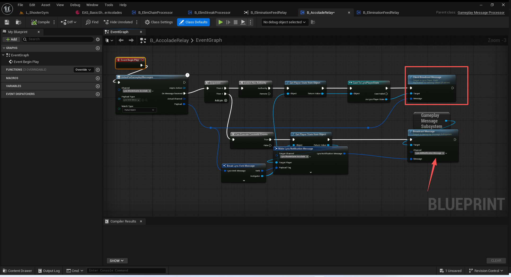
注意这里监听的是游戏机制的荣誉信息,然后传递出去的是添加提醒荣誉信息!!!!
注意具体使用的信息是在负载里面!!!
***Lyra.ShooterGame.Accolade->Lyra.AddNotification.Message***
``` cpp
void ALyraPlayerState::ClientBroadcastMessage_Implementation(const FLyraVerbMessage Message)
{
	// This check is needed to prevent running the action when in standalone mode
	// 此检查是为了防止在独立模式下执行该操作而设置的。
	if (GetNetMode() == NM_Client)
	{
		UGameplayMessageSubsystem::Get(this).BroadcastMessage(Message.Verb, Message);
	}
}

```
在UI中接收这个添加荣誉信息.
这里处理的连杀和瞬杀信息!具体内容是在负载里面!
这里几个Tag是有点绕的.稍微多看一下就行.
监听的是什么? 传递的是什么?负载里面是什么?
注意负载里面的tag,和你监听和传递的tag不一定是一模一样的!!!


``` cpp
UE_DEFINE_GAMEPLAY_TAG_STATIC(TAG_Lyra_ShooterGame_Accolade, "Lyra.ShooterGame.Accolade");

void ULyraAccoladeHostWidget::NativeConstruct()
{
	Super::NativeConstruct();

	// 绑定添加提示信息
	UGameplayMessageSubsystem& MessageSubsystem = UGameplayMessageSubsystem::Get(this);
	ListenerHandle = MessageSubsystem.RegisterListener(TAG_Lyra_AddNotification_Message, this, &ThisClass::OnNotificationMessage);
}


```

``` cpp
// A message destined for a transient log (e.g., an elimination feed or inventory pickup stream)
// 一条发往临时日志的消息（例如，歼灭对象推送信息或库存提取流）
USTRUCT(BlueprintType)
struct FLyraNotificationMessage
{
	GENERATED_BODY()

	// The destination channel
	// 目的地频道
	UPROPERTY(BlueprintReadWrite, Category=Notification)
	FGameplayTag TargetChannel;

	// The target player (if none is set then it will display for all local players)
	// 目标玩家（如果没有设定，则会显示给所有本地玩家）
	UPROPERTY(BlueprintReadWrite, Category=Notification)
	TObjectPtr<APlayerState> TargetPlayer = nullptr;

	// The message to display
	// 要显示的消息
	UPROPERTY(BlueprintReadWrite, Category=Notification)
	FText PayloadMessage;

	// Extra payload specific to the target channel (e.g., a style or definition asset)
	// 与目标频道特定相关的附加内容（例如，某种样式或定义性资源）
	UPROPERTY(BlueprintReadWrite, Category=Notification)
	FGameplayTag PayloadTag;

	// Extra payload specific to the target channel (e.g., a style or definition asset)
	// 与目标频道特定相关的附加内容（例如，某种样式或定义性资源）
	UPROPERTY(BlueprintReadWrite, Category=Notification)
	TObjectPtr<UObject> PayloadObject = nullptr;
};


```

## 击杀通知
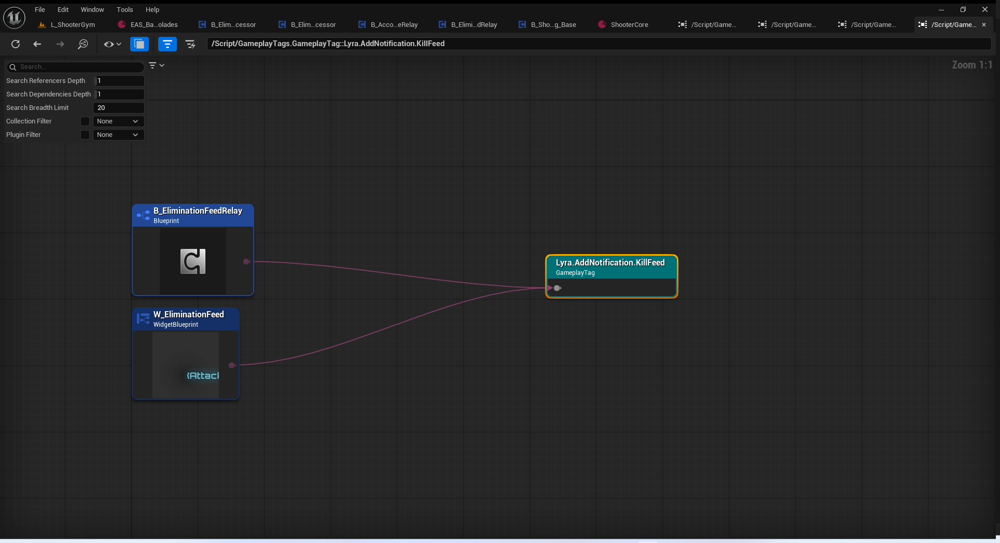

注意,客户端和服务器都有,监听的是歼灭信息,传递的是添加击杀通知
这个组件不需要网络同步.
这里不涉及荣誉系统.

***Lyra.Elimination.Message->Lyra.AddNotification.KillFeed***
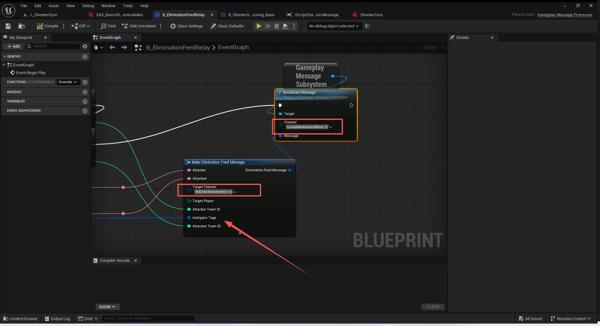
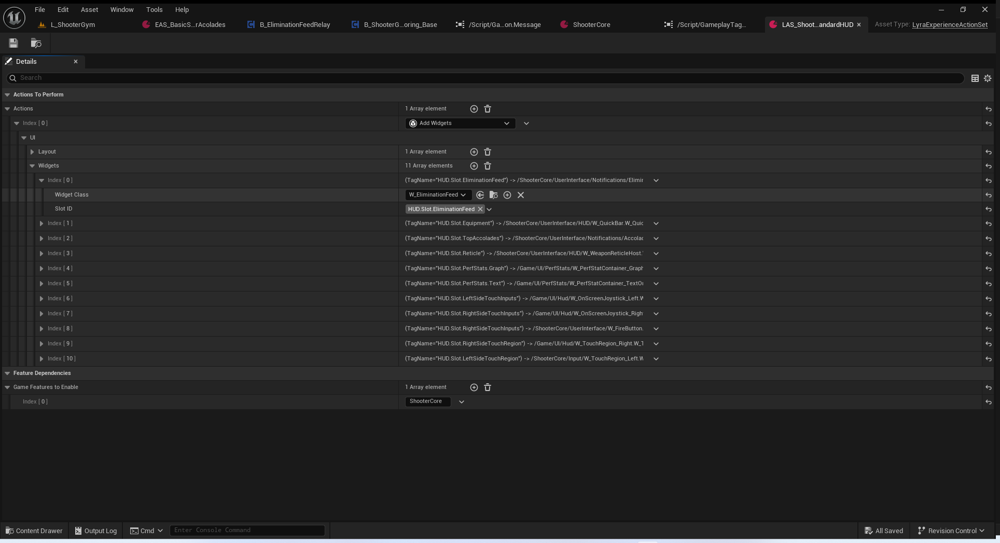

#### 构建信息Obejct
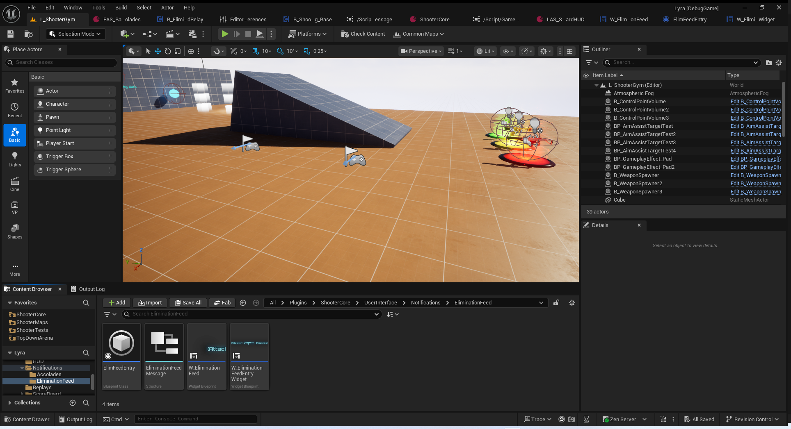
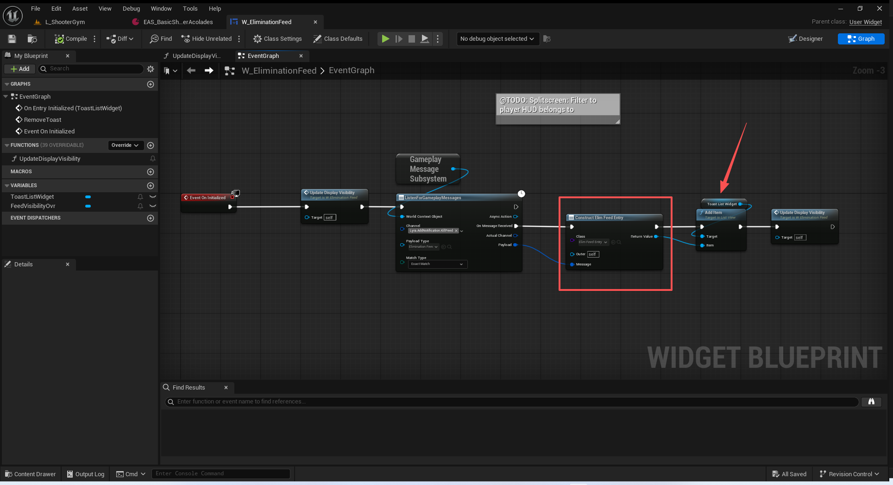
它是ListView.
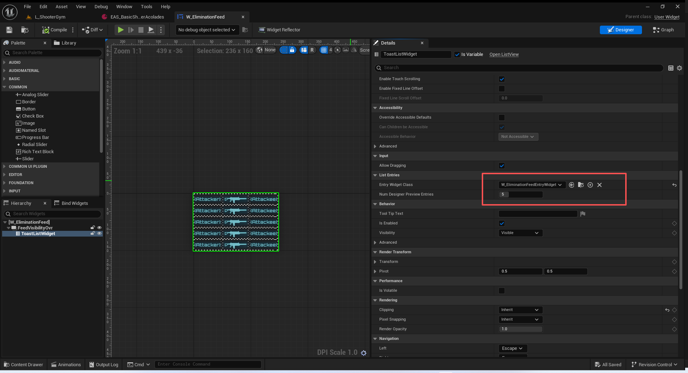
#### 设置样式
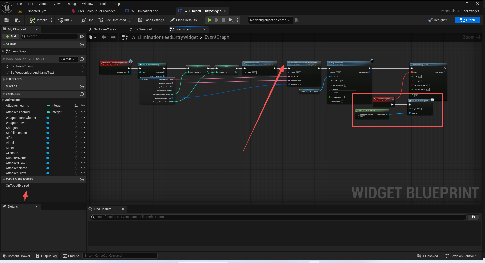
根据死亡情况选择图片
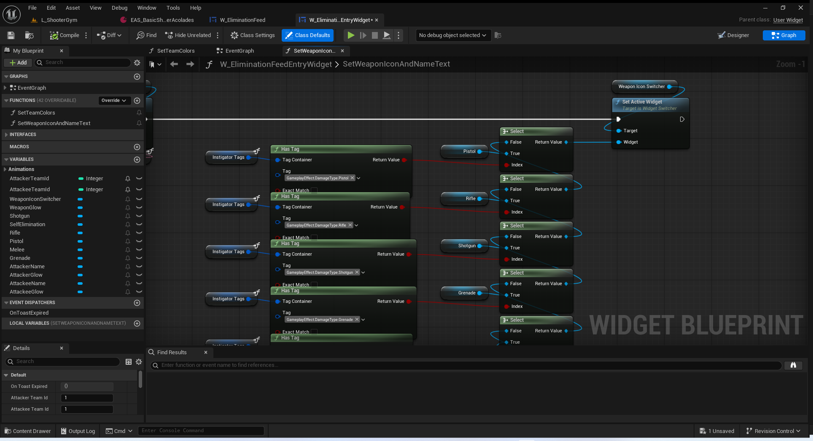
队伍样式等材质参数传递就省略了.
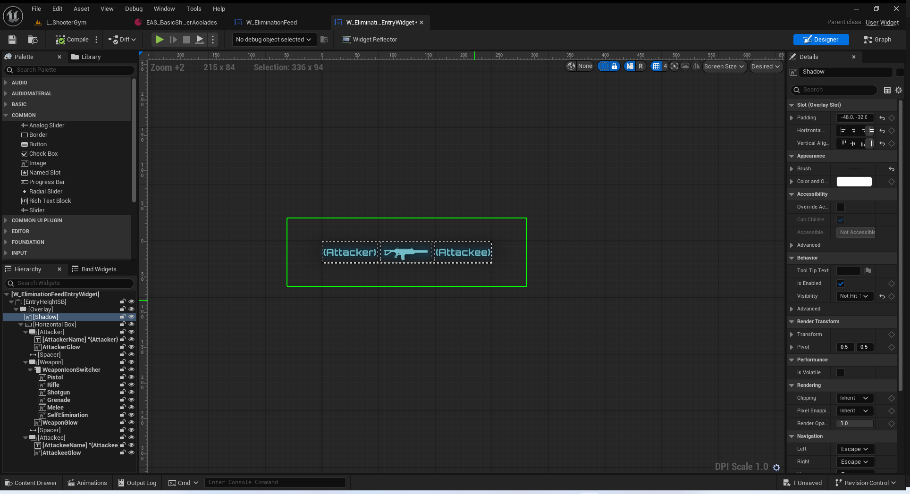
#### 定时隐退
通过事件分发器绑定在子项的定时器完成事件上面,然后移除子项,更新容器可视性!
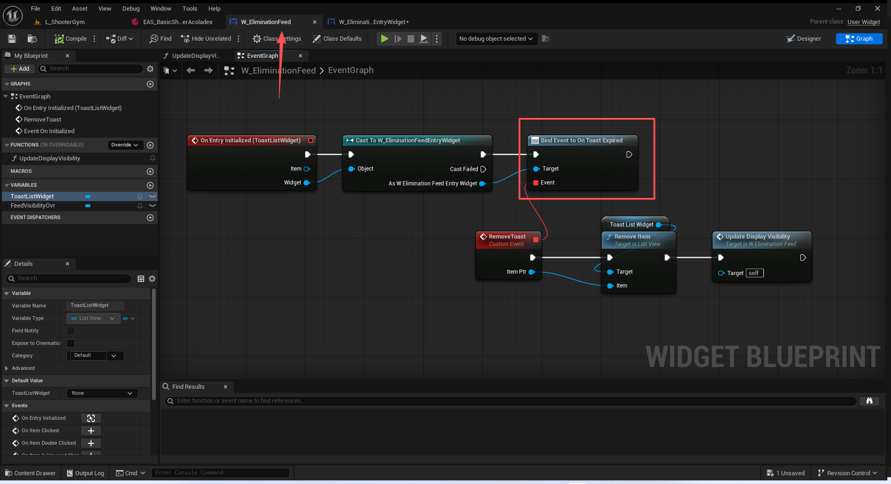
## 助攻和歼灭得分
/ShooterCore/Game/B_ShooterGameScoring_Base.B_ShooterGameScoring_Base
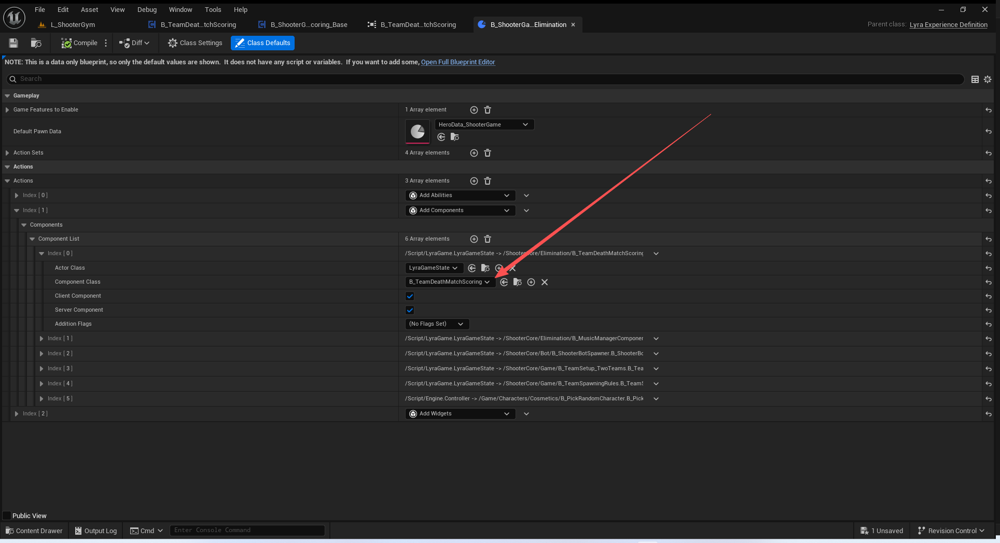
注意这里添加的是子类.服务器和客户端都需要有.这个组件时开启了同步的,但是父类没有开启.具体开不开启,是结合这部分功能是否需要属性同步或者RPC来完成.
本节只讲解这个父类.具体子类的功能需要到游戏阶段结合比分展示来讲解!
队伍得分,个人击杀得分,个人死亡得分,个人助攻得分.
注意这里的信息只在服务器传递过来.比分由属性同步进行下发!!!
这里监听的是
***Lyra.Elimination.Message***
***Lyra.Assist.Message***
修改的比分tag
TeamInfo:
ShooterGame.Score.Eliminations
PlayerState:
ShooterGame.Score.Eliminations
ShooterGame.Score.Deaths
PlayerState:
ShooterGame.Score.Assists
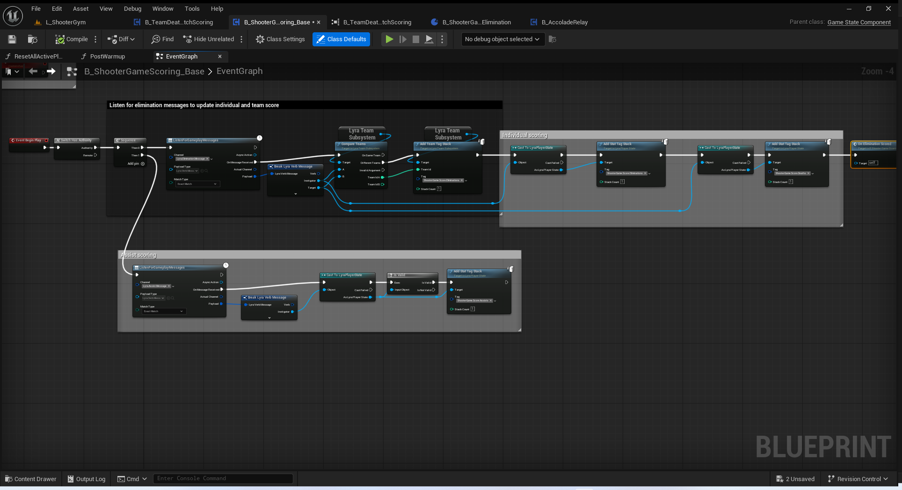
## 总结
关于游戏机制对于歼灭信息的传递处理基本讲解完毕.
注意,涉及到显示游戏比分的面板,游戏阶段的阶段还没讲解.
