# UE5_Lyra学习指南_107_游戏阶段系统

本文章仅为小刚-B站课堂-虚幻引擎视频课程Lyra-精讲的演讲手稿.  
本套课程链接:[[UE5]虚幻引擎游戏案例Lyra精讲](https://www.bilibili.com/cheese/play/ss112001159)  
前置课程链接:[[UE5]虚幻引擎UEC++从基础到进阶](https://www.bilibili.com/cheese/play/ss28043)  

文章内容由小刚撰写,采用了以下多种方式:  
1.口述转文字  
2.AI重构  
3.参考引擎源码  
4.Lyra工程源码  
5.结合社区论坛各位大佬的解析  

- [UE5\_Lyra学习指南\_107\_游戏阶段系统](#ue5_lyra学习指南_107_游戏阶段系统)
	- [概述](#概述)
	- [日志定义](#日志定义)
	- [LyraGamePhaseAbility定义](#lyragamephaseability定义)
	- [注意区分GA的蓝图生成父类!](#注意区分ga的蓝图生成父类)
	- [GameplayAbilityBlueprint](#gameplayabilityblueprint)
	- [PhaseGA的颜色](#phasega的颜色)
	- [GA的工厂创建](#ga的工厂创建)
	- [GA的审计功能](#ga的审计功能)
	- [阶段世界子系统](#阶段世界子系统)
		- [匹配规则](#匹配规则)
		- [头文件](#头文件)
		- [激活流程](#激活流程)
			- [蓝图启动](#蓝图启动)
			- [转发到GA](#转发到ga)
			- [转发到子系统](#转发到子系统)
			- [阶段能力互斥处理](#阶段能力互斥处理)
			- [结束能力](#结束能力)
			- [转发到子系统](#转发到子系统-1)
		- [注册观察者](#注册观察者)
			- [暖场结束](#暖场结束)
		- [战斗阶段](#战斗阶段)
		- [计分阶段](#计分阶段)
	- [ULyraDevelopmentStatics](#ulyradevelopmentstatics)
	- [团队积分面板](#团队积分面板)
		- [顶部得分](#顶部得分)
		- [按住显示UI的技能](#按住显示ui的技能)
		- [按键显示UI的技能](#按键显示ui的技能)
		- [技能的注册](#技能的注册)
	- [总结](#总结)


## 概述
本节主要讲解游戏的三个阶段,是如何通过GAS划分实现的.
暖场阶段,战斗阶段,计分阶段.
实践可以划分成多个阶段,比如四个,五个也都可以.彼此之前可以衔接.
也可以就一个阶段再细分,比如战斗阶段-发育,战斗阶段-团战,战斗阶段-守高地.
## 日志定义
注意这个头文件的定义写在了LyraGamePhaseLog.h
实现写在了LyraGamePhaseSubsystem.cpp
``` cpp
DECLARE_LOG_CATEGORY_EXTERN(LogLyraGamePhase, Log, All);

```
``` cpp
DEFINE_LOG_CATEGORY(LogLyraGamePhase);
```

## LyraGamePhaseAbility定义
``` cpp
/**
 * ULyraGamePhaseAbility
 *
 * The base gameplay ability for any ability that is used to change the active game phase.
 * 任何用于改变当前游戏阶段的能力的基础操作能力。
 */
// HideCategories 列出该类对象在虚幻编辑器属性窗口中应隐藏的若干类别。若要隐藏未指定类别声明的属性，则使用声明该变量的类的名称。此指定符会传递给子类。
UCLASS(Abstract, HideCategories = Input)
class ULyraGamePhaseAbility : public ULyraGameplayAbility
{
	GENERATED_BODY()

public:
	// 设置GA的策略
	ULyraGamePhaseAbility(const FObjectInitializer& ObjectInitializer = FObjectInitializer::Get());

	// 获取阶段Tag
	const FGameplayTag& GetGamePhaseTag() const { return GamePhaseTag; }

#if WITH_EDITOR
	// 编辑器接口验证tag有效
	virtual EDataValidationResult IsDataValid(class FDataValidationContext& Context) const override;
#endif

protected:

	virtual void ActivateAbility(const FGameplayAbilitySpecHandle Handle, const FGameplayAbilityActorInfo* ActorInfo, const FGameplayAbilityActivationInfo ActivationInfo, const FGameplayEventData* TriggerEventData) override;
	virtual void EndAbility(const FGameplayAbilitySpecHandle Handle, const FGameplayAbilityActorInfo* ActorInfo, const FGameplayAbilityActivationInfo ActivationInfo, bool bReplicateEndAbility, bool bWasCancelled) override;

protected:

	// Defines the game phase that this game phase ability is part of.  So for example,
	// if your game phase is GamePhase.RoundStart, then it will cancel all sibling phases.
	// So if you had a phase such as GamePhase.WaitingToStart that was active, starting
	// the ability part of RoundStart would end WaitingToStart.  However to get nested behaviors
	// you can also nest the phases.  So for example, GamePhase.Playing.NormalPlay, is a sub-phase
	// of the parent GamePhase.Playing, so changing the sub-phase to GamePhase.Playing.SuddenDeath,
	// would stop any ability tied to GamePhase.Playing.*, but wouldn't end any ability 
	// tied to the GamePhase.Playing phase.
	
	// 定义了此游戏阶段能力所属的游戏阶段。例如，
	// 如果您的游戏阶段是“GamePhase.RoundStart"，那么它将取消所有同级阶段。
	// 假设您有一个名为“GamePhase.WaitingToStart”的活跃阶段，启动“GamePhase.RoundStart”这一阶段的该能力将结束“GamePhase.WaitingToStart”阶段。
	// 然而，为了实现嵌套行为，您也可以将阶段进行嵌套。
	// 例如，“GamePhase.Playing.NormalPlay”阶段是“GamePhase.Playing”阶段的子阶段，所以将子阶段更改为“GamePhase.Playing.SuddenDeath”，将停止与"GamePhase.Playing.*" 相关联的所有能力，
	// 但不会终止与“GamePhase.Playing”阶段相关的任何能力。
	UPROPERTY(EditDefaultsOnly, BlueprintReadOnly, Category = "Lyra|Game Phase")
	FGameplayTag GamePhaseTag;
};


```
## 注意区分GA的蓝图生成父类!
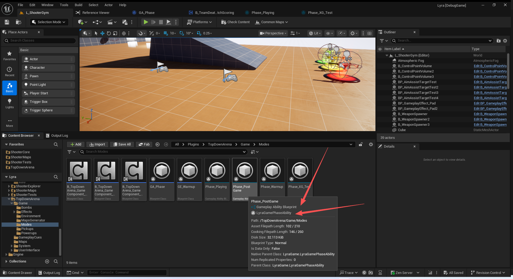
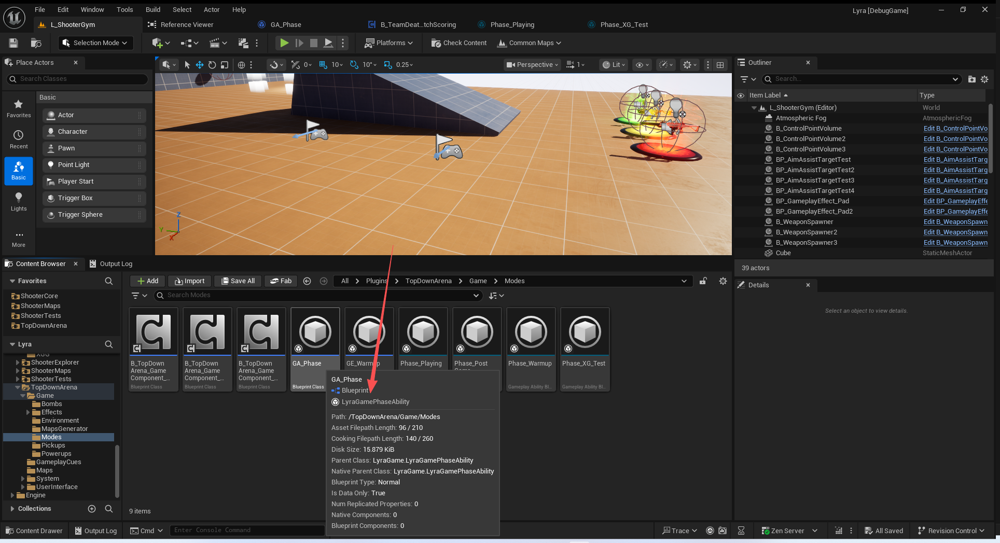

## GameplayAbilityBlueprint
// 注意这个GA的创建方式比较特殊
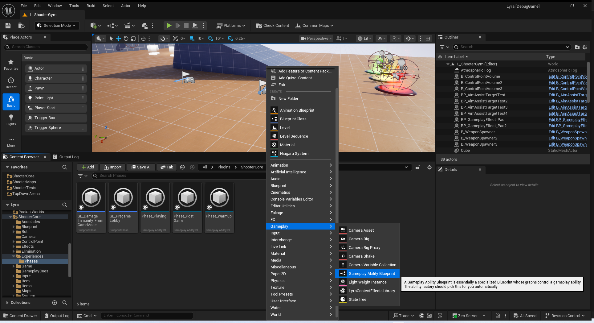
``` cpp

/**
 * A Gameplay Ability Blueprint is essentially a specialized Blueprint whose graphs control a gameplay ability
 * The ability factory should pick this for you automatically

 * 一个游戏能力蓝图本质上就是一种专门的蓝图，其图表用于控制游戏能力
 * 能力工厂会自动为您选择这个蓝图
 */

UCLASS(BlueprintType, MinimalAPI)
class UGameplayAbilityBlueprint : public UBlueprint
{
	GENERATED_UCLASS_BODY()

#if WITH_EDITOR

	// UBlueprint interface
	virtual bool SupportedByDefaultBlueprintFactory() const override
	{
		return false;
	}
	// End of UBlueprint interface

	/** Returns the most base gameplay ability blueprint for a given blueprint (if it is inherited from another ability blueprint, returning null if only native / non-ability BP classes are it's parent) */
	/** 返回给定蓝图所拥有的最基础的游戏玩法能力蓝图（如果该能力是继承自其他能力蓝图，则如果该蓝图的父类仅为原生/非能力类蓝图，则返回 null） */
	static UE_API UGameplayAbilityBlueprint* FindRootGameplayAbilityBlueprint(UGameplayAbilityBlueprint* DerivedBlueprint);

#endif
};


```

``` cpp
/** Returns the most base gameplay ability blueprint for a given blueprint (if it is inherited from another ability blueprint, returning null if only native / non-ability BP classes are it's parent) */
UGameplayAbilityBlueprint* UGameplayAbilityBlueprint::FindRootGameplayAbilityBlueprint(UGameplayAbilityBlueprint* DerivedBlueprint)
{
	UGameplayAbilityBlueprint* ParentBP = NULL;

	// Determine if there is a gameplay ability blueprint in the ancestry of this class
	for (UClass* ParentClass = DerivedBlueprint->ParentClass; ParentClass != UObject::StaticClass(); ParentClass = ParentClass->GetSuperClass())
	{
		if (UGameplayAbilityBlueprint* TestBP = Cast<UGameplayAbilityBlueprint>(ParentClass->ClassGeneratedBy))
		{
			ParentBP = TestBP;
		}
	}

	return ParentBP;
}

```
## PhaseGA的颜色
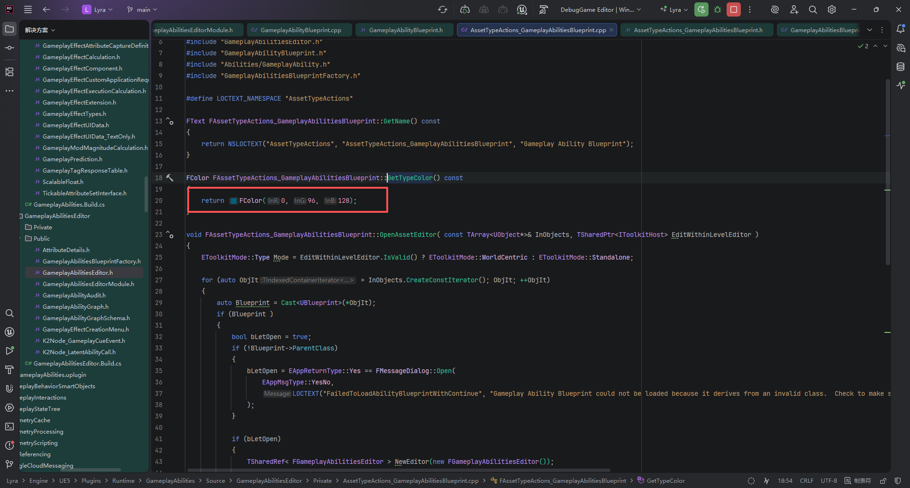
``` cpp
class FAssetTypeActions_GameplayAbilitiesBlueprint : public FAssetTypeActions_Blueprint
{
public:
	// IAssetTypeActions Implementation
	virtual FText GetName() const override;
	virtual FColor GetTypeColor() const override;
	virtual UClass* GetSupportedClass() const override;
	virtual void OpenAssetEditor(const TArray<UObject*>& InObjects, TSharedPtr<class IToolkitHost> EditWithinLevelEditor = TSharedPtr<IToolkitHost>()) override;
	virtual uint32 GetCategories() override { return EAssetTypeCategories::Blueprint | EAssetTypeCategories::Gameplay; }
	// End IAssetTypeActions Implementation

	// FAssetTypeActions_Blueprint interface
	virtual UFactory* GetFactoryForBlueprintType(UBlueprint* InBlueprint) const override;

private:
	/** Returns true if the blueprint is data only */
	bool ShouldUseDataOnlyEditor(const UBlueprint* Blueprint) const;
};

```
``` cpp
UClass* FAssetTypeActions_GameplayAbilitiesBlueprint::GetSupportedClass() const
{ 
	return UGameplayAbilityBlueprint::StaticClass(); 
}

```
``` cpp
FColor FAssetTypeActions_GameplayAbilitiesBlueprint::GetTypeColor() const
{
	return FColor(0, 96, 128);
}
```

## GA的工厂创建
``` cpp
UCLASS(HideCategories=Object, MinimalAPI)
class UGameplayAbilitiesBlueprintFactory : public UFactory
{
	GENERATED_UCLASS_BODY()

	// The type of blueprint that will be created
	UPROPERTY(EditAnywhere, Category=GameplayAbilitiesBlueprintFactory)
	TEnumAsByte<enum EBlueprintType> BlueprintType;

	// The parent class of the created blueprint
	UPROPERTY(EditAnywhere, Category=GameplayAbilitiesBlueprintFactory)
	TSubclassOf<class UGameplayAbility> ParentClass;

	//~ Begin UFactory Interface
	virtual bool ConfigureProperties() override;
	virtual UObject* FactoryCreateNew(UClass* Class, UObject* InParent, FName Name, EObjectFlags Flags, UObject* Context, FFeedbackContext* Warn, FName CallingContext) override;
	virtual UObject* FactoryCreateNew(UClass* Class, UObject* InParent, FName Name, EObjectFlags Flags, UObject* Context, FFeedbackContext* Warn) override;
	//~ Begin UFactory Interface	
};


```
``` cpp

UGameplayAbilitiesBlueprintFactory::UGameplayAbilitiesBlueprintFactory(const FObjectInitializer& ObjectInitializer)
	: Super(ObjectInitializer)
{
	bCreateNew = true;
	bEditAfterNew = true;
	// The class manufactured by this factory.
	SupportedClass = UGameplayAbilityBlueprint::StaticClass();
	// The parent class of the created blueprint
	ParentClass = UGameplayAbility::StaticClass();
}
```
``` cpp

UObject* UGameplayAbilitiesBlueprintFactory::FactoryCreateNew(UClass* Class, UObject* InParent, FName Name, EObjectFlags Flags, UObject* Context, FFeedbackContext* Warn, FName CallingContext)
{
	// Make sure we are trying to factory a gameplay ability blueprint, then create and init one
	check(Class->IsChildOf(UGameplayAbilityBlueprint::StaticClass()));

	// If they selected an interface, force the parent class to be UInterface
	if (BlueprintType == BPTYPE_Interface)
	{
		ParentClass = UInterface::StaticClass();
	}

	if ( ( ParentClass == NULL ) || !FKismetEditorUtilities::CanCreateBlueprintOfClass(ParentClass) || !ParentClass->IsChildOf(UGameplayAbility::StaticClass()) )
	{
		FFormatNamedArguments Args;
		Args.Add( TEXT("ClassName"), (ParentClass != NULL) ? FText::FromString( ParentClass->GetName() ) : LOCTEXT("Null", "(null)") );
		FMessageDialog::Open( EAppMsgType::Ok, FText::Format( LOCTEXT("CannotCreateGameplayAbilityBlueprint", "Cannot create a Gameplay Ability Blueprint based on the class '{ClassName}'."), Args ) );
		return NULL;
	}
	else
	{
		UGameplayAbilityBlueprint* NewBP = CastChecked<UGameplayAbilityBlueprint>(FKismetEditorUtilities::CreateBlueprint(ParentClass, InParent, Name, BlueprintType, UGameplayAbilityBlueprint::StaticClass(), UBlueprintGeneratedClass::StaticClass(), CallingContext));

		if (NewBP)
		{
			UGameplayAbilityBlueprint* AbilityBP = UGameplayAbilityBlueprint::FindRootGameplayAbilityBlueprint(NewBP);
			if (AbilityBP == NULL)
			{
				const UEdGraphSchema_K2* K2Schema = GetDefault<UEdGraphSchema_K2>();

				// Only allow a gameplay ability graph if there isn't one in a parent blueprint
				UEdGraph* NewGraph = FBlueprintEditorUtils::CreateNewGraph(NewBP, TEXT("Gameplay Ability Graph"), UGameplayAbilityGraph::StaticClass(), UGameplayAbilityGraphSchema::StaticClass());
#if WITH_EDITORONLY_DATA
				if (NewBP->UbergraphPages.Num())
				{
					FBlueprintEditorUtils::RemoveGraphs(NewBP, NewBP->UbergraphPages);
				}
#endif
				FBlueprintEditorUtils::AddUbergraphPage(NewBP, NewGraph);
				NewBP->LastEditedDocuments.Add(NewGraph);
				NewGraph->bAllowDeletion = false;

				UBlueprintEditorSettings* Settings = GetMutableDefault<UBlueprintEditorSettings>();
				if(Settings && Settings->bSpawnDefaultBlueprintNodes)
				{
					int32 NodePositionY = 0;
					FKismetEditorUtilities::AddDefaultEventNode(NewBP, NewGraph, FName(TEXT("K2_ActivateAbility")), UGameplayAbility::StaticClass(), NodePositionY);
					FKismetEditorUtilities::AddDefaultEventNode(NewBP, NewGraph, FName(TEXT("K2_OnEndAbility")), UGameplayAbility::StaticClass(), NodePositionY);
				}
			}
		}

		return NewBP;
	}
}

```

## GA的审计功能
在这个文件
GameplayAbilityAudit.h中
可以看到这部分的设计主要是方便进行审计处理所设计的蓝图的能力类.
``` cpp
/**
 * This file has the implementation of the Gameplay Ability Audit code.  You can right-click on assets and select "Audit" which will produce a DataTable with useful information.
 * The trick to do a full audit is to select all of the GameplayAbility Blueprints in the Content Browser (use filter 'NativeParentClass=GameplayAbility'), then right-click and select the Audit Context Menu Item
 * 
 * You can extend this functionality in your own project in two simple steps:
 *	Step 1: Derive your own audit Data Table Row from FGameplayAbilityAuditRow.
 *  Step 2: Override FillDataFromGameplayAbilityBlueprint in your derived class for any Blueprint code (e.g. node / flow inspection).
 *  Step 3: Override FillDataFromGameplayAbility in your derived class for any data/variable inspection (e.g. you've made your own UGameplayAbility-derived type).
 * 
 * Some magic in the namespace MenuExtension_GameplayAbilityBlueprintAudit should pick up your derived class and use it (assuming one derived row type per project).
 */
/**
* 此文件包含了游戏玩法能力审计代码的实现。您可以右键点击资源并选择“审计”，这将生成一个包含有用信息的表格数据。
* 进行全面审计的诀窍在于在内容浏览器中选择所有游戏玩法能力蓝图（使用过滤条件“父类=游戏玩法能力”），然后右键点击并选择审计上下文菜单项。*
您可以在自己的项目中通过以下两个简单步骤来扩展此功能：
1. 从 FGameplayAbilityAuditRow 中派生出您自己的审计数据表行。
2. 在您派生的类中重写 FillDataFromGameplayAbilityBlueprint 方法，以处理任何蓝图代码（例如节点/流程检查）。
3. 在您的派生类中重写 FillDataFromGameplayAbility 方法，以处理任何数据/变量检查（例如，您已创建了自己的基于 UGameplayAbility 的派生类型）。*
在“菜单扩展_游戏能力蓝图审核”这个命名空间中存在某种“魔法”，它会识别出您的派生类并加以使用（假设每个项目中只有一个派生的行类型）。*/

```
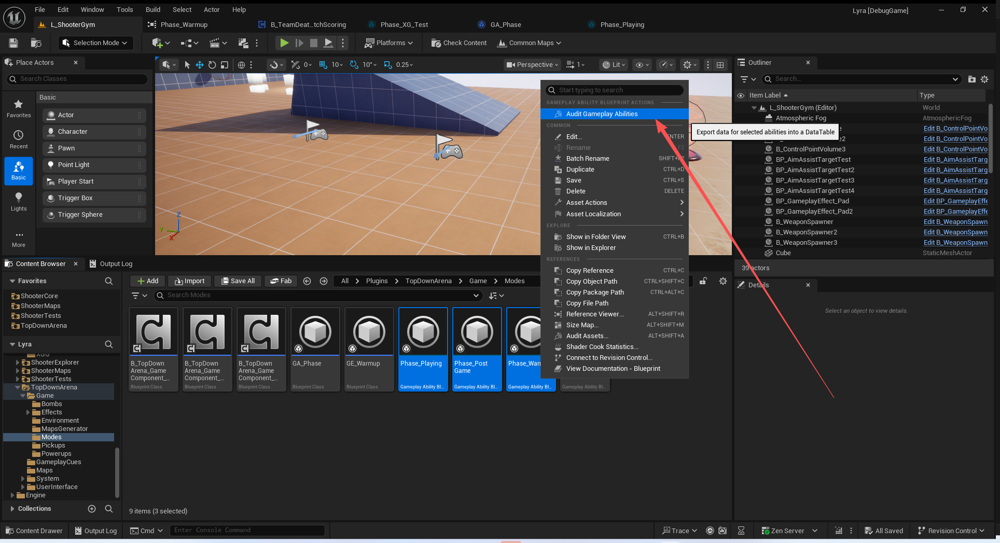
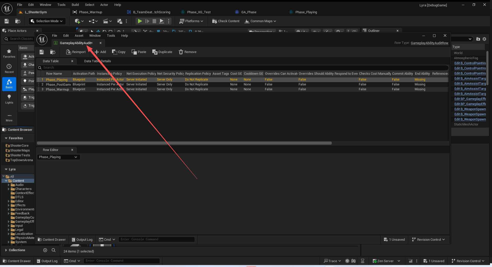

## 阶段世界子系统
### 匹配规则
``` cpp
// Match rule for message receivers
// 消息接收者的匹配规则
UENUM(BlueprintType)
enum class EPhaseTagMatchType : uint8
{
	// An exact match will only receive messages with exactly the same channel
	// (e.g., registering for "A.B" will match a broadcast of A.B but not A.B.C)
	// 精确匹配只会接收与指定频道完全一致的公告信息
    // （例如，注册“A.B”频道将匹配“A.B”的广播内容，但不会匹配“A.B.C”的内容）
	ExactMatch,

	// A partial match will receive any messages rooted in the same channel
	// (e.g., registering for "A.B" will match a broadcast of A.B as well as A.B.C)
	// 部分匹配将接收来自同一频道的所有消息（例如，注册“A.B”这一信息将匹配“A.B”的广播信息以及“A.B.C”的广播信息）
	PartialMatch
};

```
### 头文件
``` cpp
/** Subsystem for managing Lyra's game phases using gameplay tags in a nested manner, which allows parent and child 
 * phases to be active at the same time, but not sibling phases.
 * Example:  Game.Playing and Game.Playing.WarmUp can coexist, but Game.Playing and Game.ShowingScore cannot. 
 * When a new phase is started, any active phases that are not ancestors will be ended.
 * Example: if Game.Playing and Game.Playing.CaptureTheFlag are active when Game.Playing.PostGame is started, 
 *     Game.Playing will remain active, while Game.Playing.CaptureTheFlag will end.
 */
/** 用于通过嵌套的方式利用游戏玩法标签来管理Lyra的游戏阶段的子系统，该系统允许父阶段和子阶段同时处于激活状态，但不允许兄弟阶段同时处于激活状态。
* 示例：游戏“Game.Playing”和“Game.Playing.WarmUp”可以同时存在，但“Game.Playing”和“Game.ShowingScore”则不能。
* 当新阶段开始时，任何不是其祖先的活跃阶段都将被终止。
* 示例：如果在开始“Game.Playing.PostGame”阶段时，“Game.Playin”和“Game.Playing.CaptureTheFlag”阶段都是激活状态，
*     “Game.Playing”将保持激活状态，而“Game.Playing.CaptureTheFlag”将结束。*/
UCLASS()
class ULyraGamePhaseSubsystem : public UWorldSubsystem
{
	GENERATED_BODY()

public:
	// 构造函数
	ULyraGamePhaseSubsystem();

	// 记得调用父类
	virtual void PostInitialize() override;

	// 或许只应当在服务器上创建这个子系统
	virtual bool ShouldCreateSubsystem(UObject* Outer) const override;

	// 激活能力 注意是传入的阶段类的定义和回调事件
	// 这个代理是C++的
	// 这个能力是在GameState的ASC上激活
	void StartPhase(TSubclassOf<ULyraGamePhaseAbility> PhaseAbility, FLyraGamePhaseDelegate PhaseEndedCallback = FLyraGamePhaseDelegate());

	//TODO Return a handle so folks can delete these.  They will just grow until the world resets.
	//TODO Should we just occasionally clean these observers up?  It's not as if everyone will properly unhook them even if there is a handle.
	// 说明：返回一个标识符，以便用户能够删除这些内容。随着时间的推移，它们会不断增多，直至世界重置。
	// 说明：我们是否应该偶尔清理这些观察者呢？即便有标识符，也并非所有人都会正确地解除它们的关联。
	
	// 注册一个观察者回调 看看目标的tag是否激活了 如果激活了就立马调用一次 如果没有就等待激活
	// 这个函数的设计的有歧义!
	void WhenPhaseStartsOrIsActive(FGameplayTag PhaseTag, EPhaseTagMatchType MatchType, const FLyraGamePhaseTagDelegate& WhenPhaseActive);
	// 注册一个观察者回调 等待目标的tag结束,如果已经结束了,则不会激活
	void WhenPhaseEnds(FGameplayTag PhaseTag, EPhaseTagMatchType MatchType, const FLyraGamePhaseTagDelegate& WhenPhaseEnd);

	// 当前阶段是否激活 采用的是部分匹配
	UFUNCTION(BlueprintCallable, BlueprintAuthorityOnly, BlueprintPure = false, meta = (AutoCreateRefTerm = "PhaseTag"))
	bool IsPhaseActive(const FGameplayTag& PhaseTag) const;

protected:
	// 重写 支持的世界类型
	virtual bool DoesSupportWorldType(const EWorldType::Type WorldType) const override;

	// 激活阶段,并注册回调事件
	UFUNCTION(BlueprintCallable, BlueprintAuthorityOnly, Category = "Game Phase", meta = (DisplayName="Start Phase", AutoCreateRefTerm = "PhaseEnded"))
	void K2_StartPhase(TSubclassOf<ULyraGamePhaseAbility> Phase, const FLyraGamePhaseDynamicDelegate& PhaseEnded);

	// 注册观察者 等待或者是否已激活时 去调用
	// 判定当前激活的时候是部分匹配 而等待激活的是按照匹配规则来
	UFUNCTION(BlueprintCallable, BlueprintAuthorityOnly, Category = "Game Phase", meta = (DisplayName = "When Phase Starts or Is Active", AutoCreateRefTerm = "WhenPhaseActive"))
	void K2_WhenPhaseStartsOrIsActive(FGameplayTag PhaseTag, EPhaseTagMatchType MatchType, FLyraGamePhaseTagDynamicDelegate WhenPhaseActive);

	// 注册观察者 等待结束时去调用
	UFUNCTION(BlueprintCallable, BlueprintAuthorityOnly, Category = "Game Phase", meta = (DisplayName = "When Phase Ends", AutoCreateRefTerm = "WhenPhaseEnd"))
	void K2_WhenPhaseEnds(FGameplayTag PhaseTag, EPhaseTagMatchType MatchType, FLyraGamePhaseTagDynamicDelegate WhenPhaseEnd);

	// 由GA调用
	void OnBeginPhase(const ULyraGamePhaseAbility* PhaseAbility, const FGameplayAbilitySpecHandle PhaseAbilityHandle);
	// 由GA调用
	void OnEndPhase(const ULyraGamePhaseAbility* PhaseAbility, const FGameplayAbilitySpecHandle PhaseAbilityHandle);

private:
	
	struct FLyraGamePhaseEntry
	{
	public:
		// 目标Tag
		FGameplayTag PhaseTag;
		// 结束时的回调
		FLyraGamePhaseDelegate PhaseEndedCallback;
		// 这里应当补充一个匹配规则
	};
	
	// GA激活的阶段句柄映射表
	TMap<FGameplayAbilitySpecHandle, FLyraGamePhaseEntry> ActivePhaseMap;

	// 观察者
	struct FPhaseObserver
	{
	public:
		bool IsMatch(const FGameplayTag& ComparePhaseTag) const;
	
		// 目标Tag
		FGameplayTag PhaseTag;
		// 匹配规则
		EPhaseTagMatchType MatchType = EPhaseTagMatchType::ExactMatch;
		// 激活时的回调
		FLyraGamePhaseTagDelegate PhaseCallback;
	};
	// 开始激活的观察者
	TArray<FPhaseObserver> PhaseStartObservers;
	// 结束激活的观察者
	TArray<FPhaseObserver> PhaseEndObservers;

	friend class ULyraGamePhaseAbility;
};


```

### 激活流程
#### 蓝图启动
``` cpp
	// 激活阶段,并注册回调事件
	UFUNCTION(BlueprintCallable, BlueprintAuthorityOnly, Category = "Game Phase", meta = (DisplayName="Start Phase", AutoCreateRefTerm = "PhaseEnded"))
	void K2_StartPhase(TSubclassOf<ULyraGamePhaseAbility> Phase, const FLyraGamePhaseDynamicDelegate& PhaseEnded);

```
``` cpp
void ULyraGamePhaseSubsystem::K2_StartPhase(TSubclassOf<ULyraGamePhaseAbility> PhaseAbility, const FLyraGamePhaseDynamicDelegate& PhaseEndedDelegate)
{
	// 注意这里创建弱对象指针的写法!
	const FLyraGamePhaseDelegate EndedDelegate = FLyraGamePhaseDelegate::CreateWeakLambda(const_cast<UObject*>(PhaseEndedDelegate.GetUObject()), [PhaseEndedDelegate](const ULyraGamePhaseAbility* PhaseAbility) {
		PhaseEndedDelegate.ExecuteIfBound(PhaseAbility);
	});

	StartPhase(PhaseAbility, EndedDelegate);
}
```
#### 转发到GA
``` cpp
void ULyraGamePhaseSubsystem::StartPhase(TSubclassOf<ULyraGamePhaseAbility> PhaseAbility, FLyraGamePhaseDelegate PhaseEndedCallback)
{
	UWorld* World = GetWorld();
	// 获取ASC
	ULyraAbilitySystemComponent* GameState_ASC = World->GetGameState()->FindComponentByClass<ULyraAbilitySystemComponent>();
	
	if (ensure(GameState_ASC))
	{
		// 注册的同时并激活这个能力一次
		FGameplayAbilitySpec PhaseSpec(PhaseAbility, 1, 0, this);
		FGameplayAbilitySpecHandle SpecHandle = GameState_ASC->GiveAbilityAndActivateOnce(PhaseSpec);
		FGameplayAbilitySpec* FoundSpec = GameState_ASC->FindAbilitySpecFromHandle(SpecHandle);
		
		if (FoundSpec && FoundSpec->IsActive())
		{
			// 激活成功 等阶段能力结束时再回调
			FLyraGamePhaseEntry& Entry = ActivePhaseMap.FindOrAdd(SpecHandle);
			// 这里没有放Tag
			// 只放了回调
			Entry.PhaseEndedCallback = PhaseEndedCallback;
		}
		else
		{
			// 激活失败 直接调用
			PhaseEndedCallback.ExecuteIfBound(nullptr);
		}
	}
}

```
#### 转发到子系统
``` cpp
void ULyraGamePhaseAbility::ActivateAbility(const FGameplayAbilitySpecHandle Handle, const FGameplayAbilityActorInfo* ActorInfo, const FGameplayAbilityActivationInfo ActivationInfo, const FGameplayEventData* TriggerEventData)
{
	// 只在服务端执行
	if (ActorInfo->IsNetAuthority())
	{
		// 转发到子系统
		
		UWorld* World = ActorInfo->AbilitySystemComponent->GetWorld();
		ULyraGamePhaseSubsystem* PhaseSubsystem = UWorld::GetSubsystem<ULyraGamePhaseSubsystem>(World);
		PhaseSubsystem->OnBeginPhase(this, Handle);
	}
	// 执行蓝图
	Super::ActivateAbility(Handle, ActorInfo, ActivationInfo, TriggerEventData);
}

```
#### 阶段能力互斥处理
``` cpp

void ULyraGamePhaseSubsystem::OnBeginPhase(const ULyraGamePhaseAbility* PhaseAbility, const FGameplayAbilitySpecHandle PhaseAbilityHandle)
{
	const FGameplayTag IncomingPhaseTag = PhaseAbility->GetGamePhaseTag();

	UE_LOG(LogLyraGamePhase, Log, TEXT("Beginning Phase '%s' (%s)"), *IncomingPhaseTag.ToString(), *GetNameSafe(PhaseAbility));

	const UWorld* World = GetWorld();
	ULyraAbilitySystemComponent* GameState_ASC = World->GetGameState()->FindComponentByClass<ULyraAbilitySystemComponent>();
	if (ensure(GameState_ASC))
	{
		TArray<FGameplayAbilitySpec*> ActivePhases;

		// 这里需要拿到之前所有的能力 方便后面进行互斥比较
		for (const auto& KVP : ActivePhaseMap)
		{
			const FGameplayAbilitySpecHandle ActiveAbilityHandle = KVP.Key;
			if (FGameplayAbilitySpec* Spec = GameState_ASC->FindAbilitySpecFromHandle(ActiveAbilityHandle))
			{
				ActivePhases.Add(Spec);
			}
		}
		// 遍历所有阶段能力
		for (const FGameplayAbilitySpec* ActivePhase : ActivePhases)
		{
			const ULyraGamePhaseAbility* ActivePhaseAbility = CastChecked<ULyraGamePhaseAbility>(ActivePhase->Ability);
			const FGameplayTag ActivePhaseTag = ActivePhaseAbility->GetGamePhaseTag();
			
			// So if the active phase currently matches the incoming phase tag, we allow it.
			// i.e. multiple gameplay abilities can all be associated with the same phase tag.
			// For example,
			// You can be in the, Game.Playing, phase, and then start a sub-phase, like Game.Playing.SuddenDeath
			// Game.Playing phase will still be active, and if someone were to push another one, like,
			// Game.Playing.ActualSuddenDeath, it would end Game.Playing.SuddenDeath phase, but Game.Playing would
			// continue.  Similarly if we activated Game.GameOver, all the Game.Playing* phases would end.
			
			// 因此，如果当前的活跃阶段与传入的阶段标签相匹配，我们就允许其生效。
			// 即，多种游戏玩法能力都可以与相同的阶段标签相关联。
			// 例如，
			// 你可以处于“Game.Playing”的阶段，然后启动一个子阶段，比如“Game.Playing.SuddenDeath”
			// “Game.Playing”阶段仍然处于活跃状态，如果有人再启动另一个阶段，比如，
			// “Game.Playing.ActualSuddenDeath”，它将结束“Game.Playing.SuddenDeath”阶段，但“Game.Playing”阶段将继续进行。同样，如果我们激活“Game.GameOver”，所有“Game.Playing*”阶段都将结束。
			
			// 如果不匹配这个标签,那就取消这个能力
			// 只有直系才不会被取消,同级,或者旁支都会被取消,儿子也会被取消.只有它爸爸,它爷爷不会被取消.
			
			// 举例 IncomingPhaseTag: Game.A.1    那么Game.B会被取消(旁支),Game.A.2(同级)会被取消,Game.A.1.1(儿子)会被取消.而Game.A(爸爸)和Game(爷爷)不会被取消!!!!!
			/**
			* 检查此标签是否与要检查的标签相匹配，并展开其父标签
			* “A.1”。MatchesTag("A") 将返回 True，而 "A".MatchesTag("A.1") 将返回 False
			* 如果要检查的标签无效，则它将始终返回 False*
			* @返回值：如果此标签与要检查的标签相匹配，则返回 True*/
			if (!IncomingPhaseTag.MatchesTag(ActivePhaseTag))
			{
				UE_LOG(LogLyraGamePhase, Log, TEXT("\tEnding Phase '%s' (%s)"), *ActivePhaseTag.ToString(), *GetNameSafe(ActivePhaseAbility));

				FGameplayAbilitySpecHandle HandleToEnd = ActivePhase->Handle;
				GameState_ASC->CancelAbilitiesByFunc([HandleToEnd](const ULyraGameplayAbility* LyraAbility, FGameplayAbilitySpecHandle Handle) {
					return Handle == HandleToEnd;
				}, true);
			}
		}
		// 找到我们自己的 
		// 之前只放了回调,现在把Tag放进去
		FLyraGamePhaseEntry& Entry = ActivePhaseMap.FindOrAdd(PhaseAbilityHandle);
		Entry.PhaseTag = IncomingPhaseTag;

		// Notify all observers of this phase that it has started.
		// 通知此阶段的所有观察者该阶段已开始。
		for (const FPhaseObserver& Observer : PhaseStartObservers)
		{
			if (Observer.IsMatch(IncomingPhaseTag))
			{
				Observer.PhaseCallback.ExecuteIfBound(IncomingPhaseTag);
			}
		}
	}
}

```
#### 结束能力
``` cpp
void ULyraGamePhaseAbility::EndAbility(const FGameplayAbilitySpecHandle Handle, const FGameplayAbilityActorInfo* ActorInfo, const FGameplayAbilityActivationInfo ActivationInfo, bool bReplicateEndAbility, bool bWasCancelled)
{
	// 只在服务器执行
	if (ActorInfo->IsNetAuthority())
	{
		// 转发到子阶段
		
		UWorld* World = ActorInfo->AbilitySystemComponent->GetWorld();
		ULyraGamePhaseSubsystem* PhaseSubsystem = UWorld::GetSubsystem<ULyraGamePhaseSubsystem>(World);
		PhaseSubsystem->OnEndPhase(this, Handle);
	}
	// 呼叫蓝图
	Super::EndAbility(Handle, ActorInfo, ActivationInfo, bReplicateEndAbility, bWasCancelled);
}

```
#### 转发到子系统
``` cpp
void ULyraGamePhaseSubsystem::OnEndPhase(const ULyraGamePhaseAbility* PhaseAbility, const FGameplayAbilitySpecHandle PhaseAbilityHandle)
{
	const FGameplayTag EndedPhaseTag = PhaseAbility->GetGamePhaseTag();
	UE_LOG(LogLyraGamePhase, Log, TEXT("Ended Phase '%s' (%s)"), *EndedPhaseTag.ToString(), *GetNameSafe(PhaseAbility));

	const FLyraGamePhaseEntry& Entry = ActivePhaseMap.FindChecked(PhaseAbilityHandle);
	Entry.PhaseEndedCallback.ExecuteIfBound(PhaseAbility);

	ActivePhaseMap.Remove(PhaseAbilityHandle);

	// Notify all observers of this phase that it has ended.
	// 向此阶段的所有观察者通知该阶段已结束。
	for (const FPhaseObserver& Observer : PhaseEndObservers)
	{
		if (Observer.IsMatch(EndedPhaseTag))
		{
			Observer.PhaseCallback.ExecuteIfBound(EndedPhaseTag);
		}
	}
}


```
### 注册观察者


``` cpp
	// 注册观察者 等待或者是否已激活时 去调用
	// 判定当前激活的时候是部分匹配 而等待激活的是按照匹配规则来
	UFUNCTION(BlueprintCallable, BlueprintAuthorityOnly, Category = "Game Phase", meta = (DisplayName = "When Phase Starts or Is Active", AutoCreateRefTerm = "WhenPhaseActive"))
	void K2_WhenPhaseStartsOrIsActive(FGameplayTag PhaseTag, EPhaseTagMatchType MatchType, FLyraGamePhaseTagDynamicDelegate WhenPhaseActive);

	// 注册观察者 等待结束时去调用
	UFUNCTION(BlueprintCallable, BlueprintAuthorityOnly, Category = "Game Phase", meta = (DisplayName = "When Phase Ends", AutoCreateRefTerm = "WhenPhaseEnd"))
	void K2_WhenPhaseEnds(FGameplayTag PhaseTag, EPhaseTagMatchType MatchType, FLyraGamePhaseTagDynamicDelegate WhenPhaseEnd);
```

``` cpp
	// 注册一个观察者回调 看看目标的tag是否激活了 如果激活了就立马调用一次 如果没有就等待激活
	// 这个函数的设计的有歧义!
	void WhenPhaseStartsOrIsActive(FGameplayTag PhaseTag, EPhaseTagMatchType MatchType, const FLyraGamePhaseTagDelegate& WhenPhaseActive);
	// 注册一个观察者回调 等待目标的tag结束,如果已经结束了,则不会激活
	void WhenPhaseEnds(FGameplayTag PhaseTag, EPhaseTagMatchType MatchType, const FLyraGamePhaseTagDelegate& WhenPhaseEnd);

```

``` cpp
void ULyraGamePhaseSubsystem::WhenPhaseStartsOrIsActive(FGameplayTag PhaseTag, EPhaseTagMatchType MatchType, const FLyraGamePhaseTagDelegate& WhenPhaseActive)
{
	FPhaseObserver Observer;
	Observer.PhaseTag = PhaseTag;
	Observer.MatchType = MatchType;
	Observer.PhaseCallback = WhenPhaseActive;
	PhaseStartObservers.Add(Observer);
	// 这里的判别没有考虑到MatchType 是不是有点问题?
	// 这里需要考虑MatachType 默认的部分匹配
	
	// a.比如我传进来的是A.1 当前是A 所以不能激活
	// b.比如我传进来的是A  当前是A.1 所以可以激活
	
	// 但是我要求的匹配规则是精准匹配呢?
	// 这里需要区分是当前就要判断 还是日后激活时判断
	
	// 目前时 日后观察者激活时 必须按照匹配规则来
	// 而当前判断的时 却是按部分匹配来执行
	
	if (IsPhaseActive(PhaseTag))
	{
		WhenPhaseActive.ExecuteIfBound(PhaseTag);
	}
}

```

``` cpp
void ULyraGamePhaseSubsystem::WhenPhaseEnds(FGameplayTag PhaseTag, EPhaseTagMatchType MatchType, const FLyraGamePhaseTagDelegate& WhenPhaseEnd)
{
	FPhaseObserver Observer;
	Observer.PhaseTag = PhaseTag;
	Observer.MatchType = MatchType;
	Observer.PhaseCallback = WhenPhaseEnd;
	PhaseEndObservers.Add(Observer);
}

```		
## 团队歼灭比分
### 团队歼灭组件的添加
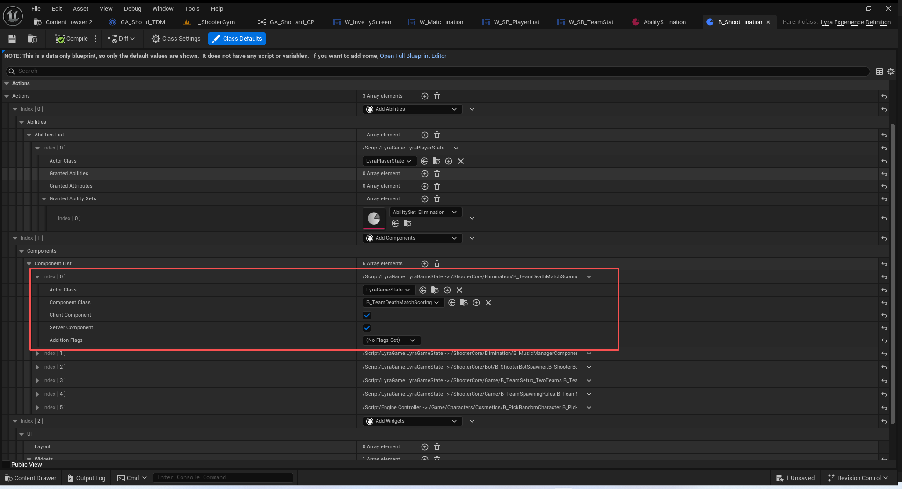
### 暖场阶段
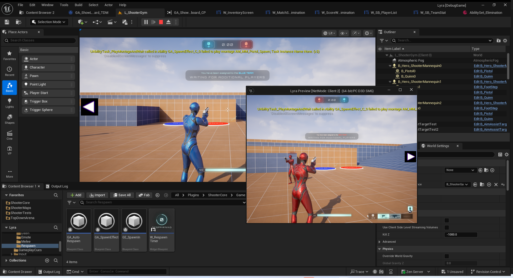
#### 启动暖场阶段
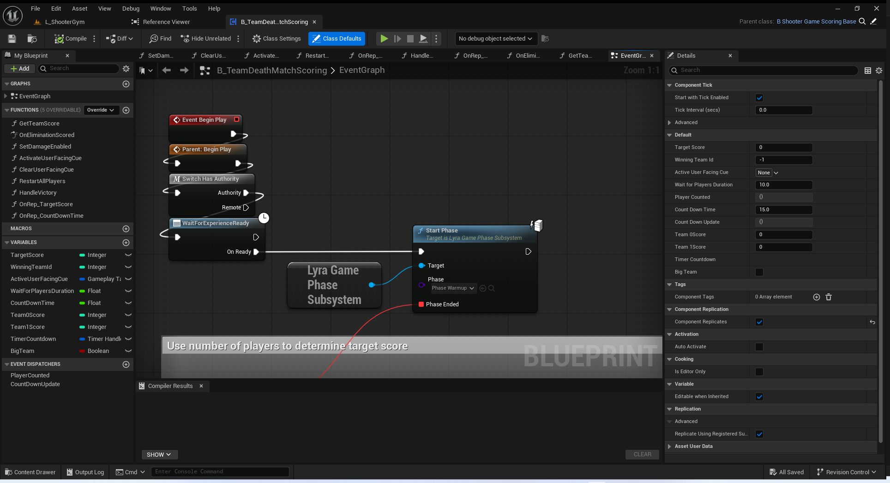
#### 暖场逻辑
是否需要测试全流程,还是直接进入战斗阶段
校核合理的等待时间
施加全局无敌效果
``` cpp
bool ULyraDevelopmentStatics::ShouldSkipDirectlyToGameplay()
{
#if WITH_EDITOR
	if (GIsEditor)
	{
		return !GetDefault<ULyraDeveloperSettings>()->bTestFullGameFlowInPIE;
	}
#endif
	return false;
}

```
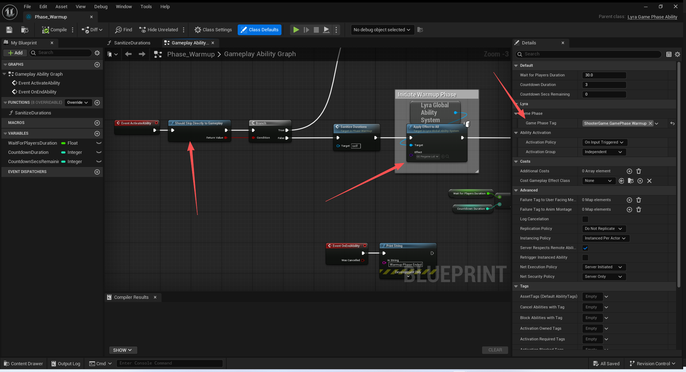
结束暖场阶段
收回无敌效果
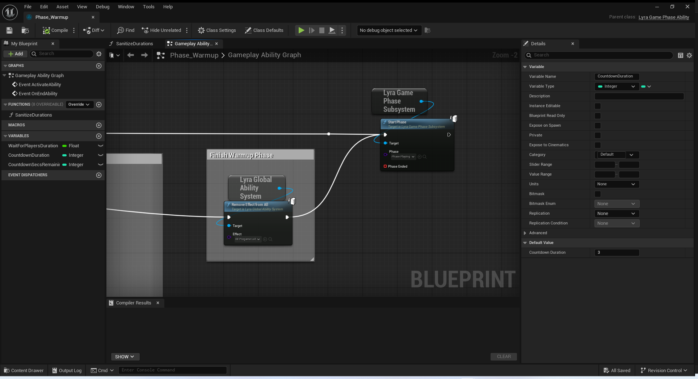

当我们施加无敌效果时 会带有一个GameplayCue

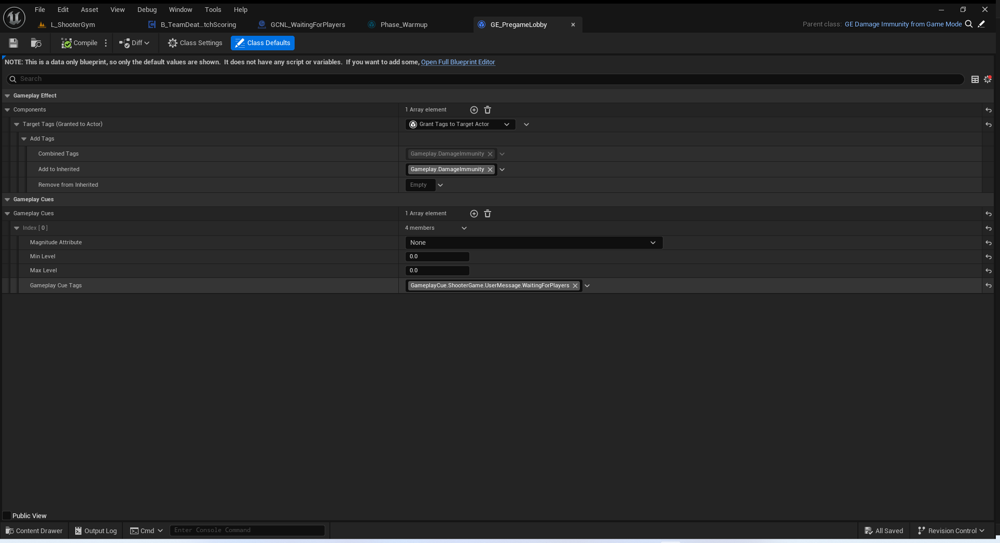
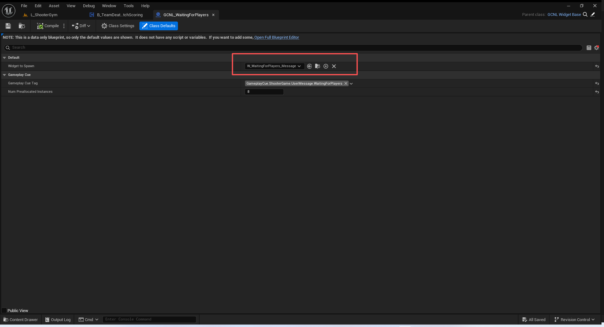
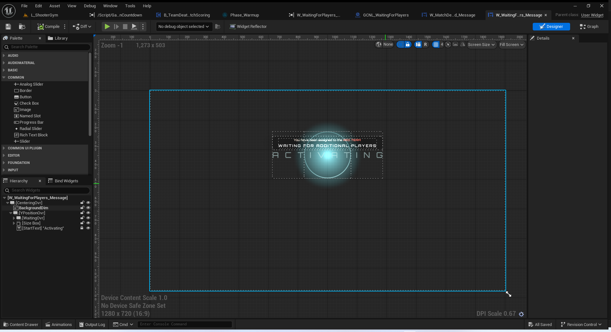
这里发送3秒等待的倒计时
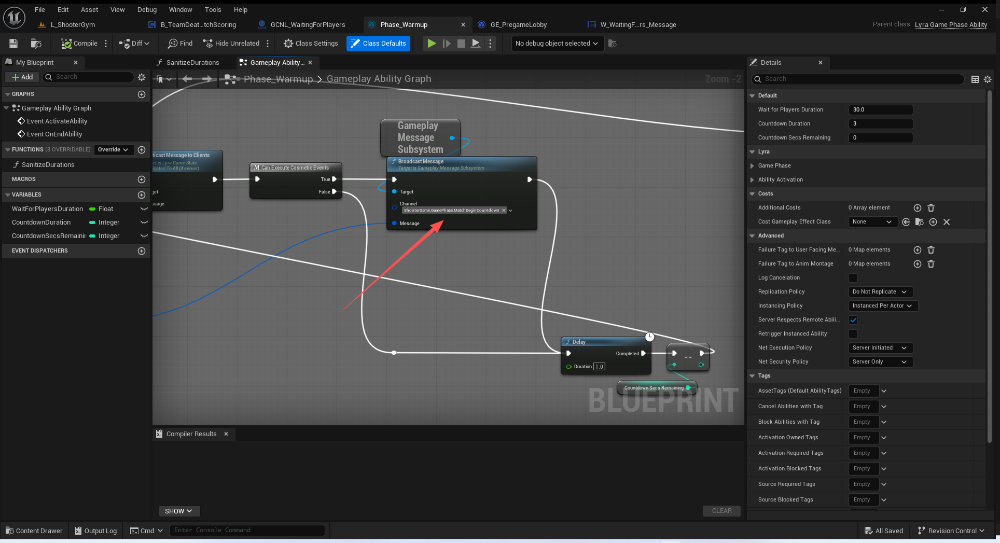
还有就是在这期间如果有玩家加入会有一个dang的声音
来自于父类GC
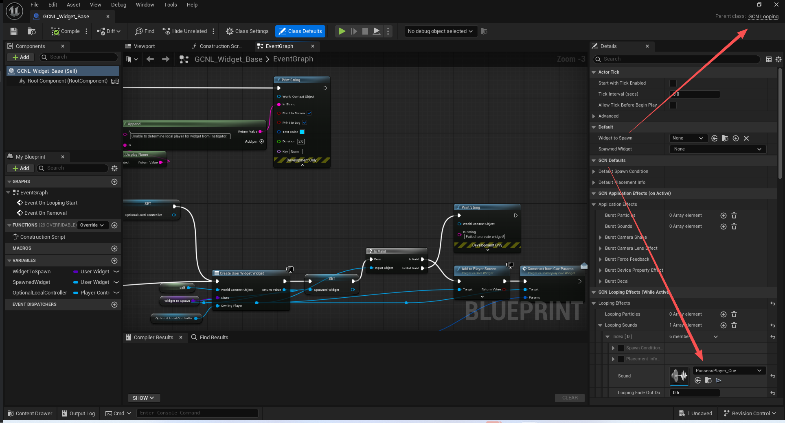
#### 暖场结束
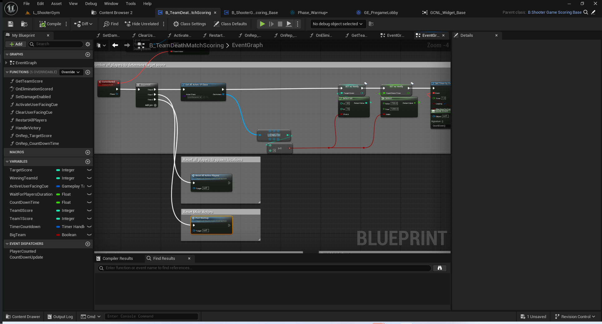
根据玩家人数设计游戏时长和目标
激活人物的Reset能力
清理场景杂项,如手榴弹,武器生成器等
### 战斗阶段
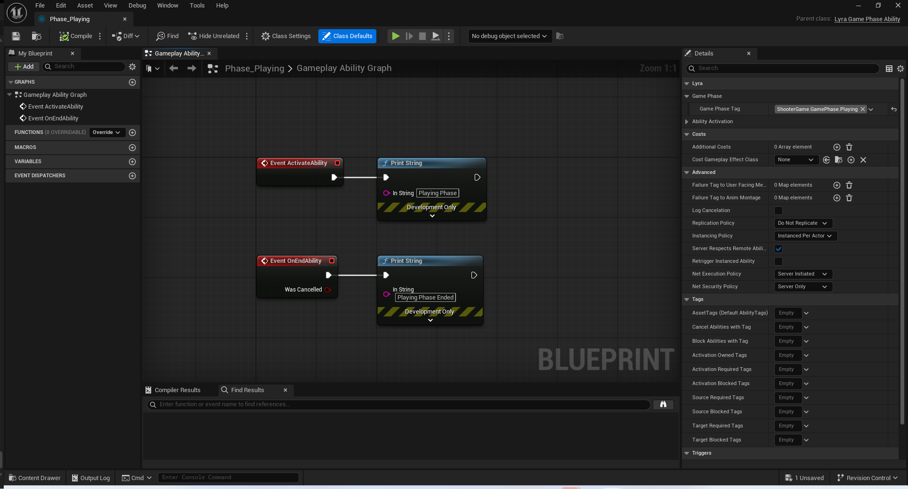
### 计分阶段
时间到了,或者比分到了,或者强制结束
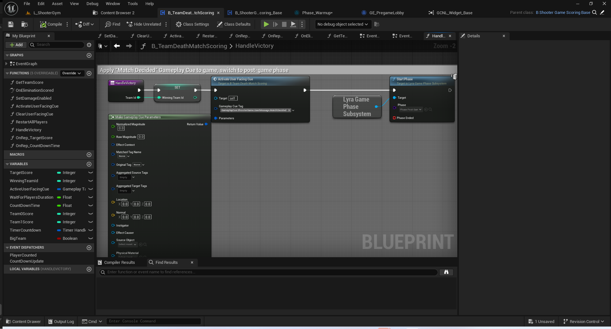
全局无敌,延迟几秒 禁止释放技能 开启下一场游戏
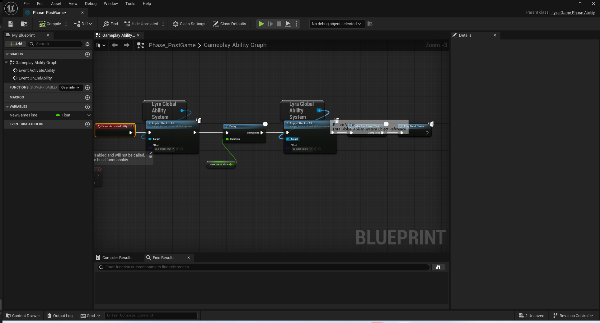
``` cpp
void ULyraSystemStatics::PlayNextGame(const UObject* WorldContextObject)
{
	UWorld* World = GEngine->GetWorldFromContextObject(WorldContextObject, EGetWorldErrorMode::LogAndReturnNull);
	if (World == nullptr)
	{
		return;
	}

	const FWorldContext& WorldContext = GEngine->GetWorldContextFromWorldChecked(World);
	FURL LastURL = WorldContext.LastURL;

#if WITH_EDITOR
	// To transition during PIE we need to strip the PIE prefix from maps.
	// 在进行 PIE 转换时，我们需要从映射中去除 PIE 前缀。
	LastURL.Map = UWorld::StripPIEPrefixFromPackageName(LastURL.Map, WorldContext.World()->StreamingLevelsPrefix);
#endif

	// Add seamless travel option as we want to keep clients connected. This will fall back to hard travel if seamless is disabled
	// 添加无缝出行选项，因为我们希望保持与客户的良好联系。如果选择“无缝”功能却被禁用，系统将自动切换回传统的出行方式。
	LastURL.AddOption(TEXT("SeamlessTravel"));

	FString URL = LastURL.ToString();
	// If we don't remove the host/port info the server travel will fail.
	// 如果我们不删除主机名/端口号信息，服务器传输操作将会失败。
	URL.RemoveFromStart(LastURL.GetHostPortString());
	
	const bool bAbsolute = false; // we want to use TRAVEL_Relative
	const bool bShouldSkipGameNotify = false;
	World->ServerTravel(URL, bAbsolute, bShouldSkipGameNotify);
}


```
GCNL_MatchDecided同等待玩家加入的GC
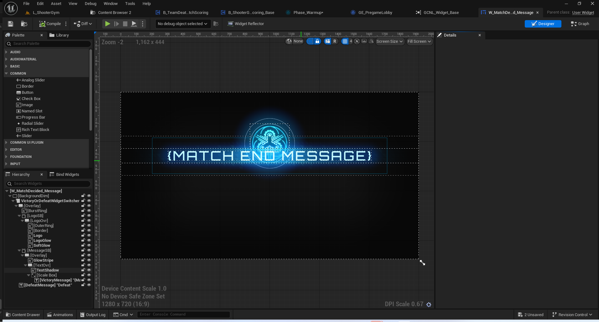


## ULyraDevelopmentStatics
此处将这个静态函数库补充.之前漏掉了.比较简单.直接移植代码即可.
``` cpp

UCLASS()
class ULyraDevelopmentStatics : public UBlueprintFunctionLibrary
{
	GENERATED_BODY()

public:
	// Should game logic skip directly to gameplay (skipping any match warmup / waiting for players / etc... aspects)
	// Will always return false except when playing in the editor and bTestFullGameFlowInPIE (in Lyra Developer Settings) is false
	// 游戏逻辑是否应直接进入游戏玩法阶段（跳过任何匹配热身/等待玩家/等环节）
	// 除在编辑器中进行游戏且 bTestFullGameFlowInPIE（在 Lyra 开发者设置中）为 false 时外，总是返回 false
	UFUNCTION(BlueprintCallable, Category="Lyra")
	static bool ShouldSkipDirectlyToGameplay();

	// Should game logic load cosmetic backgrounds in the editor?
	// Will always return true except when playing in the editor and bSkipLoadingCosmeticBackgroundsInPIE (in Lyra Developer Settings) is true
	// 游戏逻辑是否应在编辑器中加载外观背景？
	// 除在编辑器中运行且 bSkipLoadingCosmeticBackgroundsInPIE（在 Lyra 开发者设置中）为真时外，总是返回真。
	UFUNCTION(BlueprintCallable, Category = "Lyra", meta=(ExpandBoolAsExecs="ReturnValue"))
	static bool ShouldLoadCosmeticBackgrounds();

	// Should game logic load cosmetic backgrounds in the editor?
	// Will always return true except when playing in the editor and bSkipLoadingCosmeticBackgroundsInPIE (in Lyra Developer Settings) is true
	// 游戏逻辑是否应在编辑器中加载外观背景？
	// 除在编辑器中运行且 bSkipLoadingCosmeticBackgroundsInPIE（在 Lyra 开发者设置中）为真时外，总是返回真。
	UFUNCTION(BlueprintCallable, Category = "Lyra")
	static bool CanPlayerBotsAttack();

	// Finds the most appropriate play-in-editor world to run 'server' cheats on
	//   This might be the only world if running standalone, the listen server, or the dedicated server
	// 找出最适合运行“服务器”作弊功能的游戏加载编辑器世界
	//   如果以独立模式、监听服务器模式或专用服务器模式运行，则此世界可能是唯一可用的世界
	static UWorld* FindPlayInEditorAuthorityWorld();

	// Tries to find a class by a short name (with some heuristics to improve the usability when done via a cheat console)
	// 尝试通过简短的类名来查找类（通过一些优化策略来提高通过作弊控制台进行查找时的可用性）
	static UClass* FindClassByShortName(const FString& SearchToken, UClass* DesiredBaseClass, bool bLogFailures = true);

	// 在作弊管理器中调用!用以添加角色组件.
	template <typename DesiredClass>
	static TSubclassOf<DesiredClass> FindClassByShortName(const FString& SearchToken, bool bLogFailures = true)
	{
		return FindClassByShortName(SearchToken, DesiredClass::StaticClass(), bLogFailures);
	}

private:
	// 通过资产注册器获取到所有蓝图
	static TArray<FAssetData> GetAllBlueprints();
	// 通过访问资产注册器,寻找指定的蓝图类
	static UClass* FindBlueprintClass(const FString& TargetNameRaw, UClass* DesiredBaseClass);
};

```

``` cpp
bool ULyraDevelopmentStatics::ShouldSkipDirectlyToGameplay()
{
#if WITH_EDITOR
	if (GIsEditor)
	{
		return !GetDefault<ULyraDeveloperSettings>()->bTestFullGameFlowInPIE;
	}
#endif
	return false;
}

bool ULyraDevelopmentStatics::ShouldLoadCosmeticBackgrounds()
{
#if WITH_EDITOR
	if (GIsEditor)
	{
		return !GetDefault<ULyraDeveloperSettings>()->bSkipLoadingCosmeticBackgroundsInPIE;
	}
#endif
	return true;
}

bool ULyraDevelopmentStatics::CanPlayerBotsAttack()
{
#if WITH_EDITOR
	if (GIsEditor)
	{
		return GetDefault<ULyraDeveloperSettings>()->bAllowPlayerBotsToAttack;
	}
#endif
	return true;
}

//@TODO: Actually want to take a lambda and run on every authority world most of the time...
//@待办事项：实际上希望使用一个 lambda 函数，并在大多数情况下在每个权限世界中运行……
UWorld* ULyraDevelopmentStatics::FindPlayInEditorAuthorityWorld()
{
	check(GEngine);

	// Find the server world (any PIE world will do, in case they are running without a dedicated server, but the ded. server world is ideal)
	// 找到服务器世界（任何一款 PIE 世界都行，因为如果他们没有专用服务器的话也可以使用任意世界，但专用服务器世界则是最佳选择）
	UWorld* ServerWorld = nullptr;
#if WITH_EDITOR
	for (const FWorldContext& WorldContext : GEngine->GetWorldContexts())
	{
		if (WorldContext.WorldType == EWorldType::PIE)
		{
			if (UWorld* TestWorld = WorldContext.World())
			{
				if (WorldContext.RunAsDedicated)
				{
					// Ideal case
					// 最理想的情况

					ServerWorld = TestWorld;
					break;
				}
				else if (ServerWorld == nullptr)
				{
					ServerWorld = TestWorld;
				}
				else
				{
					// We already have a candidate, see if this one is 'better'
					// 我们已经有了一个候选人，现在来看看这个候选人是否更出色一些。
					if (TestWorld->GetNetMode() < ServerWorld->GetNetMode())
					{
						return ServerWorld;
					}
				}
			}
		}
	}
#endif

	return ServerWorld;
}

TArray<FAssetData> ULyraDevelopmentStatics::GetAllBlueprints()
{
	FAssetRegistryModule& AssetRegistryModule = FModuleManager::LoadModuleChecked<FAssetRegistryModule>(TEXT("AssetRegistry"));

	FName PluginAssetPath;

	TArray<FAssetData> BlueprintList;
	FARFilter Filter;
	Filter.ClassPaths.Add(UBlueprint::StaticClass()->GetClassPathName());
	Filter.bRecursivePaths = true;
	AssetRegistryModule.Get().GetAssets(Filter, BlueprintList);

	return BlueprintList;
}

UClass* ULyraDevelopmentStatics::FindBlueprintClass(const FString& TargetNameRaw, UClass* DesiredBaseClass)
{
	FString TargetName = TargetNameRaw;
	TargetName.RemoveFromEnd(TEXT("_C"), ESearchCase::CaseSensitive);

	TArray<FAssetData> BlueprintList = ULyraDevelopmentStatics::GetAllBlueprints();
	for (const FAssetData& AssetData : BlueprintList)
	{
		if ((AssetData.AssetName.ToString() == TargetName) || (AssetData.GetObjectPathString() == TargetName))
		{
			if (UBlueprint* BP = Cast<UBlueprint>(AssetData.GetAsset()))
			{
				if (UClass* GeneratedClass = BP->GeneratedClass)
				{
					if (GeneratedClass->IsChildOf(DesiredBaseClass))
					{
						return GeneratedClass;
					}
				}
			}
		}
	}

	return nullptr;
}

UClass* ULyraDevelopmentStatics::FindClassByShortName(const FString& SearchToken, UClass* DesiredBaseClass, bool bLogFailures)
{
	check(DesiredBaseClass);

	FString TargetName = SearchToken;

	// Check native classes and loaded assets first before resorting to the asset registry
	// 首先检查原生类和已加载的资源，然后再使用资源注册表进行操作
	bool bIsValidClassName = true;
	if (TargetName.IsEmpty() || TargetName.Contains(TEXT(" ")))
	{
		bIsValidClassName = false;
	}
	/**
	 * 检查该字符串是否为“短包名”。短包名是指在“长包名”中最后一个斜杠之后的部分。处理短包名对于控制台命令和其他用户界面来说很有用。
	 * 短包名需要进行转换才能变为“长包名”。
	 *
	 * @参数 可能较长的名称：包名称。
	 * @返回值 如果给定的名称是简短的包名称（不含斜杠），则返回 true，否则返回 false。
	 * 比如:
	 * 长包名:/ShooterCore/ShooterCore.ShooterCore
	 * 短包名:ShooterCore.ShooterCore
	 * 
	 */
	else if (!FPackageName::IsShortPackageName(TargetName))
	{
		if (TargetName.Contains(TEXT(".")))
		{
			// Convert type'path' to just path (will return the full string if it doesn't have ' in it)
			// 将类型“path”转换为单纯的“path”（如果字符串中没有“”符号，则会返回完整的字符串）

			// /Script/Engine.Blueprint'/Game/Characters/Character_Default.Character_Default'
			
			/**
			 * 返回由所提供的导出文本路径所指向的对象的路径（不包括类名）。
			 * @参数 InExportTextPath：对象的导出文本路径。其形式为：类名'对象路径'
			 * @返回：由所提供的导出路径所指向的对象的路径。
			 * 
			 */
			TargetName = FPackageName::ExportTextPathToObjectPath(TargetName);

			// /Game/Characters/Character_Default
			FString PackageName;
			// Character_Default
			FString ObjectName;
			TargetName.Split(TEXT("."), &PackageName, &ObjectName);

			const bool bIncludeReadOnlyRoots = true;
			FText Reason;
			/**
			 * 如果路径以有效的根目录开头（例如 /Game/、/Engine/ 等）且不含非法字符，则返回 true 。*
			 * @参数 InLongPackageName：要测试的包名
			 * @参数 bIncludeReadOnlyRoots：若为真，则会包含那些不应保存的根目录（/Temp/、/Script/）
			 * @参数 OutReason：当返回 false 时，此参数将提供有关该名称错误的描述
			 * @返回 true 表示这是一个有效的长包名
			 * 
			 */
			if (!FPackageName::IsValidLongPackageName(PackageName, bIncludeReadOnlyRoots, &Reason))
			{
				bIsValidClassName = false;
			}
		}
		else
		{
			bIsValidClassName = false;
		}
	}

	UClass* ResultClass = nullptr;
	if (bIsValidClassName)
	{
		/**
		 * 该实用函数旨在根据路径名或简短名称查找类型（类/结构体/枚举），但若输入的是简短类名，则会抛出警告（并附带调用栈信息）。
		 * 该函数用于查找并修复仍使用简短类名的其他地方。
		 * 该函数运行速度较慢，不适用于性能关键型场景。
		 * @参数 类名（简短名称或路径名）
		 * @返回 成功时指向类型对象的指针，否则返回 false
		 * 
		 */
		ResultClass = UClass::TryFindTypeSlow<UClass>(TargetName);
	}

	// If we still haven't found anything yet, try the asset registry for blueprints that match the requirements
	// 如果我们目前仍未找到任何结果，那就去资产登记处查找符合要求的蓝图吧
	if (ResultClass == nullptr)
	{
		ResultClass = FindBlueprintClass(TargetName, DesiredBaseClass);
	}

	// Now validate the class (if we have one)
	// 现在对这个类进行验证（如果有该类的话）
	if (ResultClass != nullptr)
	{
		if (!ResultClass->IsChildOf(DesiredBaseClass))
		{
			if (bLogFailures)
			{
				UE_LOG(LogConsoleResponse, Warning, TEXT("Found an asset %s but it wasn't of type %s"), *ResultClass->GetPathName(), *DesiredBaseClass->GetName());
			}
			ResultClass = nullptr;
		}
	}
	else
	{
		if (bLogFailures)
		{
			UE_LOG(LogConsoleResponse, Warning, TEXT("Failed to find class of type %s named %s"), *DesiredBaseClass->GetName(), *SearchToken);
		}
	}

	return ResultClass;
}


```
## 团队积分面板
### 顶部得分
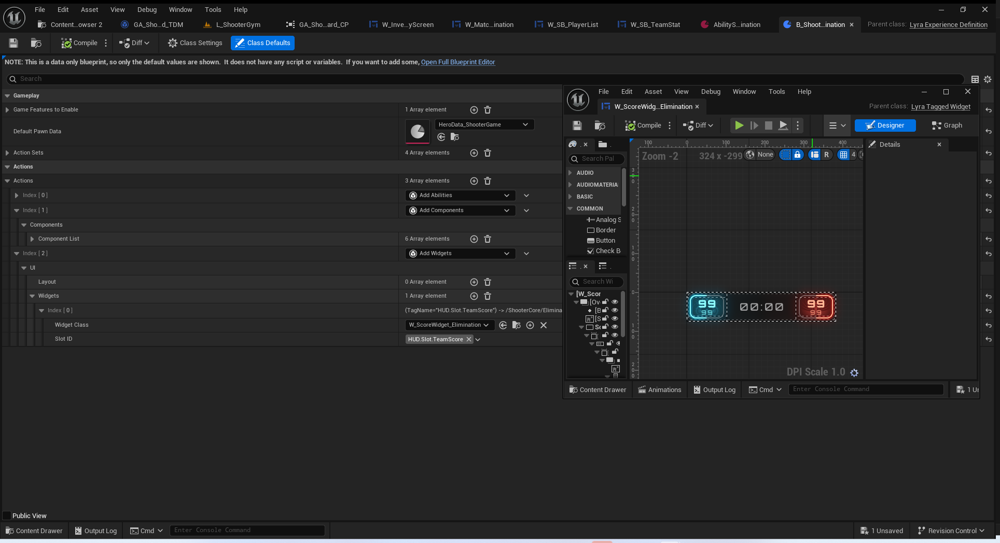


### 按住显示UI的技能
GAB_ShowWidget_WhileInputHeld
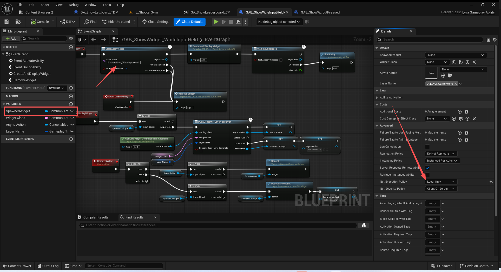
衍生技能,GA_ShowLeaderboard_TDM,GA_ShowLeaderboard_CP
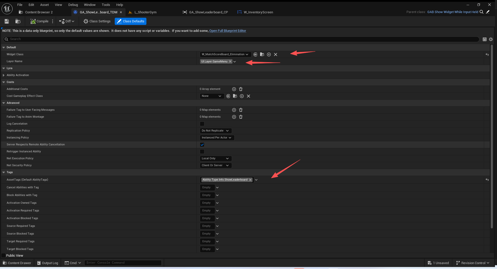

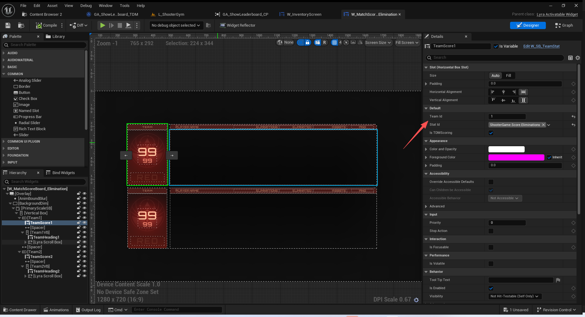
注意这里的UI获取信息是硬编码的.所以挺无语.想要复用移植的,得修改一些蓝图逻辑才行!
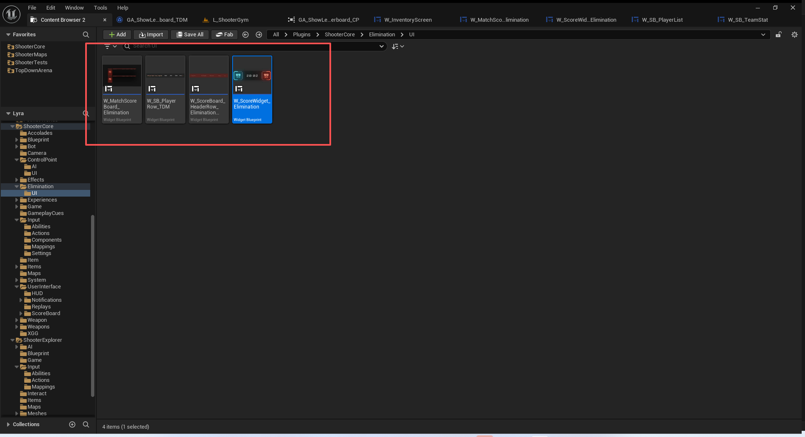
这几个控件蓝图硬编码很严重.就不在文档中详细截图阐述了.
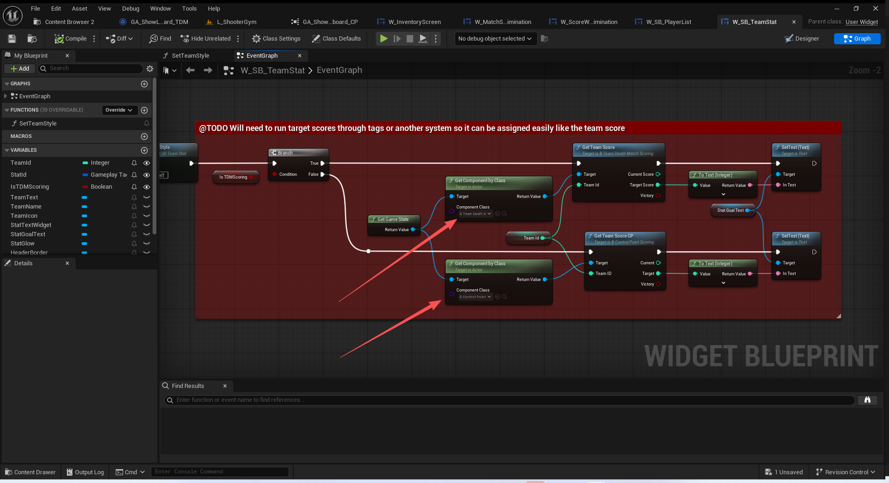

### 按键显示UI的技能
GAB_ShowWidget_WhenInputPressed

衍生技能,GA_ToggleInventory,GA_ToggleMap
注意这个UI必须要接收面板的退出事件,或者有其他按键可以点击退出,要不然会卡住,是个不算完成的部分代码
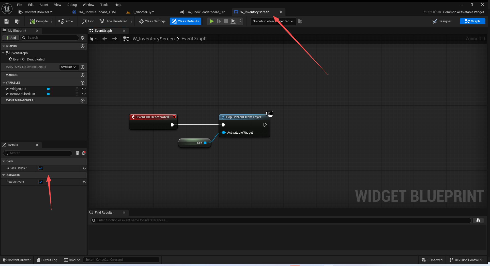

### 技能的注册
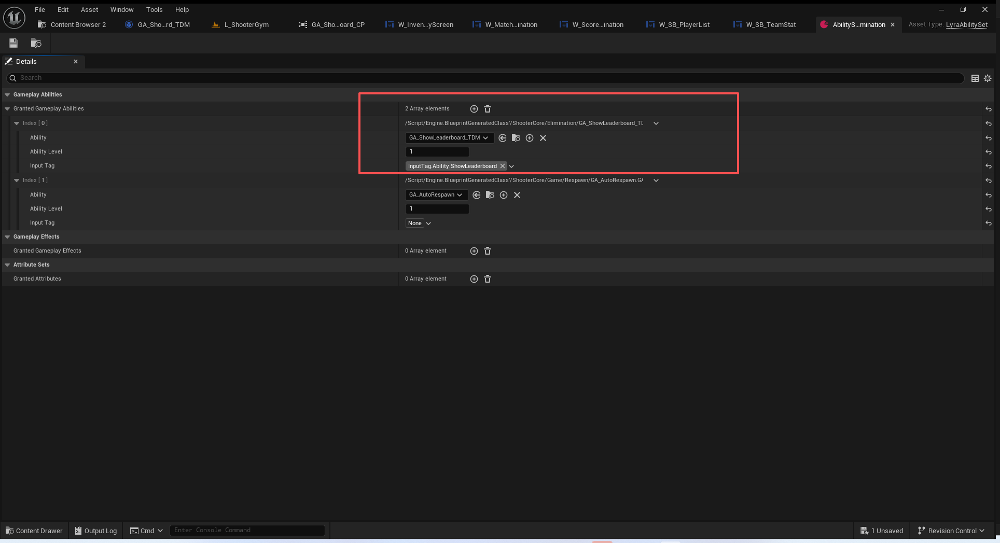
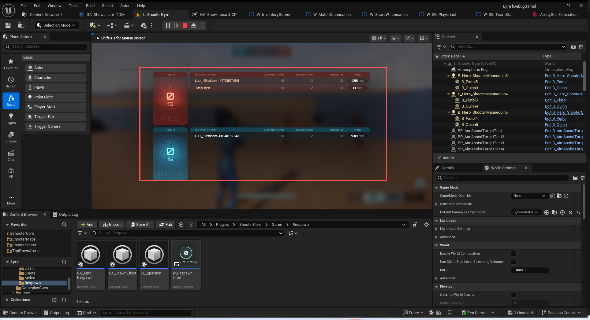


## 总结
本文讲解了关于游戏阶段的划分.
需要注意这个Tag的匹配方式,如何理解精准匹配,还是部分匹配.
还有就是关于GA的编辑器开发,如何配置一个新的资产定义.这部分内容不要求掌握.
我们是以歼灭模式进行举例.实际还有占点模式.以及炸弹人模式的阶段要求.可自行阅读这部分蓝图配置.