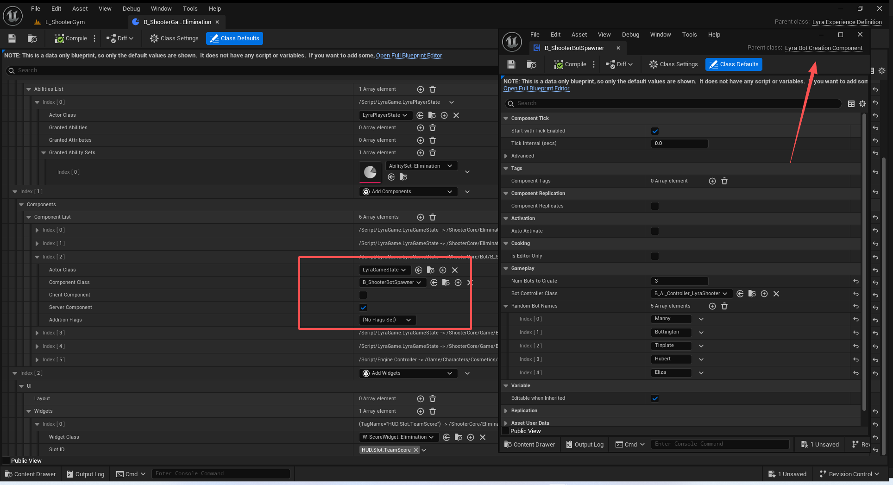
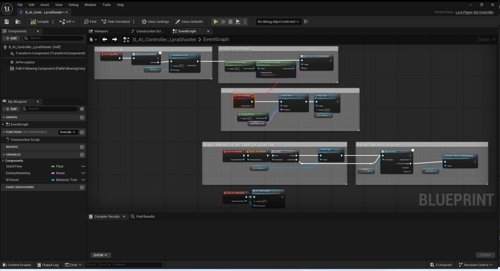

# UE5_Lyra学习指南_108_机器人系统

本文章仅为小刚-B站课堂-虚幻引擎视频课程Lyra-精讲的演讲手稿.  
本套课程链接:[[UE5]虚幻引擎游戏案例Lyra精讲](https://www.bilibili.com/cheese/play/ss112001159)  
前置课程链接:[[UE5]虚幻引擎UEC++从基础到进阶](https://www.bilibili.com/cheese/play/ss28043)  

文章内容由小刚撰写,采用了以下多种方式:  
1.口述转文字  
2.AI重构  
3.参考引擎源码  
4.Lyra工程源码  
5.结合社区论坛各位大佬的解析  

- [UE5\_Lyra学习指南\_108\_机器人系统](#ue5_lyra学习指南_108_机器人系统)
	- [概述](#概述)
	- [ULyraBotCreationComponent](#ulyrabotcreationcomponent)
		- [添加管理组件](#添加管理组件)
		- [头文件](#头文件)
		- [绑定体验流程](#绑定体验流程)
		- [服务器流程](#服务器流程)
			- [获取AI名字](#获取ai名字)
			- [生成一个机器人](#生成一个机器人)
			- [队伍分配](#队伍分配)
			- [移除一个机器人](#移除一个机器人)
	- [机器人作弊拓展](#机器人作弊拓展)
		- [注册拓展](#注册拓展)
	- [机器人的AI控制器](#机器人的ai控制器)
		- [头文件](#头文件-1)
		- [构造函数](#构造函数)
		- [队伍接口的处理](#队伍接口的处理)
		- [重启机器人控制器](#重启机器人控制器)
		- [蓝图逻辑](#蓝图逻辑)
	- [总结](#总结)


## 概述
本节主要讲解机器人的创建流程
## ULyraBotCreationComponent
### 添加管理组件

### 头文件
``` cpp
UCLASS(Blueprintable, Abstract)
class ULyraBotCreationComponent : public UGameStateComponent
{
	GENERATED_BODY()

public:
	// 构造函数 无
	ULyraBotCreationComponent(const FObjectInitializer& ObjectInitializer = FObjectInitializer::Get());

	//~UActorComponent interface
	// 等待体验加载完毕后执行
	virtual void BeginPlay() override;
	//~End of UActorComponent interface

private:
	
	// 发起机器人创建流程
	void OnExperienceLoaded(const ULyraExperienceDefinition* Experience);

protected:
	// 打算创建多少个
	UPROPERTY(EditDefaultsOnly, BlueprintReadOnly, Category=Gameplay)
	int32 NumBotsToCreate = 5;

	// 默认使用的AI控制器类
	UPROPERTY(EditDefaultsOnly, BlueprintReadOnly, Category=Gameplay)
	TSubclassOf<AAIController> BotControllerClass;

	// 随机的名字
	UPROPERTY(EditDefaultsOnly, BlueprintReadOnly, Category=Gameplay)
	TArray<FString> RandomBotNames;

	// 剩下未使用的名字
	TArray<FString> RemainingBotNames;

protected:
	// 容器
	UPROPERTY(Transient)
	TArray<TObjectPtr<AAIController>> SpawnedBotList;

	/** Always creates a single bot */
	/** 总是创建一个单一的机器人 */
	UFUNCTION(BlueprintCallable, BlueprintAuthorityOnly, Category=Gameplay)
	virtual void SpawnOneBot();

	/** Deletes the last created bot if possible */
	/** 若可能，则删除最后创建的机器人 */
	UFUNCTION(BlueprintCallable, BlueprintAuthorityOnly, Category=Gameplay)
	virtual void RemoveOneBot();

	/** Spawns bots up to NumBotsToCreate */
	/** 启动最多 NumBotsToCreate 个机器人 */
	UFUNCTION(BlueprintNativeEvent, BlueprintAuthorityOnly, Category=Gameplay)
	void ServerCreateBots();

#if WITH_SERVER_CODE
public:
	void Cheat_AddBot() { SpawnOneBot(); }
	void Cheat_RemoveBot() { RemoveOneBot(); }

	FString CreateBotName(int32 PlayerIndex);
#endif
};

```

### 绑定体验流程
``` cpp
void ULyraBotCreationComponent::BeginPlay()
{
	Super::BeginPlay();

	// Listen for the experience load to complete
	// 等待体验加载完毕
	AGameStateBase* GameState = GetGameStateChecked<AGameStateBase>();
	ULyraExperienceManagerComponent* ExperienceComponent = GameState->FindComponentByClass<ULyraExperienceManagerComponent>();
	check(ExperienceComponent);
	ExperienceComponent->CallOrRegister_OnExperienceLoaded_LowPriority(FOnLyraExperienceLoaded::FDelegate::CreateUObject(this, &ThisClass::OnExperienceLoaded));
}

```

``` cpp
void ULyraBotCreationComponent::OnExperienceLoaded(const ULyraExperienceDefinition* Experience)
{
#if WITH_SERVER_CODE
	if (HasAuthority())
	{
		ServerCreateBots();
	}
#endif
}

```
### 服务器流程
如果是客户端 函数实现
``` cpp
void ULyraBotCreationComponent::ServerCreateBots_Implementation()
{
	ensureMsgf(0, TEXT("Bot functions do not exist in LyraClient!"));
}

void ULyraBotCreationComponent::SpawnOneBot()
{
	ensureMsgf(0, TEXT("Bot functions do not exist in LyraClient!"));
}

void ULyraBotCreationComponent::RemoveOneBot()
{
	ensureMsgf(0, TEXT("Bot functions do not exist in LyraClient!"));
}
```
服务器实现如下
``` cpp

void ULyraBotCreationComponent::ServerCreateBots_Implementation()
{
	if (BotControllerClass == nullptr)
	{
		return;
	}

	RemainingBotNames = RandomBotNames;

	// Determine how many bots to spawn
	// 确定要生成多少个机器人
	int32 EffectiveBotCount = NumBotsToCreate;

	// Give the developer settings a chance to override it
	// 给开发人员设置一个机会来对其进行更改/覆盖
	if (GIsEditor)
	{
		const ULyraDeveloperSettings* DeveloperSettings = GetDefault<ULyraDeveloperSettings>();
		
		if (DeveloperSettings->bOverrideBotCount)
		{
			EffectiveBotCount = DeveloperSettings->OverrideNumPlayerBotsToSpawn;
		}
	}

	// Give the URL a chance to override it
	// 给该 URL 一个机会去覆盖它
	if (AGameModeBase* GameModeBase = GetGameMode<AGameModeBase>())
	{
		EffectiveBotCount = UGameplayStatics::GetIntOption(GameModeBase->OptionsString, TEXT("NumBots"), EffectiveBotCount);
	}

	// Create them
	// 创建它们
	for (int32 Count = 0; Count < EffectiveBotCount; ++Count)
	{
		SpawnOneBot();
	}
}

```
#### 获取AI名字
``` cpp
FString ULyraBotCreationComponent::CreateBotName(int32 PlayerIndex)
{
	FString Result;
	if (RemainingBotNames.Num() > 0)
	{
		const int32 NameIndex = FMath::RandRange(0, RemainingBotNames.Num() - 1);
		Result = RemainingBotNames[NameIndex];
		RemainingBotNames.RemoveAtSwap(NameIndex);
	}
	else
	{
		//@TODO: PlayerId is only being initialized for players right now
		//@待办事项：目前仅对玩家进行“PlayerId”初始化操作。
		PlayerIndex = FMath::RandRange(260, 260+100);
		Result = FString::Printf(TEXT("Tinplate %d"), PlayerIndex);
	}
	return Result;
}


```
#### 生成一个机器人
``` cpp
void ULyraBotCreationComponent::SpawnOneBot()
{
	FActorSpawnParameters SpawnInfo;
	SpawnInfo.SpawnCollisionHandlingOverride = ESpawnActorCollisionHandlingMethod::AlwaysSpawn;
	SpawnInfo.OverrideLevel = GetComponentLevel();
	SpawnInfo.ObjectFlags |= RF_Transient;
	
	AAIController* NewController = GetWorld()->SpawnActor<AAIController>(BotControllerClass, FVector::ZeroVector, FRotator::ZeroRotator, SpawnInfo);

	if (NewController != nullptr)
	{
		ALyraGameMode* GameMode = GetGameMode<ALyraGameMode>();
		check(GameMode);

		if (NewController->PlayerState != nullptr)
		{
			// 目前这个PlayerIndexID没有在AI这里用到
			NewController->PlayerState->SetPlayerName(CreateBotName(NewController->PlayerState->GetPlayerId()));
		}
		
		// 初始化这个AI控制器
		// 让我们为它分配队伍!!!!
		GameMode->GenericPlayerInitialization(NewController);
		
		// 为它生成角色
		GameMode->RestartPlayer(NewController);

		if (NewController->GetPawn() != nullptr)
		{
			if (ULyraPawnExtensionComponent* PawnExtComponent = NewController->GetPawn()->FindComponentByClass<ULyraPawnExtensionComponent>())
			{	// 尝试推进一下流程
				PawnExtComponent->CheckDefaultInitialization();
			}
		}
		// 缓存起来 方便后面访问处理
		SpawnedBotList.Add(NewController);
	}
}


```

#### 队伍分配
``` cpp
void ALyraGameMode::GenericPlayerInitialization(AController* NewPlayer)
{
	Super::GenericPlayerInitialization(NewPlayer);

	OnGameModePlayerInitialized.Broadcast(this, NewPlayer);
}
```
``` cpp
void ULyraTeamCreationComponent::ServerAssignPlayersToTeams()
{
	// Assign players that already exist to teams
	// 将已存在的玩家分配到团队中
	AGameStateBase* GameState = GetGameStateChecked<AGameStateBase>();
	for (APlayerState* PS : GameState->PlayerArray)
	{
		if (ALyraPlayerState* LyraPS = Cast<ALyraPlayerState>(PS))
		{
			ServerChooseTeamForPlayer(LyraPS);
		}
	}

	// Listen for new players logging in
	ALyraGameMode* GameMode = Cast<ALyraGameMode>(GameState->AuthorityGameMode);
	check(GameMode);

	GameMode->OnGameModePlayerInitialized.AddUObject(this, &ThisClass::OnPlayerInitialized);
}

```
``` cpp
void ULyraTeamCreationComponent::OnPlayerInitialized(AGameModeBase* GameMode, AController* NewPlayer)
{
	check(NewPlayer);
	check(NewPlayer->PlayerState);
	if (ALyraPlayerState* LyraPS = Cast<ALyraPlayerState>(NewPlayer->PlayerState))
	{
		ServerChooseTeamForPlayer(LyraPS);
	}
}

```


#### 移除一个机器人
``` cpp

void ULyraBotCreationComponent::RemoveOneBot()
{
	if (SpawnedBotList.Num() > 0)
	{
		// Right now this removes a random bot as they're all the same; could prefer to remove one
		// that's high skill or low skill or etc... depending on why you are removing one
		// 目前，我们会随机移除一个机器人，因为它们都是相同的；但也可以选择移除一个技能水平较高或较低的机器人，这取决于你为何要移除某个机器人。
		const int32 BotToRemoveIndex = FMath::RandRange(0, SpawnedBotList.Num() - 1);

		AAIController* BotToRemove = SpawnedBotList[BotToRemoveIndex];
		SpawnedBotList.RemoveAtSwap(BotToRemoveIndex);

		if (BotToRemove)
		{
			// If we can find a health component, self-destruct it, otherwise just destroy the actor
			// 如果我们能找到一个健康组件，就将其销毁，否则就直接摧毁该角色。
			if (APawn* ControlledPawn = BotToRemove->GetPawn())
			{
				if (ULyraHealthComponent* HealthComponent = ULyraHealthComponent::FindHealthComponent(ControlledPawn))
				{
					// Note, right now this doesn't work quite as desired: as soon as the player state goes away when
					// the controller is destroyed, the abilities like the death animation will be interrupted immediately
					// 需要注意的是，目前这一功能的运行效果并不完全如预期：一旦玩家状态因控制器被销毁而消失，诸如死亡动画之类的功能就会立即中断。
					HealthComponent->DamageSelfDestruct();
				}
				else
				{
					ControlledPawn->Destroy();
				}
			}

			// Destroy the controller (will cause it to Logout, etc...)
			// 销毁控制器（这将导致其退出登录等操作）
			BotToRemove->Destroy();
		}
	}
}


```
``` cpp
void ULyraHealthComponent::DamageSelfDestruct(bool bFellOutOfWorld)
{
	if ((DeathState == ELyraDeathState::NotDead) && AbilitySystemComponent)
	{
		const TSubclassOf<UGameplayEffect> DamageGE = ULyraAssetManager::GetSubclass(ULyraGameData::Get().DamageGameplayEffect_SetByCaller);
		if (!DamageGE)
		{
			UE_LOG(LogLyra, Error, TEXT("LyraHealthComponent: DamageSelfDestruct failed for owner [%s]. Unable to find gameplay effect [%s]."), *GetNameSafe(GetOwner()), *ULyraGameData::Get().DamageGameplayEffect_SetByCaller.GetAssetName());
			return;
		}

		FGameplayEffectSpecHandle SpecHandle = AbilitySystemComponent->MakeOutgoingSpec(DamageGE, 1.0f, AbilitySystemComponent->MakeEffectContext());
		FGameplayEffectSpec* Spec = SpecHandle.Data.Get();

		if (!Spec)
		{
			UE_LOG(LogLyra, Error, TEXT("LyraHealthComponent: DamageSelfDestruct failed for owner [%s]. Unable to make outgoing spec for [%s]."), *GetNameSafe(GetOwner()), *GetNameSafe(DamageGE));
			return;
		}

		Spec->AddDynamicAssetTag(TAG_Gameplay_DamageSelfDestruct);

		if (bFellOutOfWorld)
		{
			Spec->AddDynamicAssetTag(TAG_Gameplay_FellOutOfWorld);
		}

		const float DamageAmount = GetMaxHealth();

		Spec->SetSetByCallerMagnitude(LyraGameplayTags::SetByCaller_Damage, DamageAmount);
		AbilitySystemComponent->ApplyGameplayEffectSpecToSelf(*Spec);
	}
}

```
## 机器人作弊拓展
``` cpp
/** Cheats related to bots */
UCLASS(NotBlueprintable)
class ULyraBotCheats final : public UCheatManagerExtension
{
	GENERATED_BODY()

public:
	ULyraBotCheats();

	// Adds a bot player
	UFUNCTION(Exec, BlueprintAuthorityOnly)
	void AddPlayerBot();

	// Removes a random bot player
	UFUNCTION(Exec, BlueprintAuthorityOnly)
	void RemovePlayerBot();

private:
	ULyraBotCreationComponent* GetBotComponent() const;
};

```
### 注册拓展
``` cpp
ULyraBotCheats::ULyraBotCheats()
{
#if WITH_SERVER_CODE && UE_WITH_CHEAT_MANAGER
	if (HasAnyFlags(RF_ClassDefaultObject))
	{
		UCheatManager::RegisterForOnCheatManagerCreated(FOnCheatManagerCreated::FDelegate::CreateLambda(
			[](UCheatManager* CheatManager)
			{
				CheatManager->AddCheatManagerExtension(NewObject<ThisClass>(CheatManager));
			}));
	}
#endif
}
```
``` cpp
void ULyraBotCheats::AddPlayerBot()
{
#if WITH_SERVER_CODE && UE_WITH_CHEAT_MANAGER
	if (ULyraBotCreationComponent* BotComponent = GetBotComponent())
	{
		BotComponent->Cheat_AddBot();
	}
#endif	
}

void ULyraBotCheats::RemovePlayerBot()
{
#if WITH_SERVER_CODE && UE_WITH_CHEAT_MANAGER
	if (ULyraBotCreationComponent* BotComponent = GetBotComponent())
	{
		BotComponent->Cheat_RemoveBot();
	}
#endif	
}

ULyraBotCreationComponent* ULyraBotCheats::GetBotComponent() const
{
	if (UWorld* World = GetWorld())
	{
		if (AGameStateBase* GameState = World->GetGameState())
		{
			return GameState->FindComponentByClass<ULyraBotCreationComponent>();
		}
	}

	return nullptr;
}

```
## 机器人的AI控制器
### 头文件
``` cpp
/**
 * ALyraPlayerBotController
 *
 *	The controller class used by player bots in this project.
 */
UCLASS(Blueprintable)
class ALyraPlayerBotController : public AModularAIController, public ILyraTeamAgentInterface
{
	GENERATED_BODY()

public:
	// 构造函数 一定要开启PlayerState 这和其他一般项目不一样!!!
	ALyraPlayerBotController(const FObjectInitializer& ObjectInitializer = FObjectInitializer::Get());

	//~ILyraTeamAgentInterface interface
	// 无法直接设置队伍ID
	virtual void SetGenericTeamId(const FGenericTeamId& NewTeamID) override;
	// 通过PlayerState获取
	virtual FGenericTeamId GetGenericTeamId() const override;
	// 向下级传播的代码
	virtual FOnLyraTeamIndexChangedDelegate* GetOnTeamIndexChangedDelegate() override;
	// 如何判断态度 有队伍ID走队伍ID 没有就中立
	ETeamAttitude::Type GetTeamAttitudeTowards(const AActor& Other) const override;
	//~End of ILyraTeamAgentInterface interface

	// Attempts to restart this controller (e.g., to respawn it)
	// 尝试重新启动此控制器（例如，使其重新生成）
	void ServerRestartController();

	//Update Team Attitude for the AI
	// 更新AI的感知组件
	UFUNCTION(BlueprintCallable, Category = "Lyra AI Player Controller")
	void UpdateTeamAttitude(UAIPerceptionComponent* AIPerception);

	// 确保整个Pawn也被我们的ASC移除了
	virtual void OnUnPossess() override;


private:
	// 绑定在PlayerState上的函数
	UFUNCTION()
	void OnPlayerStateChangedTeam(UObject* TeamAgent, int32 OldTeam, int32 NewTeam);

protected:
	// Called when the player state is set or cleared
	// 当玩家状态被设置或取消时触发此事件
	// 用于子类拓展
	virtual void OnPlayerStateChanged();

private:
	// 一旦PlayerState发生变化 就应当调用 嵌入到引擎中
	void BroadcastOnPlayerStateChanged();

protected:	
	//~AController interface
	virtual void InitPlayerState() override;
	virtual void CleanupPlayerState() override;
	virtual void OnRep_PlayerState() override;
	//~End of AController interface

private:
	// 向下传递的代理
	UPROPERTY()
	FOnLyraTeamIndexChangedDelegate OnTeamChangedDelegate;

	// 上次追随的PlayerState
	UPROPERTY()
	TObjectPtr<APlayerState> LastSeenPlayerState;
};

```

### 构造函数

``` cpp
ALyraPlayerBotController::ALyraPlayerBotController(const FObjectInitializer& ObjectInitializer)
	: Super(ObjectInitializer)
{
	/** 指定此人工智能是否需要自己的玩家状态。*/
	bWantsPlayerState = true;
	// 默认情况下，当控制的兵失去控制权时，人工智能的逻辑就会停止运行。将此标志设置为“false”将使人工智能的逻辑在失去对兵的控制后仍继续运行。
	bStopAILogicOnUnposses = false;

}

```

### 队伍接口的处理
略.不再赘述了.
``` cpp

void ALyraPlayerBotController::BroadcastOnPlayerStateChanged()
{
	OnPlayerStateChanged();

	// Unbind from the old player state, if any
	// 从旧的玩家状态中解除绑定（如果存在的话）
	FGenericTeamId OldTeamID = FGenericTeamId::NoTeam;
	if (LastSeenPlayerState != nullptr)
	{
		if (ILyraTeamAgentInterface* PlayerStateTeamInterface = Cast<ILyraTeamAgentInterface>(LastSeenPlayerState))
		{
			OldTeamID = PlayerStateTeamInterface->GetGenericTeamId();
			PlayerStateTeamInterface->GetTeamChangedDelegateChecked().RemoveAll(this);
		}
	}

	// Bind to the new player state, if any
	// 从旧的玩家状态中解除绑定（如果存在的话）
	FGenericTeamId NewTeamID = FGenericTeamId::NoTeam;
	if (PlayerState != nullptr)
	{
		if (ILyraTeamAgentInterface* PlayerStateTeamInterface = Cast<ILyraTeamAgentInterface>(PlayerState))
		{
			NewTeamID = PlayerStateTeamInterface->GetGenericTeamId();
			PlayerStateTeamInterface->GetTeamChangedDelegateChecked().AddDynamic(this, &ThisClass::OnPlayerStateChangedTeam);
		}
	}

	// Broadcast the team change (if it really has)
	// 从旧的玩家状态中解除绑定（如果存在的话） // 发布团队变更信息（如果确实发生了变更的话）
	ConditionalBroadcastTeamChanged(this, OldTeamID, NewTeamID);

	LastSeenPlayerState = PlayerState;
}
```
### 重启机器人控制器
``` cpp
void ALyraGameMode::RequestPlayerRestartNextFrame(AController* Controller, bool bForceReset)
{
	if (bForceReset && (Controller != nullptr))
	{
		Controller->Reset();
	}

	if (APlayerController* PC = Cast<APlayerController>(Controller))
	{
		GetWorldTimerManager().SetTimerForNextTick(PC, &APlayerController::ServerRestartPlayer_Implementation);
	}
	else if (ALyraPlayerBotController* BotController = Cast<ALyraPlayerBotController>(Controller))
	{
		GetWorldTimerManager().SetTimerForNextTick(BotController, &ALyraPlayerBotController::ServerRestartController);
	}
}

```
``` cpp

void ALyraPlayerBotController::ServerRestartController()
{
	if (GetNetMode() == NM_Client)
	{
		return;
	}

	ensure((GetPawn() == nullptr) && IsInState(NAME_Inactive));

	if (IsInState(NAME_Inactive) || (IsInState(NAME_Spectating)))
	{
 		ALyraGameMode* const GameMode = GetWorld()->GetAuthGameMode<ALyraGameMode>();

		if ((GameMode == nullptr) || !GameMode->ControllerCanRestart(this))
		{
			return;
		}

		// If we're still attached to a Pawn, leave it
		// 如果还有Pawn 丢掉它
		if (GetPawn() != nullptr)
		{
			UnPossess();
		}

		// Re-enable input, similar to code in ClientRestart
		// 重新启用输入功能，与客户端重启中的代码类似
		ResetIgnoreInputFlags();

		GameMode->RestartPlayer(this);
	}
}
```
``` cpp
void ALyraPlayerBotController::OnUnPossess()
{
	// Make sure the pawn that is being unpossessed doesn't remain our ASC's avatar actor
	// 确保被解除控制的棋子不会仍然是我们 ASC 的角色扮演者角色。
	if (APawn* PawnBeingUnpossessed = GetPawn())
	{
		if (UAbilitySystemComponent* ASC = UAbilitySystemGlobals::GetAbilitySystemComponentFromActor(PlayerState))
		{
			if (ASC->GetAvatarActor() == PawnBeingUnpossessed)
			{
				ASC->SetAvatarActor(nullptr);
			}
		}
	}

	Super::OnUnPossess();
}

```
### 蓝图逻辑

1.体验加载完毕后运行行为树,绑定死亡事件
2,死亡事件时,清楚攻击目标,停止逻辑
3.失去控制时,同样触发死亡事件,停止逻辑
这里的死亡不是指角色的死亡,而是控制器的逻辑停止.
4.发生控制时,启动逻辑,并监听队伍变更,更新刺激源
``` cpp
void ALyraPlayerBotController::UpdateTeamAttitude(UAIPerceptionComponent* AIPerception)
{
	if (AIPerception)
	{
		// 通知 AIPerceptionSystem 对此“刺激监听器”的属性进行更新
		AIPerception->RequestStimuliListenerUpdate();
	}
}
```
注意这个函数比较简单,不用调用.直接在蓝图拿这个组件更新也行.

## 总结
本文主要讲解了机器人控制生成后,如何和Lyra架构进行嵌入的.涉及到具体行为树,环境查询.未在本章讲解.