# UE5_Lyra学习指南_111_作弊调试系统

本文章仅为小刚-B站课堂-虚幻引擎视频课程Lyra-精讲的演讲手稿.  
本套课程链接:[[UE5]虚幻引擎游戏案例Lyra精讲](https://www.bilibili.com/cheese/play/ss112001159)  
前置课程链接:[[UE5]虚幻引擎UEC++从基础到进阶](https://www.bilibili.com/cheese/play/ss28043)  

文章内容由小刚撰写,采用了以下多种方式:  
1.口述转文字  
2.AI重构  
3.参考引擎源码  
4.Lyra工程源码  
5.结合社区论坛各位大佬的解析  

- [UE5\_Lyra学习指南\_111\_作弊调试系统](#ue5_lyra学习指南_111_作弊调试系统)
	- [概述](#概述)
	- [调试控制器](#调试控制器)
	- [作弊管理器](#作弊管理器)
		- [构造函数](#构造函数)
		- [初始化作弊管理器](#初始化作弊管理器)
		- [预设执行作弊命令](#预设执行作弊命令)
			- [作弊器创建时执行命令](#作弊器创建时执行命令)
			- [角色被控制时执行命令](#角色被控制时执行命令)
		- [上帝模式](#上帝模式)
		- [网络转发到控制器处理](#网络转发到控制器处理)
		- [执行作弊命令](#执行作弊命令)
		- [打印信息](#打印信息)
		- [开始下场游戏](#开始下场游戏)
		- [相机切换](#相机切换)
		- [ASC调试信息](#asc调试信息)
		- [添加指定Tag](#添加指定tag)
		- [生命值修改](#生命值修改)
			- [伤害](#伤害)
			- [治愈](#治愈)
			- [目标获取](#目标获取)
		- [自我消灭](#自我消灭)
		- [无限生命值](#无限生命值)
		- [寻找ASC](#寻找asc)
	- [作弊拓展](#作弊拓展)
		- [机器人作弊拓展](#机器人作弊拓展)
		- [换装作弊拓展](#换装作弊拓展)
		- [队伍作弊拓展](#队伍作弊拓展)
	- [作弊管理器路由自拓展](#作弊管理器路由自拓展)
		- [注册](#注册)
		- [路由](#路由)
	- [远程HTTPServer调用](#远程httpserver调用)
		- [服务器开启入口](#服务器开启入口)
		- [头文件](#头文件)
		- [执行作弊命名](#执行作弊命名)
		- [打印玩家信息](#打印玩家信息)
		- [工具函数](#工具函数)
		- [测试](#测试)
			- [GetPlayerStatus](#getplayerstatus)
			- [PlayerFireOnce](#playerfireonce)
			- [CheatComman](#cheatcomman)
	- [总结](#总结)


## 概述
本节主要系统性地把Lyra的作弊调试处理过一遍.有些作弊拓展已经在前面涉及到了
## 调试控制器
``` cpp
/**
 * ALyraDebugCameraController
 *
 *	Used for controlling the debug camera when it is enabled via the cheat manager.
 *	用于在通过作弊管理器启用调试摄像头时对其进行控制。
 */
UCLASS()
class ALyraDebugCameraController : public ADebugCameraController
{
	GENERATED_BODY()

public:

	ALyraDebugCameraController(const FObjectInitializer& ObjectInitializer = FObjectInitializer::Get());

protected:

	virtual void AddCheats(bool bForce) override;
};


```
``` cpp
ALyraDebugCameraController::ALyraDebugCameraController(const FObjectInitializer& ObjectInitializer)
	: Super(ObjectInitializer)
{
	// Use the same cheat class as LyraPlayerController to allow toggling the debug camera through cheats.
	// 采用与 LyraPlayerController 相同的作弊类，以便通过作弊功能来切换调试摄像机。
	CheatClass = ULyraCheatManager::StaticClass();
}

void ALyraDebugCameraController::AddCheats(bool bForce)
{
	// Mirrors LyraPlayerController's AddCheats() to avoid the player becoming stuck in the debug camera.
	// 仿照 LyraPlayerController 的 AddCheats() 方法进行操作，以防止玩家被困在调试摄像机中。
#if USING_CHEAT_MANAGER
	Super::AddCheats(true);
#else //#if USING_CHEAT_MANAGER
	Super::AddCheats(bForce);
#endif // #else //#if USING_CHEAT_MANAGER
}


```
## 作弊管理器
``` cpp
#ifndef USING_CHEAT_MANAGER
#define USING_CHEAT_MANAGER (1 && !UE_BUILD_SHIPPING)
#endif // #ifndef USING_CHEAT_MANAGER

```


``` cpp
/**
 * ULyraCheatManager
 *
 *	Base cheat manager class used by this project.
 *	此项目所使用的基础作弊管理类。
 */
UCLASS(config = Game, Within = PlayerController, MinimalAPI)
class ULyraCheatManager : public UCheatManager
{
	GENERATED_BODY()

public:

	ULyraCheatManager();

	virtual void InitCheatManager() override;

	// Helper function to write text to the console and to the log.
	// 用于向控制台和日志中写入文本的辅助函数。
	static void CheatOutputText(const FString& TextToOutput);

	// Runs a cheat on the server for the owning player.
	// 对拥有该物品的玩家在服务器上进行作弊操作。
	UFUNCTION(exec)
	void Cheat(const FString& Msg);

	// Runs a cheat on the server for the all players.
	// 对服务器中的所有玩家进行作弊操作。
	UFUNCTION(exec)
	void CheatAll(const FString& Msg);

	// Starts the next match
	// 开始下一场比赛
	UFUNCTION(Exec, BlueprintAuthorityOnly)
	void PlayNextGame();

	// 切换到固定视角相机
	UFUNCTION(Exec)
	virtual void ToggleFixedCamera();

	// 固定视角相机 正常视角相机  调试视角相机
	// 三者来回切换
	UFUNCTION(Exec)
	virtual void CycleDebugCameras();

	// 循环切换ASC的调试信息 如属性,GE等
	UFUNCTION(Exec)
	virtual void CycleAbilitySystemDebug();

	// Forces input activated abilities to be canceled.  Useful for tracking down ability interruption bugs. 
	// 使输入的技能激活功能失效。  有助于排查技能中断的故障问题。
	UFUNCTION(Exec, BlueprintAuthorityOnly)
	virtual void CancelActivatedAbilities();

	// Adds the dynamic tag to the owning player's ability system component.
	// 将动态标签添加到所属玩家的能力系统组件中。
	UFUNCTION(Exec, BlueprintAuthorityOnly)
	virtual void AddTagToSelf(FString TagName);

	// Removes the dynamic tag from the owning player's ability system component.
	// 从所属玩家的能力系统组件中移除动态标签。
	UFUNCTION(Exec, BlueprintAuthorityOnly)
	virtual void RemoveTagFromSelf(FString TagName);

	// Applies the specified damage amount to the owning player.
	// 将指定的伤害量施加给拥有该物品的玩家。
	UFUNCTION(Exec, BlueprintAuthorityOnly)
	virtual void DamageSelf(float DamageAmount);

	// Applies the specified damage amount to the actor that the player is looking at.
	// 将指定的伤害量施加于玩家所注视的行动者身上。
	virtual void DamageTarget(float DamageAmount) override;

	// Applies the specified amount of healing to the owning player.
	// 为拥有者玩家恢复指定数量的生命值。
	UFUNCTION(Exec, BlueprintAuthorityOnly)
	virtual void HealSelf(float HealAmount);

	// Applies the specified amount of healing to the actor that the player is looking at.
	// 对玩家所注视的该角色施加指定的治疗效果。
	UFUNCTION(Exec, BlueprintAuthorityOnly)
	virtual void HealTarget(float HealAmount);

	// Applies enough damage to kill the owning player.
	// 对拥有该物品的玩家造成足够的伤害，足以将其击杀。
	UFUNCTION(Exec, BlueprintAuthorityOnly)
	virtual void DamageSelfDestruct();

	// Prevents the owning player from taking any damage.
	// 使拥有该技能的玩家无法受到任何伤害。
	virtual void God() override;

	// Prevents the owning player from dropping below 1 health.
	// 防止拥有该物品的玩家的生命值低于 1 点。
	UFUNCTION(Exec, BlueprintAuthorityOnly)
	virtual void UnlimitedHealth(int32 Enabled = -1);

protected:
	// 开启调试相机
	virtual void EnableDebugCamera() override;
	// 关闭调试相机
	// 需要传输当前调试相机的视角数据
	virtual void DisableDebugCamera() override;
	// 通过Out判断是否是调试控制器
	bool InDebugCamera() const;

	// 切换到固定视角相机
	virtual void EnableFixedCamera();
	// 关闭固定视角相机
	virtual void DisableFixedCamera();
	// 是否在固定视角相机
	bool InFixedCamera() const;

	// 构建SetByCaller的方式的GE去修改属性
	void ApplySetByCallerDamage(ULyraAbilitySystemComponent* LyraASC, float DamageAmount);
	void ApplySetByCallerHeal(ULyraAbilitySystemComponent* LyraASC, float HealAmount);

	// 获取 ASC
	ULyraAbilitySystemComponent* GetPlayerAbilitySystemComponent() const;
};

```
### 构造函数
``` cpp
ULyraCheatManager::ULyraCheatManager()
{
	// 这里很重要
	// 指定了 我们所使用的调试相机控制器
	DebugCameraControllerClass = ALyraDebugCameraController::StaticClass();
}

```

### 初始化作弊管理器
``` cpp
void APlayerController::PostInitializeComponents()
{
	Super::PostInitializeComponents();

	if (IsValidChecked(this) && (GetNetMode() != NM_Client) )
	{
		// create a new player replication info
		InitPlayerState();
	}

	SpawnPlayerCameraManager();
	ResetCameraMode(); 

	if ( GetNetMode() == NM_Client )
	{
		SpawnDefaultHUD();
	}

	AddCheats();

	bPlayerIsWaiting = true;
	StateName = NAME_Spectating; // Don't use ChangeState, because we want to defer spawning the SpectatorPawn until the Player is received
}

```
``` cpp
void APlayerController::EnableCheats()
{
	// In non-shipping builds this can be called to enable cheats in multiplayer and override AllowCheats
#if !UE_BUILD_SHIPPING
	AddCheats(true);
#else
	AddCheats();
#endif
}

```

``` cpp
void APlayerController::AddCheats(bool bForce)
{
	// Cheat manager is completely disabled in shipping by default
#if UE_WITH_CHEAT_MANAGER
	UWorld* World = GetWorld();
	check(World);

	// Abort if cheat manager exists or there is no cheat class
	if (CheatManager || !CheatClass)
	{
		return;
	}

	// Spawn if game mode says we are allowed, or if bForce
	if ( (World->GetAuthGameMode() && World->GetAuthGameMode()->AllowCheats(this)) || bForce)
	{
		CheatManager = NewObject<UCheatManager>(this, CheatClass);
		CheatManager->InitCheatManager();
	}
#endif
}

```


### 预设执行作弊命令
``` cpp
/*
 * 作弊执行时机
 */
UENUM()
enum class ECheatExecutionTime
{
	// When the cheat manager is created
	// 当作弊管理器被创建时
	OnCheatManagerCreated,

	// When a pawn is possessed by a player
	// 当一个兵卒被玩家控制时
	OnPlayerPawnPossession
};

```
``` cpp
/*
 * 需要执行的作弊描述指令的结构体
 */
USTRUCT()
struct FLyraCheatToRun
{
	GENERATED_BODY()

	UPROPERTY(EditAnywhere)
	ECheatExecutionTime Phase = ECheatExecutionTime::OnPlayerPawnPossession;

	UPROPERTY(EditAnywhere)
	FString Cheat;
};


```
``` cpp

/**
 * Developer settings / editor cheats
 * 开发者设置 / 编辑器作弊功能
 */
UCLASS(config=EditorPerProjectUserSettings, MinimalAPI)
class ULyraDeveloperSettings : public UDeveloperSettingsBackedByCVars
{
	GENERATED_BODY()

public:
	ULyraDeveloperSettings();


	// List of cheats to auto-run during 'play in editor'
	// 在“编辑器中游玩”模式下自动运行的作弊选项列表
	UPROPERTY(config, EditAnywhere, Category=Lyra)
	TArray<FLyraCheatToRun> CheatsToRun;
}
```
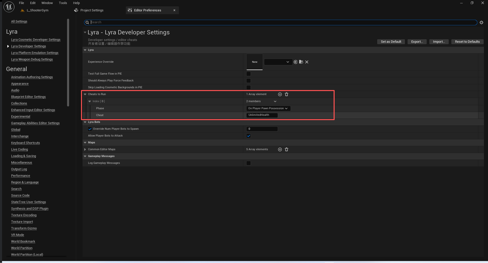
#### 作弊器创建时执行命令
``` cpp
void ULyraCheatManager::InitCheatManager()
{
	Super::InitCheatManager();

#if WITH_EDITOR
	if (GIsEditor)
	{
		APlayerController* PC = GetOuterAPlayerController();
		for (const FLyraCheatToRun& CheatRow : GetDefault<ULyraDeveloperSettings>()->CheatsToRun)
		{
			if (CheatRow.Phase == ECheatExecutionTime::OnCheatManagerCreated)
			{
				PC->ConsoleCommand(CheatRow.Cheat, /*bWriteToLog=*/ true);
			}
		}
	}
#endif

	if (LyraCheat::bStartInGodMode)
	{
		God();	
	}
}

```
#### 角色被控制时执行命令
``` cpp
void ALyraPlayerController::OnPossess(APawn* InPawn)
{
	Super::OnPossess(InPawn);

#if WITH_SERVER_CODE && WITH_EDITOR
	if (GIsEditor && (InPawn != nullptr) && (GetPawn() == InPawn))
	{
		for (const FLyraCheatToRun& CheatRow : GetDefault<ULyraDeveloperSettings>()->CheatsToRun)
		{
			if (CheatRow.Phase == ECheatExecutionTime::OnPlayerPawnPossession)
			{
				ConsoleCommand(CheatRow.Cheat, /*bWriteToLog=*/ true);
			}
		}
	}
#endif
	// 关闭自动运行
	SetIsAutoRunning(false);
}

```

### 上帝模式
``` cpp
namespace LyraCheat
{
	static const FName NAME_Fixed = FName(TEXT("Fixed"));
	
	static bool bEnableDebugCameraCycling = false;
	static FAutoConsoleVariableRef CVarEnableDebugCameraCycling(
		TEXT("LyraCheat.EnableDebugCameraCycling"),
		bEnableDebugCameraCycling,
		TEXT("If true then you can cycle the debug camera while running the game."),
		ECVF_Cheat);

	static bool bStartInGodMode = false;
	static FAutoConsoleVariableRef CVarStartInGodMode(
		TEXT("LyraCheat.StartInGodMode"),
		bStartInGodMode,
		TEXT("If true then the God cheat will be applied on begin play"),
		ECVF_Cheat);
};

```
``` cpp
void ULyraCheatManager::God()
{
	if (ALyraPlayerController* LyraPC = Cast<ALyraPlayerController>(GetOuterAPlayerController()))
	{
		if (LyraPC->GetNetMode() == NM_Client)
		{
			// Automatically send cheat to server for convenience.
			// 自动将作弊信息发送至服务器，以方便操作。
			LyraPC->ServerCheat(FString::Printf(TEXT("God")));
			return;
		}

		if (ULyraAbilitySystemComponent* LyraASC = LyraPC->GetLyraAbilitySystemComponent())
		{
			const FGameplayTag Tag = LyraGameplayTags::Cheat_GodMode;
			const bool bHasTag = LyraASC->HasMatchingGameplayTag(Tag);

			if (bHasTag)
			{
				LyraASC->RemoveDynamicTagGameplayEffect(Tag);
			}
			else
			{
				LyraASC->AddDynamicTagGameplayEffect(Tag);
			}
		}
	}
}


```
``` cpp

bool ULyraHealthSet::PreGameplayEffectExecute(FGameplayEffectModCallbackData &Data)
{
	if (!Super::PreGameplayEffectExecute(Data))
	{
		return false;
	}

	// Handle modifying incoming normal damage
	// 处理对进入式普通伤害的修改操作
	if (Data.EvaluatedData.Attribute == GetDamageAttribute())
	{
		if (Data.EvaluatedData.Magnitude > 0.0f)
		{
			const bool bIsDamageFromSelfDestruct = Data.EffectSpec.GetDynamicAssetTags().HasTagExact(TAG_Gameplay_DamageSelfDestruct);

			if (Data.Target.HasMatchingGameplayTag(TAG_Gameplay_DamageImmunity) && !bIsDamageFromSelfDestruct)
			{
				// Do not take away any health.
				// 不要损害任何健康。
				Data.EvaluatedData.Magnitude = 0.0f;
				return false;
			}

#if !UE_BUILD_SHIPPING
			// Check GodMode cheat, unlimited health is checked below
			// 检查“上帝模式”作弊功能，无限生命的情况将在下方进行检查
			if (Data.Target.HasMatchingGameplayTag(LyraGameplayTags::Cheat_GodMode) && !bIsDamageFromSelfDestruct)
			{
				// Do not take away any health.
				// 不要损害任何健康。
				Data.EvaluatedData.Magnitude = 0.0f;
				return false;
			}
#endif // #if !UE_BUILD_SHIPPING
		}
	}

	// Save the current health
	// 保存当前的生命值

	HealthBeforeAttributeChange = GetHealth();
	MaxHealthBeforeAttributeChange = GetMaxHealth();

	return true;
}
```

``` cpp

void ULyraHealthSet::PostGameplayEffectExecute(const FGameplayEffectModCallbackData& Data)
{
	Super::PostGameplayEffectExecute(Data);

	const bool bIsDamageFromSelfDestruct = Data.EffectSpec.GetDynamicAssetTags().HasTagExact(TAG_Gameplay_DamageSelfDestruct);
	float MinimumHealth = 0.0f;

#if !UE_BUILD_SHIPPING
	// Godmode and unlimited health stop death unless it's a self destruct
	// 神态模式和无限生命可避免死亡，除非是自动毁灭的情况。
	if (!bIsDamageFromSelfDestruct &&
		(Data.Target.HasMatchingGameplayTag(LyraGameplayTags::Cheat_GodMode) || Data.Target.HasMatchingGameplayTag(LyraGameplayTags::Cheat_UnlimitedHealth) ))
	{
		MinimumHealth = 1.0f;
	}
#endif // #if !UE_BUILD_SHIPPING

	const FGameplayEffectContextHandle& EffectContext = Data.EffectSpec.GetEffectContext();
	AActor* Instigator = EffectContext.GetOriginalInstigator();
	AActor* Causer = EffectContext.GetEffectCauser();

	if (Data.EvaluatedData.Attribute == GetDamageAttribute())
	{
		// Send a standardized verb message that other systems can observe
		// 发送一条标准化的动词信息，以便其他系统能够进行观察
		if (Data.EvaluatedData.Magnitude > 0.0f)
		{
			FLyraVerbMessage Message;
			Message.Verb = TAG_Lyra_Damage_Message;
			Message.Instigator = Data.EffectSpec.GetEffectContext().GetEffectCauser();
			Message.InstigatorTags = *Data.EffectSpec.CapturedSourceTags.GetAggregatedTags();
			Message.Target = GetOwningActor();
			Message.TargetTags = *Data.EffectSpec.CapturedTargetTags.GetAggregatedTags();
			//@TODO: Fill out context tags, and any non-ability-system source/instigator tags
			//@TODO: Determine if it's an opposing team kill, self-own, team kill, etc...

			//@待办事项：填写情境标签，以及任何非能力系统来源/发起者标签
			//@待办事项：确定这是对方队伍的击杀、自身失误的击杀、团队击杀等情况。
			
			Message.Magnitude = Data.EvaluatedData.Magnitude;

			UGameplayMessageSubsystem& MessageSystem = UGameplayMessageSubsystem::Get(GetWorld());
			MessageSystem.BroadcastMessage(Message.Verb, Message);
		}

		// Convert into -Health and then clamp
		// 转换为“-健康”状态，然后进行限制/约束处理
		SetHealth(FMath::Clamp(GetHealth() - GetDamage(), MinimumHealth, GetMaxHealth()));
		SetDamage(0.0f);
	}
	else if (Data.EvaluatedData.Attribute == GetHealingAttribute())
	{
		// Convert into +Health and then clamo
		// Convert into +Health and then clamo

		SetHealth(FMath::Clamp(GetHealth() + GetHealing(), MinimumHealth, GetMaxHealth()));
		SetHealing(0.0f);
	}
	else if (Data.EvaluatedData.Attribute == GetHealthAttribute())
	{
		// Clamp and fall into out of health handling below
		// 进行限制处理并进入以下健康状况处理流程
		SetHealth(FMath::Clamp(GetHealth(), MinimumHealth, GetMaxHealth()));
	}
	else if (Data.EvaluatedData.Attribute == GetMaxHealthAttribute())
	{
		// TODO clamp current health?
		// TODO 对当前生命值进行限制？
		// Notify on any requested max health changes
		// 对于任何所要求的健康值最大值变化情况发出通知
		OnMaxHealthChanged.Broadcast(Instigator, Causer, &Data.EffectSpec, Data.EvaluatedData.Magnitude, MaxHealthBeforeAttributeChange, GetMaxHealth());
	}

	// If health has actually changed activate callbacks
	// 如果健康状况确实发生了变化，则激活回调函数
	if (GetHealth() != HealthBeforeAttributeChange)
	{
		OnHealthChanged.Broadcast(Instigator, Causer, &Data.EffectSpec, Data.EvaluatedData.Magnitude, HealthBeforeAttributeChange, GetHealth());
	}

	if ((GetHealth() <= 0.0f) && !bOutOfHealth)
	{
		OnOutOfHealth.Broadcast(Instigator, Causer, &Data.EffectSpec, Data.EvaluatedData.Magnitude, HealthBeforeAttributeChange, GetHealth());
	}

	// Check health again in case an event above changed it.
	// 再次检查一下健康状况，以防某个事件改变了其状态。
	bOutOfHealth = (GetHealth() <= 0.0f);
}

```
### 网络转发到控制器处理
``` cpp
UCLASS(MinimalAPI, Config = Game, Meta = (ShortTooltip = "The base player controller class used by this project."))
class ALyraPlayerController : public ACommonPlayerController, public ILyraCameraAssistInterface, public ILyraTeamAgentInterface
{
	GENERATED_BODY()

public:
	// Run a cheat command on the server.
	// 在服务器上运行作弊指令。
	UFUNCTION(Reliable, Server, WithValidation)
	UE_API void ServerCheat(const FString& Msg);

	// Run a cheat command on the server for all players.
	// 在服务器上为所有玩家执行作弊指令。
	UFUNCTION(Reliable, Server, WithValidation)
	UE_API void ServerCheatAll(const FString& Msg);
}
```
``` cpp

void ALyraPlayerController::ServerCheat_Implementation(const FString& Msg)
{
#if USING_CHEAT_MANAGER
	if (CheatManager)
	{
		UE_LOG(LogLyra, Warning, TEXT("ServerCheat: %s"), *Msg);
		ClientMessage(ConsoleCommand(Msg));
	}
#endif // #if USING_CHEAT_MANAGER
}

bool ALyraPlayerController::ServerCheat_Validate(const FString& Msg)
{
	return true;
}

void ALyraPlayerController::ServerCheatAll_Implementation(const FString& Msg)
{
#if USING_CHEAT_MANAGER
	if (CheatManager)
	{
		UE_LOG(LogLyra, Warning, TEXT("ServerCheatAll: %s"), *Msg);
		for (TActorIterator<ALyraPlayerController> It(GetWorld()); It; ++It)
		{
			ALyraPlayerController* LyraPC = (*It);
			if (LyraPC)
			{
				LyraPC->ClientMessage(LyraPC->ConsoleCommand(Msg));
			}
		}
	}
#endif // #if USING_CHEAT_MANAGER
}

bool ALyraPlayerController::ServerCheatAll_Validate(const FString& Msg)
{
	return true;
}


```

``` cpp
	// 是否开启作弊
	UE_API virtual void AddCheats(bool bForce) override;

```
``` cpp
void ALyraPlayerController::AddCheats(bool bForce)
{
#if USING_CHEAT_MANAGER
	Super::AddCheats(true);
#else //#if USING_CHEAT_MANAGER
	Super::AddCheats(bForce);
#endif // #else //#if USING_CHEAT_MANAGER
}

```
``` cpp
ALyraPlayerController::ALyraPlayerController(const FObjectInitializer& ObjectInitializer)
	: Super(ObjectInitializer)
{
	// 指定相机管理类
	PlayerCameraManagerClass = ALyraPlayerCameraManager::StaticClass();

#if USING_CHEAT_MANAGER
	// 指定作弊器的类
	CheatClass = ULyraCheatManager::StaticClass();
#endif // #if USING_CHEAT_MANAGER
}


```
### 执行作弊命令
``` cpp
void ULyraCheatManager::Cheat(const FString& Msg)
{
	if (ALyraPlayerController* LyraPC = Cast<ALyraPlayerController>(GetOuterAPlayerController()))
	{
		LyraPC->ServerCheat(Msg.Left(128));
	}
}

void ULyraCheatManager::CheatAll(const FString& Msg)
{
	if (ALyraPlayerController* LyraPC = Cast<ALyraPlayerController>(GetOuterAPlayerController()))
	{
		LyraPC->ServerCheatAll(Msg.Left(128));
	}
}

``` 
### 打印信息
``` cpp
void ULyraCheatManager::CheatOutputText(const FString& TextToOutput)
{
#if USING_CHEAT_MANAGER
	// Output to the console.
	if (GEngine && GEngine->GameViewport && GEngine->GameViewport->ViewportConsole)
	{
		GEngine->GameViewport->ViewportConsole->OutputText(TextToOutput);
	}

	// Output to log.
	UE_LOG(LogLyraCheat, Display, TEXT("%s"), *TextToOutput);
#endif // USING_CHEAT_MANAGER
}
```
### 开始下场游戏
``` cpp
void ULyraCheatManager::PlayNextGame()
{
	ULyraSystemStatics::PlayNextGame(this);
}


```
### 相机切换

``` cpp
	// 切换到固定视角相机
	UFUNCTION(Exec)
	virtual void ToggleFixedCamera();

	// 固定视角相机 正常视角相机  调试视角相机
	// 三者来回切换
	UFUNCTION(Exec)
	virtual void CycleDebugCameras();
```

``` cpp

void ULyraCheatManager::ToggleFixedCamera()
{
	if (InFixedCamera())
	{
		DisableFixedCamera();
	}
	else
	{
		EnableFixedCamera();
	}
}

void ULyraCheatManager::CycleDebugCameras()
{
	if (!LyraCheat::bEnableDebugCameraCycling)
	{
		return;
	}
	
	if (InDebugCamera())
	{
		EnableFixedCamera();
		DisableDebugCamera();
	}
	else if (InFixedCamera())
	{
		DisableFixedCamera();
		DisableDebugCamera();
	}
	else
	{
		EnableDebugCamera();
		DisableFixedCamera();
	}
}
```
需要开启切换到调试相机这个功能
``` cpp
namespace LyraCheat
{
	static const FName NAME_Fixed = FName(TEXT("Fixed"));
	
	static bool bEnableDebugCameraCycling = false;
	static FAutoConsoleVariableRef CVarEnableDebugCameraCycling(
		TEXT("LyraCheat.EnableDebugCameraCycling"),
		bEnableDebugCameraCycling,
		TEXT("If true then you can cycle the debug camera while running the game."),
		ECVF_Cheat);

	static bool bStartInGodMode = false;
	static FAutoConsoleVariableRef CVarStartInGodMode(
		TEXT("LyraCheat.StartInGodMode"),
		bStartInGodMode,
		TEXT("If true then the God cheat will be applied on begin play"),
		ECVF_Cheat);
};

```

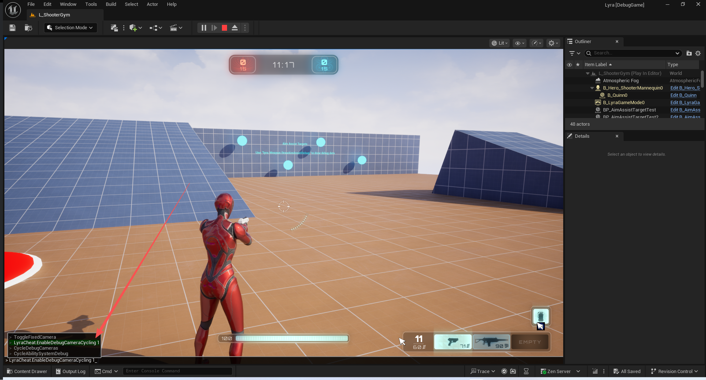

正常相机
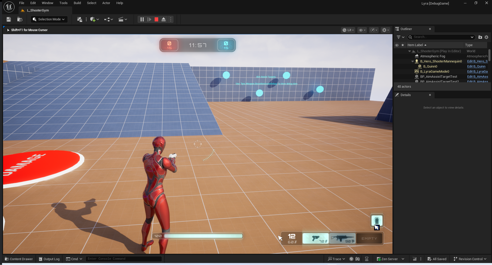
固定视角相机
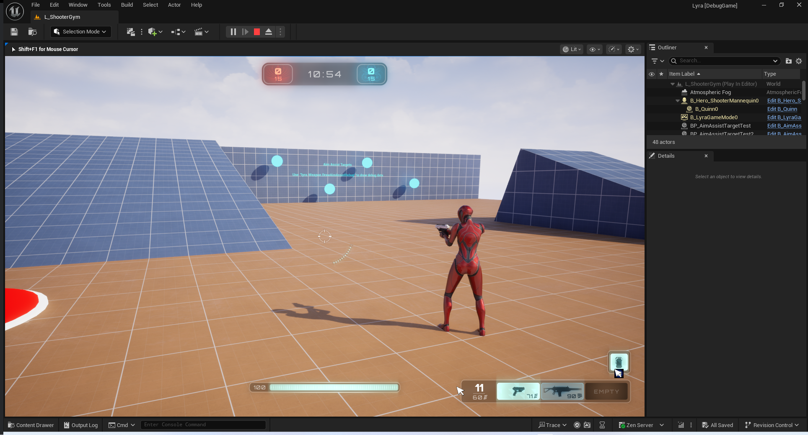
调试视角相机
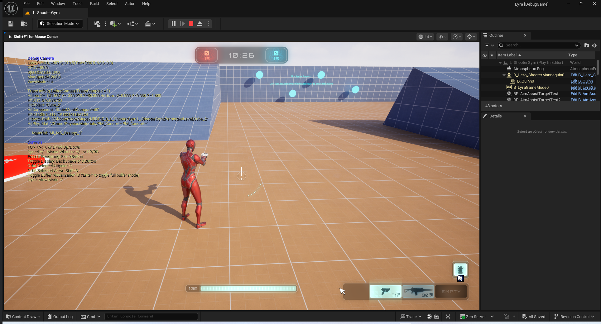

``` cpp
	// 开启调试相机
	virtual void EnableDebugCamera() override;
	// 关闭调试相机
	// 需要传输当前调试相机的视角数据
	virtual void DisableDebugCamera() override;
	// 通过Out判断是否是调试控制器
	bool InDebugCamera() const;

	// 切换到固定视角相机
	virtual void EnableFixedCamera();
	// 关闭固定视角相机
	virtual void DisableFixedCamera();
	// 是否在固定视角相机
	bool InFixedCamera() const;

```
``` cpp

void ULyraCheatManager::EnableDebugCamera()
{
	Super::EnableDebugCamera();
}

void ULyraCheatManager::DisableDebugCamera()
{
	FVector DebugCameraLocation;
	FRotator DebugCameraRotation;

	ADebugCameraController* DebugCC = Cast<ADebugCameraController>(GetOuter());
	APlayerController* OriginalPC = nullptr;

	if (DebugCC)
	{
		OriginalPC = DebugCC->OriginalControllerRef;
		DebugCC->GetPlayerViewPoint(DebugCameraLocation, DebugCameraRotation);
	}

	Super::DisableDebugCamera();

	if (OriginalPC && OriginalPC->PlayerCameraManager && (OriginalPC->PlayerCameraManager->CameraStyle == LyraCheat::NAME_Fixed))
	{
		OriginalPC->SetInitialLocationAndRotation(DebugCameraLocation, DebugCameraRotation);

		OriginalPC->PlayerCameraManager->ViewTarget.POV.Location = DebugCameraLocation;
		OriginalPC->PlayerCameraManager->ViewTarget.POV.Rotation = DebugCameraRotation;
		OriginalPC->PlayerCameraManager->PendingViewTarget.POV.Location = DebugCameraLocation;
		OriginalPC->PlayerCameraManager->PendingViewTarget.POV.Rotation = DebugCameraRotation;
	}
}

bool ULyraCheatManager::InDebugCamera() const
{
	return (Cast<ADebugCameraController>(GetOuter()) ? true : false);
}

void ULyraCheatManager::EnableFixedCamera()
{
	const ADebugCameraController* DebugCC = Cast<ADebugCameraController>(GetOuter());
	APlayerController* PC = (DebugCC ? ToRawPtr(DebugCC->OriginalControllerRef) : GetOuterAPlayerController());

	if (PC && PC->PlayerCameraManager)
	{
		PC->SetCameraMode(LyraCheat::NAME_Fixed);
	}
}

void ULyraCheatManager::DisableFixedCamera()
{
	const ADebugCameraController* DebugCC = Cast<ADebugCameraController>(GetOuter());
	APlayerController* PC = (DebugCC ? ToRawPtr(DebugCC->OriginalControllerRef) : GetOuterAPlayerController());

	if (PC && PC->PlayerCameraManager)
	{
		PC->SetCameraMode(NAME_Default);
	}
}

bool ULyraCheatManager::InFixedCamera() const
{
	const ADebugCameraController* DebugCC = Cast<ADebugCameraController>(GetOuter());
	const APlayerController* PC = (DebugCC ? ToRawPtr(DebugCC->OriginalControllerRef) : GetOuterAPlayerController());

	if (PC && PC->PlayerCameraManager)
	{
		return (PC->PlayerCameraManager->CameraStyle == LyraCheat::NAME_Fixed);
	}

	return false;
}

```
``` cpp
UCLASS(notplaceable, transient, BlueprintType, Blueprintable, Config=Engine, MinimalAPI)
class APlayerCameraManager : public AActor
{
public:
	/** Usable to define different camera behaviors. A few simple styles are implemented by default. */
	FName CameraStyle;
}

```

``` cpp

void APlayerCameraManager::UpdateViewTarget(FTViewTarget& OutVT, float DeltaTime)
{
	// Don't update outgoing viewtarget during an interpolation 
	if ((PendingViewTarget.Target != NULL) && BlendParams.bLockOutgoing && OutVT.Equal(ViewTarget))
	{
		return;
	}

	// Store previous POV, in case we need it later
	FMinimalViewInfo OrigPOV = OutVT.POV;

	// Reset the view target POV fully
	static const FMinimalViewInfo DefaultViewInfo;
	OutVT.POV = DefaultViewInfo;
	OutVT.POV.FOV = DefaultFOV;
	OutVT.POV.OrthoWidth = DefaultOrthoWidth;
	OutVT.POV.AspectRatio = DefaultAspectRatio;
	OutVT.POV.bConstrainAspectRatio = bDefaultConstrainAspectRatio;
	OutVT.POV.ProjectionMode = bIsOrthographic ? ECameraProjectionMode::Orthographic : ECameraProjectionMode::Perspective;
	OutVT.POV.PostProcessBlendWeight = 1.0f;
	OutVT.POV.bAutoCalculateOrthoPlanes = bAutoCalculateOrthoPlanes;
	OutVT.POV.AutoPlaneShift = AutoPlaneShift;
	OutVT.POV.bUpdateOrthoPlanes = bUpdateOrthoPlanes;
	OutVT.POV.bUseCameraHeightAsViewTarget = bUseCameraHeightAsViewTarget;

	bool bDoNotApplyModifiers = false;

	if (ACameraActor* CamActor = Cast<ACameraActor>(OutVT.Target))
	{
		// Viewing through a camera actor.
		CamActor->GetCameraComponent()->GetCameraView(DeltaTime, OutVT.POV);
	}
	else
	{

		static const FName NAME_Fixed = FName(TEXT("Fixed"));
		static const FName NAME_ThirdPerson = FName(TEXT("ThirdPerson"));
		static const FName NAME_FreeCam = FName(TEXT("FreeCam"));
		static const FName NAME_FreeCam_Default = FName(TEXT("FreeCam_Default"));
		static const FName NAME_FirstPerson = FName(TEXT("FirstPerson"));

		if (CameraStyle == NAME_Fixed)
		{
			// do not update, keep previous camera position by restoring
			// saved POV, in case CalcCamera changes it but still returns false
			OutVT.POV = OrigPOV;

			// don't apply modifiers when using this debug camera mode
			bDoNotApplyModifiers = true;
		}
		else if (CameraStyle == NAME_ThirdPerson || CameraStyle == NAME_FreeCam || CameraStyle == NAME_FreeCam_Default)
		{
			// Simple third person view implementation
			FVector Loc = OutVT.Target->GetActorLocation();
			FRotator Rotator = OutVT.Target->GetActorRotation();

			if (OutVT.Target == PCOwner)
			{
				Loc = PCOwner->GetFocalLocation();
			}

			// Take into account Mesh Translation so it takes into account the PostProcessing we do there.
			// @fixme, can crash in certain BP cases where default mesh is null
//			APawn* TPawn = Cast<APawn>(OutVT.Target);
// 			if ((TPawn != NULL) && (TPawn->Mesh != NULL))
// 			{
// 				Loc += FQuatRotationMatrix(OutVT.Target->GetActorQuat()).TransformVector(TPawn->Mesh->RelativeLocation - GetDefault<APawn>(TPawn->GetClass())->Mesh->RelativeLocation);
// 			}

			//OutVT.Target.GetActorEyesViewPoint(Loc, Rot);
			if( CameraStyle == NAME_FreeCam || CameraStyle == NAME_FreeCam_Default )
			{
				Rotator = PCOwner->GetControlRotation();
			}

			FVector Pos = Loc + ViewTargetOffset + FRotationMatrix(Rotator).TransformVector(FreeCamOffset) - Rotator.Vector() * FreeCamDistance;
			FCollisionQueryParams BoxParams(SCENE_QUERY_STAT(FreeCam), false, this);
			BoxParams.AddIgnoredActor(OutVT.Target);
			FHitResult Result;

			GetWorld()->SweepSingleByChannel(Result, Loc, Pos, FQuat::Identity, ECC_Camera, FCollisionShape::MakeBox(FVector(12.f)), BoxParams);
			OutVT.POV.Location = !Result.bBlockingHit ? Pos : Result.Location;
			OutVT.POV.Rotation = Rotator;

			// don't apply modifiers when using this debug camera mode
			bDoNotApplyModifiers = true;
		}
		else if (CameraStyle == NAME_FirstPerson)
		{
			// Simple first person, view through viewtarget's 'eyes'
			OutVT.Target->GetActorEyesViewPoint(OutVT.POV.Location, OutVT.POV.Rotation);
	
			// don't apply modifiers when using this debug camera mode
			bDoNotApplyModifiers = true;
		}
		else
		{
			UpdateViewTargetInternal(OutVT, DeltaTime);
		}
	}

	if (!bDoNotApplyModifiers || bAlwaysApplyModifiers)
	{
		// Apply camera modifiers at the end (view shakes for example)
		ApplyCameraModifiers(DeltaTime, OutVT.POV);
	}

	// Synchronize the actor with the view target results
	SetActorLocationAndRotation(OutVT.POV.Location, OutVT.POV.Rotation, false);
	if (bAutoCalculateOrthoPlanes && OutVT.Target)
	{
		OutVT.POV.SetCameraToViewTarget(OutVT.Target->GetActorLocation());
	}

	UpdateCameraLensEffects(OutVT);
}

```
### ASC调试信息
```cpp
void ULyraCheatManager::CycleAbilitySystemDebug()
{
	APlayerController* PC = Cast<APlayerController>(GetOuterAPlayerController());

	if (PC && PC->MyHUD)
	{
		if (!PC->MyHUD->bShowDebugInfo || !PC->MyHUD->DebugDisplay.Contains(TEXT("AbilitySystem")))
		{
			PC->MyHUD->ShowDebug(TEXT("AbilitySystem"));
		}

		PC->ConsoleCommand(TEXT("AbilitySystem.Debug.NextCategory"));
	}
}
```

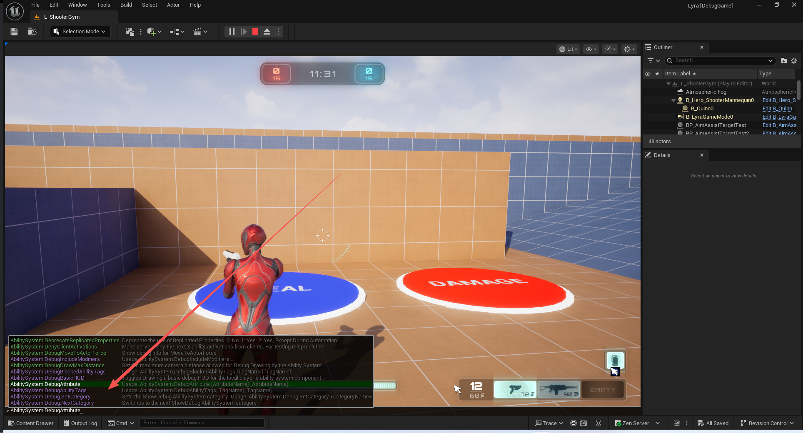

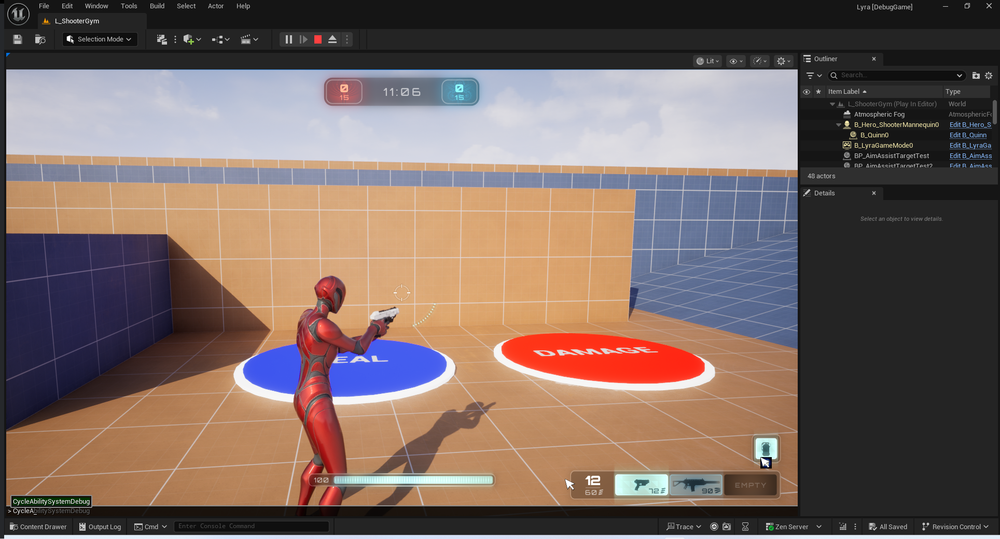
GE:
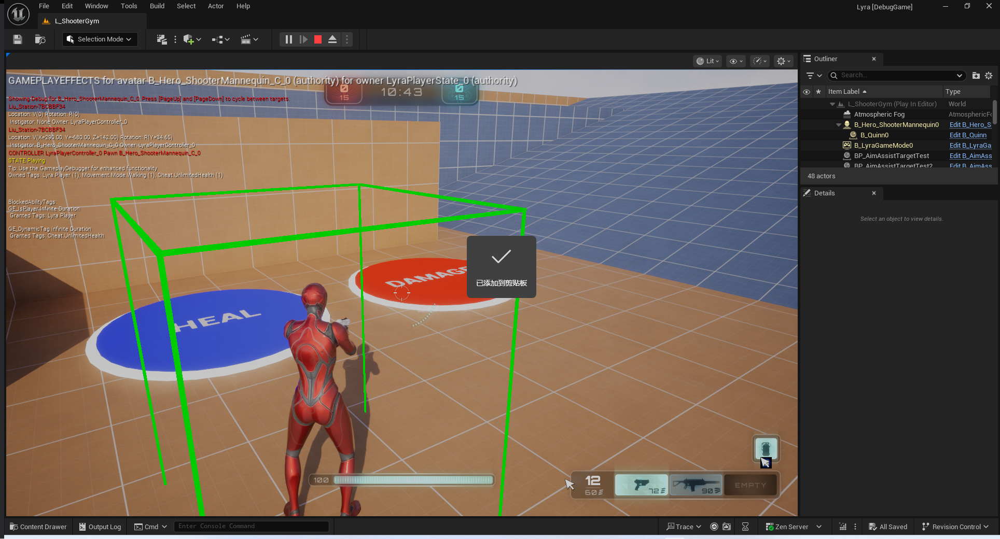
Ability:
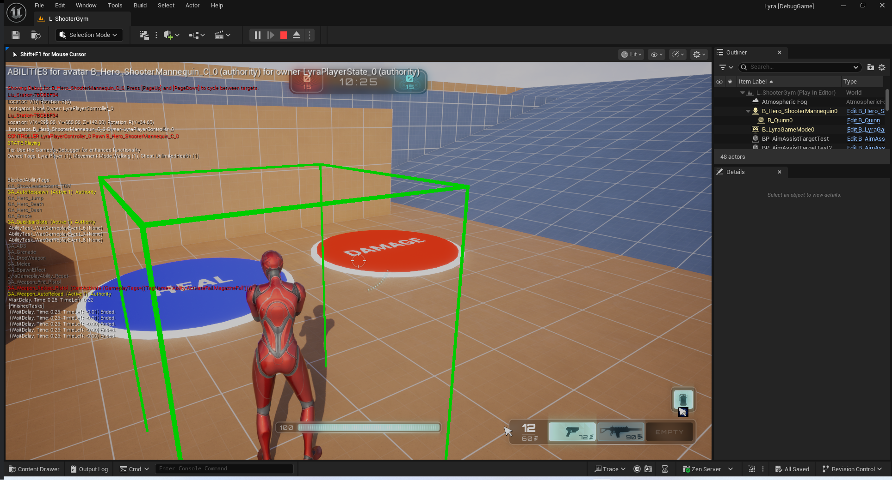
Attribute:
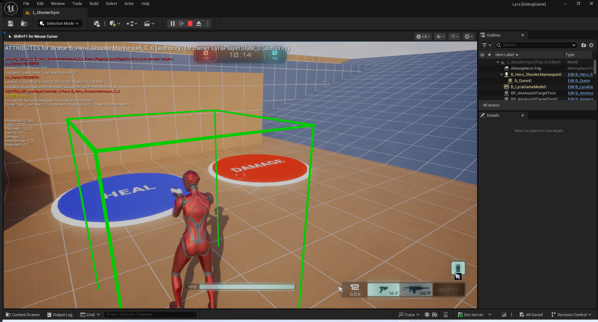


``` cpp

void ULyraCheatManager::CancelActivatedAbilities()
{
	if (ULyraAbilitySystemComponent* LyraASC = GetPlayerAbilitySystemComponent())
	{
		const bool bReplicateCancelAbility = true;
		LyraASC->CancelInputActivatedAbilities(bReplicateCancelAbility);
	}
}
```
``` cpp
void ULyraAbilitySystemComponent::CancelInputActivatedAbilities(bool bReplicateCancelAbility)
{
	auto ShouldCancelFunc = [this](const ULyraGameplayAbility* LyraAbility, FGameplayAbilitySpecHandle Handle)
	{
		// 判断当前能力的激活策略
		const ELyraAbilityActivationPolicy ActivationPolicy = LyraAbility->GetActivationPolicy();
		return ((ActivationPolicy == ELyraAbilityActivationPolicy::OnInputTriggered) || (ActivationPolicy == ELyraAbilityActivationPolicy::WhileInputActive));
	};

	CancelAbilitiesByFunc(ShouldCancelFunc, bReplicateCancelAbility);
}


```
### 添加指定Tag

``` cpp
	// Adds the dynamic tag to the owning player's ability system component.
	// 将动态标签添加到所属玩家的能力系统组件中。
	UFUNCTION(Exec, BlueprintAuthorityOnly)
	virtual void AddTagToSelf(FString TagName);

	// Removes the dynamic tag from the owning player's ability system component.
	// 从所属玩家的能力系统组件中移除动态标签。
	UFUNCTION(Exec, BlueprintAuthorityOnly)
	virtual void RemoveTagFromSelf(FString TagName);

```
``` cpp

void ULyraCheatManager::AddTagToSelf(FString TagName)
{
	FGameplayTag Tag = LyraGameplayTags::FindTagByString(TagName, true);
	if (Tag.IsValid())
	{
		if (ULyraAbilitySystemComponent* LyraASC = GetPlayerAbilitySystemComponent())
		{
			LyraASC->AddDynamicTagGameplayEffect(Tag);
		}
	}
	else
	{
		UE_LOG(LogLyraCheat, Display, TEXT("AddTagToSelf: Could not find any tag matching [%s]."), *TagName);
	}
}

void ULyraCheatManager::RemoveTagFromSelf(FString TagName)
{
	FGameplayTag Tag = LyraGameplayTags::FindTagByString(TagName, true);
	if (Tag.IsValid())
	{
		if (ULyraAbilitySystemComponent* LyraASC = GetPlayerAbilitySystemComponent())
		{
			LyraASC->RemoveDynamicTagGameplayEffect(Tag);
		}
	}
	else
	{
		UE_LOG(LogLyraCheat, Display, TEXT("RemoveTagFromSelf: Could not find any tag matching [%s]."), *TagName);
	}
}
```
``` cpp

void ULyraAbilitySystemComponent::AddDynamicTagGameplayEffect(const FGameplayTag& Tag)
{
	// 这里需要读取我们全局使用的默认GE类别
	const TSubclassOf<UGameplayEffect> DynamicTagGE = ULyraAssetManager::GetSubclass(ULyraGameData::Get().DynamicTagGameplayEffect);
	
	if (!DynamicTagGE)
	{
		UE_LOG(LogLyraAbilitySystem, Warning, TEXT("AddDynamicTagGameplayEffect: Unable to find DynamicTagGameplayEffect [%s]."),
			*ULyraGameData::Get().DynamicTagGameplayEffect.GetAssetName());
		return;
	}
	/** 获取一个可直接应用于其他对象的输出游戏效果规格。*/
	const FGameplayEffectSpecHandle SpecHandle = MakeOutgoingSpec(DynamicTagGE, 1.0f, MakeEffectContext());
	FGameplayEffectSpec* Spec = SpecHandle.Data.Get();

	if (!Spec)
	{
		UE_LOG(LogLyraAbilitySystem, Warning, TEXT("AddDynamicTagGameplayEffect: Unable to make outgoing spec for [%s]."), *GetNameSafe(DynamicTagGE));
		return;
	}
	/** DynamicGrantedTags 所授予的、且并非源自 UGameplayEffect 定义的标签。这些标签会进行复制。*/
	Spec->DynamicGrantedTags.AddTag(Tag);
	
	/** 将之前创建的游戏玩法效果规格应用于此组件 */
	ApplyGameplayEffectSpecToSelf(*Spec);
}

```
``` cpp
void ULyraAbilitySystemComponent::RemoveDynamicTagGameplayEffect(const FGameplayTag& Tag)
{
	const TSubclassOf<UGameplayEffect> DynamicTagGE = ULyraAssetManager::GetSubclass(ULyraGameData::Get().DynamicTagGameplayEffect);
	if (!DynamicTagGE)
	{
		UE_LOG(LogLyraAbilitySystem, Warning, TEXT("RemoveDynamicTagGameplayEffect: Unable to find gameplay effect [%s]."), *ULyraGameData::Get().DynamicTagGameplayEffect.GetAssetName());
		return;
	}
	/** 创建一个效果查询，该查询将根据给定的标签与活跃游戏效果所属标签之间的共同标签情况进行匹配 */
	FGameplayEffectQuery Query = FGameplayEffectQuery::MakeQuery_MatchAnyOwningTags(FGameplayTagContainer(Tag));
	Query.EffectDefinition = DynamicTagGE;

	RemoveActiveEffects(Query);
}

```
### 生命值修改
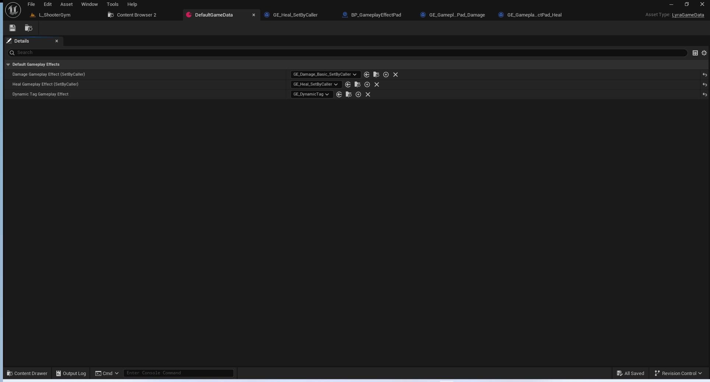

``` cpp
	// Applies the specified damage amount to the owning player.
	// 将指定的伤害量施加给拥有该物品的玩家。
	UFUNCTION(Exec, BlueprintAuthorityOnly)
	virtual void DamageSelf(float DamageAmount);

	// Applies the specified damage amount to the actor that the player is looking at.
	// 将指定的伤害量施加于玩家所注视的行动者身上。
	virtual void DamageTarget(float DamageAmount) override;

	// Applies the specified amount of healing to the owning player.
	// 为拥有者玩家恢复指定数量的生命值。
	UFUNCTION(Exec, BlueprintAuthorityOnly)
	virtual void HealSelf(float HealAmount);

	// Applies the specified amount of healing to the actor that the player is looking at.
	// 对玩家所注视的该角色施加指定的治疗效果。
	UFUNCTION(Exec, BlueprintAuthorityOnly)
	virtual void HealTarget(float HealAmount);

```
#### 伤害
``` cpp
void ULyraCheatManager::DamageSelf(float DamageAmount)
{
	if (ULyraAbilitySystemComponent* LyraASC = GetPlayerAbilitySystemComponent())
	{
		ApplySetByCallerDamage(LyraASC, DamageAmount);
	}
}

void ULyraCheatManager::DamageTarget(float DamageAmount)
{
	if (ALyraPlayerController* LyraPC = Cast<ALyraPlayerController>(GetOuterAPlayerController()))
	{
		if (LyraPC->GetNetMode() == NM_Client)
		{
			// Automatically send cheat to server for convenience.
			LyraPC->ServerCheat(FString::Printf(TEXT("DamageTarget %.2f"), DamageAmount));
			return;
		}

		FHitResult TargetHitResult;
		AActor* TargetActor = GetTarget(LyraPC, TargetHitResult);

		if (ULyraAbilitySystemComponent* LyraTargetASC = Cast<ULyraAbilitySystemComponent>(UAbilitySystemGlobals::GetAbilitySystemComponentFromActor(TargetActor)))
		{
			ApplySetByCallerDamage(LyraTargetASC, DamageAmount);
		}
	}
}

void ULyraCheatManager::ApplySetByCallerDamage(ULyraAbilitySystemComponent* LyraASC, float DamageAmount)
{
	check(LyraASC);

	TSubclassOf<UGameplayEffect> DamageGE = ULyraAssetManager::GetSubclass(ULyraGameData::Get().DamageGameplayEffect_SetByCaller);
	FGameplayEffectSpecHandle SpecHandle = LyraASC->MakeOutgoingSpec(DamageGE, 1.0f, LyraASC->MakeEffectContext());

	if (SpecHandle.IsValid())
	{
		SpecHandle.Data->SetSetByCallerMagnitude(LyraGameplayTags::SetByCaller_Damage, DamageAmount);
		LyraASC->ApplyGameplayEffectSpecToSelf(*SpecHandle.Data.Get());
	}
}

```
#### 治愈
``` cpp

void ULyraCheatManager::HealSelf(float HealAmount)
{
	if (ULyraAbilitySystemComponent* LyraASC = GetPlayerAbilitySystemComponent())
	{
		ApplySetByCallerHeal(LyraASC, HealAmount);
	}
}

void ULyraCheatManager::HealTarget(float HealAmount)
{
	if (ALyraPlayerController* LyraPC = Cast<ALyraPlayerController>(GetOuterAPlayerController()))
	{
		FHitResult TargetHitResult;
		AActor* TargetActor = GetTarget(LyraPC, TargetHitResult);

		if (ULyraAbilitySystemComponent* LyraTargetASC = Cast<ULyraAbilitySystemComponent>(UAbilitySystemGlobals::GetAbilitySystemComponentFromActor(TargetActor)))
		{
			ApplySetByCallerHeal(LyraTargetASC, HealAmount);
		}
	}
}

void ULyraCheatManager::ApplySetByCallerHeal(ULyraAbilitySystemComponent* LyraASC, float HealAmount)
{
	check(LyraASC);

	TSubclassOf<UGameplayEffect> HealGE = ULyraAssetManager::GetSubclass(ULyraGameData::Get().HealGameplayEffect_SetByCaller);
	FGameplayEffectSpecHandle SpecHandle = LyraASC->MakeOutgoingSpec(HealGE, 1.0f, LyraASC->MakeEffectContext());

	if (SpecHandle.IsValid())
	{
		SpecHandle.Data->SetSetByCallerMagnitude(LyraGameplayTags::SetByCaller_Heal, HealAmount);
		LyraASC->ApplyGameplayEffectSpecToSelf(*SpecHandle.Data.Get());
	}
}


```
#### 目标获取
``` cpp
AActor* UCheatManager::GetTarget(APlayerController* PlayerController, struct FHitResult& OutHit)
{
    if ((PlayerController == NULL) || (PlayerController->PlayerCameraManager == NULL))
    {
        return NULL;
    }
    
    check(GetWorld() != NULL);
    FVector const CamLoc = PlayerController->PlayerCameraManager->GetCameraLocation();
    FRotator const CamRot = PlayerController->PlayerCameraManager->GetCameraRotation();
    
    FCollisionQueryParams TraceParams(NAME_None, FCollisionQueryParams::GetUnknownStatId(), true, PlayerController->GetPawn());
    bool bHit = GetWorld()->LineTraceSingleByChannel(OutHit, CamLoc, CamRot.Vector() * 100000.f + CamLoc, ECC_Pawn, TraceParams);
    if (bHit)
    {
        check(OutHit.HitObjectHandle.FetchActor() != nullptr);
		return OutHit.HitObjectHandle.FetchActor();
    }
    return NULL;
}

```
### 自我消灭
``` cpp
void ULyraCheatManager::DamageSelfDestruct()
{
	if (ALyraPlayerController* LyraPC = Cast<ALyraPlayerController>(GetOuterAPlayerController()))
	{
 		if (const ULyraPawnExtensionComponent* PawnExtComp = ULyraPawnExtensionComponent::FindPawnExtensionComponent(LyraPC->GetPawn()))
		{
			if (PawnExtComp->HasReachedInitState(LyraGameplayTags::InitState_GameplayReady))
			{
				if (ULyraHealthComponent* HealthComponent = ULyraHealthComponent::FindHealthComponent(LyraPC->GetPawn()))
				{
					HealthComponent->DamageSelfDestruct();
				}
			}
		}
	}
}
```
``` cpp

void ULyraHealthComponent::DamageSelfDestruct(bool bFellOutOfWorld)
{
	if ((DeathState == ELyraDeathState::NotDead) && AbilitySystemComponent)
	{
		const TSubclassOf<UGameplayEffect> DamageGE = ULyraAssetManager::GetSubclass(ULyraGameData::Get().DamageGameplayEffect_SetByCaller);
		if (!DamageGE)
		{
			UE_LOG(LogLyra, Error, TEXT("LyraHealthComponent: DamageSelfDestruct failed for owner [%s]. Unable to find gameplay effect [%s]."), *GetNameSafe(GetOwner()), *ULyraGameData::Get().DamageGameplayEffect_SetByCaller.GetAssetName());
			return;
		}

		FGameplayEffectSpecHandle SpecHandle = AbilitySystemComponent->MakeOutgoingSpec(DamageGE, 1.0f, AbilitySystemComponent->MakeEffectContext());
		FGameplayEffectSpec* Spec = SpecHandle.Data.Get();

		if (!Spec)
		{
			UE_LOG(LogLyra, Error, TEXT("LyraHealthComponent: DamageSelfDestruct failed for owner [%s]. Unable to make outgoing spec for [%s]."), *GetNameSafe(GetOwner()), *GetNameSafe(DamageGE));
			return;
		}

		Spec->AddDynamicAssetTag(TAG_Gameplay_DamageSelfDestruct);

		if (bFellOutOfWorld)
		{
			Spec->AddDynamicAssetTag(TAG_Gameplay_FellOutOfWorld);
		}

		const float DamageAmount = GetMaxHealth();

		Spec->SetSetByCallerMagnitude(LyraGameplayTags::SetByCaller_Damage, DamageAmount);
		AbilitySystemComponent->ApplyGameplayEffectSpecToSelf(*Spec);
	}
}

```
``` cpp
void ALyraCharacter::FellOutOfWorld(const class UDamageType& dmgType)
{
	HealthComponent->DamageSelfDestruct(/*bFellOutOfWorld=*/ true);
}

```
``` cpp
void ULyraBotCreationComponent::RemoveOneBot()
{
	if (SpawnedBotList.Num() > 0)
	{
		// Right now this removes a random bot as they're all the same; could prefer to remove one
		// that's high skill or low skill or etc... depending on why you are removing one
		// 目前，我们会随机移除一个机器人，因为它们都是相同的；但也可以选择移除一个技能水平较高或较低的机器人，这取决于你为何要移除某个机器人。
		const int32 BotToRemoveIndex = FMath::RandRange(0, SpawnedBotList.Num() - 1);

		AAIController* BotToRemove = SpawnedBotList[BotToRemoveIndex];
		SpawnedBotList.RemoveAtSwap(BotToRemoveIndex);

		if (BotToRemove)
		{
			// If we can find a health component, self-destruct it, otherwise just destroy the actor
			// 如果我们能找到一个健康组件，就将其销毁，否则就直接摧毁该角色。
			if (APawn* ControlledPawn = BotToRemove->GetPawn())
			{
				if (ULyraHealthComponent* HealthComponent = ULyraHealthComponent::FindHealthComponent(ControlledPawn))
				{
					// Note, right now this doesn't work quite as desired: as soon as the player state goes away when
					// the controller is destroyed, the abilities like the death animation will be interrupted immediately
					// 需要注意的是，目前这一功能的运行效果并不完全如预期：一旦玩家状态因控制器被销毁而消失，诸如死亡动画之类的功能就会立即中断。
					HealthComponent->DamageSelfDestruct();
				}
				else
				{
					ControlledPawn->Destroy();
				}
			}

			// Destroy the controller (will cause it to Logout, etc...)
			// 销毁控制器（这将导致其退出登录等操作）
			BotToRemove->Destroy();
		}
	}
}

```
### 无限生命值
``` cpp
void ULyraCheatManager::UnlimitedHealth(int32 Enabled)
{
	if (ULyraAbilitySystemComponent* LyraASC = GetPlayerAbilitySystemComponent())
	{
		const FGameplayTag Tag = LyraGameplayTags::Cheat_UnlimitedHealth;
		const bool bHasTag = LyraASC->HasMatchingGameplayTag(Tag);
		// 默认-1 进行切换
		// >0 证明开启了 但是没有tag 需要去开启
		// =0 证明关闭了 但是有tag 需要去关闭
		if ((Enabled == -1) || ((Enabled > 0) && !bHasTag) || ((Enabled == 0) && bHasTag))
		{
			if (bHasTag)
			{
				LyraASC->RemoveDynamicTagGameplayEffect(Tag);
			}
			else
			{
				LyraASC->AddDynamicTagGameplayEffect(Tag);
			}
		}
	}
}


```
### 寻找ASC
``` cpp
ULyraAbilitySystemComponent* ULyraCheatManager::GetPlayerAbilitySystemComponent() const
{
	if (ALyraPlayerController* LyraPC = Cast<ALyraPlayerController>(GetOuterAPlayerController()))
	{
		return LyraPC->GetLyraAbilitySystemComponent();
	}
	return nullptr;
}
```

## 作弊拓展
### 机器人作弊拓展
``` cpp
/** Cheats related to bots */
UCLASS(NotBlueprintable)
class ULyraBotCheats final : public UCheatManagerExtension
{
	GENERATED_BODY()

public:
	ULyraBotCheats();

	// Adds a bot player
	UFUNCTION(Exec, BlueprintAuthorityOnly)
	void AddPlayerBot();

	// Removes a random bot player
	UFUNCTION(Exec, BlueprintAuthorityOnly)
	void RemovePlayerBot();

private:
	ULyraBotCreationComponent* GetBotComponent() const;
};

```

### 换装作弊拓展
``` cpp
/** Cheats related to bots */
UCLASS(NotBlueprintable)
class ULyraCosmeticCheats final : public UCheatManagerExtension
{
	GENERATED_BODY()

public:
	ULyraCosmeticCheats();

	// Adds a character part
	UFUNCTION(Exec, BlueprintAuthorityOnly)
	void AddCharacterPart(const FString& AssetName, bool bSuppressNaturalParts = true);

	// Replaces previous cheat parts with a new one
	UFUNCTION(Exec, BlueprintAuthorityOnly)
	void ReplaceCharacterPart(const FString& AssetName, bool bSuppressNaturalParts = true);

	// Clears any existing cheats
	UFUNCTION(Exec, BlueprintAuthorityOnly)
	void ClearCharacterPartOverrides();

private:
	ULyraControllerComponent_CharacterParts* GetCosmeticComponent() const;
};

```
### 队伍作弊拓展
``` cpp
/** Cheats related to teams */
UCLASS()
class ULyraTeamCheats : public UCheatManagerExtension
{
	GENERATED_BODY()

public:
	// Moves this player to the next available team, wrapping around to the
	// first team if at the end of the list of teams
	// 将此玩家移动至下一个可用的队伍，若已处于队伍列表的末尾，则会自动回到第一个队伍。
	UFUNCTION(Exec, BlueprintAuthorityOnly)
	virtual void CycleTeam();

	// Moves this player to the specified team
	// 将此玩家移至指定队伍
	UFUNCTION(Exec, BlueprintAuthorityOnly)
	virtual void SetTeam(int32 TeamID);

	// Prints a list of all of the teams
	// 打印出所有团队的列表
	UFUNCTION(Exec)
	virtual void ListTeams();
};

```


## 作弊管理器路由自拓展
### 注册
``` cpp
FDelegateHandle UCheatManager::RegisterForOnCheatManagerCreated(FOnCheatManagerCreated::FDelegate&& Delegate)
{
	for (TObjectIterator<UCheatManager> CheatIt; CheatIt; ++CheatIt)
	{
		UCheatManager* CheatInstance = *CheatIt;
		if (CheatInstance->GetOuter()->IsA(APlayerController::StaticClass()))
		{
			Delegate.Execute(CheatInstance);
		}
	}

	// Register for cheat managers created in the future
	return OnCheatManagerCreatedDelegate.Add(MoveTemp(Delegate));
}
```
``` cpp
ULyraBotCheats::ULyraBotCheats()
{
#if WITH_SERVER_CODE && UE_WITH_CHEAT_MANAGER
	if (HasAnyFlags(RF_ClassDefaultObject))
	{
		UCheatManager::RegisterForOnCheatManagerCreated(FOnCheatManagerCreated::FDelegate::CreateLambda(
			[](UCheatManager* CheatManager)
			{
				CheatManager->AddCheatManagerExtension(NewObject<ThisClass>(CheatManager));
			}));
	}
#endif
}
```
``` cpp
ULyraCosmeticCheats::ULyraCosmeticCheats()
{
#if UE_WITH_CHEAT_MANAGER
	if (HasAnyFlags(RF_ClassDefaultObject))
	{
		UCheatManager::RegisterForOnCheatManagerCreated(FOnCheatManagerCreated::FDelegate::CreateLambda(
			[](UCheatManager* CheatManager)
			{
				CheatManager->AddCheatManagerExtension(NewObject<ThisClass>(CheatManager));
			}));
	}
#endif
}
```
``` cpp
void ULyraTeamSubsystem::Initialize(FSubsystemCollectionBase& Collection)
{
	Super::Initialize(Collection);
	
	auto AddTeamCheats = [](UCheatManager* CheatManager)
	{
		CheatManager->AddCheatManagerExtension(NewObject<ULyraTeamCheats>(CheatManager));
	};

	CheatManagerRegistrationHandle = UCheatManager::RegisterForOnCheatManagerCreated(FOnCheatManagerCreated::FDelegate::CreateLambda(AddTeamCheats));
}

```
### 路由
``` cpp
	/**
	 * This function handles a console exec sent to the object; it is virtual so 'nexus' objects like
	 * a player controller can reroute the command to several different objects.
	 */
bool UCheatManager::ProcessConsoleExec(const TCHAR* Cmd, FOutputDevice& Ar, UObject* Executor)
{
#if UE_WITH_CHEAT_MANAGER
	// If on the client and calling a cheat function marked as BlueprintAuthorityOnly, automatically route it through the ServerExec() RPC to the server
	APlayerController* MyPC = GetOuterAPlayerController();
	if (MyPC->GetLocalRole() != ROLE_Authority)
	{
		const TCHAR* TestCmd = Cmd;

		FString FunctionNameStr;
		if (FParse::Token(TestCmd, FunctionNameStr, true))
		{
			const FName FunctionName = FName(*FunctionNameStr, FNAME_Find);

			if (FunctionName != NAME_None)
			{
				// Check first in this class
				UFunction* Function = FindFunction(FunctionName);

				// Failing that, check in each of the child cheat managers for a function by this name
				if (Function == nullptr)
				{
					for (UObject* CheatObject : CheatManagerExtensions)
					{
						Function = CheatObject ? CheatObject->FindFunction(FunctionName) : nullptr;
						if (Function != nullptr)
						{
							break;
						}
					}
				}

				if ((Function != nullptr) && Function->HasAnyFunctionFlags(FUNC_BlueprintAuthorityOnly))
				{
					if(ensureMsgf(GAllowActorScriptExecutionInEditor == false, TEXT("GAllowActorScriptExecutionInEditor must be false when executing commands.")))
					{
						MyPC->ServerExec(Cmd);
					}
					return true;
				}
			}
		}
	}
#endif

	for (UObject* CheatObject : CheatManagerExtensions)
	{
		if ((CheatObject != nullptr) && CheatObject->ProcessConsoleExec(Cmd, Ar, Executor))
		{
			return true;
		}
	}

	return Super::ProcessConsoleExec(Cmd, Ar, Executor);
}
```
## 远程HTTPServer调用
### 服务器开启入口

``` cpp

// Copyright Epic Games, Inc. All Rights Reserved.

using UnrealBuildTool;

public class LyraGame : ModuleRules
{
	public LyraGame(ReadOnlyTargetRules Target) : base(Target)
	{
		PCHUsage = PCHUsageMode.UseExplicitOrSharedPCHs;

		// ...

		// Generate compile errors if using DrawDebug functions in test/shipping builds.
		PublicDefinitions.Add("SHIPPING_DRAW_DEBUG_ERROR=1");

		// Basic setup for External RPC Framework.
		// Functionality within framework will be stripped in shipping to remove vulnerabilities.
		PrivateDependencyModuleNames.Add("ExternalRpcRegistry");
		PrivateDependencyModuleNames.Add("HTTPServer"); // Dependency for ExternalRpcRegistry
		if (Target.Configuration == UnrealTargetConfiguration.Shipping)
		{
			PublicDefinitions.Add("WITH_RPC_REGISTRY=0");
			PublicDefinitions.Add("WITH_HTTPSERVER_LISTENERS=0");
		}
		else
		{
			PublicDefinitions.Add("WITH_RPC_REGISTRY=1");
			PublicDefinitions.Add("WITH_HTTPSERVER_LISTENERS=1");
		}

		SetupGameplayDebuggerSupport(Target);
		SetupIrisSupport(Target);
	}
}

```

``` cpp

void ALyraPlayerController::BeginPlay()
{
	Super::BeginPlay();
	
	#if WITH_RPC_REGISTRY
	// 开启所有的监听
	FHttpServerModule::Get().StartAllListeners();

	// 监听的端口
	int32 RpcPort = 0;

	// 从命令行读取监听端口
	if (FParse::Value(FCommandLine::Get(), TEXT("rpcport="), RpcPort))
	{
		ULyraGameplayRpcRegistrationComponent* ObjectInstance = ULyraGameplayRpcRegistrationComponent::GetInstance();
		if (ObjectInstance && ObjectInstance->IsValidLowLevel())
		{
			// 注册总是调用
			ObjectInstance->RegisterAlwaysOnHttpCallbacks();

			// 注册比赛中调用
			ObjectInstance->RegisterInMatchHttpCallbacks();
		}
	}
	#endif
	SetActorHiddenInGame(false);
}


```
### 头文件
``` cpp
UCLASS(MinimalAPI)
class ULyraGameplayRpcRegistrationComponent : public UExternalRpcRegistrationComponent
{
	GENERATED_BODY()
protected:
	static UE_API ULyraGameplayRpcRegistrationComponent* ObjectInstance;

public:
	static UE_API ULyraGameplayRpcRegistrationComponent* GetInstance();


#if WITH_RPC_REGISTRY
	/**
	* Basic function that converts any request into a proper Json body.
	* 基本功能能够将任何请求转换为格式正确的 JSON 格式的数据体。
	*/
	UE_API TSharedPtr<FJsonObject> GetJsonObjectFromRequestBody(TArray<uint8> InRequestBody);

	UE_API virtual void DeregisterHttpCallbacks() override;


	// These are RPCs that should always be enabled, no matter what state the game is in. 
	// 这些都是必须始终开启的远程过程调用（RPC），无论游戏处于何种状态都应如此。
	UE_API virtual void RegisterAlwaysOnHttpCallbacks() override;
	/** 
	* This is an example RPC that shows how to interact with request bodies and gather passed in values for use in game code.
	* 这是一个示例的远程过程调用（RPC），展示了如何与请求体进行交互，并收集传入的值以供在游戏代码中使用。
	*/
	UE_API bool HttpExecuteCheatCommand(const FHttpServerRequest& Request, const FHttpResultCallback& OnComplete);


	// These are RPCs that should only be enabled while we are in the frontend.
	// 这些是仅在前端运行时才应启用的远程过程调用（RPC）。
	UE_API virtual void RegisterFrontendHttpCallbacks();
	//bool HttpSetMatchType(const FHttpServerRequest& Request, const FHttpResultCallback& OnComplete);

	// These are RPCs that should only be enabled while we are in a match
	// 这些是仅在我们处于比赛状态时才应启用的远程过程调用（RPC）操作。
	UE_API virtual void RegisterInMatchHttpCallbacks();
	/**
	 * This is an example RPC that shows how you can use requests to cause in-game input.
	 * 这是一个示例的远程过程调用（RPC），展示了如何通过发送请求来实现游戏内的输入操作。
	 */
	UE_API bool HttpFireOnceCommand(const FHttpServerRequest& Request, const FHttpResultCallback& OnComplete);

	/**
	 * This is an example RPC that shows how you can put together a response for consumption.
	 * 这是一个示例的远程过程调用（RPC），展示了如何构建一个可供使用（消费）的响应。
	 */
	UE_API bool HttpGetPlayerVitalsCommand(const FHttpServerRequest& Request, const FHttpResultCallback& OnComplete);

#endif

};


```

### 执行作弊命名
``` cpp
void ULyraGameplayRpcRegistrationComponent::RegisterAlwaysOnHttpCallbacks()
{
	Super::RegisterAlwaysOnHttpCallbacks();	
	const FExternalRpcArgumentDesc CommandDesc(TEXT("command"), TEXT("string"), TEXT("The command to tell the executable to run."));

	RegisterHttpCallback(FName(TEXT("CheatCommand")),
		FHttpPath("/core/cheatcommand"),
		EHttpServerRequestVerbs::VERB_POST,
		FHttpRequestHandler::CreateUObject(this, &ThisClass::HttpExecuteCheatCommand),
		true,
		TEXT("Cheats"),
		TEXT("raw"),
		{ CommandDesc });
}

```
### 打印玩家信息
``` cpp
void ULyraGameplayRpcRegistrationComponent::RegisterInMatchHttpCallbacks()
{
	RegisterHttpCallback(FName(TEXT("GetPlayerStatus")),
		FHttpPath("/player/status"),
		EHttpServerRequestVerbs::VERB_GET,
		FHttpRequestHandler::CreateUObject(this, &ThisClass::HttpGetPlayerVitalsCommand),
		true);

	RegisterHttpCallback(FName(TEXT("PlayerFireOnce")),
		FHttpPath("/player/status"),
		EHttpServerRequestVerbs::VERB_POST,
		FHttpRequestHandler::CreateUObject(this, &ThisClass::HttpFireOnceCommand),
		true);
	
}
```
### 工具函数
``` cpp
ULyraGameplayRpcRegistrationComponent* ULyraGameplayRpcRegistrationComponent::ObjectInstance = nullptr;
ULyraGameplayRpcRegistrationComponent* ULyraGameplayRpcRegistrationComponent::GetInstance()
{
#if WITH_RPC_REGISTRY
	if (ObjectInstance == nullptr)
	{
		ObjectInstance = NewObject<ULyraGameplayRpcRegistrationComponent>();
		FParse::Value(FCommandLine::Get(), TEXT("externalrpclistenaddress="), ObjectInstance->ListenerAddress);
		FParse::Value(FCommandLine::Get(), TEXT("rpcsenderid="), ObjectInstance->SenderID);
		if (!UExternalRpcRegistry::GetInstance())
		{
			GLog->Log(TEXT("BotRPC"), ELogVerbosity::Warning, FString::Printf(TEXT("Unable to create RPC Registry Instance. This might lead to issues using the RPC Registry.")));
		}
		ObjectInstance->AddToRoot();
	}
#endif
	return ObjectInstance;
}

UWorld* FindGameWorld()
{
	//Find Game World
	if (GEngine->GameViewport)
	{
		UGameInstance* GameInstance = GEngine->GameViewport->GetGameInstance();
		return GameInstance ? GameInstance->GetWorld() : nullptr;
	}
	return GWorld;
}

ALyraPlayerController* GetPlayerController()
{
	UWorld* LocalWorld = FindGameWorld();
	if (!LocalWorld)
	{
		return nullptr;
	}
	//Find PlayerController
	ALyraPlayerController* PlayerController = Cast<ALyraPlayerController>(LocalWorld->GetFirstPlayerController());
	if (!PlayerController)
	{
		return nullptr;
	}
	else
	{
		return PlayerController;
	}
}


```
### 测试
打包项目.
创建一个快捷方式,或者通过命令行启动.
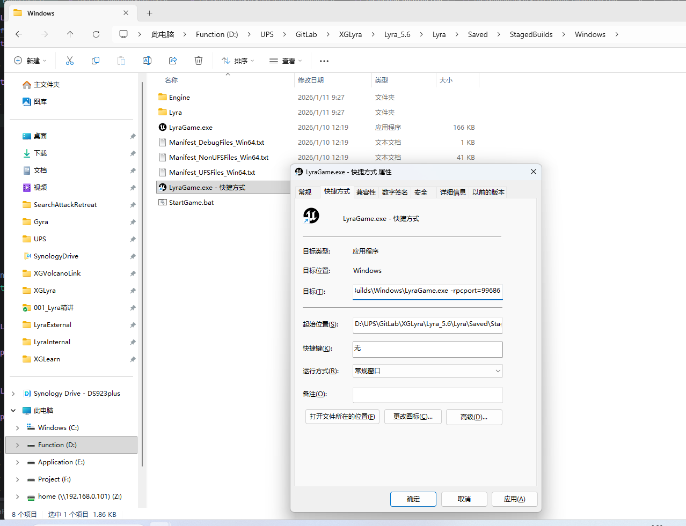
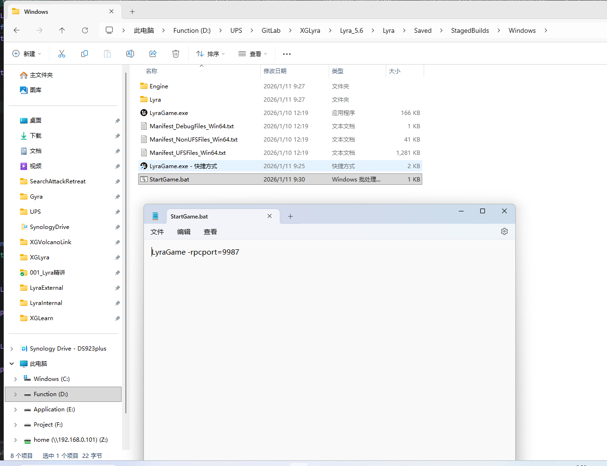

#### GetPlayerStatus
http://127.0.0.1:9987/player/status/GetPlayerStatus

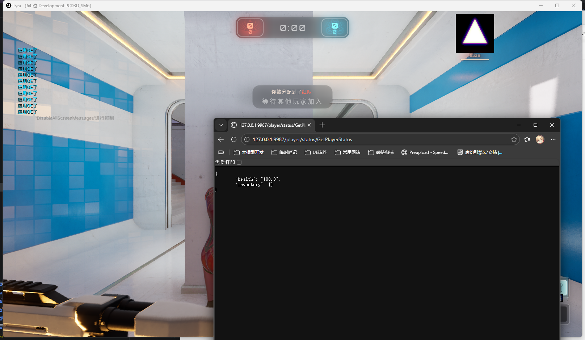
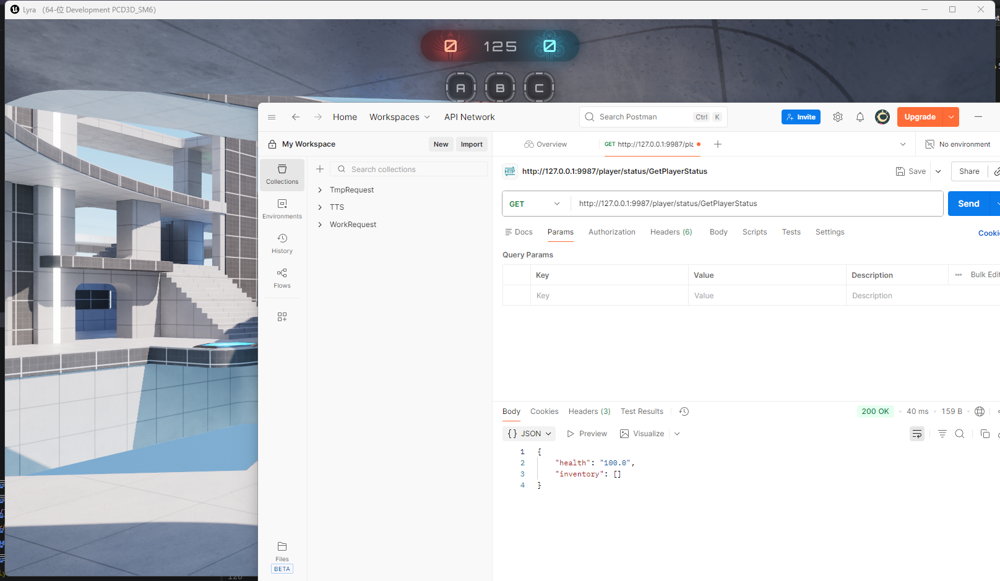

#### PlayerFireOnce

http://127.0.0.1:9987/player/status/PlayerFireOnce
注意这个开火没有调用开火的GA.是一个todo.要做也很简单.触发一下tag即可!
#### CheatComman
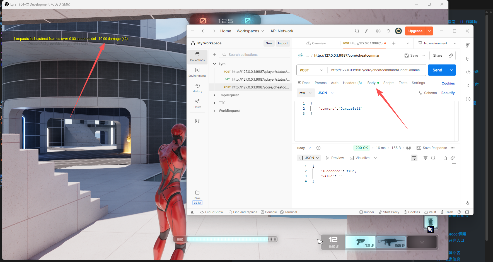
http://127.0.0.1:9987/core/cheatcommand/CheatCommand
``` json
{
    "command":"DamageSelf"
}
```
注意这里会有一个附加伤害.就是保底会有10点.如果写"DamageSelf 10"就是20点.
## 总结
关于项目的作弊部分已经给大家复习完毕了.
关于作弊拓展部分,如换装,队伍,机器人创建,已经讲解过路由过去后的实现,不再这里重复展开.