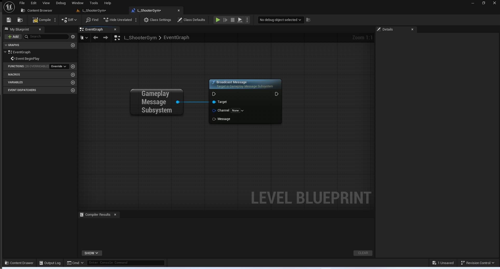
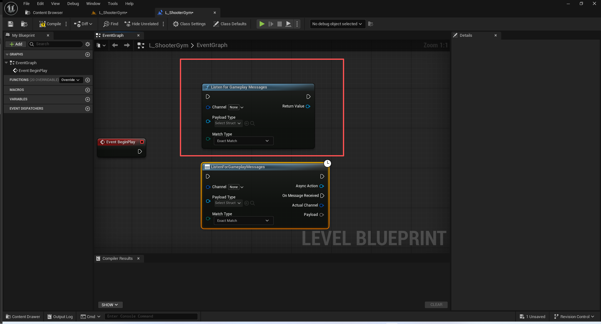
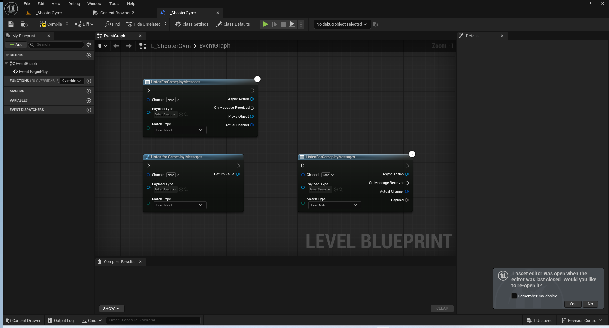

# UE5_Lyra学习指南_112_GameplayMessageRouter消息路由插件

本文章仅为小刚-B站课堂-虚幻引擎视频课程Lyra-精讲的演讲手稿.  
本套课程链接:[[UE5]虚幻引擎游戏案例Lyra精讲](https://www.bilibili.com/cheese/play/ss112001159)  
前置课程链接:[[UE5]虚幻引擎UEC++从基础到进阶](https://www.bilibili.com/cheese/play/ss28043)  

文章内容由小刚撰写,采用了以下多种方式:  
1.口述转文字  
2.AI重构  
3.参考引擎源码  
4.Lyra工程源码  
5.结合社区论坛各位大佬的解析  

- [UE5\_Lyra学习指南\_112\_GameplayMessageRouter消息路由插件](#ue5_lyra学习指南_112_gameplaymessagerouter消息路由插件)
	- [概述](#概述)
	- [UGameplayMessageSubsystem](#ugameplaymessagesubsystem)
		- [入站句柄](#入站句柄)
		- [入站信息](#入站信息)
		- [数据定义](#数据定义)
		- [子系统](#子系统)
			- [头文件](#头文件)
			- [注册监听流程](#注册监听流程)
				- [注册的容器](#注册的容器)
				- [普通入口](#普通入口)
				- [高级封装入口](#高级封装入口)
				- [实际注册](#实际注册)
			- [取消注册](#取消注册)
			- [广播信息](#广播信息)
		- [RPC服务器和客户端传播](#rpc服务器和客户端传播)
		- [C++绑定监听](#c绑定监听)
		- [回收句柄](#回收句柄)
		- [获取上下文的工具函数](#获取上下文的工具函数)
	- [UAsyncAction\_ListenForGameplayMessage](#uasyncaction_listenforgameplaymessage)
		- [父类](#父类)
		- [头文件](#头文件-1)
		- [ListenForGameplayMessages](#listenforgameplaymessages)
	- [UK2Node\_AsyncAction\_ListenForGameplayMessages](#uk2node_asyncaction_listenforgameplaymessages)
		- [头文件](#头文件-2)
		- [注册上下文](#注册上下文)
		- [申明引脚定义](#申明引脚定义)
		- [修改引脚功能](#修改引脚功能)
			- [TemporaryVariable](#temporaryvariable)
			- [UK2Node\_CallFunction](#uk2node_callfunction)
			- [UK2Node\_AssignmentStatement](#uk2node_assignmentstatement)
		- [监听输入负载的引脚类型变化](#监听输入负载的引脚类型变化)
		- [工具函数](#工具函数)
	- [总结](#总结)


## 概述
本节开始讲解Lyra项目的一个核心机制.消息路由机制.
之前纯蓝图项目,我们用过蓝图接口,事件分发器,对象引用等方式来进行蓝图通讯交互.
其终极形态就是这个消息路由机制
这部分的内容比较难.难点主要是有两个:
1.与蓝图虚拟机交互,取数据,写泛型
2.自定义蓝图节点,封装复杂逻辑到蓝图使用
C++泛型使用起来比蓝图泛型,方便太多了.
这部分内容,不要求掌握.因为这部分是属于高级编辑开发的内容了,是属于需要自己设计一套蓝图图表时才会用到.大部分时候用不到.
我有注意到引擎以及由AsyncMessage的这个引擎插件了.这个东西大概率就是来自Lyra的这个插件的进阶提升.
## UGameplayMessageSubsystem
### 入站句柄
``` cpp

/**
 * An opaque handle that can be used to remove a previously registered message listener
 * 一个不透明的控制柄，可用于移除之前注册的消息监听器。
 * @see UGameplayMessageSubsystem::RegisterListener and UGameplayMessageSubsystem::UnregisterListener
 */
USTRUCT(BlueprintType)
struct FGameplayMessageListenerHandle
{
public:

	GENERATED_BODY()

	// 构造函数
	FGameplayMessageListenerHandle() {}

	// 转发到子系统处理
	UE_API void Unregister();

	// 通过ID判断是否时正常的流程中可用的句柄
	bool IsValid() const { return ID != 0; }

private:
	// 子系统的弱指针
	UPROPERTY(Transient)
	TWeakObjectPtr<UGameplayMessageSubsystem> Subsystem;

	// 通道Tag
	UPROPERTY(Transient)
	FGameplayTag Channel;

	// ID 对于同一个tag 有很多监听者,他们会进来之后就会分配针对这个tag下的ID.注意不保证顺序
	UPROPERTY(Transient)
	int32 ID = 0;

	// 没有用到的句柄
	FDelegateHandle StateClearedHandle;

	// 友元
	friend UGameplayMessageSubsystem;

	// 内部构造函数
	FGameplayMessageListenerHandle(UGameplayMessageSubsystem* InSubsystem, FGameplayTag InChannel, int32 InID) : Subsystem(InSubsystem), Channel(InChannel), ID(InID) {}
};


```

### 入站信息
``` cpp
/** 
 * Entry information for a single registered listener
 * 单个注册监听者的入站信息
 */
USTRUCT()
struct FGameplayMessageListenerData
{
	GENERATED_BODY()

	// Callback for when a message has been received
	// 当收到消息时的回调函数
	TFunction<void(FGameplayTag, const UScriptStruct*, const void*)> ReceivedCallback;

	// ID
	int32 HandleID;
	// 匹配信息
	EGameplayMessageMatch MatchType;

	// Adding some logging and extra variables around some potential problems with this
	// 在可能出现的问题周围添加一些日志记录和额外的变量以进行监控
	TWeakObjectPtr<const UScriptStruct> ListenerStructType = nullptr;
	bool bHadValidType = false;
};
```
### 数据定义
``` cpp
// Match rule for message listeners
// 消息监听器的匹配规则
UENUM(BlueprintType)
enum class EGameplayMessageMatch : uint8
{
	// An exact match will only receive messages with exactly the same channel
	// (e.g., registering for "A.B" will match a broadcast of A.B but not A.B.C)
	// 精确匹配只会接收与指定频道完全一致的公告信息
	// （例如，注册“A.B”频道将匹配“A.B”的广播内容，但不会匹配“A.B.C”的内容）
	ExactMatch,

	// A partial match will receive any messages rooted in the same channel
	// (e.g., registering for "A.B" will match a broadcast of A.B as well as A.B.C)
	// 部分匹配将接收源自同一频道的所有消息（例如，注册“A.B”这一内容将匹配“A.B”的广播信息以及“A.B.C”的信息）
	PartialMatch
};

/**
 * Struct used to specify advanced behavior when registering a listener for gameplay messages
 * 用于在注册游戏消息监听器时指定高级行为的结构体
 */
template<typename FMessageStructType>
struct FGameplayMessageListenerParams
{
	/** Whether Callback should be called for broadcasts of more derived channels or if it will only be called for exact matches. */
	/** 是否应针对更高级别的频道广播调用回调函数，还是仅在完全匹配的情况下才调用该回调函数。*/
	EGameplayMessageMatch MatchType = EGameplayMessageMatch::ExactMatch;

	/** If bound this callback will trigger when a message is broadcast on the specified channel. */
	/** 如果已进行绑定，那么当指定频道上发布消息时，此回调函数将会被触发。*/
	TFunction<void(FGameplayTag, const FMessageStructType&)> OnMessageReceivedCallback;

	/** Helper to bind weak member function to OnMessageReceivedCallback */
	/** 用于将弱成员函数绑定到“消息接收回调”函数的辅助函数 */
	template<typename TOwner = UObject>
	void SetMessageReceivedCallback(TOwner* Object, void(TOwner::* Function)(FGameplayTag, const FMessageStructType&))
	{
		TWeakObjectPtr<TOwner> WeakObject(Object);
		OnMessageReceivedCallback = [WeakObject, Function](FGameplayTag Channel, const FMessageStructType& Payload)
		{
			if (TOwner* StrongObject = WeakObject.Get())
			{
				(StrongObject->*Function)(Channel, Payload);
			}
		};
	}
};
```
### 子系统
#### 头文件
``` cpp

/**
 * This system allows event raisers and listeners to register for messages without
 * having to know about each other directly, though they must agree on the format
 * of the message (as a USTRUCT() type).
 * 该系统使得发布者和接收者能够无需直接了解对方即可注册接收消息，但双方必须就消息的格式（如使用 USTRUCT() 类型）达成一致。
 *
 *
 * You can get to the message router from the game instance:
 *    UGameInstance::GetSubsystem<UGameplayMessageSubsystem>(GameInstance)
 * or directly from anything that has a route to a world:
 *    UGameplayMessageSubsystem::Get(WorldContextObject)
 *    
 *    您可以从游戏实例中访问消息路由器：
 *    UGameInstance:：获取子系统（类型为 UGameplayMessageSubsystem）（GameInstance）
 *	  或者直接从任何具有通往游戏世界的路由的对象中访问：
 *    UGameplayMessageSubsystem:：获取（WorldContextObject）
 *
 * Note that call order when there are multiple listeners for the same channel is
 * not guaranteed and can change over time!
 * 
 * 请注意，对于同一通道存在多个监听者时，调用顺序是无法保证一致的，并且可能会随时间而发生变化！
 * 
 */
UCLASS(MinimalAPI)
class UGameplayMessageSubsystem : public UGameInstanceSubsystem
{
	GENERATED_BODY()

	friend UAsyncAction_ListenForGameplayMessage;

public:

	/**
	 * 与指定对象所属的世界相关联的游戏实例的消息路由器
	 * @return the message router for the game instance associated with the world of the specified object
	 */
	static UE_API UGameplayMessageSubsystem& Get(const UObject* WorldContextObject);

	/**
	 * 如果在所提供的世界中有效的“游戏玩法消息路由器”子系统处于激活状态，则为真。
	 * @return true if a valid GameplayMessageRouter subsystem if active in the provided world
	 */
	static UE_API bool HasInstance(const UObject* WorldContextObject);

	//~USubsystem interface
	// 清空监听列表
	UE_API virtual void Deinitialize() override;
	//~End of USubsystem interface

	/**
	 * Broadcast a message on the specified channel
	 * 在指定频道上发布消息
	 *
	 * 用于广播的消息通道
	 * @param Channel			The message channel to broadcast on
	 * 
	 * 要发送的消息（必须与该通道的接收者所期望的 UScriptStruct 类型相同，否则将会记录一条错误信息）
	 * 
	 * @param Message			The message to send (must be the same type of UScriptStruct expected by the listeners for this channel, otherwise an error will be logged)
	 */
	template <typename FMessageStructType>
	void BroadcastMessage(FGameplayTag Channel, const FMessageStructType& Message)
	{
		const UScriptStruct* StructType = TBaseStructure<FMessageStructType>::Get();
		BroadcastMessageInternal(Channel, StructType, &Message);
	}

	/**
	 * Register to receive messages on a specified channel
	 * 注册以便接收指定频道的消息
	 *
	 * 用于收听的通讯频道
	 * 当有人发布消息时，用于调用该消息的函数（必须与发布者为该频道提供的 UScriptStruct 类型相同，否则将记录错误信息）
	 * @param Channel			The message channel to listen to
	 * @param Callback			Function to call with the message when someone broadcasts it (must be the same type of UScriptStruct provided by broadcasters for this channel, otherwise an error will be logged)
	 * 
	 * 一个可用于取消注册此监听器的处理程序（可以通过在该处理程序上调用 Unregister() 方法，或者通过在路由器上调用 UnregisterListener 方法来实现）
	 * @return a handle that can be used to unregister this listener (either by calling Unregister() on the handle or calling UnregisterListener on the router)
	 */
	template <typename FMessageStructType>
	FGameplayMessageListenerHandle RegisterListener(FGameplayTag Channel, 
		TFunction<void(FGameplayTag, const FMessageStructType&)>&& Callback,
		EGameplayMessageMatch MatchType = EGameplayMessageMatch::ExactMatch)
	{
		// 注意这个lambda 它是三个参数
		auto ThunkCallback = [InnerCallback = MoveTemp(Callback)](FGameplayTag ActualTag, const UScriptStruct* SenderStructType,
			const void* SenderPayload)
		{
			// 注意这个回调是两个参数
			// 我们需要拿到具体的数据和数据类型 然后完成转换之后回调过去!
			InnerCallback(ActualTag, *reinterpret_cast<const FMessageStructType*>(SenderPayload));
		};

		const UScriptStruct* StructType = TBaseStructure<FMessageStructType>::Get();
		return RegisterListenerInternal(Channel, ThunkCallback, StructType, MatchType);
	}

	/**
	 * Register to receive messages on a specified channel and handle it with a specified member function
	 * Executes a weak object validity check to ensure the object registering the function still exists before triggering the callback
	 * 注册以接收指定频道的消息，并使用指定的成员函数进行处理
     * 执行弱对象有效性检查，以确保注册该函数的对象仍然存在，然后再触发回调操作
	 * 
	 * 用于收听的通讯频道
	 * @param Channel			The message channel to listen to
	 * 要调用该函数的对象实例
	 * @param Object			The object instance to call the function on
	 * 用于在有人发布消息时调用的成员函数（必须与发布者为该频道提供的 UScriptStruct 类型相同，否则将记录错误信息）
	 * @param Function			Member function to call with the message when someone broadcasts it (must be the same type of UScriptStruct provided by broadcasters for this channel, otherwise an error will be logged)
	 * 
	 * 一个可用于取消注册此监听器的处理程序（可以通过在该处理程序上调用 Unregister() 方法，或者通过在路由器上调用 UnregisterListener 方法来实现）
	 * @return a handle that can be used to unregister this listener (either by calling Unregister() on the handle or calling UnregisterListener on the router)
	 */
	template <typename FMessageStructType, typename TOwner = UObject>
	FGameplayMessageListenerHandle RegisterListener(FGameplayTag Channel,
		TOwner* Object, void(TOwner::* Function)(FGameplayTag, const FMessageStructType&))
	{
		TWeakObjectPtr<TOwner> WeakObject(Object);
		return RegisterListener<FMessageStructType>(Channel,
			[WeakObject, Function](FGameplayTag Channel, const FMessageStructType& Payload)
			{
				if (TOwner* StrongObject = WeakObject.Get())
				{
					(StrongObject->*Function)(Channel, Payload);
				}
			});
	}

	/**
	 * Register to receive messages on a specified channel with extra parameters to support advanced behavior
	 * The stateful part of this logic should probably be separated out to a separate system
	 * 
	 * 注册以接收指定频道的消息，并附加参数以支持更高级的功能
     * 此逻辑中的状态部分或许应该分离出来，构建一个独立的系统
     * 
	 * 用于收听的通讯频道
	 * @param Channel			The message channel to listen to
	 * 包含高级行为详细信息的结构
	 * @param Params			Structure containing details for advanced behavior
	 * 
	 * 一个可用于取消注册此监听器的处理程序（可以通过在该处理程序上调用 Unregister() 方法，或者通过在路由器上调用 UnregisterListener 方法来实现）
	 * @return a handle that can be used to unregister this listener (either by calling Unregister() on the handle or calling UnregisterListener on the router)
	 */
	template <typename FMessageStructType>
	FGameplayMessageListenerHandle RegisterListener(FGameplayTag Channel, FGameplayMessageListenerParams<FMessageStructType>& Params)
	{
		FGameplayMessageListenerHandle Handle;

		// Register to receive any future messages broadcast on this channel
		// 注册以便接收此频道后续发布的任何消息
		if (Params.OnMessageReceivedCallback)
		{
			auto ThunkCallback = [InnerCallback = Params.OnMessageReceivedCallback](FGameplayTag ActualTag, const UScriptStruct* SenderStructType, const void* SenderPayload)
			{
				InnerCallback(ActualTag, *reinterpret_cast<const FMessageStructType*>(SenderPayload));
			};

			const UScriptStruct* StructType = TBaseStructure<FMessageStructType>::Get();
			Handle = RegisterListenerInternal(Channel, ThunkCallback, StructType, Params.MatchType);
		}

		return Handle;
	}

	/**
	 * Remove a message listener previously registered by RegisterListener
	 * 移除之前通过“RegisterListener”方法注册的消息监听器
	 *
	 *由“RegisterListener”函数返回的处理柄
	 * @param Handle	The handle returned by RegisterListener
	 */
	UE_API void UnregisterListener(FGameplayMessageListenerHandle Handle);

protected:
	/**
	 * Broadcast a message on the specified channel
	 * 在指定频道上发布消息
	 *
	 * 用于广播的消息通道
	 * @param Channel			The message channel to broadcast on
	 * 
	 * 要发送的消息（必须与该通道的接收者所期望的 UScriptStruct 类型相同，否则将会记录一条错误信息）
	 * @param Message			The message to send (must be the same type of UScriptStruct expected by the listeners for this channel, otherwise an error will be logged)
	 */
	UFUNCTION(BlueprintCallable, CustomThunk, Category=Messaging, meta=(CustomStructureParam="Message", AllowAbstract="false", DisplayName="Broadcast Message"))
	UE_API void K2_BroadcastMessage(FGameplayTag Channel, const int32& Message);

	
	/**
	 * Broadcast a message on the specified channel
	 * 在指定频道上发布消息
	 *
	 * 用于广播的消息通道
	 * @param Channel			The message channel to broadcast on
	 * 
	 * 要发送的消息（必须与该通道的接收者所期望的 UScriptStruct 类型相同，否则将会记录一条错误信息）
	 * @param Message			The message to send (must be the same type of UScriptStruct expected by the listeners for this channel, otherwise an error will be logged)
	 */
	UFUNCTION(BlueprintCallable, CustomThunk, Category=Messaging, meta=(CustomStructureParam="Message", AllowAbstract="false", DisplayName="XG Broadcast Message"))
	UE_API void K2_XGBroadcastMessage(FGameplayTag Channel, const int32& Message);
	
	
	// CustomThunk The UnrealHeaderTool code generator will not produce a thunk for this function; it is up to the user to provide one.
	DECLARE_FUNCTION(execK2_BroadcastMessage);
	
	DECLARE_FUNCTION(execK2_XGBroadcastMessage);

private:
	// Internal helper for broadcasting a message
	// 用于广播消息的内部辅助函数
	UE_API void BroadcastMessageInternal(FGameplayTag Channel, const UScriptStruct* StructType, const void* MessageBytes);

	// Internal helper for registering a message listener
	// 用于注册消息监听器的内部辅助函数
	UE_API FGameplayMessageListenerHandle RegisterListenerInternal(
		FGameplayTag Channel, 
		TFunction<void(FGameplayTag, const UScriptStruct*, const void*)>&& Callback,
		const UScriptStruct* StructType,
		EGameplayMessageMatch MatchType);

	UE_API void UnregisterListenerInternal(FGameplayTag Channel, int32 HandleID);

private:
	// List of all entries for a given channel
	// 给定频道的所有条目列表
	struct FChannelListenerList
	{
		TArray<FGameplayMessageListenerData> Listeners;
		int32 HandleID = 0;
	};

private:
	TMap<FGameplayTag, FChannelListenerList> ListenerMap;
};

```
#### 注册监听流程

##### 注册的容器
``` cpp
private:
	// List of all entries for a given channel
	// 给定频道的所有条目列表
	struct FChannelListenerList
	{
		TArray<FGameplayMessageListenerData> Listeners;
		int32 HandleID = 0;
	};

private:
	TMap<FGameplayTag, FChannelListenerList> ListenerMap;
```
##### 普通入口
``` cpp
	/**
	 * Register to receive messages on a specified channel
	 * 注册以便接收指定频道的消息
	 *
	 * 用于收听的通讯频道
	 * 当有人发布消息时，用于调用该消息的函数（必须与发布者为该频道提供的 UScriptStruct 类型相同，否则将记录错误信息）
	 * @param Channel			The message channel to listen to
	 * @param Callback			Function to call with the message when someone broadcasts it (must be the same type of UScriptStruct provided by broadcasters for this channel, otherwise an error will be logged)
	 * 
	 * 一个可用于取消注册此监听器的处理程序（可以通过在该处理程序上调用 Unregister() 方法，或者通过在路由器上调用 UnregisterListener 方法来实现）
	 * @return a handle that can be used to unregister this listener (either by calling Unregister() on the handle or calling UnregisterListener on the router)
	 */
	template <typename FMessageStructType>
	FGameplayMessageListenerHandle RegisterListener(FGameplayTag Channel, 
		TFunction<void(FGameplayTag, const FMessageStructType&)>&& Callback,
		EGameplayMessageMatch MatchType = EGameplayMessageMatch::ExactMatch)
	{
		// 注意这个lambda 它是三个参数
		auto ThunkCallback = [InnerCallback = MoveTemp(Callback)](FGameplayTag ActualTag, const UScriptStruct* SenderStructType,
			const void* SenderPayload)
		{
			// 注意这个回调是两个参数
			// 我们需要拿到具体的数据和数据类型 然后完成转换之后回调过去!
			InnerCallback(ActualTag, *reinterpret_cast<const FMessageStructType*>(SenderPayload));
		};

		const UScriptStruct* StructType = TBaseStructure<FMessageStructType>::Get();
		return RegisterListenerInternal(Channel, ThunkCallback, StructType, MatchType);
	}

	/**
	 * Register to receive messages on a specified channel and handle it with a specified member function
	 * Executes a weak object validity check to ensure the object registering the function still exists before triggering the callback
	 * 注册以接收指定频道的消息，并使用指定的成员函数进行处理
     * 执行弱对象有效性检查，以确保注册该函数的对象仍然存在，然后再触发回调操作
	 * 
	 * 用于收听的通讯频道
	 * @param Channel			The message channel to listen to
	 * 要调用该函数的对象实例
	 * @param Object			The object instance to call the function on
	 * 用于在有人发布消息时调用的成员函数（必须与发布者为该频道提供的 UScriptStruct 类型相同，否则将记录错误信息）
	 * @param Function			Member function to call with the message when someone broadcasts it (must be the same type of UScriptStruct provided by broadcasters for this channel, otherwise an error will be logged)
	 * 
	 * 一个可用于取消注册此监听器的处理程序（可以通过在该处理程序上调用 Unregister() 方法，或者通过在路由器上调用 UnregisterListener 方法来实现）
	 * @return a handle that can be used to unregister this listener (either by calling Unregister() on the handle or calling UnregisterListener on the router)
	 */
	template <typename FMessageStructType, typename TOwner = UObject>
	FGameplayMessageListenerHandle RegisterListener(FGameplayTag Channel,
		TOwner* Object, void(TOwner::* Function)(FGameplayTag, const FMessageStructType&))
	{
		TWeakObjectPtr<TOwner> WeakObject(Object);
		return RegisterListener<FMessageStructType>(Channel,
			[WeakObject, Function](FGameplayTag Channel, const FMessageStructType& Payload)
			{
				if (TOwner* StrongObject = WeakObject.Get())
				{
					(StrongObject->*Function)(Channel, Payload);
				}
			});
	}
```
##### 高级封装入口
这个是支持高级封装信息的注册入口
``` cpp
	/**
	 * Register to receive messages on a specified channel with extra parameters to support advanced behavior
	 * The stateful part of this logic should probably be separated out to a separate system
	 * 
	 * 注册以接收指定频道的消息，并附加参数以支持更高级的功能
     * 此逻辑中的状态部分或许应该分离出来，构建一个独立的系统
     * 
	 * 用于收听的通讯频道
	 * @param Channel			The message channel to listen to
	 * 包含高级行为详细信息的结构
	 * @param Params			Structure containing details for advanced behavior
	 * 
	 * 一个可用于取消注册此监听器的处理程序（可以通过在该处理程序上调用 Unregister() 方法，或者通过在路由器上调用 UnregisterListener 方法来实现）
	 * @return a handle that can be used to unregister this listener (either by calling Unregister() on the handle or calling UnregisterListener on the router)
	 */
	template <typename FMessageStructType>
	FGameplayMessageListenerHandle RegisterListener(FGameplayTag Channel, FGameplayMessageListenerParams<FMessageStructType>& Params)
	{
		FGameplayMessageListenerHandle Handle;

		// Register to receive any future messages broadcast on this channel
		// 注册以便接收此频道后续发布的任何消息
		if (Params.OnMessageReceivedCallback)
		{
			auto ThunkCallback = [InnerCallback = Params.OnMessageReceivedCallback](FGameplayTag ActualTag, const UScriptStruct* SenderStructType, const void* SenderPayload)
			{
				InnerCallback(ActualTag, *reinterpret_cast<const FMessageStructType*>(SenderPayload));
			};

			const UScriptStruct* StructType = TBaseStructure<FMessageStructType>::Get();
			Handle = RegisterListenerInternal(Channel, ThunkCallback, StructType, Params.MatchType);
		}

		return Handle;
	}

```
##### 实际注册
``` cpp
FGameplayMessageListenerHandle UGameplayMessageSubsystem::RegisterListenerInternal(FGameplayTag Channel, 
	TFunction<void(FGameplayTag, const UScriptStruct*, const void*)>&& Callback, 
	const UScriptStruct* StructType, 
	EGameplayMessageMatch MatchType)
{
	// 找到这个tag对应的所有监听者
	FChannelListenerList& List = ListenerMap.FindOrAdd(Channel);

	// 在这个所有监听者中新增一个
	FGameplayMessageListenerData& Entry = List.Listeners.AddDefaulted_GetRef();
	// 回调
	Entry.ReceivedCallback = MoveTemp(Callback);
	// 结构体的描述
	Entry.ListenerStructType = StructType;
	// 监听者是否需要有效的类型
	Entry.bHadValidType = StructType != nullptr;
	// 记录该tag下的这个监听者的索引
	Entry.HandleID = ++List.HandleID;
	// 匹配跪着
	Entry.MatchType = MatchType;

	return FGameplayMessageListenerHandle(this, Channel, Entry.HandleID);
}

```

#### 取消注册
``` cpp
void FGameplayMessageListenerHandle::Unregister()
{
	if (UGameplayMessageSubsystem* StrongSubsystem = Subsystem.Get())
	{
		StrongSubsystem->UnregisterListener(*this);
		Subsystem.Reset();
		Channel = FGameplayTag();
		ID = 0;
	}
}
```
``` cpp
void UGameplayMessageSubsystem::UnregisterListener(FGameplayMessageListenerHandle Handle)
{
	if (Handle.IsValid())
	{
		check(Handle.Subsystem == this);

		UnregisterListenerInternal(Handle.Channel, Handle.ID);
	}
	else
	{
		UE_LOG(LogGameplayMessageSubsystem, Warning, TEXT("Trying to unregister an invalid Handle."));
	}
}


```
``` cpp
void UGameplayMessageSubsystem::UnregisterListenerInternal(FGameplayTag Channel, int32 HandleID)
{
	// 先找到这个监听通道的所有监听者
	if (FChannelListenerList* pList = ListenerMap.Find(Channel))
	{
		// 找到是具体那个的监听者的索引
		int32 MatchIndex = pList->Listeners.IndexOfByPredicate([ID = HandleID](const FGameplayMessageListenerData& Other) { return Other.HandleID == ID; });
		if (MatchIndex != INDEX_NONE)
		{
			// 干掉它
			pList->Listeners.RemoveAtSwap(MatchIndex);
		}
		// 如果这个通道以及没有监听者了,那么移除这个tag的映射
		if (pList->Listeners.Num() == 0)
		{
			ListenerMap.Remove(Channel);
		}
	}
}

```

#### 广播信息
``` cpp
	/**
	 * Broadcast a message on the specified channel
	 * 在指定频道上发布消息
	 *
	 * 用于广播的消息通道
	 * @param Channel			The message channel to broadcast on
	 * 
	 * 要发送的消息（必须与该通道的接收者所期望的 UScriptStruct 类型相同，否则将会记录一条错误信息）
	 * @param Message			The message to send (must be the same type of UScriptStruct expected by the listeners for this channel, otherwise an error will be logged)
	 */
	UFUNCTION(BlueprintCallable, CustomThunk, Category=Messaging, meta=(CustomStructureParam="Message", AllowAbstract="false", DisplayName="Broadcast Message"))
	UE_API void K2_BroadcastMessage(FGameplayTag Channel, const int32& Message);

	// CustomThunk The UnrealHeaderTool code generator will not produce a thunk for this function; it is up to the user to provide one.
	// 自定义 thunk  UnrealHeaderTool 代码生成器不会为该函数生成 thunk；用户需自行提供 thunk。
	DECLARE_FUNCTION(execK2_BroadcastMessage);
```

``` cpp

void UGameplayMessageSubsystem::K2_BroadcastMessage(FGameplayTag Channel, const int32& Message)
{
	// This will never be called, the exec version below will be hit instead
	// 这个函数永远不会被调用，而是会调用下面的执行版本。
	checkNoEntry();
}

DEFINE_FUNCTION(UGameplayMessageSubsystem::execK2_BroadcastMessage)
{
	P_GET_STRUCT(FGameplayTag, Channel);
	// 从蓝图虚拟机堆栈中取数据
	Stack.MostRecentPropertyAddress = nullptr;
	// 该步骤的替代实现会检查字节码，如果没有找到，则会使用 PropertyChainForCompiledIn。同时还会努力确保参数的顺序正确且类型兼容。
	Stack.StepCompiledIn<FStructProperty>(nullptr);
	void* MessagePtr = Stack.MostRecentPropertyAddress;
	FStructProperty* StructProp = CastField<FStructProperty>(Stack.MostRecentProperty);

	P_FINISH;

	if (ensure((StructProp != nullptr) && (StructProp->Struct != nullptr) && (MessagePtr != nullptr)))
	{
		P_THIS->BroadcastMessageInternal(Channel, StructProp->Struct, MessagePtr);
	}
}

```


``` cpp

void UGameplayMessageSubsystem::BroadcastMessageInternal(FGameplayTag Channel, const UScriptStruct* StructType, const void* MessageBytes)
{
	// Log the message if enabled
	// 若已启用则记录该消息
	if (UE::GameplayMessageSubsystem::ShouldLogMessages != 0)
	{
		FString* pContextString = nullptr;
#if WITH_EDITOR
		if (GIsEditor)
		{
			extern ENGINE_API FString GPlayInEditorContextString;
			pContextString = &GPlayInEditorContextString;
		}
#endif

		FString HumanReadableMessage;
		StructType->ExportText(/*out*/ HumanReadableMessage, 
			MessageBytes, 
			/*Defaults=*/ nullptr,
			/*OwnerObject=*/ nullptr,
			PPF_None,
			/*ExportRootScope=*/ nullptr);
		UE_LOG(LogGameplayMessageSubsystem, 
			Log, 
			TEXT("BroadcastMessage(%s, %s, %s)"), pContextString ? **pContextString : *GetPathNameSafe(this), *Channel.ToString(), *HumanReadableMessage);
	}

	// Broadcast the message
	// 发布这条消息
	bool bOnInitialTag = true;
	
	/** RequestDirectParent : Returns direct parent GameplayTag of this GameplayTag, calling on x.y will return x */
	for (FGameplayTag Tag = Channel; Tag.IsValid(); Tag = Tag.RequestDirectParent())
	{
		// 找到这个tag所对应的所有监听者
		if (const FChannelListenerList* pList = ListenerMap.Find(Tag))
		{
			// Copy in case there are removals while handling callbacks
			// 以防在处理回调函数时出现删除操作，进行备份操作
			TArray<FGameplayMessageListenerData> ListenerArray(pList->Listeners);

			for (const FGameplayMessageListenerData& Listener : ListenerArray)
			{
				// 如果是初始tag 
				// 如果已经不是初始tag了,但是监听者是模糊匹配的话,那么也可以执行
				if (bOnInitialTag || (Listener.MatchType == EGameplayMessageMatch::PartialMatch))
				{
					// 监听者本身有问题 应当移除
					// 它是有效的结构体类型,但是它限制的结构体描述的这个居然是空的.那么就有问题
					if (Listener.bHadValidType && !Listener.ListenerStructType.IsValid())
					{
						UE_LOG(LogGameplayMessageSubsystem, Warning, 
							TEXT("Listener struct type has gone invalid on Channel %s. Removing listener from list"), *Channel.ToString());
						UnregisterListenerInternal(Channel, Listener.HandleID);
						continue;
					}

					// The receiving type must be either a parent of the sending type or completely ambiguous (for internal use)
					// 接收类型必须要么是发送类型的父类，要么是完全模糊的（用于内部用途）
					// 监听者本身无效的 所以直接触发继续
					// 或者传进来的结构体能够匹配上之前注册的结构体!
					if (!Listener.bHadValidType || StructType->IsChildOf(Listener.ListenerStructType.Get()))
					{
						Listener.ReceivedCallback(Channel, StructType, MessageBytes);
					}
					else
					{
						UE_LOG(LogGameplayMessageSubsystem, Error, TEXT("Struct type mismatch on channel %s (broadcast type %s, listener at %s was expecting type %s)"),
							*Channel.ToString(),
							*StructType->GetPathName(),
							*Tag.ToString(),
							*Listener.ListenerStructType->GetPathName());
					}
				}
			}
		}
		// 第一次执行完成之后,就不是初始的tag了
		bOnInitialTag = false;
	}
}

```
### RPC服务器和客户端传播
``` cpp
UCLASS(MinimalAPI, Config = Game)
class ALyraPlayerState : public AModularPlayerState, public IAbilitySystemInterface, public ILyraTeamAgentInterface
{
	GENERATED_BODY()
	/*
	 * Send a message to just this player
	 * (use only for client notifications like accolades, quest toasts, etc... that can handle being occasionally lost)
	 * 向仅此一位玩家发送消息
	 * 仅用于客户端通知，例如荣誉奖励、任务庆祝信息等，这类信息偶尔丢失也是可以接受的）
	 *
	 * 服务器调用,客户端执行
	 */
	UFUNCTION(Client, Unreliable, BlueprintCallable, Category = "Lyra|PlayerState")
	UE_API void ClientBroadcastMessage(const FLyraVerbMessage Message);

}
void ALyraPlayerState::ClientBroadcastMessage_Implementation(const FLyraVerbMessage Message)
{
	// This check is needed to prevent running the action when in standalone mode
	// 此检查是为了防止在独立模式下执行该操作而设置的。
	if (GetNetMode() == NM_Client)
	{
		UGameplayMessageSubsystem::Get(this).BroadcastMessage(Message.Verb, Message);
	}
}
```

``` cpp
UCLASS(MinimalAPI, Config = Game)
class ALyraGameState : public AModularGameStateBase, public IAbilitySystemInterface
{
	GENERATED_BODY()

public:
	// Send a message that all clients will (probably) get
	// (use only for client notifications like eliminations, server join messages, etc... that can handle being lost)
	// 发送一条消息，告知所有客户端（很可能）都会接收到该消息
	// （仅用于客户端通知，例如淘汰通知、服务器加入消息等，这类消息可以丢失）
	// 服务器调用,所有客户端执行
	UFUNCTION(NetMulticast, Unreliable, BlueprintCallable, Category = "Lyra|GameState")
	UE_API void MulticastMessageToClients(const FLyraVerbMessage Message);

	// Send a message that all clients will be guaranteed to get
	// (use only for client notifications that cannot handle being lost)
	// 发送一条消息，确保所有客户端都能接收到该消息
	// （仅用于那些无法承受消息丢失情况的客户端通知）
	// 服务器调用 所有客户端执行
	UFUNCTION(NetMulticast, Reliable, BlueprintCallable, Category = "Lyra|GameState")
	UE_API void MulticastReliableMessageToClients(const FLyraVerbMessage Message);
}


```
``` cpp
void ALyraGameState::MulticastMessageToClients_Implementation(const FLyraVerbMessage Message)
{
	if (GetNetMode() == NM_Client)
	{
		UGameplayMessageSubsystem::Get(this).BroadcastMessage(Message.Verb, Message);
	}
}

void ALyraGameState::MulticastReliableMessageToClients_Implementation(const FLyraVerbMessage Message)
{
	MulticastMessageToClients_Implementation(Message);
}


```

### C++绑定监听
``` cpp
void UAssistProcessor::StartListening()
{
	UGameplayMessageSubsystem& MessageSubsystem = UGameplayMessageSubsystem::Get(this);
	AddListenerHandle(MessageSubsystem.RegisterListener(TAG_Lyra_Elimination_Message, this, &ThisClass::OnEliminationMessage));
	AddListenerHandle(MessageSubsystem.RegisterListener(TAG_Lyra_Damage_Message, this, &ThisClass::OnDamageMessage));
}

void UAssistProcessor::OnDamageMessage(FGameplayTag Channel, const FLyraVerbMessage& Payload)
{
	if (Payload.Instigator != Payload.Target)
	{
		if (APlayerState* InstigatorPS = ULyraVerbMessageHelpers::GetPlayerStateFromObject(Payload.Instigator))
		{
			if (APlayerState* TargetPS = ULyraVerbMessageHelpers::GetPlayerStateFromObject(Payload.Target))
			{
				FPlayerAssistDamageTracking& Damage = DamageHistory.FindOrAdd(TargetPS);
				float& DamageTotalFromTarget = Damage.AccumulatedDamageByPlayer.FindOrAdd(InstigatorPS);
				DamageTotalFromTarget += Payload.Magnitude;
			}
		} 
	}
}


void UAssistProcessor::OnEliminationMessage(FGameplayTag Channel, const FLyraVerbMessage& Payload)
{
	if (APlayerState* TargetPS = Cast<APlayerState>(Payload.Target))
	{
		// Grant an assist to each player who damaged the target but wasn't the instigator
		// 对于那些虽对目标造成了损害但并非发起者的所有玩家，给予一定的协助补偿。
		if (FPlayerAssistDamageTracking* DamageOnTarget = DamageHistory.Find(TargetPS))
		{
			for (const auto& KVP : DamageOnTarget->AccumulatedDamageByPlayer)
			{
				if (APlayerState* AssistPS = KVP.Key)
				{
					if (AssistPS != Payload.Instigator)
					{
						FLyraVerbMessage AssistMessage;
						AssistMessage.Verb = TAG_Lyra_Assist_Message;
						AssistMessage.Instigator = AssistPS;
						//@TODO: Get default tags from a player state or save off most recent tags during assist damage?
						//AssistMessage.InstigatorTags = ;
						//@待办事项：从玩家状态中获取默认标签，或者在协助造成伤害时保存最新标签？
						//协助消息的发起者标签 = ；
						AssistMessage.Target = TargetPS;
						AssistMessage.TargetTags = Payload.TargetTags;
						AssistMessage.ContextTags = Payload.ContextTags;
						AssistMessage.Magnitude = KVP.Value;

						UGameplayMessageSubsystem& MessageSubsystem = UGameplayMessageSubsystem::Get(this);
						MessageSubsystem.BroadcastMessage(AssistMessage.Verb, AssistMessage);
					}
				}
			}

			// Clear the damage log for the eliminated player
			// 清除已被淘汰玩家的损伤记录
			DamageHistory.Remove(TargetPS);
		}
	}
}


```
### 回收句柄
``` cpp
void UGameplayMessageSubsystem::Deinitialize()
{
	ListenerMap.Reset();

	Super::Deinitialize();
}

```

### 获取上下文的工具函数
``` cpp
UGameplayMessageSubsystem& UGameplayMessageSubsystem::Get(const UObject* WorldContextObject)
{
	UWorld* World = GEngine->GetWorldFromContextObject(WorldContextObject, EGetWorldErrorMode::Assert);
	check(World);
	UGameplayMessageSubsystem* Router = UGameInstance::GetSubsystem<UGameplayMessageSubsystem>(World->GetGameInstance());
	check(Router);
	return *Router;
}

bool UGameplayMessageSubsystem::HasInstance(const UObject* WorldContextObject)
{
	UWorld* World = GEngine->GetWorldFromContextObject(WorldContextObject, EGetWorldErrorMode::Assert);
	UGameplayMessageSubsystem* Router = World != nullptr ? UGameInstance::GetSubsystem<UGameplayMessageSubsystem>(World->GetGameInstance()) : nullptr;
	return Router != nullptr;
}

```


## UAsyncAction_ListenForGameplayMessage
### 父类

用于可从 UK2Node_AsyncAction 或 C++ 代码中生成的异步操作的基础类。
这些操作会向游戏实例注册自身，并且需要明确取消或正常结束才能消失。
ExposedAsyncProxy 元数据指明蓝图节点将返回此对象以供后续取消操作。
  
注意:
1.生命周期(GC)
2.暴露自己以供后续回收

``` cpp
/**
 * base class for asynchronous actions that can be spawned from UK2Node_AsyncAction or C++ code.
 * These actions register themselves with the game instance and need to be explicitly canceled or ended normally to go away.
 * The ExposedAsyncProxy metadata specifies the blueprint node will return this object for later canceling.
 */
UCLASS(Abstract, BlueprintType, meta = (ExposedAsyncProxy = AsyncAction), MinimalAPI)
class UCancellableAsyncAction : public UBlueprintAsyncActionBase
{
	GENERATED_BODY()
public:

	/** Handle when this action is being destroyed to ensure that the action is canceled and child classes can clean up. */
	ENGINE_API virtual void BeginDestroy() override;

	/** Cancel an asynchronous action, this attempts to cancel any lower level processes and also prevents delegates from being fired */
	UFUNCTION(BlueprintCallable, Category = "Async Action")
	ENGINE_API virtual void Cancel();

	/** Returns true if this action is still active and has not completed or been cancelled */
	UFUNCTION(BlueprintCallable, Category = "Async Action")
	ENGINE_API virtual bool IsActive() const;

	/** This should be called prior to broadcasting delegates back into the event graph, this ensures the action is still valid */
	ENGINE_API virtual bool ShouldBroadcastDelegates() const;

	/** Returns true if this action is registered with a valid game instance */
	ENGINE_API bool IsRegistered() const;

	/** Wrapper function to get a timer manager for scheduling callbacks */
	ENGINE_API class FTimerManager* GetTimerManager() const;
	
};

```

### 头文件
``` cpp

/**
 * Proxy object pin will be hidden in K2Node_GameplayMessageAsyncAction. Is used to get a reference to the object triggering the delegate for the follow up call of 'GetPayload'.
 * 代理对象指针将隐藏在 K2Node_GameplayMessageAsyncAction 中。其作用是获取触发委托的对象的引用，以便后续调用“获取数据”方法。
 *
 * 我们接收数据包所使用的实际消息通道（总是以“Channel”开头，但如果启用了部分匹配功能，则可能会更具体一些）
 * @param ActualChannel		The actual message channel that we received Payload from (will always start with Channel, but may be more specific if partial matches were enabled)
 */
DECLARE_DYNAMIC_MULTICAST_DELEGATE_TwoParams(FAsyncGameplayMessageDelegate, UAsyncAction_ListenForGameplayMessage*, ProxyObject, FGameplayTag, ActualChannel);

// 有专属的蓝图节点 不需要自动生成
// 记住 这个东西必须要手动释放 否则会泄漏
// 用于异步操作的基类，这些操作可以由 UK2Node_AsyncAction 或 C++ 代码生成。这些操作会向游戏实例注册自身，并且需要通过显式的方式进行取消或正常结束才能消失。ExposedAsyncProxy 元数据指明蓝图节点将返回此对象以便后续取消操作。
UCLASS(MinimalAPI, BlueprintType, meta=(HasDedicatedAsyncNode))
class UAsyncAction_ListenForGameplayMessage : public UCancellableAsyncAction
{
	GENERATED_BODY()

public:
	/**
	 * Asynchronously waits for a gameplay message to be broadcast on the specified channel.
	 * 异步等待在指定频道上发布游戏消息。
	 * 
	 * 需要监听的消息通道
	 * @param Channel			The message channel to listen for
	 * 应采用何种信息结构（这必须与发送者所发布的信息类型相匹配）
	 * @param PayloadType		The kind of message structure to use (this must match the same type that the sender is broadcasting)
	 * 用于将频道与广播消息进行匹配的规则
	 * @param MatchType			The rule used for matching the channel with broadcasted messages
	 */
	UFUNCTION(BlueprintCallable, Category = Messaging, meta = (WorldContext = "WorldContextObject", BlueprintInternalUseOnly = "true"))
	static UE_API UAsyncAction_ListenForGameplayMessage* ListenForGameplayMessages(UObject* WorldContextObject,
		FGameplayTag Channel, 
		UScriptStruct* PayloadType,
		EGameplayMessageMatch MatchType = EGameplayMessageMatch::ExactMatch);

	/**
	 * Attempt to copy the payload received from the broadcasted gameplay message into the specified wildcard.
	 * The wildcard's type must match the type from the received message.
	 * 
	 * 尝试将从广播的游戏消息中接收到的负载内容复制到指定的通配符中。
	 * 通配符的类型必须与接收到的消息中的类型相匹配。
	 *
	 * @param OutPayload	The wildcard reference the payload should be copied into
	 * @return				If the copy was a success
	 */
	UFUNCTION(BlueprintCallable, CustomThunk, Category = "Messaging", meta = (CustomStructureParam = "OutPayload"))
	UE_API bool GetPayload(UPARAM(ref) int32& OutPayload);

	// 自己写实现
	DECLARE_FUNCTION(execGetPayload);

	// 激活函数 蓝图自动调用
	UE_API virtual void Activate() override;
	// 回收向子系统注册的回调句柄
	UE_API virtual void SetReadyToDestroy() override;

public:
	/** Called when a message is broadcast on the specified channel. Use GetPayload() to request the message payload. */
	/** 当在指定频道上发布消息时会调用此函数。使用 GetPayload() 方法可请求获取消息内容。*/
	UPROPERTY(BlueprintAssignable)
	FAsyncGameplayMessageDelegate OnMessageReceived;

private:
	// 子系统触发的广播回调
	void HandleMessageReceived(FGameplayTag Channel, const UScriptStruct* StructType, const void* Payload);

private:
	const void* ReceivedMessagePayloadPtr = nullptr;

	// 世界上下文
	TWeakObjectPtr<UWorld> WorldPtr;
	// 注册的tag
	FGameplayTag ChannelToRegister;
	// 传递的结构体类型
	TWeakObjectPtr<UScriptStruct> MessageStructType = nullptr;
	// 匹配方式
	EGameplayMessageMatch MessageMatchType = EGameplayMessageMatch::ExactMatch;

	// 向子系统注册的句柄
	FGameplayMessageListenerHandle ListenerHandle;
};


```
### ListenForGameplayMessages


``` cpp
	/**
	 * Asynchronously waits for a gameplay message to be broadcast on the specified channel.
	 * 异步等待在指定频道上发布游戏消息。
	 * 
	 * 需要监听的消息通道
	 * @param Channel			The message channel to listen for
	 * 应采用何种信息结构（这必须与发送者所发布的信息类型相匹配）
	 * @param PayloadType		The kind of message structure to use (this must match the same type that the sender is broadcasting)
	 * 用于将频道与广播消息进行匹配的规则
	 * @param MatchType			The rule used for matching the channel with broadcasted messages
	 */
	UFUNCTION(BlueprintCallable, Category = Messaging, meta = (WorldContext = "WorldContextObject", BlueprintInternalUseOnly = "true"))
	static UE_API UAsyncAction_ListenForGameplayMessage* ListenForGameplayMessages(UObject* WorldContextObject,
		FGameplayTag Channel, 
		UScriptStruct* PayloadType,
		EGameplayMessageMatch MatchType = EGameplayMessageMatch::ExactMatch);

```
注意这个BlueprintInternalUseOnly.
如果我们改为false.引擎就会帮我们生成如下节点.很显然是不符合我们的要求的!
我们后续会编写自定义节点.
注意.这里主要是针对蓝图使用.我们在C++层面不需要走这个节点太麻烦了.



``` cpp
UAsyncAction_ListenForGameplayMessage* UAsyncAction_ListenForGameplayMessage::ListenForGameplayMessages(UObject* WorldContextObject,
	FGameplayTag Channel, 
	UScriptStruct* PayloadType, 
	EGameplayMessageMatch MatchType)
{
	UWorld* World = GEngine->GetWorldFromContextObject(WorldContextObject, EGetWorldErrorMode::LogAndReturnNull);
	if (!World)
	{
		return nullptr;
	}

	UAsyncAction_ListenForGameplayMessage* Action = NewObject<UAsyncAction_ListenForGameplayMessage>();
	Action->WorldPtr = World;
	Action->ChannelToRegister = Channel;
	Action->MessageStructType = PayloadType;
	Action->MessageMatchType = MatchType;
	// 保持住GC 一定需要手动释放 对于这类节点而言
	Action->RegisterWithGameInstance(World);

	return Action;
}


```
``` cpp
void UAsyncAction_ListenForGameplayMessage::Activate()
{
	if (UWorld* World = WorldPtr.Get())
	{
		if (UGameplayMessageSubsystem::HasInstance(World))
		{
			UGameplayMessageSubsystem& Router = UGameplayMessageSubsystem::Get(World);

			TWeakObjectPtr<UAsyncAction_ListenForGameplayMessage> WeakThis(this);
			ListenerHandle = Router.RegisterListenerInternal(ChannelToRegister,
				[WeakThis](FGameplayTag Channel, const UScriptStruct* StructType, const void* Payload)
				{
					// 这个东西是注册到GameInstance上面的 必须要手动去取消
					if (UAsyncAction_ListenForGameplayMessage* StrongThis = WeakThis.Get())
					{
						// 回调
						StrongThis->HandleMessageReceived(Channel, StructType, Payload);
					}
				},
				MessageStructType.Get(),
				MessageMatchType);

			return;
		}
	}
	// 注意 前面Return 这里就不会调用!!!!
	SetReadyToDestroy();
}
```
``` cpp
void UAsyncAction_ListenForGameplayMessage::SetReadyToDestroy()
{
	// 向子系统回收
	ListenerHandle.Unregister();

	Super::SetReadyToDestroy();
}


```

``` cpp

void UAsyncAction_ListenForGameplayMessage::HandleMessageReceived(FGameplayTag Channel, const UScriptStruct* StructType, const void* Payload)
{
	// 如果是不需要或者结构体类型匹配
	if (!MessageStructType.Get() || (MessageStructType.Get() == StructType))
	{
		ReceivedMessagePayloadPtr = Payload;

		OnMessageReceived.Broadcast(this, Channel);

		ReceivedMessagePayloadPtr = nullptr;
	}
	// 注意这里的GC问题 不用了请自己手动回收这个UAsyncAction
	if (!OnMessageReceived.IsBound())
	{
		// If the BP object that created the async node is destroyed, OnMessageReceived will be unbound after calling the broadcast.
		// In this case we can safely mark this receiver as ready for destruction.
		// Need to support a more proactive mechanism for cleanup FORT-340994
		/**
		 * 如果创建异步节点的 BP 对象被销毁，调用广播后 OnMessageReceived 将会解除绑定。
		 * 在这种情况下，我们可以安全地将此接收器标记为可以被销毁的状态。
		 * 需要支持一种更主动的清理机制，以解决 FORT-340994 这个问题。
		 */
		SetReadyToDestroy();
	}
}

```
注意这里还没有回到蓝图.我们需要处理GetPayload的泛型转换.
这里需要到自定义蓝图节点去嵌入.
``` cpp
	/**
	 * Attempt to copy the payload received from the broadcasted gameplay message into the specified wildcard.
	 * The wildcard's type must match the type from the received message.
	 * 
	 * 尝试将从广播的游戏消息中接收到的负载内容复制到指定的通配符中。
	 * 通配符的类型必须与接收到的消息中的类型相匹配。
	 *
	 * @param OutPayload	The wildcard reference the payload should be copied into
	 * @return				If the copy was a success
	 */
	UFUNCTION(BlueprintCallable, CustomThunk, Category = "Messaging", meta = (CustomStructureParam = "OutPayload"))
	UE_API bool GetPayload(UPARAM(ref) int32& OutPayload);

	// 自己写实现
	DECLARE_FUNCTION(execGetPayload);

```
``` cpp

DEFINE_FUNCTION(UAsyncAction_ListenForGameplayMessage::execGetPayload)
{
	// 从蓝图虚拟机堆栈中读取数据出来
	Stack.MostRecentPropertyAddress = nullptr;
	Stack.StepCompiledIn<FStructProperty>(nullptr);
	void* MessagePtr = Stack.MostRecentPropertyAddress;
	FStructProperty* StructProp = CastField<FStructProperty>(Stack.MostRecentProperty);
	P_FINISH;

	bool bSuccess = false;

	// Make sure the type we are trying to get through the blueprint node matches the type of the message payload received.
	// 确保我们通过蓝图节点所尝试获取的类型与接收到的消息数据包的类型相匹配。
	if ((StructProp != nullptr) 
		&& (StructProp->Struct != nullptr) 
		&& (MessagePtr != nullptr) 
		&& (StructProp->Struct == P_THIS->MessageStructType.Get()) 
		&& (P_THIS->ReceivedMessagePayloadPtr != nullptr))
	{
		// 成功把负载数据传输过去
		// 目的地是MessagePtr
		// ReceivedMessagePayloadPtr是来自子系统调用HandleMessageReceived
		StructProp->Struct->CopyScriptStruct(MessagePtr, P_THIS->ReceivedMessagePayloadPtr);
		bSuccess = true;
	}

	*(bool*)RESULT_PARAM = bSuccess;
}
```


## UK2Node_AsyncAction_ListenForGameplayMessages

### 头文件
``` cpp

/**
 * Blueprint node which is spawned to handle the async logic for UAsyncAction_RegisterGameplayMessageReceiver
 * 用于处理 UAsyncAction_RegisterGameplayMessageReceiver 异步逻辑的蓝图节点
 */
UCLASS()
class UK2Node_AsyncAction_ListenForGameplayMessages : public UK2Node_AsyncAction
{
	GENERATED_BODY()

	//~UEdGraphNode interface
	/** 在“重建节点”操作结束时调用，用于执行与节点相关的特定操作 */
	virtual void PostReconstructNode() override;
	/** 当此节点某一个引脚的默认值在编辑器中被更改时会调用此函数 */
	virtual void PinDefaultValueChanged(UEdGraphPin* ChangedPin) override;
	
	/**
	 * 	在编辑图表时，获取图钉的提示文字。
	 * @参数  点位  用于获取鼠标悬停提示文本的点位（该点位应属于当前节点）
	 * @参数  悬停文本输出  此处将填入所请求的文本内容*
	 * 
	 */
	virtual void GetPinHoverText(const UEdGraphPin& Pin, FString& HoverTextOut) const override;
	//~End of UEdGraphNode interface
	
	//~UK2Node interface
	/**
	 * 替代 GetMenuEntries() 方法。重写此方法以添加与子类类型相关的特定蓝图节点生成器。这为新节点和游戏模块节点提供了一种可扩展的方式，使其能够添加到上下文菜单中。*
	 * @参数  ActionListOut：用于填充新生成器的列表。
	 * 
	 */
	virtual void GetMenuActions(FBlueprintActionDatabaseRegistrar& ActionRegistrar) const override;
	
	/**
	 * 根据给定节点的“节点类型”（该类型信息应已事先填写好）来为该节点分配默认引脚。*
	 * @返回值：如果引脚创建成功则返回 true，若出现问题则返回 false（例如，当节点为函数调用时未能找到相关函数的情况）。
	 * 这个注释来自引擎源码 估计是忘了更新了
	 */
	virtual void AllocateDefaultPins() override;
	//~End of UK2Node interface

protected:
	// 扩展逻辑以处理委托输出引脚
	virtual bool HandleDelegates(
		const TArray<FBaseAsyncTaskHelper::FOutputPinAndLocalVariable>& VariableOutputs, UEdGraphPin* ProxyObjectPin,
		UEdGraphPin*& InOutLastThenPin, UEdGraph* SourceGraph, FKismetCompilerContext& CompilerContext) override;

private:
	
	// Add the GetPayload flow to the end of the delegate handler's logic chain
	// 将“获取数据包”流程添加到委托处理程序的逻辑链的末尾
	bool HandlePayloadImplementation(
		FMulticastDelegateProperty* CurrentProperty,
		const FBaseAsyncTaskHelper::FOutputPinAndLocalVariable& ProxyObjectVar,
		const FBaseAsyncTaskHelper::FOutputPinAndLocalVariable& PayloadVar,
		const FBaseAsyncTaskHelper::FOutputPinAndLocalVariable& ActualChannelVar,
		UEdGraphPin*& InOutLastActivatedThenPin, UEdGraph* SourceGraph, FKismetCompilerContext& CompilerContext);

	// Make sure the output Payload wildcard matches the input PayloadType 
	// 确保输出的“有效负载”通配符与输入的“有效负载类型”相匹配
	void RefreshOutputPayloadType();

	// 输出引脚的负载
	UEdGraphPin* GetPayloadPin() const;
	// 输入引脚的负载类型
	UEdGraphPin* GetPayloadTypePin() const;
	// 输出引脚的通道Tag
	UEdGraphPin* GetOutputChannelPin() const;
};


```

### 注册上下文
``` cpp
void UK2Node_AsyncAction_ListenForGameplayMessages::GetMenuActions(FBlueprintActionDatabaseRegistrar& ActionRegistrar) const
{
	struct GetMenuActions_Utils
	{
		static void SetNodeFunc(UEdGraphNode* NewNode, bool /*bIsTemplateNode*/, TWeakObjectPtr<UFunction> FunctionPtr)
		{
			// 检测是否可以转型成我们目标的AsyncAction
			UK2Node_AsyncAction_ListenForGameplayMessages* AsyncTaskNode = CastChecked<UK2Node_AsyncAction_ListenForGameplayMessages>(NewNode);
			if (FunctionPtr.IsValid())
			{
				UFunction* Func = FunctionPtr.Get();
				FObjectProperty* ReturnProp = CastFieldChecked<FObjectProperty>(Func->GetReturnProperty());
				// 调用该函数以创建代理对象时所使用的函数名称
				AsyncTaskNode->ProxyFactoryFunctionName = Func->GetFName();
				// 包含代理对象相关函数的类
				AsyncTaskNode->ProxyFactoryClass        = Func->GetOuterUClass();
				// 将要创建的代理对象的类型
				AsyncTaskNode->ProxyClass               = ReturnProp->PropertyClass;
			}
		}
	};

	UClass* NodeClass = GetClass();
	
	// 完成相关的注册
	ActionRegistrar.RegisterClassFactoryActions<UAsyncAction_ListenForGameplayMessage>(
		FBlueprintActionDatabaseRegistrar::FMakeFuncSpawnerDelegate::CreateLambda([NodeClass](const UFunction* FactoryFunc)->UBlueprintNodeSpawner*
	{
		UBlueprintNodeSpawner* NodeSpawner = UBlueprintFunctionNodeSpawner::Create(FactoryFunc);
		check(NodeSpawner != nullptr);
		NodeSpawner->NodeClass = NodeClass;

		TWeakObjectPtr<UFunction> FunctionPtr = MakeWeakObjectPtr(const_cast<UFunction*>(FactoryFunc));
		NodeSpawner->CustomizeNodeDelegate = UBlueprintNodeSpawner::FCustomizeNodeDelegate::CreateStatic(GetMenuActions_Utils::SetNodeFunc, FunctionPtr);

		return NodeSpawner;
	}) );
}
```
### 申明引脚定义
``` cpp
void UK2Node_AsyncAction_ListenForGameplayMessages::AllocateDefaultPins()
{
	Super::AllocateDefaultPins();

	// The output of the UAsyncAction_ListenForGameplayMessage delegates is a proxy object which is used in the follow up call of GetPayload when triggered
	// This is only needed in the internals of this node so hide the pin from the editor.
	
	// UAsyncAction_ListenForGameplayMessage 的委托的输出是一个代理对象，该对象在触发后调用的 GetPayload 方法中被使用
	// 这仅在本节点的内部使用，因此应将该引脚从编辑器中隐藏起来。
	/**
	 * Proxy object pin will be hidden in K2Node_GameplayMessageAsyncAction. Is used to get a reference to the object triggering the delegate for the follow up call of 'GetPayload'.
	 * 代理对象指针将隐藏在 K2Node_GameplayMessageAsyncAction 中。其作用是获取触发委托的对象的引用，以便后续调用“获取数据”方法。
	 *
	 * 我们接收数据包所使用的实际消息通道（总是以“Channel”开头，但如果启用了部分匹配功能，则可能会更具体一些）
	 * @param ActualChannel		The actual message channel that we received Payload from (will always start with Channel, but may be more specific if partial matches were enabled)
	 * DECLARE_DYNAMIC_MULTICAST_DELEGATE_TwoParams(FAsyncGameplayMessageDelegate, UAsyncAction_ListenForGameplayMessage*, ProxyObject, FGameplayTag, ActualChannel);
	 */


	
	UEdGraphPin* DelegateProxyPin = FindPin(UK2Node_AsyncAction_ListenForGameplayMessagesHelper::DelegateProxyPinName);
	if (ensure(DelegateProxyPin))
	{
		DelegateProxyPin->bHidden = true;
	}

	// 创建一个负载的泛型引脚
	CreatePin(EGPD_Output, UEdGraphSchema_K2::PC_Wildcard, UK2Node_AsyncAction_ListenForGameplayMessagesHelper::PayloadPinName);
}

```
### 修改引脚功能
``` cpp


bool UK2Node_AsyncAction_ListenForGameplayMessages::HandlePayloadImplementation(FMulticastDelegateProperty* CurrentProperty,
	const FBaseAsyncTaskHelper::FOutputPinAndLocalVariable& ProxyObjectVar,
	const FBaseAsyncTaskHelper::FOutputPinAndLocalVariable& PayloadVar,
	const FBaseAsyncTaskHelper::FOutputPinAndLocalVariable& ActualChannelVar, UEdGraphPin*& InOutLastActivatedThenPin, UEdGraph* SourceGraph, FKismetCompilerContext& CompilerContext)
{
	bool bIsErrorFree = true;
	// 拿到我们的负载引脚
	const UEdGraphPin* PayloadPin = GetPayloadPin();
	// 上下文的图表
	const UEdGraphSchema_K2* Schema = CompilerContext.GetSchema();

	check(CurrentProperty && SourceGraph && Schema);

	const FEdGraphPinType& PinType = PayloadPin->PinType;

	// 这应当是一个泛型
	// 如果我们没有指定类型,并且也没有连接任何内容.那么就跳过.证明没用到负载
	if (PinType.PinCategory == UEdGraphSchema_K2::PC_Wildcard)
	{
		if (PayloadPin->LinkedTo.Num() == 0)
		{
			// If no payload type is specified and we're not trying to connect the output to anything ignore the rest of this step
			// 如果未指定数据包类型，且我们并非试图将输出连接到任何设备，则跳过此步骤的其余部分
			return true;
		}
		else
		{
			return false;
		}
	}
	
	
	
	// 以下流程比较绕
	// 原先的执行是 Exec->Then
	// 现在的执行是 Exec->CallGetPayloadNode->TempVarOutput->AssignNode->Then
	
	
	// 创建临时变量存储负载
	// 以泛型的负载引脚未数据传入
	// 这Type会根据输入引脚去刷新 在RefreshOutputPayloadType里面
	// TempVarOutput->GetVariablePin()是EGPD_Output
	UK2Node_TemporaryVariable* TempVarOutput = CompilerContext.SpawnInternalVariable(
		this, PinType.PinCategory, PinType.PinSubCategory, PinType.PinSubCategoryObject.Get(), PinType.ContainerType, PinType.PinValueType);

	// 创建一个临时节点用于呼叫函数 嵌入计算
	UK2Node_CallFunction* const CallGetPayloadNode = CompilerContext.SpawnIntermediateNode<UK2Node_CallFunction>(this, SourceGraph);
	CallGetPayloadNode->FunctionReference.SetExternalMember(TEXT("GetPayload"), CurrentProperty->GetOwnerClass());
	// 给这个节点分配默认的引脚
	CallGetPayloadNode->AllocateDefaultPins();
	// 这个pin分配完成之后会有一个CallGetPayloadNode->FindPinChecked(TEXT("OutPayload")); 他是EGPD_Input

	// Hook up the self connection
	// 连接自我连接功能
	// 就是self ptr 需要找到它 才知道是谁在调用这个临时计算节点
	UEdGraphPin* GetPayloadCallSelfPin = Schema->FindSelfPin(*CallGetPayloadNode, EGPD_Input);
	if (GetPayloadCallSelfPin)
	{	/**
		 *	1. Self连接 - 确定调用对象
		 * 	作用: 连接调用GetPayload函数的对象
		 * 
		 * GetPayloadCallSelfPin: 调用函数的"self"引脚（表示哪个对象执行这个函数）
		 * ProxyObjectVar.TempVar: 存储代理对象的临时变量
		 * 意义: 指定由哪个代理对象来调用GetPayload方法
		 */
		// 这个代理对象就是UAsyncAction_ListenForGameplayMessage 就是它在调用
		
		// GetPayloadCallSelfPins是EGPD_Input
		// ProxyObjectVar.TempVar->GetVariablePin()是EGPD_Output
		bIsErrorFree &= Schema->TryCreateConnection(GetPayloadCallSelfPin, ProxyObjectVar.TempVar->GetVariablePin());

		// Hook the activate node up in the exec chain
		// 将激活节点连接到执行链中
		// 找到这个临时节点的输入和输出引脚
		UEdGraphPin* GetPayloadExecPin = CallGetPayloadNode->FindPinChecked(UEdGraphSchema_K2::PN_Execute);
		UEdGraphPin* GetPayloadThenPin = CallGetPayloadNode->FindPinChecked(UEdGraphSchema_K2::PN_Then);

		UEdGraphPin* LastThenPin = nullptr;
		
		// 找到输出的数据引脚
		/*
		* 	UFUNCTION(BlueprintCallable, CustomThunk, Category = "Messaging", meta = (CustomStructureParam = "OutPayload"))
		* 	UE_API bool GetPayload(UPARAM(ref) int32& OutPayload);
		 */
		//GetPayloadPin是GetPayloadPin是EGPD_Input
		UEdGraphPin* GetPayloadPin = CallGetPayloadNode->FindPinChecked(TEXT("OutPayload"));
		/*
		 * 2. 数据连接 - 获取负载数据
		 * 作用: 将GetPayload函数的返回值存储到临时变量
		 * TempVarOutput: 新建的临时变量，用于存储GetPayload的返回值
		 * GetPayloadPin: GetPayload函数的输出引脚（OutPayload）
		 * 意义: 捕获函数调用的结果数据
		 */
		// 将我们的函数结果存储到中间临时变量上
		// 这里是指定我们要赋值的变量目标TempVarOutput->GetVariablePin()
		
		// TempVarOutput->GetVariablePin()是EGPD_Output
		// GetPayloadPin是EGPD_Input,
		bIsErrorFree &= Schema->TryCreateConnection(TempVarOutput->GetVariablePin(), GetPayloadPin);

		// 这个东西由两个输入引脚 
		// VariablePin代表要修改的内存位置，ValuePin代表要写入该位置的值。这是赋值操作中"左值"和"右值"概念的可视化体现。
		// VariablePin是EGPD_Input
		// ValuePin是EGPD_Input
		UK2Node_AssignmentStatement* AssignNode = CompilerContext.SpawnIntermediateNode<UK2Node_AssignmentStatement>(this, SourceGraph);
		AssignNode->AllocateDefaultPins();
		/**
		 * 3. 执行链连接 - 控制执行顺序
		 * a) 连接GetPayload的Then到赋值节点
		 * 作用: GetPayload执行完成后，开始执行赋值操作
		 * GetPayloadThenPin: GetPayload函数的"Then"引脚（执行完成后的下一个点）
		 * AssignNode->GetExecPin(): 赋值节点的执行输入引脚
		 * 执行顺序: GetPayload → 赋值
		 */
		// GetPayloadThenPin是 EGPD_Output
		// AssignNode->GetExecPin()是EGPD_Input
		bIsErrorFree &= Schema->TryCreateConnection(GetPayloadThenPin, AssignNode->GetExecPin());
		/*
		 * b) 连接赋值节点的变量引脚
		 * 作用: 指定赋值的目标变量
		 * PayloadVar.TempVar: 蓝图节点原本的Payload输出引脚对应的临时变量
		 * AssignNode->GetVariablePin(): 赋值节点的目标变量引脚
		 * 
		 */
		// PayloadVar.TempVar->GetVariablePin()是我们要赋值的目标,有AssignNode赋值过来
		
		// PayloadVar.TempVar->GetVariablePin()是EGPD_Output
		// AssignNode->GetVariablePin() 是EGPD_Input
		bIsErrorFree &= Schema->TryCreateConnection(PayloadVar.TempVar->GetVariablePin(), AssignNode->GetVariablePin());
		AssignNode->NotifyPinConnectionListChanged(AssignNode->GetVariablePin());
		/**
		 * c) 连接赋值节点的值引脚
		 * 作用: 指定赋值的值来源
		 * AssignNode->GetValuePin(): 赋值节点的值输入引脚
		 * TempVarOutput: 存储GetPayload返回值的临时变量
		 * 逻辑: 将GetPayload的返回值赋给蓝图节点的Payload输出
		 */
		//AssignNode->GetValuePin() 是我们赋值的源头 由TempVarOutput->GetVariablePin()获取导致
		// TempVarOutput->GetVariablePin()是 EGPD_Output
		// AssignNode->GetValuePin()是 EGPD_Input
		bIsErrorFree &= Schema->TryCreateConnection( TempVarOutput->GetVariablePin(),AssignNode->GetValuePin());
		AssignNode->NotifyPinConnectionListChanged(AssignNode->GetValuePin());


		/**
		 * 	4. 执行流重构 - 重新连接执行链
		 * 	作用: 重新安排执行顺序
		 * 	InOutLastActivatedThenPin: 上一个节点的Then引脚
		 * 	最终执行顺序: 上一个节点 → GetPayload → 赋值 → 后续节点
		 * 	
		 */
		// 1. 将原本的执行连接移到赋值节点的Then引脚
		// 意思就是原来的后续流程都移动到赋值AssignNode节点的Then引脚后面
		bIsErrorFree &= CompilerContext.MovePinLinksToIntermediate(*InOutLastActivatedThenPin, *AssignNode->GetThenPin()).CanSafeConnect();
		// 2. 连接执行链到GetPayload的Exec引脚
		// 意思就是将当前的这个执行引脚,连接到我们的整个流程的入口!!
		bIsErrorFree &= Schema->TryCreateConnection(InOutLastActivatedThenPin, GetPayloadExecPin);

		/**
		 * 5. 通道连接 - 传递消息通道信息
		 * 作用: 将ActualChannel输出引脚连接到对应的临时变量
		 * OutActualChannelPin: 蓝图节点的ActualChannel输出引脚
		 * ActualChannelVar.TempVar: 存储实际通道值的临时变量
		 */
		// Hook up the actual channel connection
		// 连接实际的通道连接
		UEdGraphPin* OutActualChannelPin = GetOutputChannelPin();
		bIsErrorFree &= CompilerContext.MovePinLinksToIntermediate(*OutActualChannelPin, *ActualChannelVar.TempVar->GetVariablePin()).CanSafeConnect();
	}

	return bIsErrorFree;
}

```
#### TemporaryVariable
``` cpp

UCLASS(MinimalAPI)
class UK2Node_TemporaryVariable : public UK2Node
{
	GENERATED_UCLASS_BODY()

	UPROPERTY()
	struct FEdGraphPinType VariableType;

	/** Whether or not this variable should be flagged with CPF_SaveGame, and inherit its name from the GUID of the macro that that gave rise to it */
	UPROPERTY()
	bool bIsPersistent;

	// get variable pin
	BLUEPRINTGRAPH_API UEdGraphPin* GetVariablePin();

	//~ Begin UEdGraphNode Interface.
	virtual void AllocateDefaultPins() override;


	//.....
};

```
``` cpp
void UK2Node_TemporaryVariable::AllocateDefaultPins()
{
	UEdGraphPin* VariablePin = CreatePin(EGPD_Output, NAME_None, TEXT("Variable"));
	VariablePin->PinType = VariableType;

	Super::AllocateDefaultPins();
}

```
#### UK2Node_CallFunction
``` cpp
id UK2Node_CallFunction::AllocateDefaultPins()
{

	//...
	// Now create the pins if we ended up with a valid function to call
	if (Function != NULL)
	{
		CreatePinsForFunctionCall(Function);
	}

	FCustomStructureParamHelper::UpdateCustomStructurePins(Function, this);

	Super::AllocateDefaultPins();
}

```
``` cpp

bool UK2Node_CallFunction::CreatePinsForFunctionCall(const UFunction* Function)
{

	// .....
	// Create the inputs and outputs
	bool bAllPinsGood = true;
	for (TFieldIterator<FProperty> PropIt(Function); PropIt && (PropIt->PropertyFlags & CPF_Parm); ++PropIt)
	{
		FProperty* Param = *PropIt;
		const bool bIsFunctionInput = !Param->HasAnyPropertyFlags(CPF_ReturnParm) && (!Param->HasAnyPropertyFlags(CPF_OutParm) || Param->HasAnyPropertyFlags(CPF_ReferenceParm));

		const bool bIsRefParam = Param->HasAnyPropertyFlags(CPF_ReferenceParm) && bIsFunctionInput;
		// 注意这个方向
		const EEdGraphPinDirection Direction = bIsFunctionInput ? EGPD_Input : EGPD_Output;

		UEdGraphNode::FCreatePinParams PinParams;
		PinParams.bIsReference = bIsRefParam;
		UEdGraphPin* Pin = CreatePin(Direction, NAME_None, Param->GetFName(), PinParams);
		const bool bPinGood = (Pin && K2Schema->ConvertPropertyToPinType(Param, /*out*/ Pin->PinType));

		// ....
	}
	return bAllPinsGood;
}
```
``` cpp
	/**
	 * Attempt to copy the payload received from the broadcasted gameplay message into the specified wildcard.
	 * The wildcard's type must match the type from the received message.
	 * 
	 * 尝试将从广播的游戏消息中接收到的负载内容复制到指定的通配符中。
	 * 通配符的类型必须与接收到的消息中的类型相匹配。
	 *
	 * @param OutPayload	The wildcard reference the payload should be copied into
	 * @return				If the copy was a success
	 */
	UFUNCTION(BlueprintCallable, CustomThunk, Category = "Messaging", meta = (CustomStructureParam = "OutPayload"))
	UE_API bool GetPayload(UPARAM(ref) int32& OutPayload);


```

#### UK2Node_AssignmentStatement
``` cpp


UCLASS(MinimalAPI)
class UK2Node_AssignmentStatement : public UK2Node
{
	GENERATED_UCLASS_BODY()


	// Name of the Variable pin for this node
	static FName VariablePinName;
	// Name of the Value pin for this node
	static FName ValuePinName;

	//~ Begin UEdGraphNode Interface
	virtual void AllocateDefaultPins() override;

	// ....
	/** Get the Variable input pin */
	BLUEPRINTGRAPH_API UEdGraphPin* GetVariablePin() const;
	/** Get the Value input pin */
	BLUEPRINTGRAPH_API UEdGraphPin* GetValuePin() const;
};


```
``` cpp
void UK2Node_AssignmentStatement::AllocateDefaultPins()
{
	CreatePin(EGPD_Input, UEdGraphSchema_K2::PC_Exec, UEdGraphSchema_K2::PN_Execute);
	CreatePin(EGPD_Output, UEdGraphSchema_K2::PC_Exec, UEdGraphSchema_K2::PN_Then);

	UEdGraphPin* VariablePin = CreatePin(EGPD_Input, UEdGraphSchema_K2::PC_Wildcard, VariablePinName);
	UEdGraphPin* ValuePin = CreatePin(EGPD_Input, UEdGraphSchema_K2::PC_Wildcard, ValuePinName);

	Super::AllocateDefaultPins();
}


```
``` cpp

class FKCHandler_AssignmentStatement : public FKCHandler_VariableSet
{
public:
	FKCHandler_AssignmentStatement(FKismetCompilerContext& InCompilerContext)
		: FKCHandler_VariableSet(InCompilerContext)
	{
	}

	virtual void RegisterNets(FKismetFunctionContext& Context, UEdGraphNode* Node) override
	{
		using namespace UE::KismetCompiler;

		UEdGraphPin* VariablePin = Node->FindPin(TEXT("Variable"));
		UEdGraphPin* ValuePin = Node->FindPin(TEXT("Value"));

		if ((VariablePin == NULL) || (ValuePin == NULL))
		{
			CompilerContext.MessageLog.Error(*LOCTEXT("MissingPins_Error", "Missing pin(s) on @@; expected a pin named Variable and a pin named Value").ToString(), Node);
			return;
		}

		if (VariablePin->LinkedTo.Num() == 0)
		{
			CompilerContext.MessageLog.Error(*LOCTEXT("NoVariableConnected_Error", "A variable needs to be connected to @@").ToString(), VariablePin);
			return;
		}

		ValidateAndRegisterNetIfLiteral(Context, ValuePin);

		UEdGraphPin* VariablePinNet = FEdGraphUtilities::GetNetFromPin(VariablePin);
		UEdGraphPin* ValuePinNet = FEdGraphUtilities::GetNetFromPin(ValuePin);

		if (VariablePinNet && ValuePinNet)
		{
			CastingUtils::FConversion Conversion =
				CastingUtils::GetFloatingPointConversion(*ValuePinNet, *VariablePinNet);

			if (Conversion.Type != CastingUtils::FloatingPointCastType::None)
			{
				FBPTerminal* NewTerm = CastingUtils::MakeImplicitCastTerminal(Context, VariablePinNet, Node);

				Context.ImplicitCastMap.Add(VariablePin, CastingUtils::FImplicitCastParams{Conversion, NewTerm, Node});
			}
		}
		else
		{
			CompilerContext.MessageLog.Error(*LOCTEXT("NoVariableOrValueNets_Error", "Expected Variable and Value pins to have valid connections in @@").ToString(), Node);
		}
	}


	virtual void Compile(FKismetFunctionContext& Context, UEdGraphNode* Node) override
	{
		using namespace UE::KismetCompiler;

		UEdGraphPin* VariablePin = Node->FindPin(TEXT("Variable"));
		UEdGraphPin* ValuePin = Node->FindPin(TEXT("Value"));

		check(VariablePin);
		check(VariablePin->LinkedTo.Num() == 1);
		check(ValuePin);

		InnerAssignment(Context, Node, VariablePin, ValuePin);

		// Generate the output impulse from this node
		GenerateSimpleThenGoto(Context, *Node);

		// The assignment node is very much a non-standard node: its pins don't directly reference any data, but their nets do.
		// The only cast that could happen is from the value pin's net to the variable's pin net, which we handle in RegisterNets.
		// Due to how RegisterImplicitCasts works, it can actually register an erroneous entry to the value pin,
		// which we need to remove ourselves.
		CastingUtils::RemoveRegisteredImplicitCast(Context, ValuePin);
	}

protected:
	virtual bool UsesVariablePinAsKey() const override { return true; }
};


```
``` cpp
void FKCHandler_VariableSet::InnerAssignment(FKismetFunctionContext& Context, UEdGraphNode* Node, UEdGraphPin* VariablePin, UEdGraphPin* ValuePin)
{
	FBPTerminal** VariableTerm = Context.NetMap.Find(VariablePin);
	if (VariableTerm == nullptr)
	{
		VariableTerm = Context.NetMap.Find(FEdGraphUtilities::GetNetFromPin(VariablePin));
	}

	FBPTerminal** ValueTerm = Context.LiteralHackMap.Find(ValuePin);
	if (ValueTerm == nullptr)
	{
		ValueTerm = Context.NetMap.Find(FEdGraphUtilities::GetNetFromPin(ValuePin));
	}

	if (VariableTerm && ValueTerm)
	{
		FKismetCompilerUtilities::CreateObjectAssignmentStatement(Context,
																  Node,
																  *ValueTerm,
																  *VariableTerm,
																  (UsesVariablePinAsKey() ? VariablePin : nullptr));

		if (!(*VariableTerm)->IsTermWritable())
		{
			// If the term is not explicitly marked as read-only, then we're attempting to set a variable on a const target
			if(!(*VariableTerm)->AssociatedVarProperty->HasAnyPropertyFlags(CPF_BlueprintReadOnly))
			{
				if(Context.EnforceConstCorrectness())
				{
					CompilerContext.MessageLog.Error(*LOCTEXT("WriteToReadOnlyContext_Error", "Variable @@ is read-only within this context and cannot be set to a new value").ToString(), VariablePin);
				}
				else
				{
					// Warn, but still allow compilation to succeed
					CompilerContext.MessageLog.Warning(*LOCTEXT("WriteToReadOnlyContext_Warning", "Variable @@ is considered to be read-only within this context and should not be set to a new value").ToString(), VariablePin);
				}
			}
			else
			{
				CompilerContext.MessageLog.Error(*LOCTEXT("WriteConst_Error", "Cannot write to const @@").ToString(), VariablePin);
			}
		}
	}
	else
	{
		if (VariablePin != ValuePin)
		{
			CompilerContext.MessageLog.Error(*LOCTEXT("ResolveValueIntoVariablePin_Error", "Failed to resolve term @@ passed into @@").ToString(), ValuePin, VariablePin);
		}
		else
		{
			CompilerContext.MessageLog.Error(*LOCTEXT("ResolveTermPassed_Error", "Failed to resolve term passed into @@").ToString(), VariablePin);
		}
	}
}


```

### 监听输入负载的引脚类型变化
PayloadType
``` cpp
void UK2Node_AsyncAction_ListenForGameplayMessages::PostReconstructNode()
{
	Super::PostReconstructNode();

	RefreshOutputPayloadType();
}

void UK2Node_AsyncAction_ListenForGameplayMessages::PinDefaultValueChanged(UEdGraphPin* ChangedPin)
{
	if (ChangedPin == GetPayloadTypePin())
	{
		if (ChangedPin->LinkedTo.Num() == 0)
		{
			RefreshOutputPayloadType();
		}
	}
}
```
``` cpp
void UK2Node_AsyncAction_ListenForGameplayMessages::RefreshOutputPayloadType()
{
	// 前后匹配
	
	UEdGraphPin* PayloadPin = GetPayloadPin();
	UEdGraphPin* PayloadTypePin = GetPayloadTypePin();

	if (PayloadTypePin->DefaultObject != PayloadPin->PinType.PinSubCategoryObject)
	{
		if (PayloadPin->SubPins.Num() > 0)
		{
			GetSchema()->RecombinePin(PayloadPin);
		}

		PayloadPin->PinType.PinSubCategoryObject = PayloadTypePin->DefaultObject;
		PayloadPin->PinType.PinCategory = (PayloadTypePin->DefaultObject == nullptr) ? UEdGraphSchema_K2::PC_Wildcard : UEdGraphSchema_K2::PC_Struct;
	}
}

```

### 工具函数

``` cpp
void UK2Node_AsyncAction_ListenForGameplayMessages::GetPinHoverText(const UEdGraphPin& Pin, FString& HoverTextOut) const
{
	Super::GetPinHoverText(Pin, HoverTextOut);
	if (Pin.PinName == UK2Node_AsyncAction_ListenForGameplayMessagesHelper::PayloadPinName)
	{
		HoverTextOut = HoverTextOut + LOCTEXT("PayloadOutTooltip", "\n\nThe message structure that we received").ToString();
	}
}


UEdGraphPin* UK2Node_AsyncAction_ListenForGameplayMessages::GetPayloadPin() const
{
	UEdGraphPin* Pin = FindPinChecked(UK2Node_AsyncAction_ListenForGameplayMessagesHelper::PayloadPinName);
	check(Pin->Direction == EGPD_Output);
	return Pin;
}

UEdGraphPin* UK2Node_AsyncAction_ListenForGameplayMessages::GetPayloadTypePin() const
{
	UEdGraphPin* Pin = FindPinChecked(UK2Node_AsyncAction_ListenForGameplayMessagesHelper::PayloadTypePinName);
	check(Pin->Direction == EGPD_Input);
	return Pin;
}

UEdGraphPin* UK2Node_AsyncAction_ListenForGameplayMessages::GetOutputChannelPin() const
{
	UEdGraphPin* Pin = FindPinChecked(UK2Node_AsyncAction_ListenForGameplayMessagesHelper::ActualChannelPinName);
	check(Pin->Direction == EGPD_Output);
	return Pin;
}

```


## 总结
