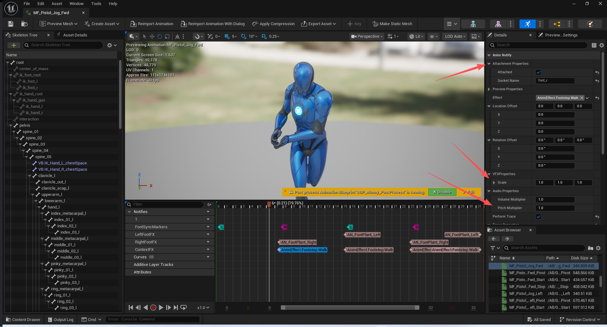
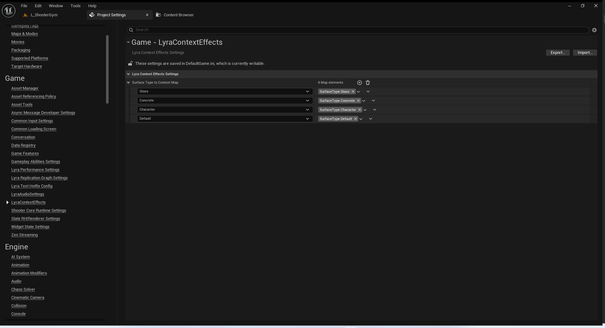
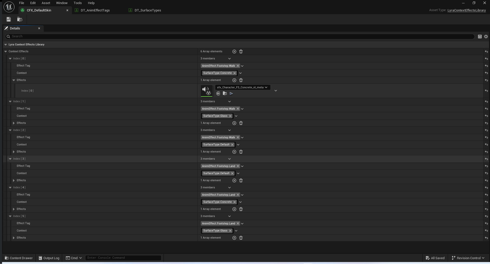
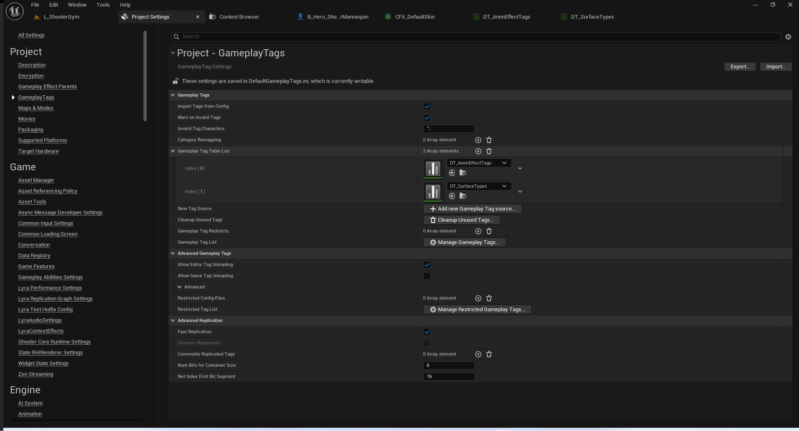
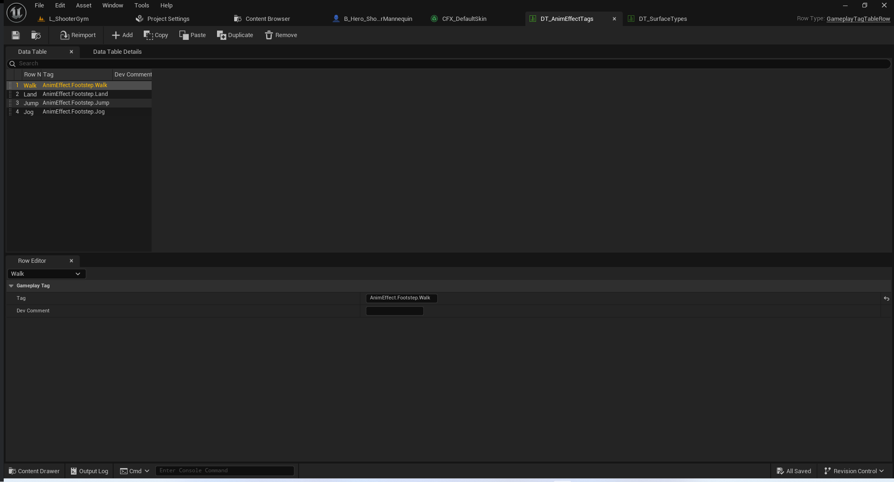
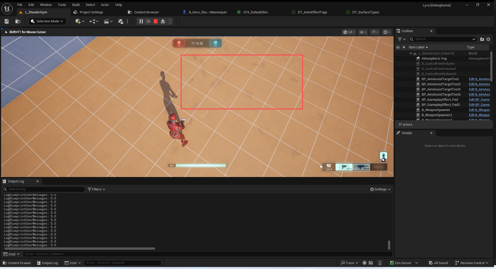
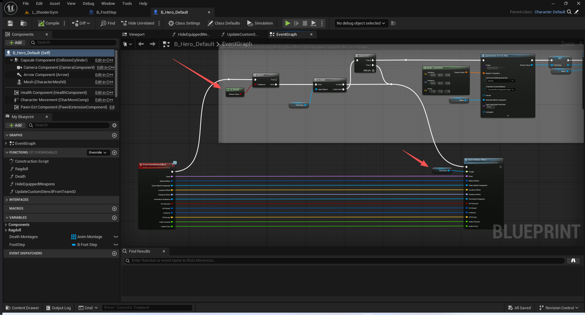
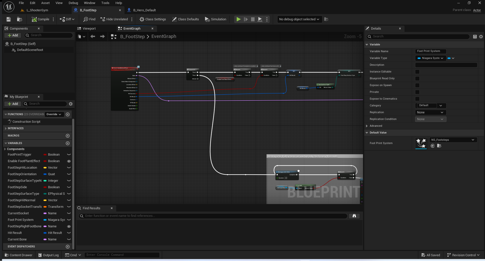
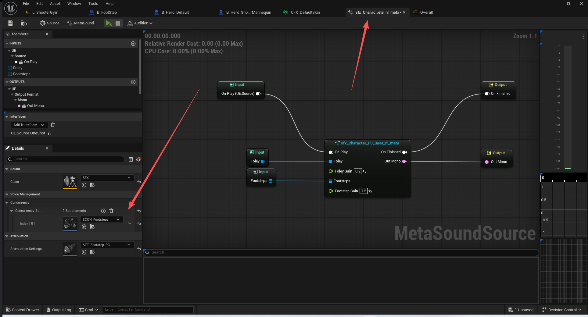
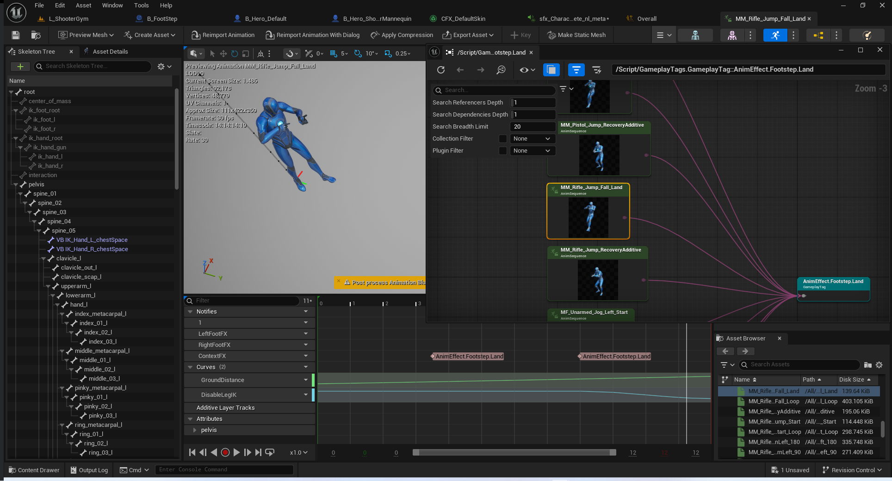

# UE5_Lyra学习指南_113_足迹上下文系统
本文章仅为小刚-B站课堂-虚幻引擎视频课程Lyra-精讲的演讲手稿.  
本套课程链接:[[UE5]虚幻引擎游戏案例Lyra精讲](https://www.bilibili.com/cheese/play/ss112001159)  
前置课程链接:[[UE5]虚幻引擎UEC++从基础到进阶](https://www.bilibili.com/cheese/play/ss28043)  

文章内容由小刚撰写,采用了以下多种方式:  
1.口述转文字  
2.AI重构  
3.参考引擎源码  
4.Lyra工程源码  
5.结合社区论坛各位大佬的解析  

- [UE5\_Lyra学习指南\_113\_足迹上下文系统](#ue5_lyra学习指南_113_足迹上下文系统)
	- [概述](#概述)
	- [接口](#接口)
	- [动画通知](#动画通知)
		- [参数结构体](#参数结构体)
		- [头文件](#头文件)
		- [触发效果](#触发效果)
	- [表面tag映射设置](#表面tag映射设置)
	- [效果使用的库](#效果使用的库)
		- [结构体定义](#结构体定义)
		- [ULyraContextEffectsLibrary](#ulyracontexteffectslibrary)
		- [加载流程](#加载流程)
			- [启动加载](#启动加载)
			- [获取数据](#获取数据)
	- [上下文效果组件](#上下文效果组件)
		- [头文件](#头文件-1)
		- [资产的注册和卸载](#资产的注册和卸载)
		- [效果的创建](#效果的创建)
		- [更新情境](#更新情境)
	- [子系统](#子系统)
	- [足迹效果](#足迹效果)
	- [编辑器下的资产定义](#编辑器下的资产定义)
	- [总结](#总结)


## 概述
本节主要讲解足迹和移动时的声音.
注意,可以在这里嵌入AI的感官刺激,制造移动的声音.
## 接口
``` cpp
/**
 * 未使用
 */
UENUM()
enum EEffectsContextMatchType: int
{
	ExactMatch,
	BestMatch
};

/**
 *
 */
 UINTERFACE(MinimalAPI, Blueprintable)
 class ULyraContextEffectsInterface : public UInterface
 {
	 GENERATED_BODY()

 };
 
 class ILyraContextEffectsInterface : public IInterface
 {
	 GENERATED_BODY()

 public:

	/** */
 	UFUNCTION(BlueprintCallable, BlueprintNativeEvent)
	UE_API void AnimMotionEffect(const FName Bone
		, const FGameplayTag MotionEffect
		, USceneComponent* StaticMeshComponent
		, const FVector LocationOffset
		, const FRotator RotationOffset
		, const UAnimSequenceBase* AnimationSequence
		, const bool bHitSuccess
		, const FHitResult HitResult
		, FGameplayTagContainer Contexts
		, FVector VFXScale = FVector(1)
		, float AudioVolume = 1
		, float AudioPitch = 1);
 };


```

## 动画通知

### 参数结构体
```cpp
/**
 * 粒子效果设置
 */
USTRUCT(BlueprintType)
struct FLyraContextEffectAnimNotifyVFXSettings
{
	GENERATED_BODY()

	// Scale to spawn the particle system at
	// 将粒子系统设置为以何种比例生成
	UPROPERTY(EditAnywhere, BlueprintReadWrite, Category = FX)
	FVector Scale = FVector(1.0f, 1.0f, 1.0f);

};

/**
 * 音频设置
 */
USTRUCT(BlueprintType)
struct FLyraContextEffectAnimNotifyAudioSettings
{
	GENERATED_BODY()

	// Volume Multiplier
	// 音量调整系数
	UPROPERTY(EditAnywhere, BlueprintReadWrite, Category = Sound)
	float VolumeMultiplier = 1.0f;

	// Pitch Multiplier
	// 音调调整系数
	UPROPERTY(EditAnywhere, BlueprintReadWrite, Category = Sound)
	float PitchMultiplier = 1.0f;
};


/**
 * 射线设置
 */
USTRUCT(BlueprintType)
struct FLyraContextEffectAnimNotifyTraceSettings
{
	GENERATED_BODY()

	// Trace Channel
	// 跟踪通道
	UPROPERTY(EditAnywhere, BlueprintReadWrite, Category = Trace)
	TEnumAsByte<ECollisionChannel> TraceChannel = ECollisionChannel::ECC_Visibility;

	// Vector offset from Effect Location
	// 与效果位置的偏移量向量
	UPROPERTY(EditAnywhere, BlueprintReadWrite, Category = Trace)
	FVector EndTraceLocationOffset = FVector::ZeroVector;

	// Ignore this Actor when getting trace result
	// 在获取追踪结果时忽略此角色
	UPROPERTY(EditAnywhere, BlueprintReadWrite, Category = Trace)
	bool bIgnoreActor = true;
};

/**
 * 预览设置
 */
USTRUCT(BlueprintType)
struct FLyraContextEffectAnimNotifyPreviewSettings
{
	GENERATED_BODY()

	// If true, will attempt to match selected Surface Type to Context Tag via Project Settings
	// 若为真，则将尝试根据项目设置将选定的表面类型与上下文标签进行匹配
	UPROPERTY(EditAnywhere, BlueprintReadWrite, Category = Preview)
	bool bPreviewPhysicalSurfaceAsContext = true;

	// Surface Type
	// 表面类型
	UPROPERTY(EditAnywhere, BlueprintReadWrite, Category = Preview, meta=(EditCondition="bPreviewPhysicalSurfaceAsContext"))
	TEnumAsByte<EPhysicalSurface> PreviewPhysicalSurface = EPhysicalSurface::SurfaceType_Default;

	// Preview Library
	// 预览库
	UPROPERTY(EditAnywhere, BlueprintReadWrite, Category = Preview, meta = (AllowedClasses = "/Script/LyraGame.LyraContextEffectsLibrary"))
	FSoftObjectPath PreviewContextEffectsLibrary;

	// Preview Context
	// 预览上下文
	UPROPERTY(EditAnywhere, BlueprintReadWrite, Category = Preview)
	FGameplayTagContainer PreviewContexts;
};


```
### 头文件
``` cpp
/**
 * 效果的动画通知 
 * 目前主要用于脚步移动中
 */
UCLASS(MinimalAPI, const, hidecategories=Object, CollapseCategories, Config = Game, meta=(DisplayName="Play Context Effects"))
class UAnimNotify_LyraContextEffects : public UAnimNotify
{
	GENERATED_BODY()

public:
	// 无
	UE_API UAnimNotify_LyraContextEffects();

	// Begin UObject interface
	// 无
	UE_API virtual void PostLoad() override;
#if WITH_EDITOR
	// 无
	UE_API virtual void PostEditChangeProperty(struct FPropertyChangedEvent& PropertyChangedEvent) override;
#endif
	// End UObject interface

	// Begin UAnimNotify interface
	// 将Tag转换成动画通知的名字
	UE_API virtual FString GetNotifyName_Implementation() const override;
	// 转发到接口 实现效果的调用
	UE_API virtual void Notify(USkeletalMeshComponent* MeshComp, UAnimSequenceBase* Animation, const FAnimNotifyEventReference& EventReference) override;
#if WITH_EDITOR
	// 无
	UE_API virtual void ValidateAssociatedAssets() override;
#endif
	// End UAnimNotify interface

#if WITH_EDITOR
	// 方便修改参数 编辑器下的接口 批量调整
	UFUNCTION(BlueprintCallable)
	UE_API void SetParameters(FGameplayTag EffectIn, FVector LocationOffsetIn, FRotator RotationOffsetIn, 
		FLyraContextEffectAnimNotifyVFXSettings VFXPropertiesIn, FLyraContextEffectAnimNotifyAudioSettings AudioPropertiesIn,
		bool bAttachedIn, FName SocketNameIn, bool bPerformTraceIn, FLyraContextEffectAnimNotifyTraceSettings TracePropertiesIn);
#endif


	// Effect to Play
	// 播放效果
	UPROPERTY(EditAnywhere, BlueprintReadWrite, Category = "AnimNotify", meta = (DisplayName = "Effect", ExposeOnSpawn = true))
	FGameplayTag Effect;

	// Location offset from the socket
	// 与套接字的相对位置偏移量
	UPROPERTY(EditAnywhere, BlueprintReadWrite, Category = "AnimNotify", meta = (ExposeOnSpawn = true))
	FVector LocationOffset = FVector::ZeroVector;

	// Rotation offset from socket
	// 与接头的旋转偏移量
	UPROPERTY(EditAnywhere, BlueprintReadWrite, Category = "AnimNotify", meta = (ExposeOnSpawn = true))
	FRotator RotationOffset = FRotator::ZeroRotator;

	// Scale to spawn the particle system at
	// 将粒子系统设置为以何种比例生成
	UPROPERTY(EditAnywhere, BlueprintReadWrite, Category = "AnimNotify", meta = (ExposeOnSpawn = true))
	FLyraContextEffectAnimNotifyVFXSettings VFXProperties;

	// Scale to spawn the particle system at
	// 将粒子系统设置为以何种比例生成
	// 这里的注释错了
	UPROPERTY(EditAnywhere, BlueprintReadWrite, Category = "AnimNotify", meta = (ExposeOnSpawn = true))
	FLyraContextEffectAnimNotifyAudioSettings AudioProperties;

	// Should attach to the bone/socket
	// 应该固定在骨头/关节处
	UPROPERTY(EditAnywhere, BlueprintReadWrite, Category = "AttachmentProperties", meta = (ExposeOnSpawn = true))
	uint32 bAttached : 1; 	//~ Does not follow coding standard due to redirection from BP

	// SocketName to attach to
	// 要连接的套接字名称
	UPROPERTY(EditAnywhere, BlueprintReadWrite, Category = "AttachmentProperties", meta = (ExposeOnSpawn = true, EditCondition = "bAttached"))
	FName SocketName;

	// Will perform a trace, required for SurfaceType to Context Conversion
	// 将执行跟踪操作，这是将表面类型转换为上下文所需的步骤
	UPROPERTY(EditAnywhere, BlueprintReadWrite, Category = "AnimNotify", meta = (ExposeOnSpawn = true))
	uint32 bPerformTrace : 1; 	

	// Scale to spawn the particle system at
	// 将粒子系统设置为以何种比例生成
	// 这里的注释错了
	UPROPERTY(EditAnywhere, BlueprintReadWrite, Category = "AnimNotify", meta = (ExposeOnSpawn = true, EditCondition = "bPerformTrace"))
	FLyraContextEffectAnimNotifyTraceSettings TraceProperties;

#if WITH_EDITORONLY_DATA
	// 编辑器下是否预览
	UPROPERTY(Config, EditAnywhere, Category = "PreviewProperties")
	uint32 bPreviewInEditor : 1;

	// 预览属性
	UPROPERTY(EditAnywhere, Category = "PreviewProperties", meta = (EditCondition = "bPreviewInEditor"))
	FLyraContextEffectAnimNotifyPreviewSettings PreviewProperties;
#endif


};
```
### 触发效果
``` cpp
void UAnimNotify_LyraContextEffects::Notify(USkeletalMeshComponent* MeshComp, UAnimSequenceBase* Animation,
	const FAnimNotifyEventReference& EventReference)
{
	Super::Notify(MeshComp, Animation, EventReference);

	if (MeshComp)
	{
		// Make sure both MeshComp and Owning Actor is valid
		// 确保“网格组件”和“拥有者角色”均有效
		if (AActor* OwningActor = MeshComp->GetOwner())
		{
			// Prepare Trace Data
			// 准备跟踪数据
			bool bHitSuccess = false;
			FHitResult HitResult;
			FCollisionQueryParams QueryParams;

			if (TraceProperties.bIgnoreActor)
			{
				QueryParams.AddIgnoredActor(OwningActor);
			}

			QueryParams.bReturnPhysicalMaterial = true;

			if (bPerformTrace)
			{
				// If trace is needed, set up Start Location to Attached
				// 若需要追踪信息，请将起始位置设置为“已连接”状态。
				FVector TraceStart = bAttached ? MeshComp->GetSocketLocation(SocketName) : MeshComp->GetComponentLocation();

				// Make sure World is valid
				// 确保“世界”参数有效
				if (UWorld* World = OwningActor->GetWorld())
				{
					// Call Line Trace, Pass in relevant properties
					// 调用线路跟踪功能，传入相关属性
					bHitSuccess = World->LineTraceSingleByChannel(HitResult, TraceStart, (TraceStart + TraceProperties.EndTraceLocationOffset),
						TraceProperties.TraceChannel, QueryParams, FCollisionResponseParams::DefaultResponseParam);
				}
			}

			// Prepare Contexts in advance
			// 提前准备相关背景信息
			FGameplayTagContainer Contexts;

			// Set up Array of Objects that implement the Context Effects Interface
			// 创建一个实现了“上下文效果接口”的对象数组
			TArray<UObject*> LyraContextEffectImplementingObjects;

			// Determine if the Owning Actor is one of the Objects that implements the Context Effects Interface
			// 判断拥有者角色是否是实现了“上下文效果接口”的对象之一
			if (OwningActor->Implements<ULyraContextEffectsInterface>())
			{
				// If so, add it to the Array
				// 如果是这样，就将其添加到数组中
				LyraContextEffectImplementingObjects.Add(OwningActor);
			}

			// Cycle through Owning Actor's Components and determine if any of them is a Component implementing the Context Effect Interface
			// 遍历拥有者角色的组件，并判断其中是否有任何组件实现了“上下文效果接口”这一功能。
			for (const auto Component : OwningActor->GetComponents())
			{
				if (Component)
				{
					// If the Component implements the Context Effects Interface, add it to the list
					// 如果组件实现了“上下文效果接口”，则将其添加到列表中
					if (Component->Implements<ULyraContextEffectsInterface>())
					{
						LyraContextEffectImplementingObjects.Add(Component);
					}
				}
			}

			// Cycle through all objects implementing the Context Effect Interface
			// 遍历所有实现“上下文效应接口”的对象
			for (UObject* LyraContextEffectImplementingObject : LyraContextEffectImplementingObjects)
			{
				if (LyraContextEffectImplementingObject)
				{
					// If the object is still valid, Execute the AnimMotionEffect Event on it, passing in relevant data
					// 如果该对象仍然有效，则对其执行“动画运动效果”事件，并传入相关数据
					ILyraContextEffectsInterface::Execute_AnimMotionEffect(LyraContextEffectImplementingObject,
						(bAttached ? SocketName : FName("None")),
						Effect, MeshComp, LocationOffset, RotationOffset,
						Animation, bHitSuccess, HitResult, Contexts, VFXProperties.Scale,
						AudioProperties.VolumeMultiplier, AudioProperties.PitchMultiplier);
				}
			}

#if WITH_EDITORONLY_DATA
			// This is for Anim Editor previewing, it is a deconstruction of the calls made by the Interface and the Subsystem
			// 这是用于动画编辑器预览的代码，它对界面和子系统发出的调用进行了拆解。
			if (bPreviewInEditor)
			{
				UWorld* World = OwningActor->GetWorld();

				// Get the world, make sure it's an Editor Preview World
				// 获取整个世界，并确保它是编辑器预览世界
				if (World && World->WorldType == EWorldType::EditorPreview)
				{
					// Add Preview contexts if necessary
					// 如有必要，则添加预览上下文。
					Contexts.AppendTags(PreviewProperties.PreviewContexts);

					// Convert given Surface Type to Context and Add it to the Contexts for this Preview
					// 将给定的表面类型转换为上下文，并将其添加到本次预览的上下文中
					if (PreviewProperties.bPreviewPhysicalSurfaceAsContext)
					{
						TEnumAsByte<EPhysicalSurface> PhysicalSurfaceType = PreviewProperties.PreviewPhysicalSurface;

						if (const ULyraContextEffectsSettings* LyraContextEffectsSettings = GetDefault<ULyraContextEffectsSettings>())
						{
							if (const FGameplayTag* SurfaceContextPtr = LyraContextEffectsSettings->SurfaceTypeToContextMap.Find(PhysicalSurfaceType))
							{
								FGameplayTag SurfaceContext = *SurfaceContextPtr;

								Contexts.AddTag(SurfaceContext);
							}
						}
					}

					// Libraries are soft referenced, so you will want to try to load them now
					// TODO Async Asset Loading
					// 库是软引用类型的，所以您现在需要尝试加载它们
					// TODO 异步资源加载
					if (UObject* EffectsLibrariesObj = PreviewProperties.PreviewContextEffectsLibrary.TryLoad())
					{
						// Check if it is in fact a ULyraContextEffectLibrary type
						// 检查它是否确实属于 ULyraContextEffectLibrary 类型
						if (ULyraContextEffectsLibrary* EffectLibrary = Cast<ULyraContextEffectsLibrary>(EffectsLibrariesObj))
						{
							// Prepare Sounds and Niagara System Arrays
							// 准备声音和尼亚加拉系统数组
							TArray<USoundBase*> TotalSounds;
							TArray<UNiagaraSystem*> TotalNiagaraSystems;

							// Attempt to load the Effect Library content (will cache in Transient data on the Effect Library Asset)
							// 尝试加载效果库内容（会将内容缓存到效果库资产的临时数据中）
							EffectLibrary->LoadEffects();

							// If the Effect Library is valid and marked as Loaded, Get Effects from it
							// 如果效果库有效且已标记为“已加载”，则从该库中获取效果
							if (EffectLibrary && EffectLibrary->GetContextEffectsLibraryLoadState() == EContextEffectsLibraryLoadState::Loaded)
							{
								// Prepare local arrays
								// 准备本地数组
								TArray<USoundBase*> Sounds;
								TArray<UNiagaraSystem*> NiagaraSystems;

								// Get the Effects
								// 获取效果
								EffectLibrary->GetEffects(Effect, Contexts, Sounds, NiagaraSystems);

								// Append to the accumulating arrays
								// 将其追加到累加数组中
								TotalSounds.Append(Sounds);
								TotalNiagaraSystems.Append(NiagaraSystems);
							}

							// Cycle through Sounds and call Spawn Sound Attached, passing in relevant data
							// 依次遍历声音文件，并调用“生成附加声音”函数，同时传入相关数据
							for (USoundBase* Sound : TotalSounds)
							{
								UGameplayStatics::SpawnSoundAttached(Sound, MeshComp, (bAttached ? SocketName : FName("None")), LocationOffset, RotationOffset, EAttachLocation::KeepRelativeOffset,
									false, AudioProperties.VolumeMultiplier, AudioProperties.PitchMultiplier, 0.0f, nullptr, nullptr, true);
							}

							// Cycle through Niagara Systems and call Spawn System Attached, passing in relevant data
							// 依次遍历尼加拉系统，并调用“附加系统启动”功能，同时传入相关数据
							for (UNiagaraSystem* NiagaraSystem : TotalNiagaraSystems)
							{
								UNiagaraFunctionLibrary::SpawnSystemAttached(NiagaraSystem, MeshComp, (bAttached ? SocketName : FName("None")), LocationOffset,
									RotationOffset, VFXProperties.Scale, EAttachLocation::KeepRelativeOffset, true, ENCPoolMethod::None, true, true);
							}
						}
					}
						
				}
			}
#endif

		}
	}
}
```

## 表面tag映射设置

``` cpp

/**
 * Tag和表面类型的映射设置
 */
UCLASS(MinimalAPI, config = Game, defaultconfig, meta = (DisplayName = "LyraContextEffects"))
class ULyraContextEffectsSettings : public UDeveloperSettings
{
	GENERATED_BODY()

public:
	//
	UPROPERTY(config, EditAnywhere)
	TMap<TEnumAsByte<EPhysicalSurface>, FGameplayTag> SurfaceTypeToContextMap;
};
```

## 效果使用的库
### 结构体定义
``` cpp

/**
 * 加载状态
 */
UENUM()
enum class EContextEffectsLibraryLoadState : uint8 {
	Unloaded = 0,
	Loading = 1,
	Loaded = 2
};

/**
 * 尚未加载的
 */
USTRUCT(BlueprintType)
struct FLyraContextEffects
{
	GENERATED_BODY()

	UPROPERTY(EditAnywhere, BlueprintReadOnly)
	FGameplayTag EffectTag;

	UPROPERTY(EditAnywhere, BlueprintReadOnly)
	FGameplayTagContainer Context;

	UPROPERTY(EditAnywhere, BlueprintReadOnly, meta = (AllowedClasses = "/Script/Engine.SoundBase, /Script/Niagara.NiagaraSystem"))
	TArray<FSoftObjectPath> Effects;

};

/**
 * 已经加载好的
 */
UCLASS(MinimalAPI)
class ULyraActiveContextEffects : public UObject
{
	GENERATED_BODY()

public:
	UPROPERTY(VisibleAnywhere)
	FGameplayTag EffectTag;

	UPROPERTY(VisibleAnywhere)
	FGameplayTagContainer Context;

	UPROPERTY(VisibleAnywhere)
	TArray<TObjectPtr<USoundBase>> Sounds;

	UPROPERTY(VisibleAnywhere)
	TArray<TObjectPtr<UNiagaraSystem>> NiagaraSystems;
};
```
### ULyraContextEffectsLibrary
``` cpp

DECLARE_DYNAMIC_DELEGATE_OneParam(FLyraContextEffectLibraryLoadingComplete, TArray<ULyraActiveContextEffects*>, LyraActiveContextEffects);

/**
 * 效果引用库
 */
UCLASS(MinimalAPI, BlueprintType)
class ULyraContextEffectsLibrary : public UObject
{
	GENERATED_BODY()
	
public:

	UPROPERTY(EditAnywhere, BlueprintReadOnly)
	TArray<FLyraContextEffects> ContextEffects;

	UFUNCTION(BlueprintCallable)
	UE_API void GetEffects(const FGameplayTag Effect, const FGameplayTagContainer Context, TArray<USoundBase*>& Sounds, TArray<UNiagaraSystem*>& NiagaraSystems);

	UFUNCTION(BlueprintCallable)
	UE_API void LoadEffects();

	UE_API EContextEffectsLibraryLoadState GetContextEffectsLibraryLoadState();

private:
	void LoadEffectsInternal();

	void LyraContextEffectLibraryLoadingComplete(TArray<ULyraActiveContextEffects*> LyraActiveContextEffects);

	UPROPERTY(Transient)
	TArray< TObjectPtr<ULyraActiveContextEffects>> ActiveContextEffects;

	UPROPERTY(Transient)
	EContextEffectsLibraryLoadState EffectsLoadState = EContextEffectsLibraryLoadState::Unloaded;
};


```
### 加载流程
#### 启动加载
``` cpp
void ULyraContextEffectsLibrary::LoadEffects()
{
	// Load Effects into Library if not currently loading
	// 若当前未加载效果，则将其加载至库中
	if (EffectsLoadState != EContextEffectsLibraryLoadState::Loading)
	{
		// Set load state to loading
		// 将加载状态设置为“加载中”
		EffectsLoadState = EContextEffectsLibraryLoadState::Loading;

		// Clear out any old Active Effects
		// 清除所有已有的活跃效果
		ActiveContextEffects.Empty();

		// Call internal loading function
		// 调用内部加载函数
		LoadEffectsInternal();
	}
}
```

``` cpp
void ULyraContextEffectsLibrary::LoadEffectsInternal()
{
	// TODO Add Async Loading for Libraries

	// Copy data for async load
	// 待办事项：为库添加异步加载功能
	// 为异步加载复制数据
	TArray<FLyraContextEffects> LocalContextEffects = ContextEffects;

	// Prepare Active Context Effects Array
	// 准备活动上下文效果数组
	TArray<ULyraActiveContextEffects*> ActiveContextEffectsArray;

	// Loop through Context Effects
	// 对情境效果进行循环处理
	for (const FLyraContextEffects& ContextEffect : LocalContextEffects)
	{
		// Make sure Tags are Valid
		if (ContextEffect.EffectTag.IsValid() && ContextEffect.Context.IsValid())
		{
			// Create new Active Context Effect
			// 确保标签有效
			ULyraActiveContextEffects* NewActiveContextEffects = NewObject<ULyraActiveContextEffects>(this);

			// Pass relevant tag data
			// 传递相关的标签数据
			NewActiveContextEffects->EffectTag = ContextEffect.EffectTag;
			NewActiveContextEffects->Context = ContextEffect.Context;

			// Try to load and add Effects to New Active Context Effects
			// 尝试加载并为新的活动效果集添加效果
			for (const FSoftObjectPath& Effect : ContextEffect.Effects)
			{
				if (UObject* Object = Effect.TryLoad())
				{
					if (Object->IsA(USoundBase::StaticClass()))
					{
						if (USoundBase* SoundBase = Cast<USoundBase>(Object))
						{
							NewActiveContextEffects->Sounds.Add(SoundBase);
						}
					}
					else if (Object->IsA(UNiagaraSystem::StaticClass()))
					{
						if (UNiagaraSystem* NiagaraSystem = Cast<UNiagaraSystem>(Object))
						{
							NewActiveContextEffects->NiagaraSystems.Add(NiagaraSystem);
						}
					}
				}
			}

			// Add New Active Context to the Active Context Effects Array
			// 将新的活跃上下文添加到活跃上下文效果数组中
			ActiveContextEffectsArray.Add(NewActiveContextEffects);
		}
	}

	// TODO Call Load Complete after Async Load
	// Mark loading complete
	// 请在异步加载完成后调用“加载完成”函数
	// 标记加载已完成状态
	this->LyraContextEffectLibraryLoadingComplete(ActiveContextEffectsArray);
}
```
``` cpp
void ULyraContextEffectsLibrary::LyraContextEffectLibraryLoadingComplete(
	TArray<ULyraActiveContextEffects*> LyraActiveContextEffects)
{
	// Flag data as loaded
	// 将数据标记为已加载
	EffectsLoadState = EContextEffectsLibraryLoadState::Loaded;

	// Append incoming Context Effects Array to current list of Active Context Effects
	// 将接收到的上下文效果数组附加到当前的活动上下文效果列表中
	ActiveContextEffects.Append(LyraActiveContextEffects);
}

```
#### 获取数据
``` cpp
void ULyraContextEffectsLibrary::GetEffects(const FGameplayTag Effect, const FGameplayTagContainer Context, 
	TArray<USoundBase*>& Sounds, TArray<UNiagaraSystem*>& NiagaraSystems)
{
	// Make sure Effect is valid and Library is loaded
	// 确保效果有效且库已加载
	if (Effect.IsValid() && Context.IsValid() && EffectsLoadState == EContextEffectsLibraryLoadState::Loaded)
	{
		// Loop through Context Effects
		// 对情境效果进行循环处理
		for (const auto& ActiveContextEffect : ActiveContextEffects)
		{
			// Make sure the Effect is an exact Tag Match and ensure the Context has all tags in the Effect (and neither or both are empty)
			// 确保效果与标签的匹配是精确的，并且确保上下文包含了效果中的所有标签（并且上下文和效果中均无标签为空）
			if (Effect.MatchesTagExact(ActiveContextEffect->EffectTag)
				&& Context.HasAllExact(ActiveContextEffect->Context)
				&& (ActiveContextEffect->Context.IsEmpty() == Context.IsEmpty()))
			{
				// Get all Matching Sounds and Niagara Systems
				// 获取所有匹配的声音和尼加拉系统
				Sounds.Append(ActiveContextEffect->Sounds);
				NiagaraSystems.Append(ActiveContextEffect->NiagaraSystems);
			}
		}
	}
}

```
``` cpp
EContextEffectsLibraryLoadState ULyraContextEffectsLibrary::GetContextEffectsLibraryLoadState()
{
	// Return current Load State
	return EffectsLoadState;
}

```

## 上下文效果组件
### 头文件
``` cpp
UCLASS(MinimalAPI,  ClassGroup=(Custom), hidecategories = (Variable, Tags, ComponentTick, ComponentReplication, Activation, Cooking, AssetUserData, Collision), CollapseCategories, meta=(BlueprintSpawnableComponent) )
class ULyraContextEffectComponent : public UActorComponent, public ILyraContextEffectsInterface
{
	GENERATED_BODY()

public:	
	// Sets default values for this component's properties
	// 为该组件的属性设置默认值
	UE_API ULyraContextEffectComponent();

protected:
	// Called when the game starts
	// 当游戏开始时触发此事件
	UE_API virtual void BeginPlay() override;

	// Called when the game ends
	// 当游戏结束时触发此事件
	UE_API virtual void EndPlay(const EEndPlayReason::Type EndPlayReason) override;

public:
	// AnimMotionEffect Implementation
	// 移动动画效果实现接口
	UFUNCTION(BlueprintCallable)
	UE_API virtual void AnimMotionEffect_Implementation(const FName Bone, const FGameplayTag MotionEffect, USceneComponent* StaticMeshComponent,
		const FVector LocationOffset, const FRotator RotationOffset, const UAnimSequenceBase* AnimationSequence,
		const bool bHitSuccess, const FHitResult HitResult, FGameplayTagContainer Contexts,
		FVector VFXScale = FVector(1), float AudioVolume = 1, float AudioPitch = 1) override;

	// Auto-Convert Physical Surface from Trace Result to Context
	// 自动将追踪结果中的物理表面转换为上下文形式
	UPROPERTY(EditAnywhere, BlueprintReadOnly)
	bool bConvertPhysicalSurfaceToContext = true;

	// Default Contexts
	// 默认情境
	UPROPERTY(EditAnywhere)
	FGameplayTagContainer DefaultEffectContexts;

	// Default Libraries for this Actor
	// 本角色的默认库函数
	UPROPERTY(EditAnywhere)
	TSet<TSoftObjectPtr<ULyraContextEffectsLibrary>> DefaultContextEffectsLibraries;

	UFUNCTION(BlueprintCallable)
	UE_API void UpdateEffectContexts(FGameplayTagContainer NewEffectContexts);

	UFUNCTION(BlueprintCallable)
	UE_API void UpdateLibraries(TSet<TSoftObjectPtr<ULyraContextEffectsLibrary>> NewContextEffectsLibraries);

private:
	UPROPERTY(Transient)
	FGameplayTagContainer CurrentContexts;

	UPROPERTY(Transient)
	TSet<TSoftObjectPtr<ULyraContextEffectsLibrary>> CurrentContextEffectsLibraries;

	UPROPERTY(Transient)
	TArray<TObjectPtr<UAudioComponent>> ActiveAudioComponents;

	UPROPERTY(Transient)
	TArray<TObjectPtr<UNiagaraComponent>> ActiveNiagaraComponents;
};

```
### 资产的注册和卸载
``` cpp
// Called when the game starts
void ULyraContextEffectComponent::BeginPlay()
{
	Super::BeginPlay();

	// ...
	CurrentContexts.AppendTags(DefaultEffectContexts);
	CurrentContextEffectsLibraries = DefaultContextEffectsLibraries;

	// On Begin Play, Load and Add Context Effects pairings
	// 在“开始游戏”时，加载并添加情境效果的配对组合
	if (const UWorld* World = GetWorld())
	{
		if (ULyraContextEffectsSubsystem* LyraContextEffectsSubsystem = World->GetSubsystem<ULyraContextEffectsSubsystem>())
		{
			LyraContextEffectsSubsystem->LoadAndAddContextEffectsLibraries(GetOwner(), CurrentContextEffectsLibraries);
		}
	}
}

void ULyraContextEffectComponent::EndPlay(const EEndPlayReason::Type EndPlayReason)
{
	// On End PLay, remove unnecessary context effects pairings
	// 在游戏结束时，移除不必要的背景音效配对
	if (const UWorld* World = GetWorld())
	{
		if (ULyraContextEffectsSubsystem* LyraContextEffectsSubsystem = World->GetSubsystem<ULyraContextEffectsSubsystem>())
		{
			LyraContextEffectsSubsystem->UnloadAndRemoveContextEffectsLibraries(GetOwner());
		}
	}

	Super::EndPlay(EndPlayReason);
}
```
``` cpp

void ULyraContextEffectsSubsystem::LoadAndAddContextEffectsLibraries(AActor* OwningActor,
	TSet<TSoftObjectPtr<ULyraContextEffectsLibrary>> ContextEffectsLibraries)
{
	// Early out if Owning Actor is invalid or if the associated Libraries is 0 (or less)
	// 若拥有者角色无效，或者所关联的库数量为 0（或更少），则提前退出。
	if (OwningActor == nullptr || ContextEffectsLibraries.Num() <= 0)
	{
		return;
	}

	// Create new Context Effect Set
	// 创建新的情境效果集
	ULyraContextEffectsSet* EffectsLibrariesSet = NewObject<ULyraContextEffectsSet>(this);

	// Cycle through Libraries getting Soft Obj Refs
	// 遍历各个库获取软对象引用
	for (const TSoftObjectPtr<ULyraContextEffectsLibrary>& ContextEffectSoftObj : ContextEffectsLibraries)
	{
		// Load Library Assets from Soft Obj refs
		// TODO Support Async Loading of Asset Data
		// 从软对象引用中加载库资源
		// TODO 支持资源数据的异步加载
		if (ULyraContextEffectsLibrary* EffectsLibrary = ContextEffectSoftObj.LoadSynchronous())
		{
			// Call load on valid Libraries
			// 对有效的库调用加载操作
			EffectsLibrary->LoadEffects();

			// Add new library to Set
			// 将新库添加至集合中
			EffectsLibrariesSet->LyraContextEffectsLibraries.Add(EffectsLibrary);
		}
	}

	// Update Active Actor Effects Map
	// 更新活动角色效果图
	ActiveActorEffectsMap.Emplace(OwningActor, EffectsLibrariesSet);
}

void ULyraContextEffectsSubsystem::UnloadAndRemoveContextEffectsLibraries(AActor* OwningActor)
{
	// Early out if Owning Actor is invalid
	if (OwningActor == nullptr)
	{
		return;
	}

	// Remove ref from Active Actor/Effects Set Map
	ActiveActorEffectsMap.Remove(OwningActor);
}

```
### 效果的创建
``` cpp

// Implementation of Interface's AnimMotionEffect function
void ULyraContextEffectComponent::AnimMotionEffect_Implementation(const FName Bone, const FGameplayTag MotionEffect, USceneComponent* StaticMeshComponent,
	const FVector LocationOffset, const FRotator RotationOffset, const UAnimSequenceBase* AnimationSequence,
	const bool bHitSuccess, const FHitResult HitResult, FGameplayTagContainer Contexts,
	FVector VFXScale, float AudioVolume, float AudioPitch)
{
	// Prep Components
	// 准备组件
	TArray<UAudioComponent*> AudioComponentsToAdd;
	TArray<UNiagaraComponent*> NiagaraComponentsToAdd;

	FGameplayTagContainer TotalContexts;

	// Aggregate contexts
	// 综合情境
	TotalContexts.AppendTags(Contexts);
	TotalContexts.AppendTags(CurrentContexts);

	// Check if converting Physical Surface Type to Context
	// 检查是否将物理表面类型转换为上下文类型
	if (bConvertPhysicalSurfaceToContext)
	{
		// Get Phys Mat Type Pointer
		// 获取物理材质类型指针
		TWeakObjectPtr<UPhysicalMaterial> PhysicalSurfaceTypePtr = HitResult.PhysMaterial;

		// Check if pointer is okay
		// 检查指针是否正常有效
		if (PhysicalSurfaceTypePtr.IsValid())
		{
			// Get the Surface Type Pointer
			// 获取表面类型指针
			TEnumAsByte<EPhysicalSurface> PhysicalSurfaceType = PhysicalSurfaceTypePtr->SurfaceType;

			// If Settings are valid
			// 如果设置有效
			if (const ULyraContextEffectsSettings* LyraContextEffectsSettings = GetDefault<ULyraContextEffectsSettings>())
			{
				// Convert Surface Type to known
				// 将表面类型转换为已知类型
				if (const FGameplayTag* SurfaceContextPtr = LyraContextEffectsSettings->SurfaceTypeToContextMap.Find(PhysicalSurfaceType))
				{
					FGameplayTag SurfaceContext = *SurfaceContextPtr;

					TotalContexts.AddTag(SurfaceContext);
				}
			}
		}
	}

	// Cycle through Active Audio Components and cache
	// 遍历活动音频组件并进行缓存
	for (UAudioComponent* ActiveAudioComponent : ActiveAudioComponents)
	{
		if (ActiveAudioComponent)
		{
			AudioComponentsToAdd.Add(ActiveAudioComponent);
		}
	}

	// Cycle through Active Niagara Components and cache
	// 遍历活动的尼加拉组件并进行缓存
	for (UNiagaraComponent* ActiveNiagaraComponent : ActiveNiagaraComponents)
	{
		if (ActiveNiagaraComponent)
		{
			NiagaraComponentsToAdd.Add(ActiveNiagaraComponent);
		}
	}

	// Get World
	// 获取世界信息

	if (const UWorld* World = GetWorld())
	{
		// Get Subsystem
		// 获取子系统
		if (ULyraContextEffectsSubsystem* LyraContextEffectsSubsystem = World->GetSubsystem<ULyraContextEffectsSubsystem>())
		{
			// Set up Audio Components and Niagara
			// 设置音频组件和尼加拉框架
			TArray<UAudioComponent*> AudioComponents;
			TArray<UNiagaraComponent*> NiagaraComponents;

			// Spawn effects
			// 生成效果
			LyraContextEffectsSubsystem->SpawnContextEffects(GetOwner(), StaticMeshComponent, Bone, 
				LocationOffset, RotationOffset, MotionEffect, TotalContexts,
				AudioComponents, NiagaraComponents, VFXScale, AudioVolume, AudioPitch);

			// Append resultant effects
			// 添加最终效果
			AudioComponentsToAdd.Append(AudioComponents);
			NiagaraComponentsToAdd.Append(NiagaraComponents);
		}
	}

	// Append Active Audio Components
	// 添加活动音频组件
	ActiveAudioComponents.Empty();
	ActiveAudioComponents.Append(AudioComponentsToAdd);

	// Append Active
	// 添加活动状态
	ActiveNiagaraComponents.Empty();
	ActiveNiagaraComponents.Append(NiagaraComponentsToAdd);

}

```
``` cpp

void ULyraContextEffectsSubsystem::SpawnContextEffects(
	const AActor* SpawningActor
	, USceneComponent* AttachToComponent
	, const FName AttachPoint
	, const FVector LocationOffset
	, const FRotator RotationOffset
	, FGameplayTag Effect
	, FGameplayTagContainer Contexts
	, TArray<UAudioComponent*>& AudioOut
	, TArray<UNiagaraComponent*>& NiagaraOut
	, FVector VFXScale
	, float AudioVolume
	, float AudioPitch)
{
	// First determine if this Actor has a matching Set of Libraries
	// 首先确定此角色是否具有与之匹配的一组库
	if (TObjectPtr<ULyraContextEffectsSet>* EffectsLibrariesSetPtr = ActiveActorEffectsMap.Find(SpawningActor))
	{
		// Validate the pointers from the Map Find
		// 验证来自“查找”映射的指针
		if (ULyraContextEffectsSet* EffectsLibraries = *EffectsLibrariesSetPtr)
		{
			// Prepare Arrays for Sounds and Niagara Systems
			// 准备声音和尼亚加拉系统的相关数组
			TArray<USoundBase*> TotalSounds;
			TArray<UNiagaraSystem*> TotalNiagaraSystems;

			// Cycle through Effect Libraries
			// 依次浏览效果库
			for (ULyraContextEffectsLibrary* EffectLibrary : EffectsLibraries->LyraContextEffectsLibraries)
			{
				// Check if the Effect Library is valid and data Loaded
				// 检查特效库是否有效且数据是否已加载
				if (EffectLibrary && EffectLibrary->GetContextEffectsLibraryLoadState() == EContextEffectsLibraryLoadState::Loaded)
				{
					// Set up local list of Sounds and Niagara Systems
					// 设置本地的音效列表和尼加拉系统列表
					TArray<USoundBase*> Sounds;
					TArray<UNiagaraSystem*> NiagaraSystems;

					// Get Sounds and Niagara Systems
					// 获取声音和尼亚加拉系统
					EffectLibrary->GetEffects(Effect, Contexts, Sounds, NiagaraSystems);

					// Append to accumulating array
					// 将内容追加到累积数组中
					TotalSounds.Append(Sounds);
					TotalNiagaraSystems.Append(NiagaraSystems);
				}
				else if (EffectLibrary && EffectLibrary->GetContextEffectsLibraryLoadState() == EContextEffectsLibraryLoadState::Unloaded)
				{
					// Else load effects
					// 其他效果加载操作
					EffectLibrary->LoadEffects();
				}
			}

			// Cycle through found Sounds
			// 遍历找到的所有声音
			for (USoundBase* Sound : TotalSounds)
			{
				// Spawn Sounds Attached, add Audio Component to List of ACs
				// 附加音效对象，将音频组件添加到 AC 列表中
				UAudioComponent* AudioComponent = UGameplayStatics::SpawnSoundAttached(Sound, AttachToComponent, AttachPoint, LocationOffset, RotationOffset, EAttachLocation::KeepRelativeOffset,
					false, AudioVolume, AudioPitch, 0.0f, nullptr, nullptr, true);

				AudioOut.Add(AudioComponent);
			}

			// Cycle through found Niagara Systems
			// 依次遍历所找到的尼加拉系统
			for (UNiagaraSystem* NiagaraSystem : TotalNiagaraSystems)
			{
				// Spawn Niagara Systems Attached, add Niagara Component to List of NCs
				// 启动尼加拉系统附加功能，将尼加拉组件添加到 NC 列表中
				UNiagaraComponent* NiagaraComponent = UNiagaraFunctionLibrary::SpawnSystemAttached(NiagaraSystem, AttachToComponent, AttachPoint, LocationOffset,
					RotationOffset, VFXScale, EAttachLocation::KeepRelativeOffset, true, ENCPoolMethod::None, true, true);

				NiagaraOut.Add(NiagaraComponent);
			}
		}
	}
}


```
### 更新情境
``` cpp
void ULyraContextEffectComponent::UpdateEffectContexts(FGameplayTagContainer NewEffectContexts)
{
	// Reset and update
	CurrentContexts.Reset(NewEffectContexts.Num());
	CurrentContexts.AppendTags(NewEffectContexts);
}

void ULyraContextEffectComponent::UpdateLibraries(
	TSet<TSoftObjectPtr<ULyraContextEffectsLibrary>> NewContextEffectsLibraries)
{
	// Clear out existing Effects
	// 清除现有的效果
	CurrentContextEffectsLibraries = NewContextEffectsLibraries;

	// Get World
	if (const UWorld* World = GetWorld())
	{
		// Get Subsystem
		if (ULyraContextEffectsSubsystem* LyraContextEffectsSubsystem = World->GetSubsystem<ULyraContextEffectsSubsystem>())
		{
			// Load and Add Libraries to Subsystem                  
			LyraContextEffectsSubsystem->LoadAndAddContextEffectsLibraries(GetOwner(), CurrentContextEffectsLibraries);
		}
	}
}
```






## 子系统
``` cpp

/**
 *
 */
UCLASS(MinimalAPI)
class ULyraContextEffectsSet : public UObject
{
	GENERATED_BODY()

public:
	UPROPERTY(Transient)
	TSet<TObjectPtr<ULyraContextEffectsLibrary>> LyraContextEffectsLibraries;
};


/**
 * 
 */
UCLASS(MinimalAPI)
class ULyraContextEffectsSubsystem : public UWorldSubsystem
{
	GENERATED_BODY()
	
public:
	/** 生成效果*/
	UFUNCTION(BlueprintCallable, Category = "ContextEffects")
	UE_API void SpawnContextEffects(
		const AActor* SpawningActor
		, USceneComponent* AttachToComponent
		, const FName AttachPoint
		, const FVector LocationOffset
		, const FRotator RotationOffset
		, FGameplayTag Effect
		, FGameplayTagContainer Contexts
		, TArray<UAudioComponent*>& AudioOut
		, TArray<UNiagaraComponent*>& NiagaraOut
		, FVector VFXScale = FVector(1)
		, float AudioVolume = 1
		, float AudioPitch = 1);

	/** */
	UFUNCTION(BlueprintCallable, Category = "ContextEffects")
	UE_API bool GetContextFromSurfaceType(TEnumAsByte<EPhysicalSurface> PhysicalSurface, FGameplayTag& Context);

	/** 接收资产的注册使用*/
	UFUNCTION(BlueprintCallable, Category = "ContextEffects")
	UE_API void LoadAndAddContextEffectsLibraries(AActor* OwningActor, TSet<TSoftObjectPtr<ULyraContextEffectsLibrary>> ContextEffectsLibraries);

	/** 卸载对应的角色效果资产*/
	UFUNCTION(BlueprintCallable, Category = "ContextEffects")
	UE_API void UnloadAndRemoveContextEffectsLibraries(AActor* OwningActor);

private:

	UPROPERTY(Transient)
	TMap<TObjectPtr<AActor>, TObjectPtr<ULyraContextEffectsSet>> ActiveActorEffectsMap;

};
```

## 足迹效果
注意这里需要以Client方式启动才看到的,因为它这个生成的时候,蓝图代码权限判定写漏了



蓝图部分逻辑自己查阅即可.
需要注意音频的并发设置


## 编辑器下的资产定义
``` cpp
// Copyright Epic Games, Inc. All Rights Reserved.

#pragma once

#include "AssetTypeActions_Base.h"
#include "AssetTypeCategories.h"

class UClass;

class FAssetTypeActions_LyraContextEffectsLibrary : public FAssetTypeActions_Base
{
public:
	// IAssetTypeActions Implementation
	virtual FText GetName() const override { return NSLOCTEXT("AssetTypeActions", "AssetTypeActions_LyraContextEffectsLibrary", "LyraContextEffectsLibrary"); }
	virtual FColor GetTypeColor() const override { return FColor(65, 200, 98); }
	virtual UClass* GetSupportedClass() const override;
	virtual uint32 GetCategories() override { return EAssetTypeCategories::Gameplay; }
};

```
``` cpp
// Copyright Epic Games, Inc. All Rights Reserved.

#include "AssetTypeActions_LyraContextEffectsLibrary.h"

#include "Feedback/ContextEffects/LyraContextEffectsLibrary.h"

class UClass;

#define LOCTEXT_NAMESPACE "AssetTypeActions"

UClass* FAssetTypeActions_LyraContextEffectsLibrary::GetSupportedClass() const
{
	return ULyraContextEffectsLibrary::StaticClass();
}

#undef LOCTEXT_NAMESPACE

```
``` cpp

/**
 * FLyraEditorModule
 */
class FLyraEditorModule : public FDefaultGameModuleImpl
{
	typedef FLyraEditorModule ThisClass;

	virtual void StartupModule() override
	{
		// ....

		// Register the Context Effects Library asset type actions.
		{
			IAssetTools& AssetTools = FModuleManager::LoadModuleChecked<FAssetToolsModule>("AssetTools").Get();
			TSharedRef<FAssetTypeActions_LyraContextEffectsLibrary> AssetAction = MakeShared<FAssetTypeActions_LyraContextEffectsLibrary>();
			LyraContextEffectsLibraryAssetAction = AssetAction;
			AssetTools.RegisterAssetTypeActions(AssetAction);
		}
	}


	virtual void ShutdownModule() override
	{
		// Unregister the Context Effects Library asset type actions.
		{
			FAssetToolsModule* AssetToolsModule = FModuleManager::GetModulePtr<FAssetToolsModule>("AssetTools");
			TSharedPtr<IAssetTypeActions> AssetAction = LyraContextEffectsLibraryAssetAction.Pin();
			if (AssetToolsModule && AssetAction)
			{
				AssetToolsModule->Get().UnregisterAssetTypeActions(AssetAction.ToSharedRef());
			}
		}
		//...
	}

protected:


	TWeakPtr<IAssetTypeActions> LyraContextEffectsLibraryAssetAction;

};

IMPLEMENT_MODULE(FLyraEditorModule, LyraEditor);

#undef LOCTEXT_NAMESPACE


```


## 总结
足迹系统基本讲解完毕.
注意里面有一些todo关于资产异步加载的优化.
这个架构可以不只应用在移动中关于足迹这部分.