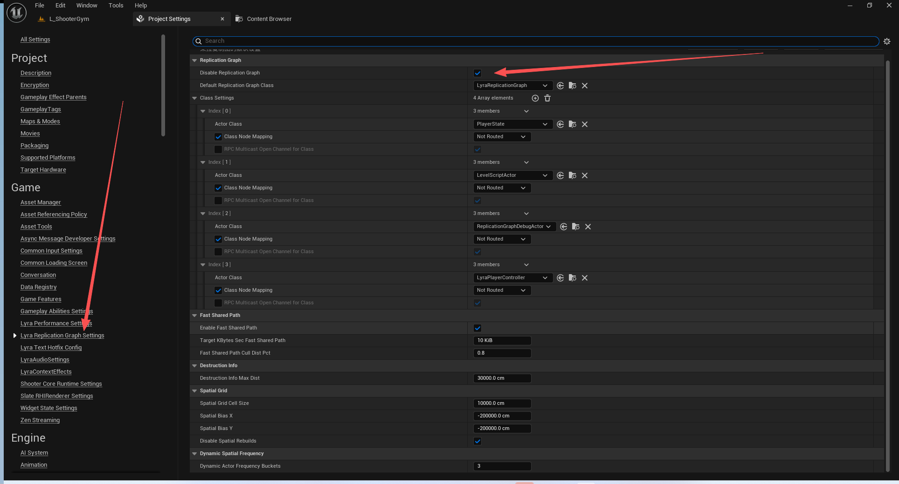
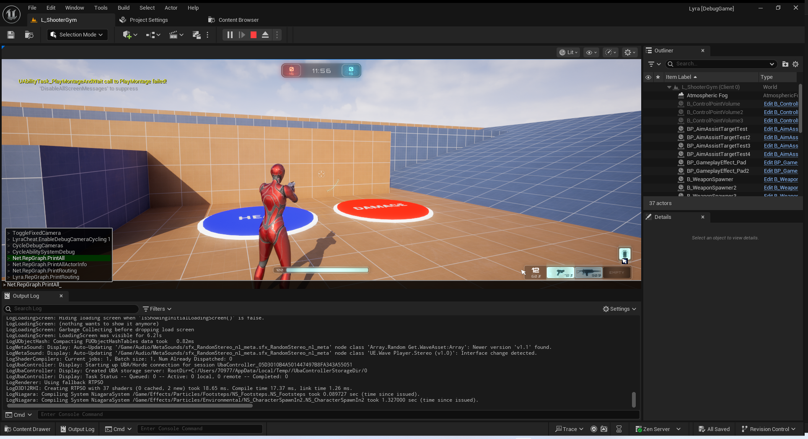

# UE5_Lyra学习指南_114_ReplicationGraph

本文章仅为小刚-B站课堂-虚幻引擎视频课程Lyra-精讲的演讲手稿.  
本套课程链接:[[UE5]虚幻引擎游戏案例Lyra精讲](https://www.bilibili.com/cheese/play/ss112001159)  
前置课程链接:[[UE5]虚幻引擎UEC++从基础到进阶](https://www.bilibili.com/cheese/play/ss28043)  

文章内容由小刚撰写,采用了以下多种方式:  
1.口述转文字  
2.AI重构  
3.参考引擎源码  
4.Lyra工程源码  
5.结合社区论坛各位大佬的解析  

- [UE5\_Lyra学习指南\_114\_ReplicationGraph](#ue5_lyra学习指南_114_replicationgraph)
	- [概述](#概述)
	- [官方文档](#官方文档)
		- [结构](#结构)
		- [启用此系统](#启用此系统)
		- [配置(.ini)文件](#配置ini文件)
		- [在代码中绑定](#在代码中绑定)
		- [高级示例](#高级示例)
	- [LyraReplicationGraph Replicationg概述](#lyrareplicationgraph-replicationg概述)
		- [概述](#概述-1)
		- [节点](#节点)
		- [如何使用](#如何使用)
		- [如何调试](#如何调试)
	- [配置](#配置)
	- [开发者设置](#开发者设置)
	- [路由类型](#路由类型)
	- [ULyraReplicationGraph](#ulyrareplicationgraph)
		- [头文件](#头文件)
		- [InitGlobalActorClassSettings](#initglobalactorclasssettings)
			- [RepNodeMapping的注册](#repnodemapping的注册)
			- [直接注册](#直接注册)
			- [通过推断](#通过推断)
		- [ReplicationInfo的延迟注册](#replicationinfo的延迟注册)
			- [延迟注册](#延迟注册)
			- [正常注册](#正常注册)
		- [特定注册](#特定注册)
		- [远程调用LyraCharacter的更新移动方法](#远程调用lyracharacter的更新移动方法)
			- [桶的设置](#桶的设置)
			- [ReplicationInfo的注册](#replicationinfo的注册)
			- [打印结果](#打印结果)
			- [距离设置](#距离设置)
			- [Debugger跟着链接走](#debugger跟着链接走)
			- [RPC设置](#rpc设置)
		- [InitGlobalGraphNodes](#initglobalgraphnodes)
		- [InitConnectionGraphNodes](#initconnectiongraphnodes)
		- [路由对象到Node](#路由对象到node)
	- [ULyraReplicationGraphNode\_AlwaysRelevant\_ForConnection](#ulyrareplicationgraphnode_alwaysrelevant_forconnection)
		- [记录关卡的名称用于检索Actor](#记录关卡的名称用于检索actor)
			- [重置](#重置)
			- [收集链接需要同步的对象](#收集链接需要同步的对象)
	- [ULyraReplicationGraphNode\_PlayerStateFrequencyLimiter](#ulyrareplicationgraphnode_playerstatefrequencylimiter)
		- [PrepareForReplication](#prepareforreplication)
		- [GatherActorListsForConnection](#gatheractorlistsforconnection)
	- [调试日志](#调试日志)
		- [Net.RepGraph.PrintGraph](#netrepgraphprintgraph)
		- [Net.RepGraph.PrintGraph class](#netrepgraphprintgraph-class)
		- [Net.RepGraph.PrintGraph nclass](#netrepgraphprintgraph-nclass)
		- [Net.RepGraph.PrintAll](#netrepgraphprintall)
		- [PrintAllActorInfo](#printallactorinfo)
		- [Lyra.RepGraph.PrintRouting](#lyrarepgraphprintrouting)
	- [Iris](#iris)
		- [ULyraInventoryItemInstance](#ulyrainventoryiteminstance)
		- [FLyraGameplayEffectContext](#flyragameplayeffectcontext)
		- [ULyraEquipmentInstance](#ulyraequipmentinstance)
		- [INI](#ini)
		- [模块](#模块)
	- [参考文献](#参考文献)
	- [总结](#总结)


## 概述
本节主要讲解Replication Graph.
这个东西有点老了,以后会被Iris复制系统替代.
稍微了解即可
## 官方文档
Replication Graph 插件是一个用于多人游戏的网络复制系统，它的设计可以很好地适应大量玩家和复制Actor。例如，Epic自己的Fortnite Battle Royale从一开始就支持每场比赛100名玩家，包含大约50,000个复制的Actor。标准的网络复制策略（要求每个复制的Actor决定是否应该向每个连接的客户端发送更新）在这种情况下表现很差，并且会限制服务器的CPU。像将Actor划分为交错的组，或者只是降低更新频率，这样的解决方案可能会缓解这个问题，但降低更新频率也会降低客户端体验。Replication Graph消除了Actor单独评估每个连接的客户端的需要，同时在不牺牲客户端体验的情况下，解决了CPU性能问题。
### 结构
Replication Graph包含一系列 Replication Graph节点，它们负责按需创建要复制到每个客户端的Actor列表。由于此系统是由持久对象构建的，而不是仅仅由复制的Actor自己处理函数调用，因此数据可以跨多个帧存储并在客户端连接之间共享。这种持久、共享的数据减少了Replication Graph系统为每个客户端生成复制列表所需的时间。

Replication Graph节点（我们简称为"节点"）执行以下实际工作：确定哪些Actor可能需要更新、将它们分组、存储要发送到客户端的预计算列表等。它们的最终任务是，尽可能快地为每个客户端连接按需提供Actor"复制列表"，以便服务器在每个Actor、每个客户端上花费尽可能少的CPU周期。每个节点都可以以一种独特的方式运行，鼓励开发者根据需要为自己的游戏编写自定义节点。节点可能与游戏无关，也可能利用特定于游戏的信息。根据Actor在游戏中的角色将它们放到不同的节点中，可以让你更好地控制它们复制的方式和时间。构建新节点，并根据Actor在游戏中的行为方式使用Replication Graph将Actor分配到最佳节点，这将极大地减少服务器CPU为准备网络复制列表所花费的时间。

### 启用此系统

你可以通过以下两种方式之一，配置你的项目使用自定义 Replication Driver（Replication Graph的父类）：

在"DefaultEngine.ini"文件中指定Replication Driver类。
将返回Replication Driver类实例的函数绑定到Replication Driver的默认创建委托。


ShooterGame项目是如何设置和实现Replication Graph的一个很好的示例。但是，请注意Replication Graph在控制台版本中是禁用的，因为它目前不适用于分屏游戏。
### 配置(.ini)文件
要配置引擎的默认Replication Driver，打开项目的"DefaultEngine.ini"文件。找到（或添加）[/Script/OnlineSubsystemUtils.IpNetDriver]部分，并设置（或添加）"ReplicationDriverClassName"条目，以便它指示希望使用的Replication Driver（或Replication Graph）类的名称。这应该大致如下所示，用实际项目的名称替换"ProjectName"，用自定义类名称替换"ClassName"：
``` cpp
[/Script/OnlineSubsystemUtils.IpNetDriver]
ReplicationDriverClassName="/Script/ProjectName.ClassName"
```
### 在代码中绑定
如果你的项目有多个游戏模式或地图，而这些模式或地图的网络要求有很大的不同，那么绑定到委托将使你能够在代码中为当前游戏模式或地图创建适当的Replication Driver。要使用此方法，将一个函数绑定到名为CreateReplicationDriverDelegate的UReplicationDriver函数。绑定函数必须返回所需Replication Driver类的一个有效实例，就像下面的lambda函数示例所做的：
``` cpp
UReplicationDriver::CreateReplicationDriverDelegate().BindLambda([](UNetDriver* ForNetDriver, const FURL& URL, UWorld* World) -> UReplicationDriver*
{
	return NewObject<UMyReplicationDriverClass>(GetTransientPackage());
});
```
### 高级示例
``` txt
对于具有大量连接客户端甚至更多同步Actor的游戏而言，根据不同节点的类型和状态分配Actor的Replication Graph可以节省大量CPU时间。这使得构建传统复制方法无法实现的游戏成为可能。在概念层面上，这种规模的游戏可以构建具有以下功能的Replication Graph和Replication Graph节点，以处理数量庞大的复制Actor和连接客户端：

根据位置将Actor分组。场景可以划分为游戏的网格空间（在大逃杀、MOBA或MMORPG流派游戏中），预定义房间或区域（对于地牢爬行游戏或走廊风格的第一人称或第三人称射击游戏），或任何适合你游戏空间的方法。将Actor添加到每个网格单元或房间中，以便可以从其中潜在地看到或听到Actor，这将加快客户端的更新速度，因为节点可以简单地为客户端摄像机所在的任何网格单元或房间内，向客户端提供持久性Actor列表。

确定"休眠"放置的Actor，并将它们放在单独的列表中。虽然一些Actor，比如那些表示玩家或由AI控制角色的Actor，可能需要频繁的更新，但也有许多Actor可能是预先放置在关卡中的，在玩家与它们交互之前，它们是不会自己移动或改变状态的。这些Actor可能会维持很长时间（可能是整个游戏会话），而无需发送网络更新。例如，在Fortnite Battle Royale中，玩家和发射物可能会不断地更新，直到从游戏中移除为止。另一方面，树可能会休眠很长时间，无需对任何客户端进行更新。当树被损坏时，任何能够看到树的客户端都会需要接收关于此树的更新。最后，当树被销毁时，任何接收描述树被销毁更新的客户端都不需要接收关于此树的任何进一步更新。
如果你游戏中的角色 能够拾取并携带物品，随物品的携带者一起更新这些物品。当一个玩家取出一个物品或者武器并携带它，或者穿一件衣服或盔甲时，将表示该物品的Actor（假设这是一个单独的Actor，而不仅仅是一个组件）添加到一个特殊组，该组始终在拥有玩家更新时进行更新，否则绝不进行更新。

制定所有客户端始终已知的特殊Actor的列表。特殊Actor始终通过与每个玩家相关，并且可以放在一个简单的节点中来跟踪这些Actor，这样就可以将它们排除在其他列表之外，它们可能会占用CPU周期来进行不必要的计算。

制定始终（或从不）与特定客户端相关的特殊Actor的列表。可以为单个玩家或玩家团队创建一个类似的始终相关的列表节点。这对于类似以下情况特别有用：确保玩家的队友始终更新，或者通过特殊的游戏内检测能力"暴露"对手，使对手对玩家的整个团队都是可见。如果"暴露"到期，可以将这些Actor添加回它们的默认节点。

构建一个Replication Graph，并根据对Actor在游戏中角色的了解，明智地将Actor分配到不同的节点，这可以充分利用服务器的CPU时间。最终的结果是为游戏提供稳定的服务器性能，否则游戏将无法在当前硬件上运行。Replication Graph插件包含几个Replication Graph节点类，你可以在大型在线游戏中使用它们。此外，鼓励开发者基于对特定游戏内部工作原理的了解来构建自定义节点类。
```
## LyraReplicationGraph Replicationg概述
``` txt

/**
*	
*	===================== LyraReplicationGraph Replication =====================
*
*	Overview
*	
*		This changes the way actor relevancy works. AActor::IsNetRelevantFor is NOT used in this system!
*		
*		Instead, The ULyraReplicationGraph contains UReplicationGraphNodes. These nodes are responsible for generating lists of actors to replicate for each connection.
*		Most of these lists are persistent across frames. This enables most of the gathering work ("which actors should be considered for replication) to be shared/reused.
*		Nodes may be global (used by all connections), connection specific (each connection gets its own node), or shared (e.g, teams: all connections on the same team share).
*		Actors can be in multiple nodes! For example a pawn may be in the spatialization node but also in the always-relevant-for-team node. It will be returned twice for 
*		teammates. This is ok though should be minimized when possible.
*		
*		ULyraReplicationGraph is intended to not be directly used by the game code. That is, you should not have to include LyraReplicationGraph.h anywhere else.
*		Rather, ULyraReplicationGraph depends on the game code and registers for events that the game code broadcasts (e.g., events for players joining/leaving teams).
*		This choice was made because it gives ULyraReplicationGraph a complete holistic view of actor replication. Rather than exposing generic public functions that any
*		place in game code can invoke, all notifications are explicitly registered in ULyraReplicationGraph::InitGlobalActorClassSettings.
*		
*	Lyra Nodes
*	
*		These are the top level nodes currently used:
*		
*		UReplicationGraphNode_GridSpatialization2D: 
*		This is the spatialization node. All "distance based relevant" actors will be routed here. This node divides the map into a 2D grid. Each cell in the grid contains 
*		children nodes that hold lists of actors based on how they update/go dormant. Actors are put in multiple cells. Connections pull from the single cell they are in.
*		
*		UReplicationGraphNode_ActorList
*		This is an actor list node that contains the always relevant actors. These actors are always relevant to every connection.
*		
*		ULyraReplicationGraphNode_AlwaysRelevant_ForConnection
*		This is the node for connection specific always relevant actors. This node does not maintain a persistent list but builds it each frame. This is possible because (currently)
*		these actors are all easily accessed from the PlayerController. A persistent list would require notifications to be broadcast when these actors change, which would be possible
*		but currently not necessary.
*		
*		ULyraReplicationGraphNode_PlayerStateFrequencyLimiter
*		A custom node for handling player state replication. This replicates a small rolling set of player states (currently 2/frame). This is so player states replicate
*		to simulated connections at a low, steady frequency, and to take advantage of serialization sharing. Auto proxy player states are replicated at higher frequency (to the
*		owning connection only) via ULyraReplicationGraphNode_AlwaysRelevant_ForConnection.
*		
*		UReplicationGraphNode_TearOff_ForConnection
*		Connection specific node for handling tear off actors. This is created and managed in the base implementation of Replication Graph.
*	
*	How To Use
*	
*		Making something always relevant: Please avoid if you can :) If you must, just setting AActor::bAlwaysRelevant = true in the class defaults will do it.
*		
*		Making something always relevant to connection: You will need to modify ULyraReplicationGraphNode_AlwaysRelevant_ForConnection::GatherActorListsForConnection. You will also want 
*		to make sure the actor does not get put in one of the other nodes. The safest way to do this is by setting its EClassRepNodeMapping to NotRouted in ULyraReplicationGraph::InitGlobalActorClassSettings.
*
*	How To Debug
*	
*		Its a good idea to just disable rep graph to see if your problem is specific to this system or just general replication/game play problem.
*		
*		If it is replication graph related, there are several useful commands that can be used: see ReplicationGraph_Debugging.cpp. The most useful are below. Use the 'cheat' command to run these on the server from a client.
*	
*		"Net.RepGraph.PrintGraph" - this will print the graph to the log: each node and actor. 
*		"Net.RepGraph.PrintGraph class" - same as above but will group by class.
*		"Net.RepGraph.PrintGraph nclass" - same as above but will group by native classes (hides blueprint noise)
*		
*		Net.RepGraph.PrintAll <Frames> <ConnectionIdx> <"Class"/"Nclass"> -  will print the entire graph, the gathered actors, and how they were prioritized for a given connection for X amount of frames.
*		
*		Net.RepGraph.PrintAllActorInfo <ActorMatchString> - will print the class, global, and connection replication info associated with an actor/class. If MatchString is empty will print everything. Call directly from client.
*		
*		Lyra.RepGraph.PrintRouting - will print the EClassRepNodeMapping for each class. That is, how a given actor class is routed (or not) in the Replication Graph.
*	
*/
```
### 概述
	
	这改变了角色相关性的运作方式。在该系统中，不再使用 AActor::IsNetRelevantFor 这个函数！*
	与此不同，ULyraReplicationGraph 包含 UReplicationGraphNodes。这些节点负责为每个连接生成要复制的演员列表。
	这些列表在多个帧中都是持久存在的。这使得大部分的收集工作（“哪些演员应被考虑进行复制”）能够被共享/复用。
	节点可以是全局的（由所有连接使用），特定于连接的（每个连接都有自己的节点），或者共享的（例如，团队：同一团队的所有连接共享）。
	演员可以处于多个节点中！例如，一个兵种可能在空间化节点中，同时也在总是与团队相关联的节点中。它将为队友返回两次。
	对于队友来说，这是可以接受的，但应尽可能减少这种情况的发生。
	ULyraReplicationGraph 旨在不被游戏代码直接使用。也就是说，您不应在其他任何地方包含 LyraReplicationGraph.h 文件。
	相反，ULyraReplicationGraph 依赖于游戏代码，并会注册游戏代码所广播的事件（例如，玩家加入/离开团队的事件）。
	这种选择的目的是让 ULyraReplicationGraph 能够全面地掌握角色复制的情况。而不是公开任何通用的公共函数，让游戏代码中的任何地方都能调用，而是所有通知都在 ULyraReplicationGraph::InitGlobalActorClassSettings 中进行明确注册。
### 节点
这些是目前所使用的顶级节点：

UReplicationGraphNode_GridSpatialization2D:
这是空间化节点。所有“基于距离的相关”角色都会在此处进行路由。此节点将地图划分为一个二维网格。网格中的每个单元格都包含一些子节点，这些子节点根据角色的更新或休眠情况保存着相应的角色列表。角色会被放置在多个单元格中。连接会从它们所在的单个单元格中获取信息。

UReplicationGraphNode_ActorList
这是一个包含始终相关角色的节点，这些角色对于每一项连接而言都是始终有效的。

ULyraReplicationGraphNode_AlwaysRelevant_ForConnection
这是用于连接特定情况下始终相关的角色的节点。此节点不会保存一个持久化的列表，而是会在每一帧中构建该列表。之所以能够实现这一点，是因为（目前）这些角色都可以从玩家控制器中轻松获取。而一个持久化的列表则需要在这些角色发生变化时发布通知，虽然这是可行的
但目前并非必要。

ULyraReplicationGraphNode_PlayerStateFrequencyLimiter
一个用于处理玩家状态复制的自定义节点。它会复制一小段滚动的玩家状态集合（目前每帧 2 个）。这样就能使玩家状态以较低且稳定的频率复制到模拟连接中，并利用序列化共享的优势。自动代理玩家状态会以更高的频率（仅针对所属连接）通过 ULyraReplicationGraphNode_AlwaysRelevant_ForConnection 进行复制。

UReplicationGraphNode_TearOff_ForConnection
专门用于处理分离对象的连接特定节点。该节点在复制图的基本实现中被创建和管理。
### 如何使用
保持内容始终具有相关性：如果可能的话，请尽量避免这样做 ：) 如果必须这样做的话，只需在类的默认设置中设置 AActor::bAlwaysRelevant = true 即可。

使某些内容始终与连接相关：您需要修改 ULyraReplicationGraphNode_AlwaysRelevant_ForConnection::GatherActorListsForConnection 方法。您还需要确保该角色不会被放入其他节点中。最安全的方法是在 ULyraReplicationGraph::InitGlobalActorClassSettings 中将其 EClassRepNodeMapping 设置为 NotRouted 。
### 如何调试
建议您先禁用复制图，看看问题是否仅与当前系统有关，还是属于普遍的复制/游戏操作方面的问题。
如果是关于复制图的相关问题，有几条有用的命令可供使用：请参阅 ReplicationGraph_Debugging.cpp 文件。其中最实用的命令如下所示。使用“作弊”命令可以在客户端从服务器上运行这些命令。*
“Net.RepGraph.PrintGraph” - 这将把图形输出到日志中：包括每个节点和参与者。
“Net.RepGraph.PrintGraph class” - 与上述相同，但会按类进行分组。
“Net.RepGraph.PrintGraph nclass” - 与上述相同，但会按原生类进行分组（可消除蓝图的干扰）*
Net.RepGraph.PrintAll <帧数> <连接索引> <“类”/“子类”> - 该命令将打印整个图表、所收集的参与者以及针对给定连接在 X 个帧内的优先排序方式。
Net.RepGraph.PrintAllActorInfo <ActorMatchString> - 会打印与某个演员/类相关的类信息、全局信息以及连接信息。若 MatchString 为空，则会打印所有信息。可直接从客户端调用。
Lyra.RepGraph.PrintRouting - 该函数将打印出每个类的 EClassRepNodeMapping 数据。也就是说，特定的参与者类在复制图中是如何被路由（或未被路由）的。

## 配置
// 需要在DefaultGame.ini中指定!
``` ini
[/Script/LyraGame.LyraReplicationGraphSettings]
bDisableReplicationGraph=True
DefaultReplicationGraphClass=/Script/LyraGame.LyraReplicationGraph
+ClassSettings=(ActorClass="/Script/Engine.PlayerState",bAddClassRepInfoToMap=True,ClassNodeMapping=NotRouted,bAddToRPC_Multicast_OpenChannelForClassMap=False,bRPC_Multicast_OpenChannelForClass=True)
+ClassSettings=(ActorClass="/Script/Engine.LevelScriptActor",bAddClassRepInfoToMap=True,ClassNodeMapping=NotRouted,bAddToRPC_Multicast_OpenChannelForClassMap=False,bRPC_Multicast_OpenChannelForClass=True)
+ClassSettings=(ActorClass="/Script/ReplicationGraph.ReplicationGraphDebugActor",bAddClassRepInfoToMap=True,ClassNodeMapping=NotRouted,bAddToRPC_Multicast_OpenChannelForClassMap=False,bRPC_Multicast_OpenChannelForClass=True)
+ClassSettings=(ActorClass="/Script/LyraGame.LyraPlayerController",bAddClassRepInfoToMap=True,ClassNodeMapping=NotRouted,bAddToRPC_Multicast_OpenChannelForClassMap=False,bRPC_Multicast_OpenChannelForClass=True)

```

``` cpp
ULyraReplicationGraph::ULyraReplicationGraph()
{
	if (!UReplicationDriver::CreateReplicationDriverDelegate().IsBound())
	{
		UReplicationDriver::CreateReplicationDriverDelegate().BindLambda(
			[](UNetDriver* ForNetDriver, const FURL& URL, UWorld* World) -> UReplicationDriver*
			{
				return Lyra::RepGraph::ConditionalCreateReplicationDriver(ForNetDriver, World);
			});
	}
}


```

``` cpp
	UReplicationDriver* ConditionalCreateReplicationDriver(UNetDriver* ForNetDriver, UWorld* World)
	{
		// Only create for GameNetDriver
		// 仅用于 GameNetDriver 的创建操作
		if (World && ForNetDriver && ForNetDriver->NetDriverName == NAME_GameNetDriver)
		{
			const ULyraReplicationGraphSettings* LyraRepGraphSettings = GetDefault<ULyraReplicationGraphSettings>();

			// Enable/Disable via developer settings
			// 通过开发者设置来启用/禁用
			if (LyraRepGraphSettings && LyraRepGraphSettings->bDisableReplicationGraph)
			{
				UE_LOG(LogLyraRepGraph, Display, TEXT("Replication graph is disabled via LyraReplicationGraphSettings."));
				return nullptr;
			}

			UE_LOG(LogLyraRepGraph, Display, TEXT("Replication graph is enabled for %s in world %s."), *GetNameSafe(ForNetDriver), *GetPathNameSafe(World));

			TSubclassOf<ULyraReplicationGraph> GraphClass = LyraRepGraphSettings->DefaultReplicationGraphClass.TryLoadClass<ULyraReplicationGraph>();
			if (GraphClass.Get() == nullptr)
			{
				GraphClass = ULyraReplicationGraph::StaticClass();
			}

			ULyraReplicationGraph* LyraReplicationGraph = NewObject<ULyraReplicationGraph>(GetTransientPackage(), GraphClass.Get());
			return LyraReplicationGraph;
		}

		return nullptr;
	}

```
## 开发者设置
``` cpp

/**
 * Default settings for the Lyra replication graph
 * 莱拉复制图的默认设置
 */
UCLASS(config=Game, MinimalAPI)
class ULyraReplicationGraphSettings : public UDeveloperSettingsBackedByCVars
{
	GENERATED_BODY()

public:
	ULyraReplicationGraphSettings();

public:

	// 是否开启同步图表
	UPROPERTY(config, EditAnywhere, Category = ReplicationGraph)
	bool bDisableReplicationGraph = true;

	// 使用的类
	UPROPERTY(config, EditAnywhere, Category = ReplicationGraph, meta = (MetaClass = "/Script/LyraGame.LyraReplicationGraph"))
	FSoftClassPath DefaultReplicationGraphClass;

	// 是否开启快速共享的路径
	UPROPERTY(EditAnywhere, Category = FastSharedPath, meta = (ConsoleVariable = "Lyra.RepGraph.EnableFastSharedPath"))
	bool bEnableFastSharedPath = true;

	// How much bandwidth to use for FastShared movement updates. This is counted independently of the NetDriver's target bandwidth.
	// 用于快速共享移动更新的带宽量是多少。此值是独立于网络驱动程序的目标带宽计算得出的。
	UPROPERTY(EditAnywhere, Category = FastSharedPath, meta = (ForceUnits=Kilobytes, ConsoleVariable = "Lyra.RepGraph.TargetKBytesSecFastSharedPath"))
	int32 TargetKBytesSecFastSharedPath = 10;

	// 距离剔除的百分比
	UPROPERTY(EditAnywhere, Category = FastSharedPath, meta = (ConsoleVariable = "Lyra.RepGraph.FastSharedPathCullDistPct"))
	float FastSharedPathCullDistPct = 0.80f;

	// 最大毁灭的距离
	UPROPERTY(EditAnywhere, Category = DestructionInfo, meta = (ForceUnits = cm, ConsoleVariable = "Lyra.RepGraph.DestructInfo.MaxDist"))
	float DestructionInfoMaxDist = 30000.f;
	
	// 空间网格单元尺寸
	UPROPERTY(EditAnywhere, Category=SpatialGrid, meta=(ForceUnits=cm, ConsoleVariable = "Lyra.RepGraph.CellSize"))
	float SpatialGridCellSize = 10000.0f;

	// Essentially "Min X" for replication. This is just an initial value. The system will reset itself if actors appears outside of this.
	// 实质上，“Min X”用于复制操作。这只是一个初始值。如果角色出现在此范围之外，系统会自动重新设定。
	UPROPERTY(EditAnywhere, Category=SpatialGrid, meta=(ForceUnits=cm, ConsoleVariable = "Lyra.RepGraph.SpatialBiasX"))
	float SpatialBiasX = -200000.0f;

	// Essentially "Min Y" for replication. This is just an initial value. The system will reset itself if actors appears outside of this.
	// 实质上，“Min Y”用于重复操作。这只是一个初始值。如果角色出现在此范围之外，系统会自动重新设定。
	UPROPERTY(EditAnywhere, Category=SpatialGrid, meta=(ForceUnits=cm, ConsoleVariable = "Lyra.RepGraph.SpatialBiasY"))
	float SpatialBiasY = -200000.0f;

	// 是否禁用空间重建
	UPROPERTY(EditAnywhere, Category=SpatialGrid, meta = (ConsoleVariable = "Lyra.RepGraph.DisableSpatialRebuilds"))
	bool bDisableSpatialRebuilds = true;

	// How many buckets to spread dynamic, spatialized actors across.
	// High number = more buckets = smaller effective replication frequency.
	// This happens before individual actors do their own NetUpdateFrequency check.
	// 用于分配动态、空间化角色的桶数量。
	// 数值越高，桶的数量就越多，这意味着实际的复制频率会更低。
	// 这一过程发生在每个角色自行进行 NetUpdateFrequency 检查之前。
	UPROPERTY(EditAnywhere, Category = DynamicSpatialFrequency, meta = (ConsoleVariable = "Lyra.RepGraph.DynamicActorFrequencyBuckets"))
	int32 DynamicActorFrequencyBuckets = 3;

	// Array of Custom Settings for Specific Classes 
	// 特定类别的自定义设置数组
	UPROPERTY(config, EditAnywhere, Category = ReplicationGraph)
	TArray<FRepGraphActorClassSettings> ClassSettings;
};

```

``` cpp
ULyraReplicationGraphSettings::ULyraReplicationGraphSettings()
{
	CategoryName = TEXT("Game");
	DefaultReplicationGraphClass = ULyraReplicationGraph::StaticClass();
}

```
``` cpp
namespace Lyra::RepGraph
{
	float DestructionInfoMaxDist = 30000.f;
	static FAutoConsoleVariableRef CVarLyraRepGraphDestructMaxDist(TEXT("Lyra.RepGraph.DestructInfo.MaxDist"), DestructionInfoMaxDist, TEXT("Max distance (not squared) to rep destruct infos at"), ECVF_Default);

	int32 DisplayClientLevelStreaming = 0;
	static FAutoConsoleVariableRef CVarLyraRepGraphDisplayClientLevelStreaming(TEXT("Lyra.RepGraph.DisplayClientLevelStreaming"), DisplayClientLevelStreaming, TEXT(""), ECVF_Default);

	float CellSize = 10000.f;
	static FAutoConsoleVariableRef CVarLyraRepGraphCellSize(TEXT("Lyra.RepGraph.CellSize"), CellSize, TEXT(""), ECVF_Default);

	// Essentially "Min X" for replication. This is just an initial value. The system will reset itself if actors appears outside of this.
	// 实质上，“Min X”用于复制操作。这只是一个初始值。如果角色出现在此范围之外，系统会自动重新设定。
	float SpatialBiasX = -150000.f;
	static FAutoConsoleVariableRef CVarLyraRepGraphSpatialBiasX(TEXT("Lyra.RepGraph.SpatialBiasX"), SpatialBiasX, TEXT(""), ECVF_Default);

	// Essentially "Min Y" for replication. This is just an initial value. The system will reset itself if actors appears outside of this.
	// 实质上，“Min Y”用于重复操作。这只是一个初始值。如果角色出现在此范围之外，系统会自动重新设定。
	float SpatialBiasY = -200000.f;
	static FAutoConsoleVariableRef CVarLyraRepSpatialBiasY(TEXT("Lyra.RepGraph.SpatialBiasY"), SpatialBiasY, TEXT(""), ECVF_Default);

	// How many buckets to spread dynamic, spatialized actors across. High number = more buckets = smaller effective replication frequency. This happens before individual actors do their own NetUpdateFrequency check.
	// 要将动态、空间化的角色分散到多少个桶中。数量越大，桶的数量就越多，这意味着实际的复制频率会更低。这一过程发生在每个角色自行进行“NetUpdateFrequency”检查之前。
	int32 DynamicActorFrequencyBuckets = 3;
	static FAutoConsoleVariableRef CVarLyraRepDynamicActorFrequencyBuckets(TEXT("Lyra.RepGraph.DynamicActorFrequencyBuckets"), DynamicActorFrequencyBuckets, TEXT(""), ECVF_Default);

	int32 DisableSpatialRebuilds = 1;
	static FAutoConsoleVariableRef CVarLyraRepDisableSpatialRebuilds(TEXT("Lyra.RepGraph.DisableSpatialRebuilds"), DisableSpatialRebuilds, TEXT(""), ECVF_Default);

	int32 LogLazyInitClasses = 0;
	static FAutoConsoleVariableRef CVarLyraRepLogLazyInitClasses(TEXT("Lyra.RepGraph.LogLazyInitClasses"), LogLazyInitClasses, TEXT(""), ECVF_Default);

	// How much bandwidth to use for FastShared movement updates. This is counted independently of the NetDriver's target bandwidth.
	// 用于快速共享移动更新的带宽量是多少。此值是独立于网络驱动程序的目标带宽计算得出的。
	int32 TargetKBytesSecFastSharedPath = 10;
	static FAutoConsoleVariableRef CVarLyraRepTargetKBytesSecFastSharedPath(TEXT("Lyra.RepGraph.TargetKBytesSecFastSharedPath"), TargetKBytesSecFastSharedPath, TEXT(""), ECVF_Default);

	float FastSharedPathCullDistPct = 0.80f;
	static FAutoConsoleVariableRef CVarLyraRepFastSharedPathCullDistPct(TEXT("Lyra.RepGraph.FastSharedPathCullDistPct"), FastSharedPathCullDistPct, TEXT(""), ECVF_Default);

	int32 EnableFastSharedPath = 1;
	static FAutoConsoleVariableRef CVarLyraRepEnableFastSharedPath(TEXT("Lyra.RepGraph.EnableFastSharedPath"), EnableFastSharedPath, TEXT(""), ECVF_Default);
}

```


## 路由类型
``` cpp
// This is the main enum we use to route actors to the right replication node. Each class maps to one enum.
// 这是我们用于将参与者路由到正确复制节点的主要枚举。每个类都映射到一个枚举。
UENUM()
enum class EClassRepNodeMapping : uint32
{
	// Doesn't map to any node. Used for special case actors that handled by special case nodes (ULyraReplicationGraphNode_PlayerStateFrequencyLimiter)
	// 未映射到任何节点。用于由特殊节点（ULyraReplicationGraphNode_PlayerStateFrequencyLimiter）处理的特殊情况的演员
	NotRouted,					
	
	// Routes to an AlwaysRelevantNode or AlwaysRelevantStreamingLevelNode node
	// 通往“始终相关节点”或“始终相关流级别节点”的路径
	RelevantAllConnections,			

	// ONLY SPATIALIZED Enums below here! See ULyraReplicationGraph::IsSpatialized
	// 以下均为具体化的枚举类型！请参见 ULyraReplicationGraph::IsSpatialized 方法以了解详情。
	
	// Routes to GridNode: these actors don't move and don't need to be updated every frame.
	// 通往网格节点的路径：这些角色不会移动，因此无需在每一帧中进行更新。
	Spatialize_Static,				
	
	// Routes to GridNode: these actors mode frequently and are updated once per frame.
	// 通往网格节点的路径：这些角色会频繁切换，并且每帧都会进行更新。
	Spatialize_Dynamic,				
	
	// Routes to GridNode: While dormant we treat as static. When flushed/not dormant dynamic. Note this is for things that "move while not dormant".
	// 通往网格节点的路径：在休眠状态下，我们将其视为静态路径。而在活跃状态下（即未处于休眠状态时），则将其视为动态路径。请注意，这适用于那些“在未休眠时会移动”的对象。
	Spatialize_Dormancy,			
};

```

## ULyraReplicationGraph
### 头文件
``` cpp

UCLASS(transient, config=Engine)
class ULyraReplicationGraph : public UReplicationGraph
{
	GENERATED_BODY()

public:
	// 构造函数 创建代理 指定使用的类为我们自己
	ULyraReplicationGraph();

	// 重设世界状态 转发给我们的ULyraReplicationGraphNode_AlwaysRelevant_ForConnection处理
	virtual void ResetGameWorldState() override;
	
	/** 覆盖此函数以初始化用于复制的每个类的数据 */
	// 这个函数的作用就是根据我们对每个类的通用设置或者专门设置,来调整同步策略
	virtual void InitGlobalActorClassSettings() override;
	// 初始化我们全局的Node 有三个GridNode  AlwaysRelevantNode PlayerStateNode
	virtual void InitGlobalGraphNodes() override;
	// 初始化链接相关的Node 主要是AlwaysRelevantConnectionNode
	virtual void InitConnectionGraphNodes(UNetReplicationGraphConnection* RepGraphConnection) override;
	
	// 路由新的对象到节点
	// 转发到Node处理
	virtual void RouteAddNetworkActorToNodes(const FNewReplicatedActorInfo& ActorInfo, FGlobalActorReplicationInfo& GlobalInfo) override;
	
	// 从节点中移除
	// 转发到Node处理
	virtual void RouteRemoveNetworkActorToNodes(const FNewReplicatedActorInfo& ActorInfo) override;

	// 没有用到
	UPROPERTY()
	TArray<TObjectPtr<UClass>>	AlwaysRelevantClasses;
	
	// 空间化	Spatialize_*** 添加进来
	UPROPERTY()
	TObjectPtr<UReplicationGraphNode_GridSpatialization2D> GridNode;

	// 总是相关的Node,根据策略RelevantAllConnections添加进来
	UPROPERTY()
	TObjectPtr<UReplicationGraphNode_ActorList> AlwaysRelevantNode;

	TMap<FName, FActorRepListRefView> AlwaysRelevantStreamingLevelActors;

#if WITH_GAMEPLAY_DEBUGGER
	// 用于Degbug时切换只有的对象指针
	void OnGameplayDebuggerOwnerChange(AGameplayDebuggerCategoryReplicator* Debugger, APlayerController* OldOwner);
#endif
	// 打印当前策略
	void PrintRepNodePolicies();

private:
	// 注册类的同步信息
	// 是Lyra自定义的同步策略
	// 直接添加
	// 不需要推断,我们说是什么就是什么
	void AddClassRepInfo(UClass* Class, EClassRepNodeMapping Mapping);
	// 注册类的同步信息
	// 是Lyra自定义的同步策略
	// 根据类的CDO,父类情况去推断
	void RegisterClassRepNodeMapping(UClass* Class);
	// 获取这个类的路由策略
	EClassRepNodeMapping GetClassNodeMapping(UClass* Class) const;

	// 注册类的同步信息
	void RegisterClassReplicationInfo(UClass* Class);
	// 关于类的同步信息条件化是否成立
	bool ConditionalInitClassReplicationInfo(UClass* Class, FClassReplicationInfo& ClassInfo);
	// 读取CDO来构建同步复制信息
	void InitClassReplicationInfo(FClassReplicationInfo& Info, UClass* Class, bool Spatialize) const;

	// 获取这个类的路由策略
	EClassRepNodeMapping GetMappingPolicy(UClass* Class);

	// 是否是空间化的
	bool IsSpatialized(EClassRepNodeMapping Mapping) const { return Mapping >= EClassRepNodeMapping::Spatialize_Static; }

	// 各种类的同步策略容器
	TClassMap<EClassRepNodeMapping> ClassRepNodePolicies;

	/** Classes that had their replication settings explictly set by code in ULyraReplicationGraph::InitGlobalActorClassSettings */
	/** 在 ULyraReplicationGraph::InitGlobalActorClassSettings 方法中通过代码明确设置了其复制设置的类 */
	TArray<UClass*> ExplicitlySetClasses;
};

```
### InitGlobalActorClassSettings
``` cpp
void ULyraReplicationGraph::InitGlobalActorClassSettings()
{
	// Setup our lazy init function for classes that are not currently loaded.
	// 为那些尚未加载的类设置延迟初始化函数。
	GlobalActorReplicationInfoMap.SetInitClassInfoFunc(
		[this](UClass* Class, FClassReplicationInfo& ClassInfo)
		{
			// 此操作需在“注册类复制信息”之前执行。
			RegisterClassRepNodeMapping(Class); // This needs to run before RegisterClassReplicationInfo.

			const bool bHandled = ConditionalInitClassReplicationInfo(Class, ClassInfo);

#if !(UE_BUILD_SHIPPING || UE_BUILD_TEST)
			// 打印调试的信息 可以跳过
			if (Lyra::RepGraph::LogLazyInitClasses != 0)
			{
				if (bHandled)
				{
					EClassRepNodeMapping Mapping = ClassRepNodePolicies.GetChecked(Class);
					UE_LOG(LogLyraRepGraph, Warning, TEXT("%s was Lazy Initialized. (Parent: %s) %d."), *GetNameSafe(Class), *GetNameSafe(Class->GetSuperClass()), (int32)Mapping);

					FClassReplicationInfo& ParentRepInfo = GlobalActorReplicationInfoMap.GetClassInfo(Class->GetSuperClass());
					if (ClassInfo.BuildDebugStringDelta() != ParentRepInfo.BuildDebugStringDelta())
					{
						UE_LOG(LogLyraRepGraph, Warning, TEXT("Differences Found!"));
						FString DebugStr = ParentRepInfo.BuildDebugStringDelta();
						UE_LOG(LogLyraRepGraph, Warning, TEXT("  Parent: %s"), *DebugStr);

						DebugStr = ClassInfo.BuildDebugStringDelta();
						UE_LOG(LogLyraRepGraph, Warning, TEXT("  Class : %s"), *DebugStr);
					}
				}
				else
				{
					UE_LOG(LogLyraRepGraph, Warning, TEXT("%s skipped Lazy Initialization because it does not differ from its parent. (Parent: %s)"), *GetNameSafe(Class), *GetNameSafe(Class->GetSuperClass()));

				}
			}
#endif

			return bHandled;
		});

	// 有新的进来了该如何处理
	// 需要获取它的路由节点类型
	ClassRepNodePolicies.InitNewElement = [this](UClass* Class, EClassRepNodeMapping& NodeMapping)
	{
		NodeMapping = GetClassNodeMapping(Class);
		return true;
	};
	// 拿到开发者设置
	const ULyraReplicationGraphSettings* LyraRepGraphSettings = GetDefault<ULyraReplicationGraphSettings>();
	check(LyraRepGraphSettings);

	// Set Classes Node Mappings
	// 设置类节点映射
	for (const FRepGraphActorClassSettings& ActorClassSettings : LyraRepGraphSettings->ClassSettings)
	{
		if (ActorClassSettings.bAddClassRepInfoToMap)
		{
			if (UClass* StaticActorClass = ActorClassSettings.GetStaticActorClass())
			{
				UE_LOG(LogLyraRepGraph, Log, TEXT("ActorClassSettings -- AddClassRepInfo - %s :: %i"), *StaticActorClass->GetName(), int(ActorClassSettings.ClassNodeMapping));
				AddClassRepInfo(StaticActorClass, ActorClassSettings.ClassNodeMapping);
			}
		}
	}

#if WITH_GAMEPLAY_DEBUGGER
	// Replicated via ULyraReplicationGraphNode_AlwaysRelevant_ForConnection
	AddClassRepInfo(AGameplayDebuggerCategoryReplicator::StaticClass(), EClassRepNodeMapping::NotRouted);				
#endif

	TArray<UClass*> AllReplicatedClasses;

	for (TObjectIterator<UClass> It; It; ++It)
	{
		UClass* Class = *It;
		AActor* ActorCDO = Cast<AActor>(Class->GetDefaultObject());
		// 不需要复制
		if (!ActorCDO || !ActorCDO->GetIsReplicated())
		{
			continue;
		}

		// Skip SKEL and REINST classes. I don't know a better way to do this.
		// 跳过 SKEL 和 REINST 类。我不知道还有更好的方法来实现这一点。
		if (Class->GetName().StartsWith(TEXT("SKEL_")) || Class->GetName().StartsWith(TEXT("REINST_")))
		{
			continue;
		}

		// --------------------------------------------------------------------
		// This is a replicated class. Save this off for the second pass below
		// 这是一个复制类。先将其保存起来，留待下面的第二步操作使用。
		// --------------------------------------------------------------------

		AllReplicatedClasses.Add(Class);

		RegisterClassRepNodeMapping(Class);
	}

	// -----------------------------------------------------------------------------------------------------------------------------------------------------------------------------------
	// Setup FClassReplicationInfo. This is essentially the per class replication settings. Some we set explicitly, the rest we are setting via looking at the legacy settings on AActor.
	// 设置 FClassReplicationInfo。这主要是针对每个类的复制设置。其中一些是我们明确设定的，其余的则是通过查看 AActor 的旧有设置来设定的。
	// -----------------------------------------------------------------------------------------------------------------------------------------------------------------------------------

	auto SetClassInfo = [&](UClass* Class, const FClassReplicationInfo& Info)
	{
		GlobalActorReplicationInfoMap.SetClassInfo(Class, Info); 
		ExplicitlySetClasses.Add(Class);
	};
	
	ExplicitlySetClasses.Reset();

	FClassReplicationInfo CharacterClassRepInfo;
	CharacterClassRepInfo.DistancePriorityScale = 1.f;
	CharacterClassRepInfo.StarvationPriorityScale = 1.f;
	CharacterClassRepInfo.ActorChannelFrameTimeout = 4;
	CharacterClassRepInfo.SetCullDistanceSquared(ALyraCharacter::StaticClass()->GetDefaultObject<ALyraCharacter>()->GetNetCullDistanceSquared());
	// 针对我们的角色类进行特定设置
	SetClassInfo(ACharacter::StaticClass(), CharacterClassRepInfo);

	{
		// Sanity check our FSharedRepMovement type has the same quantization settings as the default character.
		// 对我们的 FSharedRepMovement 类型进行合理性检查，确保其量化设置与默认角色的设置相同。
		
		// Use the same quantization settings as our default replicatedmovement
		// 采用与我们默认的重复动作相同的量化设置
		FRepMovement DefaultRepMovement = ALyraCharacter::StaticClass()->GetDefaultObject<ALyraCharacter>()->GetReplicatedMovement(); 
		FSharedRepMovement SharedRepMovement;
		
		ensureMsgf(SharedRepMovement.RepMovement.LocationQuantizationLevel == DefaultRepMovement.LocationQuantizationLevel, 
			TEXT("LocationQuantizationLevel mismatch. %d != %d"), (uint8)SharedRepMovement.RepMovement.LocationQuantizationLevel,
			(uint8)DefaultRepMovement.LocationQuantizationLevel);
		ensureMsgf(SharedRepMovement.RepMovement.VelocityQuantizationLevel == DefaultRepMovement.VelocityQuantizationLevel,
			TEXT("VelocityQuantizationLevel mismatch. %d != %d"), (uint8)SharedRepMovement.RepMovement.VelocityQuantizationLevel,
			(uint8)DefaultRepMovement.VelocityQuantizationLevel);
		ensureMsgf(SharedRepMovement.RepMovement.RotationQuantizationLevel == DefaultRepMovement.RotationQuantizationLevel,
			TEXT("RotationQuantizationLevel mismatch. %d != %d"), (uint8)SharedRepMovement.RepMovement.RotationQuantizationLevel,
			(uint8)DefaultRepMovement.RotationQuantizationLevel);
	}

	// ------------------------------------------------------------------------------------------------------
	//	Setup FastShared replication for pawns. This is called up to once per frame per pawn to see if it wants
	//	to send a FastShared update to all relevant connections.
	
	// 为兵士设置快速共享同步机制。此操作每帧针对每个兵士执行一次，目的是检查其是否希望向所有相关连接发送快速共享更新信息。
	
	// ------------------------------------------------------------------------------------------------------
	CharacterClassRepInfo.FastSharedReplicationFunc = [](AActor* Actor)
	{
		bool bSuccess = false;
		if (ALyraCharacter* Character = Cast<ALyraCharacter>(Actor))
		{
			bSuccess = Character->UpdateSharedReplication();
		}
		return bSuccess;
	};

	// 这个函数执行了LyraCharacter里面的函数
	CharacterClassRepInfo.FastSharedReplicationFuncName = FName(TEXT("FastSharedReplication"));

	FastSharedPathConstants.MaxBitsPerFrame = 
		(int32)((float)(Lyra::RepGraph::TargetKBytesSecFastSharedPath * 1024 * 8) / NetDriver->GetNetServerMaxTickRate());
	
	FastSharedPathConstants.DistanceRequirementPct = Lyra::RepGraph::FastSharedPathCullDistPct;

	// 设置信息
	SetClassInfo(ALyraCharacter::StaticClass(), CharacterClassRepInfo);

	// ---------------------------------------------------------------------
	// 同步列表 桶的设置
	UReplicationGraphNode_ActorListFrequencyBuckets::DefaultSettings.ListSize = 12;
	UReplicationGraphNode_ActorListFrequencyBuckets::DefaultSettings.NumBuckets = Lyra::RepGraph::DynamicActorFrequencyBuckets;
	UReplicationGraphNode_ActorListFrequencyBuckets::DefaultSettings.BucketThresholds.Reset();
	UReplicationGraphNode_ActorListFrequencyBuckets::DefaultSettings.EnableFastPath = (Lyra::RepGraph::EnableFastSharedPath > 0);
	UReplicationGraphNode_ActorListFrequencyBuckets::DefaultSettings.FastPathFrameModulo = 1;
	
	/** 特殊情况下对特定 RPC 的处理。目前支持对多播消息进行即时发送/刷新操作 */
	// 清空它
	RPCSendPolicyMap.Reset();

	// Set FClassReplicationInfo based on legacy settings from all replicated classes
	// 根据所有已复制类的原有设置来设置 FClassReplicationInfo 信息项
	// 这里就是一般的设置
	for (UClass* ReplicatedClass : AllReplicatedClasses)
	{
		RegisterClassReplicationInfo(ReplicatedClass);
	}

	// Print out what we came up with
	// 打印出我们得出的结果
	UE_LOG(LogLyraRepGraph, Log, TEXT(""));
	UE_LOG(LogLyraRepGraph, Log, TEXT("Class Routing Map: "));
	// 这里是我们自己的做的类同步灭据映射
	for (auto ClassMapIt = ClassRepNodePolicies.CreateIterator(); ClassMapIt; ++ClassMapIt)
	{
		UClass* Class = CastChecked<UClass>(ClassMapIt.Key().ResolveObjectPtr());
		EClassRepNodeMapping Mapping = ClassMapIt.Value();

		// Only print if different than native class
		// 仅在与原类不同的情况下才进行打印
		UClass* ParentNativeClass = GetParentNativeClass(Class);

		EClassRepNodeMapping* ParentMapping = ClassRepNodePolicies.Get(ParentNativeClass);
		if (ParentMapping && Class != ParentNativeClass && Mapping == *ParentMapping)
		{
			continue;
		}

		UE_LOG(LogLyraRepGraph, Log, TEXT("  %s (%s) -> %s"), *Class->GetName(), *GetNameSafe(ParentNativeClass), *StaticEnum<EClassRepNodeMapping>()->GetNameStringByValue((int64)Mapping));
	}

	UE_LOG(LogLyraRepGraph, Log, TEXT(""));
	UE_LOG(LogLyraRepGraph, Log, TEXT("Class Settings Map: "));
	FClassReplicationInfo DefaultValues;
	// 这里是父类的同步信息
	for (auto ClassRepInfoIt = GlobalActorReplicationInfoMap.CreateClassMapIterator(); ClassRepInfoIt; ++ClassRepInfoIt)
	{
		UClass* Class = CastChecked<UClass>(ClassRepInfoIt.Key().ResolveObjectPtr());
		const FClassReplicationInfo& ClassInfo = ClassRepInfoIt.Value();
		UE_LOG(LogLyraRepGraph, Log, TEXT("  %s (%s) -> %s"), *Class->GetName(), *GetNameSafe(GetParentNativeClass(Class)), *ClassInfo.BuildDebugStringDelta());
	}


	// Rep destruct infos based on CVar value
	// 根据 CVar 值重新构建信息内容
	DestructInfoMaxDistanceSquared = Lyra::RepGraph::DestructionInfoMaxDist * Lyra::RepGraph::DestructionInfoMaxDist;

#if WITH_GAMEPLAY_DEBUGGER
	AGameplayDebuggerCategoryReplicator::NotifyDebuggerOwnerChange.AddUObject(this, &ThisClass::OnGameplayDebuggerOwnerChange);
#endif

	// Add to RPC_Multicast_OpenChannelForClass map
	// 将内容添加到 RPC_Multicast_OpenChannelForClass 映射中
	RPC_Multicast_OpenChannelForClass.Reset();
	
	// Open channels for multicast RPCs by default
	// // 默认情况下开启多播远程过程调用的通道
	RPC_Multicast_OpenChannelForClass.Set(AActor::StaticClass(), true); 
	
	// multicasts should never open channels on Controllers since opening a channel on a non-owner breaks the Controller's replication.
	// 多播消息永远不应在控制器上创建通道，因为在非所有者控制台上创建通道会破坏控制器的复制机制。
	RPC_Multicast_OpenChannelForClass.Set(AController::StaticClass(), false); 
	RPC_Multicast_OpenChannelForClass.Set(AServerStatReplicator::StaticClass(), false);

	for (const FRepGraphActorClassSettings& ActorClassSettings : LyraRepGraphSettings->ClassSettings)
	{
		if (ActorClassSettings.bAddToRPC_Multicast_OpenChannelForClassMap)
		{
			if (UClass* StaticActorClass = ActorClassSettings.GetStaticActorClass())
			{
				UE_LOG(LogLyraRepGraph, Log, TEXT("ActorClassSettings -- RPC_Multicast_OpenChannelForClass - %s"), *StaticActorClass->GetName());
				RPC_Multicast_OpenChannelForClass.Set(StaticActorClass, ActorClassSettings.bRPC_Multicast_OpenChannelForClass);
			}
		}
	}
}
```
#### RepNodeMapping的注册

``` cpp
private:
	// 注册类的同步信息
	// 是Lyra自定义的同步策略
	// 直接添加
	// 不需要推断,我们说是什么就是什么
	void AddClassRepInfo(UClass* Class, EClassRepNodeMapping Mapping);
	// 注册类的同步信息
	// 是Lyra自定义的同步策略
	// 根据类的CDO,父类情况去推断
	void RegisterClassRepNodeMapping(UClass* Class);
	// 获取这个类的路由策略
	EClassRepNodeMapping GetClassNodeMapping(UClass* Class) const;

	// 获取这个类的路由策略
	EClassRepNodeMapping GetMappingPolicy(UClass* Class);

	// 是否是空间化的
	bool IsSpatialized(EClassRepNodeMapping Mapping) const { return Mapping >= EClassRepNodeMapping::Spatialize_Static; }

	// 各种类的同步策略容器
	TClassMap<EClassRepNodeMapping> ClassRepNodePolicies;
```
#### 直接注册
``` cpp
void ULyraReplicationGraph::AddClassRepInfo(UClass* Class, EClassRepNodeMapping Mapping)
{
	if (IsSpatialized(Mapping))
	{
		// 是不是逻辑互斥了
		// 我们认为它是空间化的,结果它居然是总是相关的
		if (Class->GetDefaultObject<AActor>()->bAlwaysRelevant)
		{
			UE_LOG(LogLyraRepGraph, Warning, 
				TEXT("Replicated Class %s is AlwaysRelevant but is initialized into a spatialized node (%s)"), *Class->GetName(), *StaticEnum<EClassRepNodeMapping>()->GetNameStringByValue((int64)Mapping));
		}
	}

	ClassRepNodePolicies.Set(Class, Mapping);
}
```
#### 通过推断
``` cpp
void ULyraReplicationGraph::RegisterClassRepNodeMapping(UClass* Class)
{
	EClassRepNodeMapping Mapping = GetClassNodeMapping(Class);
	// 缓存一份 避免一致在判断
	ClassRepNodePolicies.Set(Class, Mapping);
}
```

``` cpp


EClassRepNodeMapping ULyraReplicationGraph::GetClassNodeMapping(UClass* Class) const
{
	// 不存在则不同步
	if (!Class)
	{
		// 未映射至任何节点。用于处理特殊情况的演员，这些演员由特殊节点（ULyraReplicationGraphNode_PlayerStateFrequencyLimiter）进行处理。
		return EClassRepNodeMapping::NotRouted;
	}
	
	// 缓存中看看能不能找到
	// 能找到就直接返回
	if (const EClassRepNodeMapping* Ptr = ClassRepNodePolicies.FindWithoutClassRecursion(Class))
	{
		return *Ptr;
	}
	
	// 检查CDO 不需要同步就直接跳过
	AActor* ActorCDO = Cast<AActor>(Class->GetDefaultObject());
	if (!ActorCDO || !ActorCDO->GetIsReplicated())
	{
		return EClassRepNodeMapping::NotRouted;
	}
	// 准备一个Lambda 检查其他属性	
	// 是否应当空间化
	// 如果它需要网络同步, 但是它又不时总是相关,或者只与拥有者相关,或者读取拥有者的相关性
	// 那么就需要空间化
	auto ShouldSpatialize = [](const AActor* CDO)
	{
		// bAlwaysRelevant 始终适用于网络环境（会覆盖“仅适用于所有者”的设置）。
		// bOnlyRelevantToOwner 如果情况属实，那么此操作仅对其所有者有效。如果在游戏过程中更改此标志，所有非所有者的频道都需要明确关闭。
		// bNetUseOwnerRelevancy 如果演员有有效的所有者，则调用所有者的“IsNetRelevantFor”方法并获取“GetNetPriority”值。
		return CDO->GetIsReplicated() && (!(CDO->bAlwaysRelevant || CDO->bOnlyRelevantToOwner || CDO->bNetUseOwnerRelevancy));
	};
	// 打印调试日志
	auto GetLegacyDebugStr = [](const AActor* CDO)
	{
		return FString::Printf(TEXT("%s [%d/%d/%d]"), *CDO->GetClass()->GetName(), CDO->bAlwaysRelevant, CDO->bOnlyRelevantToOwner, CDO->bNetUseOwnerRelevancy);
	};

	// Only handle this class if it differs from its super. There is no need to put every child class explicitly in the graph class mapping
	// 仅在该类与父类存在差异的情况下才对其进行处理。无需将每个子类都明确地纳入图类映射中。
	
	// 如果一致 直接递归调用父类即可
	UClass* SuperClass = Class->GetSuperClass();
	if (AActor* SuperCDO = Cast<AActor>(SuperClass->GetDefaultObject()))
	{
		if (SuperCDO->GetIsReplicated() == ActorCDO->GetIsReplicated()
			&& SuperCDO->bAlwaysRelevant == ActorCDO->bAlwaysRelevant
			&& SuperCDO->bOnlyRelevantToOwner == ActorCDO->bOnlyRelevantToOwner
			&& SuperCDO->bNetUseOwnerRelevancy == ActorCDO->bNetUseOwnerRelevancy
			)
		{
			return GetClassNodeMapping(SuperClass);
		}
	}
	// 如果需要空间化
	if (ShouldSpatialize(ActorCDO))
	{	// 通往网格节点的路径：这些角色会频繁切换，并且每帧都会进行更新。
		return EClassRepNodeMapping::Spatialize_Dynamic;
	}
	else if (ActorCDO->bAlwaysRelevant && !ActorCDO->bOnlyRelevantToOwner)
	{	//通往“始终相关节点”或“始终相关流级别节点”的路径
		return EClassRepNodeMapping::RelevantAllConnections;
	}

	return EClassRepNodeMapping::NotRouted;
}
```
### ReplicationInfo的延迟注册
``` cpp
bool ULyraReplicationGraph::ConditionalInitClassReplicationInfo(UClass* ReplicatedClass, FClassReplicationInfo& ClassInfo)
{
	// 检查是否时我们允许的相关类
	// 如果能找到的话,那就不需要了,因为是我们特别定制的,不走通用逻辑
	if (ExplicitlySetClasses.FindByPredicate([&](const UClass* SetClass) { return ReplicatedClass->IsChildOf(SetClass); }) != nullptr)
	{
		return false;
	}

	bool ClassIsSpatialized = IsSpatialized(ClassRepNodePolicies.GetChecked(ReplicatedClass));
	InitClassReplicationInfo(ClassInfo, ReplicatedClass, ClassIsSpatialized);
	return true;
}

```
``` cpp
void ULyraReplicationGraph::InitClassReplicationInfo(FClassReplicationInfo& Info, UClass* Class, bool Spatialize) const
{
	AActor* CDO = Class->GetDefaultObject<AActor>();
	if (Spatialize)
	{
		Info.SetCullDistanceSquared(CDO->GetNetCullDistanceSquared());
		UE_LOG(LogLyraRepGraph, Log, TEXT("Setting cull distance for %s to %f (%f)"), *Class->GetName(), Info.GetCullDistanceSquared(), Info.GetCullDistance());
	}

	Info.ReplicationPeriodFrame = GetReplicationPeriodFrameForFrequency(CDO->GetNetUpdateFrequency());

	UClass* NativeClass = Class;
	while (!NativeClass->IsNative() && NativeClass->GetSuperClass() && NativeClass->GetSuperClass() != AActor::StaticClass())
	{
		NativeClass = NativeClass->GetSuperClass();
	}

	UE_LOG(LogLyraRepGraph, Log, TEXT("Setting replication period for %s (%s) to %d frames (%.2f)"), *Class->GetName(), *NativeClass->GetName(), Info.ReplicationPeriodFrame, CDO->GetNetUpdateFrequency());
}


```
#### 延迟注册

``` cpp
	// Setup our lazy init function for classes that are not currently loaded.
	// 为那些尚未加载的类设置延迟初始化函数。
	GlobalActorReplicationInfoMap.SetInitClassInfoFunc(
		[this](UClass* Class, FClassReplicationInfo& ClassInfo)
		{
			// 此操作需在“注册类复制信息”之前执行。
			RegisterClassRepNodeMapping(Class); // This needs to run before RegisterClassReplicationInfo.

			const bool bHandled = ConditionalInitClassReplicationInfo(Class, ClassInfo);

#if !(UE_BUILD_SHIPPING || UE_BUILD_TEST)
			// 打印调试的信息 可以跳过
			if (Lyra::RepGraph::LogLazyInitClasses != 0)
			{
				if (bHandled)
				{
					EClassRepNodeMapping Mapping = ClassRepNodePolicies.GetChecked(Class);
					UE_LOG(LogLyraRepGraph, Warning, TEXT("%s was Lazy Initialized. (Parent: %s) %d."), *GetNameSafe(Class), *GetNameSafe(Class->GetSuperClass()), (int32)Mapping);

					FClassReplicationInfo& ParentRepInfo = GlobalActorReplicationInfoMap.GetClassInfo(Class->GetSuperClass());
					if (ClassInfo.BuildDebugStringDelta() != ParentRepInfo.BuildDebugStringDelta())
					{
						UE_LOG(LogLyraRepGraph, Warning, TEXT("Differences Found!"));
						FString DebugStr = ParentRepInfo.BuildDebugStringDelta();
						UE_LOG(LogLyraRepGraph, Warning, TEXT("  Parent: %s"), *DebugStr);

						DebugStr = ClassInfo.BuildDebugStringDelta();
						UE_LOG(LogLyraRepGraph, Warning, TEXT("  Class : %s"), *DebugStr);
					}
				}
				else
				{
					UE_LOG(LogLyraRepGraph, Warning, TEXT("%s skipped Lazy Initialization because it does not differ from its parent. (Parent: %s)"), *GetNameSafe(Class), *GetNameSafe(Class->GetSuperClass()));

				}
			}
#endif

			return bHandled;
		});

	// 有新的进来了该如何处理
	// 需要获取它的路由节点类型
	ClassRepNodePolicies.InitNewElement = [this](UClass* Class, EClassRepNodeMapping& NodeMapping)
	{
		NodeMapping = GetClassNodeMapping(Class);
		return true;
	};
```
#### 正常注册
``` cpp
	// 拿到开发者设置
	const ULyraReplicationGraphSettings* LyraRepGraphSettings = GetDefault<ULyraReplicationGraphSettings>();
	check(LyraRepGraphSettings);

	// Set Classes Node Mappings
	// 设置类节点映射
	for (const FRepGraphActorClassSettings& ActorClassSettings : LyraRepGraphSettings->ClassSettings)
	{
		if (ActorClassSettings.bAddClassRepInfoToMap)
		{
			if (UClass* StaticActorClass = ActorClassSettings.GetStaticActorClass())
			{
				UE_LOG(LogLyraRepGraph, Log, TEXT("ActorClassSettings -- AddClassRepInfo - %s :: %i"), *StaticActorClass->GetName(), int(ActorClassSettings.ClassNodeMapping));
				AddClassRepInfo(StaticActorClass, ActorClassSettings.ClassNodeMapping);
			}
		}
	}

#if WITH_GAMEPLAY_DEBUGGER
	// Replicated via ULyraReplicationGraphNode_AlwaysRelevant_ForConnection
	AddClassRepInfo(AGameplayDebuggerCategoryReplicator::StaticClass(), EClassRepNodeMapping::NotRouted);				
#endif

	TArray<UClass*> AllReplicatedClasses;

	for (TObjectIterator<UClass> It; It; ++It)
	{
		UClass* Class = *It;
		AActor* ActorCDO = Cast<AActor>(Class->GetDefaultObject());
		// 不需要复制
		if (!ActorCDO || !ActorCDO->GetIsReplicated())
		{
			continue;
		}

		// Skip SKEL and REINST classes. I don't know a better way to do this.
		// 跳过 SKEL 和 REINST 类。我不知道还有更好的方法来实现这一点。
		if (Class->GetName().StartsWith(TEXT("SKEL_")) || Class->GetName().StartsWith(TEXT("REINST_")))
		{
			continue;
		}

		// --------------------------------------------------------------------
		// This is a replicated class. Save this off for the second pass below
		// 这是一个复制类。先将其保存起来，留待下面的第二步操作使用。
		// --------------------------------------------------------------------

		AllReplicatedClasses.Add(Class);

		RegisterClassRepNodeMapping(Class);
	}


```
### 特定注册
``` cpp
// -----------------------------------------------------------------------------------------------------------------------------------------------------------------------------------
	// Setup FClassReplicationInfo. This is essentially the per class replication settings. Some we set explicitly, the rest we are setting via looking at the legacy settings on AActor.
	// 设置 FClassReplicationInfo。这主要是针对每个类的复制设置。其中一些是我们明确设定的，其余的则是通过查看 AActor 的旧有设置来设定的。
	// -----------------------------------------------------------------------------------------------------------------------------------------------------------------------------------

	auto SetClassInfo = [&](UClass* Class, const FClassReplicationInfo& Info)
	{
		GlobalActorReplicationInfoMap.SetClassInfo(Class, Info); 
		ExplicitlySetClasses.Add(Class);
	};
	
	ExplicitlySetClasses.Reset();

	FClassReplicationInfo CharacterClassRepInfo;
	CharacterClassRepInfo.DistancePriorityScale = 1.f;
	CharacterClassRepInfo.StarvationPriorityScale = 1.f;
	CharacterClassRepInfo.ActorChannelFrameTimeout = 4;
	CharacterClassRepInfo.SetCullDistanceSquared(ALyraCharacter::StaticClass()->GetDefaultObject<ALyraCharacter>()->GetNetCullDistanceSquared());
	// 针对我们的角色类进行特定设置
	SetClassInfo(ACharacter::StaticClass(), CharacterClassRepInfo);

	{
		// Sanity check our FSharedRepMovement type has the same quantization settings as the default character.
		// 对我们的 FSharedRepMovement 类型进行合理性检查，确保其量化设置与默认角色的设置相同。
		
		// Use the same quantization settings as our default replicatedmovement
		// 采用与我们默认的重复动作相同的量化设置
		FRepMovement DefaultRepMovement = ALyraCharacter::StaticClass()->GetDefaultObject<ALyraCharacter>()->GetReplicatedMovement(); 
		FSharedRepMovement SharedRepMovement;
		
		ensureMsgf(SharedRepMovement.RepMovement.LocationQuantizationLevel == DefaultRepMovement.LocationQuantizationLevel, 
			TEXT("LocationQuantizationLevel mismatch. %d != %d"), (uint8)SharedRepMovement.RepMovement.LocationQuantizationLevel,
			(uint8)DefaultRepMovement.LocationQuantizationLevel);
		ensureMsgf(SharedRepMovement.RepMovement.VelocityQuantizationLevel == DefaultRepMovement.VelocityQuantizationLevel,
			TEXT("VelocityQuantizationLevel mismatch. %d != %d"), (uint8)SharedRepMovement.RepMovement.VelocityQuantizationLevel,
			(uint8)DefaultRepMovement.VelocityQuantizationLevel);
		ensureMsgf(SharedRepMovement.RepMovement.RotationQuantizationLevel == DefaultRepMovement.RotationQuantizationLevel,
			TEXT("RotationQuantizationLevel mismatch. %d != %d"), (uint8)SharedRepMovement.RepMovement.RotationQuantizationLevel,
			(uint8)DefaultRepMovement.RotationQuantizationLevel);
	}

	// ------------------------------------------------------------------------------------------------------
	//	Setup FastShared replication for pawns. This is called up to once per frame per pawn to see if it wants
	//	to send a FastShared update to all relevant connections.
	
	// 为兵士设置快速共享同步机制。此操作每帧针对每个兵士执行一次，目的是检查其是否希望向所有相关连接发送快速共享更新信息。
	
	// ------------------------------------------------------------------------------------------------------
	CharacterClassRepInfo.FastSharedReplicationFunc = [](AActor* Actor)
	{
		bool bSuccess = false;
		if (ALyraCharacter* Character = Cast<ALyraCharacter>(Actor))
		{
			bSuccess = Character->UpdateSharedReplication();
		}
		return bSuccess;
	};

	// 这个函数执行了LyraCharacter里面的函数
	CharacterClassRepInfo.FastSharedReplicationFuncName = FName(TEXT("FastSharedReplication"));

	FastSharedPathConstants.MaxBitsPerFrame = 
		(int32)((float)(Lyra::RepGraph::TargetKBytesSecFastSharedPath * 1024 * 8) / NetDriver->GetNetServerMaxTickRate());
	
	FastSharedPathConstants.DistanceRequirementPct = Lyra::RepGraph::FastSharedPathCullDistPct;

	// 设置信息
	SetClassInfo(ALyraCharacter::StaticClass(), CharacterClassRepInfo);

```


### 远程调用LyraCharacter的更新移动方法
``` cpp

	// ------------------------------------------------------------------------------------------------------
	CharacterClassRepInfo.FastSharedReplicationFunc = [](AActor* Actor)
	{
		bool bSuccess = false;
		if (ALyraCharacter* Character = Cast<ALyraCharacter>(Actor))
		{
			bSuccess = Character->UpdateSharedReplication();
		}
		return bSuccess;
	};

	// 这个函数执行了LyraCharacter里面的函数
	CharacterClassRepInfo.FastSharedReplicationFuncName = FName(TEXT("FastSharedReplication"));

```
这里会生成一个RPC
``` cpp
int64 UReplicationGraph::ReplicateSingleActor_FastShared(AActor* Actor, FConnectionReplicationActorInfo& ConnectionData, FGlobalActorReplicationInfo& GlobalActorInfo, UNetReplicationGraphConnection& ConnectionManager, const uint32 FrameNum)
{
		// Calling this function *should* result in an RPC call that we trap and fill out FastSharedReplicationBunch. See UReplicationGraph::ProcessRemoteFunction
		if (GlobalActorInfo.Settings.FastSharedReplicationFunc(Actor) == false)
		{
			// Something failed and we don't want to fast replicate. We wont check again this frame
			FastSharedReplicationBunch = nullptr;
			FastSharedReplicationChannel = nullptr;
			FastSharedReplicationFuncName = NAME_None;
			return 0;
		}
}

```
``` cpp


bool UReplicationGraph::ProcessRemoteFunction(class AActor* Actor, UFunction* Function, void* Parameters, FOutParmRec* OutParms, FFrame* Stack, class UObject* SubObject )
{
#if WITH_SERVER_CODE
	// ----------------------------------
	// Setup
	// ----------------------------------

	if (RepGraphConditionalActorBreakpoint(Actor, nullptr))
	{
		UE_LOG(LogReplicationGraph, Display, TEXT("UReplicationGraph::ProcessRemoteFunction: %s. Function: %s."), *GetNameSafe(Actor), *GetNameSafe(Function));
	}

	if (IsActorValidForReplication(Actor) == false || Actor->IsActorBeingDestroyed())
	{
		UE_LOG(LogReplicationGraph, Display, TEXT("UReplicationGraph::ProcessRemoteFunction: Actor %s destroyed or not ready! Function: %s."), *GetNameSafe(Actor), *GetNameSafe(Function));
		return true;
	}

	// get the top most function
	while( Function->GetSuperFunction() )
	{
		Function = Function->GetSuperFunction();
	}

	// If we have a subobject, thats who we are actually calling this on. If no subobject, we are calling on the actor.
	UObject* TargetObj = SubObject ? SubObject : Actor;

	// Make sure this function exists for both parties.
	const FClassNetCache* ClassCache = NetDriver->NetCache->GetClassNetCache( TargetObj->GetClass() );
	if (!ClassCache)
	{
		UE_LOG(LogReplicationGraph, Warning, TEXT("ClassNetCache empty, not calling %s::%s"), *Actor->GetName(), *Function->GetName());
		return true;
	}
		
	const FFieldNetCache* FieldCache = ClassCache->GetFromField( Function );
	if ( !FieldCache )
	{
		UE_LOG(LogReplicationGraph, Warning, TEXT("FieldCache empty, not calling %s::%s"), *Actor->GetName(), *Function->GetName());
		return true;
	}


	// --------------------------------------------------------------------------------------------------------------------------------------------------------------------------
	// FastShared Replication. This is ugly but the idea here is to just fill out the bunch parameters and return so that this bunch can be reused by other connections
	// --------------------------------------------------------------------------------------------------------------------------------------------------------------------------
	if (FastSharedReplicationBunch && (FastSharedReplicationFuncName == Function->GetFName()))
	{
		// We also cache off a channel so we can call some of the serialization functions on it. This isn't really necessary though and we could break those parts off
		// into a static function.
		if (ensureMsgf(FastSharedReplicationChannel, TEXT("FastSharedReplicationPath set but FastSharedReplicationChannel is not! %s"), *Actor->GetPathName()))
		{
			// Reset the bunch here. It will be reused and we should only reset it right before we actually write to it.
			FastSharedReplicationBunch->Reset();
			FastSharedReplicationBunch->NetTokensPendingExport.Reset();

			// It sucks we have to a temp writer like this, but we don't know how big the payload will be until we serialize it
			FNetBitWriter TempWriter(nullptr, 0);

#if UE_NET_TRACE_ENABLED
			// Create trace collector if tracing is enabled for the target bunch
			FNetTraceCollector* Collector = GetTraceCollector(*FastSharedReplicationBunch);
			if (Collector)
			{
				Collector->Reset();
			}
			else
			{
				Collector = UE_NET_TRACE_CREATE_COLLECTOR(ENetTraceVerbosity::Trace);
				SetTraceCollector(*FastSharedReplicationBunch, Collector);
			}

			// We use the collector from the shared bunch
			SetTraceCollector(TempWriter, Collector);
#endif // UE_NET_TRACE_ENABLED

			// Create export scope, storing NetTokens pending export in FastSharedReplicationBunch->NetTokensPendingExport
			UE::Net::FNetTokenExportScope NetTokenExportScope(TempWriter, NetDriver->GetNetTokenStore(), FastSharedReplicationBunch->NetTokensPendingExport, "SendPropertiesForRPC");

			TSharedPtr<FRepLayout> RepLayout = NetDriver->GetFunctionRepLayout( Function );
			RepLayout->SendPropertiesForRPC(Function, FastSharedReplicationChannel, TempWriter, Parameters);

			FNetBitWriter TempBlockWriter(nullptr, 0);

#if UE_NET_TRACE_ENABLED
			// Ugliness to get data reported correctly, we basically fold the data from TempWriter into TempBlockWriter and then to Bunch
			// Create trace collector if tracing is enabled for the target bunch			
			SetTraceCollector(TempBlockWriter, Collector ? UE_NET_TRACE_CREATE_COLLECTOR(ENetTraceVerbosity::Trace) : nullptr);
#endif // UE_NET_TRACE_ENABLED

			FastSharedReplicationChannel->WriteFieldHeaderAndPayload( TempBlockWriter, ClassCache, FieldCache, nullptr, TempWriter, true );

|	}
	return true;
}
```

#### 桶的设置
``` cpp
	// ---------------------------------------------------------------------
	// 同步列表 桶的设置
	/** 一个包含“复制角色列表”的节点。它包含多个用于非流式级别角色的存储桶，并会在交替的帧中从每个桶中获取数据。这是一种广泛实现负载均衡的方式。*/
	UReplicationGraphNode_ActorListFrequencyBuckets::DefaultSettings.ListSize = 12;
	UReplicationGraphNode_ActorListFrequencyBuckets::DefaultSettings.NumBuckets = Lyra::RepGraph::DynamicActorFrequencyBuckets;
	UReplicationGraphNode_ActorListFrequencyBuckets::DefaultSettings.BucketThresholds.Reset();
	UReplicationGraphNode_ActorListFrequencyBuckets::DefaultSettings.EnableFastPath = (Lyra::RepGraph::EnableFastSharedPath > 0);
	UReplicationGraphNode_ActorListFrequencyBuckets::DefaultSettings.FastPathFrameModulo = 1;
	
	/** 特殊情况下对特定 RPC 的处理。目前支持对多播消息进行即时发送/刷新操作 */
	// 清空它
	RPCSendPolicyMap.Reset();

```

#### ReplicationInfo的注册
``` cpp
	// Set FClassReplicationInfo based on legacy settings from all replicated classes
	// 根据所有已复制类的原有设置来设置 FClassReplicationInfo 信息项
	// 这里就是一般的设置
	for (UClass* ReplicatedClass : AllReplicatedClasses)
	{
		RegisterClassReplicationInfo(ReplicatedClass);
	}

```
#### 打印结果
``` cpp
	// Print out what we came up with
	// 打印出我们得出的结果
	UE_LOG(LogLyraRepGraph, Log, TEXT(""));
	UE_LOG(LogLyraRepGraph, Log, TEXT("Class Routing Map: "));
	// 这里是我们自己的做的类同步灭据映射
	for (auto ClassMapIt = ClassRepNodePolicies.CreateIterator(); ClassMapIt; ++ClassMapIt)
	{
		UClass* Class = CastChecked<UClass>(ClassMapIt.Key().ResolveObjectPtr());
		EClassRepNodeMapping Mapping = ClassMapIt.Value();

		// Only print if different than native class
		// 仅在与原类不同的情况下才进行打印
		UClass* ParentNativeClass = GetParentNativeClass(Class);

		EClassRepNodeMapping* ParentMapping = ClassRepNodePolicies.Get(ParentNativeClass);
		if (ParentMapping && Class != ParentNativeClass && Mapping == *ParentMapping)
		{
			continue;
		}

		UE_LOG(LogLyraRepGraph, Log, TEXT("  %s (%s) -> %s"), *Class->GetName(), *GetNameSafe(ParentNativeClass), *StaticEnum<EClassRepNodeMapping>()->GetNameStringByValue((int64)Mapping));
	}

	UE_LOG(LogLyraRepGraph, Log, TEXT(""));
	UE_LOG(LogLyraRepGraph, Log, TEXT("Class Settings Map: "));
	FClassReplicationInfo DefaultValues;
	// 这里是父类的同步信息
	for (auto ClassRepInfoIt = GlobalActorReplicationInfoMap.CreateClassMapIterator(); ClassRepInfoIt; ++ClassRepInfoIt)
	{
		UClass* Class = CastChecked<UClass>(ClassRepInfoIt.Key().ResolveObjectPtr());
		const FClassReplicationInfo& ClassInfo = ClassRepInfoIt.Value();
		UE_LOG(LogLyraRepGraph, Log, TEXT("  %s (%s) -> %s"), *Class->GetName(), *GetNameSafe(GetParentNativeClass(Class)), *ClassInfo.BuildDebugStringDelta());
	}


```

#### 距离设置
``` cpp
	// Rep destruct infos based on CVar value
	// 根据 CVar 值重新构建信息内容
	/** 用于复制的“因素破坏信息”与连接之间的最大距离值。*/
	DestructInfoMaxDistanceSquared = Lyra::RepGraph::DestructionInfoMaxDist * Lyra::RepGraph::DestructionInfoMaxDist;

```
#### Debugger跟着链接走
``` cpp
#if WITH_GAMEPLAY_DEBUGGER
	AGameplayDebuggerCategoryReplicator::NotifyDebuggerOwnerChange.AddUObject(this, &ThisClass::OnGameplayDebuggerOwnerChange);
#endif

```
``` cpp


#if WITH_GAMEPLAY_DEBUGGER
void ULyraReplicationGraph::OnGameplayDebuggerOwnerChange(AGameplayDebuggerCategoryReplicator* Debugger, APlayerController* OldOwner)
{
	CHECK_WORLDS(Debugger);

	// 通过控制器找到总是相关同步的Node
	auto GetAlwaysRelevantForConnectionNode = [this](APlayerController* Controller) -> ULyraReplicationGraphNode_AlwaysRelevant_ForConnection*
	{
		if (Controller)
		{
			if (UNetConnection* NetConnection = Controller->GetNetConnection())
			{
				if (NetConnection->GetDriver() == NetDriver)
				{
					if (UNetReplicationGraphConnection* GraphConnection = FindOrAddConnectionManager(NetConnection))
					{
						for (UReplicationGraphNode* ConnectionNode : GraphConnection->GetConnectionGraphNodes())
						{
							if (ULyraReplicationGraphNode_AlwaysRelevant_ForConnection* AlwaysRelevantConnectionNode = Cast<ULyraReplicationGraphNode_AlwaysRelevant_ForConnection>(ConnectionNode))
							{
								return AlwaysRelevantConnectionNode;
							}
						}
					}
				}
			}
		}

		return nullptr;
	};
	// 把旧的置为空
	if (ULyraReplicationGraphNode_AlwaysRelevant_ForConnection* AlwaysRelevantConnectionNode = GetAlwaysRelevantForConnectionNode(OldOwner))
	{
		AlwaysRelevantConnectionNode->GameplayDebugger = nullptr;
	}
	// 把我们放到新的上面去
	if (ULyraReplicationGraphNode_AlwaysRelevant_ForConnection* AlwaysRelevantConnectionNode = GetAlwaysRelevantForConnectionNode(Debugger->GetReplicationOwner()))
	{
		AlwaysRelevantConnectionNode->GameplayDebugger = Debugger;
	}
}
#endif
```
#### RPC设置
``` cpp
	// Add to RPC_Multicast_OpenChannelForClass map
	// 将内容添加到 RPC_Multicast_OpenChannelForClass 映射中
	RPC_Multicast_OpenChannelForClass.Reset();
	
	// Open channels for multicast RPCs by default
	// // 默认情况下开启多播远程过程调用的通道
	RPC_Multicast_OpenChannelForClass.Set(AActor::StaticClass(), true); 
	
	// multicasts should never open channels on Controllers since opening a channel on a non-owner breaks the Controller's replication.
	// 多播消息永远不应在控制器上创建通道，因为在非所有者控制台上创建通道会破坏控制器的复制机制。
	RPC_Multicast_OpenChannelForClass.Set(AController::StaticClass(), false); 
	RPC_Multicast_OpenChannelForClass.Set(AServerStatReplicator::StaticClass(), false);

	for (const FRepGraphActorClassSettings& ActorClassSettings : LyraRepGraphSettings->ClassSettings)
	{
		if (ActorClassSettings.bAddToRPC_Multicast_OpenChannelForClassMap)
		{
			if (UClass* StaticActorClass = ActorClassSettings.GetStaticActorClass())
			{
				UE_LOG(LogLyraRepGraph, Log, TEXT("ActorClassSettings -- RPC_Multicast_OpenChannelForClass - %s"), *StaticActorClass->GetName());
				RPC_Multicast_OpenChannelForClass.Set(StaticActorClass, ActorClassSettings.bRPC_Multicast_OpenChannelForClass);
			}
		}
	}
```
### InitGlobalGraphNodes
``` cpp

void ULyraReplicationGraph::InitGlobalGraphNodes()
{
	// -----------------------------------------------
	//	Spatial Actors
	//  空间参与者Spatial 
	// -----------------------------------------------

	GridNode = CreateNewNode<UReplicationGraphNode_GridSpatialization2D>();
	GridNode->CellSize = Lyra::RepGraph::CellSize;
	GridNode->SpatialBias = FVector2D(Lyra::RepGraph::SpatialBiasX, Lyra::RepGraph::SpatialBiasY);

	if (Lyra::RepGraph::DisableSpatialRebuilds)
	{
		GridNode->AddToClassRebuildDenyList(AActor::StaticClass()); // Disable All spatial rebuilding
	}
	
	AddGlobalGraphNode(GridNode);

	// -----------------------------------------------
	//	Always Relevant (to everyone) Actors
	// 始终适用（适用于所有人） 角色演员
	// -----------------------------------------------
	AlwaysRelevantNode = CreateNewNode<UReplicationGraphNode_ActorList>();
	AddGlobalGraphNode(AlwaysRelevantNode);

	// -----------------------------------------------
	//	Player State specialization. This will return a rolling subset of the player states to replicate
	// 玩家状态专业化。这将返回一部分滚动更新的玩家状态以进行复制。
	// -----------------------------------------------
	ULyraReplicationGraphNode_PlayerStateFrequencyLimiter* PlayerStateNode = CreateNewNode<ULyraReplicationGraphNode_PlayerStateFrequencyLimiter>();
	AddGlobalGraphNode(PlayerStateNode);
}
``` 
### InitConnectionGraphNodes
``` cpp
void ULyraReplicationGraph::InitConnectionGraphNodes(UNetReplicationGraphConnection* RepGraphConnection)
{
	Super::InitConnectionGraphNodes(RepGraphConnection);

	ULyraReplicationGraphNode_AlwaysRelevant_ForConnection* AlwaysRelevantConnectionNode = CreateNewNode<ULyraReplicationGraphNode_AlwaysRelevant_ForConnection>();

	// This node needs to know when client levels go in and out of visibility
	// 该节点需要了解客户端等级何时会变得可见或不可见。
	RepGraphConnection->OnClientVisibleLevelNameAdd.AddUObject(AlwaysRelevantConnectionNode,
		&ULyraReplicationGraphNode_AlwaysRelevant_ForConnection::OnClientLevelVisibilityAdd);
	RepGraphConnection->OnClientVisibleLevelNameRemove.AddUObject(AlwaysRelevantConnectionNode,
		&ULyraReplicationGraphNode_AlwaysRelevant_ForConnection::OnClientLevelVisibilityRemove);

	AddConnectionGraphNode(AlwaysRelevantConnectionNode, RepGraphConnection);
}

```

### 路由对象到Node
``` cpp

void ULyraReplicationGraph::RouteAddNetworkActorToNodes(const FNewReplicatedActorInfo& ActorInfo, FGlobalActorReplicationInfo& GlobalInfo)
{
	// 获取到我们设置的策略
	EClassRepNodeMapping Policy = GetMappingPolicy(ActorInfo.Class);
	switch(Policy)
	{
		// 不需要路由
		case EClassRepNodeMapping::NotRouted:
		{
			break;
		}
		// 跟所有的相关
		case EClassRepNodeMapping::RelevantAllConnections:
		{
			if (ActorInfo.StreamingLevelName == NAME_None)
			{
				AlwaysRelevantNode->NotifyAddNetworkActor(ActorInfo);
			}
			else
			{
				// 是不是特定地图的总是相关,是的化就给它添加进去
				// 然后交给ULyraReplicationGraphNode_AlwaysRelevant_ForConnection Node处理即可
				FActorRepListRefView& RepList = AlwaysRelevantStreamingLevelActors.FindOrAdd(ActorInfo.StreamingLevelName);
				RepList.ConditionalAdd(ActorInfo.Actor);
			}
			break;
		}
		// 空间化处理
		case EClassRepNodeMapping::Spatialize_Static:
		{
			GridNode->AddActor_Static(ActorInfo, GlobalInfo);
			break;
		}
		
		case EClassRepNodeMapping::Spatialize_Dynamic:
		{
			GridNode->AddActor_Dynamic(ActorInfo, GlobalInfo);
			break;
		}
		
		case EClassRepNodeMapping::Spatialize_Dormancy:
		{
			GridNode->AddActor_Dormancy(ActorInfo, GlobalInfo);
			break;
		}
	};
}
``` 

``` cpp
void ULyraReplicationGraph::RouteRemoveNetworkActorToNodes(const FNewReplicatedActorInfo& ActorInfo)
{
	EClassRepNodeMapping Policy = GetMappingPolicy(ActorInfo.Class);
	switch(Policy)
	{
		case EClassRepNodeMapping::NotRouted:
		{
			break;
		}
		
		case EClassRepNodeMapping::RelevantAllConnections:
		{
			if (ActorInfo.StreamingLevelName == NAME_None)
			{
				AlwaysRelevantNode->NotifyRemoveNetworkActor(ActorInfo);
			}
			else
			{
				FActorRepListRefView& RepList = AlwaysRelevantStreamingLevelActors.FindChecked(ActorInfo.StreamingLevelName);
				if (RepList.RemoveFast(ActorInfo.Actor) == false)
				{
					UE_LOG(LogLyraRepGraph, Warning, 
						TEXT("Actor %s was not found in AlwaysRelevantStreamingLevelActors list. LevelName: %s"),
						*GetActorRepListTypeDebugString(ActorInfo.Actor), *ActorInfo.StreamingLevelName.ToString());
				}				
			}

			SetActorDestructionInfoToIgnoreDistanceCulling(ActorInfo.GetActor());

			break;
		}

		case EClassRepNodeMapping::Spatialize_Static:
		{
			GridNode->RemoveActor_Static(ActorInfo);
			break;
		}
		
		case EClassRepNodeMapping::Spatialize_Dynamic:
		{
			GridNode->RemoveActor_Dynamic(ActorInfo);
			break;
		}
		
		case EClassRepNodeMapping::Spatialize_Dormancy:
		{
			GridNode->RemoveActor_Dormancy(ActorInfo);
			break;
		}
	};
}

```
## ULyraReplicationGraphNode_AlwaysRelevant_ForConnection
``` cpp
/** 会添加对于连接而言始终不可或缺的演员。此引擎版本仅添加“玩家控制器”和“视图目标”（通常是角色） */
UCLASS()
class ULyraReplicationGraphNode_AlwaysRelevant_ForConnection : public UReplicationGraphNode_AlwaysRelevant_ForConnection
{
	GENERATED_BODY()

public:
	// 空
	virtual void NotifyAddNetworkActor(const FNewReplicatedActorInfo& Actor) override { }
	virtual bool NotifyRemoveNetworkActor(const FNewReplicatedActorInfo& ActorInfo, bool bWarnIfNotFound=true) override { return false; }
	virtual void NotifyResetAllNetworkActors() override { }

	virtual void GatherActorListsForConnection(const FConnectionGatherActorListParameters& Params) override;

	virtual void LogNode(FReplicationGraphDebugInfo& DebugInfo, const FString& NodeName) const override;

	// 有特定关卡进出 需要记录到AlwaysRelevantStreamingLevelsNeedingReplication中进行处理
	void OnClientLevelVisibilityAdd(FName LevelName, UWorld* StreamingWorld);
	void OnClientLevelVisibilityRemove(FName LevelName);

	// 清空容器
	void ResetGameWorldState();

#if WITH_GAMEPLAY_DEBUGGER
	AGameplayDebuggerCategoryReplicator* GameplayDebugger = nullptr;
#endif

private:
	// 记录所有需要相关性流送关卡的名字,具体对象在Graph里面
	TArray<FName, TInlineAllocator<64> > AlwaysRelevantStreamingLevelsNeedingReplication;
	// 是否在第一次时 取设置了PlayerState对应的ReplicationPeriodFrame
	bool bInitializedPlayerState = false;
};


```

### 记录关卡的名称用于检索Actor
``` cpp
	// 有特定关卡进出 需要记录到AlwaysRelevantStreamingLevelsNeedingReplication中进行处理
	void OnClientLevelVisibilityAdd(FName LevelName, UWorld* StreamingWorld);
	void OnClientLevelVisibilityRemove(FName LevelName);

	// 清空容器
	void ResetGameWorldState();

```
#### 重置
``` cpp
void ULyraReplicationGraph::ResetGameWorldState()
{
	Super::ResetGameWorldState();

	AlwaysRelevantStreamingLevelActors.Empty();

	for (UNetReplicationGraphConnection* ConnManager : Connections)
	{
		for (UReplicationGraphNode* ConnectionNode : ConnManager->GetConnectionGraphNodes())
		{
			if (ULyraReplicationGraphNode_AlwaysRelevant_ForConnection* AlwaysRelevantConnectionNode = Cast<ULyraReplicationGraphNode_AlwaysRelevant_ForConnection>(ConnectionNode))
			{
				AlwaysRelevantConnectionNode->ResetGameWorldState();
			}
		}
	}

	for (UNetReplicationGraphConnection* ConnManager : PendingConnections)
	{
		for (UReplicationGraphNode* ConnectionNode : ConnManager->GetConnectionGraphNodes())
		{
			if (ULyraReplicationGraphNode_AlwaysRelevant_ForConnection* AlwaysRelevantConnectionNode = Cast<ULyraReplicationGraphNode_AlwaysRelevant_ForConnection>(ConnectionNode))
			{
				AlwaysRelevantConnectionNode->ResetGameWorldState();
			}
		}
	}
}
```
``` cpp
void ULyraReplicationGraphNode_AlwaysRelevant_ForConnection::ResetGameWorldState()
{
	ReplicationActorList.Reset();
	AlwaysRelevantStreamingLevelsNeedingReplication.Empty();
}

```
#### 收集链接需要同步的对象
``` cpp

void ULyraReplicationGraphNode_AlwaysRelevant_ForConnection::GatherActorListsForConnection(const FConnectionGatherActorListParameters& Params)
{
	ULyraReplicationGraph* LyraGraph = CastChecked<ULyraReplicationGraph>(GetOuter());

	/** 根据 UNetConnection 状态重建每帧列表 */
	ReplicationActorList.Reset();

	for (const FNetViewer& CurViewer : Params.Viewers)
	{
		// 与该视图相关联的“控制对象”（通常为玩家控制器）
		ReplicationActorList.ConditionalAdd(CurViewer.InViewer);
		// 被直接观察到的那名演员，通常只是一个棋子角色。也可能是一位具有重要影响力的真正演员。
		ReplicationActorList.ConditionalAdd(CurViewer.ViewTarget);

		if (ALyraPlayerController* PC = Cast<ALyraPlayerController>(CurViewer.InViewer))
		{
			// 50% throttling of PlayerStates.
			// 玩家状态的限制为 50% 。
			/** ConnectionOrderNum 该连接在全局列表中的索引位置。当任何客户端断开连接时，该索引值将会被重新设置，因此它只是一个仅在单个计时周期内可引用的标识符 */
			const bool bReplicatePS = (Params.ConnectionManager.ConnectionOrderNum % 2) == (Params.ReplicationFrameNum % 2);
			if (bReplicatePS)
			{
				// Always return the player state to the owning player. Simulated proxy player states are handled by ULyraReplicationGraphNode_PlayerStateFrequencyLimiter
				// 总是将玩家状态恢复至其所属玩家的状态。模拟的代理玩家状态由 ULyraReplicationGraphNode_PlayerStateFrequencyLimiter 处理。
				if (APlayerState* PS = PC->PlayerState)
				{
					if (!bInitializedPlayerState)
					{   // 是否初始化设置好了
						bInitializedPlayerState = true;
						FConnectionReplicationActorInfo& ConnectionActorInfo = Params.ConnectionManager.ActorInfoMap.FindOrAdd(PS);
						ConnectionActorInfo.ReplicationPeriodFrame = 1;
					}
					// 添加到列表中
					ReplicationActorList.ConditionalAdd(PS);
				}
			}

			FCachedAlwaysRelevantActorInfo& LastData = PastRelevantActorMap.FindOrAdd(CurViewer.Connection);

			// 获取玩家控制的的Pawn 添加到缓存相关
			if (ALyraCharacter* Pawn = Cast<ALyraCharacter>(PC->GetPawn()))
			{
				// 更新缓存的相关联Actor
				UpdateCachedRelevantActor(Params, Pawn, LastData.LastViewer);
				// 如果这个Pawn和ViewTarget不一致,那这个Pawn也需要同步,通常时一致的
				if (Pawn != CurViewer.ViewTarget)
				{
					ReplicationActorList.ConditionalAdd(Pawn);
				}
			}
			//更新缓存的相关联Actor
			if (ALyraCharacter* ViewTargetPawn = Cast<ALyraCharacter>(CurViewer.ViewTarget))
			{
				UpdateCachedRelevantActor(Params, ViewTargetPawn, LastData.LastViewTarget);
			}
		}
	}
	// 清除之前的
	CleanupCachedRelevantActors(PastRelevantActorMap);

	// Always relevant streaming level actors.
	// 永远适用的流媒体级别参与者。
	// 关卡流送时需要同步的对象
	FPerConnectionActorInfoMap& ConnectionActorInfoMap = Params.ConnectionManager.ActorInfoMap;
	
	// 这里是访问Graph而非Node
	// Node只需要记录StreamingLevel的名字即可
	TMap<FName, FActorRepListRefView>& AlwaysRelevantStreamingLevelActors = LyraGraph->AlwaysRelevantStreamingLevelActors;

	for (int32 Idx=AlwaysRelevantStreamingLevelsNeedingReplication.Num()-1; Idx >= 0; --Idx)
	{
		const FName& StreamingLevel = AlwaysRelevantStreamingLevelsNeedingReplication[Idx];

		FActorRepListRefView* Ptr = AlwaysRelevantStreamingLevelActors.Find(StreamingLevel);
		if (Ptr == nullptr)
		{
			// No always relevant lists for that level
			// 对应该级别而言，并没有总是适用的相关列表
			UE_CLOG(Lyra::RepGraph::DisplayClientLevelStreaming > 0, 
				LogLyraRepGraph, 
				Display, 
				TEXT("CLIENTSTREAMING Removing %s from AlwaysRelevantStreamingLevelActors because FActorRepListRefView is null. %s "), 
				*StreamingLevel.ToString(),
				*Params.ConnectionManager.GetName());
			// 移除 不需要了
			AlwaysRelevantStreamingLevelsNeedingReplication.RemoveAtSwap(Idx, EAllowShrinking::No);
			continue;
		}

		FActorRepListRefView& RepList = *Ptr;

		if (RepList.Num() > 0)
		{
			// 检查休眠情况
			bool bAllDormant = true;
			for (FActorRepListType Actor : RepList)
			{
				FConnectionReplicationActorInfo& ConnectionActorInfo = ConnectionActorInfoMap.FindOrAdd(Actor);
				if (ConnectionActorInfo.bDormantOnConnection == false)
				{
					bAllDormant = false;
					break;
				}
			}
			// 全部是休眠,证明不需要处理.直接移除Node中关于这个地图的内容
			if (bAllDormant)
			{
				UE_CLOG(Lyra::RepGraph::DisplayClientLevelStreaming > 0, LogLyraRepGraph, Display, 
					TEXT("CLIENTSTREAMING All AlwaysRelevant Actors Dormant on StreamingLevel %s for %s. Removing list."), *StreamingLevel.ToString(), *Params.ConnectionManager.GetName());
				AlwaysRelevantStreamingLevelsNeedingReplication.RemoveAtSwap(Idx, EAllowShrinking::No);
			}
			else
			{
				UE_CLOG(Lyra::RepGraph::DisplayClientLevelStreaming > 0, LogLyraRepGraph, Display,
					TEXT("CLIENTSTREAMING Adding always Actors on StreamingLevel %s for %s because it has at least one non dormant actor"), *StreamingLevel.ToString(), *Params.ConnectionManager.GetName());
				// 添加进去
				Params.OutGatheredReplicationLists.AddReplicationActorList(RepList);
			}
		}
		else
		{
			// 目前没有
			UE_LOG(LogLyraRepGraph, Warning, TEXT("ULyraReplicationGraphNode_AlwaysRelevant_ForConnection::GatherActorListsForConnection - empty RepList %s"), *Params.ConnectionManager.GetName());
		}

	}

#if WITH_GAMEPLAY_DEBUGGER
	if (GameplayDebugger)
	{
		// 把对应的调试对象也加上去
		ReplicationActorList.ConditionalAdd(GameplayDebugger);
	}
#endif
	// 把我们整理好的玩家控制器和视图对象 pawn都添加上去
	Params.OutGatheredReplicationLists.AddReplicationActorList(ReplicationActorList);
}
```
## ULyraReplicationGraphNode_PlayerStateFrequencyLimiter
``` cpp


/** 
	This is a specialized node for handling PlayerState replication in a frequency limited fashion. It tracks all player states but only returns a subset of them to the replication driver each frame. 
	This is an optimization for large player connection counts, and not a requirement.
	这是一个专门用于以频率受限的方式处理玩家状态复制的节点。它会跟踪所有玩家状态，但每一帧仅向复制驱动程序返回其中的一部分状态。
	这是针对大量玩家连接数量的一种优化手段，并非是必需的条件。
*/
UCLASS()
class ULyraReplicationGraphNode_PlayerStateFrequencyLimiter : public UReplicationGraphNode
{
	GENERATED_BODY()
	// 构造函数 开启PrepareForReplication()
	ULyraReplicationGraphNode_PlayerStateFrequencyLimiter();

	// 因为是每帧都重新构建,所以不需要写这些乱七八糟的函数了
	virtual void NotifyAddNetworkActor(const FNewReplicatedActorInfo& Actor) override { }
	virtual bool NotifyRemoveNetworkActor(const FNewReplicatedActorInfo& ActorInfo, bool bWarnIfNotFound=true) override { return false; }
	virtual bool NotifyActorRenamed(const FRenamedReplicatedActorInfo& Actor, bool bWarnIfNotFound=true) override { return false; }

	// 收集当前需要同步的对象
	virtual void GatherActorListsForConnection(const FConnectionGatherActorListParameters& Params) override;

	// 准备同步信息
	virtual void PrepareForReplication() override;

	// 打印调试信息
	virtual void LogNode(FReplicationGraphDebugInfo& DebugInfo, const FString& NodeName) const override;

	/** How many actors we want to return to the replication driver per frame. Will not suppress ForceNetUpdate. */
	/** 每帧我们希望返回给复制驱动程序的演员数量。此设置不会抑制 ForceNetUpdate 操作。*/
	int32 TargetActorsPerFrame = 2;

private:
	// 实时构建的同步容器
	TArray<FActorRepListRefView> ReplicationActorLists;
	// 强制同步的对象列表
	FActorRepListRefView ForceNetUpdateReplicationActorList;
};
```
### PrepareForReplication
``` cpp
ULyraReplicationGraphNode_PlayerStateFrequencyLimiter::ULyraReplicationGraphNode_PlayerStateFrequencyLimiter()
{
	/** 用于判断是否调用了 PrepareForReplication() 方法。目前，此设置必须在构造函数中完成，不能动态进行。*/
	bRequiresPrepareForReplicationCall = true;
}
```
``` cpp

void ULyraReplicationGraphNode_PlayerStateFrequencyLimiter::PrepareForReplication()
{
	ReplicationActorLists.Reset();
	ForceNetUpdateReplicationActorList.Reset();

	ReplicationActorLists.AddDefaulted();
	FActorRepListRefView* CurrentList = &ReplicationActorLists[0];

	// We rebuild our lists of player states each frame. This is not as efficient as it could be but its the simplest way
	// to handle players disconnecting and keeping the lists compact. If the lists were persistent we would need to defrag them as players left.

	// 每一帧我们都会重新构建玩家状态列表。
	// 这种方式的效率并非最佳，但却是处理玩家断线以及保持列表紧凑的最简单方法。
	// 如果这些列表是持久化的，那么当有玩家离开时我们就需要对其进行整理。
	
	for (TActorIterator<APlayerState> It(GetWorld()); It; ++It)
	{
		APlayerState* PS = *It;
		// 检查一个角色是否适合用于复制数据的收集工作。也就是说，该角色能够从复制图中获取数据，并被纳入复制范围之内。
		if (IsActorValidForReplicationGather(PS) == false)
		{
			continue;
		}
		// 避免同一个CurrentList放了很多个东西
		// 当它多了,我们就重新创建一个来 放置
		if (CurrentList->Num() >= TargetActorsPerFrame)
		{
			ReplicationActorLists.AddDefaulted();
			CurrentList = &ReplicationActorLists.Last(); 
		}
		
		CurrentList->Add(PS);
	}	
}

```

### GatherActorListsForConnection
``` cpp
void ULyraReplicationGraphNode_PlayerStateFrequencyLimiter::GatherActorListsForConnection(const FConnectionGatherActorListParameters& Params)
{
	// 取余
	const int32 ListIdx = Params.ReplicationFrameNum % ReplicationActorLists.Num();
	Params.OutGatheredReplicationLists.AddReplicationActorList(ReplicationActorLists[ListIdx]);

	// 如果有强制同步的 就添加进去
	if (ForceNetUpdateReplicationActorList.Num() > 0)
	{
		Params.OutGatheredReplicationLists.AddReplicationActorList(ForceNetUpdateReplicationActorList);
	}	
}
```
## 调试日志
在项目设置开启该功能后.使用命令行测试打印日志.
注意需要以Client方式启动.

### Net.RepGraph.PrintGraph
``` cmd
Cmd: Net.RepGraph.PrintGraph
ReplicationGraphNode_GridSpatialization2D_0
  Tracking 2 dynamic actors:
  B_Hero_ShooterMannequin_C_0 B_Pistol_C_0 
  ReplicationGraphNode_GridCell_0
    Static
    Dynamic
      World Bucket 1 [1 Actors] B_Hero_ShooterMannequin_C_0 
  ReplicationGraphNode_GridCell_1
    Static
    Dynamic
      World Bucket 1 [1 Actors] B_Hero_ShooterMannequin_C_0 
  ReplicationGraphNode_GridCell_2
    Static
    Dynamic
      World Bucket 1 [1 Actors] B_Hero_ShooterMannequin_C_0 
  ReplicationGraphNode_GridCell_3
    Static
    Dynamic
      World Bucket 1 [1 Actors] B_Hero_ShooterMannequin_C_0 
  ReplicationGraphNode_GridCell_4
    Static
    Dynamic
      World Bucket 1 [1 Actors] B_Hero_ShooterMannequin_C_0 
  ReplicationGraphNode_GridCell_5
    Static
    Dynamic
      World Bucket 1 [1 Actors] B_Hero_ShooterMannequin_C_0 
  ReplicationGraphNode_GridCell_6
    Static
    Dynamic
      World Bucket 1 [1 Actors] B_Hero_ShooterMannequin_C_0 
  ReplicationGraphNode_GridCell_7
    Static
    Dynamic
      World Bucket 1 [1 Actors] B_Hero_ShooterMannequin_C_0 
  ReplicationGraphNode_GridCell_8
    Static
    Dynamic
      World Bucket 1 [1 Actors] B_Hero_ShooterMannequin_C_0 
  ReplicationGraphNode_GridCell_9
    Static
    Dynamic
      World Bucket 1 [1 Actors] B_Hero_ShooterMannequin_C_0 
      World Bucket 2 [1 Actors] B_Pistol_C_0 
  ReplicationGraphNode_GridCell_10
    Static
    Dynamic
      World Bucket 1 [1 Actors] B_Hero_ShooterMannequin_C_0 
      World Bucket 2 [1 Actors] B_Pistol_C_0 
  ReplicationGraphNode_GridCell_11
    Static
    Dynamic
      World Bucket 1 [1 Actors] B_Hero_ShooterMannequin_C_0 
      World Bucket 2 [1 Actors] B_Pistol_C_0 
  ReplicationGraphNode_GridCell_12
    Static
    Dynamic
      World Bucket 1 [1 Actors] B_Hero_ShooterMannequin_C_0 
      World Bucket 2 [1 Actors] B_Pistol_C_0 
  ReplicationGraphNode_GridCell_13
    Static
    Dynamic
      World Bucket 1 [1 Actors] B_Hero_ShooterMannequin_C_0 
  ReplicationGraphNode_GridCell_14
    Static
    Dynamic
      World Bucket 1 [1 Actors] B_Hero_ShooterMannequin_C_0 
  ReplicationGraphNode_GridCell_15
    Static
    Dynamic
      World Bucket 1 [1 Actors] B_Hero_ShooterMannequin_C_0 
  ReplicationGraphNode_GridCell_16
    Static
    Dynamic
      World Bucket 1 [1 Actors] B_Hero_ShooterMannequin_C_0 
      World Bucket 2 [1 Actors] B_Pistol_C_0 
  ReplicationGraphNode_GridCell_17
    Static
    Dynamic
      World Bucket 1 [1 Actors] B_Hero_ShooterMannequin_C_0 
      World Bucket 2 [1 Actors] B_Pistol_C_0 
  ReplicationGraphNode_GridCell_18
    Static
    Dynamic
      World Bucket 1 [1 Actors] B_Hero_ShooterMannequin_C_0 
      World Bucket 2 [1 Actors] B_Pistol_C_0 
  ReplicationGraphNode_GridCell_19
    Static
    Dynamic
      World Bucket 1 [1 Actors] B_Hero_ShooterMannequin_C_0 
      World Bucket 2 [1 Actors] B_Pistol_C_0 
  ReplicationGraphNode_GridCell_20
    Static
    Dynamic
      World Bucket 1 [1 Actors] B_Hero_ShooterMannequin_C_0 
  ReplicationGraphNode_GridCell_21
    Static
    Dynamic
      World Bucket 1 [1 Actors] B_Hero_ShooterMannequin_C_0 
  ReplicationGraphNode_GridCell_22
    Static
    Dynamic
      World Bucket 1 [1 Actors] B_Hero_ShooterMannequin_C_0 
  ReplicationGraphNode_GridCell_23
    Static
    Dynamic
      World Bucket 1 [1 Actors] B_Hero_ShooterMannequin_C_0 
      World Bucket 2 [1 Actors] B_Pistol_C_0 
  ReplicationGraphNode_GridCell_24
    Static
    Dynamic
      World Bucket 1 [1 Actors] B_Hero_ShooterMannequin_C_0 
      World Bucket 2 [1 Actors] B_Pistol_C_0 
  ReplicationGraphNode_GridCell_25
    Static
    Dynamic
      World Bucket 1 [1 Actors] B_Hero_ShooterMannequin_C_0 
      World Bucket 2 [1 Actors] B_Pistol_C_0 
  ReplicationGraphNode_GridCell_26
    Static
    Dynamic
      World Bucket 1 [1 Actors] B_Hero_ShooterMannequin_C_0 
      World Bucket 2 [1 Actors] B_Pistol_C_0 
  ReplicationGraphNode_GridCell_27
    Static
    Dynamic
      World Bucket 1 [1 Actors] B_Hero_ShooterMannequin_C_0 
  ReplicationGraphNode_GridCell_28
    Static
    Dynamic
      World Bucket 1 [1 Actors] B_Hero_ShooterMannequin_C_0 
  ReplicationGraphNode_GridCell_29
    Static
    Dynamic
      World Bucket 1 [1 Actors] B_Hero_ShooterMannequin_C_0 
  ReplicationGraphNode_GridCell_30
    Static
    Dynamic
      World Bucket 1 [1 Actors] B_Hero_ShooterMannequin_C_0 
      World Bucket 2 [1 Actors] B_Pistol_C_0 
  ReplicationGraphNode_GridCell_31
    Static
    Dynamic
      World Bucket 1 [1 Actors] B_Hero_ShooterMannequin_C_0 
      World Bucket 2 [1 Actors] B_Pistol_C_0 
  ReplicationGraphNode_GridCell_32
    Static
    Dynamic
      World Bucket 1 [1 Actors] B_Hero_ShooterMannequin_C_0 
      World Bucket 2 [1 Actors] B_Pistol_C_0 
  ReplicationGraphNode_GridCell_33
    Static
    Dynamic
      World Bucket 1 [1 Actors] B_Hero_ShooterMannequin_C_0 
      World Bucket 2 [1 Actors] B_Pistol_C_0 
  ReplicationGraphNode_GridCell_34
    Static
    Dynamic
      World Bucket 1 [1 Actors] B_Hero_ShooterMannequin_C_0 
  ReplicationGraphNode_GridCell_35
    Static
    Dynamic
      World Bucket 1 [1 Actors] B_Hero_ShooterMannequin_C_0 
  ReplicationGraphNode_GridCell_36
    Static
    Dynamic
      World Bucket 1 [1 Actors] B_Hero_ShooterMannequin_C_0 
  ReplicationGraphNode_GridCell_37
    Static
    Dynamic
      World Bucket 1 [1 Actors] B_Hero_ShooterMannequin_C_0 
  ReplicationGraphNode_GridCell_38
    Static
    Dynamic
      World Bucket 1 [1 Actors] B_Hero_ShooterMannequin_C_0 
  ReplicationGraphNode_GridCell_39
    Static
    Dynamic
      World Bucket 1 [1 Actors] B_Hero_ShooterMannequin_C_0 
  ReplicationGraphNode_GridCell_40
    Static
    Dynamic
      World Bucket 1 [1 Actors] B_Hero_ShooterMannequin_C_0 
  ReplicationGraphNode_GridCell_41
    Static
    Dynamic
      World Bucket 1 [1 Actors] B_Hero_ShooterMannequin_C_0 
  ReplicationGraphNode_GridCell_42
    Static
    Dynamic
      World Bucket 1 [1 Actors] B_Hero_ShooterMannequin_C_0 
  ReplicationGraphNode_GridCell_43
    Static
    Dynamic
      World Bucket 1 [1 Actors] B_Hero_ShooterMannequin_C_0 
  ReplicationGraphNode_GridCell_44
    Static
    Dynamic
      World Bucket 1 [1 Actors] B_Hero_ShooterMannequin_C_0 
  ReplicationGraphNode_GridCell_45
    Static
    Dynamic
      World Bucket 1 [1 Actors] B_Hero_ShooterMannequin_C_0 
  ReplicationGraphNode_GridCell_46
    Static
    Dynamic
      World Bucket 1 [1 Actors] B_Hero_ShooterMannequin_C_0 
  ReplicationGraphNode_GridCell_47
    Static
    Dynamic
      World Bucket 1 [1 Actors] B_Hero_ShooterMannequin_C_0 
  ReplicationGraphNode_GridCell_48
    Static
    Dynamic
      World Bucket 1 [1 Actors] B_Hero_ShooterMannequin_C_0 
ReplicationGraphNode_ActorList_0
  World [9 Actors] LyraWorldSettings B_WeaponSpawner_C_2 B_WeaponSpawner_C_0 B_WeaponSpawner_C_1 LyraGameState_0 LyraTeamPublicInfo_0 LyraTeamPrivateInfo_0 LyraTeamPublicInfo_1 LyraTeamPrivateInfo_1 
LyraReplicationGraphNode_PlayerStateFrequencyLimiter_0
  Bucket[0] [1 Actors] LyraPlayerState_0 
Connection: NULL
  ReplicationGraphNode_TearOff_ForConnection_0
  LyraReplicationGraphNode_AlwaysRelevant_ForConnection_0
    LyraReplicationGraphNode_AlwaysRelevant_ForConnection_0 [4 Actors] LyraPlayerController_0 B_Hero_ShooterMannequin_C_0 LyraPlayerState_0 GameplayDebuggerCategoryReplicator_0 
```
### Net.RepGraph.PrintGraph class
``` 
Cmd: Net.RepGraph.PrintGraph class
ReplicationGraphNode_GridSpatialization2D_0
  Tracking 2 dynamic actors:
  ReplicationGraphNode_GridCell_0
    Static
    Dynamic
      World Bucket 1 [1 Actors] B_Hero_ShooterMannequin_C:[1] 
  ReplicationGraphNode_GridCell_1
    Static
    Dynamic
      World Bucket 1 [1 Actors] B_Hero_ShooterMannequin_C:[1] 
  ReplicationGraphNode_GridCell_2
    Static
    Dynamic
      World Bucket 1 [1 Actors] B_Hero_ShooterMannequin_C:[1] 
  ReplicationGraphNode_GridCell_3
    Static
    Dynamic
      World Bucket 1 [1 Actors] B_Hero_ShooterMannequin_C:[1] 
  ReplicationGraphNode_GridCell_4
    Static
    Dynamic
      World Bucket 1 [1 Actors] B_Hero_ShooterMannequin_C:[1] 
  ReplicationGraphNode_GridCell_5
    Static
    Dynamic
      World Bucket 1 [1 Actors] B_Hero_ShooterMannequin_C:[1] 
  ReplicationGraphNode_GridCell_6
    Static
    Dynamic
      World Bucket 1 [1 Actors] B_Hero_ShooterMannequin_C:[1] 
  ReplicationGraphNode_GridCell_7
    Static
    Dynamic
      World Bucket 1 [1 Actors] B_Hero_ShooterMannequin_C:[1] 
  ReplicationGraphNode_GridCell_8
    Static
    Dynamic
      World Bucket 1 [1 Actors] B_Hero_ShooterMannequin_C:[1] 
  ReplicationGraphNode_GridCell_9
    Static
    Dynamic
      World Bucket 1 [1 Actors] B_Hero_ShooterMannequin_C:[1] 
      World Bucket 2 [1 Actors] B_Pistol_C:[1] 
  ReplicationGraphNode_GridCell_10
    Static
    Dynamic
      World Bucket 1 [1 Actors] B_Hero_ShooterMannequin_C:[1] 
      World Bucket 2 [1 Actors] B_Pistol_C:[1] 
  ReplicationGraphNode_GridCell_11
    Static
    Dynamic
      World Bucket 1 [1 Actors] B_Hero_ShooterMannequin_C:[1] 
      World Bucket 2 [1 Actors] B_Pistol_C:[1] 
  ReplicationGraphNode_GridCell_12
    Static
    Dynamic
      World Bucket 1 [1 Actors] B_Hero_ShooterMannequin_C:[1] 
      World Bucket 2 [1 Actors] B_Pistol_C:[1] 
  ReplicationGraphNode_GridCell_13
    Static
    Dynamic
      World Bucket 1 [1 Actors] B_Hero_ShooterMannequin_C:[1] 
  ReplicationGraphNode_GridCell_14
    Static
    Dynamic
      World Bucket 1 [1 Actors] B_Hero_ShooterMannequin_C:[1] 
  ReplicationGraphNode_GridCell_15
    Static
    Dynamic
      World Bucket 1 [1 Actors] B_Hero_ShooterMannequin_C:[1] 
  ReplicationGraphNode_GridCell_16
    Static
    Dynamic
      World Bucket 1 [1 Actors] B_Hero_ShooterMannequin_C:[1] 
      World Bucket 2 [1 Actors] B_Pistol_C:[1] 
  ReplicationGraphNode_GridCell_17
    Static
    Dynamic
      World Bucket 1 [1 Actors] B_Hero_ShooterMannequin_C:[1] 
      World Bucket 2 [1 Actors] B_Pistol_C:[1] 
  ReplicationGraphNode_GridCell_18
    Static
    Dynamic
      World Bucket 1 [1 Actors] B_Hero_ShooterMannequin_C:[1] 
      World Bucket 2 [1 Actors] B_Pistol_C:[1] 
  ReplicationGraphNode_GridCell_19
    Static
    Dynamic
      World Bucket 1 [1 Actors] B_Hero_ShooterMannequin_C:[1] 
      World Bucket 2 [1 Actors] B_Pistol_C:[1] 
  ReplicationGraphNode_GridCell_20
    Static
    Dynamic
      World Bucket 1 [1 Actors] B_Hero_ShooterMannequin_C:[1] 
  ReplicationGraphNode_GridCell_21
    Static
    Dynamic
      World Bucket 1 [1 Actors] B_Hero_ShooterMannequin_C:[1] 
  ReplicationGraphNode_GridCell_22
    Static
    Dynamic
      World Bucket 1 [1 Actors] B_Hero_ShooterMannequin_C:[1] 
  ReplicationGraphNode_GridCell_23
    Static
    Dynamic
      World Bucket 1 [1 Actors] B_Hero_ShooterMannequin_C:[1] 
      World Bucket 2 [1 Actors] B_Pistol_C:[1] 
  ReplicationGraphNode_GridCell_24
    Static
    Dynamic
      World Bucket 1 [1 Actors] B_Hero_ShooterMannequin_C:[1] 
      World Bucket 2 [1 Actors] B_Pistol_C:[1] 
  ReplicationGraphNode_GridCell_25
    Static
    Dynamic
      World Bucket 1 [1 Actors] B_Hero_ShooterMannequin_C:[1] 
      World Bucket 2 [1 Actors] B_Pistol_C:[1] 
  ReplicationGraphNode_GridCell_26
    Static
    Dynamic
      World Bucket 1 [1 Actors] B_Hero_ShooterMannequin_C:[1] 
      World Bucket 2 [1 Actors] B_Pistol_C:[1] 
  ReplicationGraphNode_GridCell_27
    Static
    Dynamic
      World Bucket 1 [1 Actors] B_Hero_ShooterMannequin_C:[1] 
  ReplicationGraphNode_GridCell_28
    Static
    Dynamic
      World Bucket 1 [1 Actors] B_Hero_ShooterMannequin_C:[1] 
  ReplicationGraphNode_GridCell_29
    Static
    Dynamic
      World Bucket 1 [1 Actors] B_Hero_ShooterMannequin_C:[1] 
  ReplicationGraphNode_GridCell_30
    Static
    Dynamic
      World Bucket 1 [1 Actors] B_Hero_ShooterMannequin_C:[1] 
      World Bucket 2 [1 Actors] B_Pistol_C:[1] 
  ReplicationGraphNode_GridCell_31
    Static
    Dynamic
      World Bucket 1 [1 Actors] B_Hero_ShooterMannequin_C:[1] 
      World Bucket 2 [1 Actors] B_Pistol_C:[1] 
  ReplicationGraphNode_GridCell_32
    Static
    Dynamic
      World Bucket 1 [1 Actors] B_Hero_ShooterMannequin_C:[1] 
      World Bucket 2 [1 Actors] B_Pistol_C:[1] 
  ReplicationGraphNode_GridCell_33
    Static
    Dynamic
      World Bucket 1 [1 Actors] B_Hero_ShooterMannequin_C:[1] 
      World Bucket 2 [1 Actors] B_Pistol_C:[1] 
  ReplicationGraphNode_GridCell_34
    Static
    Dynamic
      World Bucket 1 [1 Actors] B_Hero_ShooterMannequin_C:[1] 
  ReplicationGraphNode_GridCell_35
    Static
    Dynamic
      World Bucket 1 [1 Actors] B_Hero_ShooterMannequin_C:[1] 
  ReplicationGraphNode_GridCell_36
    Static
    Dynamic
      World Bucket 1 [1 Actors] B_Hero_ShooterMannequin_C:[1] 
  ReplicationGraphNode_GridCell_37
    Static
    Dynamic
      World Bucket 1 [1 Actors] B_Hero_ShooterMannequin_C:[1] 
  ReplicationGraphNode_GridCell_38
    Static
    Dynamic
      World Bucket 1 [1 Actors] B_Hero_ShooterMannequin_C:[1] 
  ReplicationGraphNode_GridCell_39
    Static
    Dynamic
      World Bucket 1 [1 Actors] B_Hero_ShooterMannequin_C:[1] 
  ReplicationGraphNode_GridCell_40
    Static
    Dynamic
      World Bucket 1 [1 Actors] B_Hero_ShooterMannequin_C:[1] 
  ReplicationGraphNode_GridCell_41
    Static
    Dynamic
      World Bucket 1 [1 Actors] B_Hero_ShooterMannequin_C:[1] 
  ReplicationGraphNode_GridCell_42
    Static
    Dynamic
      World Bucket 1 [1 Actors] B_Hero_ShooterMannequin_C:[1] 
  ReplicationGraphNode_GridCell_43
    Static
    Dynamic
      World Bucket 1 [1 Actors] B_Hero_ShooterMannequin_C:[1] 
  ReplicationGraphNode_GridCell_44
    Static
    Dynamic
      World Bucket 1 [1 Actors] B_Hero_ShooterMannequin_C:[1] 
  ReplicationGraphNode_GridCell_45
    Static
    Dynamic
      World Bucket 1 [1 Actors] B_Hero_ShooterMannequin_C:[1] 
  ReplicationGraphNode_GridCell_46
    Static
    Dynamic
      World Bucket 1 [1 Actors] B_Hero_ShooterMannequin_C:[1] 
  ReplicationGraphNode_GridCell_47
    Static
    Dynamic
      World Bucket 1 [1 Actors] B_Hero_ShooterMannequin_C:[1] 
  ReplicationGraphNode_GridCell_48
    Static
    Dynamic
      World Bucket 1 [1 Actors] B_Hero_ShooterMannequin_C:[1] 
ReplicationGraphNode_ActorList_0
  World [9 Actors] LyraWorldSettings:[1] B_WeaponSpawner_C:[3] LyraGameState:[1] LyraTeamPublicInfo:[2] LyraTeamPrivateInfo:[2] 
LyraReplicationGraphNode_PlayerStateFrequencyLimiter_0
  Bucket[0] [1 Actors] LyraPlayerState:[1] 
Connection: NULL
  ReplicationGraphNode_TearOff_ForConnection_0
  LyraReplicationGraphNode_AlwaysRelevant_ForConnection_0
    LyraReplicationGraphNode_AlwaysRelevant_ForConnection_0 [3 Actors] LyraPlayerController:[1] B_Hero_ShooterMannequin_C:[1] GameplayDebuggerCategoryReplicator:[1] 
```
### Net.RepGraph.PrintGraph nclass
``` 
Cmd: Net.RepGraph.PrintGraph nclass
ReplicationGraphNode_GridSpatialization2D_0
  Tracking 2 dynamic actors:
  ReplicationGraphNode_GridCell_0
    Static
    Dynamic
      World Bucket 1 [1 Actors] LyraCharacter:[1] 
  ReplicationGraphNode_GridCell_1
    Static
    Dynamic
      World Bucket 1 [1 Actors] LyraCharacter:[1] 
  ReplicationGraphNode_GridCell_2
    Static
    Dynamic
      World Bucket 1 [1 Actors] LyraCharacter:[1] 
  ReplicationGraphNode_GridCell_3
    Static
    Dynamic
      World Bucket 1 [1 Actors] LyraCharacter:[1] 
  ReplicationGraphNode_GridCell_4
    Static
    Dynamic
      World Bucket 1 [1 Actors] LyraCharacter:[1] 
  ReplicationGraphNode_GridCell_5
    Static
    Dynamic
      World Bucket 1 [1 Actors] LyraCharacter:[1] 
  ReplicationGraphNode_GridCell_6
    Static
    Dynamic
      World Bucket 1 [1 Actors] LyraCharacter:[1] 
  ReplicationGraphNode_GridCell_7
    Static
    Dynamic
      World Bucket 1 [1 Actors] LyraCharacter:[1] 
  ReplicationGraphNode_GridCell_8
    Static
    Dynamic
      World Bucket 1 [1 Actors] LyraCharacter:[1] 
  ReplicationGraphNode_GridCell_9
    Static
    Dynamic
      World Bucket 1 [1 Actors] LyraCharacter:[1] 
      World Bucket 2 [1 Actors] B_Weapon_C:[1] 
  ReplicationGraphNode_GridCell_10
    Static
    Dynamic
      World Bucket 1 [1 Actors] LyraCharacter:[1] 
      World Bucket 2 [1 Actors] B_Weapon_C:[1] 
  ReplicationGraphNode_GridCell_11
    Static
    Dynamic
      World Bucket 1 [1 Actors] LyraCharacter:[1] 
      World Bucket 2 [1 Actors] B_Weapon_C:[1] 
  ReplicationGraphNode_GridCell_12
    Static
    Dynamic
      World Bucket 1 [1 Actors] LyraCharacter:[1] 
      World Bucket 2 [1 Actors] B_Weapon_C:[1] 
  ReplicationGraphNode_GridCell_13
    Static
    Dynamic
      World Bucket 1 [1 Actors] LyraCharacter:[1] 
  ReplicationGraphNode_GridCell_14
    Static
    Dynamic
      World Bucket 1 [1 Actors] LyraCharacter:[1] 
  ReplicationGraphNode_GridCell_15
    Static
    Dynamic
      World Bucket 1 [1 Actors] LyraCharacter:[1] 
  ReplicationGraphNode_GridCell_16
    Static
    Dynamic
      World Bucket 1 [1 Actors] LyraCharacter:[1] 
      World Bucket 2 [1 Actors] B_Weapon_C:[1] 
  ReplicationGraphNode_GridCell_17
    Static
    Dynamic
      World Bucket 1 [1 Actors] LyraCharacter:[1] 
      World Bucket 2 [1 Actors] B_Weapon_C:[1] 
  ReplicationGraphNode_GridCell_18
    Static
    Dynamic
      World Bucket 1 [1 Actors] LyraCharacter:[1] 
      World Bucket 2 [1 Actors] B_Weapon_C:[1] 
  ReplicationGraphNode_GridCell_19
    Static
    Dynamic
      World Bucket 1 [1 Actors] LyraCharacter:[1] 
      World Bucket 2 [1 Actors] B_Weapon_C:[1] 
  ReplicationGraphNode_GridCell_20
    Static
    Dynamic
      World Bucket 1 [1 Actors] LyraCharacter:[1] 
  ReplicationGraphNode_GridCell_21
    Static
    Dynamic
      World Bucket 1 [1 Actors] LyraCharacter:[1] 
  ReplicationGraphNode_GridCell_22
    Static
    Dynamic
      World Bucket 1 [1 Actors] LyraCharacter:[1] 
  ReplicationGraphNode_GridCell_23
    Static
    Dynamic
      World Bucket 1 [1 Actors] LyraCharacter:[1] 
      World Bucket 2 [1 Actors] B_Weapon_C:[1] 
  ReplicationGraphNode_GridCell_24
    Static
    Dynamic
      World Bucket 1 [1 Actors] LyraCharacter:[1] 
      World Bucket 2 [1 Actors] B_Weapon_C:[1] 
  ReplicationGraphNode_GridCell_25
    Static
    Dynamic
      World Bucket 1 [1 Actors] LyraCharacter:[1] 
      World Bucket 2 [1 Actors] B_Weapon_C:[1] 
  ReplicationGraphNode_GridCell_26
    Static
    Dynamic
      World Bucket 1 [1 Actors] LyraCharacter:[1] 
      World Bucket 2 [1 Actors] B_Weapon_C:[1] 
  ReplicationGraphNode_GridCell_27
    Static
    Dynamic
      World Bucket 1 [1 Actors] LyraCharacter:[1] 
  ReplicationGraphNode_GridCell_28
    Static
    Dynamic
      World Bucket 1 [1 Actors] LyraCharacter:[1] 
  ReplicationGraphNode_GridCell_29
    Static
    Dynamic
      World Bucket 1 [1 Actors] LyraCharacter:[1] 
  ReplicationGraphNode_GridCell_30
    Static
    Dynamic
      World Bucket 1 [1 Actors] LyraCharacter:[1] 
      World Bucket 2 [1 Actors] B_Weapon_C:[1] 
  ReplicationGraphNode_GridCell_31
    Static
    Dynamic
      World Bucket 1 [1 Actors] LyraCharacter:[1] 
      World Bucket 2 [1 Actors] B_Weapon_C:[1] 
  ReplicationGraphNode_GridCell_32
    Static
    Dynamic
      World Bucket 1 [1 Actors] LyraCharacter:[1] 
      World Bucket 2 [1 Actors] B_Weapon_C:[1] 
  ReplicationGraphNode_GridCell_33
    Static
    Dynamic
      World Bucket 1 [1 Actors] LyraCharacter:[1] 
      World Bucket 2 [1 Actors] B_Weapon_C:[1] 
  ReplicationGraphNode_GridCell_34
    Static
    Dynamic
      World Bucket 1 [1 Actors] LyraCharacter:[1] 
  ReplicationGraphNode_GridCell_35
    Static
    Dynamic
      World Bucket 1 [1 Actors] LyraCharacter:[1] 
  ReplicationGraphNode_GridCell_36
    Static
    Dynamic
      World Bucket 1 [1 Actors] LyraCharacter:[1] 
  ReplicationGraphNode_GridCell_37
    Static
    Dynamic
      World Bucket 1 [1 Actors] LyraCharacter:[1] 
  ReplicationGraphNode_GridCell_38
    Static
    Dynamic
      World Bucket 1 [1 Actors] LyraCharacter:[1] 
  ReplicationGraphNode_GridCell_39
    Static
    Dynamic
      World Bucket 1 [1 Actors] LyraCharacter:[1] 
  ReplicationGraphNode_GridCell_40
    Static
    Dynamic
      World Bucket 1 [1 Actors] LyraCharacter:[1] 
  ReplicationGraphNode_GridCell_41
    Static
    Dynamic
      World Bucket 1 [1 Actors] LyraCharacter:[1] 
  ReplicationGraphNode_GridCell_42
    Static
    Dynamic
      World Bucket 1 [1 Actors] LyraCharacter:[1] 
  ReplicationGraphNode_GridCell_43
    Static
    Dynamic
      World Bucket 1 [1 Actors] LyraCharacter:[1] 
  ReplicationGraphNode_GridCell_44
    Static
    Dynamic
      World Bucket 1 [1 Actors] LyraCharacter:[1] 
  ReplicationGraphNode_GridCell_45
    Static
    Dynamic
      World Bucket 1 [1 Actors] LyraCharacter:[1] 
  ReplicationGraphNode_GridCell_46
    Static
    Dynamic
      World Bucket 1 [1 Actors] LyraCharacter:[1] 
  ReplicationGraphNode_GridCell_47
    Static
    Dynamic
      World Bucket 1 [1 Actors] LyraCharacter:[1] 
  ReplicationGraphNode_GridCell_48
    Static
    Dynamic
      World Bucket 1 [1 Actors] LyraCharacter:[1] 
ReplicationGraphNode_ActorList_0
  World [9 Actors] LyraWorldSettings:[1] LyraWeaponSpawner:[3] LyraGameState:[1] LyraTeamPublicInfo:[2] LyraTeamPrivateInfo:[2] 
LyraReplicationGraphNode_PlayerStateFrequencyLimiter_0
  Bucket[0] [1 Actors] LyraPlayerState:[1] 
Connection: NULL
  ReplicationGraphNode_TearOff_ForConnection_0
  LyraReplicationGraphNode_AlwaysRelevant_ForConnection_0
    LyraReplicationGraphNode_AlwaysRelevant_ForConnection_0 [4 Actors] LyraPlayerController:[1] LyraCharacter:[1] LyraPlayerState:[1] GameplayDebuggerCategoryReplicator:[1] 
```
### Net.RepGraph.PrintAll
```
Cmd: Net.RepGraph.PrintAll
====================================================
Replication Frame 4657
====================================================
ReplicationGraphNode_GridSpatialization2D_0
  Tracking 2 dynamic actors:
  B_Hero_ShooterMannequin_C_0 B_Pistol_C_0 
  ReplicationGraphNode_GridCell_0
    Static
    Dynamic
      World Bucket 1 [1 Actors] B_Hero_ShooterMannequin_C_0 
  ReplicationGraphNode_GridCell_1
    Static
    Dynamic
      World Bucket 1 [1 Actors] B_Hero_ShooterMannequin_C_0 
  ReplicationGraphNode_GridCell_2
    Static
    Dynamic
      World Bucket 1 [1 Actors] B_Hero_ShooterMannequin_C_0 
  ReplicationGraphNode_GridCell_3
    Static
    Dynamic
      World Bucket 1 [1 Actors] B_Hero_ShooterMannequin_C_0 
  ReplicationGraphNode_GridCell_4
    Static
    Dynamic
      World Bucket 1 [1 Actors] B_Hero_ShooterMannequin_C_0 
  ReplicationGraphNode_GridCell_5
    Static
    Dynamic
      World Bucket 1 [1 Actors] B_Hero_ShooterMannequin_C_0 
  ReplicationGraphNode_GridCell_6
    Static
    Dynamic
      World Bucket 1 [1 Actors] B_Hero_ShooterMannequin_C_0 
  ReplicationGraphNode_GridCell_7
    Static
    Dynamic
      World Bucket 1 [1 Actors] B_Hero_ShooterMannequin_C_0 
  ReplicationGraphNode_GridCell_8
    Static
    Dynamic
      World Bucket 1 [1 Actors] B_Hero_ShooterMannequin_C_0 
  ReplicationGraphNode_GridCell_9
    Static
    Dynamic
      World Bucket 1 [1 Actors] B_Hero_ShooterMannequin_C_0 
      World Bucket 2 [1 Actors] B_Pistol_C_0 
  ReplicationGraphNode_GridCell_10
    Static
    Dynamic
      World Bucket 1 [1 Actors] B_Hero_ShooterMannequin_C_0 
      World Bucket 2 [1 Actors] B_Pistol_C_0 
  ReplicationGraphNode_GridCell_11
    Static
    Dynamic
      World Bucket 1 [1 Actors] B_Hero_ShooterMannequin_C_0 
      World Bucket 2 [1 Actors] B_Pistol_C_0 
  ReplicationGraphNode_GridCell_12
    Static
    Dynamic
      World Bucket 1 [1 Actors] B_Hero_ShooterMannequin_C_0 
      World Bucket 2 [1 Actors] B_Pistol_C_0 
  ReplicationGraphNode_GridCell_13
    Static
    Dynamic
      World Bucket 1 [1 Actors] B_Hero_ShooterMannequin_C_0 
  ReplicationGraphNode_GridCell_14
    Static
    Dynamic
      World Bucket 1 [1 Actors] B_Hero_ShooterMannequin_C_0 
  ReplicationGraphNode_GridCell_15
    Static
    Dynamic
      World Bucket 1 [1 Actors] B_Hero_ShooterMannequin_C_0 
  ReplicationGraphNode_GridCell_16
    Static
    Dynamic
      World Bucket 1 [1 Actors] B_Hero_ShooterMannequin_C_0 
      World Bucket 2 [1 Actors] B_Pistol_C_0 
  ReplicationGraphNode_GridCell_17
    Static
    Dynamic
      World Bucket 1 [1 Actors] B_Hero_ShooterMannequin_C_0 
      World Bucket 2 [1 Actors] B_Pistol_C_0 
  ReplicationGraphNode_GridCell_18
    Static
    Dynamic
      World Bucket 1 [1 Actors] B_Hero_ShooterMannequin_C_0 
      World Bucket 2 [1 Actors] B_Pistol_C_0 
  ReplicationGraphNode_GridCell_19
    Static
    Dynamic
      World Bucket 1 [1 Actors] B_Hero_ShooterMannequin_C_0 
      World Bucket 2 [1 Actors] B_Pistol_C_0 
  ReplicationGraphNode_GridCell_20
    Static
    Dynamic
      World Bucket 1 [1 Actors] B_Hero_ShooterMannequin_C_0 
  ReplicationGraphNode_GridCell_21
    Static
    Dynamic
      World Bucket 1 [1 Actors] B_Hero_ShooterMannequin_C_0 
  ReplicationGraphNode_GridCell_22
    Static
    Dynamic
      World Bucket 1 [1 Actors] B_Hero_ShooterMannequin_C_0 
  ReplicationGraphNode_GridCell_23
    Static
    Dynamic
      World Bucket 1 [1 Actors] B_Hero_ShooterMannequin_C_0 
      World Bucket 2 [1 Actors] B_Pistol_C_0 
  ReplicationGraphNode_GridCell_24
    Static
    Dynamic
      World Bucket 1 [1 Actors] B_Hero_ShooterMannequin_C_0 
      World Bucket 2 [1 Actors] B_Pistol_C_0 
  ReplicationGraphNode_GridCell_25
    Static
    Dynamic
      World Bucket 1 [1 Actors] B_Hero_ShooterMannequin_C_0 
      World Bucket 2 [1 Actors] B_Pistol_C_0 
  ReplicationGraphNode_GridCell_26
    Static
    Dynamic
      World Bucket 1 [1 Actors] B_Hero_ShooterMannequin_C_0 
      World Bucket 2 [1 Actors] B_Pistol_C_0 
  ReplicationGraphNode_GridCell_27
    Static
    Dynamic
      World Bucket 1 [1 Actors] B_Hero_ShooterMannequin_C_0 
  ReplicationGraphNode_GridCell_28
    Static
    Dynamic
      World Bucket 1 [1 Actors] B_Hero_ShooterMannequin_C_0 
  ReplicationGraphNode_GridCell_29
    Static
    Dynamic
      World Bucket 1 [1 Actors] B_Hero_ShooterMannequin_C_0 
  ReplicationGraphNode_GridCell_30
    Static
    Dynamic
      World Bucket 1 [1 Actors] B_Hero_ShooterMannequin_C_0 
      World Bucket 2 [1 Actors] B_Pistol_C_0 
  ReplicationGraphNode_GridCell_31
    Static
    Dynamic
      World Bucket 1 [1 Actors] B_Hero_ShooterMannequin_C_0 
      World Bucket 2 [1 Actors] B_Pistol_C_0 
  ReplicationGraphNode_GridCell_32
    Static
    Dynamic
      World Bucket 1 [1 Actors] B_Hero_ShooterMannequin_C_0 
      World Bucket 2 [1 Actors] B_Pistol_C_0 
  ReplicationGraphNode_GridCell_33
    Static
    Dynamic
      World Bucket 1 [1 Actors] B_Hero_ShooterMannequin_C_0 
      World Bucket 2 [1 Actors] B_Pistol_C_0 
  ReplicationGraphNode_GridCell_34
    Static
    Dynamic
      World Bucket 1 [1 Actors] B_Hero_ShooterMannequin_C_0 
  ReplicationGraphNode_GridCell_35
    Static
    Dynamic
      World Bucket 1 [1 Actors] B_Hero_ShooterMannequin_C_0 
  ReplicationGraphNode_GridCell_36
    Static
    Dynamic
      World Bucket 1 [1 Actors] B_Hero_ShooterMannequin_C_0 
  ReplicationGraphNode_GridCell_37
    Static
    Dynamic
      World Bucket 1 [1 Actors] B_Hero_ShooterMannequin_C_0 
  ReplicationGraphNode_GridCell_38
    Static
    Dynamic
      World Bucket 1 [1 Actors] B_Hero_ShooterMannequin_C_0 
  ReplicationGraphNode_GridCell_39
    Static
    Dynamic
      World Bucket 1 [1 Actors] B_Hero_ShooterMannequin_C_0 
  ReplicationGraphNode_GridCell_40
    Static
    Dynamic
      World Bucket 1 [1 Actors] B_Hero_ShooterMannequin_C_0 
  ReplicationGraphNode_GridCell_41
    Static
    Dynamic
      World Bucket 1 [1 Actors] B_Hero_ShooterMannequin_C_0 
  ReplicationGraphNode_GridCell_42
    Static
    Dynamic
      World Bucket 1 [1 Actors] B_Hero_ShooterMannequin_C_0 
  ReplicationGraphNode_GridCell_43
    Static
    Dynamic
      World Bucket 1 [1 Actors] B_Hero_ShooterMannequin_C_0 
  ReplicationGraphNode_GridCell_44
    Static
    Dynamic
      World Bucket 1 [1 Actors] B_Hero_ShooterMannequin_C_0 
  ReplicationGraphNode_GridCell_45
    Static
    Dynamic
      World Bucket 1 [1 Actors] B_Hero_ShooterMannequin_C_0 
  ReplicationGraphNode_GridCell_46
    Static
    Dynamic
      World Bucket 1 [1 Actors] B_Hero_ShooterMannequin_C_0 
  ReplicationGraphNode_GridCell_47
    Static
    Dynamic
      World Bucket 1 [1 Actors] B_Hero_ShooterMannequin_C_0 
  ReplicationGraphNode_GridCell_48
    Static
    Dynamic
      World Bucket 1 [1 Actors] B_Hero_ShooterMannequin_C_0 
ReplicationGraphNode_ActorList_0
  World [9 Actors] LyraWorldSettings B_WeaponSpawner_C_2 B_WeaponSpawner_C_0 B_WeaponSpawner_C_1 LyraGameState_0 LyraTeamPublicInfo_0 LyraTeamPrivateInfo_0 LyraTeamPublicInfo_1 LyraTeamPrivateInfo_1 
LyraReplicationGraphNode_PlayerStateFrequencyLimiter_0
  Bucket[0] [1 Actors] LyraPlayerState_0 
Connection: NULL
  ReplicationGraphNode_TearOff_ForConnection_0
  LyraReplicationGraphNode_AlwaysRelevant_ForConnection_0
    LyraReplicationGraphNode_AlwaysRelevant_ForConnection_0 [3 Actors] LyraPlayerController_0 B_Hero_ShooterMannequin_C_0 GameplayDebuggerCategoryReplicator_0 
[3 Skipped Actors]
LyraWorldSettings                        Not ready (1 frames left)
LyraTeamPublicInfo_1                     Not ready (1 frames left)
LyraTeamPrivateInfo_1                    Not ready (1 frames left)
 Dormant Classes: 
 Culled Classes: 
[11 Passed Actors]
B_Hero_ShooterMannequin_C_0              -340282346638528859811704183484516925440.0000 (Dist: 312.95 | 0.00)          (FramesLastRep: 1 | 0.95)                                      
LyraPlayerController_0                   -340282346638528859811704183484516925440.0000 (Dist: 257.35 | 0.00)          (FramesLastRep: 1 | 0.95)                                      
LyraTeamPublicInfo_0                     0.8500 (Dist: 257.35 | 0.00)          (FramesLastRep: 3 | 0.85)                                      
LyraGameState_0                          0.8500 (Dist: 257.35 | 0.00)          (FramesLastRep: 3 | 0.85)                                      
LyraTeamPrivateInfo_0                    0.8500 (Dist: 257.35 | 0.00)          (FramesLastRep: 3 | 0.85)                                      
B_Pistol_C_0                             0.8500 (Dist: 317.68 | 0.00)          (FramesLastRep: 3 | 0.85)                                      
LyraPlayerState_0                        0.9500 (Dist: 257.35 | 0.00)          (FramesLastRep: 1 | 0.95)                                      
B_WeaponSpawner_C_0                      0.9500 (Dist: 257.35 | 0.00)          (FramesLastRep: 1 | 0.95)                                      
B_WeaponSpawner_C_2                      0.9500 (Dist: 257.35 | 0.00)          (FramesLastRep: 1 | 0.95)                                      
GameplayDebuggerCategoryReplicator_0     0.9500 (Dist: 257.35 | 0.00)          (FramesLastRep: 1 | 0.95)                                      
B_WeaponSpawner_C_1                      0.9500 (Dist: 257.35 | 0.00)          (FramesLastRep: 1 | 0.95)                                      
```
### PrintAllActorInfo
```
Cmd: Net.RepGraph.PrintAllActorInfo
================================================================
Printing All Actor Info. Replication Frame: 5803. MatchString: 
================================================================
ClassInfo for Actor (Native: Actor)
  
ClassInfo for Character (Native: Character)
  CullDistance: 30000.00 
ClassInfo for LyraCharacter (Native: LyraCharacter)
  CullDistance: 30000.00 FastSharedReplicationFunc is SET.
ClassInfo for GameplayDebuggerCategoryReplicator (Native: GameplayDebuggerCategoryReplicator)
  
ClassInfo for Pawn (Native: Pawn)
  CullDistance: 15000.00 
ClassInfo for GeometryCollectionActor (Native: GeometryCollectionActor)
  CullDistance: 15000.00 
ClassInfo for LevelSequenceActor (Native: LevelSequenceActor)
  CullDistance: 15000.00 
ClassInfo for ReplicatedLevelSequenceActor (Native: ReplicatedLevelSequenceActor)
  
ClassInfo for LevelSequenceMediaController (Native: LevelSequenceMediaController)
  CullDistance: 15000.00 
ClassInfo for RadialForceActor (Native: RadialForceActor)
  ReplicationPeriodFrame: 300 
ClassInfo for WorldSettings (Native: WorldSettings)
  ReplicationPeriodFrame: 3 
ClassInfo for DefaultPawn (Native: DefaultPawn)
  CullDistance: 15000.00 
ClassInfo for ServerStatReplicator (Native: ServerStatReplicator)
  ReplicationPeriodFrame: 3 
ClassInfo for GameStateBase (Native: GameStateBase)
  ReplicationPeriodFrame: 3 
ClassInfo for GameState (Native: GameState)
  ReplicationPeriodFrame: 3 
ClassInfo for LevelScriptActor (Native: LevelScriptActor)
  
ClassInfo for LightWeightInstanceManager (Native: LightWeightInstanceManager)
  CullDistance: 15000.00 
ClassInfo for LightWeightInstanceStaticMeshManager (Native: LightWeightInstanceStaticMeshManager)
  CullDistance: 15000.00 
ClassInfo for BandwidthTestActor (Native: BandwidthTestActor)
  
ClassInfo for ClusterUnionActor (Native: ClusterUnionActor)
  CullDistance: 15000.00 
ClassInfo for PlayerState (Native: PlayerState)
  ReplicationPeriodFrame: 30 
ClassInfo for SpectatorPawn (Native: SpectatorPawn)
  CullDistance: 15000.00 
ClassInfo for WorldDataLayers (Native: WorldDataLayers)
  ReplicationPeriodFrame: 3 
ClassInfo for WorldPartitionHLOD (Native: WorldPartitionHLOD)
  CullDistance: 15000.00 ReplicationPeriodFrame: 30 
ClassInfo for WorldPartitionReplay (Native: WorldPartitionReplay)
  
ClassInfo for ARActor (Native: ARActor)
  
ClassInfo for ARSharedWorldGameState (Native: ARSharedWorldGameState)
  ReplicationPeriodFrame: 3 
ClassInfo for FunctionalTestLevelScript (Native: FunctionalTestLevelScript)
  
ClassInfo for AbilitySystemTestPawn (Native: AbilitySystemTestPawn)
  CullDistance: 15000.00 
ClassInfo for ReplicationGraphDebugActor (Native: ReplicationGraphDebugActor)
  ReplicationPeriodFrame: 3 
ClassInfo for ModularGameStateBase (Native: ModularGameStateBase)
  ReplicationPeriodFrame: 3 
ClassInfo for ModularGameState (Native: ModularGameState)
  ReplicationPeriodFrame: 3 
ClassInfo for ModularPawn (Native: ModularPawn)
  CullDistance: 15000.00 
ClassInfo for ModularPlayerState (Native: ModularPlayerState)
  ReplicationPeriodFrame: 30 
ClassInfo for LyraPawn (Native: LyraPawn)
  CullDistance: 15000.00 
ClassInfo for LyraGameState (Native: LyraGameState)
  ReplicationPeriodFrame: 3 
ClassInfo for LyraWorldSettings (Native: LyraWorldSettings)
  ReplicationPeriodFrame: 3 
ClassInfo for LyraPlayerState (Native: LyraPlayerState)
  
ClassInfo for LyraTeamInfoBase (Native: LyraTeamInfoBase)
  ReplicationPeriodFrame: 3 
ClassInfo for LyraTeamPrivateInfo (Native: LyraTeamPrivateInfo)
  ReplicationPeriodFrame: 3 
ClassInfo for LyraTeamPublicInfo (Native: LyraTeamPublicInfo)
  ReplicationPeriodFrame: 3 
ClassInfo for LyraWeaponSpawner (Native: LyraWeaponSpawner)
  CullDistance: 15000.00 
ClassInfo for TestReplicatedActor (Native: TestReplicatedActor)
  
ClassInfo for LobbyBeaconPlayerState (Native: LobbyBeaconPlayerState)
  ReplicationPeriodFrame: 3 
ClassInfo for LobbyBeaconState (Native: LobbyBeaconState)
  ReplicationPeriodFrame: 3 
ClassInfo for B_Grenade_C (Native: B_Grenade_C)
  CullDistance: 15000.00 
ClassInfo for B_ControlPointVolume_C (Native: B_ControlPointVolume_C)
  CullDistance: 15000.00 
ClassInfo for B_WeaponSpawner_C (Native: LyraWeaponSpawner)
  
ClassInfo for B_Weapon_C (Native: B_Weapon_C)
  CullDistance: 15000.00 
ClassInfo for B_Pistol_C (Native: B_Weapon_C)
  CullDistance: 15000.00 
ClassInfo for B_Rifle_C (Native: B_Weapon_C)
  CullDistance: 15000.00 
ClassInfo for B_Shotgun_C (Native: B_Weapon_C)
  CullDistance: 15000.00 
ClassInfo for L_ShooterGym_C (Native: LevelScriptActor)
  
ClassInfo for B_AbilitySpawner_C (Native: LyraWeaponSpawner)
  
ClassInfo for LyraPlayerController (Native: LyraPlayerController)
  
ClassInfo for Character_Default_C (Native: LyraCharacter)
  CullDistance: 30000.00 FastSharedReplicationFunc is SET.
GlobalInfo for /ShooterCore/Maps/UEDPIE_0_L_ShooterGym.L_ShooterGym:PersistentLevel.LyraWorldSettings
  LastPreReplicationFrame: 5802. ForceNetUpdateFrame: 0. WorldLocation: X=0.000 Y=0.000 Z=0.000. bWantsToBeDormant 0. LastFlushNetDormancyFrame: 0
  Settings: ReplicationPeriodFrame: 3 
ConnectionInfo for /ShooterCore/Maps/UEDPIE_0_L_ShooterGym.L_ShooterGym:PersistentLevel.LyraWorldSettings
  Channel: [UActorChannel] Actor: LyraWorldSettings /ShooterCore/Maps/UEDPIE_0_L_ShooterGym.L_ShooterGym:PersistentLevel.LyraWorldSettings, Role: 3, RemoteRole: 1 [UChannel] ChIndex: 10, Closing: 0 [UNetConnection] RemoteAddr: 127.0.0.1:55222, Name: IpConnection_3, Driver: Name:GameNetDriver Def:GameNetDriver IpNetDriver_2, IsServer: YES, PC: LyraPlayerController_0, Owner: LyraPlayerController_0, UniqueId: NULL:Liu_Station-A46B9F7340A2602E84F6D98F9D902320
  CullDistSq: 0.00 (0.00)
  NextReplicationFrameNum: 5805. ReplicationPeriodFrame: 3. LastRepFrameNum: 5802. ActorChannelCloseFrameNum: 5811. IsDormantOnConnection: 0. TearOff: 0
GlobalInfo for /ShooterCore/Maps/UEDPIE_0_L_ShooterGym.L_ShooterGym:PersistentLevel.B_WeaponSpawner_C_2
  LastPreReplicationFrame: 5802. ForceNetUpdateFrame: 0. WorldLocation: X=0.000 Y=0.000 Z=0.000. bWantsToBeDormant 0. LastFlushNetDormancyFrame: 0
  Settings: 
ConnectionInfo for /ShooterCore/Maps/UEDPIE_0_L_ShooterGym.L_ShooterGym:PersistentLevel.B_WeaponSpawner_C_2
  Channel: [UActorChannel] Actor: B_WeaponSpawner_C /ShooterCore/Maps/UEDPIE_0_L_ShooterGym.L_ShooterGym:PersistentLevel.B_WeaponSpawner_C_2, Role: 3, RemoteRole: 1 [UChannel] ChIndex: 12, Closing: 0 [UNetConnection] RemoteAddr: 127.0.0.1:55222, Name: IpConnection_3, Driver: Name:GameNetDriver Def:GameNetDriver IpNetDriver_2, IsServer: YES, PC: LyraPlayerController_0, Owner: LyraPlayerController_0, UniqueId: NULL:Liu_Station-A46B9F7340A2602E84F6D98F9D902320
  CullDistSq: 0.00 (0.00)
  NextReplicationFrameNum: 5803. ReplicationPeriodFrame: 1. LastRepFrameNum: 5802. ActorChannelCloseFrameNum: 5809. IsDormantOnConnection: 0. TearOff: 0
GlobalInfo for /ShooterCore/Maps/UEDPIE_0_L_ShooterGym.L_ShooterGym:PersistentLevel.B_WeaponSpawner_C_0
  LastPreReplicationFrame: 5802. ForceNetUpdateFrame: 0. WorldLocation: X=0.000 Y=0.000 Z=0.000. bWantsToBeDormant 0. LastFlushNetDormancyFrame: 0
  Settings: 
ConnectionInfo for /ShooterCore/Maps/UEDPIE_0_L_ShooterGym.L_ShooterGym:PersistentLevel.B_WeaponSpawner_C_0
  Channel: [UActorChannel] Actor: B_WeaponSpawner_C /ShooterCore/Maps/UEDPIE_0_L_ShooterGym.L_ShooterGym:PersistentLevel.B_WeaponSpawner_C_0, Role: 3, RemoteRole: 1 [UChannel] ChIndex: 11, Closing: 0 [UNetConnection] RemoteAddr: 127.0.0.1:55222, Name: IpConnection_3, Driver: Name:GameNetDriver Def:GameNetDriver IpNetDriver_2, IsServer: YES, PC: LyraPlayerController_0, Owner: LyraPlayerController_0, UniqueId: NULL:Liu_Station-A46B9F7340A2602E84F6D98F9D902320
  CullDistSq: 0.00 (0.00)
  NextReplicationFrameNum: 5803. ReplicationPeriodFrame: 1. LastRepFrameNum: 5802. ActorChannelCloseFrameNum: 5809. IsDormantOnConnection: 0. TearOff: 0
GlobalInfo for /ShooterCore/Maps/UEDPIE_0_L_ShooterGym.L_ShooterGym:PersistentLevel.B_WeaponSpawner_C_1
  LastPreReplicationFrame: 5802. ForceNetUpdateFrame: 0. WorldLocation: X=0.000 Y=0.000 Z=0.000. bWantsToBeDormant 0. LastFlushNetDormancyFrame: 0
  Settings: 
ConnectionInfo for /ShooterCore/Maps/UEDPIE_0_L_ShooterGym.L_ShooterGym:PersistentLevel.B_WeaponSpawner_C_1
  Channel: [UActorChannel] Actor: B_WeaponSpawner_C /ShooterCore/Maps/UEDPIE_0_L_ShooterGym.L_ShooterGym:PersistentLevel.B_WeaponSpawner_C_1, Role: 3, RemoteRole: 1 [UChannel] ChIndex: 15, Closing: 0 [UNetConnection] RemoteAddr: 127.0.0.1:55222, Name: IpConnection_3, Driver: Name:GameNetDriver Def:GameNetDriver IpNetDriver_2, IsServer: YES, PC: LyraPlayerController_0, Owner: LyraPlayerController_0, UniqueId: NULL:Liu_Station-A46B9F7340A2602E84F6D98F9D902320
  CullDistSq: 0.00 (0.00)
  NextReplicationFrameNum: 5803. ReplicationPeriodFrame: 1. LastRepFrameNum: 5802. ActorChannelCloseFrameNum: 5809. IsDormantOnConnection: 0. TearOff: 0
GlobalInfo for /ShooterCore/Maps/UEDPIE_0_L_ShooterGym.L_ShooterGym:PersistentLevel.L_ShooterGym_C_6
  LastPreReplicationFrame: 0. ForceNetUpdateFrame: 0. WorldLocation: X=0.000 Y=0.000 Z=0.000. bWantsToBeDormant 0. LastFlushNetDormancyFrame: 0
  Settings: 
GlobalInfo for /ShooterCore/Maps/UEDPIE_0_L_ShooterGym.L_ShooterGym:PersistentLevel.LyraGameState_0
  LastPreReplicationFrame: 5800. ForceNetUpdateFrame: 0. WorldLocation: X=0.000 Y=0.000 Z=0.000. bWantsToBeDormant 0. LastFlushNetDormancyFrame: 0
  Settings: ReplicationPeriodFrame: 3 
ConnectionInfo for /ShooterCore/Maps/UEDPIE_0_L_ShooterGym.L_ShooterGym:PersistentLevel.LyraGameState_0
  Channel: [UActorChannel] Actor: LyraGameState /ShooterCore/Maps/UEDPIE_0_L_ShooterGym.L_ShooterGym:PersistentLevel.LyraGameState_0, Role: 3, RemoteRole: 1 [UChannel] ChIndex: 18, Closing: 0 [UNetConnection] RemoteAddr: 127.0.0.1:55222, Name: IpConnection_3, Driver: Name:GameNetDriver Def:GameNetDriver IpNetDriver_2, IsServer: YES, PC: LyraPlayerController_0, Owner: LyraPlayerController_0, UniqueId: NULL:Liu_Station-A46B9F7340A2602E84F6D98F9D902320
  CullDistSq: 0.00 (0.00)
  NextReplicationFrameNum: 5803. ReplicationPeriodFrame: 3. LastRepFrameNum: 5800. ActorChannelCloseFrameNum: 5809. IsDormantOnConnection: 0. TearOff: 0
GlobalInfo for /ShooterCore/Maps/UEDPIE_0_L_ShooterGym.L_ShooterGym:PersistentLevel.LyraTeamPublicInfo_0
  LastPreReplicationFrame: 5800. ForceNetUpdateFrame: 0. WorldLocation: X=0.000 Y=0.000 Z=0.000. bWantsToBeDormant 0. LastFlushNetDormancyFrame: 0
  Settings: ReplicationPeriodFrame: 3 
ConnectionInfo for /ShooterCore/Maps/UEDPIE_0_L_ShooterGym.L_ShooterGym:PersistentLevel.LyraTeamPublicInfo_0
  Channel: [UActorChannel] Actor: LyraTeamPublicInfo /ShooterCore/Maps/UEDPIE_0_L_ShooterGym.L_ShooterGym:PersistentLevel.LyraTeamPublicInfo_0, Role: 3, RemoteRole: 1 [UChannel] ChIndex: 19, Closing: 0 [UNetConnection] RemoteAddr: 127.0.0.1:55222, Name: IpConnection_3, Driver: Name:GameNetDriver Def:GameNetDriver IpNetDriver_2, IsServer: YES, PC: LyraPlayerController_0, Owner: LyraPlayerController_0, UniqueId: NULL:Liu_Station-A46B9F7340A2602E84F6D98F9D902320
  CullDistSq: 0.00 (0.00)
  NextReplicationFrameNum: 5803. ReplicationPeriodFrame: 3. LastRepFrameNum: 5800. ActorChannelCloseFrameNum: 5809. IsDormantOnConnection: 0. TearOff: 0
GlobalInfo for /ShooterCore/Maps/UEDPIE_0_L_ShooterGym.L_ShooterGym:PersistentLevel.LyraTeamPrivateInfo_0
  LastPreReplicationFrame: 5800. ForceNetUpdateFrame: 0. WorldLocation: X=0.000 Y=0.000 Z=0.000. bWantsToBeDormant 0. LastFlushNetDormancyFrame: 0
  Settings: ReplicationPeriodFrame: 3 
ConnectionInfo for /ShooterCore/Maps/UEDPIE_0_L_ShooterGym.L_ShooterGym:PersistentLevel.LyraTeamPrivateInfo_0
  Channel: [UActorChannel] Actor: LyraTeamPrivateInfo /ShooterCore/Maps/UEDPIE_0_L_ShooterGym.L_ShooterGym:PersistentLevel.LyraTeamPrivateInfo_0, Role: 3, RemoteRole: 1 [UChannel] ChIndex: 17, Closing: 0 [UNetConnection] RemoteAddr: 127.0.0.1:55222, Name: IpConnection_3, Driver: Name:GameNetDriver Def:GameNetDriver IpNetDriver_2, IsServer: YES, PC: LyraPlayerController_0, Owner: LyraPlayerController_0, UniqueId: NULL:Liu_Station-A46B9F7340A2602E84F6D98F9D902320
  CullDistSq: 0.00 (0.00)
  NextReplicationFrameNum: 5803. ReplicationPeriodFrame: 3. LastRepFrameNum: 5800. ActorChannelCloseFrameNum: 5809. IsDormantOnConnection: 0. TearOff: 0
GlobalInfo for /ShooterCore/Maps/UEDPIE_0_L_ShooterGym.L_ShooterGym:PersistentLevel.LyraTeamPublicInfo_1
  LastPreReplicationFrame: 5802. ForceNetUpdateFrame: 0. WorldLocation: X=0.000 Y=0.000 Z=0.000. bWantsToBeDormant 0. LastFlushNetDormancyFrame: 0
  Settings: ReplicationPeriodFrame: 3 
ConnectionInfo for /ShooterCore/Maps/UEDPIE_0_L_ShooterGym.L_ShooterGym:PersistentLevel.LyraTeamPublicInfo_1
  Channel: [UActorChannel] Actor: LyraTeamPublicInfo /ShooterCore/Maps/UEDPIE_0_L_ShooterGym.L_ShooterGym:PersistentLevel.LyraTeamPublicInfo_1, Role: 3, RemoteRole: 1 [UChannel] ChIndex: 13, Closing: 0 [UNetConnection] RemoteAddr: 127.0.0.1:55222, Name: IpConnection_3, Driver: Name:GameNetDriver Def:GameNetDriver IpNetDriver_2, IsServer: YES, PC: LyraPlayerController_0, Owner: LyraPlayerController_0, UniqueId: NULL:Liu_Station-A46B9F7340A2602E84F6D98F9D902320
  CullDistSq: 0.00 (0.00)
  NextReplicationFrameNum: 5805. ReplicationPeriodFrame: 3. LastRepFrameNum: 5802. ActorChannelCloseFrameNum: 5811. IsDormantOnConnection: 0. TearOff: 0
GlobalInfo for /ShooterCore/Maps/UEDPIE_0_L_ShooterGym.L_ShooterGym:PersistentLevel.LyraTeamPrivateInfo_1
  LastPreReplicationFrame: 5802. ForceNetUpdateFrame: 0. WorldLocation: X=0.000 Y=0.000 Z=0.000. bWantsToBeDormant 0. LastFlushNetDormancyFrame: 0
  Settings: ReplicationPeriodFrame: 3 
ConnectionInfo for /ShooterCore/Maps/UEDPIE_0_L_ShooterGym.L_ShooterGym:PersistentLevel.LyraTeamPrivateInfo_1
  Channel: [UActorChannel] Actor: LyraTeamPrivateInfo /ShooterCore/Maps/UEDPIE_0_L_ShooterGym.L_ShooterGym:PersistentLevel.LyraTeamPrivateInfo_1, Role: 3, RemoteRole: 1 [UChannel] ChIndex: 14, Closing: 0 [UNetConnection] RemoteAddr: 127.0.0.1:55222, Name: IpConnection_3, Driver: Name:GameNetDriver Def:GameNetDriver IpNetDriver_2, IsServer: YES, PC: LyraPlayerController_0, Owner: LyraPlayerController_0, UniqueId: NULL:Liu_Station-A46B9F7340A2602E84F6D98F9D902320
  CullDistSq: 0.00 (0.00)
  NextReplicationFrameNum: 5805. ReplicationPeriodFrame: 3. LastRepFrameNum: 5802. ActorChannelCloseFrameNum: 5811. IsDormantOnConnection: 0. TearOff: 0
GlobalInfo for /ShooterCore/Maps/UEDPIE_0_L_ShooterGym.L_ShooterGym:PersistentLevel.ReplicationGraphDebugActor_0
  LastPreReplicationFrame: 5801. ForceNetUpdateFrame: 0. WorldLocation: X=0.000 Y=0.000 Z=0.000. bWantsToBeDormant 0. LastFlushNetDormancyFrame: 0
  Settings: ReplicationPeriodFrame: 3 
ConnectionInfo for /ShooterCore/Maps/UEDPIE_0_L_ShooterGym.L_ShooterGym:PersistentLevel.ReplicationGraphDebugActor_0
  Channel: [UActorChannel] Actor: ReplicationGraphDebugActor /ShooterCore/Maps/UEDPIE_0_L_ShooterGym.L_ShooterGym:PersistentLevel.ReplicationGraphDebugActor_0, Role: 3, RemoteRole: 1 [UChannel] ChIndex: 9, Closing: 0 [UNetConnection] RemoteAddr: 127.0.0.1:55222, Name: IpConnection_3, Driver: Name:GameNetDriver Def:GameNetDriver IpNetDriver_2, IsServer: YES, PC: LyraPlayerController_0, Owner: LyraPlayerController_0, UniqueId: NULL:Liu_Station-A46B9F7340A2602E84F6D98F9D902320
  CullDistSq: 0.00 (0.00)
  NextReplicationFrameNum: 5804. ReplicationPeriodFrame: 3. LastRepFrameNum: 5801. ActorChannelCloseFrameNum: 0. IsDormantOnConnection: 0. TearOff: 0
GlobalInfo for /ShooterCore/Maps/UEDPIE_0_L_ShooterGym.L_ShooterGym:PersistentLevel.LyraPlayerController_0
  LastPreReplicationFrame: 5802. ForceNetUpdateFrame: 0. WorldLocation: X=0.000 Y=0.000 Z=0.000. bWantsToBeDormant 0. LastFlushNetDormancyFrame: 0
  Settings: 
ConnectionInfo for /ShooterCore/Maps/UEDPIE_0_L_ShooterGym.L_ShooterGym:PersistentLevel.LyraPlayerController_0
  Channel: [UActorChannel] Actor: LyraPlayerController /ShooterCore/Maps/UEDPIE_0_L_ShooterGym.L_ShooterGym:PersistentLevel.LyraPlayerController_0, Role: 3, RemoteRole: 2 [UChannel] ChIndex: 3, Closing: 0 [UNetConnection] RemoteAddr: 127.0.0.1:55222, Name: IpConnection_3, Driver: Name:GameNetDriver Def:GameNetDriver IpNetDriver_2, IsServer: YES, PC: LyraPlayerController_0, Owner: LyraPlayerController_0, UniqueId: NULL:Liu_Station-A46B9F7340A2602E84F6D98F9D902320
  CullDistSq: 0.00 (0.00)
  NextReplicationFrameNum: 5803. ReplicationPeriodFrame: 1. LastRepFrameNum: 5802. ActorChannelCloseFrameNum: 5809. IsDormantOnConnection: 0. TearOff: 0
GlobalInfo for /ShooterCore/Maps/UEDPIE_0_L_ShooterGym.L_ShooterGym:PersistentLevel.LyraPlayerState_0
  LastPreReplicationFrame: 5802. ForceNetUpdateFrame: 113. WorldLocation: X=0.000 Y=0.000 Z=0.000. bWantsToBeDormant 0. LastFlushNetDormancyFrame: 0
  Settings: 
ConnectionInfo for /ShooterCore/Maps/UEDPIE_0_L_ShooterGym.L_ShooterGym:PersistentLevel.LyraPlayerState_0
  Channel: [UActorChannel] Actor: LyraPlayerState /ShooterCore/Maps/UEDPIE_0_L_ShooterGym.L_ShooterGym:PersistentLevel.LyraPlayerState_0, Role: 3, RemoteRole: 1 [UChannel] ChIndex: 4, Closing: 0 [UNetConnection] RemoteAddr: 127.0.0.1:55222, Name: IpConnection_3, Driver: Name:GameNetDriver Def:GameNetDriver IpNetDriver_2, IsServer: YES, PC: LyraPlayerController_0, Owner: LyraPlayerController_0, UniqueId: NULL:Liu_Station-A46B9F7340A2602E84F6D98F9D902320
  CullDistSq: 0.00 (0.00)
  NextReplicationFrameNum: 5803. ReplicationPeriodFrame: 1. LastRepFrameNum: 5802. ActorChannelCloseFrameNum: 5809. IsDormantOnConnection: 0. TearOff: 0
GlobalInfo for /ShooterCore/Maps/UEDPIE_0_L_ShooterGym.L_ShooterGym:PersistentLevel.B_Hero_ShooterMannequin_C_0
  LastPreReplicationFrame: 5802. ForceNetUpdateFrame: 39. WorldLocation: X=315.000 Y=-130.000 Z=142.000. bWantsToBeDormant 0. LastFlushNetDormancyFrame: 0
  Settings: CullDistance: 30000.00 FastSharedReplicationFunc is SET.
ConnectionInfo for /ShooterCore/Maps/UEDPIE_0_L_ShooterGym.L_ShooterGym:PersistentLevel.B_Hero_ShooterMannequin_C_0
  Channel: [UActorChannel] Actor: B_Hero_ShooterMannequin_C /ShooterCore/Maps/UEDPIE_0_L_ShooterGym.L_ShooterGym:PersistentLevel.B_Hero_ShooterMannequin_C_0, Role: 3, RemoteRole: 2 [UChannel] ChIndex: 5, Closing: 0 [UNetConnection] RemoteAddr: 127.0.0.1:55222, Name: IpConnection_3, Driver: Name:GameNetDriver Def:GameNetDriver IpNetDriver_2, IsServer: YES, PC: LyraPlayerController_0, Owner: LyraPlayerController_0, UniqueId: NULL:Liu_Station-A46B9F7340A2602E84F6D98F9D902320
  CullDistSq: 0.00 (0.00)
  NextReplicationFrameNum: 5803. ReplicationPeriodFrame: 1. LastRepFrameNum: 5802. ActorChannelCloseFrameNum: 5809. IsDormantOnConnection: 0. TearOff: 0
GlobalInfo for /ShooterCore/Maps/UEDPIE_0_L_ShooterGym.L_ShooterGym:PersistentLevel.GameplayDebuggerCategoryReplicator_0
  LastPreReplicationFrame: 5802. ForceNetUpdateFrame: 0. WorldLocation: X=0.000 Y=0.000 Z=0.000. bWantsToBeDormant 0. LastFlushNetDormancyFrame: 0
  Settings: 
ConnectionInfo for /ShooterCore/Maps/UEDPIE_0_L_ShooterGym.L_ShooterGym:PersistentLevel.GameplayDebuggerCategoryReplicator_0
  Channel: [UActorChannel] Actor: GameplayDebuggerCategoryReplicator /ShooterCore/Maps/UEDPIE_0_L_ShooterGym.L_ShooterGym:PersistentLevel.GameplayDebuggerCategoryReplicator_0, Role: 3, RemoteRole: 1 [UChannel] ChIndex: 20, Closing: 0 [UNetConnection] RemoteAddr: 127.0.0.1:55222, Name: IpConnection_3, Driver: Name:GameNetDriver Def:GameNetDriver IpNetDriver_2, IsServer: YES, PC: LyraPlayerController_0, Owner: LyraPlayerController_0, UniqueId: NULL:Liu_Station-A46B9F7340A2602E84F6D98F9D902320
  CullDistSq: 0.00 (0.00)
  NextReplicationFrameNum: 5803. ReplicationPeriodFrame: 1. LastRepFrameNum: 5802. ActorChannelCloseFrameNum: 5809. IsDormantOnConnection: 0. TearOff: 0
GlobalInfo for /ShooterCore/Maps/UEDPIE_0_L_ShooterGym.L_ShooterGym:PersistentLevel.B_Pistol_C_0
  LastPreReplicationFrame: 5800. ForceNetUpdateFrame: 0. WorldLocation: X=329.526 Y=-81.862 Z=156.634. bWantsToBeDormant 0. LastFlushNetDormancyFrame: 0
  Settings: CullDistance: 15000.00 
ConnectionInfo for /ShooterCore/Maps/UEDPIE_0_L_ShooterGym.L_ShooterGym:PersistentLevel.B_Pistol_C_0
  Channel: [UActorChannel] Actor: B_Pistol_C /ShooterCore/Maps/UEDPIE_0_L_ShooterGym.L_ShooterGym:PersistentLevel.B_Pistol_C_0, Role: 3, RemoteRole: 1 [UChannel] ChIndex: 16, Closing: 0 [UNetConnection] RemoteAddr: 127.0.0.1:55222, Name: IpConnection_3, Driver: Name:GameNetDriver Def:GameNetDriver IpNetDriver_2, IsServer: YES, PC: LyraPlayerController_0, Owner: LyraPlayerController_0, UniqueId: NULL:Liu_Station-A46B9F7340A2602E84F6D98F9D902320
  CullDistSq: 225000000.00 (15000.00)
  NextReplicationFrameNum: 5801. ReplicationPeriodFrame: 1. LastRepFrameNum: 5800. ActorChannelCloseFrameNum: 5807. IsDormantOnConnection: 0. TearOff: 0
sizeof(FGlobalActorReplicationInfo): 464
sizeof(FConnectionReplicationActorInfo): 48
Total GlobalActorReplicationInfoMap Num/Size (Unfiltered): 16 elements / 7424 bytes
Total PerConnectionActorInfoMap Num/Size (Unfiltered, for this connection only): 15 elements / 720 bytes

```
### Lyra.RepGraph.PrintRouting
```
Cmd: Lyra.RepGraph.PrintRouting
====================================
Lyra Replication Routing Policies
====================================
PlayerState                              --> NotRouted
LevelScriptActor                         --> NotRouted
ReplicationGraphDebugActor               --> NotRouted
LyraPlayerController                     --> NotRouted
GameplayDebuggerCategoryReplicator       --> NotRouted
Pawn                                     --> Spatialize_Dynamic
Character                                --> Spatialize_Dynamic
EQSTestingPawn                           --> Spatialize_Dynamic
GeometryCollectionActor                  --> Spatialize_Dynamic
LevelSequenceActor                       --> Spatialize_Dynamic
ReplicatedLevelSequenceActor             --> RelevantAllConnections
LevelSequenceMediaController             --> Spatialize_Dynamic
RadialForceActor                         --> RelevantAllConnections
WorldSettings                            --> RelevantAllConnections
DefaultPawn                              --> Spatialize_Dynamic
ServerStatReplicator                     --> NotRouted
GameStateBase                            --> RelevantAllConnections
GameState                                --> RelevantAllConnections
LightWeightInstanceManager               --> Spatialize_Dynamic
LightWeightInstanceStaticMeshManager     --> Spatialize_Dynamic
BandwidthTestActor                       --> RelevantAllConnections
ClusterUnionActor                        --> Spatialize_Dynamic
SpectatorPawn                            --> Spatialize_Dynamic
WorldDataLayers                          --> RelevantAllConnections
WorldPartitionHLOD                       --> Spatialize_Dynamic
WorldPartitionReplay                     --> RelevantAllConnections
ARActor                                  --> RelevantAllConnections
ARSharedWorldGameState                   --> RelevantAllConnections
FunctionalTestLevelScript                --> NotRouted
AbilitySystemTestPawn                    --> Spatialize_Dynamic
PaperCharacter                           --> Spatialize_Dynamic
ModularCharacter                         --> Spatialize_Dynamic
ModularGameStateBase                     --> RelevantAllConnections
ModularGameState                         --> RelevantAllConnections
ModularPawn                              --> Spatialize_Dynamic
ModularPlayerState                       --> NotRouted
LyraCharacter                            --> Spatialize_Dynamic
LyraCharacterWithAbilities               --> Spatialize_Dynamic
LyraPawn                                 --> Spatialize_Dynamic
LyraGameState                            --> RelevantAllConnections
LyraWorldSettings                        --> RelevantAllConnections
LyraPlayerState                          --> NotRouted
LyraTeamInfoBase                         --> RelevantAllConnections
LyraTeamPrivateInfo                      --> RelevantAllConnections
LyraTeamPublicInfo                       --> RelevantAllConnections
LyraWeaponSpawner                        --> Spatialize_Dynamic
ArchVisCharacter                         --> Spatialize_Dynamic
TestReplicatedActor                      --> RelevantAllConnections
LobbyBeaconPlayerState                   --> RelevantAllConnections
LobbyBeaconState                         --> RelevantAllConnections
B_Grenade_C                              --> Spatialize_Dynamic
B_ControlPointVolume_C                   --> Spatialize_Dynamic
B_WeaponSpawner_C                        --> RelevantAllConnections
B_Weapon_C                               --> Spatialize_Dynamic
B_Pistol_C                               --> Spatialize_Dynamic
B_Rifle_C                                --> Spatialize_Dynamic
B_Shotgun_C                              --> Spatialize_Dynamic
L_ShooterGym_C                           --> NotRouted
B_AbilitySpawner_C                       --> RelevantAllConnections
Character_Default_C                      --> Spatialize_Dynamic
B_Hero_Default_C                         --> Spatialize_Dynamic
B_Hero_ShooterMannequin_C                --> Spatialize_Dynamic
Actor                                    --> NotRouted

```
## Iris
此处仅列出Iris部分代码.未做更进一步讲解.
Iris未来取代这个ReolicationGraph.
### ULyraInventoryItemInstance
``` cpp
UCLASS(BlueprintType)
class ULyraInventoryItemInstance : public UObject
{
private:
#if UE_WITH_IRIS
	/** Register all replication fragments */
	// 重写函数 注册所有需要同步的片段
	virtual void RegisterReplicationFragments(UE::Net::FFragmentRegistrationContext& Context, UE::Net::EFragmentRegistrationFlags RegistrationFlags) override;
#endif // UE_WITH_IRIS

}
#if UE_WITH_IRIS
#include "Iris/ReplicationSystem/ReplicationFragmentUtil.h"
#endif // UE_WITH_IRIS

#if UE_WITH_IRIS
void ULyraInventoryItemInstance::RegisterReplicationFragments(UE::Net::FFragmentRegistrationContext& Context, UE::Net::EFragmentRegistrationFlags RegistrationFlags)
{
	using namespace UE::Net;

	// Build descriptors and allocate PropertyReplicationFragments for this object
	// 构建描述符并为该对象分配属性复制片段
	FReplicationFragmentUtil::CreateAndRegisterFragmentsForObject(this, Context, RegistrationFlags);
}
#endif // UE_WITH_IRIS

```
### FLyraGameplayEffectContext
``` cpp

#if UE_WITH_IRIS
#include "Iris/ReplicationState/PropertyNetSerializerInfoRegistry.h"
#include "Serialization/GameplayEffectContextNetSerializer.h"
#endif

#if UE_WITH_IRIS
namespace UE::Net
{
	// Forward to FGameplayEffectContextNetSerializer
	// Note: If FLyraGameplayEffectContext::NetSerialize() is modified, a custom NetSerializesr must be implemented as the current fallback will no longer be sufficient.
	// 转发至 FGameplayEffectContextNetSerializer
	// 注意：如果对 FLyraGameplayEffectContext:：NetSerialize() 进行了修改，必须实现一个自定义的 NetSerializesr，因为当前的备用方案将不再适用。
	UE_NET_IMPLEMENT_FORWARDING_NETSERIALIZER_AND_REGISTRY_DELEGATES(LyraGameplayEffectContext, FGameplayEffectContextNetSerializer);
}
#endif

```
### ULyraEquipmentInstance

``` cpp
#if UE_WITH_IRIS
	/** Register all replication fragments */
	virtual void RegisterReplicationFragments(UE::Net::FFragmentRegistrationContext& Context, UE::Net::EFragmentRegistrationFlags RegistrationFlags) override;
#endif // UE_WITH_IRIS
#if UE_WITH_IRIS
#include "Iris/ReplicationSystem/ReplicationFragmentUtil.h"
#endif // UE_WITH_IRIS
#if UE_WITH_IRIS
void ULyraEquipmentInstance::RegisterReplicationFragments(UE::Net::FFragmentRegistrationContext& Context, UE::Net::EFragmentRegistrationFlags RegistrationFlags)
{
	using namespace UE::Net;

	// Build descriptors and allocate PropertyReplicationFragments for this object
	// 构建描述符并为该对象分配属性复制片段
	FReplicationFragmentUtil::CreateAndRegisterFragmentsForObject(this, Context, RegistrationFlags);
}
#endif // UE_WITH_IRIS

```
### INI

``` ini

;Iris - begin Iris Configuration for LyraGame

[/Script/IrisCore.ReplicationStateDescriptorConfig]
+SupportsStructNetSerializerList=(StructName=LyraGameplayAbilityTargetData_SingleTargetHit)

[/Script/IrisCore.ObjectReplicationBridgeConfig]
; Filters
DefaultSpatialFilterName=Spatial
; Clear all filters
!FilterConfigs=ClearArray
+FilterConfigs=(ClassName=/Script/Engine.LevelScriptActor, DynamicFilterName=NotRouted) ; Not needed
+FilterConfigs=(ClassName=/Script/Engine.Actor, DynamicFilterName=None))

; Info types aren't supposed to have physical representation
+FilterConfigs=(ClassName=/Script/Engine.Info, DynamicFilterName=None)
+FilterConfigs=(ClassName=/Script/Engine.PlayerState, DynamicFilterName=None)
; Pawns can be spatially filtered
+FilterConfigs=(ClassName=/Script/Engine.Pawn, DynamicFilterName=Spatial))
+FilterConfigs=(ClassName=/Script/EntityActor.SimObject, DynamicFilterName=None))

;Iris - end

```
### 模块
``` cpp
// Copyright Epic Games, Inc. All Rights Reserved.

using UnrealBuildTool;

public class LyraGame : ModuleRules
{

	// ...
	SetupGameplayDebuggerSupport(Target);
	SetupIrisSupport(Target);
	
}
```
虚幻引擎默认使用Iris编译，但现有复制系统仍用作默认复制系统。要在你的项目中启用Iris，请确保启用了Iris插件，方法是将下面的代码块添加到你的 .uproject 文件的 Plugins 分段：

{
	"Name": "Iris",
	"Enabled": true
},

调用 SetupIrisSupport 以快速轻松地将Iris的必需依赖性添加到你的模块的 .Build.cs 文件中。将以下代码添加到你的模块的 .Build.cs 文件，以在你的模块中包含Iris：
SetupIrisSupport(Target);


## 参考文献
[Replication Graph](https://dev.epicgames.com/documentation/zh-cn/unreal-engine/replication-graph-in-unreal-engine)
[IRIS](https://dev.epicgames.com/documentation/zh-cn/unreal-engine/introduction-to-iris-in-unreal-engine)
## 总结
本部分内容不要求掌握.仅供了解即可!!!