# UE5_Lyra学习指南_115_自动化Automation系统
本文章仅为小刚-B站课堂-虚幻引擎视频课程Lyra-精讲的演讲手稿.  
本套课程链接:[[UE5]虚幻引擎游戏案例Lyra精讲](https://www.bilibili.com/cheese/play/ss112001159)  
前置课程链接:[[UE5]虚幻引擎UEC++从基础到进阶](https://www.bilibili.com/cheese/play/ss28043)  

文章内容由小刚撰写,采用了以下多种方式:  
1.口述转文字  
2.AI重构  
3.参考引擎源码  
4.Lyra工程源码  
5.结合社区论坛各位大佬的解析  

- [UE5\_Lyra学习指南\_115\_自动化Automation系统](#ue5_lyra学习指南_115_自动化automation系统)
	- [概述](#概述)
	- [伤害测试](#伤害测试)
		- [启动测试](#启动测试)
		- [关联起来的宏](#关联起来的宏)
	- [开火测试](#开火测试)
	- [自动跑](#自动跑)
	- [设备属性测试](#设备属性测试)
	- [参考文献](#参考文献)
	- [用于测试动画的工具类](#用于测试动画的工具类)
		- [输入模拟](#输入模拟)
		- [对象操作](#对象操作)
	- [单机测测试动画](#单机测测试动画)
		- [关联的宏](#关联的宏)
		- [测试类定义](#测试类定义)
		- [蹲伏动画测试](#蹲伏动画测试)
		- [武器动画测试](#武器动画测试)
	- [网络运动动画测试](#网络运动动画测试)
		- [关联的宏](#关联的宏-1)
		- [测试类定义](#测试类定义-1)
	- [消息测试](#消息测试)
	- [参考文献](#参考文献-1)
	- [颜色处理-轻度使用](#颜色处理-轻度使用)
		- [AAsyncColorChangeBroadcastActor](#aasynccolorchangebroadcastactor)
		- [AColorChangingTestListener](#acolorchangingtestlistener)
		- [监听随机颜色代表的通道](#监听随机颜色代表的通道)
		- [在其他线程上去监听](#在其他线程上去监听)
	- [重度使用](#重度使用)
		- [AHeavyPerformanceBroadcastor](#aheavyperformancebroadcastor)
		- [AHeavyPerformanceListener](#aheavyperformancelistener)
	- [参考文献](#参考文献-2)
	- [总结](#总结)


## 概述
本节主要讲解自动化测试系统.
## 伤害测试
``` cpp
// Copyright Epic Games, Inc.All Rights Reserved.

#include "CQTest.h"

#if WITH_AUTOMATION_TESTS

#include "AbilitySystem/LyraAbilitySystemComponent.h"
#include "AbilitySystem/Attributes/LyraHealthSet.h"
#include "Character/LyraCharacter.h"
#include "Character/LyraHealthComponent.h"
#include "Components/MapTestSpawner.h"
#include "Helpers/CQTestAssetHelper.h"
#include "LyraGameplayTags.h"
#include "ObjectBuilder.h"
#include "System/LyraAssetManager.h"
#include "System/LyraGameData.h"

/**
 * Creates a standalone test object using the name from the first parameter, in the case `AbilitySpawnerMapTest`, which inherits from `TTest<Derived, AsserterType>` to provide us our testing functionality.
 * The second parameter specifies the category and subcategories used for displaying within the UI
 * The third parameter specifies the flags as to what context the test will run in and the filter to be applied for the test to appear in the UI
 * 
 * Note that this is a test which will be run in the Editor context as this test spawns objects based on Blueprints found on the local filesystem. Assets require to be cooked along the game to run in the game/client
 * 
 * The test object will test gameplay ability behaviors applied to the Player. All variables are reset after each test iteration.
 * 
 * The test makes use of the `TestCommandBuilder` to queue up latent commands to be executed on every Tick of the Engine/Editor
 * `Do` and `Then` steps will execute within a single tick
 * `StartWhen` and `Until` steps will keep executing each tick until the predicate has evaluated to true or the timeout period has elapsed. The latter will fail the test.
 * 
 * Each TEST_METHOD will register with the `AbilitySpawnerMapTest` test object and has the variables and methods from `AbilitySpawnerMapTest` available for use.
*/

/**
* 使用第一个参数中的名称创建一个独立的测试对象，例如对于“AbilitySpawnerMapTest”这样的名称，它继承自“TTest<Derived， AsserterType>”，从而为我们提供了测试功能。
* 第二个参数指定了在用户界面中显示的类别和子类别。
* 第三个参数指定了测试将在何种上下文中运行以及用于使测试在用户界面中显示的过滤条件。*
* 请注意，此测试将在编辑器环境中运行，因为该测试会根据本地文件系统中找到的蓝图生成对象。要使资产能够在游戏中/客户端中运行，必须先对其进行烘焙处理。*
该测试对象将测试应用于玩家的游戏操作能力表现。每次测试迭代结束后，所有变量都会被重置。*
该测试利用“测试命令构建器”来将潜在命令排队，以便在引擎/编辑器的每一帧中执行这些命令。
“执行”和“然后”步骤将在单个帧内执行。
“在何时开始”和“直到”步骤会持续在每一帧中执行，直到谓词的评估结果为真或者超时时间已过。后者会导致测试失败。*
每个 TEST_METHOD 都会与 `AbilitySpawnerMapTest` 测试对象进行注册，并且能够使用 `AbilitySpawnerMapTest` 中的变量和方法。*/
TEST_CLASS_WITH_FLAGS(AbilitySpawnerMapTest, "Project.Functional Tests.ShooterTests.GameplayAbility", EAutomationTestFlags::EditorContext | EAutomationTestFlags::ProductFilter)
{
	TUniquePtr<FMapTestSpawner> Spawner;

	ALyraCharacter* Player{ nullptr };
	AActor* GameplayEffectPad{ nullptr };
	ULyraAbilitySystemComponent* AbilitySystemComponent{ nullptr };
	const ULyraHealthSet* HealthSet{ nullptr };

	// Fetches the GameplayEffect which will trigger and apply the damage specified to the player
	// 获取游戏效果对象，该效果将触发并施加指定的伤害给玩家
	void DoDamageToPlayer(double Damage)
	{
		const TSubclassOf<UGameplayEffect> DamageEffect = ULyraAssetManager::GetSubclass(ULyraGameData::Get().DamageGameplayEffect_SetByCaller);
		FGameplayEffectSpecHandle SpecHandle = AbilitySystemComponent->MakeOutgoingSpec(DamageEffect, 1.0, AbilitySystemComponent->MakeEffectContext());
		ASSERT_THAT(IsTrue(SpecHandle.IsValid()));
		SpecHandle.Data->SetSetByCallerMagnitude(LyraGameplayTags::SetByCaller_Damage, Damage);
		FActiveGameplayEffectHandle Handle = AbilitySystemComponent->ApplyGameplayEffectSpecToSelf(*SpecHandle.Data.Get());
		ASSERT_THAT(IsTrue(Handle.WasSuccessfullyApplied()));
	}

	// Attempts to spawn a gameplay pad with a specified effect
	// 尝试生成具有特定效果的游戏区域垫子
	void SpawnGameplayPad(const FString& EffectName)
	{
		UClass* DesiredEffect = CQTestAssetHelper::GetBlueprintClass(EffectName);
		ASSERT_THAT(IsNotNull(DesiredEffect));

		UClass* GameplayEffectPadBp = CQTestAssetHelper::GetBlueprintClass(TEXT("BP_GameplayEffectPad"));
		ASSERT_THAT(IsNotNull(GameplayEffectPadBp));

		GameplayEffectPad = &TObjectBuilder<AActor>(*Spawner, GameplayEffectPadBp)
			.SetParam("GameplayEffectToApply", DesiredEffect)
			.Spawn(Player->GetTransform());

		ASSERT_THAT(IsNotNull(GameplayEffectPad));
	}

	// Checks to see if the player has been damaged
	// 检查玩家是否受到伤害
	bool IsPlayerDamaged()
	{
		return HealthSet->GetHealth() < HealthSet->GetMaxHealth();
	}

	/**
	 * Run before each TEST_METHOD to load our level, initialize our Player, and Player components needed for the tests before to execute successfully.
	 * If an ASSERT_THAT fails at any point, the TEST_METHODS will also fail as this means that our test prerequisites were not setup
	 * 
	 * 在每个 TEST_METHOD 函数之前，先运行“加载关卡”、“初始化玩家”以及测试所需的所有玩家组件的代码，以确保测试能够成功执行。
	 * 如果在任何时刻 ASSERT_THAT 函数出现失败情况，那么所有的 TEST_METHOD 函数也将一同失败，因为这意味着我们的测试前置条件没有设置好。
	 * 
	 */
	BEFORE_EACH()
	{
		const FString LevelName = TEXT("L_ShooterTest_Basic");

		TOptional<FString> PackagePath = CQTestAssetHelper::FindAssetPackagePathByName(LevelName);
		ASSERT_THAT(IsTrue(PackagePath.IsSet(), "Could not find the level package."));
		Spawner = MakeUnique<FMapTestSpawner>(PackagePath.GetValue(), LevelName);
		Spawner->AddWaitUntilLoadedCommand(TestRunner);

		const FTimespan LoadingScreenTimeout = FTimespan::FromSeconds(30);
		TestCommandBuilder
			.StartWhen([this]() { return nullptr != Spawner->FindFirstPlayerPawn(); }, LoadingScreenTimeout)
			.Do([this]() {
				Player = CastChecked<ALyraCharacter>(Spawner->FindFirstPlayerPawn());
				AbilitySystemComponent = Player->GetLyraAbilitySystemComponent();
				ASSERT_THAT(IsNotNull(AbilitySystemComponent));

				HealthSet = AbilitySystemComponent->GetSetChecked<ULyraHealthSet>();
				ASSERT_THAT(IsTrue(HealthSet->GetHealth() > 0));
				ASSERT_THAT(IsTrue(HealthSet->GetHealth() == HealthSet->GetMaxHealth()));
			});
	}

	// Tests to verify that the Player is able to get damaged
	// 用于验证玩家是否能够受到伤害的测试
	TEST_METHOD(PlayerOnDamageSpawner_Eventually_LosesHealth)
	{
		TestCommandBuilder
			.StartWhen([this]() { return !AbilitySystemComponent->HasMatchingGameplayTag(TAG_Gameplay_DamageImmunity); })
			.Then([this]() { SpawnGameplayPad(TEXT("GE_GameplayEffectPad_Damage")); })
			.Until([this]() { return IsPlayerDamaged(); });
	}

	// Tests to verify that the Player is able to get recover after being damaged
	// 用于验证玩家在受到伤害后是否能够恢复的测试
	TEST_METHOD(PlayerMissingHealth_OnHealSpawner_RestoresHealth)
	{
		TestCommandBuilder
			.StartWhen([this]() { return !AbilitySystemComponent->HasMatchingGameplayTag(TAG_Gameplay_DamageImmunity); })
			.Then([this]() { DoDamageToPlayer(10.0); })
			.Until([this]() { return IsPlayerDamaged(); })
			.Then([this]() { SpawnGameplayPad(TEXT("GE_GameplayEffectPad_Heal")); })
			.Until([this]() { return !IsPlayerDamaged(); });
	}
};

#endif // WITH_AUTOMATION_TESTS

```
### 启动测试
记得开启相关插件
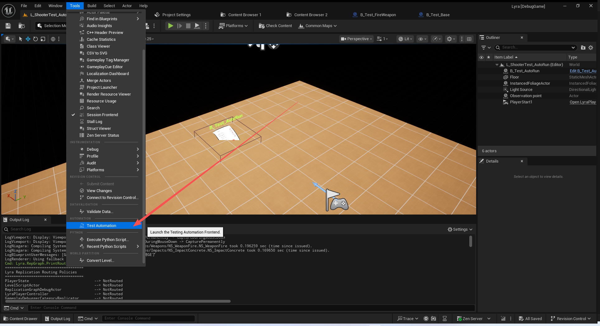
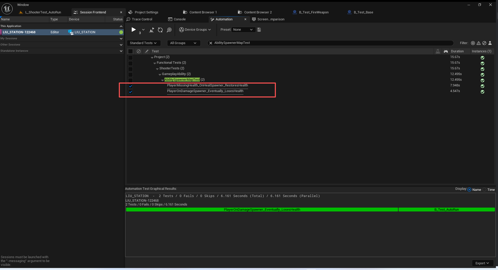
启动之后它会开一个小窗口运行测试!

这些蓝图的硬编码不再强调

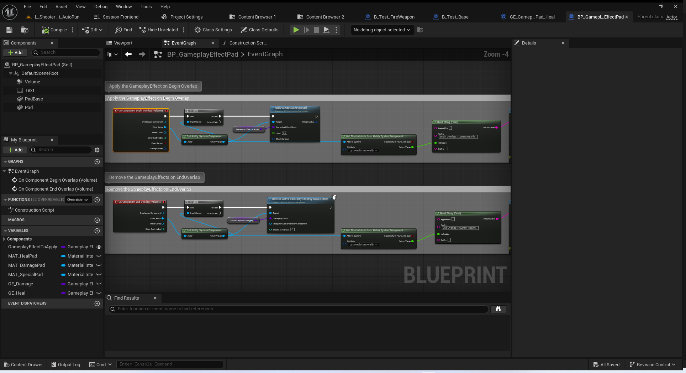
### 关联起来的宏
``` cpp
#define TEST_CLASS_WITH_FLAGS(_ClassName, _TestDir, _Flags) _TEST_CLASS_IMPL(_ClassName, _TestDir, TTest, FNoDiscardAsserter, _Flags)

```
``` cpp
#define _TEST_CLASS_IMPL(_ClassName, _TestDir, _BaseClass, _AsserterType, _TestFlags)                  \
		_TEST_CLASS_IMPL_EXT(_ClassName, _TestDir, _BaseClass, _AsserterType, _TestFlags, DefaultTags)


```
``` cpp
#define _TEST_CLASS_IMPL_EXT(_ClassName, _TestDir, _BaseClass, _AsserterType, _TestFlags, _TestTags)                                              \
	struct _ClassName;                                                                                                                            \
	struct F##_ClassName##_Runner : public TTestRunner<_AsserterType>                                                                             \
	{                                                                                                                                             \
		F##_ClassName##_Runner()                                                                                                                  \
			: TTestRunner(#_ClassName, __LINE__, __FILE__, _TestDir, _TestFlags, TTest<_ClassName, _AsserterType>::CreateTestClass, _TestTags) {  \
				static_assert(  !!((_TestFlags) & EAutomationTestFlags_ApplicationContextMask),                                                   \
								"CQTest has no application flag and will not run. See AutomationTest.h.");                                        \
				static_assert(  !!(((_TestFlags) & EAutomationTestFlags_FilterMask) == EAutomationTestFlags::SmokeFilter) ||                      \
								!!(((_TestFlags) & EAutomationTestFlags_FilterMask) == EAutomationTestFlags::EngineFilter) ||                     \
								!!(((_TestFlags) & EAutomationTestFlags_FilterMask) == EAutomationTestFlags::ProductFilter) ||                    \
								!!(((_TestFlags) & EAutomationTestFlags_FilterMask) == EAutomationTestFlags::PerfFilter) ||                       \
								!!(((_TestFlags) & EAutomationTestFlags_FilterMask) == EAutomationTestFlags::StressFilter) ||                     \
								!!(((_TestFlags) & EAutomationTestFlags_FilterMask) == EAutomationTestFlags::NegativeFilter),                     \
								"All CQTests must have exactly 1 filter type specified. See AutomationTest.h.");                                  \
		}                                                                                                                                         \
	};                                                                                                                                            \
	F##_ClassName##_Runner _ClassName##_RunnerInstance;                                                                                           \
	struct _ClassName : public _BaseClass<_ClassName, _AsserterType>

```
## 开火测试
/ShooterTests/Blueprint/B_Test_FireWeapon.B_Test_FireWeapon
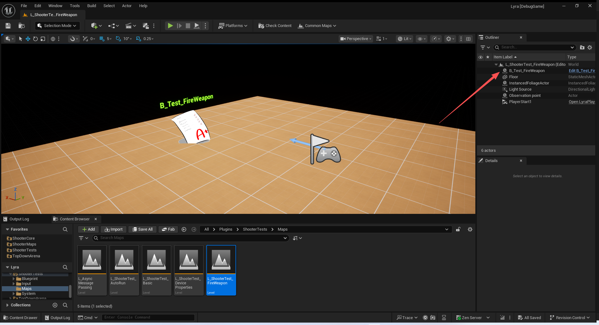

就是启动一个小窗口开火
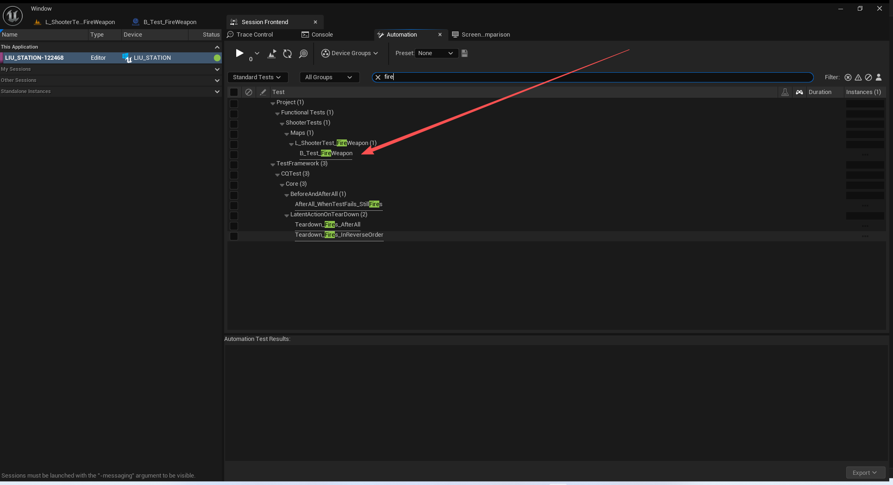
## 自动跑
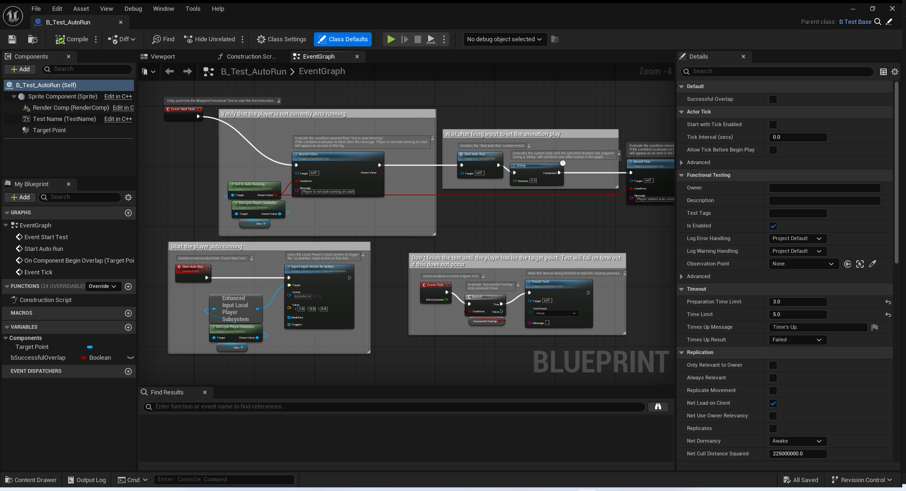
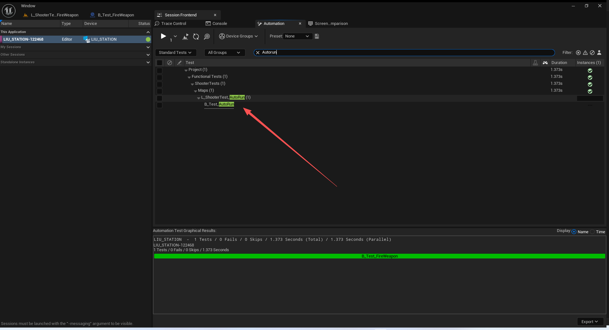
## 设备属性测试
``` cpp
/** This tester will apply device properties to a Player Controller on overlap, and remove them once overlap ends. */
/** 此测试程序会在设备与玩家控制器发生重叠时将其设备属性应用到玩家控制器上，并在重叠结束时移除这些设备属性。*/
UCLASS(Blueprintable, BlueprintType)
class AShooterTestsDevicePropertyTester : public AActor
{
	GENERATED_BODY()

public:

	AShooterTestsDevicePropertyTester();

	/** Device properties to apply on overlap with a player controller. */
	/** 用于在与玩家控制器重叠时应用的设备属性。*/
	UPROPERTY(EditAnywhere, Category = "Device Property")
	TArray<TSubclassOf<UInputDeviceProperty>> DeviceProperties;

	/** The volume that will trigger device properties to be added and removed on overlap */
	// 碰撞胶囊体
	UPROPERTY(EditDefaultsOnly, BlueprintReadOnly, Category = "Device Property")
	TObjectPtr<UCapsuleComponent> CollisionVolume;

	/** A little mesh to make this collision volume visible */
	// 网格
	UPROPERTY(EditDefaultsOnly, BlueprintReadOnly, Category = "Device Property")
	TObjectPtr<UStaticMeshComponent> PlatformMesh;

	UFUNCTION(BlueprintCallable, Category = "Device Property")
	void ApplyDeviceProperties(const FPlatformUserId UserId);

	UFUNCTION(BlueprintCallable, Category = "Device Property")
	void RemoveDeviceProperties();

private:

	UFUNCTION()
	void OnOverlapBegin(UPrimitiveComponent* OverlappedComponent, AActor* OtherActor, UPrimitiveComponent* OtherComp, int32 OtherBodyIndex, bool bFromSweep, const FHitResult& SweepHitResult);

	UFUNCTION()
	void OnEndOverlap(UPrimitiveComponent* OverlappedComponent, AActor* OtherActor, UPrimitiveComponent* OtherComp, int32 OtherBodyIndex);

	UPROPERTY(Transient)
	TSet<FInputDevicePropertyHandle> ActivePropertyHandles;
};
```
``` cpp
AShooterTestsDevicePropertyTester::AShooterTestsDevicePropertyTester()
{
	RootComponent = CollisionVolume = CreateDefaultSubobject<UCapsuleComponent>(TEXT("CollisionVolume"));
	CollisionVolume->InitCapsuleSize(80.f, 80.f);
	CollisionVolume->OnComponentBeginOverlap.AddDynamic(this, &AShooterTestsDevicePropertyTester::OnOverlapBegin);
	CollisionVolume->OnComponentEndOverlap.AddDynamic(this, &AShooterTestsDevicePropertyTester::OnEndOverlap);

	PlatformMesh = CreateDefaultSubobject<UStaticMeshComponent>(TEXT("PlatformMesh"));
	PlatformMesh->SetupAttachment(RootComponent);
}

void AShooterTestsDevicePropertyTester::OnOverlapBegin(UPrimitiveComponent* OverlappedComponent, AActor* OtherActor, UPrimitiveComponent* OtherComp, int32 OtherBodyIndex, bool bFromSweep, const FHitResult& SweepHitResult)
{
	if (const APawn* Pawn = Cast<APawn>(OtherActor))
	{
		ApplyDeviceProperties(Pawn->GetPlatformUserId());
	}
}

void AShooterTestsDevicePropertyTester::OnEndOverlap(UPrimitiveComponent* OverlappedComponent, AActor* OtherActor, UPrimitiveComponent* OtherComp, int32 OtherBodyIndex)
{
	if (const APawn* Character = Cast<APawn>(OtherActor))
	{
		RemoveDeviceProperties();
	}
}

void AShooterTestsDevicePropertyTester::ApplyDeviceProperties(const FPlatformUserId UserId)
{
	if (!UserId.IsValid())
	{
		UE_LOG(LogShooterTestDeviceProperty, Error, TEXT("Cannot apply device properties to an invalid Platform User!"));
		return;
	}

	if (UInputDeviceSubsystem* System = UInputDeviceSubsystem::Get())
	{
		FActivateDevicePropertyParams Params = {};
		Params.UserId = UserId;
		
		for (TSubclassOf<UInputDeviceProperty> DevicePropClass : DeviceProperties)
		{
			ActivePropertyHandles.Emplace(System->ActivateDevicePropertyOfClass(DevicePropClass, Params));			
		}
	}
}

void AShooterTestsDevicePropertyTester::RemoveDeviceProperties()
{
	// Remove any device properties that have been applied
	if (UInputDeviceSubsystem* InputDeviceSubsystem = UInputDeviceSubsystem::Get())
	{
		InputDeviceSubsystem->RemoveDevicePropertyHandles(ActivePropertyHandles);
	}
	
	ActivePropertyHandles.Empty();
}
```
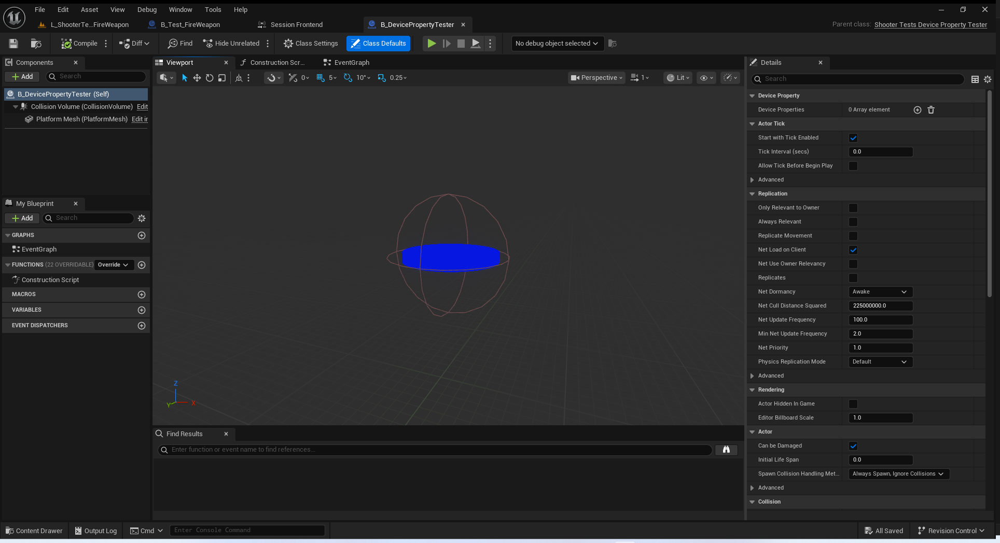
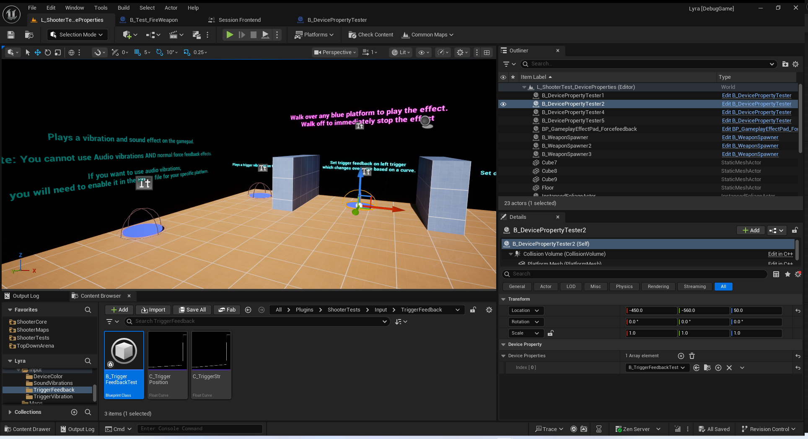
我测试了一下 只有右边那个震动圆圈走过去 效果很明显.
其他无明显效果.这个应该是不同手柄,设备等适配有关

## 参考文献
[运行自动化测试](https://dev.epicgames.com/documentation/zh-cn/unreal-engine/run-automation-tests-in-unreal-engine)

## 用于测试动画的工具类
### 输入模拟
``` cpp

/**
 * Input action to handle the Lyra player's crouch action.
 * 
 * @note Crouching is handled by a button press which is a boolean value.
 */
/**
* 处理莱拉玩家蹲下动作的输入操作。*
* 注意：蹲伏功能是通过按下按钮来实现的，该操作由一个布尔值控制。*/
struct FToggleCrouchTestAction : public FTestAction
{
	FToggleCrouchTestAction()
	{
		InputActionName = TEXT("IA_Crouch");
		InputActionValue = FInputActionValue(true);
	}
};

/**
 * Input action to handle the Lyra player's melee action.
 *
 * @note Melee is handled by a button press which is a boolean value.
 */
/**
* 处理莱拉玩家近战动作的输入操作。*
* 注意：近战攻击通过按下按钮来实现，该操作是以布尔值的形式进行的。*/
struct FMeleeTestAction : public FTestAction
{
	FMeleeTestAction()
	{
		InputActionName = TEXT("IA_Melee");
		InputActionValue = FInputActionValue(true);
	}
};

/**
 * Input action to handle the Lyra player's jump action.
 *
 * @note Jump is handled by a button press which is a boolean value.
 */
/**
* 处理莱拉玩家跳跃动作的输入操作。*
* @注意 跳跃功能由按下按钮来实现，该操作是以布尔值形式表示的。*/
struct FJumpTestAction : public FTestAction
{
	FJumpTestAction()
	{
		InputActionName = TEXT("IA_Jump");
		InputActionValue = FInputActionValue(true);
	}
};

/**
 * Base input action to handle the Lyra player's movement.
 *
 * @note Movement is setup as a 2D axis with the X-axis handling strafing and the Y-axis handling moving forward/backward.
 * @note Derived objects below will handle movement direction along a particular axis
 */
/**
* 基础输入操作，用于控制莱拉玩家的移动。*
* @注意：移动功能被设定为二维坐标系统，其中 X 轴负责侧翼移动，Y 轴负责前后移动。
* @注意：以下派生对象将根据特定的坐标轴来处理移动方向。*/
struct FMoveTestAction : public FTestAction
{
	FMoveTestAction(const FInputActionValue& InInputActionValue)
	{
		InputActionName = TEXT("IA_Move");
		InputActionValue = InInputActionValue;
	}
};

/**
 * Base input action to handle the Lyra player's look (rotation).
 *
 * @note Rotation is setup as a 2D axis
 * @note Derived objects below will handle rotation along a particular axis
 */
/**
* 基础输入操作，用于控制莱拉玩家的视角（旋转）。*
* @注意 旋转设置为二维轴向
* @注意 以下生成的对象将根据特定轴进行旋转处理*/
struct FLookTestAction : public FTestAction
{
	FLookTestAction(const FInputActionValue& InInputActionValue)
	{
		InputActionName = TEXT("IA_Look_Mouse");
		InputActionValue = InInputActionValue;
	}
};

/** Movement input action to move the Lyra player forward. */
/** 用于使莉拉角色向前移动的动作输入操作。*/
struct FMoveForwardTestAction : public FMoveTestAction
{
	FMoveForwardTestAction() : FMoveTestAction(FVector2D(0.0f, 1.0f))
	{
	}
};

/** Movement input action to move the Lyra player backward. */
/** 用于使莉拉角色向后移动的动作输入操作。*/
struct FMoveBackwardTestAction : public FMoveTestAction
{
	FMoveBackwardTestAction() : FMoveTestAction(FVector2D(0.0f, -1.0f))
	{
	}
};

/** Movement input action to strafe the Lyra player to the left. */
/** 用于使莉拉玩家向左移动的动作输入操作。*/
struct FStrafeLeftTestAction : public FMoveTestAction
{
	FStrafeLeftTestAction() : FMoveTestAction(FVector2D(-1.0f, 0.0f))
	{
	}
};

/** Movement input action to strafe the Lyra player to the right. */
/** 用于使莉拉玩家向右移动的动作输入操作。*/
struct FStrafeRightTestAction : public FMoveTestAction
{
	FStrafeRightTestAction() : FMoveTestAction(FVector2D(1.0f, 0.0f))
	{
	}
};

/** Rotation input action to rotate the Lyra player to the left. */
/** 旋转输入操作，用于将莉拉玩家向左旋转。*/
struct FRotateLeftTestAction : public FLookTestAction
{
	FRotateLeftTestAction() : FLookTestAction(FVector2D(-1.0f, 0.0f))
	{
	}
};

/** Rotation input action to rotate the Lyra player to the right. */
/** 旋转输入操作，用于将莉拉玩家向右旋转。*/
struct FRotateRightTestAction : public FLookTestAction
{
	FRotateRightTestAction() : FLookTestAction(FVector2D(1.0f, 0.0f))
	{
	}
};

/**
 * Inherited InputTestAction used for testing our button and axis interactions for the Lyra player.
 * 
 * @see FInputTestActions
 */
/**
* 采用了“输入测试动作”这一功能，用于测试莱拉播放器中的按钮和轴的交互操作。*
* @见 FInputTestActions*/
class FShooterTestsPawnTestActions : public FInputTestActions
{
public:
	/**
	 * Construct our Input actions object.
	 * 
	 * @param Pawn - Pawn which will have the input actions applied against.
	 */
	/**
	* 构建我们的输入操作对象。*
	* @参数：Pawn（兵） - 将会接受输入操作作用的对象。*/
	explicit FShooterTestsPawnTestActions(APawn* Pawn) : FInputTestActions(Pawn)
	{
	}

	/** Simulate a button press for our crouch action. */
	/** 模拟我们蹲下动作时的按钮按下操作。*/
	void ToggleCrouch();

	/** Simulate a button press for our melee action. */
	/** 模拟我们近战动作中的按钮按下操作。*/
	void PerformMelee();

	/** Simulate a button press for our jump action. */
	/** 模拟我们跳跃动作时的按钮按下操作。*/
	void PerformJump();

	/** Simulates player movement input actions. */
	/** 模拟玩家移动操作输入动作。*/
	void MoveForward();
	void MoveBackward();

	/** Simulates player strafing input actions. */
	/** 模拟玩家的侧翼移动输入操作。*/
	void StrafeLeft();
	void StrafeRight();

	/** Simulates player look/rotation input actions. */
	/** 模拟玩家的视角/旋转操作动作。*/
	void RotateLeft();
	void RotateRight();

private:
	/** Method to perform any of our axis based actions over the span of 5 seconds. */
	/** 用于在 5 秒钟内执行我们基于轴的任何操作的方法。*/
	void PerformAxisAction(TFunction<void(const APawn* Pawn)> Action);
};
```
### 对象操作
``` cpp

/// Class which consolidates the Lyra Actor information that is shared amongst tests.
/// /// 该类整合了在测试中共享的莱拉（Lyra）演员信息。
class FShooterTestsActorTestHelper
{
public:
	/**
	* Construct the Actor Test Helper object
	* 
	* @param Pawn - Pointer to a Pawn
	*/
	/**
	* 构建“演员测试助手”对象*
	* @参数：Pawn - 指向一个“兵”的指针*/
	explicit FShooterTestsActorTestHelper(APawn* Pawn);

	/**
	* Checks to see if the current actor is fully spawned in the level and ready to be used.
	* 
	* @return true is the player is spawned and usable, otherwise false
	*/
	/**
	检查当前角色是否已在关卡中完全生成并准备好使用。*
	* @返回值：如果玩家已生成且可用则返回 true，否则返回 false*/
	bool IsPawnFullySpawned();

	/**
	* Gets the Lyra character which was associated with the Pawn used during the construction of the object.
	*
	* @return constant pointer to the LyraCharacter
	*/
	/**
	获取与所构建对象中使用的棋子相关联的莱拉角色。*
	* @返回指向 LyraCharacter 的常量指针*/
	const ALyraCharacter* GetLyraCharacter() const { return LyraCharacter; }
	
	/**
	* Gets the skeletal mesh component of the associated Lyra Character.
	*
	* @return pointer to the SkeletalMeshComponent
	*/
	/**
	获取与该莉拉角色关联的骨骼网格组件。*
	* @返回指向骨骼网格组件的指针*/
	USkeletalMeshComponent* GetSkeletalMeshComponent() const { return SkeletalMeshComponent; }

private:
	/** Reference to our player in the level. */
	/** 指向游戏关卡中我方玩家的引用。*/
	ALyraCharacter* LyraCharacter{ nullptr };

	/** Reference to the player's skeletal mesh component. */
	/** 指向玩家骨骼网格组件的引用。*/
	USkeletalMeshComponent* SkeletalMeshComponent;

	/** Reference to the player's ability system component. */
	/** 指向玩家能力系统组件的引用。*/
	ULyraAbilitySystemComponent* AbilitySystemComponent{ nullptr };

	/** Reference to the player's spawning gameplay effect. */
	/** 指向玩家生成游戏效果的引用。*/
	FGameplayTag GameplayCueCharacterSpawnTag;
};

/**
 * Inherited from FShooterTestsActorTestHelper, adds FShooterTestsPawnTestActions to be used for interacting with the Lyra player and triggering animations.
 *
 * @see FShooterTestsActorTestHelper
 */
/**
* 从 FShooterTestsActorTestHelper 中继承而来，添加了 FShooterTestsPawnTestActions，用于与莉拉角色进行交互并触发动画。*
* @参见 FShooterTestsActorTestHelper*/
class FShooterTestsActorInputTestHelper : public FShooterTestsActorTestHelper
{
public:
	/** Defines the available input actions that can be performed. */
	/** 定义了可以执行的可用输入操作。*/
	enum class InputActionType : uint8_t
	{
		Crouch,
		Melee,
		Jump,
		MoveForward,
		MoveBackward,
		StrafeLeft,
		StrafeRight,
	};

	explicit FShooterTestsActorInputTestHelper(APawn* Pawn);

	/** 
	* Simulates input triggers on the Lyra character.
	* 
	* @param Type - InputActionType used to specify which input to perform.
	*/
	/**
	模拟了莉拉角色的输入触发动作。*
	* @参数 Type - 用于指定要执行的输入操作的输入动作类型。*/
	void PerformInput(InputActionType Type);

	/**
	* Stops all actively running inputs.
	*/
	/**
	* 停止所有正在运行的输入操作。*/
	void StopAllInput();

private:
	/** Object which handles interfacing with the Enhanced Input System to perform input actions. */
	/** 该对象负责与增强型输入系统进行交互，以执行输入操作。*/
	TUniquePtr<FShooterTestsPawnTestActions> PawnActions;
};
```
## 单机测测试动画
### 关联的宏
``` cpp
/** Macro to quickly create tests based on the above test object. */
/** 用于快速根据上述测试对象创建测试的宏。*/
#define ACTOR_ANIMATION_TEST(_ClassName, _TestDir) TEST_CLASS_WITH_BASE(_ClassName, _TestDir, ShooterTestsActorAnimationTest)

/** Macro to quickly create tests based on the above test object with custom flags. */
/** 用于快速根据上述测试对象创建带有自定义标志的测试的宏。*/
#define ACTOR_ANIMATION_TEST_WITH_FLAGS(_ClassName, _TestDir, _Flags) TEST_CLASS_WITH_BASE_AND_FLAGS(_ClassName, _TestDir, ShooterTestsActorAnimationTest, _Flags)

```
### 测试类定义
``` cpp
/**
 * Implementation of our base class used to share functionality of sharing a Pawn and a level for tests.
 * Inherits from `TTest<Derived, AsserterType>` to provide us our testing functionality.
 *
 * Implements functionality to load a level, specified as parameters in the Constructor, and verifies that the Player is completely spawned within the game world during the `Setup`
 *
 * Makes use of the `TestCommandBuilder` to queue up latent commands to be executed on every Tick of the Engine/Editor
 * `Then` steps will execute within a single tick
 * 'StartWhen` and `Until` steps will keep executing each tick until the predicate has evaluated to true or the timeout period has elapsed. The latter will fail the test.
 */
/**
* 我们的基类的实现用于共享用于测试的兵和关卡的功能。
* 从 `TTest<Derived, AsserterType>` 类继承，以为我们提供测试功能。*
* 实现了加载关卡的功能，该功能通过构造函数中的参数来指定，并在“设置”阶段验证玩家是否已完全在游戏世界中生成。*
* 利用“测试命令构建器”来将潜在命令排队，以便在引擎/编辑器的每个时钟周期内执行这些命令
* “然后”步骤将在单个时钟周期内执行
* “在何时开始”和“直到”步骤会持续在每个时钟周期内执行，直到谓词的评估结果为真或者超时时间已过。后者会导致测试失败。*/
template<typename Derived, typename AsserterType>
struct ShooterTestsActorBaseTest : public TTest<Derived, AsserterType>
{
	/** Let this object know about our templated parent's variables */
	/** 让此对象知晓我们模板化父类的变量信息 */
	using TTest<Derived, AsserterType>::TestRunner;
	using TTest<Derived, AsserterType>::Assert;
	using TTest<Derived, AsserterType>::TestCommandBuilder;

	/**
	 * Construct the Base Actor Test.
	 *
	 * @param MapName - Name of the map.
	 */
	/**
	构建基础角色测试。*
	* @参数 MapName - 地图的名称。*/
	ShooterTestsActorBaseTest(const FString& MapName)
	{
		// Don't load assets during initialization
		if (TestRunner->bInitializing)
		{
			return;
		}
		
		TOptional<FString> PackagePath = CQTestAssetHelper::FindAssetPackagePathByName(MapName);
		ASSERT_THAT(IsTrue(PackagePath.IsSet(), "Could not find the map package."));
		Spawner = MakeUnique<FMapTestSpawner>(PackagePath.GetValue(), MapName);
	}

	/**
	 * Check to make sure that the specified world has fully loaded.
	 *
	 * @return true if the world is fully loaded.
	 * 
	 * @note Method is expected to be used within the `Until` latent command to then wait until the world has loaded.
	 */
	/**
	请确认指定的世界已完全加载完毕。*
	* @返回值：若世界已完全加载，则返回 true 。*
	* @注意：此方法应在“直到”隐式命令中使用，以便在世界加载完成后再进行等待。*/
	bool HasWorldLoaded()
	{
		UWorld& World = Spawner->GetWorld();
		AGameStateBase* GameState = World.GetGameState();
		if (GameState == nullptr)
		{
			return false;
		}

		ULyraExperienceManagerComponent* ExperienceComponent = GameState->FindComponentByClass<ULyraExperienceManagerComponent>();
		if (ExperienceComponent == nullptr)
		{
			return false;
		}

		return ExperienceComponent->IsExperienceLoaded();
	}

	/** Get our Lyra Player Pawn and all associated systems and functionality needed for our Player. */
	/** 获取我们的莱拉玩家角色以及与之相关的所有系统和功能，以满足玩家的需求。*/
	virtual void PreparePlayerPawn()
	{
		Player = Cast<ALyraCharacter>(Spawner->FindFirstPlayerPawn());
		ASSERT_THAT(IsNotNull(Player));

		AbilitySystemComponent = Player->GetLyraAbilitySystemComponent();
		ASSERT_THAT(IsNotNull(AbilitySystemComponent));

		GameplayCueCharacterSpawnTag = FGameplayTag::RequestGameplayTag(TEXT("GameplayCue.Character.Spawn"), false);
		ASSERT_THAT(IsTrue(GameplayCueCharacterSpawnTag.IsValid()));
	}

	/**
	 * Functionality used to check if the Player is fully spawned into the game world.
	 * 
	 * @return true if the GameplayEffect 'GE_SpawnIn' is no longer active as this effect blocks player input.
	 */
	/**
	/**
* 用于检查玩家是否已完全进入游戏世界的功能。*
* 如果游戏效果“GE_SpawnIn”不再处于激活状态（因为该效果会阻止玩家操作），则返回 true 。*/
	virtual bool IsPlayerPawnFullySpawned()
	{
		bool bIsCurrentlySpawning = AbilitySystemComponent->IsGameplayCueActive(GameplayCueCharacterSpawnTag);
		return !bIsCurrentlySpawning;
	}

	/** Setup the test by loading in the specified level and making sure that the Lyra player is fully spawned in before continuing. */
	/** 通过加载指定关卡并确保 Lyra 角色完全生成后再继续进行测试的设置操作。*/
	virtual void Setup() override
	{
		ASSERT_THAT(IsNotNull(Spawner));
		Spawner->AddWaitUntilLoadedCommand(TestRunner);

		const FTimespan LoadingScreenTimeout = FTimespan::FromSeconds(30);
		TestCommandBuilder
			.StartWhen([this]() { return HasWorldLoaded(); }, LoadingScreenTimeout)
			.Until([this]() { return nullptr != Spawner->FindFirstPlayerPawn(); })
			.Then([this]() { PreparePlayerPawn(); })
			.Until([this]() { return IsPlayerPawnFullySpawned(); });
	}

	/** Reference to our player in the level. */
	/** 指向游戏关卡中我方玩家的引用。*/
	ALyraCharacter* Player{ nullptr };

	/** Object to handle loading of our desired level. */
	/** 用于处理加载我们所期望关卡的对象。*/
	TUniquePtr<FMapTestSpawner> Spawner{ nullptr };

	/** Reference to the player's ability system component. */
	/** 指向玩家能力系统组件的引用。*/
	ULyraAbilitySystemComponent* AbilitySystemComponent{ nullptr };

	/** Reference to the player's spawning gameplay effect. */
	/** 指向玩家生成游戏效果的引用。*/
	FGameplayTag GameplayCueCharacterSpawnTag;
};

/**
 * Implementation of our base class used to share functionality of sharing a Pawn and a level for tests.
 * Inherits from `ShooterTestsActorBaseTest<Derived, AsserterType>` to provide us our testing functionality and to handle our initial World setup.
 *
 * Apart from loading our level and Player from the base `ShooterTestsActorBaseTest` object, will fetch the Player's SkeletalMesh component and sets up the FShooterTestsPawnTestActions object for input handling.
 * The SkeletalMesh component is what handles animations for the Player and is used to query against for active animations
 * FShooterTestsPawnTestActions is a user-defined input handling object which derives from CQTest's `FInputTestActions` in order to specify Input Actions around what is available to our Player.
 *
 * Makes use of the `TestCommandBuilder` to queue up latent commands to be executed on every Tick of the Engine/Editor
 * `Do` steps will execute within a single tick
 * `Until` steps will keep executing each tick until the predicate has evaluated to true or the timeout period has elapsed. The latter will fail the test.
 */

/**
* 我们的基类的实现用于共享用于测试的兵和关卡的功能。
* 继承自 `ShooterTestsActorBaseTest<Derived, AsserterType>` 以为我们提供测试功能，并处理我们的初始世界设置。*
* 除了从基础的“ShooterTestsActorBaseTest”对象中加载我们的关卡和玩家外，还将获取玩家的骨骼网格组件，并为输入处理设置 FShooterTestsPawnTestActions 对象。
* 骨骼网格组件负责处理玩家的动画，并用于查询当前正在播放的动画。
* FShooterTestsPawnTestActions 是一个用户自定义的输入处理对象，它继承自 CQTest 的“FInputTestActions”，以便指定玩家可用的输入操作。*
* 利用“测试命令构建器”来将潜在的命令排队，以便在引擎/编辑器的每个时钟周期中执行这些命令
* “执行”步骤将在单个时钟周期内执行
* “直到”步骤将在每个时钟周期内持续执行，直到谓词的评估结果为真或者超时时间已过。后者会导致测试失败。*/
template<typename Derived, typename AsserterType>
struct ShooterTestsActorAnimationTest : public ShooterTestsActorBaseTest<Derived, AsserterType>
{
	/** Let this object know about our templated parent's variables */
	/** 让此对象知晓我们模板化父类的变量信息 */
	using ShooterTestsActorBaseTest<Derived, AsserterType>::Assert;
	using ShooterTestsActorBaseTest<Derived, AsserterType>::TestCommandBuilder;
	using ShooterTestsActorBaseTest<Derived, AsserterType>::Player;

	/**
	 * Construct the Actor Animation Test.
	 *
	 * @param MapName - Name of the map.
	 */
	/**
	* 构建角色动画测试。*
	* @参数 MapName - 地图的名称。*/
	ShooterTestsActorAnimationTest(const FString& MapName) : ShooterTestsActorBaseTest<Derived, AsserterType>(MapName) { }

	/**
	 * Calls the parent method to get our Lyra Player Pawn and all associated systems and functionality needed for our Player before setting up functionality needed for input handling and animations.
	 * 
	 * @see ShooterTestsActorBaseTest<Derived, AsserterType>::PreparePlayerPawn()
	 */
	/**
	调用父类方法以获取我们的莱拉播放器兵角色以及与之相关的所有系统和功能，这些是玩家所需的一切，然后再设置处理输入和动画所需的功能。*
	* @见 ShooterTestsActorBaseTest<Derived, AsserterType> 的 PreparePlayerPawn() 方法*/
	void PreparePlayerPawn() override
	{
		ShooterTestsActorBaseTest<Derived, AsserterType>::PreparePlayerPawn();
		ASSERT_THAT(IsTrue(IsValid(Player), TEXT("Player Pawn has not been set")));

		PawnActions = MakeUnique<FShooterTestsPawnTestActions>(Player);

		UActorComponent* ActorComponent = Player->GetComponentByClass(USkeletalMeshComponent::StaticClass());
		ASSERT_THAT(IsTrue(IsValid(ActorComponent), TEXT("Cannot find SkeletalMeshComponent from Player")));

		PlayerMesh = Cast<USkeletalMeshComponent>(ActorComponent);
		ASSERT_THAT(IsTrue(IsValid(PlayerMesh), TEXT("Cannot cast component to SkeletalMeshComponent")));
	}

	/**
	 * Get our expected animation to test against.
	 * @note Will assert if the animation cannot be found within the SkeletalMesh
	 */
	/**
	* 获取我们预期的动画以进行测试。
	* @注意：如果在骨骼网格中找不到该动画，则会引发错误。*/
	void GetExpectedAnimation(const FString& AnimationName)
	{
		ExpectedAnimation = AnimationTestHelper.FindAnimationAsset(PlayerMesh, AnimationName);
		ASSERT_THAT(IsTrue(IsValid(ExpectedAnimation), FString::Format(TEXT("Cannot find animation '{0}'"), { AnimationName })));
	}

	/**
	 * Tests to see if the expected animation is playing after performing our InputAction.
	 *
	 * @param AnimationName - Name of the animation asset to test against.
	 * @param InputAction - Function of the Input actions to run which will trigger the animation.
	 */
	/**
	* 通过执行我们的“输入操作”来测试预期的动画是否正在播放。*
	* @参数 AnimationName - 需要测试的动画资源的名称。
	* @参数 InputAction - 将会触发该动画的输入操作的执行函数。*/
	void TestInputActionAnimation(const FString& AnimationName, TFunction<void()> InputAction)
	{
		GetExpectedAnimation(AnimationName);
		TestCommandBuilder
			.Do(InputAction)
			.Until([this]() { return AnimationTestHelper.IsAnimationPlaying(PlayerMesh, ExpectedAnimation); });
	}

	/** Animation helper object. */
	/** 动画辅助对象。*/
	FShooterTestsAnimationTestHelper AnimationTestHelper;

	/** Reference to the player's skeletal mesh component. */
	/** 指向玩家骨骼网格组件的引用。*/
	USkeletalMeshComponent* PlayerMesh{ nullptr };

	/** Reference to our animation asset. */
	/** 指向我们动画资源的引用。*/
	UAnimationAsset* ExpectedAnimation{ nullptr };

	/** Object which performs input actions. */
	/** 执行输入操作的对象。*/
	TUniquePtr<FShooterTestsPawnTestActions> PawnActions{ nullptr };
};
```

### 蹲伏动画测试
``` cpp
/**
 * Creates a standalone test object using the name from the first parameter, in the case `InputCrouchAnimationTest`, which inherits from `ShooterTestsActorAnimationTest<Derived, AsserterType>` to provide us our testing functionality.
 * The second parameter specifies the category and subcategories used for displaying within the UI
 * 
 * Note that this test uses the ACTOR_ANIMATION_TEST macro, which is defined in `/Utilities/ShooterTestsActorTest.h`, to inherit from a base class with user-defined variables and methods. Reference that document for more information.
 *
 * The test object will test animation playback during specific inputs while crouched. All variables are reset after each test iteration.
 * 
 * The test makes use of the `TestCommandBuilder` to queue up latent commands to be executed on every Tick of the Engine/Editor
 * `Do` and `Then` steps will execute within a single tick
 * `Until` steps will keep executing each tick until the predicate has evaluated to true or the timeout period has elapsed. The latter will fail the test.
 *
 * Each TEST_METHOD will register with the `InputCrouchAnimationTest` test object and has the variables and methods from `InputCrouchAnimationTest` available for use.
 */
/**
* 使用第一个参数中的名称创建一个独立的测试对象，例如对于“InputCrouchAnimationTest”这样的名称，它继承自“ShooterTestsActorAnimationTest<Derived， AsserterType>”，从而为我们提供了测试功能。
* 第二个参数指定了在用户界面中显示的类别和子类别。*
请注意，此测试使用了“ACTOR_ANIMATION_TEST”宏，该宏定义于“/Utilities/ShooterTestsActorTest.h”文件中。它通过继承具有用户自定义变量和方法的基类来实现功能。如需了解更多详情，请参考该文档。*
该测试对象将在蹲伏状态下针对特定输入进行动画播放测试。每次测试迭代结束后，所有变量都会被重置。*
该测试利用“测试命令构建器”来将潜在命令排队，以便在引擎/编辑器的每一帧中执行这些命令。
“执行”和“然后”步骤将在单个帧内执行。
“直到”步骤会持续在每一帧中执行，直到谓词的评估结果为真或者超时时间已过。后者会导致测试失败。*
每个 TEST_METHOD 都会与 `InputCrouchAnimationTest` 测试对象进行注册，并且能够使用 `InputCrouchAnimationTest` 中的变量和方法。*/
ACTOR_ANIMATION_TEST(InputCrouchAnimationTest, "Project.Functional Tests.ShooterTests.Actor.Animation")
{
	// Make a call to our base Constructor to set the name of the level to load
	// 调用我们的基类构造函数，以设置要加载的关卡的名称
	InputCrouchAnimationTest() : ShooterTestsActorAnimationTest(TEXT("L_ShooterTest_Basic"))
	{
	}
	
	/**
	 * Run before each TEST_METHOD to load our level, initialize our Player, and Player components needed for the tests before to execute successfully.
	 * The test also makes sure that the Player is playing a crouching idle animation after toggling the Player's crouched state.
	 * If an ASSERT_THAT fails at any point, the TEST_METHODS will also fail as this means that our test prerequisites were not setup
	 * 
	 * Note that because we're derived from a user-defined base class, that we will also call our base `Setup`. It's importanrt to know that `BEFORE_EACH` is a macro that wraps around `virtual void Setup() override`
	 */
	/**
	* 在每个 TEST_METHOD 之前都要先运行一次以加载我们的关卡、初始化我们的玩家以及测试所需的玩家组件，这样测试才能成功执行。
	* 此外，该测试还会确保在切换玩家蹲伏状态后，玩家会播放蹲伏静止动画。
	* 如果在任何时刻 ASSERT_THAT 出现失败情况，那么 TEST_METHOD 也会一同失败，因为这意味着我们的测试前提条件没有设置好。*
	* 请注意，由于我们是基于用户自定义的基类派生而来的，因此我们也会调用我们的基类“Setup”。重要的是要知道“BEFORE_EACH”是一个宏，它环绕着“virtual void Setup() override”这一代码段。*/
	BEFORE_EACH()
	{
		ShooterTestsActorAnimationTest::Setup();

		TestCommandBuilder
			.Do([this]() { GetExpectedAnimation(FShooterTestsAnimationTestHelper::PistolCrouchIdleAnimationName); })
			.Then([this]() { PawnActions->ToggleCrouch(); })
			.Until([this]() { return AnimationTestHelper.IsAnimationPlaying(PlayerMesh, ExpectedAnimation); });
	}
	
	/**
	 * Each test is registered with the name of the type of movement being tested and checks both the expected animation and the input action used to trigger the animation
	 * Due to the nature of the test being the same with the exception of the animation name and the input action, we have a helper method implemented in from our base class being used
	 */
	/**
* 每次测试都会以所测试的动作类型名称进行登记，并且会同时检查预期的动画效果以及用于触发该动画的动作输入
* 由于该测试的性质与动画名称和动作输入不同之处仅存于细微之处，所以我们从基类中实现了一个辅助方法来加以使用。*/
	TEST_METHOD(PlayerCrouched_ForwardMovement)
	{
		TestInputActionAnimation(FShooterTestsAnimationTestHelper::PistolCrouchWalkForwardAnimationName, [this]() { PawnActions->MoveForward(); });
	}
	
	TEST_METHOD(PlayerCrouched_BackwardMovement)
	{
		TestInputActionAnimation(FShooterTestsAnimationTestHelper::PistolCrouchWalkBackwardAnimationName, [this]() { PawnActions->MoveBackward(); });
	}
	
	TEST_METHOD(PlayerCrouched_StrafeLeftMovement)
	{
		TestInputActionAnimation(FShooterTestsAnimationTestHelper::PistolCrouchStrafeLeftAnimationName, [this]() { PawnActions->StrafeLeft(); });
	}
	
	TEST_METHOD(PlayerCrouched_StrafeRightMovement)
	{
		TestInputActionAnimation(FShooterTestsAnimationTestHelper::PistolCrouchStrafeRightAnimationName, [this]() { PawnActions->StrafeRight(); });
	}
	
	TEST_METHOD(PlayerCrouched_RotateLeftMovement)
	{
		TestInputActionAnimation(FShooterTestsAnimationTestHelper::PistolCrouchRotateLeftAnimationName, [this]() { PawnActions->RotateLeft(); });
	}
	
	TEST_METHOD(PlayerCrouched_RotateRightMovement)
	{
		TestInputActionAnimation(FShooterTestsAnimationTestHelper::PistolCrouchRotateRightAnimationName, [this]() { PawnActions->RotateRight(); });
	}
};
```

### 武器动画测试
``` cpp

/**
 * Creates a standalone test object using the name from the first parameter, in the case `WeaponMeleeAnimationTest`, that inherits from `ShooterTestsActorAnimationTest<Derived, AsserterType>` to provide us our testing functionality.
 * The second parameter specifies the category and subcategories used for displaying within the UI
 * The third parameter specifies the flags as to what context the test will run in and the filter to be applied for the test to appear in the UI
 *
 * Note that this test uses the ACTOR_ANIMATION_TEST macro, which is defined in `/Utilities/ShooterTestsActorTest.h`, to inherit from a base class with user-defined variables and methods. Reference that document for more information.
 * This is a test which will be run in the Editor context as this test spawns objects based on Blueprints found on the local filesystem. Assets require to be cooked along the game to run in the game/client
 *
 * The test object will test spawning weapons for the Player to equip. Test will also verify that the proper melee animation is triggered for the respective input and equipped weapon. All variables are reset after each test iteration.
 * The test makes use of the `TestCommandBuilder` to queue up latent commands to be executed on every Tick of the Engine/Editor
 * `StartWhen` steps will keep executing each tick until the predicate has evaluated to true or the timeout period has elapsed. The latter will fail the test.
 *
 * Each TEST_METHOD will register with the `WeaponMeleeAnimationTest` test object and has the variables and methods from `WeaponMeleeAnimationTest` available for use.
 */
/**
* 使用第一个参数中的名称创建一个独立的测试对象，例如对于“WeaponMeleeAnimationTest”这样的名称，它继承自“ShooterTestsActorAnimationTest<Derived， AsserterType>”，从而为我们提供测试功能。
* 第二个参数指定了在用户界面中显示的类别和子类别。
* 第三个参数指定了测试将在何种上下文中运行以及用于使测试在用户界面中显示的过滤条件。*
* 请注意，此测试使用了“ACTOR_ANIMATION_TEST”宏，该宏定义于“/Utilities/ShooterTestsActorTest.h”文件中，用于从具有用户自定义变量和方法的基类中继承属性和方法。有关更多信息，请参考该文档。
* 这是一个将在编辑器环境中运行的测试，因为此测试会根据本地文件系统中找到的蓝图生成对象。要使资产能够在游戏中/客户端中运行，需要对其进行烘焙处理。*
* 测试对象将测试为玩家装备的武器生成情况。测试还将验证针对相应输入和已装备武器触发的适当近战动画是否正确。每次测试迭代结束后，所有变量都会被重置。
* 该测试利用“测试命令构建器”来排队待执行的潜在命令，这些命令将在引擎/编辑器的每次计时周期中执行。
* “开始当”步骤会持续在每个计时周期中执行，直到谓词的评估结果为真或超时时间已过。后者会导致测试失败。*
每个 TEST_METHOD 都会与 `WeaponMeleeAnimationTest` 测试对象进行注册，并且能够使用 `WeaponMeleeAnimationTest` 中的变量和方法。*/
ACTOR_ANIMATION_TEST_WITH_FLAGS(WeaponMeleeAnimationTest, "Project.Functional Tests.ShooterTests.Actor.Animation", EAutomationTestFlags::EditorContext | EAutomationTestFlags::ProductFilter)
{
	ALyraWeaponSpawner* WeaponSpawnerPad{ nullptr };

	// Make a call to our base Constructor to set the name of the level to load
	// 调用我们的基类构造函数，以设置要加载的关卡的名称
	WeaponMeleeAnimationTest() : ShooterTestsActorAnimationTest(TEXT("L_ShooterTest_Basic"))
	{
	}
	
	// Checks to see if the specified Weapon is currently equipped by the player
	// 检查指定的武器是否当前已被玩家装备
	bool IsCurrentlyEquippedWeapon(const FString& WeaponName)
	{
		if (ULyraEquipmentManagerComponent* EquipmentManager = Player->FindComponentByClass<ULyraEquipmentManagerComponent>())
		{
			if (ULyraWeaponInstance* WeaponInstance = EquipmentManager->GetFirstInstanceOfType<ULyraWeaponInstance>())
			{
				const bool bIsWeaponEquipped = IsValid(WeaponInstance) && IsValid(WeaponInstance->GetInstigator());
				return bIsWeaponEquipped && WeaponInstance->GetClass()->GetName().Equals(WeaponName);
			}
		}
	
		return false;
	}
	
	// Spawns the weapon pad with the appropriate weapon to be picked up by the Player
	// 启动武器垫，为其配备合适的武器，以便玩家能够拾取该武器
	void SpawnWeaponSpawnerPad(const FString& WeaponDataAsset)
	{
		// Generate our DataAsset filter used to find our weapon assets
		// 生成我们用于查找武器资产的数据资产过滤器
		FARFilter DataAssetFilter = CQTestAssetHelper::FAssetFilterBuilder()
			.WithClassPath(UDataAsset::StaticClass()->GetClassPathName())
			.IncludeRecursiveClasses()
			.Build();

		UClass* WeaponSpawnerPadBp = CQTestAssetHelper::GetBlueprintClass(TEXT("B_WeaponSpawner"));
		ASSERT_THAT(IsNotNull(WeaponSpawnerPadBp));

		UObject* WeaponData = CQTestAssetHelper::FindDataBlueprint(DataAssetFilter, WeaponDataAsset);
		ASSERT_THAT(IsNotNull(WeaponData));
		ULyraWeaponPickupDefinition* WeaponDefinition = Cast<ULyraWeaponPickupDefinition>(WeaponData);
		ASSERT_THAT(IsNotNull(WeaponDefinition));
	
		WeaponSpawnerPad = &TObjectBuilder<ALyraWeaponSpawner>(*Spawner, WeaponSpawnerPadBp)
			.SetParam("WeaponDefinition", WeaponDefinition)
			.Spawn(Player->GetTransform());
	
		ASSERT_THAT(IsNotNull(WeaponSpawnerPad));
	}

	// Waits until the weapon is spawned and equipped
	// 直至武器生成并被装备时才继续执行后续操作
	void EquipSpawnedWeapon(const FString& WeaponName)
	{
		FString WeaponDataAsset = FString::Printf(TEXT("WeaponPickupData_%s"), *WeaponName);
		FString EquippedWeaponInstanceName = FString::Printf(TEXT("B_WeaponInstance_%s_C"), *WeaponName);
		SpawnWeaponSpawnerPad(WeaponDataAsset);

		TestCommandBuilder
			.StartWhen([this, EquippedWeaponInstanceName = MoveTemp(EquippedWeaponInstanceName)]() { return IsCurrentlyEquippedWeapon(EquippedWeaponInstanceName); });
	}
	
	/**
	 * Each test is registered with the name of the type of movement being tested and checks both the expected animation and the input action used to trigger the animation
	 * Due to the nature of the test being the same with the exception of the animation name and the input action, we use helper methods to implement the steps
	 */
	/**
* 每次测试都会以所测试的动作类型名称进行登记，并且会同时检验预期的动画效果以及用于触发该动画的输入操作
* 由于该测试的性质与动画名称和输入操作不同之处仅有一点，所以我们使用辅助方法来实现这些步骤*/
	TEST_METHOD(WeaponMelee_Pistol)
	{
		EquipSpawnedWeapon(TEXT("Pistol"));
		TestInputActionAnimation(FShooterTestsAnimationTestHelper::PistolMeleeAnimationName, [this]() { PawnActions->PerformMelee(); });
	}
	
	TEST_METHOD(WeaponMelee_Rifle)
	{
		EquipSpawnedWeapon(TEXT("Rifle"));
		TestInputActionAnimation(FShooterTestsAnimationTestHelper::RifleMeleeAnimationName, [this]() { PawnActions->PerformMelee(); });
	}
	
	TEST_METHOD(WeaponMelee_Shotgun)
	{
		EquipSpawnedWeapon(TEXT("Shotgun"));
		TestInputActionAnimation(FShooterTestsAnimationTestHelper::ShotgunMeleeAnimationName, [this]() { PawnActions->PerformMelee(); });
	}
};
```

## 网络运动动画测试
``` cpp
/**
 * Creates a standalone test object using the name from the first parameter, in the case `InputAnimationTest`, which inherits from `ShooterTestsActorAnimationNetworkTest<Derived, AsserterType, FShooterTestsActorInputTestHelper>` to provide us our testing functionality.
 * The second parameter specifies the category and subcategories used for displaying within the UI
 *
 * Note that this test uses the ACTOR_ANIMATION_NETWORK_TEST macro, which is defined in `/Utilities/ShooterTestsNetworkTest.h`, to inherit from a base class with user-defined variables and methods. Reference that document for more information.
 *
 * The test object will test animation playback during specific inputs while in a networked session. All variables are reset after each test iteration.
 *
 * The test makes use of the `TestCommandBuilder` to queue up latent commands to be executed on every Tick of the Engine/Editor
 * Because of the nature of a network session having a server and client, the `FShooterTestsNetworkComponent` handles splitting up the commands between the Server and Client PIE sessions.
 * `ThenServer` and `ThenClient` steps will execute within a single tick on the server or client
 * `UntilServer` and `UntilClient` steps will keep executing each tick on the server or client until the predicate has evaluated to true or the timeout period has elapsed. The latter will fail the test.
 *
 * Each TEST_METHOD will register with the `InputAnimationTest` test object and has the variables and methods from `InputAnimationTest` available for use.
 */
/**
* 使用第一个参数中的名称创建一个独立的测试对象，例如对于“InputAnimationTest”这样的名称，它继承自“ShooterTestsActorAnimationNetworkTest<Derived, AsserterType, FShooterTestsActorInputTestHelper>”，从而为我们提供了测试功能。
* 第二个参数指定了在用户界面中显示的类别和子类别。*
请注意，此测试使用了“ACTOR_ANIMATION_NETWORK_TEST”宏，该宏定义于“/Utilities/ShooterTestsNetworkTest.h”文件中。它通过继承具有用户自定义变量和方法的基类来实现这一功能。如需了解更多详情，请参考该文档。*
该测试对象将在网络连接状态下，在特定输入条件下测试动画播放情况。每次测试迭代结束后，所有变量都会被重置。*
* 该测试利用“测试命令构建器”来将潜在命令排队，以便在引擎/编辑器的每次“Tick”中执行这些命令。
* 由于网络会话具有服务器和客户端的特性，所以“F射击测试网络组件”负责在服务器和客户端的 PIE 会话之间分配这些命令。
* “然后服务器”和“然后客户端”步骤将在服务器或客户端的单个“Tick”内执行。
* “直到服务器”和“直到客户端”步骤将在服务器或客户端上每次执行“Tick”，直到谓词的评估结果为真或超时时间已过。后者将导致测试失败。*
每个 `TEST_METHOD` 都会与 `InputAnimationTest` 测试对象进行关联，并且能够使用 `InputAnimationTest` 中的变量和方法。*/
ACTOR_ANIMATION_NETWORK_TEST(InputAnimationTest, "Project.Functional Tests.ShooterTests.Actor.Replication")
{
	// Make a call to our base Constructor to set level to load
	// 调用我们的基类构造函数，将加载级别设置为当前值
	InputAnimationTest() : ShooterTestsActorAnimationNetworkTest(TEXT("/ShooterTests/Maps/L_ShooterTest_Basic"))
	{
	}

	/**
	 * Each test is registered with the name of the type of player being tested and checks both the expected animation and the input action used to trigger the animation
	 * If a test is focusing on the Server Player, the test name will be prefixed with `ServerPlayer`. Similarly, the Client Player tests are prefixed as `ClientPlayer`
	 * If a test is set to be performed on both the Server and CLient Players, then the prefix will be `NetworkPlayers`
	 * Helper methods are provided within `ShooterTestsActorNetworkTest` to help streamline with the repeated functionality of performing inputs and fetching and testing animations on either the Server or Clients
	 */
	/**
	* 每个测试都会以被测试的玩家类型的名字进行注册，并会同时检查预期的动画以及用于触发该动画的输入操作
	* 如果测试专注于服务器玩家，测试名称将会以“ServerPlayer”作为前缀。同样地，客户端玩家的测试会以“ClientPlayer”作为前缀
	* 如果测试需要在服务器和客户端玩家上同时进行，那么前缀将会是“NetworkPlayers”
	* 在“ShooterTestsActorNetworkTest”中提供了辅助方法，以帮助简化在服务器或客户端上执行输入操作、获取和测试动画的重复性功能*/
	TEST_METHOD(NetworkPlayers_Jump)
	{
		FShooterTestsActorInputTestHelper::InputActionType Input = FShooterTestsActorInputTestHelper::InputActionType::Jump;

		// Test animation and input for the client instance
		// 对客户端实例进行动画测试及输入测试
		FetchAnimationAssetForClientPlayer(FShooterTestsAnimationTestHelper::PistolJumpAnimationName);
		PerformInputOnClientPlayer(Input);
		IsClientPlayerAnimationPlayingOnAllClients();

		// Test animation and input for the server instance
		// 对服务器实例的动画和输入进行测试
		FetchAnimationAssetForServerPlayer(FShooterTestsAnimationTestHelper::PistolJumpAnimationName);
		PerformInputOnServerPlayer(Input);
		IsServerPlayerAnimationPlayingOnAllClients();
	}

	TEST_METHOD(ServerPlayer_MannyMovement)
	{
		// Map of the animations and their corresponding inputs to be tested against in the loop below.
		// Note that due to how the level is laid out, the server player spawns at the first found player location, while the client spawns to the next of them to avoid immediate collisions.
		// We take the spawn into account and have the server player test their directional movements by going left before going to the right to allow for some additional buffer before the animation starts playing.
		// 以下是动画及其对应输入的列表，将在下面的循环中进行测试。
		// 需要注意的是，由于关卡的布局方式，服务器端玩家会出现在第一个找到的玩家位置处，而客户端玩家则会出现在下一个位置，以避免立即发生碰撞。
		// 我们考虑了这种起始位置的情况，并让服务器端玩家先向左移动，然后再向右移动，以便在动画开始播放之前留出一些额外的缓冲时间。
		TMap<FString, FShooterTestsActorInputTestHelper::InputActionType> MovementAnimations
		{
			{ FShooterTestsAnimationTestHelper::MannyPistolJogForwardAnimationName, FShooterTestsActorInputTestHelper::InputActionType::MoveForward },
			{ FShooterTestsAnimationTestHelper::MannyPistolJogBackwardAnimationName, FShooterTestsActorInputTestHelper::InputActionType::MoveBackward },
			{ FShooterTestsAnimationTestHelper::MannyPistolStrafeLeftAnimationName, FShooterTestsActorInputTestHelper::InputActionType::StrafeLeft },
			{ FShooterTestsAnimationTestHelper::MannyPistolStrafeRightAnimationName, FShooterTestsActorInputTestHelper::InputActionType::StrafeRight },
		};

		for (const TPair<FString, FShooterTestsActorInputTestHelper::InputActionType>& MovementAnimation : MovementAnimations)
		{
			const FString& AnimationName = MovementAnimation.Key;
			FShooterTestsActorInputTestHelper::InputActionType Input = MovementAnimation.Value;

			FetchAnimationAssetForServerPlayer(AnimationName);
			PerformInputOnServerPlayer(Input);
			IsServerPlayerAnimationPlayingOnAllClients();
			StopAllInputsOnServerPlayer();
		}
	}

	TEST_METHOD(ClientPlayer_QuinnMovement)
	{
		// Map of the animations and their corresponding inputs to be tested against in the loop below.
		// Note that due to how the level is laid out, the server player spawns at the first found player location, while the client spawns to the next of them to avoid immediate collisions.
		// We take the spawn into account and have the client player test their directional movements by going right before going to the left to allow for some additional buffer before the animation starts playing.
		// 以下是动画及其对应输入的列表，将在下面的循环中进行测试。
		// 需要注意的是，由于关卡的布局方式，服务器端玩家会出现在第一个找到的玩家位置处，而客户端玩家则会前往下一个位置以避免立即发生碰撞。
		// 我们考虑了这种起始位置的情况，并让客户端玩家通过先向右移动然后再向左移动来测试其方向移动，以便在动画开始播放前留出一些额外的缓冲时间。
		TMap<FString, FShooterTestsActorInputTestHelper::InputActionType> MovementAnimations
		{
			{ FShooterTestsAnimationTestHelper::QuinnPistolJogForwardAnimationName, FShooterTestsActorInputTestHelper::InputActionType::MoveForward },
			{ FShooterTestsAnimationTestHelper::QuinnPistolJogBackwardAnimationName, FShooterTestsActorInputTestHelper::InputActionType::MoveBackward },
			{ FShooterTestsAnimationTestHelper::QuinnPistolStrafeRightAnimationName, FShooterTestsActorInputTestHelper::InputActionType::StrafeRight },
			{ FShooterTestsAnimationTestHelper::QuinnPistolStrafeLeftAnimationName, FShooterTestsActorInputTestHelper::InputActionType::StrafeLeft },
		};

		for (const TPair<FString, FShooterTestsActorInputTestHelper::InputActionType>& MovementAnimation : MovementAnimations)
		{
			const FString& AnimationName = MovementAnimation.Key;
			FShooterTestsActorInputTestHelper::InputActionType Input = MovementAnimation.Value;

			FetchAnimationAssetForClientPlayer(AnimationName);
			PerformInputOnClientPlayer(Input);
			IsClientPlayerAnimationPlayingOnAllClients();
			StopAllInputsOnClientPlayer();
		}
	}

	TEST_METHOD(NetworkPlayers_Crouch)
	{
		FShooterTestsActorInputTestHelper::InputActionType Input = FShooterTestsActorInputTestHelper::InputActionType::Crouch;

		// Test animation and input for the client instance
		// 对客户端实例进行动画测试及输入测试
		FetchAnimationAssetForClientPlayer(FShooterTestsAnimationTestHelper::PistolCrouchIdleAnimationName);
		PerformInputOnClientPlayer(Input);
		IsClientPlayerAnimationPlayingOnAllClients();
		
		// Test animation and input for the server instance
		// 对服务器实例的动画和输入进行测试
		FetchAnimationAssetForServerPlayer(FShooterTestsAnimationTestHelper::PistolCrouchIdleAnimationName);
		PerformInputOnServerPlayer(Input);
		IsServerPlayerAnimationPlayingOnAllClients();
	}
};

#endif // ENABLE_SHOOTERTESTS_NETWORK_TEST
```

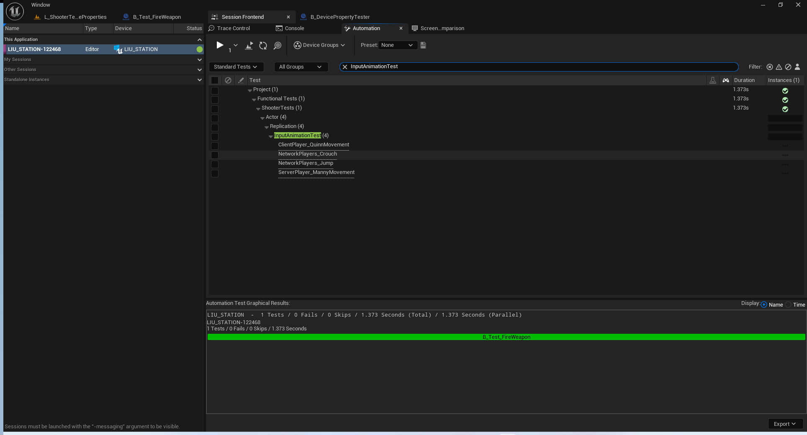
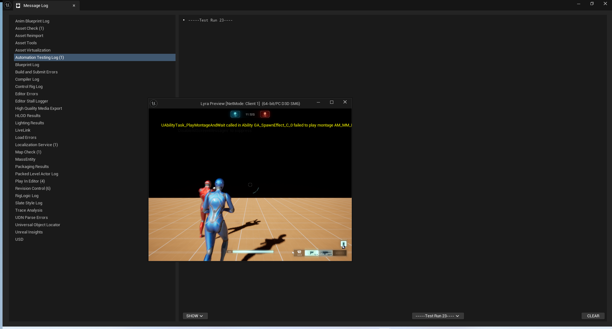

### 关联的宏
``` cpp

/** Macro to quickly create network tests based on the above test object to only run within the Editor. */
/** 宏程序，用于根据上述测试对象快速创建网络测试，仅在编辑器中运行。*/
#define ACTOR_ANIMATION_NETWORK_TEST(_ClassName, _TestDir) TEST_CLASS_WITH_BASE_AND_FLAGS(_ClassName, _TestDir, ShooterTestsActorAnimationNetworkTest, EAutomationTestFlags::EditorContext | EAutomationTestFlags::ProductFilter)
```
### 测试类定义
```cpp
/**
 * Implementation of our base class used to share functionality of loading a level and players over a network.
 * Inherits from `TTest<Derived, AsserterType>` to provide us our testing functionality.
 * Takes in an optional templated typename for the `FShooterTestsActorTestHelper` object and all possible inherited objects.
 *
 * Implements functionality to load a level, specified as parameters in the Constructor, and verifies that both the server and client Players are completely spawned within the game world during the `Setup`
 *
 * Makes use of the `TestCommandBuilder` to queue up latent commands to be executed on every Tick of the Engine/Editor
 * `Then` steps will execute within a single tick
 * `Until` steps will keep executing each tick until the predicate has evaluated to true or the timeout period has elapsed. The latter will fail the test.
 * Each step is defined and implemented to handle latent commands on both the server and client states.
 */
/**
* 我们的基类的实现用于在网络中共享加载关卡和玩家的相关功能。
* 继承自 `TTest<Derived, AsserterType>` 以为我们提供测试功能。
* 接受一个可选的模板类型参数，用于 `FShooterTestsActorTestHelper` 对象以及所有可能继承的对象。*
* 实现了加载关卡的功能，该功能通过构造函数中的参数来指定，并在“设置”阶段验证服务器和客户端玩家是否已完全在游戏世界中生成。*
* 利用“测试命令构建器”来将潜在命令排队，以便在引擎/编辑器的每个时钟周期中执行这些命令
* “然后”步骤将在单个时钟周期内执行
* “直到”步骤将在每个时钟周期内持续执行，直到谓词的评估结果为真或超时时间已过。后者会导致测试失败
* 每个步骤的定义和实现都旨在处理服务器和客户端状态下的潜在命令。*/
template<typename Derived, typename AsserterType, typename NetworkActorType = FShooterTestsActorTestHelper>
struct ShooterTestsBaseActorNetworkTest : public TTest<Derived, AsserterType>
{
	/** Let this object know about our templated parent's variables */
	/** 让此对象知晓我们模板化父类的变量信息 */
	using TTest<Derived, AsserterType>::TestRunner;
	using TTest<Derived, AsserterType>::Assert;
	using TTest<Derived, AsserterType>::TestCommandBuilder;

	/**
	 * Construct the Actor Network Test.
	 *
	 * @param InMapName - The full package path of the map to load.
	 */
	/**
	构建“参与者网络测试”。*
	* @参数 InMapName - 要加载的地图的完整包路径。*/
	ShooterTestsBaseActorNetworkTest(const FString& InMapName) : MapName(InMapName)
	{
		static_assert(std::is_convertible_v<NetworkActorType*, FShooterTestsActorTestHelper*>, "NetworkActorType must derive from FShooterTestsActorTestHelper");
	}

	/** Setup the test by loading in the specified level and making sure that both the server and client Lyra players are fully spawned in before continuing. */
	/** 通过加载指定关卡并确保服务器和客户端的 Lyra 玩家均已完全生成，来设置测试环境，然后继续进行操作。*/
	virtual void Setup() override
	{
		FAutomationEditorCommonUtils::LoadMap(MapName);

		Network
			.Start()
			.PrepareAndWaitForServerPlayerSpawn()
			.PrepareAndWaitForClientPlayerSpawn()
			.FetchConnectedPlayerOnServer()
			.FetchConnectedPlayerOnClient();
	}

	/** Networking component which handles our client/server latent commands. */
	/** 该组件负责处理我们的客户端/服务器的隐式指令。*/
	FShooterTestsNetworkComponent<NetworkActorType> Network{ TestRunner, TestCommandBuilder, TestRunner->bInitializing };

	/** Map package name that will be loaded for testing. */
	/** 指定用于测试的映射包名称。*/
	FString MapName;
};

/**
 * Implementation of our base class used to share functionality of loading a level and players over a network.
 * Inherits from `ShooterTestsActorBaseTest<Derived, AsserterType, NetworkActorType>` to provide us our testing functionality and to handle our initial World setup.
 * Specifies the `NetworkActorType` to be of type `FShooterTestsActorInputTestHelper` which has extra functionality for Input handling.
 *
 * Apart from loading our level and Players from the base `ShooterTestsBaseActorNetworkTest` object, will set up the FShooterTestsPawnTestActions object for input handling.
 * FShooterTestsPawnTestActions is a user-defined input handling object which derives from CQTest's `FInputTestActions` in order to specify Input Actions around what is available to our Player.
 *
 * Makes use of the `TestCommandBuilder` to queue up latent commands to be executed on every Tick of the Engine/Editor
 * `Then` steps will execute within a single tick
 * `Until` steps will keep executing each tick until the predicate has evaluated to true or the timeout period has elapsed. The latter will fail the test.
 * Each step is defined and implemented to handle latent commands on both the server and client states.
 */
/**
* 我们的基础类的实现用于在网络中共享加载关卡和玩家的相关功能。
* 继承自 `ShooterTestsActorBaseTest<Derived, AsserterType, NetworkActorType>` 以为我们提供测试功能，并处理我们的初始世界设置。
* 指定 `NetworkActorType` 为 `FShooterTestsActorInputTestHelper` 类型，该类具有处理输入的额外功能。*
* 除了从基础的“ShooterTestsBaseActorNetworkTest”对象加载我们的关卡和玩家外，还将为输入处理设置 FShooterTestsPawnTestActions 对象。
* FShooterTestsPawnTestActions 是一个用户自定义的输入处理对象，它继承自 CQTest 的“FInputTestActions”，以便指定适用于我们玩家的输入操作。*
* 利用“测试命令构建器”来将潜在命令排队，以便在引擎/编辑器的每个时钟周期内执行这些命令
* “然后”步骤将在单个时钟周期内执行
* “直到”步骤将在每个时钟周期内持续执行，直到谓词的评估结果为真或超时时间已过。后者会导致测试失败
* 每个步骤的定义和实现都旨在处理服务器和客户端状态下的潜在命令。*/
template<typename Derived, typename AsserterType>
struct ShooterTestsActorAnimationNetworkTest : public ShooterTestsBaseActorNetworkTest<Derived, AsserterType, FShooterTestsActorInputTestHelper>
{
	/** Let this object know about our templated parent's variables */
	/** 让此对象知晓我们模板化父类的变量信息 */
	using ShooterTestsBaseActorNetworkTest<Derived, AsserterType, FShooterTestsActorInputTestHelper>::Network;
	using TTest<Derived, AsserterType>::TestRunner;
	using TTest<Derived, AsserterType>::Assert;
	using TTest<Derived, AsserterType>::TestCommandBuilder;

	/**
	 * Construct the Actor Network Test.
	 *
	 * @param MapName - The full package path of the map to load.
	 */
	/**
	构建“参与者网络测试”。*
	* @参数 MapName - 要加载的地图的完整包路径。*/
	ShooterTestsActorAnimationNetworkTest(const FString& InMapName) : ShooterTestsBaseActorNetworkTest<Derived, AsserterType, FShooterTestsActorInputTestHelper>(InMapName)
	{
	}

	/**
	 * Search for a UAnimationAssest for the server player and verify that the animation exists on the connected client.
	 *
	 * @param AnimationName - Name of the animation to search for.
	 * 
	 * @note This method will set the `ExpectedAnimation` to the found UAnimationAssest.
	 */
	/**
	在服务器玩家处查找一个 UAnimationAsset，并确认该动画在连接的客户端上存在。*
	* @参数 AnimationName - 要查找的动画的名称。*
	* @注意：此方法会将“预期动画”设置为所找到的 UAnimationAssest 对象。*/
	void FetchAnimationAssetForServerPlayer(const FString& AnimationName)
	{
		FString ServerDescription = FString::Format(TEXT("Fetching animation asset '{0}' from the server player."), 
			{ AnimationName });
		FString ClientDescription = FString::Format(TEXT("Validating animation asset '{0}' from the connected player on the client."),
			{ AnimationName });

		Network
			.ThenServer(*ServerDescription, [this, AnimationName](FShooterTestsNetworkState<FShooterTestsActorInputTestHelper>& ServerState) {
				ExpectedAnimation = AnimationTestHelper.FindAnimationAsset(ServerState.LocalPlayer->GetSkeletalMeshComponent(), AnimationName);
				ASSERT_THAT(IsNotNull(ExpectedAnimation, TEXT("No animation found in player.")));
			})
			.ThenClient(*ClientDescription, [this](FShooterTestsNetworkState<FShooterTestsActorInputTestHelper>& ClientState) {
				FString AnimationName = ExpectedAnimation->GetName();
				UAnimationAsset* AnimationAsset = AnimationTestHelper.FindAnimationAsset(ClientState.NetworkPlayer->GetSkeletalMeshComponent(), AnimationName);
				ASSERT_THAT(IsNotNull(AnimationAsset, TEXT("No animation found in connected player.")));
			});
	}

	/**
	 * Search for a UAnimationAssest for the client player and verify that the animation exists on the connected client.
	 *
	 * @param AnimationName - Name of the animation to search for.
	 *
	 * @note This method will set the `ExpectedAnimation` to the found UAnimationAssest.
	 */
	/**
	为客户端玩家查找一个 UAnimationAsset，并确认该动画存在于已连接的客户端中。*
	* @参数 AnimationName - 要查找的动画的名称。*
	* @注意：此方法会将“预期动画”设置为所找到的 UAnimationAssest 对象。*/
	void FetchAnimationAssetForClientPlayer(const FString& AnimationName)
	{
		FString ServerDescription = FString::Format(TEXT("Fetching animation asset '{0}' from the connected player on the server."), 
			{ AnimationName });
		FString ClientDescription = FString::Format(TEXT("Validating animation asset '{0}' on the local client player."), 
			{ AnimationName });

		Network
			.ThenServer(*ServerDescription, [this, AnimationName](FShooterTestsNetworkState<FShooterTestsActorInputTestHelper>& ServerState) {
				ExpectedAnimation = AnimationTestHelper.FindAnimationAsset(ServerState.NetworkPlayer->GetSkeletalMeshComponent(), AnimationName);
				ASSERT_THAT(IsNotNull(ExpectedAnimation, TEXT("No animation found in player.")));
			})
			.ThenClient(*ClientDescription, [this](FShooterTestsNetworkState<FShooterTestsActorInputTestHelper>& ClientState) {
				FString AnimationName = ExpectedAnimation->GetName();
				UAnimationAsset* AnimationAsset = AnimationTestHelper.FindAnimationAsset(ClientState.LocalPlayer->GetSkeletalMeshComponent(), AnimationName);
				ASSERT_THAT(IsNotNull(AnimationAsset, TEXT("No animation found in player.")));
			});
	}

	/**
	 * Perform an input on the server's Lyra character.
	 *
	 * @param Type - Type of input to be performed.
	 */
	/**
	在服务器的“莱拉”角色上进行操作。*
	* @参数 Type - 需要执行的输入类型。*/
	void PerformInputOnServerPlayer(FShooterTestsActorInputTestHelper::InputActionType Type)
	{
		Network.ThenServer(TEXT("Performing the input action on the local server player."), [this, Type](FShooterTestsNetworkState<FShooterTestsActorInputTestHelper>& ServerState) {
			ServerState.LocalPlayer->PerformInput(Type);
		});
	}

	/**
	 * Perform an input on the client's Lyra character.
	 *
	 * @param Type - Type of input to be performed.
	 */
	/**
	对客户端中的莉拉角色进行输入操作。*
	* @参数 Type - 需要执行的输入类型。*/
	void PerformInputOnClientPlayer(FShooterTestsActorInputTestHelper::InputActionType Type)
	{
		Network.ThenClient(TEXT("Performing input action on the local client player."), [this, Type](FShooterTestsNetworkState<FShooterTestsActorInputTestHelper>& ClientState) {
			ClientState.LocalPlayer->PerformInput(Type);
		});
	}

	/** Stops any actively running inputs on the server's Lyra character. */
	/** 停止服务器中“莱拉”角色上正在运行的所有输入操作。*/
	void StopAllInputsOnServerPlayer()
	{
		Network.ThenServer(TEXT("Stopping all input actions on the local server player."), [this](FShooterTestsNetworkState<FShooterTestsActorInputTestHelper>& ServerState) {
			ServerState.LocalPlayer->StopAllInput();
		});
	}

	/** Stops any actively running inputs on the client's Lyra character. */
	/** 停止客户端中“莱拉”角色上正在运行的所有输入操作。*/
	void StopAllInputsOnClientPlayer()
	{
		Network.ThenClient(TEXT("Stopping all input actions on the local client player."), [this](FShooterTestsNetworkState<FShooterTestsActorInputTestHelper>& ClientState) {
			ClientState.LocalPlayer->StopAllInput();
		});
	}

	/** Check that the Lyra character representing the server player has the expected animation playing on all PIE sessions. */
	/** 检查代表服务器玩家的莉拉角色在所有 PIE 会话中是否均播放着预期的动画。*/
	void IsServerPlayerAnimationPlayingOnAllClients()
	{
		Network
			.UntilServer(TEXT("Check if the local player on the server is playing the expected animation."), [this](FShooterTestsNetworkState<FShooterTestsActorInputTestHelper>& ServerState) {
				return AnimationTestHelper.IsAnimationPlaying(ServerState.LocalPlayer->GetSkeletalMeshComponent(), ExpectedAnimation);
			})
			.UntilClient(TEXT("Check if the connected player on the client is playing the expected animation."), [this](FShooterTestsNetworkState<FShooterTestsActorInputTestHelper>& ClientState) {
				return AnimationTestHelper.IsAnimationPlaying(ClientState.NetworkPlayer->GetSkeletalMeshComponent(), ExpectedAnimation);
			});
	}

	/** Check that the Lyra character representing the client player has the expected animation playing on all PIE sessions. */
	/** 检查代表客户端玩家的莉拉角色在所有 PIE 会话中是否均播放着预期的动画。*/
	void IsClientPlayerAnimationPlayingOnAllClients()
	{
		Network
			.UntilClient(TEXT("Check if the local player on the client is playing the expected animation."), [this](FShooterTestsNetworkState<FShooterTestsActorInputTestHelper>& ClientState) {
				return AnimationTestHelper.IsAnimationPlaying(ClientState.LocalPlayer->GetSkeletalMeshComponent(), ExpectedAnimation);
			})
			.UntilServer(TEXT("Check if the connected player on the server is playing the expected animation."), [this](FShooterTestsNetworkState<FShooterTestsActorInputTestHelper>& ServerState) {
				return AnimationTestHelper.IsAnimationPlaying(ServerState.NetworkPlayer->GetSkeletalMeshComponent(), ExpectedAnimation);
			});
	}

	/** Animation helper object. */
	/** 动画辅助对象。*/
	FShooterTestsAnimationTestHelper AnimationTestHelper;

	/** Reference to our animation asset. */
	/** 指向我们动画资源的引用。*/
	UAnimationAsset* ExpectedAnimation{ nullptr };
};


#endif // ENABLE_SHOOTER
```
## 消息测试
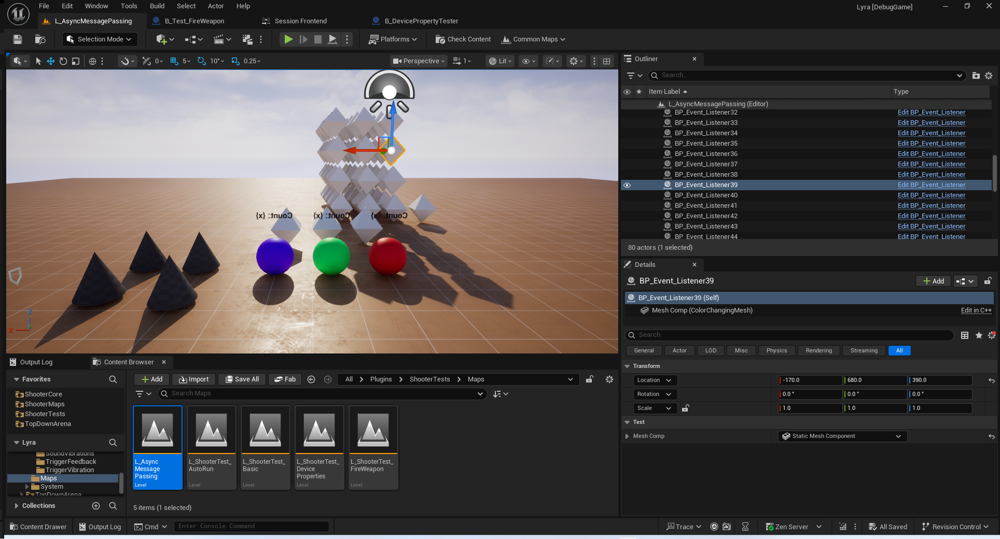
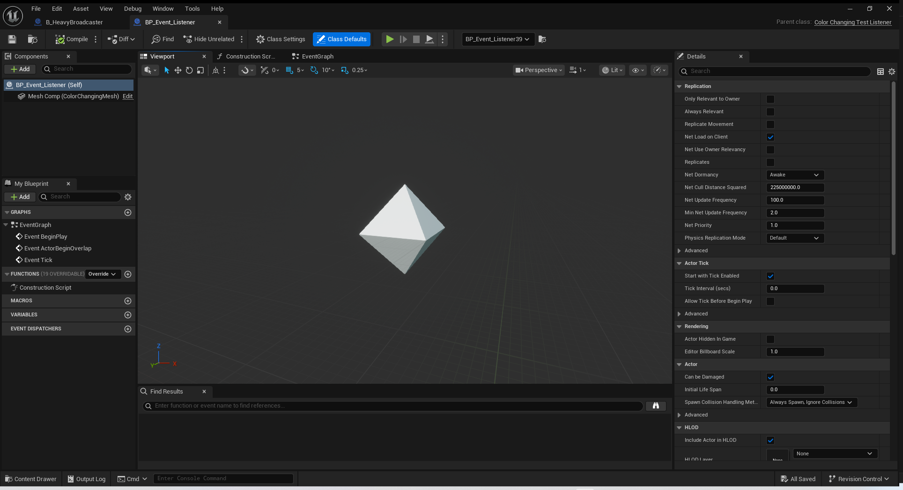
## 参考文献
[UE5的StructUtils](https://zhuanlan.zhihu.com/p/601008587)
## 颜色处理-轻度使用
注意这里使用的消息系统并非我们插件里面的消息系统,而是引擎的新特性!
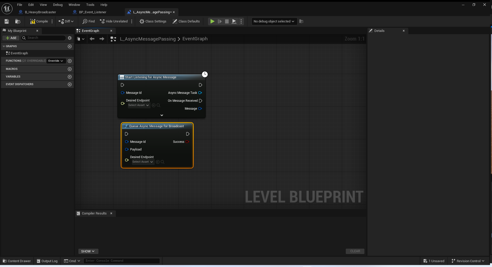
### AAsyncColorChangeBroadcastActor
``` cpp
/**
 * A test actor which will spawn a task outside of the game thread to
 * broadcast different color messages
 * 
 * * 一个测试角色，它会在游戏线程之外启动一个任务，以
 * 发送不同颜色的消息
 */
UCLASS(BlueprintType)
class AAsyncColorChangeBroadcastActor : public AActor
{
	GENERATED_BODY()
public:

	AAsyncColorChangeBroadcastActor(const FObjectInitializer& ObjectInitializer = FObjectInitializer::Get());
	
	virtual void BeginPlay() override;

	void SpawnBackgroundTask();
	
	void SpawnGameplayTagBroadcaster();

	UPROPERTY(EditAnywhere, BlueprintReadWrite, Category="Test")
	TInstancedStruct<FColorChangingMessage> ColorChangeData;

	UPROPERTY(EditAnywhere, Category="Test")
	FAsyncMessageId ColorMessageToBroadcast;

	UPROPERTY(EditAnywhere, Category="Test")
	FGameplayTag GameplayTagToBroadcastA;

	UPROPERTY(EditAnywhere, Category="Test")
	FGameplayTag GameplayTagToBroadcastB;

	UPROPERTY(BlueprintReadOnly, Category="Test")
	int32 NumBroadcasts = 0;

	UPROPERTY(EditAnywhere, Category="Test")
	float ColorMessageBroadcastFrequency = 3.0f;

	UPROPERTY(EditAnywhere, Category="Test")
	float GameplayTagBroadcastFrequency = 3.0f;

	FTimerHandle StartBackgroundTaskTimerHandle;

	FTimerHandle GameplayTagSpawner;
};
```
``` cpp

AAsyncColorChangeBroadcastActor::AAsyncColorChangeBroadcastActor(const FObjectInitializer& ObjectInitializer)
	: Super(ObjectInitializer)
{
	ColorMessageToBroadcast = Message_ChangeColor_Red;
}

void AAsyncColorChangeBroadcastActor::BeginPlay()
{
	Super::BeginPlay();
	
	SpawnBackgroundTask();

	SpawnGameplayTagBroadcaster();
}

void AAsyncColorChangeBroadcastActor::SpawnBackgroundTask()
{	
	TWeakObjectPtr<AAsyncColorChangeBroadcastActor> WeakThis(this);

	// Queue a message from a non-game thread, a normal thread from the task pool in this case
	// 从非游戏线程（在本例中为任务池中的普通线程）中排队发送一条消息
	AsyncTask(ENamedThreads::AnyNormalThreadNormalTask, [WeakThis]()
	{
		if (!WeakThis.IsValid())
		{ 
			return;
		}

		if (TSharedPtr<FAsyncGameplayMessageSystem> Sys = UAsyncMessageWorldSubsystem::GetSharedMessageSystem<FAsyncGameplayMessageSystem>(WeakThis->GetWorld()))
		{
			// Queue a color change message
			// 将颜色变更消息入队
			Sys.Get()->QueueMessageForBroadcast(WeakThis->ColorMessageToBroadcast, TStructView<FColorChangingMessage>(WeakThis->ColorChangeData));
		}

		WeakThis->NumBroadcasts++;
	});

	// Set up a timer to spawn a new background task every second
	// 设置一个计时器，以便每秒生成一个新的后台任务
	GetWorld()->GetTimerManager().SetTimer(StartBackgroundTaskTimerHandle,
		FTimerDelegate::CreateWeakLambda(this, [this]()
			{
				SpawnBackgroundTask();
			}), 1.0f, false, ColorMessageBroadcastFrequency);
}

void AAsyncColorChangeBroadcastActor::SpawnGameplayTagBroadcaster()
{
	// 这个消息只是演示一下如何发送,并没有实际接收者
	if (!GameplayTagToBroadcastA.IsValid() && !GameplayTagToBroadcastB.IsValid())
	{
		return;
	}
	
	TWeakObjectPtr<UWorld> WeakWorld = GetWorld();
	TWeakObjectPtr<AAsyncColorChangeBroadcastActor> WeakThis = this;
	
	// Set up a timer to spawn a new background task. This will queue the message on the game thread
	// 设置一个计时器来启动一个新的后台任务。这将把消息放入游戏线程的队列中。
	GetWorld()->GetTimerManager().SetTimer(GameplayTagSpawner,
		FTimerDelegate::CreateWeakLambda(this, [WeakWorld, WeakThis]()
		{
			if (!WeakThis.IsValid())
			{
				return;
			}
			
			// Queue the gameplay tag message a for broadcast
			// 将游戏玩法标签消息 a 排入队列以便进行广播
			if (TSharedPtr<FAsyncGameplayMessageSystem> Sys = UAsyncMessageWorldSubsystem::GetSharedMessageSystem<FAsyncGameplayMessageSystem>(WeakWorld.Get()))
			{
				if (WeakThis->GameplayTagToBroadcastA.IsValid())
				{
					Sys->QueueMessageForBroadcast(WeakThis->GameplayTagToBroadcastA);	
				}

				if (WeakThis->GameplayTagToBroadcastB.IsValid())
				{
					Sys->QueueMessageForBroadcast(WeakThis->GameplayTagToBroadcastB);
				}
			}
		}), 1.0f, true, GameplayTagBroadcastFrequency);
}
```
### AColorChangingTestListener
注意每一个监听的都是随机的颜色通道
``` cpp

/**
 * An actor which will change the color of its static mesh
 * in response to an async message that it listens to
 * 
 * * 一种能够根据其监听的异步消息来改变静态网格颜色的程序
 */
UCLASS(BlueprintType)
class AColorChangingTestListener : public AActor
{
	GENERATED_BODY()
public:
	
	AColorChangingTestListener(const FObjectInitializer& ObjectInitializer = FObjectInitializer::Get());

	virtual void BeginPlay() override;
	virtual void EndPlay(const EEndPlayReason::Type EndPlayReason) override;
	
	void HandleColorChange(const FAsyncMessage& Message);

	void HandleAnyColorChange(const FAsyncMessage& Message);

	const FAsyncMessageId GetColorChangeToListenTo();

	void SetupColorListener();
	void ResetListenerToColor();
	void SetupNamedThreadListener();
	
	UPROPERTY(EditAnywhere, Category="Test")
	TObjectPtr<UStaticMeshComponent> MeshComp;

	UPROPERTY(EditAnywhere, Category="Test")
	FName MaterialColorParamName = "ChangeColorParam";

	UPROPERTY(EditAnywhere, Category="Test")
	FAsyncMessageId OverrideMessageBinding;

	UPROPERTY(EditAnywhere, Category="Test")
	FGameplayTag TagToBindTo;
	
	UPROPERTY(EditAnywhere, Category="Test")
	bool bListenForParentTag = false;

	// Test receiving and binding messages on another thread
	UPROPERTY(EditAnywhere, Category="Test")
	bool bShouldSpawnTaskOnOtherThread = false;
	
	FTimerHandle BackgroundQueueMessageHandle;
	
	FAsyncMessageHandle BoundHandle_Color;

	FAsyncMessageHandle BoundHandle_ColorParent;
	
	int32 PreviousColorBoundTo = -1;
};
```
### 监听随机颜色代表的通道
static FAsyncMessageId Message_ChangeColor_Red = { Message_Tag_Red };
static FAsyncMessageId Message_ChangeColor_Green = { Message_Tag_Green};
static FAsyncMessageId Message_ChangeColor_Blue = { Message_Tag_Blue };

``` cpp
void AColorChangingTestListener::BeginPlay()
{
	Super::BeginPlay();
	
	if (TSharedPtr<FAsyncGameplayMessageSystem> Sys = UAsyncMessageWorldSubsystem::GetSharedMessageSystem<FAsyncGameplayMessageSystem>(GetWorld()))
	{
		// Listen to ALL color messages
		BoundHandle_ColorParent = Sys->BindListener(
			Message_ChangeColor_Red.GetParentMessageId(),
			TWeakObjectPtr<AColorChangingTestListener>(this),
			&ThisClass::HandleAnyColorChange);
	}

	if (bShouldSpawnTaskOnOtherThread)
	{
		SetupNamedThreadListener();
	}
	
	PreviousColorBoundTo = FMath::RandRange(0, 2);
	
	SetupColorListener();
}

```
``` cpp
void AColorChangingTestListener::EndPlay(const EEndPlayReason::Type EndPlayReason)
{
	Super::EndPlay(EndPlayReason);

	ResetListenerToColor();

	if (TSharedPtr<FAsyncGameplayMessageSystem> Sys = UAsyncMessageWorldSubsystem::GetSharedMessageSystem<FAsyncGameplayMessageSystem>(GetWorld()))
	{
		Sys->UnbindListener(BoundHandle_ColorParent);
	}
}

```

``` cpp
void AColorChangingTestListener::SetupColorListener()
{
	if (TSharedPtr<FAsyncGameplayMessageSystem> Sys = UAsyncMessageWorldSubsystem::GetSharedMessageSystem<FAsyncGameplayMessageSystem>(GetWorld()))
	{
		const FAsyncMessageId MessageToListenFor = GetColorChangeToListenTo();

		FAsyncMessageBindingOptions Opts = {};

		// Listen to the color messages
		BoundHandle_Color = Sys->BindListener(
			MessageToListenFor,
			TWeakObjectPtr<AColorChangingTestListener>(this),
			&ThisClass::HandleColorChange,
			Opts);
	}
}

```
``` cpp

const FAsyncMessageId AColorChangingTestListener::GetColorChangeToListenTo()
{
	// If you have specified a specific color to listen for let you do so here
	// 如果您已指定了要监听的特定颜色，那么您可以在此处进行设置。
	if (OverrideMessageBinding.IsValid())
	{
		return OverrideMessageBinding;
	}
	
	// Increment to the next color
	// 依次切换至下一个颜色
	PreviousColorBoundTo = FMath::WrapExclusive(++PreviousColorBoundTo, 0, 3);

	int32 IndexToBindTo = PreviousColorBoundTo;
	
	if (IndexToBindTo == 0)
	{
		return Message_ChangeColor_Red;
	}
	else if (IndexToBindTo == 1)
	{
		return Message_ChangeColor_Green;
	}
	else if (IndexToBindTo == 2)
	{
		return Message_ChangeColor_Blue;
	}
	
	return Message_ChangeColor_Blue;
}

```


因为颜色变了 ,所以又要重新监听
``` cpp

void AColorChangingTestListener::HandleColorChange(const FAsyncMessage& Message)
{
	TRACE_CPUPROFILER_EVENT_SCOPE(AColorChangingTestListener::HandleColorChange);

	ensure(IsInGameThread() || IsInParallelGameThread());
	
	// Some specific color change here
	const FColorChangingMessage* Data = Message.GetPayloadData<const FColorChangingMessage>();
	if (!Data)
	{
		ensure(false);
		return;
	}

	// Change the dynamic material param colors
	FLinearColor Col = Data->DesiredColorToChange;
	MeshComp->SetColorParameterValueOnMaterials(MaterialColorParamName, Col);	
	
	// If we are listening for a specific message already, don't attempt to rebind
	if (OverrideMessageBinding.IsValid())
	{
		return;
	}
	
	// Stop listening for the color that we just got
	ResetListenerToColor();

	// And start listening to a new fancy color message
	SetupColorListener();
}

```
只要有颜色变化 就旋转一下
``` cpp

void AColorChangingTestListener::HandleAnyColorChange(const FAsyncMessage& Message)
{
	TRACE_CPUPROFILER_EVENT_SCOPE(AColorChangingTestListener::HandleAnyColorChange);
	
	ensure(IsInGameThread() || IsInParallelGameThread());

	const FColorChangingMessage* Data = Message.GetPayloadData<const FColorChangingMessage>();
	if (!Data)
	{
		ensure(false);
		return;
	}

	const uint32 MyThread = FPlatformTLS::GetCurrentThreadId();

	// Any time there is a color change, rotate the actor a bit	
	// 一旦出现颜色变化，就稍微转动一下这个角色即可
	AddActorLocalRotation(FRotator(0.0, 0.0, 10.0));
}

```
### 在其他线程上去监听
``` cpp
void AColorChangingTestListener::SetupNamedThreadListener()
{
	check(bShouldSpawnTaskOnOtherThread);

	// We want to receive our event on the RHI thread
	// 我们希望在 RHI 线程上接收事件
	FAsyncMessageBindingOptions Opts = {};
	Opts.SetNamedThreads(ENamedThreads::RHIThread);

	if (TSharedPtr<FAsyncGameplayMessageSystem> Sys = UAsyncMessageWorldSubsystem::GetSharedMessageSystem<FAsyncGameplayMessageSystem>(GetWorld()))
	{
		Sys->BindListener(Message_Async_Test, [](const FAsyncMessage& Message)
		{
			// Ensure that we are actually geting our message on the thread we have requested to
			const uint32 CurrentThread = FPlatformTLS::GetCurrentThreadId();
			ensure(CurrentThread == Message.GetThreadQueuedFromThreadId());
			
			UE_LOG(LogAsyncMessageSystem, Verbose, TEXT("Successfully received message on RHI thread"));
		}, Opts);
	}

	// Wait 5 seconds, and then spawn an async task on the background thread to queue the message
	// 等待 5 秒钟，然后在后台线程上启动一个异步任务，将消息放入队列中
	const float NextDelay = 5.0f;

	TWeakObjectPtr<UWorld> WeakWorld = GetWorld();

	// Set up a timer to spawn a new background task every second
	// 设置一个计时器，以便每秒生成一个新的后台任务
	GetWorld()->GetTimerManager().SetTimer(BackgroundQueueMessageHandle,
		FTimerDelegate::CreateWeakLambda(this, [WeakWorld]()
			{
				// Spawn an async task to queue an message, on a background thread
				AsyncTask(ENamedThreads::RHIThread, [WeakWorld]()
				{
					if (TSharedPtr<FAsyncGameplayMessageSystem> Sys = UAsyncMessageWorldSubsystem::GetSharedMessageSystem<FAsyncGameplayMessageSystem>(WeakWorld.Get()))
					{
						Sys->QueueMessageForBroadcast(Message_Async_Test);
					}
				});
			
				// loop every 1 second
			}), 1.0f, true, NextDelay);
}
```


## 重度使用
### AHeavyPerformanceBroadcastor
``` cpp

/**
 * This is an actor which will queue a message for broadcast every single tick.
 * 这是一个会每秒一次地将消息加入队列并进行广播的程序。
 */
UCLASS(BlueprintType)
class AHeavyPerformanceBroadcastor : public AActor
{
	GENERATED_BODY()

	AHeavyPerformanceBroadcastor(const FObjectInitializer& ObjectInitializer = FObjectInitializer::Get());
	
public:
	virtual void Tick(float DeltaSeconds) override;

	void QueueMessage();
	
	UPROPERTY(EditAnywhere, Category="Test")
	TObjectPtr<UStaticMeshComponent> MeshComp;
	
	UPROPERTY(EditAnywhere, Category="Test")
	FAsyncMessageId MessageToQueue;

	UPROPERTY(EditAnywhere, Category="Test")
	FInstancedStruct MessagePayloadToQueue;

	UPROPERTY(EditAnywhere, Category="Test", meta=(UIMin=1))
	int32 NumberOfTimesToQueue = 1;

	UPROPERTY(EditAnywhere, Category="Test")
	TEnumAsByte<enum ETickingGroup> CustomTickGroup = TG_PrePhysics;
};


UCLASS(BlueprintType)
class AHeavyPerformanceListener : public AActor
{
	GENERATED_BODY()

	AHeavyPerformanceListener(const FObjectInitializer& ObjectInitializer = FObjectInitializer::Get());
	
public:

	virtual void BeginPlay() override;
	virtual void EndPlay(const EEndPlayReason::Type EndPlayReason) override;
	
	UPROPERTY(EditAnywhere, Category="Test")
	TObjectPtr<UStaticMeshComponent> MeshComp;

	UPROPERTY(EditAnywhere, Category="Test")
	FAsyncMessageId MessageToListenFor;

	UPROPERTY(EditAnywhere, Category="Test")
	TEnumAsByte<ETickingGroup> GroupToListenFor = ETickingGroup::TG_PostPhysics;

private:

	void HandleMessage(const FAsyncMessage& Message);
	void SetupListener();
	void RemoveListener();
	
	FAsyncMessageHandle ListenerHandle;
};

```

``` cpp

AHeavyPerformanceBroadcastor::AHeavyPerformanceBroadcastor(const FObjectInitializer& ObjectInitializer)
	: Super(ObjectInitializer)
{
	MeshComp = CreateDefaultSubobject<UStaticMeshComponent>(TEXT("RootMeshComp"));
	SetRootComponent(MeshComp);
	
	MessagePayloadToQueue = FInstancedStruct::Make(FTestHeavyMessage{});

	// The tick function is TG_PrePhysics by default
	// Tick this actor every time pre-physics
	PrimaryActorTick.bCanEverTick = true;
	PrimaryActorTick.TickGroup = CustomTickGroup;
}

void AHeavyPerformanceBroadcastor::Tick(float DeltaSeconds)
{
	Super::Tick(DeltaSeconds);

	QueueMessage();	
}

void AHeavyPerformanceBroadcastor::QueueMessage()
{
	TSharedPtr<FAsyncGameplayMessageSystem> Sys = UAsyncMessageWorldSubsystem::GetSharedMessageSystem<FAsyncGameplayMessageSystem>(GetWorld());
	if (!Sys)
	{
		return;
	}

	for (int32 i = 0; i < NumberOfTimesToQueue; ++i)
	{
		// Queue a color change message
		Sys->QueueMessageForBroadcast(MessageToQueue, MessagePayloadToQueue);	
	}
}
```
### AHeavyPerformanceListener
``` cpp
UCLASS(BlueprintType)
class AHeavyPerformanceListener : public AActor
{
	GENERATED_BODY()

	AHeavyPerformanceListener(const FObjectInitializer& ObjectInitializer = FObjectInitializer::Get());
	
public:

	virtual void BeginPlay() override;
	virtual void EndPlay(const EEndPlayReason::Type EndPlayReason) override;
	
	UPROPERTY(EditAnywhere, Category="Test")
	TObjectPtr<UStaticMeshComponent> MeshComp;

	UPROPERTY(EditAnywhere, Category="Test")
	FAsyncMessageId MessageToListenFor;

	UPROPERTY(EditAnywhere, Category="Test")
	TEnumAsByte<ETickingGroup> GroupToListenFor = ETickingGroup::TG_PostPhysics;

private:

	void HandleMessage(const FAsyncMessage& Message);
	void SetupListener();
	void RemoveListener();
	
	FAsyncMessageHandle ListenerHandle;
};
```
``` cpp
void AHeavyPerformanceListener::BeginPlay()
{
	Super::BeginPlay();

	SetupListener();
}

void AHeavyPerformanceListener::EndPlay(const EEndPlayReason::Type EndPlayReason)
{
	Super::EndPlay(EndPlayReason);
	
	RemoveListener();
}

void AHeavyPerformanceListener::HandleMessage(const FAsyncMessage& Message)
{
	const FTestHeavyMessage* Data = Message.GetPayloadData<const FTestHeavyMessage>();
	
	if (!Data)
	{
		ensure(false);
		return;
	}

	// Rotate the actor a little itsy bitsy, just to replicate doing some kind of simple gameplay work.
	AddActorLocalRotation(Data->AmountToRotate);
}

void AHeavyPerformanceListener::SetupListener()
{
	check(!ListenerHandle.IsValid());
	TSharedPtr<FAsyncGameplayMessageSystem> Sys = UAsyncMessageWorldSubsystem::GetSharedMessageSystem<FAsyncGameplayMessageSystem>(GetWorld());
	if (!Sys)
	{
		return;
	}

	FAsyncMessageBindingOptions BindingOpts = {};
	BindingOpts.SetTickGroup(GroupToListenFor);
	
	ListenerHandle = Sys->BindListener(
		MessageToListenFor,
		TWeakObjectPtr<AHeavyPerformanceListener>(this),
		&AHeavyPerformanceListener::HandleMessage,
		BindingOpts);

	ensure(ListenerHandle.IsValid());
}

void AHeavyPerformanceListener::RemoveListener()
{
	if (!ListenerHandle.IsValid())
	{
		return;
	}
	
	TSharedPtr<FAsyncGameplayMessageSystem> Sys = UAsyncMessageWorldSubsystem::GetSharedMessageSystem<FAsyncGameplayMessageSystem>(GetWorld());
	if (!Sys)
	{
		return;
	}

	Sys->UnbindListener(ListenerHandle);
}


```
## 参考文献
[自动化测试](https://dev.epicgames.com/documentation/zh-cn/unreal-engine/run-automation-tests-in-unreal-engine)
## 总结
注意本节内容包含引擎部分新特性(包含炫技内容),未做进一步讲解
如FInstancedStruct,AsyncMessage等.
本节未详细讲解ShooterUtilities下的工具类和函数.
该节内容,了解流程即可.
注意这个AsyncMessage等的跨线程通讯监听和指定TickGroup.在特定业务场景很有用.
以及FInstancedStruct的使用也很方便!