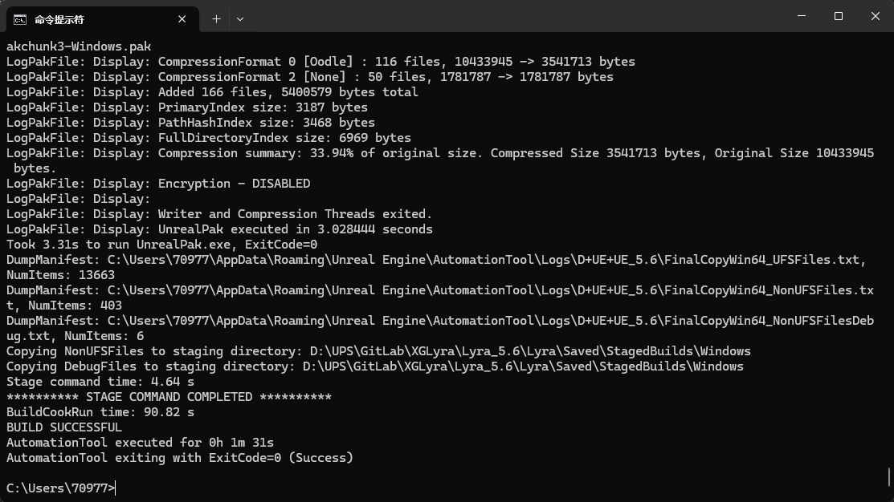
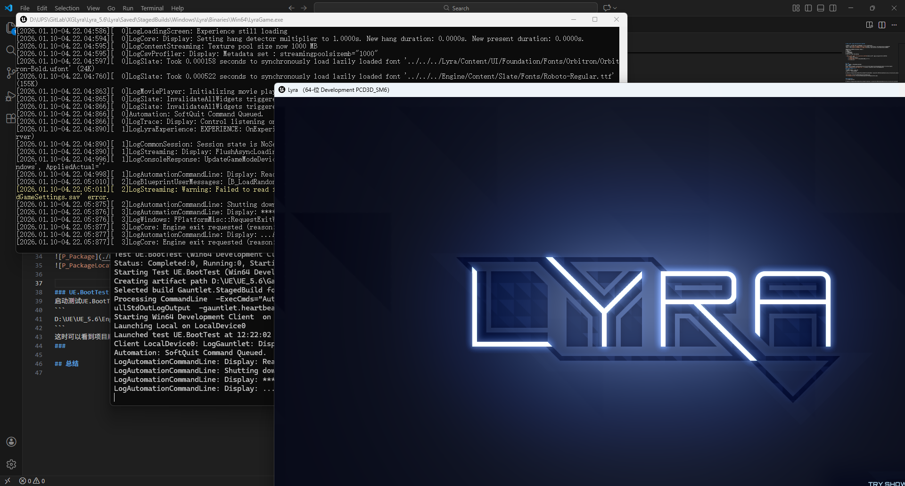
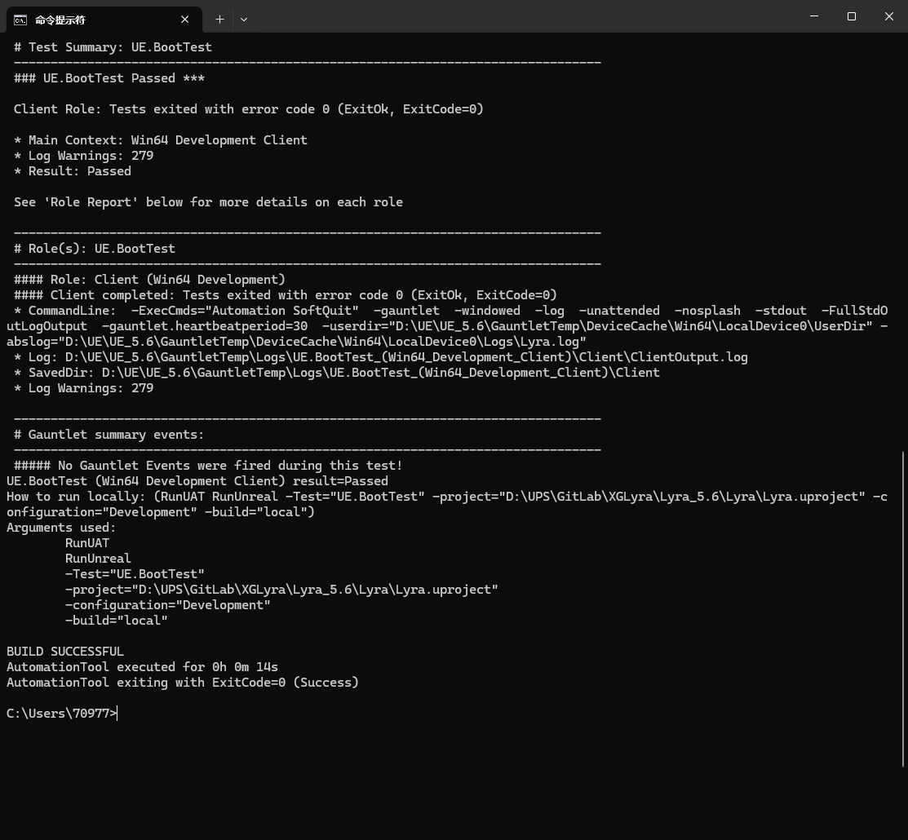
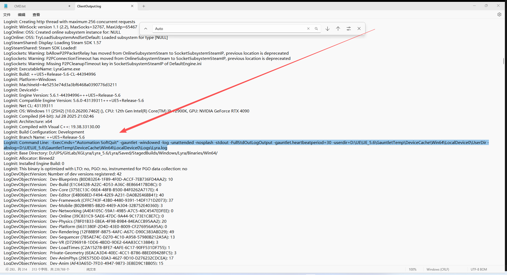
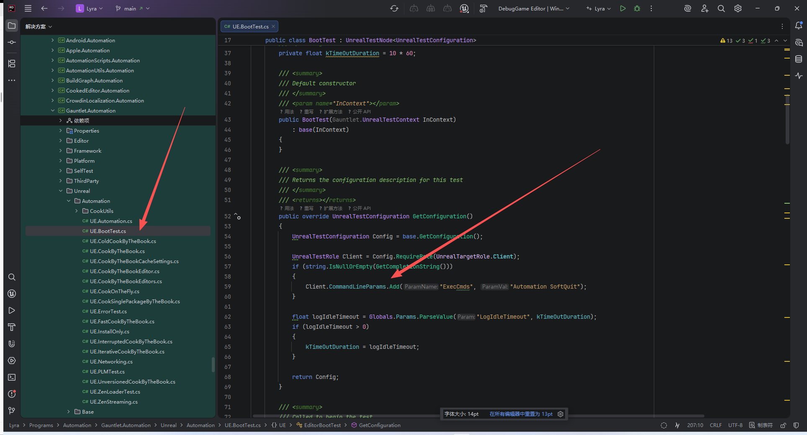
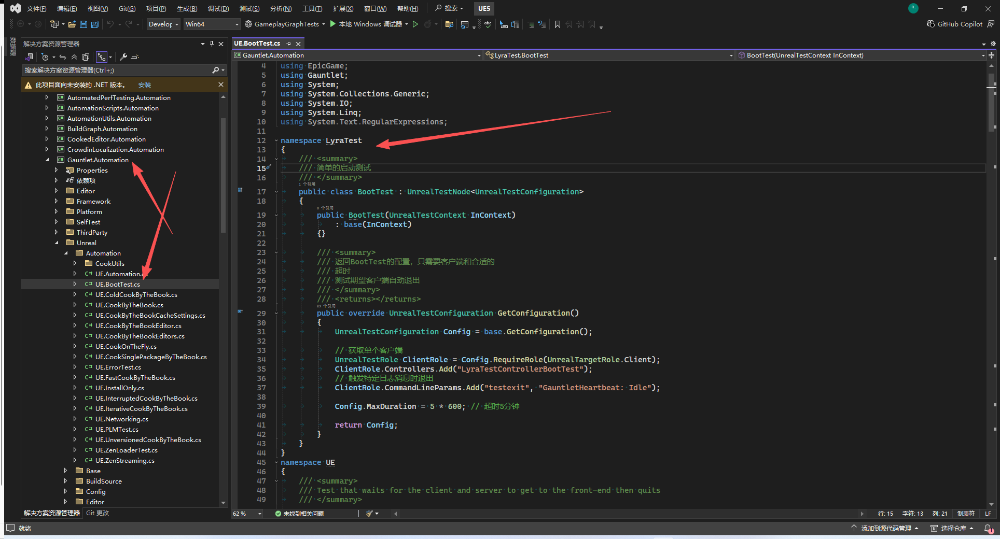
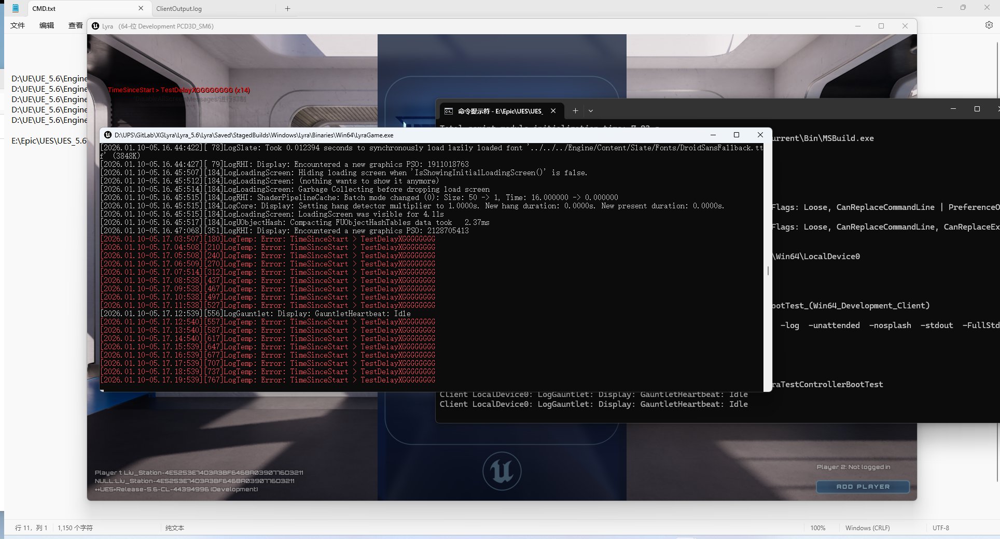
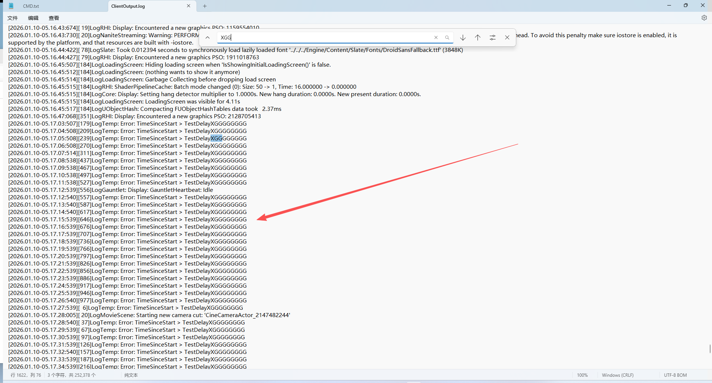
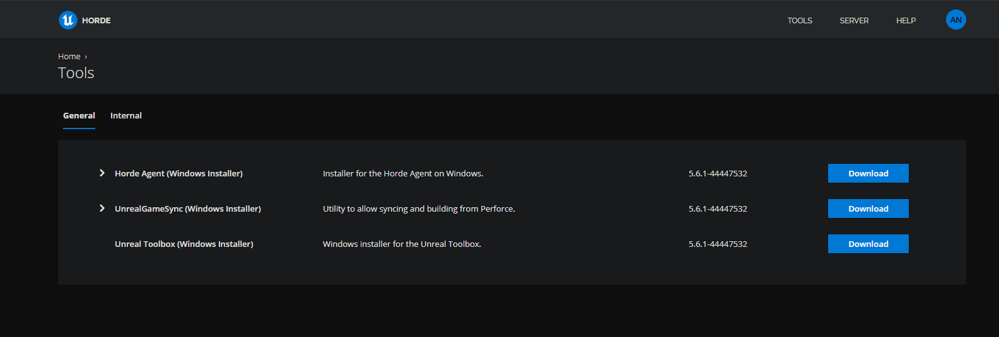

# UE5_Lyra学习指南_116_Gauntlet自动化框架

本文章仅为小刚-B站课堂-虚幻引擎视频课程Lyra-精讲的演讲手稿.  
本套课程链接:[[UE5]虚幻引擎游戏案例Lyra精讲](https://www.bilibili.com/cheese/play/ss112001159)  
前置课程链接:[[UE5]虚幻引擎UEC++从基础到进阶](https://www.bilibili.com/cheese/play/ss28043)  

文章内容由小刚撰写,采用了以下多种方式:  
1.口述转文字  
2.AI重构  
3.参考引擎源码  
4.Lyra工程源码  
5.结合社区论坛各位大佬的解析  

- [UE5\_Lyra学习指南\_116\_Gauntlet自动化框架](#ue5_lyra学习指南_116_gauntlet自动化框架)
	- [概述](#概述)
	- [参考文献](#参考文献)
	- [发布版本引擎感受流程](#发布版本引擎感受流程)
		- [打包](#打包)
		- [UE.BootTest](#ueboottest)
		- [UE.EditorBootTest](#ueeditorboottest)
		- [EditorTest.BootTest](#editortestboottest)
	- [ULyraTestControllerBootTest](#ulyratestcontrollerboottest)
	- [源码引擎嵌入自己的控制器](#源码引擎嵌入自己的控制器)
	- [Horde](#horde)
	- [总结](#总结)


## 概述
深入开发需要使用源码引擎.了解即可!
## 参考文献
https://dev.epicgames.com/documentation/zh-cn/unreal-engine/running-gauntlet-tests-in-unreal-engine
[UE5：简述Gauntlet自动化测试的原理和使用](https://zhuanlan.zhihu.com/p/606284770)
[[UFSH2025]Horde技术框架入门 | Jack Condon Epic Games 开发者关系资深工程师](https://www.bilibili.com/video/BV1F3UEBBETR/)
## 发布版本引擎感受流程
### 打包
使用如下命令先打一个包出来.
注意!!!!第一次打包会很久
``` 
D:\UE\UE_5.6\Engine\Build\BatchFiles\RunUAT BuildCookRun -project=D:\UPS\GitLab\XGLyra\Lyra_5.6\Lyra\Lyra.uproject -platform=Win64 -configuration=Development -build -cook -pak -stage
```



### UE.BootTest
启动测试UE.BootTest
``` 
D:\UE\UE_5.6\Engine\Build\BatchFiles\RunUAT RunUnreal -project=D:\UPS\GitLab\XGLyra\Lyra_5.6\Lyra\Lyra.uproject -platform=Win64 -configuration=Development -build=local -test=UE.BootTest
```
这时可以看到项目顺利启动,然后自动退出.


日志的位置:
D:\UE\UE_5.6\GauntletTemp\Logs\UE.BootTest_(Win64_Development_Client)\Client\ClientOutput.log
退出的原因
```
LogInit: Command Line:  -ExecCmds="Automation SoftQuit" -gauntlet -windowed -log -unattended -nosplash -stdout -FullStdOutLogOutput -gauntlet.heartbeatperiod=30 -userdir=D:\UE\UE_5.6\GauntletTemp\DeviceCache\Win64\LocalDevice0\UserDir -abslog=D:\UE\UE_5.6\GauntletTemp\DeviceCache\Win64\LocalDevice0\Logs\Lyra.log

```



### UE.EditorBootTest
秒开编辑器关闭
```
D:\UE\UE_5.6\Engine\Build\BatchFiles\RunUAT RunUnreal -project=D:\UPS\GitLab\XGLyra\Lyra_5.6\Lyra\Lyra.uproject -platform=Win64 -configuration=Development -build=local -test=UE.EditorBootTest
```
``` csharp 
/// <summary>
	/// Test that verifies the editor boots
	/// </summary>
	public class EditorBootTest : BootTest
	{
		public EditorBootTest(Gauntlet.UnrealTestContext InContext)
			: base(InContext)
		{
		}

		/// <summary>
		/// Returns the configuration description for this test
		/// </summary>
		/// <returns></returns>
		public override UnrealTestConfiguration GetConfiguration()
		{
			UnrealTestConfiguration Config = base.GetConfiguration();
			// currently needed as BootTest isn't an abstract class. Can be changed for 4.27
			Config.ClearRoles();
			UnrealTestRole EditorRole = Config.RequireRole(Config.CookedEditor ? UnrealTargetRole.CookedEditor : UnrealTargetRole.Editor);
			EditorRole.CommandLineParams.Add("execcmds", "QUIT_EDITOR");
			return Config;
		}

		protected override string GetCompletionString()
		{
			return null;
		}
	}
```
### EditorTest.BootTest
使用如下测试的话,可以等自己手动关闭编辑器后,得到响应.
但是它会开一个编辑.然后又开一个实例
```
D:\UE\UE_5.6\Engine\Build\BatchFiles\RunUAT RunUnreal -project=D:\UPS\GitLab\XGLyra\Lyra_5.6\Lyra\Lyra.uproject -platform=Win64 -configuration=Development -build=local -test=EditorTest.BootTest
```
``` cpp
		public override EditorGauntletTestControllerConfig GetConfiguration()
		{
			if (CachedConfig != null)
			{
				return CachedConfig;
			}
			// just need a single role
			EditorGauntletTestControllerConfig Config = base.GetConfiguration();
			var EditorRole = Config.RequireRole(UnrealTargetRole.Editor);

			if (!string.IsNullOrEmpty(Config.Controller))
			{
				EditorRole.Controllers.Add(Config.Controller);
			}

			return Config;
		}

```
## ULyraTestControllerBootTest 	
``` cpp
UCLASS()
class ULyraTestControllerBootTest : public UGauntletTestControllerBootTest
{
	GENERATED_BODY()

protected:

	// This test needs a delay as the test can be over before focus is returned to Gauntlet after launching the game.
	// This can cause the test to be over before Gauntlet can even know that it is running and will cause the test to fail.
	// 本次测试需要设置一段延迟时间，因为游戏启动后，焦点可能在尚未回到“游戏”界面的情况下就离开了。
	// 这可能会导致测试在“游戏”还未意识到自己正在运行时就结束了，从而导致测试失败。
	//@TODO: Comment and delay copied from ShooterGame.  Still needed?
	//@待办事项：评论并延迟，此内容源自《射击游戏》。是否仍需保留？
	const double TestDelay = 20.0f;

	//~UGauntletTestControllerBootTest interface
	virtual bool IsBootProcessComplete() const override;
	//~End of UGauntletTestControllerBootTest interface
};


```
``` cpp
bool ULyraTestControllerBootTest::IsBootProcessComplete() const
{
	static double StartTime = FPlatformTime::Seconds();
	const double TimeSinceStart = FPlatformTime::Seconds() - StartTime;

	if (TimeSinceStart >= TestDelay)
	{
		UE_LOG(LogTemp, Error, TEXT("TimeSinceStart > TestDelayXGGGGGGGG"));
		
		return true;
		
//@TODO: actually do some useful testing here
// 		if (const UWorld* World = GetWorld())
// 		{
// 			if (const ULyraGameInstance* GameInstance = Cast<ULyraGameInstance>(GetWorld()->GetGameInstance()))
// 			{
// 				if (GameInstance->GetCurrentState() == ShooterGameInstanceState::WelcomeScreen ||
// 					GameInstance->GetCurrentState() == ShooterGameInstanceState::MainMenu)
// 				{
// 					return true;
// 				}
// 			}
// 		}
	}

	return false;
}


```

``` cpp


/**
 *	Base class for games to implement test controllers that use the Gauntlet native
 *	framework. This is a very thin class that is created automatically based on 
 *	command line params (-gauntlet=MyControllerName) and provides easily overridden
 *	functions that represent state changes and ticking
 *
 *	In essence your derived class should implement logic that starts and monitors
 *	a test, then calls EndTest(Result) when the desired criteria are met (or not!)
 */
UCLASS(MinimalAPI)
class UGauntletTestController : public UObject
{
	GENERATED_BODY()

	friend class FGauntletModule;

public:

	/** Default constructur */
	UE_API UGauntletTestController(const FObjectInitializer& ObjectInitializer);
	UE_API virtual ~UGauntletTestController();

	// Overridable delegates for some of the most useful test points

	/**
	 *	Called when the controller is first initialized
	 */
	virtual void	OnInit() {}

	/**
	 *	Called prior to a map change
	 */
	virtual void	OnPreMapChange() {}

	/**
	 *	Called after a map change. GetCurrentMap() will now return the new map
	 */
	virtual void	OnPostMapChange(UWorld* World) {}

	/**
	 *	Called periodically to let the controller check and control state
	 */
	virtual void	OnTick(float TimeDelta) {}

	/**
	 *	Called when a state change is applied to the module. States are game-driven.
	 *	GetCurrentState() == OldState until this function returns
	 */
	virtual void	OnStateChange(FName OldState, FName NewState) {}

	/**
	 * Return the current world
	 */
	UE_API UWorld* GetWorld() const override;

	/**
	 *	Helper function that returns the first player controller in the world (may be null depending on when called).
	 */
	UE_API APlayerController* GetFirstPlayerController() const;

protected:

	/**
	 *	Returns the current state applied to Gauntlet
	 */
	UE_API FName			GetCurrentState() const;

	/**
	 *	Return the time since OnStateChange was called with the current state
	 */
	UE_API double			GetTimeInCurrentState() const;

	/**
	 *	Return the name of the current persistent map
	 */
	UE_API FString			GetCurrentMap() const;

	/**
	 *	Called to end testing and exit the app with provided code, static to avoid test instance state/lifetime dependency
	 */
	static UE_API void	EndTest(int32 ExitCode = 0);

	/**
	 * Returns the gauntlet module running this test
	 */
	UE_API FGauntletModule* GetGauntlet();

	/**
	 * Marks the next heartbeat as active and immediately forces a heartbeat with the given status message if one is specified.
	 * Test controllers should call this regularly as purposeful actions happens or meaningful states are achieved within the test.
	 */
	UE_API void MarkHeartbeatActive(const FString& OptionalStatusMessage = FString());

private:

	FGauntletModule*  ParentModule;

};
```

我们没有办法通过-gauntlet=MyControllerName传递参数解决这个控制器使用的问题,所以我们选择源码引擎.
从上层改造.
这里没有办法生效的原因.应该是需要去写一个配置类读命令行参数,然后转交给我们的游戏实例.
可以参考参考文献.更加详细
``` csharp
using Gauntlet;

namespace LyraTest
{
	/// <summary>
	/// 简单的启动测试
	/// </summary>
	public class BootTest : UnrealTestNode<UnrealTestConfiguration>
	{
		public BootTest(UnrealTestContext InContext)
		: base(InContext)
		{}

		/// <summary>
		/// 返回BootTest的配置，只需要客户端和合适的
		/// 超时
		/// 测试期望客户端自动退出
		/// </summary>
		/// <returns></returns>
		public override UnrealTestConfiguration GetConfiguration()
		{
			UnrealTestConfiguration Config = base.GetConfiguration();

			// 获取单个客户端
			UnrealTestRole ClientRole = Config.RequireRole(UnrealTargetRole.Client);
			// 触发特定日志消息时退出
			ClientRole.CommandLineParams.Add("testexit", "GauntletHeartbeat: Idle");

			Config.MaxDuration = 5 * 600; // 超时5分钟

			return Config;
		}
	}
}

```
``` Csharp
UnrealTestRole ClientRole = Config.RequireRole(UnrealTargetRole.Client);
ClientRole.Controllers.Add("MyControllerName");
```
## 源码引擎嵌入自己的控制器
此处略过源码引擎5.6的下载编译 以及项目的Switch切换.
项目可以不用切换.我们只是需要重新编译上层的工具即可!
```
E:\Epic\UES\UES_5.6\Engine\Build\BatchFiles\RunUAT RunUnreal -project=D:\UPS\GitLab\XGLyra\Lyra_5.6\Lyra\Lyra.uproject -platform=Win64 -configuration=Development -build=local -test=LyraTest.BootTest

```

 E:\Epic\UES\UES_5.6\GauntletTemp\Logs\LyraTest.BootTest_(Win64_Development_Client)\Client\ClientOutput.log

可以在该日志观察到如下
```
LogInit: Command Line:  -testexit="GauntletHeartbeat: Idle" -gauntlet=LyraTestControllerBootTest -windowed -log -unattended -nosplash -stdout -FullStdOutLogOutput -gauntlet.heartbeatperiod=30 -userdir=E:\Epic\UES\UES_5.6\GauntletTemp\DeviceCache
.....
[2026.01.10-05.09.37:070][  0]LogGauntlet: Display: Added Gauntlet controller LyraTestControllerBootTest
```
退出的原因
``` 
[2026.01.10-05.09.38:707][  4]LogUIActionRouter: Display: [User 0] Focused desired target StartGameButton
[2026.01.10-05.09.38:707][  4]LogGauntlet: Display: GauntletHeartbeat: Idle 
[2026.01.10-05.09.38:779][  4]LogRHI: Display: Encountered a new graphics PSO: 1602160613
[2026.01.10-05.09.38:780][  4]LogRHI: Display: Encountered a new graphics PSO: 305904167
[2026.01.10-05.09.38:782][  5]LogExit: Display: **** TestExit: GauntletHeartbeat: Idle ****
[2026.01.10-05.09.38:782][  5]LogWindows: FPlatformMisc::RequestExit(1, FEngineLoop::Tick.GScopedTestExit)
[2026.01.10-05.09.38:783][  5]LogWindows: FPlatformMisc::RequestExitWithStatus(1, 0, FEngineLoop::Tick.GScopedTestExit)
[2026.01.10-05.09.38:783][  5]LogCore: Engine exit requested (reason: Win RequestExit)

```
讲Idle退出的代码注释掉.成功稳定运行了起来!!!


``` csharp
namespace LyraTest
{
	/// <summary>
	/// 简单的启动测试
	/// </summary>
	public class BootTest : UnrealTestNode<UnrealTestConfiguration>
	{
		public BootTest(UnrealTestContext InContext)
			: base(InContext)
		{}

		/// <summary>
		/// 返回BootTest的配置，只需要客户端和合适的
		/// 超时
		/// 测试期望客户端自动退出
		/// </summary>
		/// <returns></returns>
		public override UnrealTestConfiguration GetConfiguration()
		{
			UnrealTestConfiguration Config = base.GetConfiguration();

			// 获取单个客户端
			UnrealTestRole ClientRole = Config.RequireRole(UnrealTargetRole.Client);
			ClientRole.Controllers.Add("LyraTestControllerBootTest");
			// 触发特定日志消息时退出
			//ClientRole.CommandLineParams.Add("testexit", "GauntletHeartbeat: Idle");

			Config.MaxDuration = 5 * 600; // 超时5分钟

			return Config;
		}
	}
}

```
## Horde
不做讲解.主要可以联机编译.部署自动化流程等等


## 总结
本节内容不要求掌握.了解流程即可!
注意这些流程都是虚幻官方的流程.是一个很大很大的团队在维护使用.
这边还会涉及到Horde,P4v,UGS,Gauntlet等等等等内容.这些东西是属于团队定制化开发.跟我们客户端一般关系性不大.