# UE5_Lyra学习指南_117_回放系统

本文章仅为小刚-B站课堂-虚幻引擎视频课程Lyra-精讲的演讲手稿.  
本套课程链接:[[UE5]虚幻引擎游戏案例Lyra精讲](https://www.bilibili.com/cheese/play/ss112001159)  
前置课程链接:[[UE5]虚幻引擎UEC++从基础到进阶](https://www.bilibili.com/cheese/play/ss28043)  

文章内容由小刚撰写,采用了以下多种方式:  
1.口述转文字  
2.AI重构  
3.参考引擎源码  
4.Lyra工程源码  
5.结合社区论坛各位大佬的解析  

- [UE5\_Lyra学习指南\_117\_回放系统](#ue5_lyra学习指南_117_回放系统)
	- [概述](#概述)
	- [参考文献](#参考文献)
	- [查询已有的回放结果](#查询已有的回放结果)
		- [单个回放记录](#单个回放记录)
		- [回放列表](#回放列表)
		- [异步查询](#异步查询)
	- [回放子系统](#回放子系统)
		- [头文件](#头文件)
		- [组件触发播放或记录](#组件触发播放或记录)
		- [记录录像](#记录录像)
			- [开启记录](#开启记录)
			- [ALyraPlayerController](#alyraplayercontroller)
				- [检查是否允许记录](#检查是否允许记录)
				- [转发到子系统开始记录](#转发到子系统开始记录)
				- [修改TargetViewRotation的同步方式](#修改targetviewrotation的同步方式)
			- [LyraGameState](#lyragamestate)
			- [ALyraReplayPlayerController](#alyrareplayplayercontroller)
				- [头文件](#头文件-1)
				- [监听视图对象的变化以便响应](#监听视图对象的变化以便响应)
				- [其他函数](#其他函数)
			- [结束录制](#结束录制)
		- [播放录像](#播放录像)
			- [回放列表](#回放列表-1)
			- [列表子项](#列表子项)
			- [进度条](#进度条)
			- [转发到子系统播放](#转发到子系统播放)
	- [总结](#总结)


## 概述
本节主要讲解一下Lyra的回放的记录和播放!
## 参考文献
[《Exploring in UE4》Unreal回放系统剖析](https://zhuanlan.zhihu.com/p/564017214)
## 查询已有的回放结果
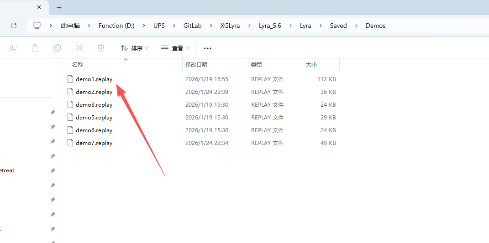
### 单个回放记录
``` cpp

/** An available replay for display in the UI */
/** 一个可在用户界面中显示的可用回放片段 */
UCLASS(MinimalAPI, BlueprintType)
class ULyraReplayListEntry : public UObject
{
	GENERATED_BODY()

public:
	// 用于存储有关流的信息的结构体，该信息来自搜索结果。
	FNetworkReplayStreamInfo StreamInfo;

	/** The UI friendly name of the stream */
	/** 流的用户友好名称 */
	UFUNCTION(BlueprintPure, Category=Replays)
	FString GetFriendlyName() const { return StreamInfo.FriendlyName; }

	/** The date and time the stream was recorded */
	/** 录制该流媒体的时间和日期 */
	UFUNCTION(BlueprintPure, Category=Replays)
	FDateTime GetTimestamp() const { return StreamInfo.Timestamp; }

	/** The duration of the stream in MS */
	/** 流的持续时间（以毫秒为单位） */
	UFUNCTION(BlueprintPure, Category=Replays)
	FTimespan GetDuration() const { return FTimespan::FromMilliseconds(StreamInfo.LengthInMS); }

	/** Number of viewers viewing this stream */
	/** 正在观看此流的观众数量 */
	UFUNCTION(BlueprintPure, Category=Replays)
	int32 GetNumViewers() const { return StreamInfo.NumViewers; }

	/** True if the stream is live and the game hasn't completed yet */
	/** 如果流媒体正在直播且游戏尚未结束，则返回 true */
	UFUNCTION(BlueprintPure, Category=Replays)
	bool GetIsLive() const { return StreamInfo.bIsLive; }
};
```
### 回放列表

``` cpp
/** Results of querying for replays list of results for the UI */
/** 查询回放列表结果以供用户界面使用 */
UCLASS(MinimalAPI, BlueprintType)
class ULyraReplayList : public UObject
{
	GENERATED_BODY()

public:
	UPROPERTY(BlueprintReadWrite, Category=Replays)
	TArray<TObjectPtr<ULyraReplayListEntry>> Results;
};

```
### 异步查询
``` cpp
// Copyright Epic Games, Inc. All Rights Reserved.

#pragma once

#include "Kismet/BlueprintAsyncActionBase.h"

#include "UObject/ObjectPtr.h"
#include "AsyncAction_QueryReplays.generated.h"

class APlayerController;
class INetworkReplayStreamer;
class ULyraReplayList;
class UObject;
struct FEnumerateStreamsResult;
struct FFrame;

DECLARE_DYNAMIC_MULTICAST_DELEGATE_OneParam(FQueryReplayAsyncDelegate, ULyraReplayList*, Results);

/**
 * Watches for team changes in the specified player controller
 * 监视指定玩家控制器的团队变更情况
 * 这里的注释是错的!!
 * 
 * 查询回放列表以供用户使用
 * 
 * 
 */
UCLASS()
class UAsyncAction_QueryReplays : public UBlueprintAsyncActionBase
{
	GENERATED_BODY()

public:
	UAsyncAction_QueryReplays(const FObjectInitializer& ObjectInitializer);

	// Watches for team changes in the specified player controller
	// 监控指定玩家控制器中的团队变化情况
	// 这里的注释是错的
	// 传入玩家控制器 异步查询回放结果
	UFUNCTION(BlueprintCallable, meta = (BlueprintInternalUseOnly = "true"))
	static UAsyncAction_QueryReplays* QueryReplays(APlayerController* PlayerController);

	virtual void Activate() override;

public:
	// Called when the replay query completes
	UPROPERTY(BlueprintAssignable)
	FQueryReplayAsyncDelegate QueryComplete;

private:
	void OnEnumerateStreamsComplete(const FEnumerateStreamsResult& Result);

private:
	UPROPERTY()
	TObjectPtr<ULyraReplayList> ResultList;

	TWeakObjectPtr<APlayerController> PlayerController;

	TSharedPtr<INetworkReplayStreamer> ReplayStreamer;
};

```
``` cpp

UAsyncAction_QueryReplays::UAsyncAction_QueryReplays(const FObjectInitializer& ObjectInitializer)
	: Super(ObjectInitializer)
{
}

UAsyncAction_QueryReplays* UAsyncAction_QueryReplays::QueryReplays(APlayerController* InPlayerController)
{
	UAsyncAction_QueryReplays* Action = nullptr;

	if (InPlayerController != nullptr)
	{
		Action = NewObject<UAsyncAction_QueryReplays>();
		Action->PlayerController = InPlayerController;
	}

	return Action;
}

void UAsyncAction_QueryReplays::Activate()
{
	ReplayStreamer = FNetworkReplayStreaming::Get().GetFactory().CreateReplayStreamer();

	ResultList = NewObject<ULyraReplayList>();
	if (ReplayStreamer.IsValid())
	{
		//生成一个特殊的结构体，其中包含要发送至回放服务器的信息。
		FNetworkReplayVersion EnumerateStreamsVersion = FNetworkVersion::GetReplayVersion();
		// 获取可供查看的流信息。可以异步执行。允许调用者传入自定义的查询参数列表。
		ReplayStreamer->EnumerateStreams(EnumerateStreamsVersion,
			INDEX_NONE, 
			FString(),
			TArray<FString>(),
			FEnumerateStreamsCallback::CreateUObject(this, &ThisClass::OnEnumerateStreamsComplete));
	}
	else
	{
		QueryComplete.Broadcast(ResultList);
	}
}

void UAsyncAction_QueryReplays::OnEnumerateStreamsComplete(const FEnumerateStreamsResult& Result)
{
	for (const FNetworkReplayStreamInfo& StreamInfo : Result.FoundStreams)
	{
		ULyraReplayListEntry* NewReplayEntry = NewObject<ULyraReplayListEntry>(ResultList);
		NewReplayEntry->StreamInfo = StreamInfo;
		ResultList->Results.Add(NewReplayEntry);
	}

	// Sort demo names by date
	// 按日期对演示名称进行排序
	Algo::SortBy(ResultList->Results, [](const TObjectPtr<ULyraReplayListEntry>& Data) { return Data->StreamInfo.Timestamp.GetTicks(); }, TGreater<>());

	QueryComplete.Broadcast(ResultList);
}


```


## 回放子系统
### 头文件
``` cpp

/** Results of querying for replays list of results for the UI */
/** 查询回放列表结果以供用户界面使用 */
UCLASS(MinimalAPI, BlueprintType)
class ULyraReplayList : public UObject
{
	GENERATED_BODY()

public:
	UPROPERTY(BlueprintReadWrite, Category=Replays)
	TArray<TObjectPtr<ULyraReplayListEntry>> Results;
};

/** Subsystem to handle recording/loading replays */
/** 用于处理录制/加载回放操作的子系统 */
UCLASS(MinimalAPI)
class ULyraReplaySubsystem : public UGameInstanceSubsystem
{
	GENERATED_BODY()

public:
	// 构造函数 无
	UE_API ULyraReplaySubsystem();

	/** Returns true if this platform supports replays at all */
	/** 返回值为真表示此平台完全支持回放功能 */
	// 通过CommUI的平台tag上去检查Platform.Trait.ReplaySupport即可
	UFUNCTION(BlueprintCallable, Category = Replays, BlueprintPure = false)
	static UE_API bool DoesPlatformSupportReplays();

	/** Returns the trait tag for platform support, used in options */
	/** 返回用于平台支持的特性标签，用于在选项中使用 */
	// 本项目关联的回放Tag
	static UE_API FGameplayTag GetPlatformSupportTraitTag();

	/** Loads the appropriate map and plays a replay */
	/** 加载相应的地图并播放回放 */
	// 转发到GameInstance处理即可
	// 由蓝图空间调用
	UFUNCTION(BlueprintCallable, Category=Replays)
	UE_API void PlayReplay(ULyraReplayListEntry* Replay);

	/** Starts recording a client replay, and handles any file cleanup needed */
	/** 开始录制客户端回放，并处理任何所需的文件清理工作 */
	// 转发到GameInstance处理
	UFUNCTION(BlueprintCallable, Category = Replays)
	UE_API void RecordClientReplay(APlayerController* PlayerController);

	/** Starts deleting local replays starting with the oldest until there are NumReplaysToKeep or fewer */
	/** 开始删除本地回放文件，从最旧的开始依次删除，直至剩余数量达到“NumReplaysToKeep”或更少为止 */
	UFUNCTION(BlueprintCallable, Category = Replays)
	UE_API void CleanupLocalReplays(ULocalPlayer* LocalPlayer, int32 NumReplaysToKeep);

	/** Move forward or back in currently playing replay */
	/** 在当前播放的回放中向前或向后移动 */
	// 转发到UDemoNetDriver处理
	UFUNCTION(BlueprintCallable, Category=Replays)
	UE_API void SeekInActiveReplay(float TimeInSeconds);

	/** Gets length of current replay */
	/** 获取当前回放的长度 */
	// 转发到UDemoNetDriver处理
	UFUNCTION(BlueprintCallable, Category = Replays, BlueprintPure = false)
	UE_API float GetReplayLengthInSeconds() const;

	/** Gets current playback time */
	/** 获取当前播放时间 */
	// 转发到UDemoNetDriver处理
	UFUNCTION(BlueprintCallable, Category=Replays, BlueprintPure=false)
	UE_API float GetReplayCurrentTime() const;

private:
	// 网络回放流的通用接口
	// 当将委托作为参数提供时，预期实现者会在完成操作后调用该委托，并通过传递给委托的适当结果类型来表示成功或失败。
	TSharedPtr<INetworkReplayStreamer> CurrentReplayStreamer;

	// 正在处理删除的本地玩家对象
	UPROPERTY()
	TObjectPtr<ULocalPlayer> LocalPlayerDeletingReplays;

	// 要求保持的回放数量上限
	int32 DeletingReplaysNumberToKeep;

	// 用于记录和回放游戏进程的模拟网络驱动程序
	UDemoNetDriver* GetDemoDriver() const;

	// 获取回放结果完成的回调以便进行删除
	void OnEnumerateStreamsCompleteForDelete(const FEnumerateStreamsResult& Result);
	// 删除完成 递归查询再删除 
	void OnDeleteReplay(const FDeleteFinishedStreamResult& DeleteResult);
};

```

### 组件触发播放或记录
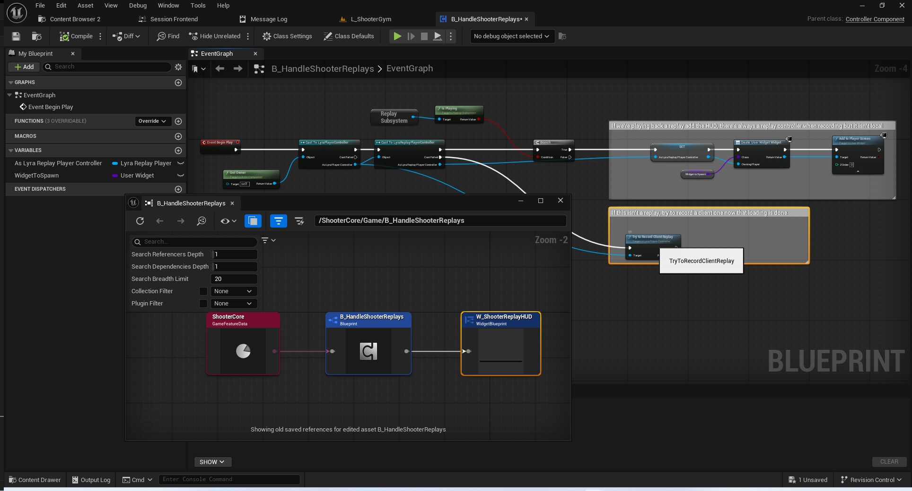
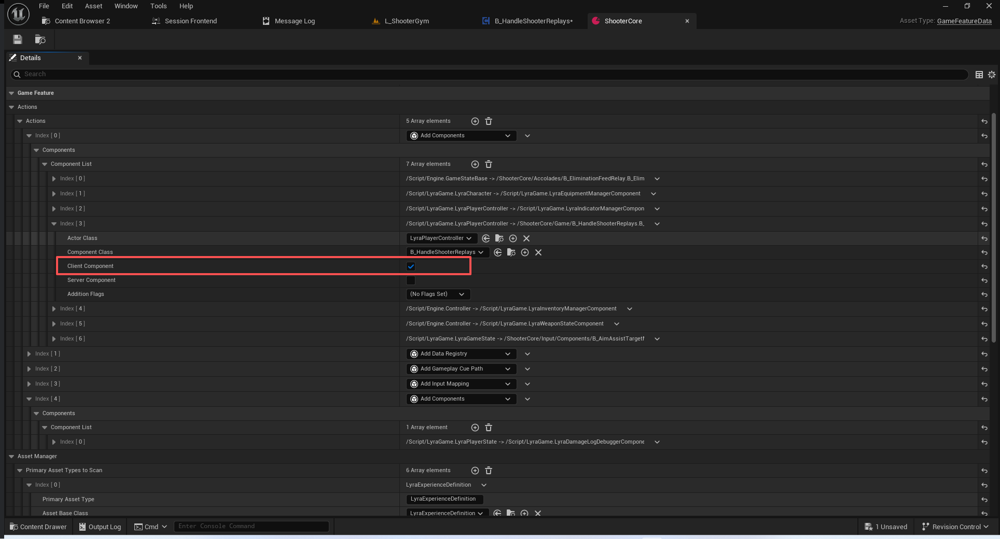

这个组件在游戏开始时会判断:
1.如果是正常游戏,则尝试记录回放
2.如果是在回放中, 则添加进度条

### 记录录像
#### 开启记录
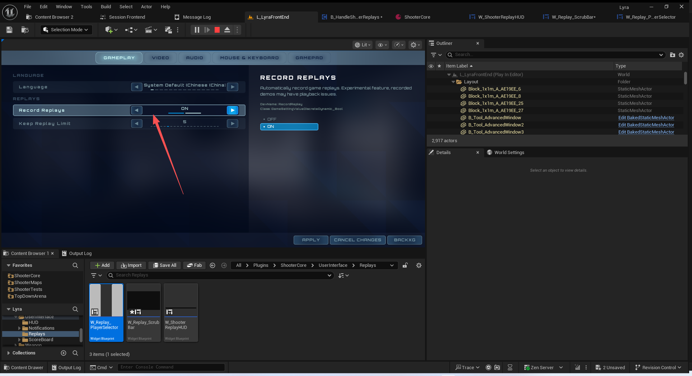
#### ALyraPlayerController
``` cpp
	// Call from game state logic to start recording an automatic client replay if ShouldRecordClientReplay returns true
	// 在游戏状态逻辑中，如果“应录制客户端回放”这一条件返回为真，则启动自动录制客户端回放的过程
	UFUNCTION(BlueprintCallable, Category = "Lyra|PlayerController")
	UE_API bool TryToRecordClientReplay();

	// Call to see if we should record a replay, subclasses could change this
	// 调用此方法以确定是否需要录制回放，子类可以对此进行修改
	UE_API virtual bool ShouldRecordClientReplay();

```
##### 检查是否允许记录
``` cpp

bool ALyraPlayerController::ShouldRecordClientReplay()
{
	UWorld* World = GetWorld();
	UGameInstance* GameInstance = GetGameInstance();
	
	if (GameInstance != nullptr &&
		World != nullptr &&
		!World->IsPlayingReplay() &&
		!World->IsRecordingClientReplay() &&
		NM_DedicatedServer != GetNetMode() &&
		IsLocalPlayerController())
	{
		// 游戏实例不能为空
		// 世界不能为空
		// 不能正在播放回放
		// 不能正在记录录像
		// 不能是专属服务器
		// 必须是本地控制的玩家控制器

		
		FString DefaultMap = UGameMapsSettings::GetGameDefaultMap();
		FString CurrentMap = World->URL.Map;

#if WITH_EDITOR
		CurrentMap = UWorld::StripPIEPrefixFromPackageName(CurrentMap, World->StreamingLevelsPrefix);
#endif
		if (CurrentMap == DefaultMap)
		{
			// Never record demos on the default frontend map, this could be replaced with a better check for being in the main menu
			// 请勿在默认的前端地图上录制演示内容，这一操作可以改为采用更有效的检查方式，以确认是否处于主菜单界面。
			return false;
		}

		if (UReplaySubsystem* ReplaySubsystem = GameInstance->GetSubsystem<UReplaySubsystem>())
		{
			if (ReplaySubsystem->IsRecording() || ReplaySubsystem->IsPlaying())
			{
				// Only one at a time
				// 一次只能一个
				return false;
			}
		}

		// If this is possible, now check the settings
		// 如果可行的话，现在就检查一下设置吧
		if (const ULyraLocalPlayer* LyraLocalPlayer = Cast<ULyraLocalPlayer>(GetLocalPlayer()))
		{
			if (LyraLocalPlayer->GetLocalSettings()->ShouldAutoRecordReplays())
			{
				return true;
			}
		}
	}
	return false;
}
```
##### 转发到子系统开始记录
``` cpp
bool ALyraPlayerController::TryToRecordClientReplay()
{
	// See if we should record a replay
	// 查看是否需要录制回放内容
	if (ShouldRecordClientReplay())
	{
		if (ULyraReplaySubsystem* ReplaySubsystem = GetGameInstance()->GetSubsystem<ULyraReplaySubsystem>())
		{
			APlayerController* FirstLocalPlayerController = GetGameInstance()->GetFirstLocalPlayerController();
			if (FirstLocalPlayerController == this)
			{
				// If this is the first player, update the spectator player for local replays and then record
				// 如果这是第一个玩家，则为本地回放更新旁观者玩家信息，然后进行记录
				if (ALyraGameState* GameState = Cast<ALyraGameState>(GetWorld()->GetGameState()))
				{
					GameState->SetRecorderPlayerState(PlayerState);

					ReplaySubsystem->RecordClientReplay(this);
					return true;
				}
			}
		}
	}
	return false;
}

```
``` cpp

void ULyraReplaySubsystem::RecordClientReplay(APlayerController* PlayerController)
{
	// 确保上下文正确
	if (ensure(DoesPlatformSupportReplays() && PlayerController))
	{
		// 生成一个友好方便阅读的名称
		FText FriendlyNameText = 
			FText::Format(NSLOCTEXT("Lyra", "LyraReplayName_Format", "Client Replay {0}"), 
				FText::AsDateTime(FDateTime::UtcNow(), EDateTimeStyle::Short, EDateTimeStyle::Short));
		
		// 转发到GameInstance处理
		/**
		* 以指定的自定义名称和友称名称开始录制回放。*
		* @参数 InName：若不为空，则作为回放的标识符使用，该名称需唯一。若为空，则回放流式传输实现将自动生成一个名称。
		* @参数 FriendlyName：可选（可为空）的描述性名称，用于回放。该名称无需保证唯一性。
		* @参数 AdditionalOptions：附加的 URL 选项，将附加到回放网络驱动程序将处理的 URL 上。通常为空。
		* @参数 AnalyticsProvider：可选的指向分析提供商的指针，若设置则也会传递给回放流式传输。*/
		GetGameInstance()->StartRecordingReplay(FString(), FriendlyNameText.ToString());

		if (ULyraLocalPlayer* LyraLocalPlayer = Cast<ULyraLocalPlayer>(PlayerController->GetLocalPlayer()))
		{
			// Start a cleanup of existing saved streams
			// 开始清理现有的已保存流
			// 读取本地设置中关于回放数量的保存
			int32 NumToKeep = LyraLocalPlayer->GetLocalSettings()->GetNumberOfReplaysToKeep();
			CleanupLocalReplays(LyraLocalPlayer, NumToKeep);
		}
	}
}
```
##### 修改TargetViewRotation的同步方式
``` cpp
void ALyraPlayerController::GetLifetimeReplicatedProps(TArray<FLifetimeProperty>& OutLifetimeProps) const
{
	Super::GetLifetimeReplicatedProps(OutLifetimeProps);

	// Disable replicating the PC target view as it doesn't work well for replays or client-side spectating.
	// The engine TargetViewRotation is only set in APlayerController::TickActor if the server knows ahead of time that 
	// a specific pawn is being spectated and it only replicates down for COND_OwnerOnly.
	// In client-saved replays, COND_OwnerOnly is never true and the target pawn is not always known at the time of recording.
	// To support client-saved replays, the replication of this was moved to ReplicatedViewRotation and updated in PlayerTick.

	// 禁用复制 PC 目标视图，因为这对于回放或客户端旁观模式来说效果不佳。
	// 在 APlayerController::TickActor 中，只有当服务器事先知道某个特定角色正在被旁观时，才会设置引擎的 TargetViewRotation 属性，并且只有在 COND_OwnerOnly 条件下才会进行复制。
	// 在客户端保存的回放中，COND_OwnerOnly 从不为真，而且在录制时也不总是知道目标角色的具体信息。
	// 为了支持客户端保存的回放，此属性的复制已移至 ReplicatedViewRotation，并在 PlayerTick 中进行更新。
	
	DISABLE_REPLICATED_PROPERTY(APlayerController, TargetViewRotation);
}


```
``` cpp
void APlayerController::GetLifetimeReplicatedProps(TArray< FLifetimeProperty > & OutLifetimeProps) const
{
	Super::GetLifetimeReplicatedProps(OutLifetimeProps);
	
	FDoRepLifetimeParams Params;
	Params.bIsPushBased = UE::Gameplay::CVars::bIsPlayerControllerPushBased;
	Params.Condition = COND_OwnerOnly;
	// These used to only replicate if PlayerCameraManager->GetViewTargetPawn() != GetPawn()
	// But, since they also don't update unless that condition is true, these values won't change, thus won't send
	// This is a little less efficient, but fits into the new condition system well, and shouldn't really add much overhead
	DOREPLIFETIME_WITH_PARAMS_FAST(APlayerController, TargetViewRotation, Params);

	// Replicate SpawnLocation for remote spectators
	DOREPLIFETIME_WITH_PARAMS_FAST(APlayerController, SpawnLocation, Params);
}


```
#### LyraGameState

``` cpp

	// The player state that recorded a replay, it is used to select the right pawn to follow
	// This is only set in replay streams and is not replicated normally
	// 玩家所记录的回放状态，用于选择正确的棋子进行跟随
	// 这种状态仅在回放流中设置，通常不会进行复制操作
	UPROPERTY(Transient, ReplicatedUsing = OnRep_RecorderPlayerState)
	TObjectPtr<APlayerState> RecorderPlayerState;

	UFUNCTION()
	UE_API void OnRep_RecorderPlayerState();

```
``` cpp
void ALyraGameState::GetLifetimeReplicatedProps(TArray<FLifetimeProperty>& OutLifetimeProps) const
{
	Super::GetLifetimeReplicatedProps(OutLifetimeProps);

	DOREPLIFETIME(ThisClass, ServerFPS);
	// 此属性仅用于发送至回放连接
	DOREPLIFETIME_CONDITION(ThisClass, RecorderPlayerState, COND_ReplayOnly);
}
```

``` cpp
void ALyraGameState::SetRecorderPlayerState(APlayerState* NewPlayerState)
{
	if (RecorderPlayerState == nullptr)
	{
		// Set it and call the rep callback so it can do any record-time setup
		// 设置该值并调用回调函数，以便其能够进行任何记录时的设置操作
		RecorderPlayerState = NewPlayerState;
		OnRep_RecorderPlayerState();
	}
	else
	{
		UE_LOG(LogLyra, Warning, TEXT("SetRecorderPlayerState was called on %s but should only be called once per game on the primary user"), *GetName());
	}
}
APlayerState* ALyraGameState::GetRecorderPlayerState() const
{
	// TODO: Maybe auto select it if null?
	// 注意事项：如果为空值，或许可以自动将其选中？
	return RecorderPlayerState;
}

void ALyraGameState::OnRep_RecorderPlayerState()
{
	OnRecorderPlayerStateChangedEvent.Broadcast(RecorderPlayerState);
}
```
#### ALyraReplayPlayerController
##### 头文件
``` cpp
// A player controller used for replay capture and playback
// 用于录制和回放的玩家控制器
UCLASS()
class ALyraReplayPlayerController : public ALyraPlayerController
{
	GENERATED_BODY()

	virtual void Tick(float DeltaSeconds) override;
	virtual void SmoothTargetViewRotation(APawn* TargetPawn, float DeltaSeconds) override;
	virtual bool ShouldRecordClientReplay() override;

	// Callback for when the game state's RecorderPlayerState gets replicated during replay playback
	// 当在回放过程中游戏状态的“记录玩家状态”被复制时的回调函数
	void RecorderPlayerStateUpdated(APlayerState* NewRecorderPlayerState);

	// Callback for when the followed player state changes pawn
	// 当关注的玩家状态发生变化时（例如角色状态改变）的回调函数
	UFUNCTION()
	void OnPlayerStatePawnSet(APlayerState* ChangedPlayerState, APawn* NewPlayerPawn, APawn* OldPlayerPawn);

	// The player state we are currently following */
	// 我们当前所遵循的玩家状态 */
	UPROPERTY(Transient)
	TObjectPtr<APlayerState> FollowedPlayerState;
};


```
##### 监听视图对象的变化以便响应

``` cpp
void ALyraReplayPlayerController::Tick(float DeltaSeconds)
{
	Super::Tick(DeltaSeconds);

	// The state may go invalid at any time due to scrubbing during a replay
	// 由于在重放过程中进行的数据清除操作，该状态可能会随时失效。
	if (!IsValid(FollowedPlayerState))
	{
		UWorld* World = GetWorld();

		// Listen for changes for both recording and playback
		// 监听录制和播放过程中的任何变化
		if (ALyraGameState* GameState = Cast<ALyraGameState>(World->GetGameState()))
		{
			if (!GameState->OnRecorderPlayerStateChangedEvent.IsBoundToObject(this))
			{
				GameState->OnRecorderPlayerStateChangedEvent.AddUObject(this, &ThisClass::RecorderPlayerStateUpdated);
			}
			if (APlayerState* RecorderState = GameState->GetRecorderPlayerState())
			{
				RecorderPlayerStateUpdated(RecorderState);
			}
		}
	}
}

```

``` cpp
void ALyraReplayPlayerController::RecorderPlayerStateUpdated(APlayerState* NewRecorderPlayerState)
{
	if (NewRecorderPlayerState)
	{
		FollowedPlayerState = NewRecorderPlayerState;

		// Bind to when pawn changes and call now
		// 当兵种发生变化时绑定此操作，并立即执行
		NewRecorderPlayerState->OnPawnSet.AddUniqueDynamic(this, &ALyraReplayPlayerController::OnPlayerStatePawnSet);
		OnPlayerStatePawnSet(NewRecorderPlayerState, NewRecorderPlayerState->GetPawn(), nullptr);
	}
}

```
##### 其他函数
``` cpp
void ALyraReplayPlayerController::SmoothTargetViewRotation(APawn* TargetPawn, float DeltaSeconds)
{
	// Default behavior is to interpolate to TargetViewRotation which is set from APlayerController::TickActor but it's not very smooth
	// 默认情况下，会将值插值到“目标视图旋转”这一变量中，该变量是由 APlayerController::TickActor 方法设置的，但其过渡效果并不十分流畅。
	Super::SmoothTargetViewRotation(TargetPawn, DeltaSeconds);
}

bool ALyraReplayPlayerController::ShouldRecordClientReplay()
{
	return false;
}

```
#### 结束录制
此处需要查看GameInstanc的函数
``` cpp
UCLASS(config=Game, transient, BlueprintType, Blueprintable, MinimalAPI)
class UGameInstance : public UObject, public FExec
{
	GENERATED_UCLASS_BODY()

	/**
	 * Start recording a replay with the given custom name and friendly name.
	 *
	 * @param InName If not empty, the unique name to use as an identifier for the replay. If empty, a name will be automatically generated by the replay streamer implementation.
	 * @param FriendlyName An optional (may be empty) descriptive name for the replay. Does not have to be unique.
	 * @param AdditionalOptions Additional URL options to append to the URL that will be processed by the replay net driver. Will usually remain empty.
	 * @param AnalyticsProvider Optional pointer to an analytics provider which will also be passed to the replay streamer if set
	 */
	ENGINE_API virtual void StartRecordingReplay(const FString& InName, const FString& FriendlyName, const TArray<FString>& AdditionalOptions = TArray<FString>(), TSharedPtr<IAnalyticsProvider> AnalyticsProvider = nullptr);

	/** Stop recording a replay if one is currently in progress */
	ENGINE_API virtual void StopRecordingReplay();

	/**
	 * Start playing back a previously recorded replay.
	 *
	 * @param InName				Name of the replay file.
	 * @param WorldOverride			World in which the replay will be played. Passing null will cause the current world to be used.
	 * @param AdditionalOptions		Additional options that can be read by derived game instances, or the Demo Net Driver.
	 *
	 * @return True if the replay began successfully.
	 */
	ENGINE_API virtual bool PlayReplay(const FString& InName, UWorld* WorldOverride = nullptr, const TArray<FString>& AdditionalOptions = TArray<FString>());

	/**
	 * Start playing back a playlist of previously recorded replays.
	 *
	 * Using "ExitAfterReplay" on the command line will cause the system to exit *after* the last
	 * replay has been played.
	 *
	 * Using the "Demo.Loop" CVar will cause the entire replay playlist to loop.
	 *
	 * @return True if the first replay began successfully.
	 */
	ENGINE_API bool PlayReplayPlaylist(const struct FReplayPlaylistParams& PlaylistParams);

	/**
	 * Adds a join-in-progress user to the set of users associated with the currently recording replay (if any)
	 *
	 * @param UserString a string that uniquely identifies the user, usually their FUniqueNetId
	 */
	ENGINE_API virtual void AddUserToReplay(const FString& UserString);

}
```
``` cpp
bool UWorld::HandleDemoStopCommand( const TCHAR* Cmd, FOutputDevice& Ar, UWorld* InWorld )
{
	if ( InWorld != nullptr && InWorld->GetGameInstance() != nullptr )
	{
		InWorld->GetGameInstance()->StopRecordingReplay();
	}

	return true;
}


```
``` cpp
void AGameMode::HandleMatchHasEnded()
{
	GameSession->HandleMatchHasEnded();

	if (IsHandlingReplays() && GetGameInstance() != nullptr)
	{
		GetGameInstance()->StopRecordingReplay();
	}
}

```

``` cpp
void UReplaySubsystem::StopReplay()
{
	if (UWorld* CurrentWorld = GetWorld())
	{
		const bool bWasReplaying = CurrentWorld->IsPlayingReplay();

		StopExistingReplays(CurrentWorld);

		if (UGameInstance* GameInstance = GetGameInstance())
		{
			if (bWasReplaying && bLoadDefaultMapOnStop)
			{
				GEngine->BrowseToDefaultMap(*GameInstance->GetWorldContext());
			}
		}
	}
	else
	{
		UE_LOG(LogDemo, Warning, TEXT("UReplaySubsystem::StopRecordingReplay: GetWorld() is null"));
	}
}


```
以上都不是本项目停止录像的方式
下面这个才是
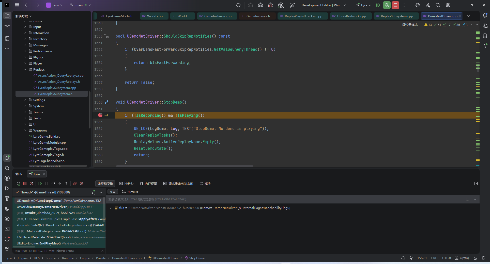

``` cpp

void UDemoNetDriver::StopDemo()
{
	if (!IsRecording() && !IsPlaying())
	{
		UE_LOG(LogDemo, Log, TEXT("StopDemo: No demo is playing"));
		ClearReplayTasks();
		ReplayHelper.ActiveReplayName.Empty();
		ResetDemoState();
		return;
	}

	UE_LOG(LogDemo, Log, TEXT("StopDemo: Demo %s stopped at frame %d"), *ReplayHelper.DemoURL.Map, GetDemoFrameNum());

	if (!ServerConnection)
	{
		// let GC cleanup the object
		if (ClientConnections.Num() > 0 && ClientConnections[0] != nullptr)
		{
			ClientConnections[0]->Close();
		}
	}
	else
	{
		// flush out any pending network traffic
		ServerConnection->FlushNet();

		ServerConnection->SetConnectionState(USOCK_Closed);
		ServerConnection->Close();
	}

	ReplayHelper.StopReplay();

	SpectatorControllers.Empty();
	SpectatorController = nullptr;

	ClearReplayTasks();
	ResetDemoState();

	check(!IsRecording() && !IsPlaying());
}
```

### 播放录像

#### 回放列表

异步查询录像入口:
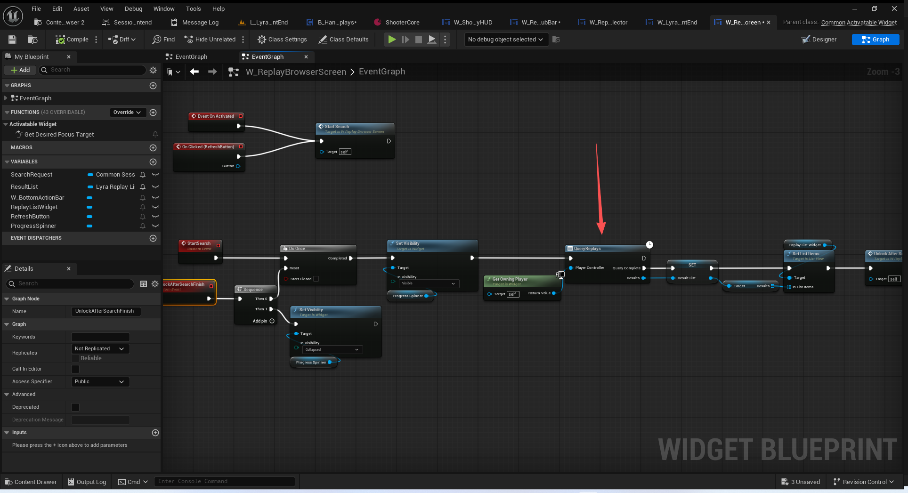


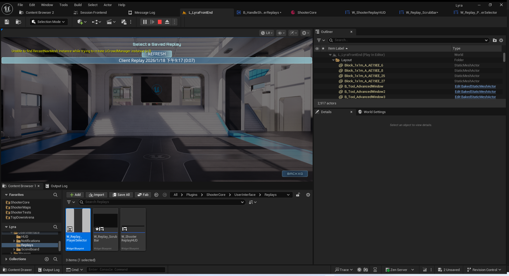
#### 列表子项
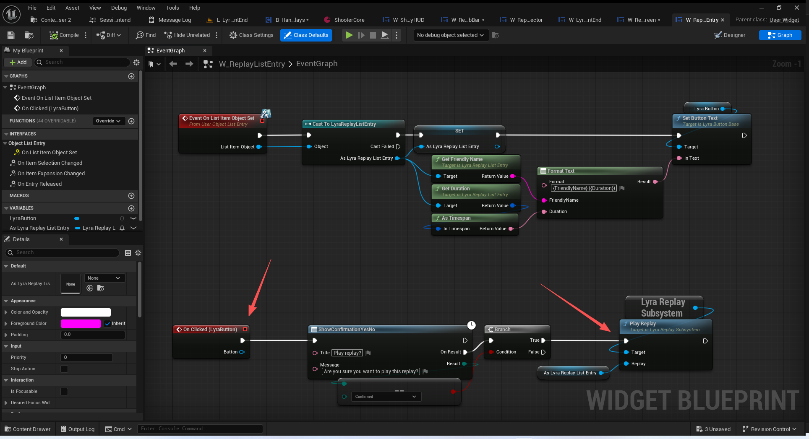

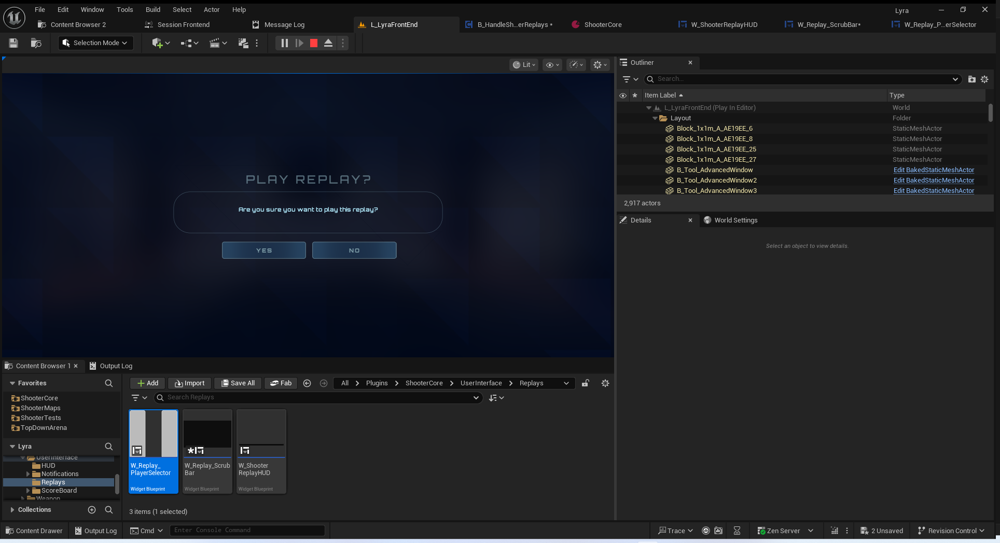
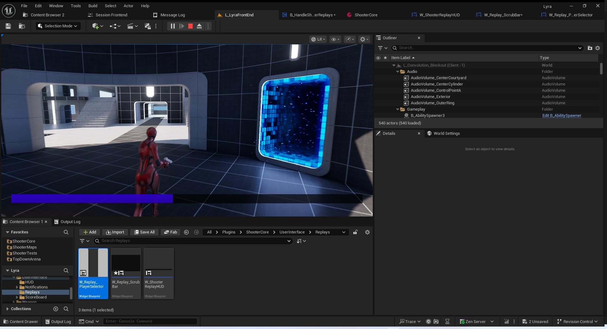

#### 进度条
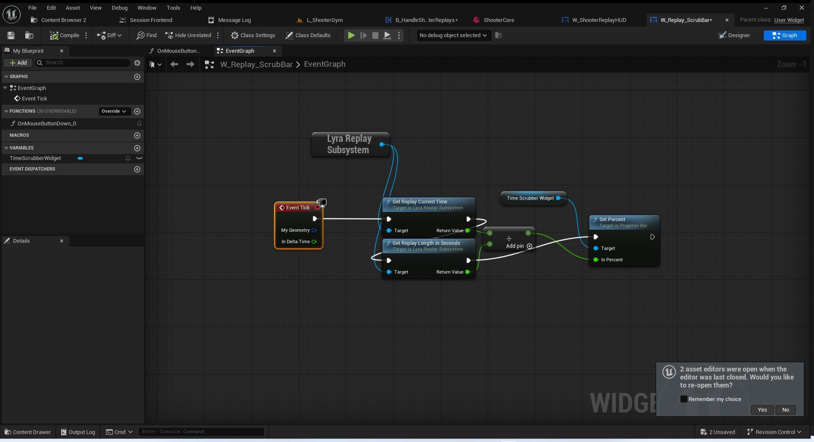
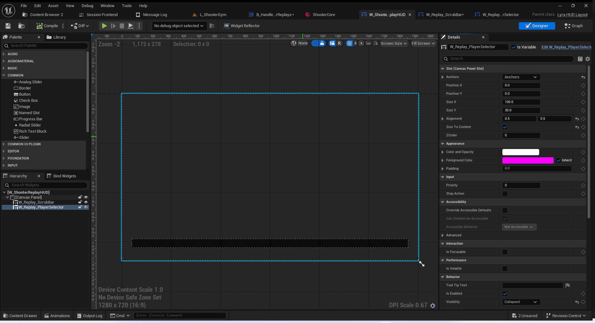
注意,这个拖动播放时间这个功能应该是没有做,看空间蓝图是空的.
#### 转发到子系统播放
``` cpp
void ULyraReplaySubsystem::PlayReplay(ULyraReplayListEntry* Replay)
{
	if (Replay != nullptr)
	{
		FString DemoName = Replay->StreamInfo.Name;
		GetGameInstance()->PlayReplay(DemoName);
	}
}

```

## 总结
本节并未讲解回放系统的底层代码以及之前讲过的暴露到前端界面的回放设置.
了解Lyra中关于这部分的使用即可!