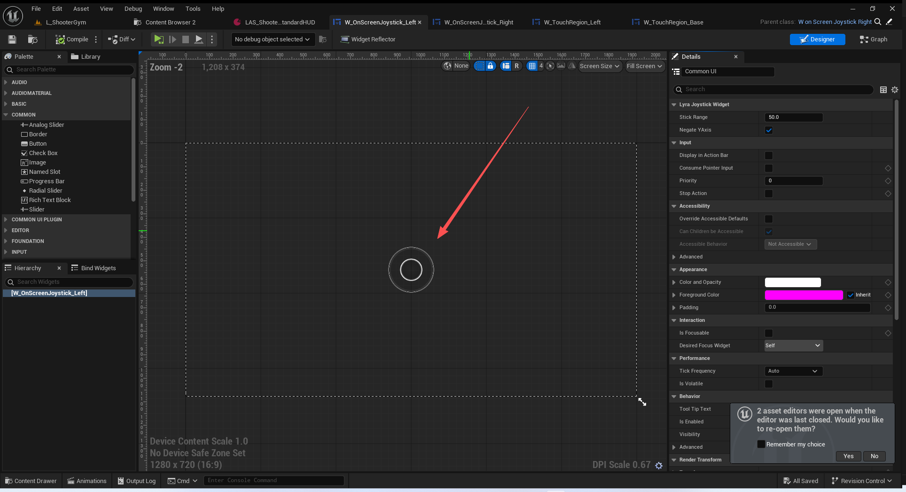
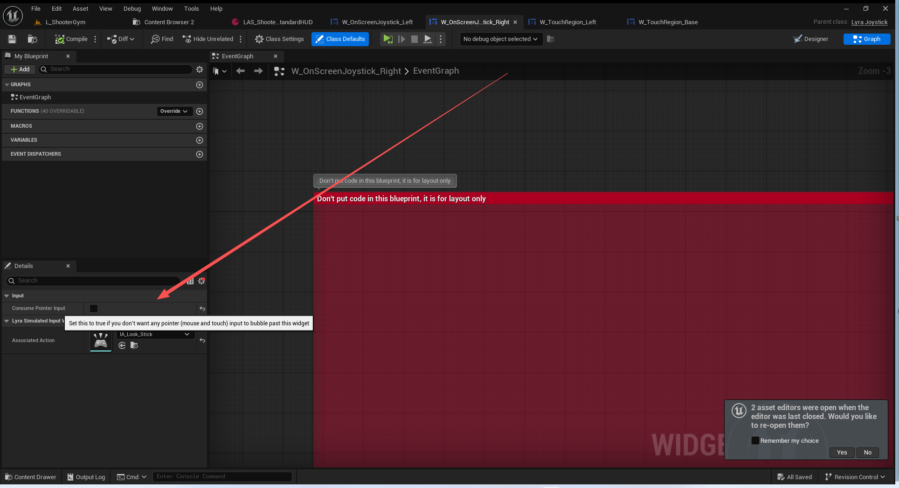
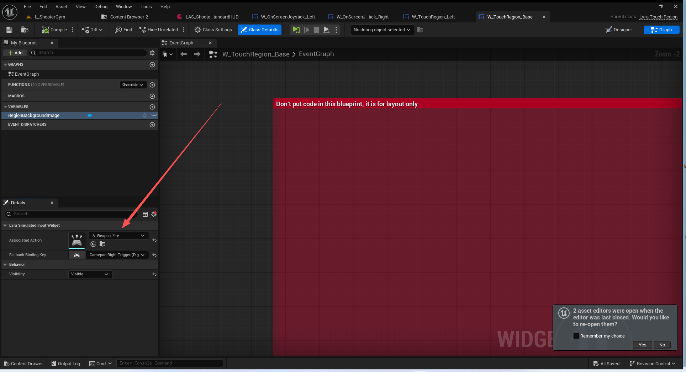

# UE5_Lyra学习指南_118_补充Game模块代码

本文章仅为小刚-B站课堂-虚幻引擎视频课程Lyra-精讲的演讲手稿.  
本套课程链接:[[UE5]虚幻引擎游戏案例Lyra精讲](https://www.bilibili.com/cheese/play/ss112001159)  
前置课程链接:[[UE5]虚幻引擎UEC++从基础到进阶](https://www.bilibili.com/cheese/play/ss28043)  

文章内容由小刚撰写,采用了以下多种方式:  
1.口述转文字  
2.AI重构  
3.参考引擎源码  
4.Lyra工程源码  
5.结合社区论坛各位大佬的解析  

- [UE5\_Lyra学习指南\_118\_补充Game模块代码](#ue5_lyra学习指南_118_补充game模块代码)
	- [概述](#概述)
	- [修复出生时激活的能力](#修复出生时激活的能力)
	- [消息的快速同步列表](#消息的快速同步列表)
	- [查询网络模式](#查询网络模式)
	- [进度条的控件](#进度条的控件)
	- [模拟输入控件](#模拟输入控件)
		- [操纵杆的控件](#操纵杆的控件)
		- [触屏输入控件](#触屏输入控件)
	- [总结](#总结)


## 概述
本节主要全面核查LyraGame模块下的代码,避免遗漏
## 修复出生时激活的能力
``` cpp

void ALyraPlayerController::CleanupPlayerState()
{
	Super::CleanupPlayerState();
	BroadcastOnPlayerStateChanged();


	// When we're a client connected to a remote server, the player controller may replicate later than the PlayerState and AbilitySystemComponent.
	// However, TryActivateAbilitiesOnSpawn depends on the player controller being replicated in order to check whether on-spawn abilities should
	// execute locally. Therefore once the PlayerController exists and has resolved the PlayerState, try once again to activate on-spawn abilities.
	// On other net modes the PlayerController will never replicate late, so LyraASC's own TryActivateAbilitiesOnSpawn calls will succeed. The handling 
	// here is only for when the PlayerState and ASC replicated before the PC and incorrectly thought the abilities were not for the local player.

	// 当我们作为客户端连接到远程服务器时，玩家控制器的同步可能会晚于玩家状态和能力系统组件的同步。
	// 但是，TryActivateAbilitiesOnSpawn 函数依赖于玩家控制器已进行同步，以便检查是否应在游戏启动时本地执行初始能力。因此，一旦玩家控制器存在并已解析玩家状态，就再次尝试激活初始能力。
	// 在其他网络模式下，玩家控制器永远不会同步较晚，所以 LyraASC 的自身 TryActivateAbilitiesOnSpawn 调用将成功。此处的处理方式仅适用于当玩家状态和 ASC 在玩家控制器同步之前已进行同步，并且错误地认为这些能力并非针对本地玩家时的情况。

	if (GetWorld()->IsNetMode(NM_Client))
	{
		if (ALyraPlayerState* LyraPS = GetPlayerState<ALyraPlayerState>())
		{
			if (ULyraAbilitySystemComponent* LyraASC = LyraPS->GetLyraAbilitySystemComponent())
			{
				LyraASC->RefreshAbilityActorInfo();
				
				//@XGTODO:我们现在还没有定义角色出生时就需要激活的能力
				//LyraASC->TryActivateAbilitiesOnSpawn();

				
			}

			
		}

		
	}
	
}

```
## 消息的快速同步列表
未使用
LyraVerbMessageReplication.h
``` cpp

/**
 * Represents one verb message
 */
USTRUCT(BlueprintType)
struct FLyraVerbMessageReplicationEntry : public FFastArraySerializerItem
{
	GENERATED_BODY()

	FLyraVerbMessageReplicationEntry()
	{}

	FLyraVerbMessageReplicationEntry(const FLyraVerbMessage& InMessage)
		: Message(InMessage)
	{
	}

	FString GetDebugString() const;

private:
	friend FLyraVerbMessageReplication;

	UPROPERTY()
	FLyraVerbMessage Message;
};

/** Container of verb messages to replicate */
USTRUCT(BlueprintType)
struct FLyraVerbMessageReplication : public FFastArraySerializer
{
	GENERATED_BODY()

	FLyraVerbMessageReplication()
	{
	}

public:
	void SetOwner(UObject* InOwner) { Owner = InOwner; }

	// Broadcasts a message from server to clients
	void AddMessage(const FLyraVerbMessage& Message);

	//~FFastArraySerializer contract
	void PreReplicatedRemove(const TArrayView<int32> RemovedIndices, int32 FinalSize);
	void PostReplicatedAdd(const TArrayView<int32> AddedIndices, int32 FinalSize);
	void PostReplicatedChange(const TArrayView<int32> ChangedIndices, int32 FinalSize);
	//~End of FFastArraySerializer contract

	bool NetDeltaSerialize(FNetDeltaSerializeInfo& DeltaParms)
	{
		return FFastArraySerializer::FastArrayDeltaSerialize<FLyraVerbMessageReplicationEntry, FLyraVerbMessageReplication>(CurrentMessages, DeltaParms, *this);
	}

private:
	void RebroadcastMessage(const FLyraVerbMessage& Message);

private:
	// Replicated list of gameplay tag stacks
	UPROPERTY()
	TArray<FLyraVerbMessageReplicationEntry> CurrentMessages;
	
	// Owner (for a route to a world)
	UPROPERTY()
	TObjectPtr<UObject> Owner = nullptr;
};

template<>
struct TStructOpsTypeTraits<FLyraVerbMessageReplication> : public TStructOpsTypeTraitsBase2<FLyraVerbMessageReplication>
{
	enum
	{
		WithNetDeltaSerializer = true,
	};
};
```
``` cpp
//////////////////////////////////////////////////////////////////////
// FLyraVerbMessageReplicationEntry

FString FLyraVerbMessageReplicationEntry::GetDebugString() const
{
	return Message.ToString();
}

//////////////////////////////////////////////////////////////////////
// FLyraVerbMessageReplication

void FLyraVerbMessageReplication::AddMessage(const FLyraVerbMessage& Message)
{
	FLyraVerbMessageReplicationEntry& NewStack = CurrentMessages.Emplace_GetRef(Message);
	MarkItemDirty(NewStack);
}

void FLyraVerbMessageReplication::PreReplicatedRemove(const TArrayView<int32> RemovedIndices, int32 FinalSize)
{
// 	for (int32 Index : RemovedIndices)
// 	{
// 		const FGameplayTag Tag = CurrentMessages[Index].Tag;
// 		TagToCountMap.Remove(Tag);
// 	}
}

void FLyraVerbMessageReplication::PostReplicatedAdd(const TArrayView<int32> AddedIndices, int32 FinalSize)
{
	for (int32 Index : AddedIndices)
	{
		const FLyraVerbMessageReplicationEntry& Entry = CurrentMessages[Index];
		RebroadcastMessage(Entry.Message);
	}
}

void FLyraVerbMessageReplication::PostReplicatedChange(const TArrayView<int32> ChangedIndices, int32 FinalSize)
{
	for (int32 Index : ChangedIndices)
	{
		const FLyraVerbMessageReplicationEntry& Entry = CurrentMessages[Index];
		RebroadcastMessage(Entry.Message);
	}
}

void FLyraVerbMessageReplication::RebroadcastMessage(const FLyraVerbMessage& Message)
{
	check(Owner);
	UGameplayMessageSubsystem& MessageSystem = UGameplayMessageSubsystem::Get(Owner);
	MessageSystem.BroadcastMessage(Message.Verb, Message);
}


```
## 查询网络模式
LyraActorUtilities.h
``` cpp

UENUM()
enum class EBlueprintExposedNetMode : uint8
{
	/** Standalone: a game without networking, with one or more local players. Still considered a server because it has all server functionality. */
	Standalone,

	/** Dedicated server: server with no local players. */
	DedicatedServer,

	/** Listen server: a server that also has a local player who is hosting the game, available to other players on the network. */
	ListenServer,

	/**
	 * Network client: client connected to a remote server.
	 * Note that every mode less than this value is a kind of server, so checking NetMode < NM_Client is always some variety of server.
	 */
	Client
};


UCLASS()
class ULyraActorUtilities : public UBlueprintFunctionLibrary
{
	GENERATED_BODY()

public:
	/**
	 * Get the network mode (dedicated server, client, standalone, etc...) for an actor or component.
	 */
	UFUNCTION(BlueprintCallable, Category="Lyra", meta=(WorldContext="WorldContextObject", ExpandEnumAsExecs=ReturnValue))
	static EBlueprintExposedNetMode SwitchOnNetMode(const UObject* WorldContextObject);
};

```
``` cpp
EBlueprintExposedNetMode ULyraActorUtilities::SwitchOnNetMode(const UObject* WorldContextObject)
{
	ENetMode NetMode = NM_Standalone;
	for (const UObject* TestObject = WorldContextObject; TestObject != nullptr; TestObject = TestObject->GetOuter())
	{
		if (const UActorComponent* Component = Cast<const UActorComponent>(WorldContextObject))
		{
			NetMode = Component->GetNetMode();
			break;
		}
		else if (const AActor* Actor = Cast<const AActor>(WorldContextObject))
		{
			NetMode = Actor->GetNetMode();
			break;
		}
	}

	switch (NetMode)
	{
	case NM_Client:
		return EBlueprintExposedNetMode::Client;
	case NM_Standalone:
		return EBlueprintExposedNetMode::Standalone;
	case NM_DedicatedServer:
		return EBlueprintExposedNetMode::DedicatedServer;
	case NM_ListenServer:
		return EBlueprintExposedNetMode::ListenServer;
	default:
		ensure(false);
		return EBlueprintExposedNetMode::Standalone;
	}
}


```

## 进度条的控件
MaterialProgressBar.h
``` cpp

UCLASS(Abstract, meta = (DisableNativeTick))
class UMaterialProgressBar : public UCommonUserWidget
{
	GENERATED_BODY()

protected:

	virtual void SynchronizeProperties() override;

#if WITH_EDITOR
	virtual void OnWidgetRebuilt() override;
#endif

	virtual void OnAnimationFinished_Implementation(const UWidgetAnimation* Animation) override;

public:

	UFUNCTION(BlueprintCallable)
	void SetProgress(float Progress);

	UFUNCTION(BlueprintCallable)
	void SetStartProgress(float StartProgress);

	UFUNCTION(BlueprintCallable)
	void SetColorA(FLinearColor ColorA);

	UFUNCTION(BlueprintCallable)
	void SetColorB(FLinearColor ColorB);

	UFUNCTION(BlueprintCallable)
	void SetColorBackground(FLinearColor ColorBackground);

	UFUNCTION(BlueprintCallable)
	void AnimateProgressFromStart(float Start, float End, float AnimSpeed = 1.0f);

	UFUNCTION(BlueprintCallable)
	void AnimateProgressFromCurrent(float End, float AnimSpeed = 1.0f);

	DECLARE_DYNAMIC_MULTICAST_DELEGATE(FOnFillAnimationFinished);

	UPROPERTY(BlueprintAssignable)
	FOnFillAnimationFinished OnFillAnimationFinished;

private:

	void SetProgress_Internal(float Progress);
	void SetStartProgress_Internal(float StartProgress);
	void SetColorA_Internal(FLinearColor ColorA);
	void SetColorB_Internal(FLinearColor ColorB);
	void SetColorBackground_Internal(FLinearColor ColorBackground);

	UMaterialInstanceDynamic* GetBarDynamicMaterial() const;

	UPROPERTY(EditAnywhere, meta = (InlineEditConditionToggle = "CachedColorA"))
	bool bOverrideDefaultColorA = false;

	UPROPERTY(EditAnywhere, meta = (DisplayName = "Color A", EditCondition = "bOverrideDefaultColorA"))
	FLinearColor CachedColorA;

	UPROPERTY(EditAnywhere, meta = (InlineEditConditionToggle = "CachedColorB"))
	bool bOverrideDefaultColorB = false;

	UPROPERTY(EditAnywhere, meta = (DisplayName = "Color B", EditCondition = "bOverrideDefaultColorB"))
	FLinearColor CachedColorB;

	UPROPERTY(EditAnywhere, meta = (InlineEditConditionToggle = "CachedColorBackground"))
	bool bOverrideDefaultColorBackground;

	UPROPERTY(EditAnywhere, meta = (DisplayName = "Color Background", EditCondition = "bOverrideDefaultColorBackground"))
	FLinearColor CachedColorBackground;

	UPROPERTY(EditAnywhere, meta = (InlineEditConditionToggle = "Segments"))
	bool bOverrideDefaultSegments = false;

	UPROPERTY(EditAnywhere, meta = (EditCondition = "bOverrideDefaultSegments"))
	int32 Segments;

	UPROPERTY(EditAnywhere, meta = (InlineEditConditionToggle = "SegmentEdge"))
	bool bOverrideDefaultSegmentEdge = false;

	UPROPERTY(EditAnywhere, meta = (EditCondition = "bOverrideDefaultSegmentEdge"))
	float SegmentEdge;

	UPROPERTY(EditAnywhere, meta = (InlineEditConditionToggle = "FillEdgeSoftness"))
	bool bOverrideDefaultFillEdgeSoftness;

	UPROPERTY(EditAnywhere, meta = (EditCondition = "bOverrideDefaultFillEdgeSoftness"))
	float FillEdgeSoftness;

	UPROPERTY(EditAnywhere, meta = (InlineEditConditionToggle = "GlowEdge"))
	bool bOverrideDefaultGlowEdge = false;

	UPROPERTY(EditAnywhere, meta = (EditCondition = "bOverrideDefaultGlowEdge"))
	float GlowEdge;

	UPROPERTY(EditAnywhere, meta = (InlineEditConditionToggle = "GlowSoftness"))
	bool bOverrideDefaultGlowSoftness = false;

	UPROPERTY(EditAnywhere, meta = (EditCondition = "bOverrideDefaultGlowSoftness"))
	float GlowSoftness;

	UPROPERTY(EditAnywhere, meta = (InlineEditConditionToggle = "OutlineScale"))
	bool bOverrideDefaultOutlineScale = false;

	UPROPERTY(EditAnywhere, meta = (EditCondition = "bOverrideDefaultOutlineScale"))
	float OutlineScale;

	UPROPERTY(EditAnywhere)
	bool bUseStroke = true;

	UPROPERTY(EditDefaultsOnly)
	TObjectPtr<UMaterialInterface> StrokeMaterial;

	UPROPERTY(EditDefaultsOnly)
	TObjectPtr<UMaterialInterface> NoStrokeMaterial;

#if WITH_EDITORONLY_DATA
	UPROPERTY(EditAnywhere, meta = (DisplayName = "Design Time Progress"))
	float DesignTime_Progress = 1.0f;
#endif

	UPROPERTY(BlueprintReadOnly, meta = (BindWidget, AllowPrivateAccess))
	TObjectPtr<UImage> Image_Bar;

	UPROPERTY(BlueprintReadOnly, Transient, meta = (BindWidgetAnim, AllowPrivateAccess))
	TObjectPtr<UWidgetAnimation> BoundAnim_FillBar;

	UPROPERTY(Transient)
	mutable TObjectPtr<UMaterialInstanceDynamic> CachedMID;

	float CachedProgress = -1.0f;
	float CachedStartProgress = -1.0f;
};

```
``` cpp
void UMaterialProgressBar::SynchronizeProperties()
{
	Super::SynchronizeProperties();

	if (Image_Bar)
	{
		Image_Bar->SetBrushFromMaterial(bUseStroke ? StrokeMaterial : NoStrokeMaterial);
		CachedMID = nullptr;
		CachedProgress = -1.0f;
		CachedStartProgress = -1.0f;

#if WITH_EDITORONLY_DATA
		if (IsDesignTime())
		{
			SetProgress_Internal(DesignTime_Progress);
		}
#endif

		if (UMaterialInstanceDynamic* MID = GetBarDynamicMaterial())
		{
			if (bOverrideDefaultSegmentEdge)
			{
				MID->SetScalarParameterValue(TEXT("SegmentEdge"), SegmentEdge);
			}

			if (bOverrideDefaultSegments)
			{
				MID->SetScalarParameterValue(TEXT("Segments"), (float)Segments);
			}

			if (bOverrideDefaultFillEdgeSoftness)
			{
				MID->SetScalarParameterValue(TEXT("FillEdgeSoftness"), FillEdgeSoftness);
			}

			if (bOverrideDefaultGlowEdge)
			{
				MID->SetScalarParameterValue(TEXT("GlowEdge"), GlowEdge);
			}

			if (bOverrideDefaultGlowSoftness)
			{
				MID->SetScalarParameterValue(TEXT("GlowSoftness"), GlowSoftness);
			}

			if (bOverrideDefaultOutlineScale)
			{
				MID->SetScalarParameterValue(TEXT("OutlineScale"), OutlineScale);
			}
		}

		if (bOverrideDefaultColorA)
		{
			SetColorA_Internal(CachedColorA);
		}

		if (bOverrideDefaultColorB)
		{
			SetColorB_Internal(CachedColorB);
		}

		if (bOverrideDefaultColorBackground)
		{
			SetColorBackground_Internal(CachedColorBackground);
		}
	}
}

#if WITH_EDITOR
void UMaterialProgressBar::OnWidgetRebuilt()
{
	Super::OnWidgetRebuilt();

	if (IsDesignTime() && Image_Bar)
	{
		if (UMaterialInstanceDynamic* MID = GetBarDynamicMaterial())
		{
			if (!bOverrideDefaultColorA)
			{
				MID->GetVectorParameterValue(TEXT("ColorA"), CachedColorA);
			}

			if (!bOverrideDefaultColorB)
			{
				MID->GetVectorParameterValue(TEXT("ColorB"), CachedColorB);
			}

			if (!bOverrideDefaultColorBackground)
			{
				MID->GetVectorParameterValue(TEXT("Unfilled Color"), CachedColorBackground);
			}

			if (!bOverrideDefaultSegmentEdge)
			{
				MID->GetScalarParameterValue(TEXT("SegmentEdge"), SegmentEdge);
			}

			if (!bOverrideDefaultSegments)
			{
				float SegmentsFloat;
				MID->GetScalarParameterValue(TEXT("Segments"), SegmentsFloat);
				Segments = FMath::TruncToInt(SegmentsFloat);
			}

			if (!bOverrideDefaultFillEdgeSoftness)
			{
				MID->GetScalarParameterValue(TEXT("FillEdgeSoftness"), FillEdgeSoftness);
			}

			if (!bOverrideDefaultGlowEdge)
			{
				MID->GetScalarParameterValue(TEXT("GlowEdge"), GlowEdge);
			}

			if (!bOverrideDefaultGlowSoftness)
			{
				MID->GetScalarParameterValue(TEXT("GlowSoftness"), GlowSoftness);
			}

			if (!bOverrideDefaultOutlineScale)
			{
				MID->GetScalarParameterValue(TEXT("OutlineScale"), OutlineScale);
			}
		}
	}
}
#endif

void UMaterialProgressBar::OnAnimationFinished_Implementation(const UWidgetAnimation* Animation)
{
	Super::OnAnimationFinished_Implementation(Animation);

	if (BoundAnim_FillBar == Animation)
	{
		OnFillAnimationFinished.Broadcast();
	}
}

void UMaterialProgressBar::SetProgress(float Progress)
{
	if (CachedProgress != Progress)
	{
		SetProgress_Internal(Progress);
	}
}

void UMaterialProgressBar::SetStartProgress(float StartProgress)
{
	if (CachedStartProgress != StartProgress)
	{
		SetStartProgress_Internal(StartProgress);
	}
}

void UMaterialProgressBar::SetColorA(FLinearColor ColorA)
{
	if (CachedColorA != ColorA)
	{
		SetColorA_Internal(ColorA);
	}
}

void UMaterialProgressBar::SetColorB(FLinearColor ColorB)
{
	if (CachedColorB != ColorB)
	{
		SetColorB_Internal(ColorB);
	}
}

void UMaterialProgressBar::SetColorBackground(FLinearColor ColorBackground)
{
	if (CachedColorBackground != ColorBackground)
	{
		SetColorBackground_Internal(ColorBackground);
	}
}

void UMaterialProgressBar::AnimateProgressFromStart(float Start, float End, float AnimSpeed)
{
	SetStartProgress(Start);
	SetProgress(End);
	PlayAnimation(BoundAnim_FillBar, 0.0f, 1, EUMGSequencePlayMode::Forward, AnimSpeed);
}

void UMaterialProgressBar::AnimateProgressFromCurrent(float End, float AnimSpeed)
{
	if (UMaterialInstanceDynamic* MID = GetBarDynamicMaterial())
	{
		const float CurrentStart = MID->K2_GetScalarParameterValue(TEXT("StartProgress"));
		const float CurrentEnd = MID->K2_GetScalarParameterValue(TEXT("Progress"));
		const float CurrentFill = MID->K2_GetScalarParameterValue(TEXT("FillAmount"));
		const float NewStart = FMath::Lerp(CurrentStart, CurrentEnd, CurrentFill);
		AnimateProgressFromStart(NewStart, End, AnimSpeed);
	}
}

void UMaterialProgressBar::SetProgress_Internal(float Progress)
{
	if (UMaterialInstanceDynamic* MID = GetBarDynamicMaterial())
	{
		CachedProgress = Progress;
		MID->SetScalarParameterValue(TEXT("Progress"), CachedProgress);
	}
}

void UMaterialProgressBar::SetStartProgress_Internal(float StartProgress)
{
	if (UMaterialInstanceDynamic* MID = GetBarDynamicMaterial())
	{
		CachedStartProgress = StartProgress;
		MID->SetScalarParameterValue(TEXT("StartProgress"), CachedStartProgress);
	}
}

void UMaterialProgressBar::SetColorA_Internal(FLinearColor ColorA)
{
	if (UMaterialInstanceDynamic* MID = GetBarDynamicMaterial())
	{
		CachedColorA = ColorA;
		MID->SetVectorParameterValue(TEXT("ColorA"), CachedColorA);
	}
}

void UMaterialProgressBar::SetColorB_Internal(FLinearColor ColorB)
{
	if (UMaterialInstanceDynamic* MID = GetBarDynamicMaterial())
	{
		CachedColorB = ColorB;
		MID->SetVectorParameterValue(TEXT("ColorB"), CachedColorB);
	}
}

void UMaterialProgressBar::SetColorBackground_Internal(FLinearColor ColorBackground)
{
	if (UMaterialInstanceDynamic* MID = GetBarDynamicMaterial())
	{
		CachedColorBackground = ColorBackground;
		MID->SetVectorParameterValue(TEXT("Unfilled Color"), CachedColorBackground);
	}
}

UMaterialInstanceDynamic* UMaterialProgressBar::GetBarDynamicMaterial() const
{
	if (!CachedMID)
	{
		CachedMID = Image_Bar->GetDynamicMaterial();
	}

	return CachedMID;
}


```
## 模拟输入控件

``` cpp
/**
 *  A UMG widget with base functionality to inject input (keys or input actions)
 *  to the enhanced input subsystem.
 *  
 *  一个具备基础功能的 UMG 小部件，用于向增强型输入子系统注入输入（按键或输入操作）。
 */
UCLASS(MinimalAPI, meta=( DisplayName="Lyra Simulated Input Widget" ))
class ULyraSimulatedInputWidget : public UCommonUserWidget
{
	GENERATED_BODY()
	
public:
	
	UE_API ULyraSimulatedInputWidget(const FObjectInitializer& ObjectInitializer);
	
	//~ Begin UWidget
#if WITH_EDITOR
	UE_API virtual const FText GetPaletteCategory() override;
#endif
	//~ End UWidget interface

	//~ Begin UUserWidget
	UE_API virtual void NativeConstruct() override;
	UE_API virtual void NativeDestruct() override;
	UE_API virtual FReply NativeOnTouchEnded(const FGeometry& InGeometry, const FPointerEvent& InGestureEvent) override;
	//~ End UUserWidget interface
	
	/** Get the enhanced input subsystem based on the owning local player of this widget. Will return null if there is no owning player */
	/** 根据此控件所属的本地玩家获取增强型输入子系统。若没有所属玩家，则将返回 null */
	UFUNCTION(BlueprintCallable)
	UE_API UEnhancedInputLocalPlayerSubsystem* GetEnhancedInputSubsystem() const;

	/** Get the current player input from the current input subsystem */
	/** 获取当前输入子系统中的当前玩家输入 */
	UE_API UEnhancedPlayerInput* GetPlayerInput() const;

	/**  */
	UFUNCTION(BlueprintCallable)
	const UInputAction* GetAssociatedAction() const { return AssociatedAction; }

	/** Returns the current key that will be used to input any values. */
	/** 返回当前将用于输入任何值的键值。*/
	UFUNCTION(BlueprintCallable)
	FKey GetSimulatedKey() const { return KeyToSimulate; }

	/**
	 * Injects the given vector as an input to the current simulated key.
	 * This calls "InputKey" on the current player.
	 * 
	 * * 将给定的向量作为当前模拟按键的输入进行注入。
	 * 这会调用“输入按键”功能给当前玩家使用。
	 * 
	 */
	UFUNCTION(BlueprintCallable)
	UE_API void InputKeyValue(const FVector& Value);

	/**
	 * Injects the given vector as an input to the current simulated key.
	 * This calls "InputKey" on the current player.
	 * 
	 * 将给定的向量作为当前模拟按键的输入进行注入。
     * 这会调用“输入按键”功能给当前玩家使用。
	 * 
	 */
	UFUNCTION(BlueprintCallable)
	UE_API void InputKeyValue2D(const FVector2D& Value);

	UFUNCTION(BlueprintCallable)
	UE_API void FlushSimulatedInput();
	
protected:

	/** Set the KeyToSimulate based on a query from enhanced input about what keys are mapped to the associated action */
	/** 根据关于哪些按键与相关操作相对应的增强型输入信息，设置要模拟的按键 */
	UE_API void QueryKeyToSimulate();

	/** Called whenever control mappings change, so we have a chance to adapt our own keys */
	/** 每当控制映射发生变化时都会调用此函数，借此我们能够对自身的按键进行调整 */
	UFUNCTION()
	UE_API void OnControlMappingsRebuilt();

	/** The common visibility border will allow you to specify UI for only specific platforms if desired */
	/** 常用的可见性边框功能允许您在需要时仅为特定平台指定用户界面 */
	UPROPERTY(BlueprintReadWrite, meta = (BindWidget))
	TObjectPtr<UCommonHardwareVisibilityBorder> CommonVisibilityBorder = nullptr;
	
	/** The associated input action that we should simulate input for */
	/** 我们需要模拟输入的关联输入操作 */
	UPROPERTY(EditAnywhere, BlueprintReadOnly)
	TObjectPtr<const UInputAction> AssociatedAction = nullptr;

	/** The Key to simulate input for in the case where none are currently bound to the associated action */
	/** 用于在当前未为相关操作绑定任何输入的情况下模拟输入的关键代码 */
	UPROPERTY(BlueprintReadOnly, EditAnywhere)
	FKey FallbackBindingKey = EKeys::Gamepad_Right2D;

	/** The key that should be input via InputKey on the player input */
	/** 玩家输入操作中应输入的按键键值 */
	FKey KeyToSimulate;
};
```
### 操纵杆的控件


``` cpp
/**
 *  A UMG wrapper for the lyra virtual joystick.
 *
 *  This will calculate a 2D vector clamped between -1 and 1
 *  to input as a key value to the player, simulating a gamepad analog stick.
 *
 *  This is intended for use with and Enhanced Input player.
 *  
 *  *  这将计算出一个在 -1 到 1 之间被限制的二维向量
 *  并将其作为玩家的按键值输入，以此来模拟游戏手柄的模拟摇杆。*
 * 此产品专为与增强型输入播放器配合使用而设计。
 *  
 */
UCLASS(MinimalAPI, meta=( DisplayName="Lyra Joystick" ))
class ULyraJoystickWidget : public ULyraSimulatedInputWidget
{
	GENERATED_BODY()
	
public:
	
	UE_API ULyraJoystickWidget(const FObjectInitializer& ObjectInitializer);

	//~ Begin UUserWidget
	UE_API virtual FReply NativeOnTouchStarted(const FGeometry& InGeometry, const FPointerEvent& InGestureEvent) override;
	UE_API virtual FReply NativeOnTouchMoved(const FGeometry& InGeometry, const FPointerEvent& InGestureEvent) override;
	UE_API virtual FReply NativeOnTouchEnded(const FGeometry& InGeometry, const FPointerEvent& InGestureEvent) override;
	UE_API virtual void NativeOnMouseLeave(const FPointerEvent& InMouseEvent) override;
	UE_API virtual void NativeTick(const FGeometry& MyGeometry, float InDeltaTime) override;
	//~ End UUserWidget interface
	
protected:

	/**
	 * Calculate the delta position of the current touch from the origin.
	 *
	 * Input the associated gamepad key on the player
	 *
	 * Move the foreground joystick image in association with the given input to give the appearance that it
	 * is moving along with the player's finger
	 */
	
	/**
	计算当前触摸点相对于原点的偏移位置。*
	在玩家身上输入相应的游戏手柄按键。*
	* 根据给定的输入移动前景操纵杆图像，以营造出它仿佛与玩家的手指一同移动的视觉效果。*/
	UE_API void HandleTouchDelta(const FGeometry& InGeometry, const FPointerEvent& InGestureEvent);
	
	/** Flush any player input that has been injected and disable the use of this analog stick. */
	/** 强行清除已注入的玩家输入，并禁用此模拟摇杆的使用。*/
	UE_API void StopInputSimulation();

	/** How far can the inner image of the joystick be moved? */
	/** 操纵杆内部图像能够移动多远？*/
	UPROPERTY(BlueprintReadOnly, EditAnywhere)
	float StickRange = 50.0f;

	/** Image to be used as the background of the joystick */
	/** 作为操纵杆背景使用的图像 */
	UPROPERTY(BlueprintReadWrite, meta = (BindWidget))
	TObjectPtr<UImage> JoystickBackground;

	/** Image to be used as the foreground of the joystick */
	/** 作为操纵杆前景图像所使用的图片 */
	UPROPERTY(BlueprintReadWrite, meta = (BindWidget))
	TObjectPtr<UImage> JoystickForeground;

	/** Should we negate the Y-axis value of the joystick? This is common for "movement" sticks */
	/** 我们是否应该对操纵杆的 Y 轴值进行取反操作？这种情况在“移动”型操纵杆中较为常见 */
	UPROPERTY(BlueprintReadWrite, EditAnywhere)
	bool bNegateYAxis = false;

	/** The origin of the touch. Set on NativeOnTouchStarted */
	/** 触摸的起始位置。在 NativeOnTouchStarted 事件中进行设置 */
	UPROPERTY(Transient)
	FVector2D TouchOrigin = FVector2D::ZeroVector;

	UPROPERTY(Transient)
	FVector2D StickVector = FVector2D::ZeroVector;
};
```
### 触屏输入控件


LyraTouchRegion.h
``` cpp

/**
 * A "Touch Region" is used to define an area on the screen that should trigger some
 * input when the user presses a finger on it
 * “触摸区域”用于界定屏幕上的一个特定区域，当用户将手指置于该区域时，该区域会触发相应的输入操作。
 */
UCLASS(MinimalAPI, meta=( DisplayName="Lyra Touch Region" ))
class ULyraTouchRegion : public ULyraSimulatedInputWidget
{
	GENERATED_BODY()
	
public:
	
	//~ Begin UUserWidget
	UE_API virtual FReply NativeOnTouchStarted(const FGeometry& InGeometry, const FPointerEvent& InGestureEvent) override;
	UE_API virtual FReply NativeOnTouchMoved(const FGeometry& InGeometry, const FPointerEvent& InGestureEvent) override;
	UE_API virtual FReply NativeOnTouchEnded(const FGeometry& InGeometry, const FPointerEvent& InGestureEvent) override;
	UE_API virtual void NativeTick(const FGeometry& MyGeometry, float InDeltaTime) override;
	//~ End UUserWidget interface

	UFUNCTION(BlueprintCallable)
	bool ShouldSimulateInput() const { return bShouldSimulateInput; }

protected:

	/** True while this widget is being touched */
	/** 当此控件处于被触摸状态时为真 */
	bool bShouldSimulateInput = false;
};


```
## 总结
Game模块的代码清扫完毕!