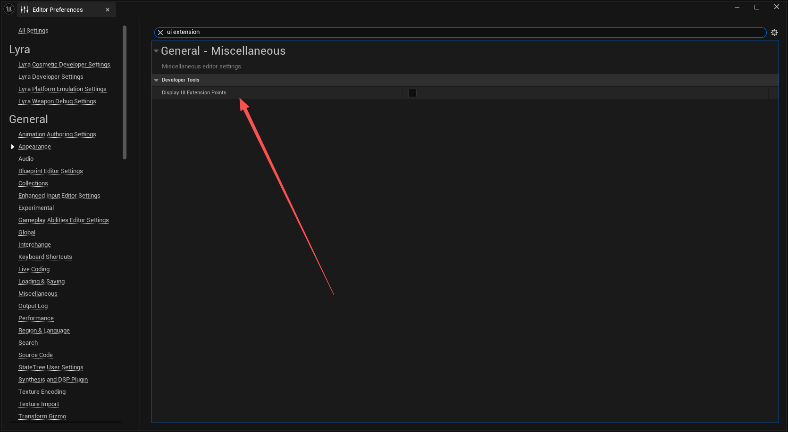
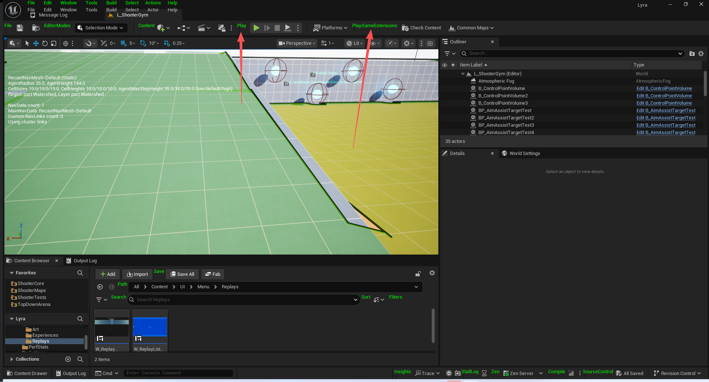
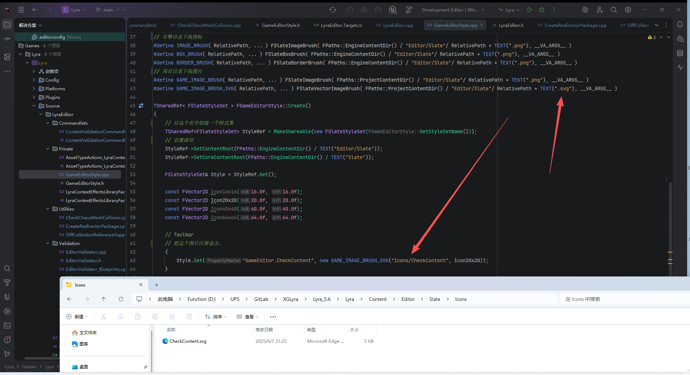
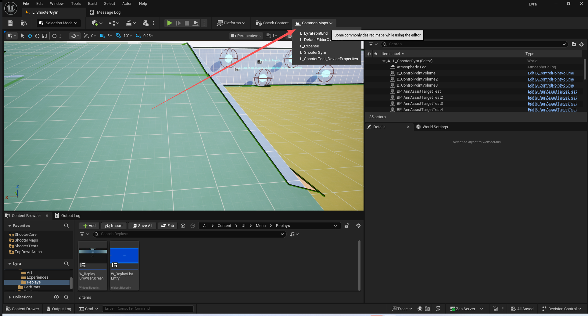
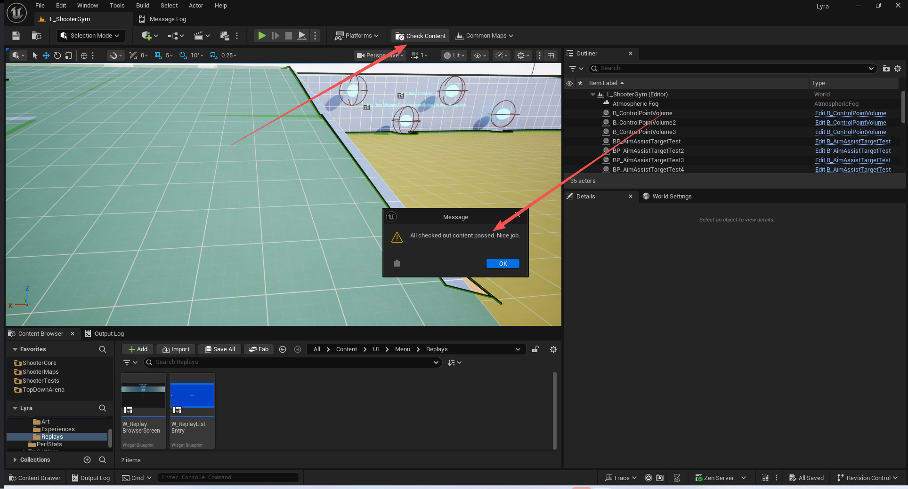
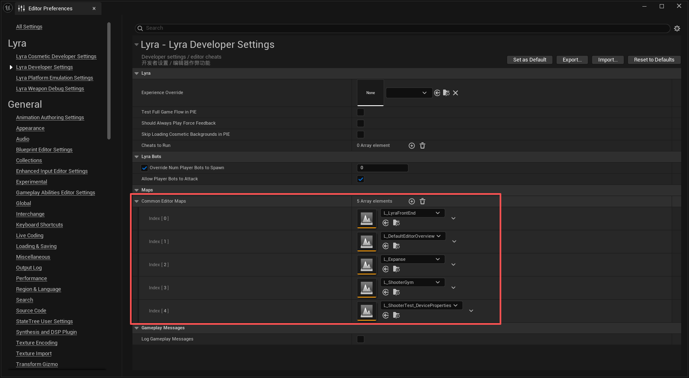

# UE5_Lyra学习指南_119_Editor模块代码
本文章仅为小刚-B站课堂-虚幻引擎视频课程Lyra-精讲的演讲手稿.  
本套课程链接:[[UE5]虚幻引擎游戏案例Lyra精讲](https://www.bilibili.com/cheese/play/ss112001159)  
前置课程链接:[[UE5]虚幻引擎UEC++从基础到进阶](https://www.bilibili.com/cheese/play/ss28043)  

文章内容由小刚撰写,采用了以下多种方式:  
1.口述转文字  
2.AI重构  
3.参考引擎源码  
4.Lyra工程源码  
5.结合社区论坛各位大佬的解析  

- [UE5\_Lyra学习指南\_119\_Editor模块代码](#ue5_lyra学习指南_119_editor模块代码)
	- [概述](#概述)
	- [打开拓展点](#打开拓展点)
	- [LyraEditor](#lyraeditor)
	- [初始化专属的风格](#初始化专属的风格)
		- [申请分配资源](#申请分配资源)
		- [注册风格 关联资源](#注册风格-关联资源)
	- [注册效果上下文的资产定义](#注册效果上下文的资产定义)
		- [资产操作](#资产操作)
		- [工厂](#工厂)
	- [GameplayCue的使用类修改](#gameplaycue的使用类修改)
		- [触发时机](#触发时机)
		- [具体功能](#具体功能)
	- [PIE下转发](#pie下转发)
	- [编辑器引擎定制功能](#编辑器引擎定制功能)
	- [注册菜单](#注册菜单)
		- [触发位置](#触发位置)
		- [创建菜单](#创建菜单)
		- [快捷地图栏](#快捷地图栏)
		- [校验资产栏](#校验资产栏)
	- [资产校验](#资产校验)
		- [截取日志的结构体](#截取日志的结构体)
		- [EditorValidator](#editorvalidator)
			- [头文件](#头文件)
			- [针对某类资产](#针对某类资产)
			- [路径排除](#路径排除)
			- [检测资产流程](#检测资产流程)
			- [检测某个资产](#检测某个资产)
			- [检测由于代码修改导致的资产](#检测由于代码修改导致的资产)
			- [检测项目设置](#检测项目设置)
		- [EditorValidator\_Blueprints](#editorvalidator_blueprints)
		- [EditorValidator\_Load](#editorvalidator_load)
		- [EditorValidator\_MaterialFunctions](#editorvalidator_materialfunctions)
		- [EditorValidator\_SourceControl](#editorvalidator_sourcecontrol)
	- [命令行启动](#命令行启动)
		- [Main流程](#main流程)
		- [登录P4](#登录p4)
		- [通过P4拿资产](#通过p4拿资产)
		- [追加路径下的资产](#追加路径下的资产)
		- [追加特定类型的资产](#追加特定类型的资产)
	- [测试命令](#测试命令)
		- [ChaosMesh碰撞检测](#chaosmesh碰撞检测)
		- [创建重定向器](#创建重定向器)
		- [集合去重](#集合去重)
	- [总结](#总结)


## 概述
本节主要讲解LyraEditor下的代码.
到本节为止,所有LyraGame的代码,以及大部分插件代码以及讲解完毕.
## 打开拓展点


## LyraEditor
``` cpp
// Copyright Epic Games, Inc. All Rights Reserved.

#pragma once

#include "Logging/LogMacros.h"

DECLARE_LOG_CATEGORY_EXTERN(LogLyraEditor, Log, All);
```
``` cpp

/**
 * FLyraEditorModule
 */
class FLyraEditorModule : public FDefaultGameModuleImpl
{
	typedef FLyraEditorModule ThisClass;

	virtual void StartupModule() override
	{
		// 风格资产初始化
		FGameEditorStyle::Initialize();

		if (!IsRunningGame())
		{
			
			/**
			* 获取一个多播委托，该委托会在已知模块集合发生变化时（即模块加载或卸载时）执行。
			* 该委托是线程安全的，允许从游戏线程之外的其他线程进行订阅，但始终由游戏线程进行广播。*
			* 第一个参数是发生变化的模块的名称。
			* 第二个参数是导致该变化的原因。*
			* @返回 多播委托。*/
			FModuleManager::Get().OnModulesChanged().AddRaw(this, &FLyraEditorModule::ModulesChangedCallback);
			// 绑定GameplayCue的处理
			BindGameplayAbilitiesEditorDelegates();

			// 注册我们的快捷栏
			if (FSlateApplication::IsInitialized())
			{
				ToolMenusHandle = UToolMenus::RegisterStartupCallback(FSimpleMulticastDelegate::FDelegate::CreateStatic(&RegisterGameEditorMenus));
			}
			// PIE的回调
			FEditorDelegates::BeginPIE.AddRaw(this, &ThisClass::OnBeginPIE);
			FEditorDelegates::EndPIE.AddRaw(this, &ThisClass::OnEndPIE);
		}

		// Register the Context Effects Library asset type actions.
		// 注册“上下文效果库”资源类型的操作。
		// 处理效果的上下文资产,便于修改在编辑器下显示的图标
		{
			IAssetTools& AssetTools = FModuleManager::LoadModuleChecked<FAssetToolsModule>("AssetTools").Get();
			TSharedRef<FAssetTypeActions_LyraContextEffectsLibrary> AssetAction = MakeShared<FAssetTypeActions_LyraContextEffectsLibrary>();
			LyraContextEffectsLibraryAssetAction = AssetAction;
			AssetTools.RegisterAssetTypeActions(AssetAction);
		}
	}

	void OnBeginPIE(bool bIsSimulating)
	{
		// 转发到Experience的子系统 便于管理PIE模式下GameFeature计数
		ULyraExperienceManager* ExperienceManager = GEngine->GetEngineSubsystem<ULyraExperienceManager>();
		check(ExperienceManager);
		ExperienceManager->OnPlayInEditorBegun();
	}

	void OnEndPIE(bool bIsSimulating)
	{
		// 无
	}

	virtual void ShutdownModule() override
	{
		// Unregister the Context Effects Library asset type actions.
		// 注销“上下文效果库”资产类型的操作。
		{
			FAssetToolsModule* AssetToolsModule = FModuleManager::GetModulePtr<FAssetToolsModule>("AssetTools");
			TSharedPtr<IAssetTypeActions> AssetAction = LyraContextEffectsLibraryAssetAction.Pin();
			if (AssetToolsModule && AssetAction)
			{
				AssetToolsModule->Get().UnregisterAssetTypeActions(AssetAction.ToSharedRef());
			}
		}

		FEditorDelegates::BeginPIE.RemoveAll(this);
		FEditorDelegates::EndPIE.RemoveAll(this);

		// Undo UToolMenus
		// 停用快捷栏
		if (UObjectInitialized() && ToolMenusHandle.IsValid())
		{
			UToolMenus::UnRegisterStartupCallback(ToolMenusHandle);
		}
		// 解除GameplayCue的处理
		UnbindGameplayAbilitiesEditorDelegates();
		FModuleManager::Get().OnModulesChanged().RemoveAll(this);
		// 风格卸载
		FGameEditorStyle::Shutdown();
	}

protected:

	// 处理GameplayCue
	static void BindGameplayAbilitiesEditorDelegates()
	{
		IGameplayAbilitiesEditorModule& GameplayAbilitiesEditorModule = IGameplayAbilitiesEditorModule::Get();

		/** 设置一个委托函数，该函数将在创建通知时由游戏提示编辑器调用，用于获取将要呈现的游戏提示类列表 */
		GameplayAbilitiesEditorModule.GetGameplayCueNotifyClassesDelegate().BindStatic(&GetGameplayCueDefaultClasses);
		// 筛选GameplayCue
		GameplayAbilitiesEditorModule.GetGameplayCueInterfaceClassesDelegate().BindStatic(&GetGameplayCueInterfaceClasses);
		/** 设置一个委托函数，该函数将在通过游戏玩法提示编辑器创建游戏玩法提示通知时被调用，以获取该提示的保存路径 */
		GameplayAbilitiesEditorModule.GetGameplayCueNotifyPathDelegate().BindStatic(&GetGameplayCuePath);
	}
	// 解除关于GameplayCue处理的绑定
	static void UnbindGameplayAbilitiesEditorDelegates()
	{
		if (IGameplayAbilitiesEditorModule::IsAvailable())
		{
			IGameplayAbilitiesEditorModule& GameplayAbilitiesEditorModule = IGameplayAbilitiesEditorModule::Get();
			GameplayAbilitiesEditorModule.GetGameplayCueNotifyClassesDelegate().Unbind();
			GameplayAbilitiesEditorModule.GetGameplayCueInterfaceClassesDelegate().Unbind();
			GameplayAbilitiesEditorModule.GetGameplayCueNotifyPathDelegate().Unbind();
		}
	}

	void ModulesChangedCallback(FName ModuleThatChanged, EModuleChangeReason ReasonForChange)
	{
		// 如果是该模块加载进来 需要绑定我们的GAS的Cue处理
		if ((ReasonForChange == EModuleChangeReason::ModuleLoaded) && (ModuleThatChanged.ToString() == TEXT("GameplayAbilitiesEditor")))
		{
			BindGameplayAbilitiesEditorDelegates();
		}
	}

private:
	// 资产的注册句柄
	TWeakPtr<IAssetTypeActions> LyraContextEffectsLibraryAssetAction;
	// 菜单的句柄
	FDelegateHandle ToolMenusHandle;
};

IMPLEMENT_MODULE(FLyraEditorModule, LyraEditor);


```

## 初始化专属的风格

### 申请分配资源
``` cpp
	virtual void StartupModule() override
	{
		// 风格资产初始化
		FGameEditorStyle::Initialize();
	
		// ....
	}

```
``` cpp
	virtual void ShutdownModule() override
	{

		// ...
		// 风格卸载
		FGameEditorStyle::Shutdown();
	}
```
### 注册风格 关联资源
``` cpp
/** Slate style used by the Game Editor */
class FGameEditorStyle
{
public:

	static void Initialize();

	static void Shutdown();
	
	static const ISlateStyle& Get();

	static FName GetStyleSetName();

private:

	static TSharedRef< class FSlateStyleSet > Create();

private:

	static TSharedPtr< class FSlateStyleSet > StyleInstance;
};

```

``` cpp
TSharedPtr< FSlateStyleSet > FGameEditorStyle::StyleInstance = nullptr;

void FGameEditorStyle::Initialize()
{
	// 单例
	if ( !StyleInstance.IsValid() )
	{
		StyleInstance = Create();
		// 为存储库添加风格的样式。
		FSlateStyleRegistry::RegisterSlateStyle( *StyleInstance );
	}
}

void FGameEditorStyle::Shutdown()
{
	// 取消注册
	FSlateStyleRegistry::UnRegisterSlateStyle( *StyleInstance );
	ensure( StyleInstance.IsUnique() );
	StyleInstance.Reset();
}
```
``` cpp
FName FGameEditorStyle::GetStyleSetName()
{
	static FName StyleSetName(TEXT("GameEditorStyle"));
	return StyleSetName;
}
// 宏
// 引擎目录下找图标
#define IMAGE_BRUSH( RelativePath, ... ) FSlateImageBrush( FPaths::EngineContentDir() / "Editor/Slate"/ RelativePath + TEXT(".png"), __VA_ARGS__ )
#define BOX_BRUSH( RelativePath, ... ) FSlateBoxBrush( FPaths::EngineContentDir() / "Editor/Slate"/ RelativePath + TEXT(".png"), __VA_ARGS__ )
#define BORDER_BRUSH( RelativePath, ... ) FSlateBorderBrush( FPaths::EngineContentDir() / "Editor/Slate"/ RelativePath + TEXT(".png"), __VA_ARGS__ )
// 项目目录下找图片
#define GAME_IMAGE_BRUSH( RelativePath, ... ) FSlateImageBrush( FPaths::ProjectContentDir() / "Editor/Slate"/ RelativePath + TEXT(".png"), __VA_ARGS__ )
#define GAME_IMAGE_BRUSH_SVG( RelativePath, ... ) FSlateVectorImageBrush( FPaths::ProjectContentDir() / "Editor/Slate"/ RelativePath + TEXT(".svg"), __VA_ARGS__ )

TSharedRef< FSlateStyleSet > FGameEditorStyle::Create()
{
	// 以这个名字创建一个样式集
	TSharedRef<FSlateStyleSet> StyleRef = MakeShareable(new FSlateStyleSet(FGameEditorStyle::GetStyleSetName()));
	// 设置路径
	StyleRef->SetContentRoot(FPaths::EngineContentDir() / TEXT("Editor/Slate"));
	StyleRef->SetCoreContentRoot(FPaths::EngineContentDir() / TEXT("Slate"));

	FSlateStyleSet& Style = StyleRef.Get();

	const FVector2D Icon16x16(16.0f, 16.0f);
	const FVector2D Icon20x20(20.0f, 20.0f);
	const FVector2D Icon40x40(40.0f, 40.0f);
	const FVector2D Icon64x64(64.0f, 64.0f);

	// Toolbar 
	// 把这个图片注册进去.
	{
		Style.Set("GameEditor.CheckContent", new GAME_IMAGE_BRUSH_SVG("Icons/CheckContent", Icon20x20));
	}

	return StyleRef;
}

#undef IMAGE_BRUSH
#undef BOX_BRUSH
#undef BORDER_BRUSH

const ISlateStyle& FGameEditorStyle::Get()
{
	return *StyleInstance;
}


```
## 注册效果上下文的资产定义
该部分代码已讲解过.
此处仅列出
``` cpp
	virtual void StartupModule() override
	{
		
		if (!IsRunningGame())
		{
			// 注册我们的快捷栏
			if (FSlateApplication::IsInitialized())
			{
				ToolMenusHandle = UToolMenus::RegisterStartupCallback(FSimpleMulticastDelegate::FDelegate::CreateStatic(&RegisterGameEditorMenus));
			}
		}
	}
```
``` cpp
	virtual void ShutdownModule() override
	{
		// Unregister the Context Effects Library asset type actions.
		// 注销“上下文效果库”资产类型的操作。
		{
			FAssetToolsModule* AssetToolsModule = FModuleManager::GetModulePtr<FAssetToolsModule>("AssetTools");
			TSharedPtr<IAssetTypeActions> AssetAction = LyraContextEffectsLibraryAssetAction.Pin();
			if (AssetToolsModule && AssetAction)
			{
				AssetToolsModule->Get().UnregisterAssetTypeActions(AssetAction.ToSharedRef());
			}
		}		

	}

```
``` cpp

private:
	// 资产的注册句柄
	TWeakPtr<IAssetTypeActions> LyraContextEffectsLibraryAssetAction;
```
### 资产操作
``` cpp

class FAssetTypeActions_LyraContextEffectsLibrary : public FAssetTypeActions_Base
{
public:
	// IAssetTypeActions Implementation
	virtual FText GetName() const override { return NSLOCTEXT("AssetTypeActions", "AssetTypeActions_LyraContextEffectsLibrary", "LyraContextEffectsLibrary"); }
	virtual FColor GetTypeColor() const override { return FColor(65, 200, 98); }
	virtual UClass* GetSupportedClass() const override;
	virtual uint32 GetCategories() override { return EAssetTypeCategories::Gameplay; }
};

```
``` cpp
UClass* FAssetTypeActions_LyraContextEffectsLibrary::GetSupportedClass() const
{
	return ULyraContextEffectsLibrary::StaticClass();
}


```
### 工厂
``` cpp

UCLASS(hidecategories = Object, MinimalAPI)
class ULyraContextEffectsLibraryFactory : public UFactory
{
	GENERATED_UCLASS_BODY()

	//~ Begin UFactory Interface
	virtual UObject* FactoryCreateNew(UClass* Class, UObject* InParent, FName Name, EObjectFlags Flags, UObject* Context, FFeedbackContext* Warn) override;

	virtual bool ShouldShowInNewMenu() const override
	{
		return true;
	}
	//~ End UFactory Interface	
};


```

``` cpp
ULyraContextEffectsLibraryFactory::ULyraContextEffectsLibraryFactory(const FObjectInitializer& ObjectInitializer)
	: Super(ObjectInitializer)
{
	SupportedClass = ULyraContextEffectsLibrary::StaticClass();

	bCreateNew = true;
	bEditorImport = false;
	bEditAfterNew = true;
}

UObject* ULyraContextEffectsLibraryFactory::FactoryCreateNew(UClass* Class, UObject* InParent, FName Name, EObjectFlags Flags, UObject* Context, FFeedbackContext* Warn)
{
	ULyraContextEffectsLibrary* LyraContextEffectsLibrary = NewObject<ULyraContextEffectsLibrary>(InParent, Name, Flags);

	return LyraContextEffectsLibrary;
}

```

## GameplayCue的使用类修改

``` cpp
	virtual void StartupModule() override
	{
		// 风格资产初始化
		FGameEditorStyle::Initialize();

		if (!IsRunningGame())
		{
			
			/**
			* 获取一个多播委托，该委托会在已知模块集合发生变化时（即模块加载或卸载时）执行。
			* 该委托是线程安全的，允许从游戏线程之外的其他线程进行订阅，但始终由游戏线程进行广播。*
			* 第一个参数是发生变化的模块的名称。
			* 第二个参数是导致该变化的原因。*
			* @返回 多播委托。*/
			FModuleManager::Get().OnModulesChanged().AddRaw(this, &FLyraEditorModule::ModulesChangedCallback);
			// 绑定GameplayCue的处理
			BindGameplayAbilitiesEditorDelegates();
		}
	}

```
``` cpp

	virtual void ShutdownModule() override
	{
		// ....

		// 解除GameplayCue的处理
		UnbindGameplayAbilitiesEditorDelegates();
		FModuleManager::Get().OnModulesChanged().RemoveAll(this);

	}

```
### 触发时机
``` cpp
	// 处理GameplayCue
	static void BindGameplayAbilitiesEditorDelegates()
	{
		IGameplayAbilitiesEditorModule& GameplayAbilitiesEditorModule = IGameplayAbilitiesEditorModule::Get();

		/** 设置一个委托函数，该函数将在创建通知时由游戏提示编辑器调用，用于获取将要呈现的游戏提示类列表 */
		GameplayAbilitiesEditorModule.GetGameplayCueNotifyClassesDelegate().BindStatic(&GetGameplayCueDefaultClasses);
		// 筛选GameplayCue
		GameplayAbilitiesEditorModule.GetGameplayCueInterfaceClassesDelegate().BindStatic(&GetGameplayCueInterfaceClasses);
		/** 设置一个委托函数，该函数将在通过游戏玩法提示编辑器创建游戏玩法提示通知时被调用，以获取该提示的保存路径 */
		GameplayAbilitiesEditorModule.GetGameplayCueNotifyPathDelegate().BindStatic(&GetGameplayCuePath);
	}
	// 解除关于GameplayCue处理的绑定
	static void UnbindGameplayAbilitiesEditorDelegates()
	{
		if (IGameplayAbilitiesEditorModule::IsAvailable())
		{
			IGameplayAbilitiesEditorModule& GameplayAbilitiesEditorModule = IGameplayAbilitiesEditorModule::Get();
			GameplayAbilitiesEditorModule.GetGameplayCueNotifyClassesDelegate().Unbind();
			GameplayAbilitiesEditorModule.GetGameplayCueInterfaceClassesDelegate().Unbind();
			GameplayAbilitiesEditorModule.GetGameplayCueNotifyPathDelegate().Unbind();
		}
	}

	void ModulesChangedCallback(FName ModuleThatChanged, EModuleChangeReason ReasonForChange)
	{
		// 如果是该模块加载进来 需要绑定我们的GAS的Cue处理
		if ((ReasonForChange == EModuleChangeReason::ModuleLoaded) && (ModuleThatChanged.ToString() == TEXT("GameplayAbilitiesEditor")))
		{
			BindGameplayAbilitiesEditorDelegates();
		}
	}

```
### 具体功能
``` cpp
// This function tells the GameplayCue editor what classes to expose when creating new notifies.
// 此函数告知“游戏玩法提示”编辑器在创建新通知时要公开哪些类。
static void GetGameplayCueDefaultClasses(TArray<UClass*>& Classes)
{
	Classes.Empty();
	Classes.Add(UGameplayCueNotify_Burst::StaticClass());
	Classes.Add(AGameplayCueNotify_BurstLatent::StaticClass());
	Classes.Add(AGameplayCueNotify_Looping::StaticClass());
}

// This function tells the GameplayCue editor what classes to search for GameplayCue events.
// 此函数向游戏玩法提示编辑器指定应查找哪些类别的游戏玩法提示事件。
static void GetGameplayCueInterfaceClasses(TArray<UClass*>& Classes)
{
	Classes.Empty();

	for (UClass* Class : TObjectRange<UClass>())
	{
		if (Class->IsChildOf<AActor>() && Class->ImplementsInterface(UGameplayCueInterface::StaticClass()))
		{
			Classes.Add(Class);
		}
	}
}

// This function tells the GameplayCue editor where to create the GameplayCue notifies based on their tag.
// 此函数会根据游戏玩法提示的标签指示游戏玩法提示编辑器在何处创建这些游戏玩法提示。
static FString GetGameplayCuePath(FString GameplayCueTag)
{
	FString Path = FString(TEXT("/Game"));

	//@TODO: Try plugins (e.g., GameplayCue.ShooterGame.Foo should be in ShooterCore or something)
	//@待办事项：尝试使用插件（例如，GameplayCue.ShooterGame.Foo 应该放在 ShooterCore 或类似的目录下）
	
	// Default path to the first entry in the UAbilitySystemGlobals::GameplayCueNotifyPaths.
	// UAbilitySystemGlobals::GameplayCueNotifyPaths 中第一个条目的默认路径。
	
	if (IGameplayAbilitiesModule::IsAvailable())
	{
		IGameplayAbilitiesModule& GameplayAbilitiesModule = IGameplayAbilitiesModule::Get();

		if (GameplayAbilitiesModule.IsAbilitySystemGlobalsAvailable())
		{
			UAbilitySystemGlobals* AbilitySystemGlobals = GameplayAbilitiesModule.GetAbilitySystemGlobals();
			check(AbilitySystemGlobals);

			TArray<FString> GetGameplayCueNotifyPaths = AbilitySystemGlobals->GetGameplayCueNotifyPaths();

			if (GetGameplayCueNotifyPaths.Num() > 0)
			{
				Path = GetGameplayCueNotifyPaths[0];
			}
		}
	}

	GameplayCueTag.RemoveFromStart(TEXT("GameplayCue."));

	FString NewDefaultPathName = FString::Printf(TEXT("%s/GCN_%s"), *Path, *GameplayCueTag);

	return NewDefaultPathName;
}
```
## PIE下转发
``` cpp
	void OnBeginPIE(bool bIsSimulating)
	{
		// 转发到Experience的子系统 便于管理PIE模式下GameFeature计数
		ULyraExperienceManager* ExperienceManager = GEngine->GetEngineSubsystem<ULyraExperienceManager>();
		check(ExperienceManager);
		ExperienceManager->OnPlayInEditorBegun();
	}

	void OnEndPIE(bool bIsSimulating)
	{
		// 无
	}
```
``` cpp

/**
 * Manager for experiences - primarily for arbitration between multiple PIE sessions
 * 体验管理的引擎子系统 - 主要负责多个 PIE 会议之间的协调工作
 */
UCLASS(MinimalAPI)
class ULyraExperienceManager : public UEngineSubsystem
{
	GENERATED_BODY()
	
public:

#if WITH_EDITOR	
	//在编辑器模块中的StartupModule()进行调用,用于初始化GameFeaturePluginRequestCountMap
	LYRAGAME_API void OnPlayInEditorBegun();
	
	//通知有插件被激活了,增加计数,由LyraExperienceManagerComponent调用
	static void NotifyOfPluginActivation(const FString PluginURL);

	//要求取消插件的激活计数,减少计数,由LyraExperienceManagerComponent调用
	static bool RequestToDeactivatePlugin(const FString PluginURL);
	
	//运行时不需要这个功能
#else
	static void NotifyOfPluginActivation(const FString PluginURL) {}
	static bool RequestToDeactivatePlugin(const FString PluginURL) { return true; }
#endif
	
private:
	// The map of requests to active count for a given game feature plugin
	// (to allow first in, last out activation management during PIE)
	// 指定游戏功能插件的请求量与激活次数的关系图
	// （以便在 PIE 过程中实现[先入后出]的激活管理）
	TMap<FString, int32> GameFeaturePluginRequestCountMap;
};


```
``` cpp

#if WITH_EDITOR

void ULyraExperienceManager::OnPlayInEditorBegun()
{
	ensure(GameFeaturePluginRequestCountMap.IsEmpty());
	GameFeaturePluginRequestCountMap.Empty();
}

void ULyraExperienceManager::NotifyOfPluginActivation(const FString PluginURL)
{
	if (GIsEditor)
	{
		ULyraExperienceManager* ExperienceManagerSubsystem = GEngine->GetEngineSubsystem<ULyraExperienceManager>();
		check(ExperienceManagerSubsystem);

		// Track the number of requesters who activate this plugin. Multiple load/activation requests are always allowed because concurrent requests are handled.
		// 记录激活此插件的请求者的数量。由于可以处理并发请求，因此允许多次加载/激活操作。
		int32& Count = ExperienceManagerSubsystem->GameFeaturePluginRequestCountMap.FindOrAdd(PluginURL);
		
		++Count;
	}
	
}

bool ULyraExperienceManager::RequestToDeactivatePlugin(const FString PluginURL)
{
	if (GIsEditor)
	{
		ULyraExperienceManager* ExperienceManagerSubsystem = GEngine->GetEngineSubsystem<ULyraExperienceManager>();
		check(ExperienceManagerSubsystem);
		
		// Only let the last requester to get this far deactivate the plugin
		// 只允许最后提出请求的用户能够继续进行到这一步，并且由其来解除该插件的激活状态。
		int32& Count = ExperienceManagerSubsystem->GameFeaturePluginRequestCountMap.FindChecked(PluginURL);
		--Count;
		
		if (Count == 0)
		{
			ExperienceManagerSubsystem->GameFeaturePluginRequestCountMap.Remove(PluginURL);
			return true;
		}
		
		return false;
		
	}
	return true;
}
#endif


```
## 编辑器引擎定制功能
``` cpp
UCLASS()
class ULyraEditorEngine : public UUnrealEdEngine
{
	GENERATED_BODY()

public:

	ULyraEditorEngine(const FObjectInitializer& ObjectInitializer = FObjectInitializer::Get());

protected:

	virtual void Init(IEngineLoop* InEngineLoop) override;
	virtual void Start() override;
	virtual void Tick(float DeltaSeconds, bool bIdleMode) override;
	
	virtual FGameInstancePIEResult PreCreatePIEInstances(const bool bAnyBlueprintErrors, const bool bStartInSpectatorMode, const float PIEStartTime, const bool bSupportsOnlinePIE, int32& InNumOnlinePIEInstances) override;

private:
	void FirstTickSetup();
	
	bool bFirstTickSetup = false;
};

```
``` cpp

ULyraEditorEngine::ULyraEditorEngine(const FObjectInitializer& ObjectInitializer)
	: Super(ObjectInitializer)
{
}

void ULyraEditorEngine::Init(IEngineLoop* InEngineLoop)
{
	Super::Init(InEngineLoop);
}

void ULyraEditorEngine::Start()
{
	Super::Start();
}

void ULyraEditorEngine::Tick(float DeltaSeconds, bool bIdleMode)
{
	Super::Tick(DeltaSeconds, bIdleMode);
	
	FirstTickSetup();
}

void ULyraEditorEngine::FirstTickSetup()
{
	if (bFirstTickSetup)
	{
		return;
	}

	bFirstTickSetup = true;

	// Force show plugin content on load.
	// 由于引擎更新 该功能已失效,可以不用理会,已在前面的视频特定讲解
	GetMutableDefault<UContentBrowserSettings>()->SetDisplayPluginFolders(true);

}

FGameInstancePIEResult ULyraEditorEngine::PreCreatePIEInstances(const bool bAnyBlueprintErrors, const bool bStartInSpectatorMode, const float PIEStartTime, const bool bSupportsOnlinePIE, int32& InNumOnlinePIEInstances)
{
	if (const ALyraWorldSettings* LyraWorldSettings = Cast<ALyraWorldSettings>(EditorWorld->GetWorldSettings()))
	{
		if (LyraWorldSettings->ForceStandaloneNetMode)
		{
			EPlayNetMode OutPlayNetMode;
			PlaySessionRequest->EditorPlaySettings->GetPlayNetMode(OutPlayNetMode);
			if (OutPlayNetMode != PIE_Standalone)
			{
				PlaySessionRequest->EditorPlaySettings->SetPlayNetMode(PIE_Standalone);

				FNotificationInfo Info(LOCTEXT("ForcingStandaloneForFrontend", "Forcing NetMode: Standalone for the Frontend"));
				Info.ExpireDuration = 2.0f;
				FSlateNotificationManager::Get().AddNotification(Info);
			}
		}
	}

	//@TODO: Should add delegates that a *non-editor* module could bind to for PIE start/stop instead of poking directly
	// 用于重写体验
	GetDefault<ULyraDeveloperSettings>()->OnPlayInEditorStarted();
	// 用于模拟平台各种特征
	GetDefault<ULyraPlatformEmulationSettings>()->OnPlayInEditorStarted();
	
	FGameInstancePIEResult Result = Super::PreCreatePIEServerInstance(bAnyBlueprintErrors, bStartInSpectatorMode, PIEStartTime, bSupportsOnlinePIE, InNumOnlinePIEInstances);

	return Result;
}

```

## 注册菜单
### 触发位置
``` cpp
			// 注册我们的快捷栏
			if (FSlateApplication::IsInitialized())
			{
				ToolMenusHandle = UToolMenus::RegisterStartupCallback(FSimpleMulticastDelegate::FDelegate::CreateStatic(&RegisterGameEditorMenus));
			}
```
``` cpp
		// Undo UToolMenus
		// 停用快捷栏
		if (UObjectInitialized() && ToolMenusHandle.IsValid())
		{
			UToolMenus::UnRegisterStartupCallback(ToolMenusHandle);
		}

```
``` cpp
	// 菜单的句柄
	FDelegateHandle ToolMenusHandle;
```
### 创建菜单
``` cpp
// 向编辑注册我们的快捷操作栏.
static void RegisterGameEditorMenus()
{
	// 找到位置
	UToolMenu* Menu = UToolMenus::Get()->ExtendMenu("LevelEditor.LevelEditorToolBar.PlayToolBar");
	
	// 添加一个片段 在Play这个分类后面
	FToolMenuSection& Section = Menu->AddSection("PlayGameExtensions", 
		TAttribute<FText>(), 
		FToolMenuInsert("Play", EToolMenuInsertType::After));

	// Uncomment this to add a custom toolbar that is displayed during PIE
	// 取消注释此选项，即可添加一个在 PIE 运行期间会显示的自定义工具栏。
	// 
	// Useful for making easy access to changing game state artificially, adding cheats, etc
	// FToolMenuEntry BlueprintEntry = FToolMenuEntry::InitComboButton(
	// 	"OpenGameMenu",
	// 	FUIAction(
	// 		FExecuteAction(),
	// 		FCanExecuteAction::CreateStatic(&HasPlayWorld),
	// 		FIsActionChecked(),
	// 		FIsActionButtonVisible::CreateStatic(&HasPlayWorld)),
	// 	FOnGetContent::CreateStatic(&YourCustomMenu),
	// 	LOCTEXT("GameOptions_Label", "Game Options"),
	// 	LOCTEXT("GameOptions_ToolTip", "Game Options"),
	// 	FSlateIcon(FAppStyle::GetAppStyleSetName(), "LevelEditor.OpenLevelBlueprint")
	// );
	// BlueprintEntry.StyleNameOverride = "CalloutToolbar";
	// Section.AddEntry(BlueprintEntry);

	FToolMenuEntry CheckContentEntry = FToolMenuEntry::InitToolBarButton(
		"CheckContent",
		FUIAction(
			FExecuteAction::CreateStatic(&CheckGameContent_Clicked),
			FCanExecuteAction::CreateStatic(&HasNoPlayWorld),
			FIsActionChecked(),
			FIsActionButtonVisible::CreateStatic(&HasNoPlayWorld)),
		LOCTEXT("CheckContentButton", "Check Content"),
		LOCTEXT("CheckContentDescription", "Runs the Content Validation job on all checked out assets to look for warnings and errors"),
		// 从我们自己注册的风格集里面找到找个图片
		FSlateIcon(FGameEditorStyle::GetStyleSetName(), "GameEditor.CheckContent")
	);
	// 这个风格CalloutToolbar 在引擎很多地方都有使用到
	CheckContentEntry.StyleNameOverride = "CalloutToolbar";
	Section.AddEntry(CheckContentEntry);
	
	//这个格式
	/*
	* 	// Callout Toolbar - Used to "call out" the toolbar button with text
		{
			SlimToolbarStyle.SetShowLabels(true);

			Style->Set("CalloutToolbar", SlimToolbarStyle);
		}
	FToolBarStyle SlimToolbarStyle =
			FToolBarStyle()
			.SetBackground(*SlimToolbarBackground)
			.SetBackgroundPadding(FMargin(4.f, 6.f))
			.SetComboButtonPadding(FMargin(0.0f, 0.0f))
			.SetButtonPadding(FMargin(4.0f, 0.0f))
			.SetCheckBoxPadding(FMargin(8.0f, 0.0f))
			.SetSeparatorBrush(FSlateColorBrush(FStyleColors::Recessed))
			.SetSeparatorPadding(FMargin(4.f, -5.0f))
			.SetLabelStyle(FTextBlockStyle(NormalText))
			.SetComboButtonStyle(SlimToolBarComboButton)
			.SetLabelPadding(FMargin(4.f, 0.f, 0.f, 0.f))
			.SetEditableTextStyle(FEditableTextBoxStyle(NormalEditableTextBoxStyle));
			// ...
		
	 */
	
	// 快捷地图栏
	FToolMenuEntry CommonMapEntry = FToolMenuEntry::InitComboButton(
		"CommonMapOptions",
		FUIAction(
			FExecuteAction(),
			FCanExecuteAction::CreateStatic(&HasNoPlayWorld),
			FIsActionChecked(),
			FIsActionButtonVisible::CreateStatic(&CanShowCommonMaps)),
		FOnGetContent::CreateStatic(&GetCommonMapsDropdown),
		LOCTEXT("CommonMaps_Label", "Common Maps"),
		LOCTEXT("CommonMaps_ToolTip", "Some commonly desired maps while using the editor"),
		// 从引擎里面的风格集,找到找个图片
		FSlateIcon(FAppStyle::GetAppStyleSetName(), "Icons.Level")
	);
	CommonMapEntry.StyleNameOverride = "CalloutToolbar";
	Section.AddEntry(CommonMapEntry);
}
```
### 快捷地图栏

``` cpp
static bool HasPlayWorld()
{
	/** 一个指向 UWorld 对象的指针，该对象是通过“从此处开始播放”功能进行复制/保存并加载的，以便在游戏中使用  */
	return GEditor->PlayWorld != nullptr;
}

static bool HasNoPlayWorld()
{
	return !HasPlayWorld();
}

static bool HasPlayWorldAndRunning()
{
	// bDebugPauseExecution 凯西姆调试标志 - 这些标志只能由编辑器使用，但它们是 32 位无符号整数，所以其实差别不大
	return HasPlayWorld() && !GUnrealEd->PlayWorld->bDebugPauseExecution;
}
// 打开地图
static void OpenCommonMap_Clicked(const FString MapPath)
{
	if (ensure(MapPath.Len()))
	{
		GEditor->GetEditorSubsystem<UAssetEditorSubsystem>()->OpenEditorForAsset(MapPath);
	}
}
// 是否显示快捷地图
static bool CanShowCommonMaps()
{
	return HasNoPlayWorld() && !GetDefault<ULyraDeveloperSettings>()->CommonEditorMaps.IsEmpty();
}
// 构建Slate 关于快捷地图的下拉子项
static TSharedRef<SWidget> GetCommonMapsDropdown()
{
	FMenuBuilder MenuBuilder(true, nullptr);
	
	for (const FSoftObjectPath& Path : GetDefault<ULyraDeveloperSettings>()->CommonEditorMaps)
	{
		if (!Path.IsValid())
		{
			continue;
		}
		
		const FText DisplayName = FText::FromString(Path.GetAssetName());
		MenuBuilder.AddMenuEntry(
			DisplayName,
			LOCTEXT("CommonPathDescription", "Opens this map in the editor"),
			FSlateIcon(),
			FUIAction(
				FExecuteAction::CreateStatic(&OpenCommonMap_Clicked, Path.ToString()),
				FCanExecuteAction::CreateStatic(&HasNoPlayWorld),
				FIsActionChecked(),
				FIsActionButtonVisible::CreateStatic(&HasNoPlayWorld)
			)
		);
		
		/**
		 * FUIAction
		 * 一个构造函数，它接受用于初始化操作的委托方法*
		 * @参数	执行动作		当需要执行该动作时需调用的委托函数
		 * @参数 可执行动作		用于检查该动作是否可以执行的委托函数
		 * @参数 是否选中委托函数	用于检查在可视化时该动作是否应显示为已选中状态的委托函数
		 * @参数 动作可见性委托函数	用于检查该动作是否应可见的委托函数
		 * @参数 重复模式		如果用于调用该动作的和弦被持续按住，该动作是否可以重复？
		 * 
		 */
		
	}

	return MenuBuilder.MakeWidget();
}

```
### 校验资产栏
``` cpp
// 检查资产目录
static void CheckGameContent_Clicked()
{
	UEditorValidator::ValidateCheckedOutContent(/*bInteractive=*/true, EDataValidationUsecase::Manual);
}
```
## 资产校验



### 截取日志的结构体
``` cpp
// 一个结构体 在生命周期范围内去监听警告
class FLyraValidationMessageGatherer : public FOutputDevice
{
public:
	FLyraValidationMessageGatherer()
		: FOutputDevice()
	{
		GLog->AddOutputDevice(this);
	}

	virtual ~FLyraValidationMessageGatherer()
	{
		GLog->RemoveOutputDevice(this);
	}

	virtual void Serialize(const TCHAR* V, ELogVerbosity::Type Verbosity, const class FName& Category) override
	{
		if (Verbosity <= ELogVerbosity::Warning)
		{
			FString MessageString(V);
			bool bIgnored = false;
			for (const FString& IgnorePattern : IgnorePatterns)
			{
				if (MessageString.Contains(IgnorePattern))
				{
					bIgnored = true;
					break;
				}
			}

			if (!bIgnored)
			{
				AllWarningsAndErrors.Add(MessageString);
				if (Verbosity == ELogVerbosity::Warning)
				{
					AllWarnings.Add(MessageString);
				}
			}
		}
	}

	const TArray<FString>& GetAllWarningsAndErrors() const
	{
		return AllWarningsAndErrors;
	}

	const TArray<FString>& GetAllWarnings() const
	{
		return AllWarnings;
	}

	static void AddIgnorePatterns(const TArray<FString>& NewPatterns)
	{
		IgnorePatterns.Append(NewPatterns);
	}

	static void RemoveIgnorePatterns(const TArray<FString>& PatternsToRemove)
	{
		for (const FString& PatternToRemove : PatternsToRemove)
		{
			IgnorePatterns.RemoveSingleSwap(PatternToRemove);
		}
	}

private:
	TArray<FString> AllWarningsAndErrors;
	TArray<FString> AllWarnings;
	static TArray<FString> IgnorePatterns;
};
```
### EditorValidator
#### 头文件
``` cpp

/*
* EditorValidatorBase 是一个用于验证资产是否符合特定规则集的类。
* 在检查引擎级别的类时应使用此类，因为 UObject::IsDataValid 方法需要
* 继承基类。您可以创建具有项目特定版本的验证器基类，其中包含自定义日志记录和启用的逻辑。*
* C++ 和蓝图验证器将在编辑器启动时被收集，而 Python 验证器则需要自行进行注册。*/
UCLASS(Abstract)
class UEditorValidator : public UEditorValidatorBase
{
	GENERATED_BODY()

public:
	// 构造函数 无
	UEditorValidator();
	// 检查资产
	static void ValidateCheckedOutContent(bool bInteractive, const EDataValidationUsecase InValidationUsecase);
	
	static bool ValidatePackages(const TArray<FString>& ExistingPackageNames, 
		const TArray<FString>& DeletedPackageNames, 
		int32 MaxPackagesToLoad, 
		TArray<FString>& OutAllWarningsAndErrors, 
		const EDataValidationUsecase InValidationUsecase);
	
	// 验证项目设置
	static bool ValidateProjectSettings();
	// 根据设置判断
	static bool IsInUncookedFolder(const FString& PackageName, FString* OutUncookedFolderName = nullptr);
	
	// 是否允许全量验证
	static bool ShouldAllowFullValidation();

	// 由于代码修改会导致的资产变化
	static void GetChangedAssetsForCode(class IAssetRegistry& AssetRegistry,
		const FString& ChangedHeaderLocalFilename,
		TArray<FString>& OutChangedPackageNames);

protected:
	// 如果没有放置在禁止烘培的路径下,就应当需要验证资产.
	// 因为这个是父类
	// 所以没有重写	ValidateLoadedAsset

	virtual bool CanValidateAsset_Implementation(UObject* InAsset) const override;

	// 没有用到
	static TArray<FString> TestMapsFolders;

private:
	/**
	 * Used by some validators to determine if it is okay to load referencing assets or other slow tasks. 
	 * This is not okay for fast operations like saving, but is fine for slower "check everything thoroughly" tests
	 */
	/**
	* 一些验证器会依据此来判断是否可以加载引用的资源或执行其他耗时的任务。
	* 这种做法对于诸如保存这类快速操作来说是不合适的，但对于需要进行“全面检查”的较慢测试则适用。*/
	static bool bAllowFullValidationInEditor;
};

```
#### 针对某类资产
``` cpp
bool UEditorValidator::CanValidateAsset_Implementation(UObject* InAsset) const
{
	if (InAsset)
	{
		FString PackageName = InAsset->GetOutermost()->GetName();
		if (!IsInUncookedFolder(PackageName))
		{
			return true;
		}
	}
	
	return false;
}

```
#### 路径排除
``` cpp


bool UEditorValidator::IsInUncookedFolder(const FString& PackageName, FString* OutUncookedFolderName)
{
	const UProjectPackagingSettings* const PackagingSettings = GetDefault<UProjectPackagingSettings>();
	check(PackagingSettings);
	for (const FDirectoryPath& DirectoryToNeverCook : PackagingSettings->DirectoriesToNeverCook)
	{
		const FString& UncookedFolder = DirectoryToNeverCook.Path;
		if (PackageName.StartsWith(UncookedFolder))
		{
			if (OutUncookedFolderName)
			{
				FString FolderToReport = UncookedFolder.StartsWith(TEXT("/Game/")) ? UncookedFolder.RightChop(6) : UncookedFolder;
				if (FolderToReport.EndsWith(TEXT("/")))
				{
					*OutUncookedFolderName = FolderToReport.LeftChop(1);
				}
				else
				{
					*OutUncookedFolderName = FolderToReport;
				}
			}
			return true;
		}
	}

	return false;
}
```
#### 检测资产流程
``` cpp

void UEditorValidator::ValidateCheckedOutContent(bool bInteractive, const EDataValidationUsecase InValidationUsecase)
{
	
	/**
	* 工作室电信号 API*
	* 注释：
	* 用于向产品添加工作室级别遥测数据的接口。工作室遥测数据在正式发布的版本中将无法运行。
	* 鼓励开发人员通过此 API 自行添加他们自己的开发遥测事件。
	* 开发人员可以实现自己的 IAnalyticsProviderModule，在这种情况下可以自定义记录工作室遥测事件到自己的分析后端。
	* 可以通过 .ini 文件向插件添加自定义分析提供者。请参阅 FAnalyticsProviderLog 或 FAnalyticsProviderET 以获取示例。
	* 遥测事件会记录到 .ini 文件中提供的所有 IAnalyticsProvider 服务中，使用 FAnalyticsProviderBroadcast 提供程序，但有特定情况除外，即使用下面的 RecordEvent(ProviderName，.. ) API 进行记录。*/
	if (FStudioTelemetry::IsAvailable())
	{
		// 一种线程安全的方法，用于将事件记录到所有已注册的分析提供商中。
		FStudioTelemetry::Get().RecordEvent(TEXT("ValidateContent"));
	}

	FAssetRegistryModule& AssetRegistryModule = FModuleManager::LoadModuleChecked<FAssetRegistryModule>("AssetRegistry");
	
	/** 若资产注册表当前正在加载文件且尚未知晓所有资产，则返回 true。
	* 这是一个遗留功能，只有在资产注册表执行初始资产搜索时才会返回 true。
	* 建议使用 IsGathering() 来判断资产注册表当前是否正在加载文件。*/
	if (AssetRegistryModule.Get().IsLoadingAssets())
	{
		if (bInteractive)
		{
			// 弹出对话框
			FMessageDialog::Open(EAppMsgType::Ok, LOCTEXT("DiscoveringAssets", "Still discovering assets. Try again once it is complete."));
		}
		else
		{
			UE_LOG(LogLyraEditor, Display, TEXT("Could not run ValidateCheckedOutContent because asset discovery was still being done."));
		}
		// 请等待后尝试
		return;
	}

	TArray<FString> ChangedPackageNames;
	TArray<FString> DeletedPackageNames;

	// 源码控制
	ISourceControlProvider& SourceControlProvider = ISourceControlModule::Get().GetProvider();
	if (ISourceControlModule::Get().IsEnabled())
	{
		// Request the opened files at filter construction time to make sure checked out files have the correct state for the filter
		// 在构建过滤器时请求打开的文件信息，以确保已签出的文件的状态与该过滤器的要求相符
		TSharedRef<FUpdateStatus, ESPMode::ThreadSafe> UpdateStatusOperation = ISourceControlOperation::Create<FUpdateStatus>();
		UpdateStatusOperation->SetGetOpenedOnly(true);
		SourceControlProvider.Execute(UpdateStatusOperation, EConcurrency::Synchronous);

		// 检出,添加,删除
		TArray<FSourceControlStateRef> CheckedOutFiles = SourceControlProvider.GetCachedStateByPredicate(
			[](const FSourceControlStateRef& State) { return State->IsCheckedOut() || State->IsAdded() || State->IsDeleted(); }
		);

		// 循环
		// 转换成包名 并添加到修改或删除的容器中
		for (const FSourceControlStateRef& FileState : CheckedOutFiles)
		{
			FString Filename = FileState->GetFilename();
			if (FPackageName::IsPackageFilename(Filename))
			{
				// Assets
				FString PackageName;
				if (FPackageName::TryConvertFilenameToLongPackageName(Filename, PackageName))
				{
					if (FileState->IsDeleted())
					{
						DeletedPackageNames.Add(PackageName);
					}
					else
					{
						ChangedPackageNames.Add(PackageName);
					}
				}
			}
			else if (Filename.EndsWith(TEXT(".h")))
			{
				// Source code header changes for classes may cause issues in assets based on those classes
				// 对类的源代码头文件进行修改可能会导致基于这些类的资产出现问题
				UEditorValidator::GetChangedAssetsForCode(AssetRegistryModule.Get(), Filename, ChangedPackageNames);
			}
		}
	}
	// 是否有问题的信号量
	bool bAnyIssuesFound = false;
	TArray<FString> AllWarningsAndErrors;
	{
		if (bInteractive)
		{
			// 开启这个信号量,以便子类重写函数去执行功能
			// 因为需要交互,所以需要这个信号量
			bAllowFullValidationInEditor = true;

			// We will be flushing shader compile as we load materials, so dont let other shader warnings be attributed incorrectly to the package that is loading.
			// 在加载材质时，我们会同步执行着色器编译操作，因此请不要让其他着色器警告错误地归咎于正在加载的包。
			if (GShaderCompilingManager)
			{
				FScopedSlowTask SlowTask(0.f, 
					LOCTEXT("CompilingShadersBeforeCheckingContentTask", 
						"Finishing shader compiles before checking content..."));
				SlowTask.MakeDialog();
				GShaderCompilingManager->FinishAllCompilation();
			}
		}
		{
			// 创建一个进度对话框 用于提示
			FScopedSlowTask SlowTask(0.f, LOCTEXT("CheckingContentTask", "Checking content..."));
			SlowTask.MakeDialog();
			// 验证资产
			if (!ValidatePackages(ChangedPackageNames, DeletedPackageNames, 2000, AllWarningsAndErrors, InValidationUsecase))
			{
				bAnyIssuesFound = true;
			}
		}
		if (bInteractive)
		{
			// 关闭这个信号量
			bAllowFullValidationInEditor = false;
		}
	}

	{
		FLyraValidationMessageGatherer ScopedMessageGatherer;
		if (!ValidateProjectSettings())
		{
			bAnyIssuesFound = true;
		}
		AllWarningsAndErrors.Append(ScopedMessageGatherer.GetAllWarningsAndErrors());
	}

	if (bInteractive)
	{
		const bool bAtLeastOneMessage = (AllWarningsAndErrors.Num() != 0);
		if (bAtLeastOneMessage)
		{
			FMessageDialog::Open(EAppMsgType::Ok, LOCTEXT("ContentValidationFailed", "!!!!!!! Your checked out content has issues. Don't submit until they are fixed !!!!!!!\r\n\r\nSee the MessageLog and OutputLog for details"));
		}
		else if (bAnyIssuesFound)
		{
			FMessageDialog::Open(EAppMsgType::Ok, LOCTEXT("ContentValidationFailedWithNoMessages", "No errors or warnings were found, but there was an error return code. Look in the OutputLog and log file for details. You may need engineering help."));
		}
		else
		{
			FMessageDialog::Open(EAppMsgType::Ok, LOCTEXT("ContentValidationPassed", "All checked out content passed. Nice job."));
		}
	}
}

```
#### 检测某个资产
``` cpp

bool UEditorValidator::ValidatePackages(const TArray<FString>& ExistingPackageNames,
	const TArray<FString>& DeletedPackageNames,
	int32 MaxPackagesToLoad, 
	TArray<FString>& OutAllWarningsAndErrors, 
	const EDataValidationUsecase InValidationUsecase)
{
	bool bAnyIssuesFound = false;

	FAssetRegistryModule& AssetRegistryModule = FModuleManager::LoadModuleChecked<FAssetRegistryModule>(TEXT("AssetRegistry"));
	IAssetRegistry& AssetRegistry = AssetRegistryModule.Get();

	TArray<FString> AllPackagesToValidate = ExistingPackageNames;
	for (const FString& DeletedPackageName : DeletedPackageNames)
	{
		UE_LOG(LogLyraEditor, Display, TEXT("Adding referencers for deleted package %s to be verified"), *DeletedPackageName);
		TArray<FName> PackageReferencers;
		AssetRegistry.GetReferencers(FName(*DeletedPackageName), PackageReferencers, UE::AssetRegistry::EDependencyCategory::Package);
		// 它引用到了被删除的包
		for (const FName& Referencer : PackageReferencers)
		{
			const FString ReferencerString = Referencer.ToString();
			// 它本身没被删除
			// 它没有在禁止烘焙的路径下
			if (!DeletedPackageNames.Contains(ReferencerString) && !IsInUncookedFolder(ReferencerString))
			{
				UE_LOG(LogLyraEditor, Display, TEXT("    Deleted package referencer %s was added to the queue to be verified"), *ReferencerString);
				// 需要验证
				// 追加
				AllPackagesToValidate.Add(ReferencerString);
			}
		}
	}

	const FText ValidationPageName = LOCTEXT("ValidatePackages", "Validate Packages");

	FMessageLog DataValidationLog("AssetCheck");
	DataValidationLog.NewPage(ValidationPageName);

	if (AllPackagesToValidate.Num() > MaxPackagesToLoad)
	{
		// Too much changed to verify, just pass it.
		// 变化太大无法核实，直接通过即可。
		FString WarningMessage = FString::Printf(TEXT("Assets to validate (%d) exceeded -MaxPackagesToLoad=(%d). Skipping existing package validation."), AllPackagesToValidate.Num(), MaxPackagesToLoad);
		UE_LOG(LogLyraEditor, Warning, TEXT("%s"), *WarningMessage);
		OutAllWarningsAndErrors.Add(WarningMessage);
		DataValidationLog.Warning(FText::FromString(WarningMessage));
	}
	else
	{
		// Load all packages that match the file filter string
		// 加载所有符合文件过滤字符串的包
		TArray<FAssetData> AssetsToCheck;
		for (const FString& PackageName : AllPackagesToValidate)
		{
			// 符合要求 可用加载
			if (FPackageName::IsValidLongPackageName(PackageName) && !IsInUncookedFolder(PackageName))
			{
				int32 OldNumAssets = AssetsToCheck.Num();
				// 因为这里是AssetsToCheck的容器追加
				// 函数实现在这里
				/**
				* bool UAssetRegistryImpl::GetAssetsByPackageName(FName PackageName, TArray<FAssetData>& OutAssetData, bool bIncludeOnlyOnDiskAssets, bool bSkipARFilteredAssets) const
					{
						FARFilter Filter;
						Filter.PackageNames.Add(PackageName);
						Filter.bIncludeOnlyOnDiskAssets = bIncludeOnlyOnDiskAssets;
						return GetAssets(Filter, OutAssetData, bSkipARFilteredAssets);
					}
				 *
				 */
				AssetRegistry.GetAssetsByPackageName(FName(*PackageName), AssetsToCheck, true);
				// 所以这里的如果没有变化,肯定就是有问题的
				if (AssetsToCheck.Num() == OldNumAssets)
				{
					FString WarningMessage;
					// See if the file exists at all. Otherwise, the package contains no assets.
					// 检查该文件是否存在。如果不存在，那么该包中则没有任何资源。
					if (FPackageName::DoesPackageExist(PackageName))
					{
						WarningMessage = FString::Printf(TEXT("Found no assets in package '%s'"), *PackageName);
					}
					else
					{
						// 没有这个包 需要判断一下 丢失的原因
						
						if (ISourceControlModule::Get().IsEnabled())
						{
							ISourceControlProvider& SourceControlProvider = ISourceControlModule::Get().GetProvider();
							FString PackageFilename = FPackageName::LongPackageNameToFilename(PackageName, FPackageName::GetAssetPackageExtension());
							TSharedPtr<ISourceControlState, ESPMode::ThreadSafe> FileState = SourceControlProvider.GetState(PackageFilename, EStateCacheUsage::ForceUpdate);
							if (FileState->IsAdded())
							{
								WarningMessage = FString::Printf(TEXT("Package '%s' is missing from disk. It is marked for add in perforce but missing from your hard drive."), *PackageName);
							}

							if (FileState->IsCheckedOut())
							{
								WarningMessage = FString::Printf(TEXT("Package '%s' is missing from disk. It is checked out in perforce but missing from your hard drive."), *PackageName);
							}
						}

						if (WarningMessage.IsEmpty())
						{
							WarningMessage = FString::Printf(TEXT("Package '%s' is missing from disk."), *PackageName);
						}
					}
					ensure(!WarningMessage.IsEmpty());
					UE_LOG(LogLyraEditor, Warning, TEXT("%s"), *WarningMessage);
					OutAllWarningsAndErrors.Add(WarningMessage);
					DataValidationLog.Warning(FText::FromString(WarningMessage));
					bAnyIssuesFound = true;
				}
			}
		}

		if (AssetsToCheck.Num() > 0)
		{
			// Preload all assets to check, so load warnings can be handled separately from validation warnings
			// 全部预加载资产以进行检查，这样加载警告就可以与验证警告分开处理了
			{
				for (const FAssetData& AssetToCheck : AssetsToCheck)
				{
					if (!AssetToCheck.IsAssetLoaded())
					{
						UE_LOG(LogLyraEditor, Display, TEXT("Preloading %s..."), *AssetToCheck.GetObjectPathString());

						// Start listening for load warnings
						// 开始监听加载警告信息
						FLyraValidationMessageGatherer ScopedPreloadMessageGatherer;
						
						// Load the asset
						// 加载资产
						AssetToCheck.GetAsset();

						if (ScopedPreloadMessageGatherer.GetAllWarningsAndErrors().Num() > 0)
						{
							// Repeat all errant load warnings as errors, so other CIS systems can treat them more severely (i.e. Build health will create an issue and assign it to a developer)
							// 将所有错误的加载警告重新标记为错误，以便其他 CIS 系统能够更严格地处理这些警告（例如，构建健康状况会创建一个问题并将其分配给开发人员）
							for (const FString& LoadWarning : ScopedPreloadMessageGatherer.GetAllWarnings())
							{
								// 在LogLyraEditor中予以输出警告
								UE_LOG(LogLyraEditor, Error, TEXT("%s"), *LoadWarning);
							}
							// 追加警告信息
							OutAllWarningsAndErrors.Append(ScopedPreloadMessageGatherer.GetAllWarningsAndErrors());
							bAnyIssuesFound = true;
						}
					}
				}
			}

			// Run all validators now.
			// 现在运行所有验证器。
			FLyraValidationMessageGatherer ScopedMessageGatherer;
			FValidateAssetsSettings Settings;
			FValidateAssetsResults Results;

			Settings.bSkipExcludedDirectories = true;
			Settings.bShowIfNoFailures = true;
			Settings.ValidationUsecase = InValidationUsecase;
			Settings.MessageLogPageTitle = ValidationPageName;

			const bool bHasInvalidFiles = GEditor->GetEditorSubsystem<UEditorValidatorSubsystem>()->ValidateAssetsWithSettings(AssetsToCheck, Settings, Results) > 0;

			if (bHasInvalidFiles || ScopedMessageGatherer.GetAllWarningsAndErrors().Num() > 0)
			{
				OutAllWarningsAndErrors.Append(ScopedMessageGatherer.GetAllWarningsAndErrors());
				bAnyIssuesFound = true;
			}
		}
	}

	return !bAnyIssuesFound;
}

```
#### 检测由于代码修改导致的资产
``` cpp

void UEditorValidator::GetChangedAssetsForCode(IAssetRegistry& AssetRegistry,
	const FString& ChangedHeaderLocalFilename, 
	TArray<FString>& OutChangedPackageNames)
{
	// 内部使用的结构体
	// 按照模块去划分所有的原生类
	static struct FCachedNativeClasses
	{
	public:
		FCachedNativeClasses()
		{
			// 模块名称
			static const FName ModuleNameFName = "ModuleName";
			// 相对路径
			static const FName ModuleRelativePathFName = "ModuleRelativePath";

			for (TObjectIterator<UClass> ClassIt; ClassIt; ++ClassIt)
			{
				UClass* TestClass = *ClassIt;
				// 原生的类
				if (TestClass->HasAnyClassFlags(CLASS_Native))
				{
					FAssetData ClassAssetData(TestClass);

					FString ModuleName, ModuleRelativePath;
					ClassAssetData.GetTagValue(ModuleNameFName, ModuleName);
					ClassAssetData.GetTagValue(ModuleRelativePathFName, ModuleRelativePath);
					//将这个类取出来 放到容器里面
					Classes.Add(ModuleName + TEXT("+") + ModuleRelativePath, TestClass);
				}
			}
		}

		TArray<TWeakObjectPtr<UClass>> GetClassesInHeader(const FString& ModuleName, const FString& ModuleRelativePath)
		{
			TArray<TWeakObjectPtr<UClass>> ClassesInHeader;
			// 根据键值去查找该模块的所有类
			Classes.MultiFind(ModuleName + TEXT("+") + ModuleRelativePath, ClassesInHeader);

			return ClassesInHeader;
		}

	private:
		TMultiMap<FString, TWeakObjectPtr<UClass>> Classes;
	} NativeClassCache;

	// 拿到所有的模块
	const TArray<FString>& ModuleNames = FSourceCodeNavigation::GetSourceFileDatabase().GetModuleNames();
	// 传入被修改的头文件 是否在该模块下面
	const FString* Module = ModuleNames.FindByPredicate([ChangedHeaderLocalFilename](const FString& ModuleBuildPath) {
		// 路径转换
		const FString ModuleFullPath = FPaths::ConvertRelativePathToFull(FPaths::GetPath(ModuleBuildPath));
		// 前缀匹配上,说明是该模块下面的
		if (ChangedHeaderLocalFilename.StartsWith(ModuleFullPath))
		{
			return true;
		}
		return false;
		});

	if (Module)
	{
		// 寻找受影响的蓝图
		SCOPE_LOG_TIME_IN_SECONDS(TEXT("Looking for blueprints affected by code changes"), nullptr);

		const FString FoundModulePath = FPaths::ConvertRelativePathToFull(FPaths::GetPath(*Module));
		// 有斜杠
		const FString FoundModulePathWithSlash = FoundModulePath / TEXT("");
		
		FString ChangedHeaderReleativeToModule = ChangedHeaderLocalFilename;
		// 构建路径
		FPaths::MakePathRelativeTo(ChangedHeaderReleativeToModule, *FoundModulePathWithSlash);
		FString ChangedHeaderModule = FPaths::GetBaseFilename(FoundModulePath);

		// STEP 1 - Find all the native classes inside the header that changed.
		// 第一步 - 查找头文件中所有发生变化的原生类。
		TArray<TWeakObjectPtr<UClass>> ClassList = NativeClassCache.GetClassesInHeader(ChangedHeaderModule, 
			ChangedHeaderReleativeToModule);

		// STEP 2 - We now need to convert the set of native classes into actual derived blueprints.
		// 第 2 步 - 现在我们需要将一组原生类转换为实际的派生蓝图。
		bool bTooManyFiles = false;
		
		TArray<FAssetData> BlueprintsDerivedFromNativeModifiedClasses;
		// 循环 这个头文件下面的所有类
		for (TWeakObjectPtr<UClass> ModifiedClassPtr : ClassList)
		{
			// If we capped out on maximum number of modified files for a single header change, don't try to keep looking for more stuff.
			// 如果对于单个头文件的修改，我们已经设定了最大修改文件数量的限制，那么就不要再继续寻找其他需要修改的内容了。
			if (bTooManyFiles)
			{
				break;
			}

			if (UClass* ModifiedClass = ModifiedClassPtr.Get())
			{
				// This finds all native derived blueprints, both direct subclasses, or subclasses of subclasses.
				// 此操作会找出所有基于原生类创建的蓝图，包括直接的子类以及子类的子类。
				TSet<FTopLevelAssetPath> DerivedClassNames;
				TArray<FTopLevelAssetPath> ClassNames;
				
				
				ClassNames.Add(ModifiedClass->GetClassPathName());
				// 返回由所提供的类名所衍生出的所有类的名称，但会排除任何与排除类名匹配的类。如果临时缓存模式未开启，此操作可能会比较缓慢。
				// 这里只是获取到了名称,还是需要循环所有蓝图资产比对这个名称,才能找到具体对象
				AssetRegistry.GetDerivedClassNames(ClassNames, TSet<FTopLevelAssetPath>(), DerivedClassNames);

				UE_LOG(LogLyraEditor, 
					Display, 
					TEXT("Validating Subclasses of %s in %s + %s"), 
					*ModifiedClass->GetName(),
					*ChangedHeaderModule,
					*ChangedHeaderReleativeToModule);

				FARFilter Filter;
				Filter.bRecursiveClasses = true;
				Filter.ClassPaths.Add(UBlueprintCore::StaticClass()->GetClassPathName());

				// We enumerate all assets to find any blueprints who inherit from native classes directly - or
				// from other blueprints.
				// 我们对所有资产进行逐一排查，以找出那些直接继承自原生类（或从其他蓝图继承）的蓝图。
				AssetRegistry.EnumerateAssets(Filter, [&BlueprintsDerivedFromNativeModifiedClasses, &bTooManyFiles, &DerivedClassNames, ChangedHeaderModule, ChangedHeaderReleativeToModule](const FAssetData& AssetData)
					{
						FString PackageName = AssetData.PackageName.ToString();
						// Don't check data-only blueprints, we'll be here all day.
						// 不要查看仅包含数据的蓝图，那样我们会忙一整天的。
						if (!AssetData.GetTagValueRef<bool>(FBlueprintTags::IsDataOnly) && !UEditorValidator::IsInUncookedFolder(PackageName))
						{
							// Need to get the generated class here to see if it's one in the derived set we care about.
							// 需要在此处获取生成的类，以便查看它是否属于我们所关注的派生类集合中的一员。
							const FString ClassFromData = AssetData.GetTagValueRef<FString>(FBlueprintTags::GeneratedClassPath);
							if (!ClassFromData.IsEmpty())
							{
								const FTopLevelAssetPath ClassObjectPath(FPackageName::ExportTextPathToObjectPath(ClassFromData));
								// 是否包含在DerivedClassNames里面
								if (DerivedClassNames.Contains(ClassObjectPath))
								{
									UE_LOG(LogLyraEditor, Display, TEXT("\tAdding %s To Validate"), *PackageName);
									// 找到具体的这个对象了,不再是名称
									BlueprintsDerivedFromNativeModifiedClasses.Emplace(AssetData);
									// 太多了!
									if (BlueprintsDerivedFromNativeModifiedClasses.Num() >= GMaxAssetsChangedByAHeader)
									{
										bTooManyFiles = true;
										UE_LOG(LogLyraEditor, Display, TEXT("Too many assets invalidated (Max %d) by change to, %s + %s"), GMaxAssetsChangedByAHeader, *ChangedHeaderModule, *ChangedHeaderReleativeToModule);
										return false; // Stop enumerating.
									}
								}
							}
						}
						return true;
					});
			}
		}

		// STEP 3 - Report the possibly changed blueprints as affected modified packages that need
		// to be proved out.
		// 第 3 步 - 将可能发生变化的蓝图报告为受影响的已修改包，这些包需要进行验证确认。
		for (const FAssetData& BlueprintsDerivedFromNativeModifiedClass : BlueprintsDerivedFromNativeModifiedClasses)
		{
			OutChangedPackageNames.Add(BlueprintsDerivedFromNativeModifiedClass.PackageName.ToString());
		}
	}
}

```


#### 检测项目设置
``` cpp

bool UEditorValidator::ValidateProjectSettings()
{
	bool bSuccess = true;

	FMessageLog ValidationLog("AssetCheck");

	{
		bool bDeveloperMode = false;
		GConfig->GetBool(TEXT("/Script/PythonScriptPlugin.PythonScriptPluginSettings"), TEXT("bDeveloperMode"), /*out*/ bDeveloperMode, GEngineIni);

		if (bDeveloperMode)
		{
			const FString ErrorMessage(TEXT("The project setting version of Python's bDeveloperMode should not be checked in. Use the editor preference version instead!"));
			UE_LOG(LogLyraEditor, Error, TEXT("%s"), *ErrorMessage);
			ValidationLog.Error(FText::AsCultureInvariant(ErrorMessage));
			bSuccess = false;
		}
	}

	return bSuccess;
}
```

### EditorValidator_Blueprints
``` cpp
UCLASS()
class UEditorValidator_Blueprints : public UEditorValidator
{
	GENERATED_BODY()

public:
	UEditorValidator_Blueprints();

protected:
	using Super::CanValidateAsset_Implementation; // -Woverloaded-virtual
	// 需要指明我们验证那种资产UBlueprint::StaticClass())
	virtual bool CanValidateAsset_Implementation(const FAssetData& InAssetData, UObject* InObject, FDataValidationContext& InContext) const override;
	virtual EDataValidationResult ValidateLoadedAsset_Implementation(const FAssetData& InAssetData, UObject* InAsset, FDataValidationContext& Context) override;
};

```
``` cpp
bool UEditorValidator_Blueprints::CanValidateAsset_Implementation(const FAssetData& InAssetData, UObject* InAsset, FDataValidationContext& InContext) const
{
	return Super::CanValidateAsset_Implementation(InAsset) && (InAsset ? InAsset->IsA(UBlueprint::StaticClass()) : false);
}

```
``` cpp

EDataValidationResult UEditorValidator_Blueprints::ValidateLoadedAsset_Implementation(const FAssetData& InAssetData, UObject* InAsset, FDataValidationContext& Context)
{
	UBlueprint* Blueprint = Cast<UBlueprint>(InAsset);
	check(Blueprint);

	// 执行位置应当是符合我们的父类开启全量编辑器验证的研究
	if (UEditorValidator::ShouldAllowFullValidation())
	{
		// For non-dataonly blueprints, also load and check all directly referencing non-data-only blueprints, as changes may have caused them to fail to compile
		// 对于非数据型蓝图，还需加载并检查所有直接引用的非数据型蓝图，因为某些更改可能导致这些蓝图无法编译成功。
		if (!FBlueprintEditorUtils::IsDataOnlyBlueprint(Blueprint))
		{
			FAssetRegistryModule& AssetRegistryModule = FModuleManager::LoadModuleChecked<FAssetRegistryModule>(TEXT("AssetRegistry"));
			IAssetRegistry& AssetRegistry = AssetRegistryModule.Get();

			TSet<FName> AllHardReferencers;

			//把自己添加进去 作为入参
			TArray<FName> PackagesToProcess;
			PackagesToProcess.Add(Blueprint->GetOutermost()->GetFName());

			do
			{
				TArray<FName> NextPackagesToProcess;
				for (FName PackageToProcess : PackagesToProcess)
				{
					//获取到这个资产的所有硬引用
					TArray<FName> HardReferencers;
					AssetRegistry.GetReferencers(PackageToProcess, 
						HardReferencers, 
						UE::AssetRegistry::EDependencyCategory::Package, 
						UE::AssetRegistry::EDependencyQuery::Hard);
					
					// 虚幻所有的硬应用
					for (FName HardReferencer : HardReferencers)
					{
						// 需要检查是否已经处理过了
						if (!AllHardReferencers.Contains(HardReferencer))
						{
							// 标记处理
							AllHardReferencers.Add(HardReferencer);
							TArray<FAssetData> RefAssets;
							// 把这个硬应用的资产都取出来
							AssetRegistry.GetAssetsByPackageName(HardReferencer, RefAssets, true);
							for (const FAssetData& RefData : RefAssets)
							{   //如果这个资产是重定向器 那么就需要接着下次循环
								if (RefData.IsRedirector())
								{
									NextPackagesToProcess.Add(RefData.PackageName);
									break;
								}
							}
						}
					}
				}
				
				PackagesToProcess = MoveTemp(NextPackagesToProcess);
			// 直到所有的硬引用资产都被提取了出来
			} while (PackagesToProcess.Num() > 0);

			for (FName HardReferencer : AllHardReferencers)
			{
				FString HardReferencerStr = HardReferencer.ToString();
				//路径检查
				if (!IsInUncookedFolder(HardReferencerStr))
				{
					TArray<FAssetData> ReferencerAssets;
					AssetRegistry.GetAssetsByPackageName(HardReferencer, ReferencerAssets, true);
					for (const FAssetData& ReferencerAssetData : ReferencerAssets)
					{
						// Skip levelscript BPs... for now
						// 跳过关卡脚本中的 BP（基本操作）...目前；暂时
						if ((ReferencerAssetData.PackageFlags & PKG_ContainsMap) == 0)
						{
							bool bIsDataOnlyBP = false;
							if (ReferencerAssetData.GetTagValue<bool>(FBlueprintTags::IsDataOnly, bIsDataOnlyBP))
							{
								if (!bIsDataOnlyBP)
								{
									UE_LOG(LogLyraEditor, Display, TEXT("    Loading referencing non-dataonly blueprint %s"), *HardReferencerStr);

									TArray<FString> WarningsAndErrors;
									// 加载验证
									if (UEditorValidator_Load::GetLoadWarningsAndErrorsForPackage(HardReferencerStr, WarningsAndErrors))
									{
										for (const FString& WarningOrError : WarningsAndErrors)
										{
											// 由于某个引用资产加载失败了,标记这个资产失败了 跳出循环
											AssetFails(InAsset, FText::FromString(WarningOrError));
										}
									}
									break;
								}
							}
						}
					}
				}
			}
		}
	}

	if (GetValidationResult() != EDataValidationResult::Invalid)
	{
		// 标记成功
		AssetPasses(InAsset);
	}

	return GetValidationResult();
}
```
### EditorValidator_Load
``` cpp

UCLASS()
class UEditorValidator_Load : public UEditorValidator
{
	GENERATED_BODY()

public:
	// 无
	UEditorValidator_Load();

	virtual bool IsEnabled() const override;

	static bool GetLoadWarningsAndErrorsForPackage(const FString& PackageName, TArray<FString>& OutWarningsAndErrors);

protected:
	using Super::CanValidateAsset_Implementation; // -Woverloaded-virtual
	// 不为空 父类验证通过即可
	virtual bool CanValidateAsset_Implementation(const FAssetData& InAssetData, UObject* InObject, FDataValidationContext& InContext) const override;
	virtual EDataValidationResult ValidateLoadedAsset_Implementation(const FAssetData& InAssetData, UObject* InAsset, FDataValidationContext& Context) override;
	
private:
	static TArray<FString> InMemoryReloadLogIgnoreList;
};
```
``` cpp
bool UEditorValidator_Load::CanValidateAsset_Implementation(const FAssetData& InAssetData, UObject* InAsset, FDataValidationContext& InContext) const
{
	return Super::CanValidateAsset_Implementation(InAsset) && InAsset != nullptr;
}


```
``` cpp
bool UEditorValidator_Load::IsEnabled() const
{
	// Commandlets do not need this validation step as they loaded the content while running.
	// 命令行工具无需进行此验证步骤，因为它们在运行时就已经加载了相关内容。
	return !IsRunningCommandlet() && Super::IsEnabled();
}
```
``` cpp
EDataValidationResult UEditorValidator_Load::ValidateLoadedAsset_Implementation(const FAssetData& InAssetData, UObject* InAsset, FDataValidationContext& Context)
{
	check(InAsset);

	TArray<FString> WarningsAndErrors;
	// 调用内部实现
	if (GetLoadWarningsAndErrorsForPackage(InAsset->GetOutermost()->GetName(), WarningsAndErrors))
	{
		for (const FString& WarningOrError : WarningsAndErrors)
		{
			AssetFails(InAsset, FText::FromString(WarningOrError));
		}
	}
	else
	{
		AssetFails(InAsset, LOCTEXT("Load_FailedLoad", "Failed to get package load warnings and errors"));
	}

	if (GetValidationResult() != EDataValidationResult::Invalid)
	{
		AssetPasses(InAsset);
	}

	return GetValidationResult();
}


```
``` cpp

bool UEditorValidator_Load::GetLoadWarningsAndErrorsForPackage(const FString& PackageName, TArray<FString>& OutWarningsAndErrors)
{
	check(!PackageName.IsEmpty());
	check(GEngine);

	UPackage* const ExistingPackage = FindPackage(nullptr, *PackageName);

	if (ExistingPackage == GetTransientPackage())
	{
		return true;
	}

	// Skip World or External Actor packages
	// 跳过“世界”或“外部角色”包
	if (ExistingPackage && UWorld::IsWorldOrWorldExternalPackage(ExistingPackage))
	{
		return true;
	}

	// Commandlets shouldnt load the temporary packages since it involves collecting garbage and may destroy objects higher in the callstack. Loading it the one time is probably good enough
	// Also since commandlets dont use RF_Standalone, this could greatly increase commandlet execution time when loading the same assets over and over
	// 命令程序不应加载临时包，因为这会涉及清理垃圾并可能破坏调用栈中更靠上的对象。一次性加载一次可能就足够了。
	// 此外，由于命令程序不使用 RF_Standalone，反复加载相同的资源时，这可能会极大地增加命令程序的执行时间。
	if (ExistingPackage
		&& !IsRunningCommandlet() 
		&& UEditorValidator::ShouldAllowFullValidation() 
		&& !ExistingPackage->ContainsMap() 
		&& !PackageName.EndsWith(TEXT("_BuiltData")))
	{
		// Copy the asset file to the temp directory and load it
		// 将资产文件复制到临时目录并加载它
		const FString& SrcPackageName = PackageName;
		FString SrcFilename;
		const bool bSourceFileExists = FPackageName::DoesPackageExist(SrcPackageName, &SrcFilename);
		if (bSourceFileExists)
		{
			static int32 PackageIdentifier = 0;
			FString DestPackageName = FString::Printf(TEXT("/Temp/%s_%d"), *FPackageName::GetLongPackageAssetName(ExistingPackage->GetName()), PackageIdentifier++);
			FString DestFilename = FPackageName::LongPackageNameToFilename(DestPackageName, FPaths::GetExtension(SrcFilename, true));
			uint32 CopyResult = IFileManager::Get().Copy(*DestFilename, *SrcFilename);
			
			if (ensure(CopyResult == COPY_OK))
			{
				// Gather all warnings and errors during the process to determine return value
				// 收集整个过程中出现的所有警告和错误，以确定返回值
				UPackage* LoadedPackage = nullptr;
				{
					// 添加忽略重复加载时的警告 因为我们可能有两个包,这个警告肯定会爆!
					FLyraValidationMessageGatherer::AddIgnorePatterns(InMemoryReloadLogIgnoreList);
					FLyraValidationMessageGatherer ScopedMessageGatherer;
					// If we are loading a blueprint, compile the original and load the duplicate with DisableCompileOnLoad, since BPs loaded on the side may not compile if there are circular references involving self
					// 如果我们正在加载蓝图，则编译原始蓝图，并使用“禁用加载时编译”属性加载副本，因为从外部加载的蓝图如果存在涉及自身的循环引用，则可能无法进行编译。
					int32 LoadFlags = LOAD_ForDiff;
					{
						TArray<UObject*> AllExistingObjects;
						GetObjectsWithPackage(ExistingPackage, AllExistingObjects, false);
						TArray<UBlueprint*> AllNonDOBPs;
						for (UObject* Obj : AllExistingObjects)
						{
							UBlueprint* BP = Cast<UBlueprint>(Obj);
							if (BP && !FBlueprintEditorUtils::IsDataOnlyBlueprint(BP))
							{
								AllNonDOBPs.Add(BP);
							}
						}
						if (AllNonDOBPs.Num() > 0)
						{
							LoadFlags |= LOAD_DisableCompileOnLoad;
							for (UBlueprint* BP : AllNonDOBPs)
							{
								check(BP);
								FKismetEditorUtilities::CompileBlueprint(BP);
							}
						}
					}
					LoadedPackage = LoadPackage(NULL, *DestPackageName, LoadFlags);
				
					// Make sure what we just loaded has finish compiling otherwise we won't be able
					// to reset loaders for the package or verify if errors have been emitted.
					// 确保我们刚刚加载的内容已完成编译，否则我们将无法重置该包的加载器，也无法检查是否已产生错误信息。
					FAssetCompilingManager::Get().FinishAllCompilation();

					for (const FString& LoadWarningOrError : ScopedMessageGatherer.GetAllWarningsAndErrors())
					{
						FString SanitizedMessage = LoadWarningOrError.Replace(*DestFilename, *SrcFilename);
						SanitizedMessage = SanitizedMessage.Replace(*DestPackageName, *SrcPackageName);
						OutWarningsAndErrors.Add(SanitizedMessage);
					}
					FLyraValidationMessageGatherer::RemoveIgnorePatterns(InMemoryReloadLogIgnoreList);
				}
				// 回收我们临时创建的资源
				if (LoadedPackage)
				{
					/**
					* 移除给定包中与链接器相关的引用，并删除链接器。
					* 可在包加载完成后调用。
					* 清除异步加载。*/
					ResetLoaders(LoadedPackage);
					IFileManager::Get().Delete(*DestFilename);
					TArray<UObject*> AllLoadedObjects;
					GetObjectsWithPackage(LoadedPackage, AllLoadedObjects, true);
					for (UObject* Obj : AllLoadedObjects)
					{
						if (Obj->IsRooted())
						{
							continue;
						}
						Obj->ClearFlags(RF_Public | RF_Standalone);
						Obj->SetFlags(RF_Transient);
						if (UWorld* WorldToDestroy = Cast<UWorld>(Obj))
						{
							WorldToDestroy->DestroyWorld(true);
						}
						Obj->MarkAsGarbage();
					}
					GEngine->ForceGarbageCollection(true);
				}
			}
			else
			{
				// Failed to copy the file to the temp folder
				// 无法将文件复制到临时文件夹中
				return false;
			}
		}
		else
		{
			// It was in memory but not yet saved probably (no source file)
			// 这可能是存入内存但尚未保存的数据（没有源文件）
			return false;
		}
	}
	else
	{
		// Not in memory, just load it
		// 不在内存中，直接加载它
		FLyraValidationMessageGatherer ScopedMessageGatherer;
		LoadPackage(nullptr, *PackageName, LOAD_None);
		OutWarningsAndErrors = ScopedMessageGatherer.GetAllWarningsAndErrors();
	}

	return true;
}


```
### EditorValidator_MaterialFunctions
``` cpp

UCLASS()
class UEditorValidator_MaterialFunctions : public UEditorValidator
{
	GENERATED_BODY()

public:
	UEditorValidator_MaterialFunctions();

protected:
	using Super::CanValidateAsset_Implementation; // -Woverloaded-virtual
	// 必须是UMaterialFunction
	virtual bool CanValidateAsset_Implementation(const FAssetData& InAssetData, UObject* InObject, FDataValidationContext& InContext) const override;
	virtual EDataValidationResult ValidateLoadedAsset_Implementation(const FAssetData& InAssetData, UObject* InAsset, FDataValidationContext& Context) override;
};


```
``` cpp
bool UEditorValidator_MaterialFunctions::CanValidateAsset_Implementation(const FAssetData& InAssetData, UObject* InAsset, FDataValidationContext& InContext) const
{
	return (InAsset ? InAsset->IsA(UMaterialFunction::StaticClass()) : false);
}


```
``` cpp

EDataValidationResult UEditorValidator_MaterialFunctions::ValidateLoadedAsset_Implementation(const FAssetData& InAssetData, UObject* InAsset, FDataValidationContext& Context)
{
	// 写法同Blueprint
	// 只是类型不一样
	
	UMaterialFunction* MaterialFunction = Cast<UMaterialFunction>(InAsset);
	check(MaterialFunction);

	if (UEditorValidator::ShouldAllowFullValidation())
	{
		// Also load and check all directly referencing materials, as changes may have caused them to fail to compile
		// 同时还要加载并检查所有直接引用的材料，因为可能由于某些更改导致这些材料无法编译通过。
		IAssetRegistry& AssetRegistry = IAssetRegistry::GetChecked();

		TSet<FName> AllHardReferencers;

		TArray<FName> PackagesToProcess;
		PackagesToProcess.Add(MaterialFunction->GetOutermost()->GetFName());

		do
		{
			TArray<FName> NextPackagesToProcess;
			for (FName PackageToProcess : PackagesToProcess)
			{
				TArray<FName> HardReferencers;
				AssetRegistry.GetReferencers(PackageToProcess, HardReferencers, UE::AssetRegistry::EDependencyCategory::Package, UE::AssetRegistry::EDependencyQuery::Hard);
				for (FName HardReferencer : HardReferencers)
				{
					if (!AllHardReferencers.Contains(HardReferencer))
					{
						AllHardReferencers.Add(HardReferencer);
						TArray<FAssetData> RefAssets;
						AssetRegistry.GetAssetsByPackageName(HardReferencer, RefAssets, true);
						for (const FAssetData& RefData : RefAssets)
						{
							if (RefData.IsRedirector())
							{
								NextPackagesToProcess.Add(RefData.PackageName);
								break;
							}
						}
					}
				}
			}
			PackagesToProcess = MoveTemp(NextPackagesToProcess);
		} while (PackagesToProcess.Num() > 0);

		for (FName HardReferencer : AllHardReferencers)
		{
			FString HardReferencerStr = HardReferencer.ToString();
			if (!IsInUncookedFolder(HardReferencerStr))
			{
				TArray<FAssetData> ReferencerAssets;
				AssetRegistry.GetAssetsByPackageName(HardReferencer, ReferencerAssets, true);
				for (const FAssetData& ReferencerAssetData : ReferencerAssets)
				{
					if (ReferencerAssetData.AssetClassPath == UMaterial::StaticClass()->GetClassPathName())
					{
						UE_LOG(LogLyraEditor, Display, TEXT("    Loading referencing material %s"), *HardReferencerStr);

						TArray<FString> WarningsAndErrors;
						if (UEditorValidator_Load::GetLoadWarningsAndErrorsForPackage(HardReferencerStr, WarningsAndErrors))
						{
							for (const FString& WarningOrError : WarningsAndErrors)
							{
								AssetFails(InAsset, FText::FromString(WarningOrError));
							}
						}
						break;
					}
				}
			}
		}
	}

	if (GetValidationResult() != EDataValidationResult::Invalid)
	{
		AssetPasses(InAsset);
	}

	return GetValidationResult();
}


```
### EditorValidator_SourceControl
``` cpp
UCLASS()
class UEditorValidator_SourceControl : public UEditorValidator
{
	GENERATED_BODY()

public:
	UEditorValidator_SourceControl();

protected:
	using Super::CanValidateAsset_Implementation; // -Woverloaded-virtual
	// 不为空即可
	virtual bool CanValidateAsset_Implementation(const FAssetData& InAssetData, UObject* InObject, FDataValidationContext& InContext) const override;
	virtual EDataValidationResult ValidateLoadedAsset_Implementation(const FAssetData& InAssetData, UObject* InAsset, FDataValidationContext& Context) override;
};


```
``` cpp
bool UEditorValidator_SourceControl::CanValidateAsset_Implementation(const FAssetData& InAssetData, UObject* InAsset, FDataValidationContext& InContext) const
{
	return InAsset != nullptr;
}


```
``` cpp

EDataValidationResult UEditorValidator_SourceControl::ValidateLoadedAsset_Implementation(const FAssetData& InAssetData, UObject* InAsset, FDataValidationContext& Context)
{
	check(InAsset);

	FName PackageFName = InAsset->GetOutermost()->GetFName();
	if (FPackageName::DoesPackageExist(PackageFName.ToString()))
	{
		ISourceControlProvider& SourceControlProvider = ISourceControlModule::Get().GetProvider();
		FSourceControlStatePtr AssetState = SourceControlProvider.GetState(SourceControlHelpers::PackageFilename(PackageFName.ToString()), EStateCacheUsage::Use);
		
		if (AssetState.IsValid() && AssetState->IsSourceControlled())
		{
			FAssetRegistryModule& AssetRegistryModule = FModuleManager::LoadModuleChecked<FAssetRegistryModule>(TEXT("AssetRegistry"));
			IAssetRegistry& AssetRegistry = AssetRegistryModule.Get();

			// Check for assets that are submitted to source control that reference assets that are not
			// 检查那些已提交至源代码控制的资产，但这些资产所引用的其他资产却未被提交的情况
			static const FString ScriptPackagePrefix = TEXT("/Script/");
			TArray<FName> Dependencies;
			AssetRegistry.GetDependencies(PackageFName, Dependencies, UE::AssetRegistry::EDependencyCategory::Package);
			for (FName Dependency : Dependencies)
			{
				const FString DependencyStr = Dependency.ToString();
				if (!DependencyStr.StartsWith(ScriptPackagePrefix))
				{
					// 看下这个资产关联的其他自残,有没有在源码控制当中!
					FSourceControlStatePtr DependencyState = SourceControlProvider.GetState(SourceControlHelpers::PackageFilename(DependencyStr), EStateCacheUsage::Use);
					if (DependencyState.IsValid() && !DependencyState->IsSourceControlled() && !DependencyState->IsUnknown())
					{
						// The editor doesn't sync state for all assets, so we only want to warn on assets that are known about
						// 编辑器不会同步所有资产的状态，因此我们只希望对已知的资产发出警告。
						AssetFails(InAsset, FText::Format(LOCTEXT("SourceControl_NotMarkedForAdd", "References {0} which is not marked for add in source control"), FText::FromString(DependencyStr)));
					}
				}
			}
		}
	}

	if (GetValidationResult() != EDataValidationResult::Invalid)
	{
		AssetPasses(InAsset);
	}

	return GetValidationResult();
}

```
## 命令行启动
``` cpp
/**
*
* 命令行小程序（命令行应用程序）类。*
* 命令行脚本是通过 ucc.exe 命令行工具来执行的，其使用如下语法：*
*  yourgame.exe package_name.commandlet_class_name [参数=值]...*
* 例如：*
*   yourgame.exe  Core.HelloWorldCommandlet
*   yourgame.exe  UnrealEd.CookCommandlet*
* 为了方便起见，如果用户尝试运行某个命令行程序，而他们输入的命令名称未被找到，那么 ucc.exe 会将文本“命令行程序”添加到该名称后并再次尝试运行。 因此，以下这些快捷键的操作效果与上述操作完全相同：*
*     yourgame.exe Core.HelloWorld
*     yourgame.exe UnrealEd.Make
*
* 命令程序是在“原始”环境中执行的，在这个环境中，游戏并未加载，客户端代码未加载，关卡未加载，也没有任何角色存在。*
* 若要在命令行执行期间禁用着色器编译，请在命令行中添加“-NoShaderCompile”参数。
* 此设置通常会作为数据成员进行设置，但由于着色器编译器是在创建命令行之前初始化的，所以无法及时进行查询。*/

/**
 *
 * Commandlet (command-line applet) class.
 *
 * Commandlets are executed from the ucc.exe command line utility, using the
 * following syntax:
 *
 *     yourgame.exe package_name.commandlet_class_name [parm=value]...
 *
 * for example:
 *
 *     yourgame.exe Core.HelloWorldCommandlet
 *     yourgame.exe UnrealEd.CookCommandlet
 *
 * As a convenience, if a user tries to run a commandlet and the exact
 * name they type isn't found, then ucc.exe appends the text "commandlet"
 * onto the name and tries again.  Therefore, the following shortcuts
 * perform identically to the above:
 *
 *     yourgame.exe Core.HelloWorld
 *     yourgame.exe UnrealEd.Make
 *
 * Commandlets are executed in a "raw" environment, in which the game isn't
 * loaded, the client code isn't loaded, no levels are loaded, and no actors exist.
 * 
 * To disable shader compiling during the run of the commandlet add "-NoShaderCompile" to the commandline.
 * This would be added as data member setting except that the shader compiler is initialized before a commandlet is created so it cannot be queried soon enough.
 */
UCLASS()
class UContentValidationCommandlet : public UCommandlet
{
	GENERATED_UCLASS_BODY()

public:
	// Begin UCommandlet Interface
	// 主函数入口
	virtual int32 Main(const FString& Params) override;
	// End UCommandlet Interface

private:
	/** Validate steps */ 
	// 没有实现
	bool AutoExportMCPTemplates(const TArray<FString>& ChangedPackageNames, const TArray<FString>& DeletedPackageNames, const TArray<FString>& ChangedCode, const TArray<FString>& ChangedOtherFiles, const FString& SyncedCL, const FString& Robomerge, bool& bOutDidExport);
	bool AutoExportDadContent(const FString& BuildCL, const FString& AccessToken);
	bool AutoPersistDadContent(const FString& AccessToken);

private:
	/** Helper functions */
	// 获取所有变更的资产 需要通过P4的源码控制商操作
	bool GetAllChangedFiles(IAssetRegistry& AssetRegistry, const FString& P4CmdString, TArray<FString>& OutChangedPackageNames, TArray<FString>& DeletedPackageNames, TArray<FString>& OutChangedCode, TArray<FString>& OutChangedOtherFiles) const;
	// 追加路径下的资产
	void GetAllPackagesInPath(IAssetRegistry& AssetRegistry, const FString& InPathString, TArray<FString>& OutPackageNames) const;
	// 获取特定类型的资产
	void GetAllPackagesOfType(const FString& OfTypeString, TArray<FString>& OutPackageNames) const;
	// 登录P4
	bool LaunchP4(const FString& Args, TArray<FString>& Output, int32& OutReturnCode) const;
	FString GetLocalPathFromDepotPath(const FString& DepotPathName) const;
};

```
### Main流程
``` cpp

int32 UContentValidationCommandlet::Main(const FString& FullCommandLine)
{
	UE_LOG(LogLyraContentValidation, Display, TEXT("Running ContentValidationCommandlet commandlet..."));
	
	TArray<FString> Tokens;
	TArray<FString> Switches;
	TMap<FString, FString> Params;
	// 解析命令行参数
	ParseCommandLine(*FullCommandLine, Tokens, Switches, Params);

	FAssetRegistryModule& AssetRegistryModule = FModuleManager::LoadModuleChecked<FAssetRegistryModule>("AssetRegistry");
	IAssetRegistry& AssetRegistry = AssetRegistryModule.Get();
	/** 在磁盘上查找所有资源（可以是异步操作，也可以是同步操作） */
	AssetRegistry.SearchAllAssets(true);

	int32 ReturnVal = 0;

	TArray<FString> ChangedPackageNames;
	TArray<FString> DeletedPackageNames;
	TArray<FString> ChangedCode;
	TArray<FString> ChangedOtherFiles;
	// 找到P4 因为这个源码控制商 是虚幻常用的
	FString* P4FilterString = Params.Find(TEXT("P4Filter"));
	
	if (P4FilterString && !P4FilterString->IsEmpty())
	{
		FString P4CmdString = TEXT("files ") + *P4FilterString;
		// 获取所有变更的资产
		if (!GetAllChangedFiles(AssetRegistry, P4CmdString, ChangedPackageNames, DeletedPackageNames, ChangedCode, ChangedOtherFiles))
		{
			UE_LOG(LogLyraContentValidation, Display, TEXT("ContentValidation returning 1. Failed to get changed files."));
			ReturnVal = 1;
		}
	}

	FString* P4ChangelistString = Params.Find(TEXT("P4Changelist"));
	if (P4ChangelistString && !P4ChangelistString->IsEmpty())
	{
		FString P4CmdString = TEXT("opened -c ") + *P4ChangelistString;
		if (!GetAllChangedFiles(AssetRegistry, P4CmdString, ChangedPackageNames, DeletedPackageNames, ChangedCode, ChangedOtherFiles))
		{
			UE_LOG(LogLyraContentValidation, Display, TEXT("ContentValidation returning 1. Failed to get changed files."));
			ReturnVal = 1;
		}
	}

	bool bP4Opened = Switches.Contains(TEXT("P4Opened"));
	if (bP4Opened)
	{
		check(GConfig);

		FString Workspace;
		FString* P4ClientString = Params.Find(TEXT("P4Client"));

		if (P4ClientString && !P4ClientString->IsEmpty())
		{
			Workspace = *P4ClientString;
		}
		else
		{
			const FString& SSCIniFile = SourceControlHelpers::GetSettingsIni();
			GConfig->GetString(TEXT("PerforceSourceControl.PerforceSourceControlSettings"), TEXT("Workspace"), Workspace, SSCIniFile);
		}

		if (!Workspace.IsEmpty())
		{
			FString P4CmdString = FString::Printf(TEXT("-c%s opened"), *Workspace);
			if (!GetAllChangedFiles(AssetRegistry, P4CmdString, ChangedPackageNames, DeletedPackageNames, ChangedCode, ChangedOtherFiles))
			{
				UE_LOG(LogLyraContentValidation, Display, TEXT("ContentValidation returning 1. Failed to get changed files."));
				ReturnVal = 1;
			}
		}
		else
		{
			UE_LOG(LogLyraContentValidation, Error, TEXT("P4 workspace was not found when using P4Opened"));
			UE_LOG(LogLyraContentValidation, Display, TEXT("ContentValidation returning 1. Workspace not found."));
			ReturnVal = 1;
		}
	}

	int32 MaxPackagesToLoad = 2000;
	// 追加路径下的资产
	FString* InPathString = Params.Find(TEXT("InPath"));
	if (InPathString && !InPathString->IsEmpty())
	{
		GetAllPackagesInPath(AssetRegistry, *InPathString, ChangedPackageNames);
	}
	// 追加类型资产
	FString* OfTypeString = Params.Find(TEXT("OfType"));
	if (OfTypeString && !OfTypeString->IsEmpty())
	{
		const int32 InitialPackages = ChangedPackageNames.Num();
		GetAllPackagesOfType(*OfTypeString, ChangedPackageNames);
		MaxPackagesToLoad += ChangedPackageNames.Num() - InitialPackages;
	}
	// 追加特定包下的资产
	FString* SpecificPackagesString = Params.Find(TEXT("Packages"));
	if (SpecificPackagesString && !SpecificPackagesString->IsEmpty())
	{
		TArray<FString> PackagePaths;
		SpecificPackagesString->ParseIntoArray(PackagePaths, TEXT("+"));
		ChangedPackageNames.Append(PackagePaths);
	}

	// We will be flushing shader compile as we load materials, so don't let other shader warnings be attributed incorrectly to the package that is loading.
	// 在加载材质时，我们会同步执行着色器编译操作，因此请不要让其他着色器警告错误地归咎于正在加载的包。
	if (GShaderCompilingManager)
	{
		GShaderCompilingManager->FinishAllCompilation();
	}

	FString* InMaxPackagesToLoadString = Params.Find(TEXT("MaxPackagesToLoad"));
	if (InMaxPackagesToLoadString)
	{
		MaxPackagesToLoad = FCString::Atoi(**InMaxPackagesToLoadString);
	}
	// 验证资产
	TArray<FString> AllWarningsAndErrors;
	UEditorValidator::ValidatePackages(ChangedPackageNames, DeletedPackageNames, MaxPackagesToLoad, AllWarningsAndErrors, EDataValidationUsecase::Commandlet);

	//验证项目设置
	if (!UEditorValidator::ValidateProjectSettings())
	{
		ReturnVal = 1;
	}

	return ReturnVal;
}

```
### 登录P4
``` cpp

bool UContentValidationCommandlet::LaunchP4(const FString& Args, TArray<FString>& Output, int32& OutReturnCode) const
{
	void* PipeRead = nullptr;
	void* PipeWrite = nullptr;

	verify(FPlatformProcess::CreatePipe(PipeRead, PipeWrite));

	bool bInvoked = false;
	OutReturnCode = -1;
	FString StringOutput;
	// 拉起进程
	FProcHandle ProcHandle = FPlatformProcess::CreateProc(TEXT("p4.exe"), *Args, false, true, true, nullptr, 0, nullptr, PipeWrite);
	// 通过管道读取到数据
	if (ProcHandle.IsValid())
	{
		while (FPlatformProcess::IsProcRunning(ProcHandle))
		{
			StringOutput += FPlatformProcess::ReadPipe(PipeRead);
			FPlatformProcess::Sleep(0.1f);
		}

		StringOutput += FPlatformProcess::ReadPipe(PipeRead);
		FPlatformProcess::GetProcReturnCode(ProcHandle, &OutReturnCode);
		bInvoked = true;
	}
	else
	{
		UE_LOG(LogLyraContentValidation, Error, TEXT("Failed to launch p4."));
	}

	FPlatformProcess::ClosePipe(PipeRead, PipeWrite);

	StringOutput.ParseIntoArrayLines(Output);

	return bInvoked;
}
```
### 通过P4拿资产
``` cpp

bool UContentValidationCommandlet::GetAllChangedFiles(IAssetRegistry& AssetRegistry, const FString& P4CmdString, TArray<FString>& OutChangedPackageNames, TArray<FString>& DeletedPackageNames, TArray<FString>& OutChangedCode, TArray<FString>& OutChangedOtherFiles) const
{
	TArray<FString> Results;
	int32 ReturnCode = 0;
	if (LaunchP4(P4CmdString, Results, ReturnCode))
	{
		if (ReturnCode == 0)
		{
			for (const FString& Result : Results)
			{
				FString DepotPathName;
				FString ExtraInfoAfterPound;
				if (Result.Split(TEXT("#"), &DepotPathName, &ExtraInfoAfterPound))
				{
					if (DepotPathName.EndsWith(TEXT(".uasset")) || DepotPathName.EndsWith(TEXT(".umap")))
					{
						FString FullPackageName;
						{
							// Check for /Game/ assets
							FString PostContentPath;
							if (DepotPathName.Split(TEXT("LyraGame/Content/"), nullptr, &PostContentPath)) //@TODO: RENAME: Potential issue when modules are renamed
								//@待办事项：重命名：模块重命名时可能出现的问题
							{
								if (!PostContentPath.IsEmpty())
								{
									const FString PostContentPathWithoutExtension = FPaths::GetBaseFilename(PostContentPath, false);
									FString PackageNameToTest = TEXT("/Game/") + PostContentPathWithoutExtension;
									if (!UEditorValidator::IsInUncookedFolder(PackageNameToTest))
									{
										FullPackageName = PackageNameToTest;
									}
								}
							}
						}
						
						if (FullPackageName.IsEmpty())
						{
							// Check for plugin assets
							// 检查插件资源文件
							FString PostPluginsPath;
							if (DepotPathName.Split(TEXT("LyraGame/Plugins/"), nullptr, &PostPluginsPath))
							{
								const int32 ContentFolderIdx = PostPluginsPath.Find(TEXT("/Content/"));
								if (ContentFolderIdx != INDEX_NONE)
								{
									int32 PluginFolderIdx = PostPluginsPath.Find(TEXT("/"), ESearchCase::CaseSensitive, ESearchDir::FromEnd, ContentFolderIdx - 1);
									if (PluginFolderIdx == INDEX_NONE)
									{
										// No leading /. Directly in the /Plugins/ folder
										PluginFolderIdx = 0;
									}
									else
									{
										// Skip the leading /. A subfolder in the /Plugins/ folder
										PluginFolderIdx++;
									}
									
									const int32 PostContentFolderIdx = ContentFolderIdx + FCString::Strlen(TEXT("/Content/"));
									const FString PostContentPath = PostPluginsPath.RightChop(PostContentFolderIdx);
									const FString PluginName = PostPluginsPath.Mid(PluginFolderIdx, ContentFolderIdx - PluginFolderIdx);
									if (!PostContentPath.IsEmpty() && !PluginName.IsEmpty())
									{
										TSharedPtr<IPlugin> Plugin = IPluginManager::Get().FindPlugin(PluginName);
										if (Plugin.IsValid() && Plugin->IsEnabled())
										{
											const FString PostContentPathWithoutExtension = FPaths::GetBaseFilename(PostContentPath, false);
											FullPackageName = FString::Printf(TEXT("/%s/%s"), *PluginName, *PostContentPathWithoutExtension);
										}
									}
								}
							}
						}

						if (!FullPackageName.IsEmpty())
						{
							if (ExtraInfoAfterPound.Contains(TEXT("delete")))
							{
								DeletedPackageNames.AddUnique(FullPackageName);
							}
							else
							{
								OutChangedPackageNames.AddUnique(FullPackageName);
							}
						}
					}
					else
					{
						FString PostLyraGamePath;
						if (DepotPathName.Split(TEXT("/LyraGame/"), nullptr, &PostLyraGamePath))
						{
							if (DepotPathName.EndsWith(TEXT(".cpp")))
							{
								OutChangedCode.Add(PostLyraGamePath);
							}
							else if (DepotPathName.EndsWith(TEXT(".h")))
							{
								OutChangedCode.Add(PostLyraGamePath);

								FString ChangedHeaderLocalFilename = GetLocalPathFromDepotPath(DepotPathName);
								if (!ChangedHeaderLocalFilename.IsEmpty())
								{
									UEditorValidator::GetChangedAssetsForCode(AssetRegistry, ChangedHeaderLocalFilename, OutChangedPackageNames);
								}
							}
							else
							{
								OutChangedOtherFiles.Add(PostLyraGamePath);
							}
						}
					}
				}
			}

			return true;
		}
		else
		{
			UE_LOG(LogLyraContentValidation, Error, TEXT("p4 returned non-zero return code %d"), ReturnCode);
		}
	}

	return false;
}

```

``` cpp

FString UContentValidationCommandlet::GetLocalPathFromDepotPath(const FString& DepotPathName) const
{
	FString ReturnString;

	const FString& SSCIniFile = SourceControlHelpers::GetSettingsIni();
	FString Workspace;
	GConfig->GetString(TEXT("PerforceSourceControl.PerforceSourceControlSettings"), TEXT("Workspace"), Workspace, SSCIniFile);

	if (Workspace.IsEmpty())
	{
		FString ParameterValue;
		if (FParse::Value(FCommandLine::Get(), TEXT("P4Client="), ParameterValue))
		{
			Workspace = ParameterValue;
		}
	}

	if (!Workspace.IsEmpty())
	{
		TArray<FString> WhereResults;
		int32 ReturnCode = 0;
		FString P4WhereCommand = FString::Printf(TEXT("-ztag -c%s where %s"), *Workspace, *DepotPathName);
		if (LaunchP4(P4WhereCommand, WhereResults, ReturnCode))
		{
			if (WhereResults.Num() >= 2)
			{
				ReturnString = WhereResults[2];
				ReturnString.RemoveFromStart(TEXT("... path "));
				FPaths::NormalizeFilename(ReturnString);
			}
			else
			{
				UE_LOG(LogLyraContentValidation, Warning, TEXT("GetAllChangedFiles failed to run p4 'where'. WhereResults[0] = '%s'. Not adding any validation for %s"), WhereResults.Num() > 0 ? *WhereResults[0] : TEXT("Invalid"), *DepotPathName);
			}
		}
	}

	return ReturnString;
}

```
### 追加路径下的资产
``` cpp

void UContentValidationCommandlet::GetAllPackagesInPath(IAssetRegistry& AssetRegistry, const FString& InPathString, TArray<FString>& OutPackageNames) const
{
	TArray<FString> Paths;
	InPathString.ParseIntoArray(Paths, TEXT("+"));

	FARFilter Filter;
	Filter.bRecursivePaths = true;
	Filter.bIncludeOnlyOnDiskAssets = true;

	for (const FString& Path : Paths)
	{
		Filter.PackagePaths.Add(FName(*Path));
	}

	TArray<FAssetData> AssetsInPaths;
	if (AssetRegistry.GetAssets(Filter, AssetsInPaths))
	{
		for (const FAssetData& AssetData : AssetsInPaths)
		{
			OutPackageNames.Add(AssetData.PackageName.ToString());
		}
	}
}

```
### 追加特定类型的资产
``` cpp

void UContentValidationCommandlet::GetAllPackagesOfType(const FString& OfTypeString, TArray<FString>& OutPackageNames) const
{
	FAssetRegistryModule& AssetRegistryModule = FModuleManager::LoadModuleChecked<FAssetRegistryModule>(TEXT("AssetRegistry"));
	IAssetRegistry& AssetRegistry = AssetRegistryModule.Get();

	TArray<FString> Types;
	OfTypeString.ParseIntoArray(Types, TEXT("+"));

	FARFilter Filter;
	Filter.bRecursivePaths = true;
	Filter.bIncludeOnlyOnDiskAssets = true;

	for (const FString& Type : Types)
	{
		FTopLevelAssetPath TypePathName = UClass::TryConvertShortTypeNameToPathName<UStruct>(Type, ELogVerbosity::Error, TEXT("UContentValidationCommandlet"));
		if (TypePathName.IsNull())
		{
			UE_LOG(LogLyraContentValidation, Error, TEXT("Failed to convert short class name \"%s\" to path name. Please use class path names."), *Type);
		}
		else
		{
			Filter.ClassPaths.Add(TypePathName);
		}
	}

	TArray<FAssetData> AssetsOfType;
	if (AssetRegistry.GetAssets(Filter, AssetsOfType))
	{
		for (const FAssetData& AssetData : AssetsOfType)
		{
			OutPackageNames.Add(AssetData.PackageName.ToString());
		}
	}
}

```


## 测试命令
### ChaosMesh碰撞检测
``` cpp

namespace LyraEditorUtilities
{

//////////////////////////////////////////////////////////////////////////

// returns true if the mesh has one or more degenerate triangles
bool CheckMeshDataForProblem(const Chaos::FTriangleMeshImplicitObject::ParticlesType& Particles, const Chaos::FTrimeshIndexBuffer& Elements)
{
	// Internal helper because the index buffer type is templated
	auto CheckTris = [&](const auto& Elements, int32 NumTriangles)
	{
		using VecType = Chaos::FTriangleMeshImplicitObject::ParticleVecType;

		for (int32 FaceIdx = 0; FaceIdx < NumTriangles; ++FaceIdx)
		{
			const VecType& A = Particles.GetX(Elements[FaceIdx][0]);
			const VecType& B = Particles.GetX(Elements[FaceIdx][1]);
			const VecType& C = Particles.GetX(Elements[FaceIdx][2]);

			const VecType AB = B - A;
			const VecType AC = C - A;
			VecType Normal = VecType::CrossProduct(AB, AC);

			if (Normal.SafeNormalize() < SMALL_NUMBER)
			{
				return true;
			}
		}

		return false;
	};

	const int32 NumTriangles = Elements.GetNumTriangles();
	if (Elements.RequiresLargeIndices())
	{
		return CheckTris(Elements.GetLargeIndexBuffer(), NumTriangles);
	}
	else
	{
		return CheckTris(Elements.GetSmallIndexBuffer(), NumTriangles);
	}
}

void CheckChaosMeshCollision(FOutputDevice& Ar)
{
	for (UStaticMesh* MeshAsset : TObjectRange<UStaticMesh>())
	{
		if (UBodySetup* BodySetup = MeshAsset->GetBodySetup())
		{
			for (const Chaos::FTriangleMeshImplicitObjectPtr& TriMesh : BodySetup->TriMeshGeometries)
			{
				if (Chaos::FTriangleMeshImplicitObject* TriMeshData = TriMesh.GetReference())
				{
					if (CheckMeshDataForProblem(TriMeshData->Particles(), TriMeshData->Elements()))
					{
						UE_LOG(LogConsoleResponse, Warning, TEXT("Mesh asset %s has one or more degenerate triangles in collision data"), *GetPathNameSafe(MeshAsset));
					}
				}
			}
		}
	}
}
// 命令行方法
// 检查ChaosMesh的碰撞
FAutoConsoleCommandWithWorldArgsAndOutputDevice GCheckChaosMeshCollisionCmd(
	TEXT("Lyra.CheckChaosMeshCollision"),
	TEXT("Usage:\n")
	TEXT("  Lyra.CheckChaosMeshCollision\n")
	TEXT("\n")
	TEXT("It will check Chaos collision data for all *loaded* static mesh assets for any degenerate triangles"),
	FConsoleCommandWithWorldArgsAndOutputDeviceDelegate::CreateStatic(
		[](const TArray<FString>& Params, UWorld* World, FOutputDevice& Ar)
{
	CheckChaosMeshCollision(Ar);
}));


//////////////////////////////////////////////////////////////////////////

}; // End of namespace

```
### 创建重定向器
``` cpp

//////////////////////////////////////////////////////////////////////////
// 创建重定向器
FAutoConsoleCommandWithWorldArgsAndOutputDevice GCreateRedirectorPackage(
	TEXT("Lyra.CreateRedirectorPackage"),
	TEXT("Usage:\n")
	TEXT("  Lyra.CreateRedirectorPackage RedirectorName TargetPackage"),
	FConsoleCommandWithWorldArgsAndOutputDeviceDelegate::CreateStatic(
		[](const TArray<FString>& Params, UWorld* World, FOutputDevice& Ar)
{
	IAssetRegistry& AssetRegistry = IAssetRegistry::GetChecked();;
	ICollectionManager& CollectionManager = FCollectionManagerModule::GetModule().Get();

	if (Params.Num() < 2)
	{
		Ar.Log(TEXT("Expected two parameters"));
		return;
	}

	const FString RedirectorPackageName = Params[0];
	const FString TargetPackageName = Params[1];

	if (!FPackageName::IsValidLongPackageName(RedirectorPackageName))
	{
		Ar.Log(FString::Printf(TEXT("RedirectorPackageName '%s' is not a valid long package name"), *RedirectorPackageName));
		return;
	}

	if (!FPackageName::IsValidLongPackageName(TargetPackageName))
	{
		Ar.Log(FString::Printf(TEXT("TargetPackageName '%s' is not a valid long package name"), *TargetPackageName));
		return;
	}


	UObject* TargetAsset = StaticLoadObject(UObject::StaticClass(), nullptr, *TargetPackageName);

	if (!FPackageName::IsValidLongPackageName(TargetPackageName))
	{
		Ar.Log(FString::Printf(TEXT("Could not find an asset to point to at '%s'"), *TargetPackageName));
		return;
	}

	// Create the package for the redirector
			// 创建重定向器的包
	const FString RedirectorObjectName = FPackageName::GetLongPackageAssetName(RedirectorPackageName);
	UPackage* RedirectorPackage = CreatePackage(*RedirectorPackageName);

	// Create the redirector itself
			// 创建重定向器本身
	UObjectRedirector* Redirector = NewObject<UObjectRedirector>(RedirectorPackage, FName(*RedirectorObjectName), RF_Standalone | RF_Public);
	Redirector->DestinationObject = TargetAsset;


	FAssetRegistryModule::AssetCreated(Redirector);
	
}));

```
### 集合去重
``` cpp

//////////////////////////////////////////////////////////////////////////
// 集合去重去处理
FAutoConsoleCommandWithWorldArgsAndOutputDevice GDiffCollectionReferenceSupport(
	TEXT("Lyra.DiffCollectionReferenceSupport"),
	TEXT("Usage:\n")
	TEXT("  Lyra.DiffCollectionReferenceSupport OldCollectionName NewCollectionName [Deduplicate]\n")
	TEXT("\n")
	TEXT(
		"It will list the assets in Old that 'support' assets introduced in New (are referencers directly/indirectly)\n")
	TEXT("as well as any loose unsupported assets.\n")
	TEXT("\n")
	TEXT(
		"The optional third argument controls whether or not multi-supported assets will be de-duplicated (true) or not (false)"),
	FConsoleCommandWithWorldArgsAndOutputDeviceDelegate::CreateStatic(
		[](const TArray<FString>& Params, UWorld* World, FOutputDevice& Ar)
		{
			IAssetRegistry& AssetRegistry = IAssetRegistry::GetChecked();;
			const TSharedRef<ICollectionContainer>& CollectionContainer = FCollectionManagerModule::GetModule().Get().
				GetProjectCollectionContainer();


			if (Params.Num() < 2)
			{
				// 至少有两个参数
				Ar.Log(TEXT("Expected two parameters"));
				return;
			}

			if (AssetRegistry.IsLoadingAssets())
			{
				Ar.Log(TEXT("Asset registry is still scanning, try again later"));
				return;
			}
			//排除多支持模式下的第二个实例
			const bool bExcludeSecondInstanceOfMultiSupported = (Params.Num() >= 3) ? Params[2].ToBool() : true;
			// 参数1 旧的集合		
			TArray<FSoftObjectPath> OldPaths;
			if (!CollectionContainer->GetAssetsInCollection(FName(*Params[0]), ECollectionShareType::CST_All, /*out*/
			                                                OldPaths))
			{
				Ar.Log(FString::Printf(TEXT("Failed to find collection %s"), *Params[0]));
				return;
			}
			// 参数2 新的结合		
			TArray<FSoftObjectPath> NewPaths;
			if (!CollectionContainer->GetAssetsInCollection(FName(*Params[1]), ECollectionShareType::CST_All, /*out*/
			                                                NewPaths))
			{
				Ar.Log(FString::Printf(TEXT("Failed to find collection %s"), *Params[1]));
				return;
			}

			TSet<FName> OldPathSet;
			Algo::Transform(OldPaths, OldPathSet, &FSoftObjectPath::GetLongPackageFName);

			TSet<FName> NewPathSet;
			Algo::Transform(NewPaths, NewPathSet, &FSoftObjectPath::GetLongPackageFName);

			/** 返回两个集合的补集。（即 A 不在 B 中的情况，其中 A 代表当前这个集合，B 代表另一个集合）*/
			TSet<FName> IntroducedAssetSet = NewPathSet.Difference(OldPathSet);

			// Map from added asset to list of assets in old paths that supports it (if any)
			// 从新增的资产到其在旧路径中所对应支持的资产列表的映射（如果有此类映射的话）
			TMap<FName, TSet<FName>> SupportMap;
			TSet<FName> VisitedAssets;

			// Map of count of newly added assets directly/indirectly supported by each supporter asset in the old paths
			// 每个支持资产在旧路径中直接/间接新增支持的资产数量分布图
			TMap<FName, int32> SupporterCountMap;
			TMap<FName, TSet<FName>> SupporterToAddedMap;

			TFunction<void(const FName)> RecursivelyBuildSupport = [&](const FName IntroducedAssetPath)
			{
				// Someone else may have already processed me as part of their dependencies
				// 可能有其他人已经将我作为其依赖项的一部分进行了处理了
				if (!VisitedAssets.Contains(IntroducedAssetPath))
				{
					VisitedAssets.Add(IntroducedAssetPath);

					TArray<FName> Referencers;
					AssetRegistry.GetReferencers(IntroducedAssetPath, /*out*/ Referencers);

					for (const FName& Referencer : Referencers)
					{
						if (OldPathSet.Contains(Referencer))
						{
							// Direct support
							// 直接支持
							SupportMap.FindOrAdd(IntroducedAssetPath).Add(Referencer);
						}
						else
						{
							// Indirect, need to process recursively
							// 间接处理方式，需要进行递归处理
							RecursivelyBuildSupport(Referencer);

							// Can now use the supports it indicated to build into our own
							// 现在可以利用它所指出的那些支撑结构，将其整合到我们自己的系统中去。
							TSet<FName>& MySupports = SupportMap.FindOrAdd(IntroducedAssetPath);
							if (TSet<FName>* pRecuriveReferencers = SupportMap.Find(Referencer))
							{
								MySupports.Append(*pRecuriveReferencers);
							}
						}
					}
				}
			};

			// Find the supporters
			// 找到支持者们
			for (const FName& IntroducedAssetPath : IntroducedAssetSet)
			{
				RecursivelyBuildSupport(IntroducedAssetPath);
			}

			// Count the strongest supporters
			// 统计最坚定的支持者人数
			for (const auto& KVP : SupportMap)
			{
				const FName SupportedAsset = KVP.Key;
				for (const FName& Supporter : KVP.Value)
				{
					SupporterToAddedMap.FindOrAdd(Supporter).Add(SupportedAsset);
				}
			}

			TSet<FName> AlreadyPrintedOut;

			Ar.Log(TEXT("List of supporters, sorted by count of newly added assets being supported"));
			SupporterCountMap.ValueSort(TGreater<int32>());
			for (const auto& KVP : SupporterToAddedMap)
			{
				const FName Supporter = KVP.Key;

				// Filter to added assets (and exclude ones already printed if we were asked to)
				// 对新增资产进行筛选（如果被要求操作，则排除已打印的资产）
				TArray<FName> AddedAssetsBeingSupported(KVP.Value.Array());
				AddedAssetsBeingSupported = AddedAssetsBeingSupported.FilterByPredicate([&](FName Test)
				{
					return IntroducedAssetSet.Contains(Test);
				});

				int32 IncludingMultisupportCount = AddedAssetsBeingSupported.Num();
				if (bExcludeSecondInstanceOfMultiSupported)
				{
					AddedAssetsBeingSupported = AddedAssetsBeingSupported.FilterByPredicate([&](FName Test)
					{
						return !AlreadyPrintedOut.Contains(Test);
					});
				}

				Algo::Sort(AddedAssetsBeingSupported, [](const FName LHS, const FName RHS)
				{
					return LHS.LexicalLess(RHS);
				});

				// Print out the list
				// 输出列表
				Ar.Log(FString::Printf(
					TEXT("%s supports %d new assets:"), *Supporter.ToString(), IncludingMultisupportCount));
				for (const FName& AddedAsset : AddedAssetsBeingSupported)
				{
					const int32 AddedAssetSupportCount = SupportMap.FindChecked(AddedAsset).Num();
					Ar.Log(FString::Printf(TEXT("\t%s%s"), *AddedAsset.ToString(),
					                       (AddedAssetSupportCount > 1) ? TEXT(" [multi-supported]") : TEXT("")));
					AlreadyPrintedOut.Add(AddedAsset);
				}

				const int32 NumExcludedDueToMultiSupport = IncludingMultisupportCount - AddedAssetsBeingSupported.Num();
				if (NumExcludedDueToMultiSupport > 0)
				{
					Ar.Log(FString::Printf(
						TEXT("\tAnd %d more that were also supported by a previous supporter"),
						NumExcludedDueToMultiSupport));
				}
			}

			Ar.Log(TEXT("\n"));
			Ar.Log(TEXT("List of unsupported assets:"));
			for (const FName& AssetName : IntroducedAssetSet)
			{
				if (!SupportMap.Contains(AssetName) || (SupportMap.FindRef(AssetName).Num() == 0))
				{
					Ar.Log(FString::Printf(TEXT("\t%s"), *AssetName.ToString()));
					//@TODO: Check to see if this is instead supported by a primary asset maybe?
					//@待办事项：检查一下是否有可能是由主要资产来支持这一功能呢？
				}
			}
		}));


```

## 总结
本节内容了解即可.涉及到大量编辑器的高级开发.