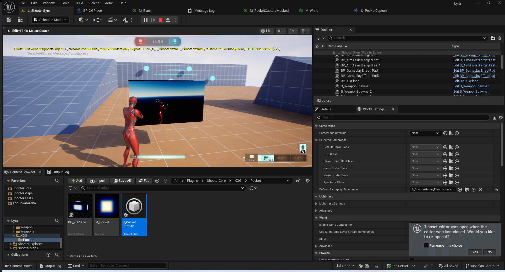
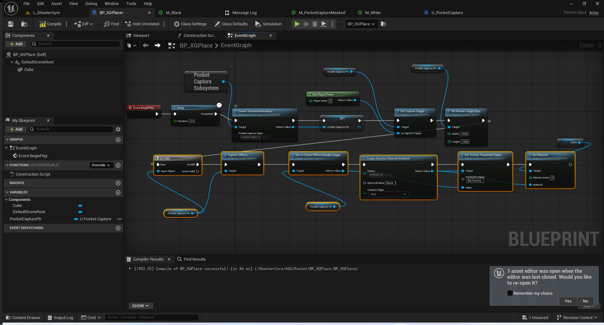
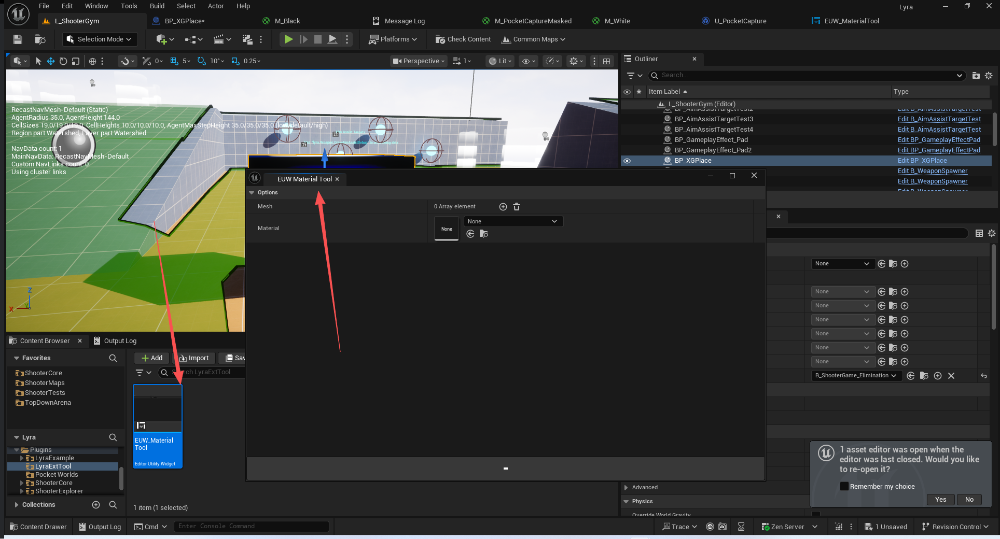

# UE5_Lyra学习指南_120_Pocket插件补充

本文章仅为小刚-B站课堂-虚幻引擎视频课程Lyra-精讲的演讲手稿.  
本套课程链接:[[UE5]虚幻引擎游戏案例Lyra精讲](https://www.bilibili.com/cheese/play/ss112001159)  
前置课程链接:[[UE5]虚幻引擎UEC++从基础到进阶](https://www.bilibili.com/cheese/play/ss28043)  

文章内容由小刚撰写,采用了以下多种方式:  
1.口述转文字  
2.AI重构  
3.参考引擎源码  
4.Lyra工程源码  
5.结合社区论坛各位大佬的解析  

- [UE5\_Lyra学习指南\_120\_Pocket插件补充](#ue5_lyra学习指南_120_pocket插件补充)
	- [参考文献](#参考文献)
	- [概述](#概述)
	- [缩略图](#缩略图)
		- [创建口袋捕获](#创建口袋捕获)
		- [初始化SceneCaputre](#初始化scenecaputre)
		- [创建画布](#创建画布)
		- [设置画布大小](#设置画布大小)
		- [设置捕获目标](#设置捕获目标)
		- [捕获场景](#捕获场景)
	- [关卡流送](#关卡流送)
		- [口袋关卡定义](#口袋关卡定义)
		- [流送到目标](#流送到目标)
		- [监听流送进程](#监听流送进程)
		- [切换](#切换)
		- [回收](#回收)
	- [LyraExtTool](#lyraexttool)
	- [CommonGame](#commongame)
	- [占点信息定义](#占点信息定义)
	- [总结](#总结)

## 参考文献
[UE5 SceneCaptureComponent2D 详解](https://zhuanlan.zhihu.com/p/1997261465430808014?share_code=4ioVLV4o3Dco&utm_psn=1997287741835196289)

## 概述
本文主要简单了解Pocket插件即可.


## 缩略图
这个主要是USceneCaptureComponent2D.


### 创建口袋捕获
``` cpp
UPocketCapture* UPocketCaptureSubsystem::CreateThumbnailRenderer(TSubclassOf<UPocketCapture> ThumbnailRendererClass)
{
	UPocketCapture* Renderer = NewObject<UPocketCapture>(this, ThumbnailRendererClass);

	int32 RendererEmptyIndex = ThumbnailRenderers.IndexOfByKey(nullptr);
	if (RendererEmptyIndex == INDEX_NONE)
	{
		RendererEmptyIndex = ThumbnailRenderers.Add(Renderer);
	}
	else
	{
		ThumbnailRenderers[RendererEmptyIndex] = Renderer;
	}

	Renderer->Initialize(GetWorld(), RendererEmptyIndex);

	return Renderer;
}

```
### 初始化SceneCaputre
``` cpp
void UPocketCapture::Initialize(UWorld* InWorld, int32 InRendererIndex)
{
	PrivateWorld = InWorld;
	RendererIndex = InRendererIndex;

	CaptureComponent = NewObject<USceneCaptureComponent2D>(this, "Thumbnail_Capture_Component");
	CaptureComponent->RegisterComponentWithWorld(InWorld);
	CaptureComponent->bConsiderUnrenderedOpaquePixelAsFullyTranslucent = true;
	CaptureComponent->PrimitiveRenderMode = ESceneCapturePrimitiveRenderMode::PRM_UseShowOnlyList;
	CaptureComponent->bCaptureEveryFrame = false;
	CaptureComponent->bCaptureOnMovement = false;
	CaptureComponent->bAlwaysPersistRenderingState = true;

	//UE_LOG(LogPocketLevels, Log, TEXT("ThumbnailRenderer: Initialize:%s"), *GetName());
}
```
### 创建画布
``` cpp
UTextureRenderTarget2D* UPocketCapture::GetOrCreateDiffuseRenderTarget()
{
	if (DiffuseRT == nullptr)
	{
		DiffuseRT = NewObject<UTextureRenderTarget2D>(this, TEXT("ThumbnailRenderer_Diffuse"));
		DiffuseRT->RenderTargetFormat = RTF_RGBA8;
		DiffuseRT->InitAutoFormat(SurfaceWidth, SurfaceHeight);
		DiffuseRT->UpdateResourceImmediate(true);
	}

	return DiffuseRT;
}
```
### 设置画布大小
``` cpp
void UPocketCapture::SetRenderTargetSize(int32 Width, int32 Height)
{
	if (SurfaceWidth != Width || SurfaceHeight != Height)
	{
		SurfaceWidth = Width;
		SurfaceHeight = Height;

		if (DiffuseRT)
		{
			DiffuseRT->ResizeTarget(SurfaceWidth, SurfaceHeight);
		}

		if (AlphaMaskRT)
		{
			AlphaMaskRT->ResizeTarget(SurfaceWidth, SurfaceHeight);
		}

		if (EffectsRT)
		{
			EffectsRT->ResizeTarget(SurfaceWidth, SurfaceHeight);
		}
	}

	//UE_LOG(LogPocketLevels, Log, TEXT("ThumbnailRenderer: SetRenderTargetSize:%dx%d"), Width, Height);
}
```
### 设置捕获目标
``` cpp
void UPocketCapture::SetCaptureTarget(AActor* InCaptureTarget)
{
	CaptureTargetPtr = InCaptureTarget;

	OnCaptureTargetChanged(InCaptureTarget);
}

```
### 捕获场景
``` cpp
void UPocketCapture::CaptureDiffuse()
{
	if (UTextureRenderTarget2D* RenderTarget = GetOrCreateDiffuseRenderTarget())
	{
		TArray<AActor*> CaptureActors;
		if (AActor* CaptureTarget = CaptureTargetPtr.Get())
		{
			CaptureTarget->GetAttachedActors(CaptureActors);
			CaptureActors.Add(CaptureTarget);
		}

		CaptureScene(RenderTarget, CaptureActors, ESceneCaptureSource::SCS_FinalColorLDR, nullptr);
	}
}

```
``` cpp

bool UPocketCapture::CaptureScene(UTextureRenderTarget2D* InRenderTarget, const TArray<AActor*>& InCaptureActors, ESceneCaptureSource InCaptureSource, UMaterialInterface* OverrideMaterial)
{
	if (InRenderTarget == nullptr)
	{
		//UE_LOG(LogPocketLevels, Error, TEXT(""));
		return false;
	}

	if (AActor* CaptureTarget = CaptureTargetPtr.Get())
	{
		if (InCaptureActors.Num() > 0)
		{
			TArray<UPrimitiveComponent*> PrimitiveComponents = GatherPrimitivesForCapture(InCaptureActors);
			
			GetThumbnailSystem()->StreamThisFrame(PrimitiveComponents);

			TArray<UMaterialInterface*> OriginalMaterials;
			if (OverrideMaterial)
			{
				for (UPrimitiveComponent* PrimitiveComponent : PrimitiveComponents)
				{
					const int32 MaterialCount = PrimitiveComponent->GetNumMaterials();
					for (int32 MaterialIndex = 0; MaterialIndex < MaterialCount; MaterialIndex++)
					{
						OriginalMaterials.Add(PrimitiveComponent->GetMaterial(MaterialIndex));

						PrimitiveComponent->SetMaterial(MaterialIndex, OverrideMaterial);
					}
				}
			}

			UCameraComponent* Camera = CaptureTarget->FindComponentByClass<UCameraComponent>();
			if (ensure(Camera))
			{
				CaptureComponent->ShowOnlyActors = InCaptureActors;

				FMinimalViewInfo CaptureView;
				Camera->GetCameraView(0, CaptureView);

				// We need to make sure the texture streamer takes into account this new location,
				// this request only lasts for one tick, so we call it every time we need to draw, 
				// so that they stay resident.

				CaptureComponent->TextureTarget = InRenderTarget;
				CaptureComponent->PostProcessSettings = Camera->PostProcessSettings;
				CaptureComponent->SetCameraView(CaptureView);

				CaptureComponent->ShowFlags.SetDepthOfField(false);
				CaptureComponent->ShowFlags.SetMotionBlur(false);
				CaptureComponent->ShowFlags.SetScreenPercentage(false);
				CaptureComponent->ShowFlags.SetScreenSpaceReflections(false);
				CaptureComponent->ShowFlags.SetDistanceFieldAO(false);

				CaptureComponent->ShowFlags.SetLensFlares(false);
				CaptureComponent->ShowFlags.SetOnScreenDebug(false);
				//CaptureComponent->ShowFlags.SetEyeAdaptation(false);
				CaptureComponent->ShowFlags.SetColorGrading(false);
				CaptureComponent->ShowFlags.SetCameraImperfections(false);
				CaptureComponent->ShowFlags.SetVignette(false);
				CaptureComponent->ShowFlags.SetGrain(false);
				CaptureComponent->ShowFlags.SetSeparateTranslucency(false);
				CaptureComponent->ShowFlags.SetScreenPercentage(false);
				CaptureComponent->ShowFlags.SetScreenSpaceReflections(false);
				CaptureComponent->ShowFlags.SetTemporalAA(false);
				// might cause reallocation if we render rarely to it - for now off
				CaptureComponent->ShowFlags.SetAmbientOcclusion(false);
				// Requires resources in the FScene, which get reallocated for every temporary scene if enabled
				CaptureComponent->ShowFlags.SetIndirectLightingCache(false);
				CaptureComponent->ShowFlags.SetLightShafts(false);
				CaptureComponent->ShowFlags.SetPostProcessMaterial(false);
				CaptureComponent->ShowFlags.SetHighResScreenshotMask(false);
				CaptureComponent->ShowFlags.SetHMDDistortion(false);
				CaptureComponent->ShowFlags.SetStereoRendering(false);
				CaptureComponent->ShowFlags.SetVolumetricFog(false);
				CaptureComponent->ShowFlags.SetVolumetricLightmap(false);
				CaptureComponent->ShowFlags.SetSkyLighting(false);

				CaptureComponent->CaptureSource = InCaptureSource;
				CaptureComponent->ProfilingEventName = TEXT("Pocket Capture");
				CaptureComponent->CaptureScene();

				if (OriginalMaterials.Num() > 0)
				{
					int32 TotalMaterialIndex = 0;
					for (UPrimitiveComponent* PrimitiveComponent : PrimitiveComponents)
					{
						const int32 MaterialCount = PrimitiveComponent->GetNumMaterials();
						for (int32 MaterialIndex = 0; MaterialIndex < MaterialCount; MaterialIndex++)
						{
							PrimitiveComponent->SetMaterial(MaterialIndex, OriginalMaterials[TotalMaterialIndex]);
							TotalMaterialIndex++;
						}
					}
				}

				return true;
			}
		}
		else
		{
			//UE_LOG(LogPocketLevels, Warning, TEXT("UPocketCapture: %s CaptureScene Failed: No Capture Actors"), *GetName());
		}
	}
	else
	{
		//UE_LOG(LogPocketLevels, Warning, TEXT("UPocketCapture: %s CaptureScene Failed: No Capture Target"), *GetName());
	}

	return false;
}

```
## 关卡流送
### 口袋关卡定义
``` cpp
/**
 * 
 */
UCLASS(MinimalAPI)
class UPocketLevel : public UDataAsset
{
	GENERATED_BODY()

public:
	UE_API UPocketLevel();

public:
	// The level that will be streamed in for this pocket level.
	// 此口袋层级将要传输的层级级别。
	UPROPERTY(EditAnywhere, Category = "Streaming")
	TSoftObjectPtr<UWorld> Level;
	
	// The bounds of the pocket level so that we can create multiple instances without overlapping each other.
	// 确定口袋区域的边界，以便我们能够创建多个独立的实例，且这些实例不会相互重叠。
	UPROPERTY(EditAnywhere, Category = "Streaming")
	FVector Bounds;	
};

```
### 流送到目标
``` cpp


UPocketLevelInstance* UPocketLevelSubsystem::GetOrCreatePocketLevelFor(ULocalPlayer* LocalPlayer, UPocketLevel* PocketLevel, FVector DesiredSpawnPoint)
{
	if (PocketLevel == nullptr)
	{
		return nullptr;
	}

	float VerticalBoundsOffset = 0;
	for (UPocketLevelInstance* Instance : PocketInstances)
	{
		if (Instance->LocalPlayer == LocalPlayer && Instance->PocketLevel == PocketLevel)
		{
			return Instance;
		}

		VerticalBoundsOffset += Instance->PocketLevel->Bounds.Z;
	}

	const FVector SpawnPoint = DesiredSpawnPoint + FVector(0, 0, VerticalBoundsOffset);

	UPocketLevelInstance* NewInstance = NewObject<UPocketLevelInstance>(this);
	NewInstance->Initialize(LocalPlayer, PocketLevel, SpawnPoint);

	PocketInstances.Add(NewInstance);

	return NewInstance;
}
```
### 监听流送进程
``` cpp

bool UPocketLevelInstance::Initialize(ULocalPlayer* InLocalPlayer, UPocketLevel* InPocketLevel, FVector InSpawnPoint)
{
	LocalPlayer = InLocalPlayer;
	World = LocalPlayer->GetWorld();
	PocketLevel = InPocketLevel;
	Bounds = FBoxSphereBounds(FSphere(InSpawnPoint, PocketLevel->Bounds.GetAbsMax()));

	if (ensure(StreamingPocketLevel == nullptr))
	{
		if (ensure(!PocketLevel->Level.IsNull()))
		{
			bool bSuccess = false;
			StreamingPocketLevel = ULevelStreamingDynamic::LoadLevelInstanceBySoftObjectPtr(LocalPlayer, PocketLevel->Level, Bounds.Origin, FRotator::ZeroRotator, bSuccess);

			if (ensure(bSuccess && StreamingPocketLevel))
			{
				StreamingPocketLevel->OnLevelLoaded.AddUniqueDynamic(this, &ThisClass::HandlePocketLevelLoaded);
				StreamingPocketLevel->OnLevelShown.AddUniqueDynamic(this, &ThisClass::HandlePocketLevelShown);
			}

			return bSuccess;
		}
	}

	return false;
}

```
``` cpp

void UPocketLevelInstance::HandlePocketLevelLoaded()
{
	if (StreamingPocketLevel)
	{
		// Make everything in the level setup so that it's setup on the client, and we treat
		// everything as locally spawned, rather than bExchangedRoles = true, where it's spawned
		// on the client, but the expectation is the server said do it, and the server is going to 
		// be telling us about them later.
		// 将关卡中的所有设置都设为在客户端上完成，我们将所有内容视为本地生成的，而不是通过 bExchangedRoles = true 实现的，后者是生成在客户端上，但预期是服务器指示要这样做，然后服务器会在之后告知我们相关情况。
		if (ULevel* LoadedLevel = StreamingPocketLevel->GetLoadedLevel())
		{
			LoadedLevel->bClientOnlyVisible = true;

			for (AActor* Actor : LoadedLevel->Actors)
			{
				if (Actor)
				{
					Actor->bExchangedRoles = true;  // HACK, Remove when bClientOnlyVisible is all we need.
				}
			}

			// TODO: Don't put ownership over shared pocket spaces.
			if (LocalPlayer)
			{
				if (APlayerController* PC = LocalPlayer->GetPlayerController(GetWorld()))
				{
					for (AActor* Actor : LoadedLevel->Actors)
					{
						if (Actor)
						{
							Actor->SetOwner(PC);
						}
					}
				}
			}
		}
	}
}
```
``` cpp
DECLARE_MULTICAST_DELEGATE_OneParam(FPocketLevelInstanceEvent, UPocketLevelInstance*);
	FPocketLevelInstanceEvent OnReadyEvent;
void UPocketLevelInstance::HandlePocketLevelShown()
{
	OnReadyEvent.Broadcast(this);
}

```
``` cpp
FDelegateHandle UPocketLevelInstance::AddReadyCallback(FPocketLevelInstanceEvent::FDelegate Callback)
{
	if (StreamingPocketLevel->GetLevelStreamingState() == ELevelStreamingState::LoadedVisible)
	{
		Callback.ExecuteIfBound(this);
	}
	
	return OnReadyEvent.Add(Callback);
}
```
### 切换
``` cpp
void UPocketLevelInstance::StreamIn()
{
	if (StreamingPocketLevel)
	{
		StreamingPocketLevel->SetShouldBeVisible(true);
		StreamingPocketLevel->SetShouldBeLoaded(true);
	}
}

void UPocketLevelInstance::StreamOut()
{
	if (StreamingPocketLevel)
	{
		StreamingPocketLevel->SetShouldBeVisible(false);
		StreamingPocketLevel->SetShouldBeLoaded(false);
	}
}


```

### 回收
``` cpp
void UPocketLevelInstance::BeginDestroy()
{
	Super::BeginDestroy();

	if (StreamingPocketLevel)
	{
		StreamingPocketLevel->bShouldBlockOnUnload = false;
		StreamingPocketLevel->SetShouldBeLoaded(false);
		StreamingPocketLevel->OnLevelShown.RemoveAll(this);
		StreamingPocketLevel->OnLevelLoaded.RemoveAll(this);
		StreamingPocketLevel = nullptr;
	}
}
```
## LyraExtTool

``` cpp
bool UBPFunctionLibrary::ChangeMeshMaterials(TArray<UStaticMesh*> Mesh, UMaterialInterface* Material)
{

	for (int i = 0; i < Mesh.Num(); i++)
	{
		Mesh[i]->Modify();
		TArray<FStaticMaterial>& Mats = Mesh[i]->GetStaticMaterials();
		for (int j = 0; j < Mats.Num(); j++)
		{
			Mats[j].MaterialInterface = Material;

		}
		Mesh[i]->PostEditChange();
	}
	return true;
}


```
## CommonGame
有注意到这个类没用用到.所以略过了
``` cpp
UCLASS(MinimalAPI, Abstract, BlueprintType, Blueprintable, meta = (DisableNativeTick))
class UCommonPlayerInputKey : public UCommonUserWidget
{
	GENERATED_BODY()

public:
	UE_API UCommonPlayerInputKey(const FObjectInitializer& ObjectInitializer);

	/** Update the key and associated display based on our current Boundaction */
	UFUNCTION(BlueprintCallable, Category = "Keybind Widget")
	UE_API void UpdateKeybindWidget();

	/** Set the bound key for our keybind */
	UFUNCTION(BlueprintCallable, Category = "Keybind Widget")
	UE_API void SetBoundKey(FKey NewBoundAction);

	/** Set the bound action for our keybind */
	UFUNCTION(BlueprintCallable, Category = "Keybind Widget")
	UE_API void SetBoundAction(FName NewBoundAction);

	/** Force this keybind to be a hold keybind */
	UFUNCTION(BlueprintCallable, Category = "Keybind Widget")
	UE_API void SetForcedHoldKeybindStatus(ECommonKeybindForcedHoldStatus InForcedHoldKeybindStatus);

	/** Force this keybind to be a hold keybind */
	UFUNCTION(BlueprintCallable, Category = "Keybind Widget")
	UE_API void SetShowProgressCountDown(bool bShow);

	/** Set the axis scale value for this keybind */
	UFUNCTION(BlueprintCallable, Category = "Keybind Widget")
	void SetAxisScale(const float NewValue) { AxisScale = NewValue; }

	/** Set the preset name override value for this keybind. */
	UFUNCTION(BlueprintCallable, Category = "Keybind Widget")
	void SetPresetNameOverride(const FName NewValue) { PresetNameOverride = NewValue; }

	/** Our current BoundAction */
	UPROPERTY(EditAnywhere, BlueprintReadOnly, Category = "Keybind Widget")
	FName BoundAction;

	/** Scale to read when using an axis Mapping */
	UPROPERTY(EditAnywhere, BlueprintReadOnly, Category = "Keybind Widget")
	float AxisScale;

	/** Key this widget is bound to set directly in blueprint. Used when we want to reference a specific key instead of an action. */
	UPROPERTY(EditAnywhere, BlueprintReadOnly, Category = "Keybind Widget")
	FKey BoundKeyFallback;

	/** Allows us to set the input type explicitly for the keybind widget. */
	UPROPERTY(EditAnywhere, BlueprintReadWrite, Category = "Keybind Widget")
	ECommonInputType InputTypeOverride;

	/** Allows us to set the preset name explicitly for the keybind widget. */
	UPROPERTY(EditAnywhere, BlueprintReadWrite, Category = "Keybind Widget")
	FName PresetNameOverride;

	/** Setting that can show this keybind as a hold or never show it as a hold (even if it is) */
	UPROPERTY(EditAnywhere, BlueprintReadOnly, Category = "Keybind Widget")
	ECommonKeybindForcedHoldStatus ForcedHoldKeybindStatus;

	/** Called through a delegate when we start hold progress */
	UFUNCTION()
	UE_API void StartHoldProgress(FName HoldActionName, float HoldDuration);

	/** Called through a delegate when we stop hold progress */
	UFUNCTION()
	UE_API void StopHoldProgress(FName HoldActionName, bool bCompletedSuccessfully);

	/** Get whether this keybind is a hold action. */
	UFUNCTION(BlueprintCallable, Category = "Keybind Widget")
	bool IsHoldKeybind() const { return bIsHoldKeybind; }

	UFUNCTION()
	bool IsBoundKeyValid() const { return BoundKey.IsValid(); }

protected:
	UE_API virtual void NativePreConstruct() override;
	UE_API virtual void NativeConstruct() override;
	UE_API virtual int32 NativePaint(const FPaintArgs& Args, const FGeometry& AllottedGeometry, const FSlateRect& MyCullingRect, FSlateWindowElementList& OutDrawElements, int32 LayerId, const FWidgetStyle& InWidgetStyle, bool bParentEnabled) const override;
	UE_API void RecalculateDesiredSize();

	/** Overridden to destroy our MID */
	UE_API virtual void NativeDestruct() override;

	/** Whether or not this keybind widget is currently set to be a hold keybind */
	UPROPERTY(EditDefaultsOnly, BlueprintReadOnly, Category = "Keybind Widget", meta=(ScriptName = "IsHoldKeybindValue"))
	bool bIsHoldKeybind;

	/**  */
	UPROPERTY(Transient)
	bool bShowKeybindBorder;

	UPROPERTY(Transient)
	FVector2D FrameSize;

	UPROPERTY(BlueprintReadOnly, Category = "Keybind Widget")
	bool bShowTimeCountDown;

	/** Derived Key this widget is bound to */
	UPROPERTY(BlueprintReadOnly, Category = "Keybind Widget")
	FKey BoundKey;

	/** Material for showing Progress */
	UPROPERTY(EditDefaultsOnly, Category = "Keybind Widget")
	FSlateBrush HoldProgressBrush;

	/** The key bind text border. */
	UPROPERTY(EditDefaultsOnly, Category = "Keybind Widget")
	FSlateBrush KeyBindTextBorder;

	/** Should this keybinding widget display information that it is currently unbound? */
	UPROPERTY(EditAnywhere, Category = "Keybind Widget")
	bool bShowUnboundStatus = false;

	/** The font to apply at each size */
	UPROPERTY(EditDefaultsOnly, Category = "Font")
	FSlateFontInfo KeyBindTextFont;

	/** The font to apply at each size */
	UPROPERTY(EditDefaultsOnly, Category = "Font")
	FSlateFontInfo CountdownTextFont;

	UPROPERTY(Transient)
	FMeasuredText CountdownText;

	UPROPERTY(Transient)
	FMeasuredText KeybindText;

	UPROPERTY(Transient)
	FMargin KeybindTextPadding;

	UPROPERTY(Transient)
	FVector2D KeybindFrameMinimumSize;

	/** The material parameter name for hold percentage in the HoldKeybindImage */
	UPROPERTY(EditDefaultsOnly, Category = "Keybind Widget")
	FName PercentageMaterialParameterName;	

	/** MID for the progress percentage */
	UPROPERTY(Transient)
	TObjectPtr<UMaterialInstanceDynamic> ProgressPercentageMID;

	UE_API virtual void NativeOnInitialized() override;

private:
	/**
	 * Synchronizes the hold progress to whatever is currently set in the
	 * owning player controller.
	 */
	UE_API void SyncHoldProgress();

	/** Called for updating the HoldKeybindImage during a hold keybind */
	UE_API void UpdateHoldProgress();

	/** Called when we want to set up this keybind widget as a hold keybind */
	UE_API void SetupHoldKeybind();

	UE_API void ShowHoldBackPlate();

	UE_API void HandlePlayerControllerSet(UCommonLocalPlayer* LocalPlayer, APlayerController* PlayerController);

	/** Time when we started using a hold keybind */
	float HoldKeybindStartTime = 0;

	/** How long, in seconds, we will be doing a hold keybind */
	float HoldKeybindDuration = 0;

	bool bDrawProgress = false;
	bool bDrawBrushForKey = false;
	bool bDrawCountdownText = false;
	bool bWaitingForPlayerController = false;

	UPROPERTY(Transient)
	FSlateBrush CachedKeyBrush;
};

```
## 占点信息定义
ControlPointStatusMessage.h
``` cpp

// Message indicating the state of a control point is changing
USTRUCT(BlueprintType)
struct FLyraControlPointStatusMessage
{
	GENERATED_BODY()

	UPROPERTY(BlueprintReadWrite, Category=Gameplay)
	TObjectPtr<AActor> ControlPoint = nullptr;

	UPROPERTY(BlueprintReadWrite, Category=Gameplay)
	int32 OwnerTeamID = 0;
};

```
## 总结
了解即可
